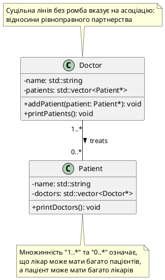
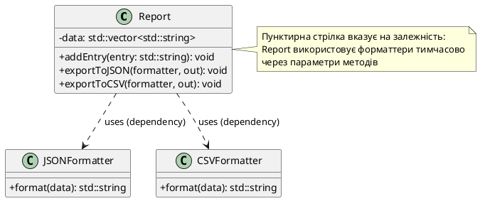

## Від строгого володіння до рівноправного партнерства

На попередній лекції ми детально вивчили два типи відносин, які моделюють **володіння**: композицію (нерозривна приналежність частини до цілого) та агрегацію (слабке володіння без контролю життєвого циклу). Обидва ці патерни ґрунтуються на ідеї ієрархії: існує «батьківський» об'єкт-контейнер, який містить «дочірні» частини та певною мірою керує їхнім існуванням.

Проте реальні програмні системи не завжди вписуються у модель «контейнер-частина». Часто ми маємо справу з об'єктами, які взаємодіють як **рівноправні партнери** без концепції володіння: лікар консультує пацієнта, але жоден із них не «належить» іншому; студент записується на курс, але курс не створює студента і не знищує його після завершення семестру; автомобіль зареєстрований на водія, але водій існує незалежно від автомобіля.

Такі відносини моделюються через **асоціацію** (*association*) — тип зв'язку, у якому об'єкти знають один про одного та можуть взаємодіяти, але не контролюють життєві цикли один одного. Асоціація є більш гнучкою, але й більш складною у реалізації, оскільки вимагає координації між об'єктами, які не мають чіткої ієрархії «власник-підлеглий».

Крім асоціації, існує ще слабший тип зв'язку — **залежність** (*dependency*), коли один об'єкт **тимчасово використовує** функціональність іншого для виконання конкретної операції, але не зберігає на нього постійного посилання. Це найлегший і найменш зобов'язуючий тип відносин, який не впливає на структуру класу, але впливає на компіляційні залежності та тестованість коду.

::note
**Еволюція зв'язків від сильних до слабких**: Якщо розмістити всі типи відносин на шкалі від найсильніших до найслабших, ми отримаємо: **Композиція** (найсильніший зв'язок, ціле повністю володіє частиною) → **Агрегація** (слабше володіння, частина існує незалежно) → **Асоціація** (рівноправне партнерство без володіння) → **Залежність** (тимчасове використання без збереження зв'язку). Розуміння цієї градації критично важливе для проєктування гнучких систем.

::

## Асоціація: рівноправні партнери без концепції володіння

**Асоціація** (*association*) — це структурний зв'язок між двома класами, який моделює відношення **«використовує»** (*uses-a*) або **«пов'язаний з»** (*related-to*), але без семантики володіння чи контролю життєвого циклу. Об'єкти в асоціації є **незалежними сутностями**, які знають про існування один одного та можуть викликати методи один одного, але жоден із них не відповідає за створення чи знищення іншого.

### Формальні ознаки асоціації

Відношення між класами кваліфікується як асоціація, якщо виконуються наступні умови:

1. **Об'єкти не пов'язані відносинами «ціле-частина»**: На відміну від композиції та агрегації, де одна сутність є частиною іншої, в асоціації обидва об'єкти є самостійними концептуальними одиницями. Лікар і пацієнт, студент і курс, автомобіль і водій — жоден із них не є «частиною» іншого.

2. **Об'єкт може одночасно бути пов'язаним з багатьма іншими об'єктами**: Лікар може приймати десятки пацієнтів, пацієнт може звертатися до кількох лікарів. Студент може бути зареєстрований на п'ять курсів, а курс може мати сто студентів. Це багато-до-багатьох (*many-to-many*) відношення, що принципово відрізняється від композиції, де частина належить рівно одному цілому.

3. **Життєві цикли об'єктів незалежні**: Об'єкти створюються окремо, існують окремо і знищуються окремо. Закриття курсу не призводить до видалення студентів, звільнення лікаря не знищує його пацієнтів. Кожен об'єкт керується власною логікою або зовнішньою системою, а не партнером по асоціації.

4. **Зв'язок може бути односпрямованим або двоспрямованим**: На відміну від композиції та агрегації, які завжди односпрямовані (контейнер знає про частини, але частини не знають про контейнер), асоціація допускає взаємну обізнаність. Лікар знає своїх пацієнтів, і пацієнти знають своїх лікарів — це двоспрямована асоціація (*bidirectional association*).

::tip
**Тест на асоціацію**: Якщо ви можете сказати «Об'єкт A **використовує/взаємодіє з** об'єктом B, але **не створює** і **не володіє** ним», це сигнал асоціації. Якщо додатково об'єкт B також знає про A і взаємодіє з ним — це двоспрямована асоціація.

::

### Відмінності від композиції та агрегації

Хоча асоціація може здатися схожою на агрегацію (обидві дозволяють незалежне існування об'єктів), між ними є фундаментальна різниця у семантиці:

**Агрегація**: Моделює відношення **«володіє»** (*has-a*). Контейнер **має** частини, хоча і не створює їх. Університетський факультет **має** викладачів, бібліотека **має** книги. Існує асиметрія: контейнер — це «головний» об'єкт, а частини — «підпорядковані» йому сутності.

**Асоціація**: Моделює відношення **«пов'язаний з»** (*related-to*) або **«використовує»** (*uses-a*) без асиметрії. Лікар **пов'язаний з** пацієнтом, студент **записаний на** курс. Немає «головного» та «підпорядкованого» — обидва об'єкти рівноправні.

Практична різниця: у агрегації контейнер часто надає методи для додавання/видалення частин (`department.addWorker()`), що підкреслює його активну роль. В асоціації зв'язок може встановлюватися ззовні через третю сутність (наприклад, клас `Appointment` створює зв'язок між `Doctor` і `Patient`).

## Односпрямована асоціація: коли лише одна сторона знає про зв'язок

Найпростіша форма асоціації — **односпрямована** (*unidirectional*), коли об'єкт класу A знає про існування об'єкта класу B і може викликати його методи, але B не має інформації про A. Це аналогічно агрегації, але без семантики володіння.

### Приклад: студент записується на курс

Розглянемо систему управління університетом, де студенти можуть записуватися на курси. Студент знає, які курси він відвідує, але курс не зберігає список студентів (припустімо, це робить окрема реєстраційна система).

```cpp
#include <iostream>
#include <string>
#include <vector>

// Клас Course (Курс) — автономна сутність
class Course
{
private:
    std::string name;
    std::string code;  // Унікальний код курсу, наприклад "CS101"

public:
    Course(const std::string& courseName, const std::string& courseCode)
        : name(courseName), code(courseCode)
    {
        std::cout << "Course " << code << " created\n";
    }

    ~Course()
    {
        std::cout << "Course " << code << " archived\n";
    }

    std::string getName() const { return name; }
    std::string getCode() const { return code; }
};

// Клас Student (Студент) має односпрямовану асоціацію з Course
class Student
{
private:
    std::string name;
    std::vector<Course*> enrolledCourses;  // Асоціація: покажчики на зовнішні курси

public:
    Student(const std::string& studentName)
        : name(studentName)
    {
        std::cout << "Student " << name << " registered\n";
    }

    ~Student()
    {
        std::cout << "Student " << name << " graduated\n";
        // НЕ видаляємо курси — студент не володіє ними (асоціація, не агрегація)
    }

    void enrollIn(Course* course)
    {
        enrolledCourses.push_back(course);
        std::cout << name << " enrolled in " << course->getCode() << "\n";
    }

    void printSchedule() const
    {
        std::cout << name << "'s schedule:\n";
        for (const auto* course : enrolledCourses) {
            std::cout << "  - " << course->getCode() << ": " << course->getName() << "\n";
        }
    }
};
```

Використання:

```cpp
int main()
{
    // Створюємо курси незалежно від студентів
    Course* dataStructures = new Course("Data Structures", "CS201");
    Course* algorithms = new Course("Algorithms", "CS301");

    {
        // Створюємо студента та записуємо його на курси
        Student alice("Alice Johnson");
        alice.enrollIn(dataStructures);
        alice.enrollIn(algorithms);

        alice.printSchedule();

        // Студент знищується при виході зі scope
    }

    std::cout << "\nCourses still exist after student graduated:\n";
    std::cout << "  - " << dataStructures->getCode() << ": " << dataStructures->getName() << "\n";

    // Курси знищуються вручну (вони керуються іншою підсистемою)
    delete dataStructures;
    delete algorithms;

    return 0;
}
```

::terminal-preview{title="./university_system" :cursor="false"}
<div class="line">Course CS201 created</div>
<div class="line">Course CS301 created</div>
<div class="line">Student Alice Johnson registered</div>
<div class="line">Alice Johnson enrolled in CS201</div>
<div class="line">Alice Johnson enrolled in CS301</div>
<div class="line">Alice Johnson's schedule:</div>
<div class="line">  - CS201: Data Structures</div>
<div class="line">  - CS301: Algorithms</div>
<div class="line">Student Alice Johnson graduated</div>
<div class="line"></div>
<div class="line">Courses still exist after student graduated:</div>
<div class="line">  - CS201: Data Structures</div>
<div class="line">Course CS201 archived</div>
<div class="line">Course CS301 archived</div>
::

Аналіз відносин:

- **Незалежне існування**: Курси створюються до того, як студент записується на них, і продовжують існувати після того, як студент завершує навчання.
- **Односпрямованість**: Студент знає про свої курси (зберігає покажчики в `enrolledCourses`), але курс не знає, хто на нього записаний. Якби нам потрібна була ця інформація, ми б додали її в інший клас (наприклад, `EnrollmentRegistry`).
- **Відсутність володіння**: Деструктор `~Student()` не викликає `delete` для курсів, оскільки студент не створював їх і не несе відповідальності за їхнє знищення.

::note
**Односпрямована асоціація vs агрегація**: Технічно, односпрямована асоціація дуже схожа на агрегацію у реалізації (обидві зберігають покажчики на зовнішні об'єкти). Різниця головним чином **семантична**: агрегація підкреслює відношення «володіє», тоді як асоціація підкреслює «використовує» або «пов'язаний з». У деяких методологіях проєктування ці терміни навіть використовуються як синоніми.

::


## Двоспрямована асоціація: взаємна обізнаність та її складнощі

**Двоспрямована асоціація** (*bidirectional association*) виникає, коли обидва класи знають про існування один одного та зберігають посилання (покажчики або reference wrappers) для взаємодії. Це найскладніша форма асоціації, оскільки вимагає координації при встановленні та розриві зв'язків, а також створює циклічні залежності між заголовковими файлами.

### Проблема циклічних включень та випереджальне оголошення

Припустімо, ми хочемо реалізувати двоспрямовану асоціацію між `Doctor` і `Patient`: лікар знає своїх пацієнтів, і кожен пацієнт знає своїх лікарів. Наївна спроба виглядала б так:

```cpp
// ❌ Це не скомпілюється!

// Doctor.h
#include "Patient.h"  // Doctor потребує повного визначення Patient

class Doctor
{
private:
    std::vector<Patient*> patients;
    // ...
};

// Patient.h
#include "Doctor.h"  // Patient потребує повного визначення Doctor

class Patient
{
private:
    std::vector<Doctor*> doctors;
    // ...
};
```

**Проблема**: Коли компілятор обробляє `Doctor.h`, він намагається включити `Patient.h`, який у свою чергу включає `Doctor.h` назад. Навіть із include guards (`#ifndef`, `#pragma once`) це призводить до того, що один із класів залишається неоголошеним на момент, коли інший клас намагається використати покажчик на нього.

**Розв'язання**: **Випереджальне оголошення** (*forward declaration*) — техніка, коли ми повідомляємо компілятору про існування класу без надання його повного визначення. Це дозволяє оголошувати покажчики та посилання на клас, але не дозволяє створювати об'єкти за значенням або викликати методи (для цього потрібне повне визначення).

### Реалізація двоспрямованої асоціації: лікар і пацієнт

```cpp
#include <iostream>
#include <string>
#include <vector>

// Випереджальне оголошення: повідомляємо компілятору, що клас Doctor існує
class Doctor;

class Patient
{
private:
    std::string name;
    std::vector<Doctor*> doctors;  // Покажчики на лікарів (асоціація)

    // Закритий метод для встановлення зв'язку з боку пацієнта
    // Він буде викликаний зсередини Doctor::addPatient()
    void addDoctor(Doctor* doctor)
    {
        doctors.push_back(doctor);
    }

public:
    Patient(const std::string& patientName)
        : name(patientName)
    {
    }

    std::string getName() const { return name; }

    void printDoctors() const;  // Реалізація після визначення Doctor

    // Робимо Doctor дружнім класом, щоб він міг викликати addDoctor()
    friend class Doctor;
};

class Doctor
{
private:
    std::string name;
    std::vector<Patient*> patients;

public:
    Doctor(const std::string& doctorName)
        : name(doctorName)
    {
    }

    std::string getName() const { return name; }

    // Метод встановлення двостороннього зв'язку
    void addPatient(Patient* patient)
    {
        // Лікар додає пацієнта у свій список
        patients.push_back(patient);

        // Пацієнт додає лікаря у свій список (через приватний метод)
        patient->addDoctor(this);

        std::cout << name << " accepted patient " << patient->getName() << "\n";
    }

    void printPatients() const
    {
        if (patients.empty()) {
            std::cout << "Dr. " << name << " has no patients\n";
            return;
        }

        std::cout << "Dr. " << name << "'s patients:\n";
        for (const auto* patient : patients) {
            std::cout << "  - " << patient->getName() << "\n";
        }
    }
};

// Реалізація методу Patient::printDoctors() після визначення Doctor
void Patient::printDoctors() const
{
    if (doctors.empty()) {
        std::cout << name << " has no doctors\n";
        return;
    }

    std::cout << name << "'s doctors:\n";
    for (const auto* doctor : doctors) {
        std::cout << "  - Dr. " << doctor->getName() << "\n";
    }
}
```

Використання:

```cpp
int main()
{
    // Створюємо лікарів та пацієнтів незалежно
    Patient* alice = new Patient("Alice Johnson");
    Patient* bob = new Patient("Bob Smith");
    Patient* carol = new Patient("Carol Davis");

    Doctor* drHouse = new Doctor("Gregory House");
    Doctor* drWilson = new Doctor("James Wilson");

    // Встановлюємо двоспрямовані зв'язки
    drHouse->addPatient(alice);
    drHouse->addPatient(bob);
    drWilson->addPatient(alice);  // Alice відвідує обох лікарів
    drWilson->addPatient(carol);

    std::cout << "\n=== Doctor Schedules ===\n";
    drHouse->printPatients();
    std::cout << "\n";
    drWilson->printPatients();

    std::cout << "\n=== Patient Medical Records ===\n";
    alice->printDoctors();
    std::cout << "\n";
    bob->printDoctors();

    // Звільнення пам'яті
    delete alice;
    delete bob;
    delete carol;
    delete drHouse;
    delete drWilson;

    return 0;
}
```

::terminal-preview{title="./medical_system" :cursor="false"}
<div class="line">Gregory House accepted patient Alice Johnson</div>
<div class="line">Gregory House accepted patient Bob Smith</div>
<div class="line">James Wilson accepted patient Alice Johnson</div>
<div class="line">James Wilson accepted patient Carol Davis</div>
<div class="line"></div>
<div class="line">=== Doctor Schedules ===</div>
<div class="line">Dr. Gregory House's patients:</div>
<div class="line">  - Alice Johnson</div>
<div class="line">  - Bob Smith</div>
<div class="line"></div>
<div class="line">Dr. James Wilson's patients:</div>
<div class="line">  - Alice Johnson</div>
<div class="line">  - Carol Davis</div>
<div class="line"></div>
<div class="line">=== Patient Medical Records ===</div>
<div class="line">Alice Johnson's doctors:</div>
<div class="line">  - Dr. Gregory House</div>
<div class="line">  - Dr. James Wilson</div>
<div class="line"></div>
<div class="line">Bob Smith's doctors:</div>
<div class="line">  - Dr. Gregory House</div>
::

Проаналізуємо технічні деталі реалізації:

**Випереджальне оголошення `class Doctor;`**: Дозволяє класу `Patient` оголосити поле `std::vector<Doctor*>` до того, як компілятор бачив повне визначення `Doctor`. Покажчики не вимагають знання розміру об'єкта, тому це працює.

**Закритий метод `Patient::addDoctor()`**: Ми не хочемо, щоб зовнішній код міг довільно додавати лікарів до пацієнта, оминаючи логіку встановлення двостороннього зв'язку. Тому метод закритий, а клас `Doctor` оголошений дружнім (`friend class Doctor`), щоб мати доступ до цього методу.

**Синхронізація зв'язків**: Метод `Doctor::addPatient()` виконує дві операції: додає пацієнта у список лікаря **і** викликає `patient->addDoctor(this)` для встановлення зворотного зв'язку. Це гарантує, що обидва об'єкти завжди синхронізовані.

**Реалізація методу після визначення класу**: Метод `Patient::printDoctors()` викликає `doctor->getName()`, тому йому потрібне повне визначення `Doctor`. Ми оголошуємо метод всередині класу `Patient`, але реалізуємо його після визначення `Doctor`.

::warning
**Небезпека двоспрямованих асоціацій**: Синхронізація двох списків покажчиків вимагає дисципліни. Якщо ви видалите пацієнта з `Doctor::patients`, але забудете видалити лікаря з `Patient::doctors`, структура даних стане несумісною. Для складних систем розгляньте винесення логіки зв'язку у окремий клас-менеджер (наприклад, `AppointmentRegistry`), який централізовано керує асоціаціями.

::

## Рефлексивна асоціація: об'єкти пов'язані з об'єктами свого класу

**Рефлексивна асоціація** (*reflexive association* або *self-association*) виникає, коли об'єкти класу пов'язані з іншими об'єктами того ж самого класу. Класичний приклад — дерево категорій, де кожна категорія може мати батьківську категорію; граф соціальних зв'язків, де користувач має друзів, які теж є користувачами; система курсів із пререквізитами, де курс вимагає завершення іншого курсу.

### Приклад: курси з обов'язковими умовами вступу

У системі управління навчальним закладом деякі курси можна відвідувати лише після проходження попередніх курсів. Наприклад, «Алгоритми» вимагають попереднього вивчення «Структур даних», які у свою чергу вимагають «Основ програмування».

```cpp
#include <iostream>
#include <string>
#include <vector>

class Course
{
private:
    std::string name;
    std::string code;
    std::vector<Course*> prerequisites;  // Рефлексивна асоціація

public:
    Course(const std::string& courseName, const std::string& courseCode)
        : name(courseName), code(courseCode)
    {
    }

    void addPrerequisite(Course* prerequisiteCourse)
    {
        prerequisites.push_back(prerequisiteCourse);
    }

    std::string getName() const { return name; }
    std::string getCode() const { return code; }

    void printPrerequisites() const
    {
        if (prerequisites.empty()) {
            std::cout << code << " (" << name << ") has no prerequisites\n";
            return;
        }

        std::cout << code << " (" << name << ") requires:\n";
        for (const auto* prereq : prerequisites) {
            std::cout << "  - " << prereq->getCode() << ": " << prereq->getName() << "\n";
        }
    }

    // Рекурсивна перевірка: чи можна записатися на курс, якщо пройдено completedCourses
    bool canEnroll(const std::vector<Course*>& completedCourses) const
    {
        for (const auto* prereq : prerequisites) {
            bool found = false;
            for (const auto* completed : completedCourses) {
                if (completed == prereq) {
                    found = true;
                    break;
                }
            }
            if (!found) {
                return false;  // Не пройдено обов'язковий курс
            }
        }
        return true;
    }
};
```

Використання:

```cpp
int main()
{
    // Створюємо ланцюжок курсів із пререквізитами
    Course introProgramming("Introduction to Programming", "CS101");
    Course dataStructures("Data Structures", "CS201");
    Course algorithms("Algorithms", "CS301");
    Course advancedAlgorithms("Advanced Algorithms", "CS401");

    // Встановлюємо рефлексивні асоціації
    dataStructures.addPrerequisite(&introProgramming);
    algorithms.addPrerequisite(&dataStructures);
    advancedAlgorithms.addPrerequisite(&algorithms);

    // Виводимо ланцюжок залежностей
    introProgramming.printPrerequisites();
    dataStructures.printPrerequisites();
    algorithms.printPrerequisites();
    advancedAlgorithms.printPrerequisites();

    // Перевіряємо можливість запису на курс
    std::cout << "\n=== Enrollment Check ===\n";
    std::vector<Course*> studentCompleted = {&introProgramming, &dataStructures};

    if (algorithms.canEnroll(studentCompleted)) {
        std::cout << "Student can enroll in " << algorithms.getCode() << "\n";
    } else {
        std::cout << "Student cannot enroll in " << algorithms.getCode() 
                  << " (missing prerequisites)\n";
    }

    if (advancedAlgorithms.canEnroll(studentCompleted)) {
        std::cout << "Student can enroll in " << advancedAlgorithms.getCode() << "\n";
    } else {
        std::cout << "Student cannot enroll in " << advancedAlgorithms.getCode()
                  << " (missing prerequisites)\n";
    }

    return 0;
}
```

::terminal-preview{title="./course_system" :cursor="false"}
<div class="line">CS101 (Introduction to Programming) has no prerequisites</div>
<div class="line">CS201 (Data Structures) requires:</div>
<div class="line">  - CS101: Introduction to Programming</div>
<div class="line">CS301 (Algorithms) requires:</div>
<div class="line">  - CS201: Data Structures</div>
<div class="line">CS401 (Advanced Algorithms) requires:</div>
<div class="line">  - CS301: Algorithms</div>
<div class="line"></div>
<div class="line">=== Enrollment Check ===</div>
<div class="line">Student can enroll in CS301</div>
<div class="line">Student cannot enroll in CS401 (missing prerequisites)</div>
::

Рефлексивна асоціація дозволяє моделювати **ієрархічні** або **графові** структури без введення додаткових класів. Це потужний інструмент для представлення рекурсивних відносин, але він вимагає обережності у запобіганні циклічним залежностям (наприклад, курс A вимагає курс B, який вимагає курс A — це безглузда ситуація, яку потрібно валідувати).

::tip
**Застосування рефлексивної асоціації**: Файлові системи (папка містить підпапки), організаційні структури (керівник і підлеглі — всі є співробітниками), категорії товарів у інтернет-магазині (категорія може мати батьківську категорію), системи коментарів (коментар може бути відповіддю на інший коментар).

::


## Непряма асоціація через ідентифікатори

У всіх попередніх прикладах асоціації ми використовували **прямі покажчики** для зв'язку об'єктів: клас зберігав `std::vector<OtherClass*>` для доступу до асоційованих об'єктів. Проте асоціація не вимагає обов'язкового зберігання покажчиків — зв'язок може бути реалізований **опосередковано** через ідентифікатори, ключі або інші форми посилань, які дозволяють знайти об'єкт у центральному сховищі.

### Мотивація: проблема довгострокових покажчиків

Уявіть систему управління автопарком, де водії орендують автомобілі. Якщо клас `Driver` зберігає прямий покажчик `Car* myCar`, виникають проблеми:

1. **Час життя об'єктів**: Якщо автомобіль видаляється з системи (відданий на ремонт, проданий), покажчик стає висячим.
2. **Серіалізація**: При збереженні стану програми у файл або базу даних неможливо серіалізувати адресу пам'яті — вона буде недійсною після перезапуску.
3. **Розподілені системи**: Якщо об'єкт знаходиться на іншому сервері або в іншому процесі, прямий покажчик не працює.

Розв'язання — **асоціація через ідентифікатори**: замість покажчика зберігати унікальний ідентифікатор (ID) об'єкта та отримувати доступ до об'єкта через централізоване сховище (реєстр, база даних, кеш).

### Реалізація: водій і автомобіль через CarRegistry

```cpp
#include <iostream>
#include <string>
#include <unordered_map>

class Car
{
private:
    std::string model;
    int id;  // Унікальний ідентифікатор автомобіля

public:
    Car(const std::string& carModel, int carID)
        : model(carModel), id(carID)
    {
    }

    std::string getModel() const { return model; }
    int getID() const { return id; }
};

// Централізоване сховище автомобілів (реєстр)
class CarRegistry
{
private:
    static std::unordered_map<int, Car*> cars;

public:
    // Видаляємо можливість створення екземплярів (статичний реєстр)
    CarRegistry() = delete;

    static void registerCar(Car* car)
    {
        cars[car->getID()] = car;
        std::cout << "Car " << car->getModel() << " (ID: " << car->getID() 
                  << ") registered\n";
    }

    static Car* getCarByID(int id)
    {
        auto it = cars.find(id);
        if (it != cars.end()) {
            return it->second;
        }
        return nullptr;  // Автомобіль не знайдено
    }

    static void unregisterCar(int id)
    {
        cars.erase(id);
        std::cout << "Car ID " << id << " unregistered\n";
    }
};

// Ініціалізація статичної змінної
std::unordered_map<int, Car*> CarRegistry::cars;

// Клас Driver зберігає лише ID автомобіля (непряма асоціація)
class Driver
{
private:
    std::string name;
    int assignedCarID;  // Асоціація через ідентифікатор

public:
    Driver(const std::string& driverName, int carID)
        : name(driverName), assignedCarID(carID)
    {
    }

    std::string getName() const { return name; }

    void drive()
    {
        // Отримуємо автомобіль з реєстру за ідентифікатором
        Car* car = CarRegistry::getCarByID(assignedCarID);

        if (car != nullptr) {
            std::cout << name << " is driving a " << car->getModel() << "\n";
        } else {
            std::cout << name << " couldn't find assigned car (ID: " 
                      << assignedCarID << ")\n";
        }
    }

    void reassignCar(int newCarID)
    {
        assignedCarID = newCarID;
        std::cout << name << " reassigned to car ID " << newCarID << "\n";
    }
};
```

Використання:

```cpp
int main()
{
    // Створюємо автомобілі та реєструємо їх у централізованому сховищі
    Car sedan("Toyota Camry", 101);
    Car suv("Honda CR-V", 202);

    CarRegistry::registerCar(&sedan);
    CarRegistry::registerCar(&suv);

    // Водій пов'язаний з автомобілем через ID, а не прямий покажчик
    Driver john("John Smith", 101);
    john.drive();

    // Перепризначаємо водія на інший автомобіль
    john.reassignCar(202);
    john.drive();

    // Видаляємо автомобіль із реєстру (симуляція ремонту)
    CarRegistry::unregisterCar(101);

    // Спроба використати видалений автомобіль безпечно обробляється
    Driver alice("Alice Johnson", 101);
    alice.drive();  // Повідомлення про помилку замість краху програми

    return 0;
}
```

::terminal-preview{title="./car_registry_demo" :cursor="false"}
<div class="line">Car Toyota Camry (ID: 101) registered</div>
<div class="line">Car Honda CR-V (ID: 202) registered</div>
<div class="line">John Smith is driving a Toyota Camry</div>
<div class="line">John Smith reassigned to car ID 202</div>
<div class="line">John Smith is driving a Honda CR-V</div>
<div class="line">Car ID 101 unregistered</div>
<div class="line">Alice Johnson couldn't find assigned car (ID: 101)</div>
::

Переваги непрямої асоціації через ідентифікатори:

**Перевага №1: Безпека відносно висячих посилань**  
Якщо об'єкт видаляється, метод `CarRegistry::getCarByID()` поверне `nullptr`, що дозволяє обробити ситуацію коректно, замість доступу до звільненої пам'яті.

**Перевага №2: Серіалізація та персистентність**  
Ціле число `assignedCarID` можна легко зберегти у файлі, базі даних або передати по мережі. При відновленні стану програми водій може знову «знайти» свій автомобіль через реєстр.

**Перевага №3: Динамічна зміна зв'язків**  
Перепризначення водія на інший автомобіль вимагає лише зміни числа, без необхідності оновлювати структури даних обох об'єктів (як у двоспрямованій асоціації).

**Перевага №4: Розподілені системи**  
Якщо автомобілі зберігаються в базі даних або на іншому сервері, ID може бути використаний для запиту даних через API.

::note
**Патерн Registry**: Клас `CarRegistry` реалізує патерн проєктування **Registry** (або **Object Pool**), який централізовано керує колекцією об'єктів і надає доступ до них за ключами. Це дозволяє уникнути прямих залежностей між класами та спрощує керування життєвими циклами.

::

## UML-діаграма асоціації: лінія без ромба

На відміну від композиції (зафарбований ромб `◆`) та агрегації (порожній ромб `◇`), асоціація в UML позначається **простою суцільною лінією** без ромба. Іноді на кінцях лінії вказують **множинність** (*multiplicity*) — скільки об'єктів одного класу може бути пов'язано з об'єктами іншого класу.

::plant-uml{alt="Асоціація: Doctor і Patient (багато-до-багатьох)"}



::

Інтерпретація множинності:

- **`1..*`** (один або більше): Лікар має принаймні одного пацієнта (у нашій спрощеній моделі; реально може бути `0..*`).
- **`0..*`** (нуль або більше): Пацієнт може мати нуль або більше лікарів.
- **`1`** (рівно один): Студент записаний на рівно один факультет.
- **`0..1`** (нуль або один): Співробітник має не більше одного прямого керівника.

Напрямок стрілки `treats >` вказує на семантику відношення, але не впливає на технічну реалізацію.

## Залежність: тимчасове використання без збереження зв'язку

**Залежність** (*dependency*) — це найслабший тип відносин між класами, який виникає, коли один клас **тимчасово використовує** функціональність іншого класу для виконання операції, але **не зберігає** на нього постійного посилання у вигляді поля-члена. Залежність існує на рівні методів, а не на рівні структури класу.

### Формальні ознаки залежності

Відношення є залежністю, якщо:

1. **Відсутність постійного зв'язку на рівні класу**: Клас не має поля-члена типу іншого класу. Посилання на інший об'єкт існує лише локально у методі.

2. **Тимчасовість використання**: Об'єкт використовується для виконання конкретної операції і «забувається» після завершення методу.

3. **Односпрямованість**: Залежність завжди односпрямована — клас A використовує клас B, але B не знає про A.

4. **Реалізація через параметри методів або локальні змінні**: Найчастіше залежність виражається через передачу об'єкта як аргументу методу або створення локальної змінної всередині методу.

### Приклад: клас використовує `std::ostream` для виводу

Найкласичніший приклад залежності в C++ — це перевантаження оператора виводу, коли клас використовує `std::ostream` для друку, але не зберігає потік як поле:

```cpp
#include <iostream>
#include <string>

class Point
{
private:
    double x;
    double y;

public:
    Point(double xCoord, double yCoord)
        : x(xCoord), y(yCoord)
    {
    }

    // Клас Point ЗАЛЕЖИТЬ від std::ostream (передається як параметр)
    friend std::ostream& operator<<(std::ostream& out, const Point& point)
    {
        out << "Point(" << point.x << ", " << point.y << ")";
        return out;
    }
};
```

Проаналізуємо залежність:

- **Немає поля `std::ostream`**: Клас `Point` не зберігає покажчик або посилання на потік виводу. Потік передається ззовні при виклику оператора.
- **Тимчасове використання**: Потік `out` існує лише під час виконання функції `operator<<`, після чого посилання на нього зникає.
- **Функціональна залежність**: Якщо змінити інтерфейс `std::ostream` (наприклад, перейменувати метод `operator<<`), код класу `Point` перестане компілюватися. Це і є суть залежності — зміна залежимого класу впливає на клас, що його використовує.

::tip
**Залежність через параметри vs через локальні змінні**: Залежність може виникати не лише через параметри методів, але й через створення локальних об'єктів. Наприклад, якщо метод всередині створює `std::ofstream file("log.txt");`, клас залежить від `std::ofstream`, навіть якщо файловий потік не передається ззовні.

::


### Практичний приклад: генератор звітів залежить від форматтера

Розглянемо систему генерації звітів, де основний клас `Report` відповідає за збір даних, а окремі класи-форматтери відповідають за перетворення даних у різні формати (JSON, XML, CSV). `Report` **залежить** від форматтерів, але не зберігає їх як поля.

```cpp
#include <iostream>
#include <string>
#include <vector>

// Клас форматтера JSON (незалежна сутність)
class JSONFormatter
{
public:
    std::string format(const std::vector<std::string>& data) const
    {
        std::string result = "{\n  \"items\": [\n";
        for (size_t i = 0; i < data.size(); ++i) {
            result += "    \"" + data[i] + "\"";
            if (i < data.size() - 1) {
                result += ",";
            }
            result += "\n";
        }
        result += "  ]\n}";
        return result;
    }
};

// Клас форматтера CSV (незалежна сутність)
class CSVFormatter
{
public:
    std::string format(const std::vector<std::string>& data) const
    {
        std::string result;
        for (size_t i = 0; i < data.size(); ++i) {
            result += data[i];
            if (i < data.size() - 1) {
                result += ",";
            }
        }
        return result;
    }
};

// Клас Report залежить від форматтерів (через параметри методів)
class Report
{
private:
    std::vector<std::string> data;

public:
    void addEntry(const std::string& entry)
    {
        data.push_back(entry);
    }

    // Залежність від JSONFormatter через параметр методу
    void exportToJSON(const JSONFormatter& formatter, std::ostream& out) const
    {
        std::string formattedData = formatter.format(data);
        out << formattedData;
    }

    // Залежність від CSVFormatter через параметр методу
    void exportToCSV(const CSVFormatter& formatter, std::ostream& out) const
    {
        std::string formattedData = formatter.format(data);
        out << formattedData;
    }
};
```

Використання:

```cpp
int main()
{
    Report salesReport;
    salesReport.addEntry("Widget A: $150");
    salesReport.addEntry("Widget B: $200");
    salesReport.addEntry("Widget C: $300");

    // Створюємо форматтери локально (тимчасові об'єкти)
    JSONFormatter jsonFormatter;
    CSVFormatter csvFormatter;

    std::cout << "=== JSON Export ===\n";
    salesReport.exportToJSON(jsonFormatter, std::cout);

    std::cout << "\n\n=== CSV Export ===\n";
    salesReport.exportToCSV(csvFormatter, std::cout);

    return 0;
}
```

::terminal-preview{title="./report_system" :cursor="false"}
<div class="line">=== JSON Export ===</div>
<div class="line">{</div>
<div class="line">  "items": [</div>
<div class="line">    "Widget A: $150",</div>
<div class="line">    "Widget B: $200",</div>
<div class="line">    "Widget C: $300"</div>
<div class="line">  ]</div>
<div class="line">}</div>
<div class="line"></div>
<div class="line">=== CSV Export ===</div>
<div class="line">Widget A: $150,Widget B: $200,Widget C: $300</div>
::

Аналіз залежності:

- **Клас `Report` не зберігає форматтери**: Немає полів `JSONFormatter formatter;` або `CSVFormatter formatter;`. Форматтери передаються як параметри методів і існують лише під час виконання `exportToJSON()` або `exportToCSV()`.
- **Гнучкість підміни реалізації**: Можна передати різні реалізації форматтерів без зміни класу `Report`. Якщо завтра з'явиться `XMLFormatter`, достатньо додати новий метод `exportToXML()` без модифікації існуючих.
- **Мінімальний зв'язок**: Клас `Report` не залежить від конкретних форматтерів на рівні структури — лише на рівні методів. Це полегшує тестування: можна передати mock-об'єкт форматтера для перевірки логіки без реального форматування.

::note
**Залежність та інверсія залежностей**: Наведений приклад є спрощеним. У реальних системах клас `Report` зазвичай залежить від **інтерфейсу** `IFormatter`, а не від конкретних класів `JSONFormatter` і `CSVFormatter`. Це дозволяє додавати нові форматтери без зміни коду `Report` і є основою принципу інверсії залежностей (*Dependency Inversion Principle* з SOLID).

::

## UML-діаграма залежності: пунктирна стрілка

Залежність у UML позначається **пунктирною стрілкою** з відкритим вістрям, що вказує від залежного класу до класу, від якого він залежить. Пунктирна лінія підкреслює тимчасовість і слабкість зв'язку.

::plant-uml{alt="Залежність: Report використовує JSONFormatter і CSVFormatter"}



::

Відмінності між суцільною та пунктирною лініями:

- **Суцільна лінія** (асоціація, агрегація, композиція): клас зберігає постійне посилання на інший клас у вигляді поля-члена.
- **Пунктирна лінія** (залежність): клас використовує інший клас тимчасово, без збереження постійного зв'язку.

## Відмінності між асоціацією та залежністю

Новачки часто плутають асоціацію та залежність, оскільки обидва типи відносин передбачають використання одного класу іншим. Ключова різниця полягає у **тривалості зв'язку**:

**Асоціація** — зв'язок на **рівні класу** (*class-level relationship*):
- Клас має поле-член (покажчик, посилання, ID), яке зберігає зв'язок з іншим об'єктом протягом всього життя об'єкта.
- Приклад: `class Doctor` має `std::vector<Patient*> patients;` — зв'язок існує постійно, доки об'єкт `Doctor` живе.
- Ви завжди можете «запитати» у об'єкта, з якими іншими об'єктами він пов'язаний.

**Залежність** — зв'язок на **рівні методу** (*method-level relationship*):
- Клас не має постійного поля, яке зберігає зв'язок. Інший об'єкт передається як параметр методу або створюється локально.
- Приклад: `void Report::exportToJSON(const JSONFormatter& formatter)` — форматтер існує лише під час виконання методу.
- Після завершення методу об'єкт «забуває» про існування використаного класу.

::card-group

::card{title="📌 Асоціація" icon="i-lucide-link-2"}

**Рівень зв'язку**: Клас (поле-член)  
**Тривалість**: Постійна (весь час життя об'єкта)  
**Реалізація**: `OtherClass* member;` або `int memberID;`  
**Питання**: «Які об'єкти пов'язані з цим об'єктом?»  
**Приклад**: Лікар знає своїх пацієнтів

::

::card{title="⚡ Залежність" icon="i-lucide-zap"}

**Рівень зв'язку**: Метод (параметр/локальна змінна)  
**Тривалість**: Тимчасова (лише під час виконання методу)  
**Реалізація**: `void method(OtherClass& param)`  
**Питання**: «Які класи використовує цей метод?»  
**Приклад**: Клас використовує `std::ostream` для виводу

::

::

Практичний тест для розрізнення: якщо видалити або змінити інтерфейс класу B, і це зламає клас A навіть без виклику конкретного методу (тому що поле типу B оголошене всередині A) — це асоціація. Якщо зламається лише конкретний метод, який приймає B як параметр — це залежність.

## Зведена матриця всіх типів відносин

Підсумуємо всі чотири типи відносин між об'єктами, які ми вивчили на цій та попередній лекціях:

| Характеристика | Композиція | Агрегація | Асоціація | Залежність |
|:---------------|:-----------|:----------|:----------|:-----------|
| **Відношення** | Ціле-частина (*part-of*) | Володіє (*has-a*) | Використовує (*uses-a*) | Тимчасово використовує |
| **Життєвий цикл** | Частина створюється і знищується з цілим | Частина існує незалежно | Обидва об'єкти незалежні | Використовується локально |
| **Володіння** | Сувора приналежність | Слабке володіння | Немає володіння | Немає володіння |
| **Множинність** | Частина належить одному цілому | Частина може належати багатьом | Об'єкти можуть мати багато партнерів | Не застосовується |
| **Напрямок** | Односпрямовані | Односпрямовані | Односпрямовані або двоспрямовані | Односпрямовані |
| **Реалізація** | Поля за значенням або `unique_ptr` | Покажчики/посилання без `delete` | Покажчики, посилання або ID | Параметри методів, локальні змінні |
| **UML-символ** | Зафарбований ромб `◆` | Порожній ромб `◇` | Суцільна лінія `─` | Пунктирна стрілка `┈►` |
| **Приклад** | Серце є частиною тіла | Факультет має викладачів | Лікар лікує пацієнтів | Звіт використовує форматтер |

::tip
**Правило вибору типу відносин**: Починайте з питання: «Чи один об'єкт створює інший?» Якщо так — це композиція або агрегація. Якщо ні, переходьте до питання: «Чи об'єкти зберігають постійні посилання один на одного?» Якщо так — це асоціація. Якщо зв'язок виникає лише в момент виклику методу — це залежність.

::

## Архітектурні наслідки типів зв'язків

Вибір типу відносин між класами не є чисто теоретичним питанням — він безпосередньо впливає на складність системи, тестованість, можливість повторного використання коду та стійкість до змін.

### Композиція: максимальна зв'язаність, мінімальна гнучкість

**Переваги**: Проста реалізація, чіткі гарантії часу життя, відсутність висячих покажчиків, автоматичне керування пам'яттю.

**Недоліки**: Жорсткий зв'язок між класами. Неможливо замінити частину під час виконання. Складно тестувати клас ізольовано, оскільки частини створюються всередині конструктора.

**Застосування**: Використовуйте композицію для моделювання фізичних частин об'єкта, без яких він не має сенсу (`Point2D` всередині `Creature`, `Engine` всередині `Car` у симуляторі гонок).

### Агрегація: баланс між зв'язаністю та гнучкістю

**Переваги**: Дозволяє повторне використання частин між кількома контейнерами. Спрощує заміну частин під час виконання. Частини можуть бути створені ззовні та передані готовими (легше для тестування).

**Недоліки**: Необхідність ручного керування життєвими циклами. Ризик висячих покажчиків, якщо частина знищується раніше за контейнер.

**Застосування**: Використовуйте агрегацію, коли об'єкти мають незалежний час життя, але один логічно «володіє» іншими (бібліотека та книги, відділ та працівники).

### Асоціація: гнучкість багато-до-багатьох відносин

**Переваги**: Моделює рівноправні відносини без асиметрії володіння. Дозволяє багато-до-багатьох зв'язки. Об'єкти можуть змінювати партнерів динамічно.

**Недоліки**: Складність синхронізації двоспрямованих зв'язків. Ризик витоків пам'яті, якщо забути видалити зв'язок при знищенні об'єкта. Важче відстежувати, хто відповідає за життєві цикли.

**Застосування**: Використовуйте асоціацію для моделювання відносин між незалежними сутностями, які взаємодіють (лікар-пацієнт, студент-курс, користувач-група).

### Залежність: мінімальний зв'язок, максимальна тестованість

**Переваги**: Найслабший зв'язок, що полегшує зміни. Легко підміняти залежності для тестування (mock-об'єкти). Не впливає на структуру класу.

**Недоліки**: Може приховувати важливі архітектурні зв'язки, якщо залежності не задокументовані. Складніше побачити повну картину взаємодій системи.

**Застосування**: Використовуйте залежність для утилітарних класів (форматтери, логери, валідатори), які надають сервісні функції, але не є концептуальною частиною бізнес-моделі.

::warning
**Антипатерн: зловживання асоціацією**: Якщо всі класи пов'язані асоціаціями з усіма іншими, система перетворюється на «клубок спагеті», де неможливо зрозуміти залежності. Це сигнал до рефакторингу: введіть фасади, медіатори або інші патерни для структурування взаємодій.

::


## Практичне завдання: система медичної картотеки

Закріпимо матеріал на комплексній задачі, яка поєднує різні типи відносин. Спроєктуйте систему для медичної клініки з наступними вимогами:

**Сутності:**
- **`Patient`**: Пацієнт із ім'ям та унікальним медичним номером
- **`Doctor`**: Лікар зі спеціалізацією
- **`Prescription`**: Рецепт, виписаний лікарем пацієнту (дата, назва ліків, дозування)
- **`MedicalReport`**: Медичний звіт про пацієнта

**Типи відносин:**
- **Двоспрямована асоціація**: Лікар лікує пацієнтів, пацієнти знають своїх лікарів
- **Композиція**: Рецепт є невід'ємною частиною історії хвороби пацієнта
- **Залежність**: Клас `MedicalReport` використовує `std::ofstream` для збереження звіту у файл

::::accordion

:::accordion-item{label="💡 Підказки до завдання" icon="i-lucide-lightbulb"}

**Підказка №1: Двоспрямована асоціація Doctor-Patient**  
Використовуйте випереджальне оголошення `class Doctor;` перед класом `Patient`. Зробіть метод додавання лікаря приватним у класі `Patient` і оголосіть `Doctor` дружнім класом.

**Підказка №2: Композиція Patient-Prescription**  
Зберігайте рецепти як `std::vector<Prescription>` (за значенням) всередині класу `Patient`. Рецепти створюються разом із пацієнтом і знищуються разом із ним.

**Підказка №3: Залежність MedicalReport-std::ofstream**  
Метод `MedicalReport::saveToFile()` має приймати ім'я файлу як параметр і створювати локальний об'єкт `std::ofstream` для запису даних.

**Підказка №4: Методи для реалізації**  
- `Doctor::addPatient(Patient* patient)` — встановлює двосторонній зв'язок
- `Patient::addPrescription(date, medicine, dosage)` — додає новий рецепт у історію хвороби
- `MedicalReport::generate(Patient* patient)` — генерує звіт про пацієнта
- `MedicalReport::saveToFile(filename)` — зберігає звіт у файл

:::

:::accordion-item{label="✅ Розв'язок завдання" icon="i-lucide-check-circle"}

```cpp
#include <iostream>
#include <string>
#include <vector>
#include <fstream>

// Випереджальне оголошення для розв'язання циклічної залежності
class Doctor;

// Клас Prescription: інкапсулює дані про рецепт
class Prescription
{
private:
    std::string date;
    std::string medicine;
    std::string dosage;

public:
    Prescription(const std::string& prescriptionDate,
                 const std::string& medicineName,
                 const std::string& medicineDosage)
        : date(prescriptionDate), medicine(medicineName), dosage(medicineDosage)
    {
    }

    void print() const
    {
        std::cout << "  - " << date << ": " << medicine << " (" << dosage << ")\n";
    }

    std::string getInfo() const
    {
        return date + ": " + medicine + " (" + dosage + ")";
    }
};

// Клас Patient: композиція з Prescription, асоціація з Doctor
class Patient
{
private:
    std::string name;
    int medicalID;
    std::vector<Prescription> prescriptions;  // Композиція: рецепти належать пацієнту
    std::vector<Doctor*> doctors;             // Асоціація: зв'язок з лікарями

    // Приватний метод для встановлення зв'язку з боку пацієнта
    void addDoctor(Doctor* doctor)
    {
        doctors.push_back(doctor);
    }

public:
    Patient(const std::string& patientName, int id)
        : name(patientName), medicalID(id)
    {
        std::cout << "Patient " << name << " (ID: " << medicalID << ") registered\n";
    }

    std::string getName() const { return name; }
    int getID() const { return medicalID; }

    // Додавання рецепту (композиція: створюється всередині пацієнта)
    void addPrescription(const std::string& date,
                        const std::string& medicine,
                        const std::string& dosage)
    {
        prescriptions.emplace_back(date, medicine, dosage);
        std::cout << "Prescription added for " << name << "\n";
    }

    void printPrescriptions() const
    {
        if (prescriptions.empty()) {
            std::cout << name << " has no prescriptions\n";
            return;
        }

        std::cout << name << "'s prescriptions:\n";
        for (const auto& prescription : prescriptions) {
            prescription.print();
        }
    }

    void printDoctors() const;  // Реалізація після визначення Doctor

    // Дружній клас для доступу до приватного addDoctor()
    friend class Doctor;
    friend class MedicalReport;  // Для доступу до приватних даних при генерації звіту
};

// Клас Doctor: двоспрямована асоціація з Patient
class Doctor
{
private:
    std::string name;
    std::string specialization;
    std::vector<Patient*> patients;

public:
    Doctor(const std::string& doctorName, const std::string& specialty)
        : name(doctorName), specialization(specialty)
    {
        std::cout << "Dr. " << name << " (" << specialization << ") hired\n";
    }

    std::string getName() const { return name; }
    std::string getSpecialization() const { return specialization; }

    // Встановлення двостороннього зв'язку
    void addPatient(Patient* patient)
    {
        patients.push_back(patient);
        patient->addDoctor(this);
        std::cout << "Dr. " << name << " accepted patient " << patient->getName() << "\n";
    }

    void printPatients() const
    {
        if (patients.empty()) {
            std::cout << "Dr. " << name << " has no patients\n";
            return;
        }

        std::cout << "Dr. " << name << " (" << specialization << ") treats:\n";
        for (const auto* patient : patients) {
            std::cout << "  - " << patient->getName() << " (ID: " << patient->getID() << ")\n";
        }
    }
};

// Реалізація Patient::printDoctors() після визначення Doctor
void Patient::printDoctors() const
{
    if (doctors.empty()) {
        std::cout << name << " has no assigned doctors\n";
        return;
    }

    std::cout << name << "'s doctors:\n";
    for (const auto* doctor : doctors) {
        std::cout << "  - Dr. " << doctor->getName() 
                  << " (" << doctor->getSpecialization() << ")\n";
    }
}

// Клас MedicalReport: залежність від Patient та std::ofstream
class MedicalReport
{
private:
    std::string content;

public:
    // Генерація звіту на основі даних пацієнта (залежність через параметр)
    void generate(const Patient* patient)
    {
        content = "=== MEDICAL REPORT ===\n";
        content += "Patient: " + patient->getName() + "\n";
        content += "Medical ID: " + std::to_string(patient->getID()) + "\n\n";

        content += "Prescription History:\n";
        if (patient->prescriptions.empty()) {
            content += "  [No prescriptions]\n";
        } else {
            for (const auto& prescription : patient->prescriptions) {
                content += "  " + prescription.getInfo() + "\n";
            }
        }

        std::cout << "Medical report generated for " << patient->getName() << "\n";
    }

    // Збереження звіту у файл (залежність від std::ofstream через локальну змінну)
    void saveToFile(const std::string& filename) const
    {
        std::ofstream file(filename);  // Локальний об'єкт (залежність)

        if (!file.is_open()) {
            std::cerr << "Failed to open file: " << filename << "\n";
            return;
        }

        file << content;
        file.close();

        std::cout << "Report saved to " << filename << "\n";
    }

    void print() const
    {
        std::cout << content;
    }
};

int main()
{
    // Створюємо пацієнтів та лікарів
    Patient alice("Alice Johnson", 1001);
    Patient bob("Bob Smith", 1002);

    Doctor drHouse("Gregory House", "Diagnostician");
    Doctor drWilson("James Wilson", "Oncologist");

    // Встановлюємо двоспрямовані асоціації
    drHouse.addPatient(&alice);
    drWilson.addPatient(&alice);
    drHouse.addPatient(&bob);

    // Додаємо рецепти (композиція: створюються всередині пацієнта)
    alice.addPrescription("2026-09-15", "Aspirin", "100mg daily");
    alice.addPrescription("2026-09-18", "Ibuprofen", "200mg as needed");

    bob.addPrescription("2026-09-17", "Amoxicillin", "500mg twice daily");

    std::cout << "\n=== Clinic Overview ===\n";
    drHouse.printPatients();
    std::cout << "\n";
    alice.printDoctors();
    std::cout << "\n";
    alice.printPrescriptions();

    // Генерація медичного звіту (залежність: MedicalReport використовує Patient)
    std::cout << "\n=== Generating Reports ===\n";
    MedicalReport aliceReport;
    aliceReport.generate(&alice);
    aliceReport.saveToFile("alice_report.txt");  // Залежність від std::ofstream

    return 0;
}
```

::terminal-preview{title="./medical_clinic" :cursor="false"}
<div class="line">Patient Alice Johnson (ID: 1001) registered</div>
<div class="line">Patient Bob Smith (ID: 1002) registered</div>
<div class="line">Dr. Gregory House (Diagnostician) hired</div>
<div class="line">Dr. James Wilson (Oncologist) hired</div>
<div class="line">Dr. Gregory House accepted patient Alice Johnson</div>
<div class="line">Dr. James Wilson accepted patient Alice Johnson</div>
<div class="line">Dr. Gregory House accepted patient Bob Smith</div>
<div class="line">Prescription added for Alice Johnson</div>
<div class="line">Prescription added for Alice Johnson</div>
<div class="line">Prescription added for Bob Smith</div>
<div class="line"></div>
<div class="line">=== Clinic Overview ===</div>
<div class="line">Dr. Gregory House (Diagnostician) treats:</div>
<div class="line">  - Alice Johnson (ID: 1001)</div>
<div class="line">  - Bob Smith (ID: 1002)</div>
<div class="line"></div>
<div class="line">Alice Johnson's doctors:</div>
<div class="line">  - Dr. Gregory House (Diagnostician)</div>
<div class="line">  - Dr. James Wilson (Oncologist)</div>
<div class="line"></div>
<div class="line">Alice Johnson's prescriptions:</div>
<div class="line">  - 2026-09-15: Aspirin (100mg daily)</div>
<div class="line">  - 2026-09-18: Ibuprofen (200mg as needed)</div>
<div class="line"></div>
<div class="line">=== Generating Reports ===</div>
<div class="line">Medical report generated for Alice Johnson</div>
<div class="line">Report saved to alice_report.txt</div>
::

:::

::::

## Висновки та наступні кроки

Ми завершили вивчення чотирьох фундаментальних типів зв'язків між об'єктами в C++. Кожен тип моделює різну силу та семантику взаємодії:

**Ключові висновки**:

1. **Асоціація** моделює рівноправне партнерство між незалежними об'єктами, які знають один про одного та можуть взаємодіяти. Може бути односпрямованою (A знає B) або двоспрямованою (обидва знають один одного). Реалізується через покажчики, посилання або ідентифікатори.

2. **Двоспрямована асоціація** вимагає випереджального оголошення для розв'язання циклічних залежностей між заголовковими файлами. Синхронізація зв'язків у обох напрямках є критичною для цілісності даних.

3. **Рефлексивна асоціація** дозволяє моделювати відносини між об'єктами одного класу (дерева, графи, ієрархії). Це потужний інструмент для рекурсивних структур.

4. **Непряма асоціація через ідентифікатори** є альтернативою прямим покажчикам, яка забезпечує безпеку, серіалізованість та підтримку розподілених систем.

5. **Залежність** є найслабшим типом зв'язку, коли один клас тимчасово використовує функціональність іншого через параметри методів або локальні змінні, без збереження постійного зв'язку.

6. **Вибір між асоціацією та залежністю**: Якщо зв'язок існує на рівні класу (поле-член) — це асоціація. Якщо зв'язок існує лише на рівні методу (параметр) — це залежність.

7. **Архітектурні компроміси**: Сильніші зв'язки (композиція) забезпечують простоту, але обмежують гнучкість. Слабші зв'язки (залежність) забезпечують гнучкість, але вимагають більшої дисципліни в керуванні життєвими циклами.

**На наступному етапі** ми перейдемо до вивчення **контейнерних класів** — спеціалізованих класів для зберігання колекцій об'єктів, та механізму **`std::initializer_list`**, який дозволяє ініціалізувати контейнери елегантним синтаксисом `{1, 2, 3}`. Потім розпочнемо вивчення наслідування (*inheritance*) — другого фундаментального принципу ООП, який дозволяє моделювати відношення «є різновидом» (*is-a*).

::note
**Рекомендована література для поглибленого вивчення**:  
- Martin Fowler, *"UML Distilled"* — практичний посібник з UML-діаграм та типів відносин між класами.
- Robert C. Martin, *"Clean Architecture"* — аналіз залежностей між компонентами системи та принципи мінімізації зв'язаності.
- Gang of Four, *"Design Patterns"* — класичні патерни проєктування, багато з яких ґрунтуються на різних типах зв'язків (Decorator використовує композицію, Strategy — залежність, Observer — асоціацію).

::
