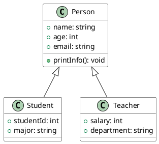
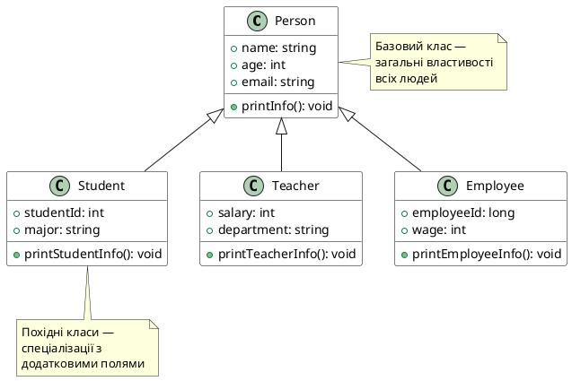
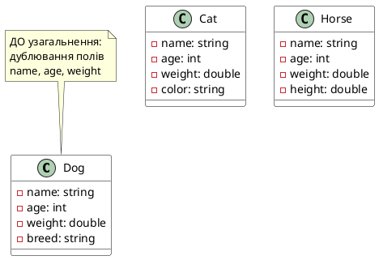
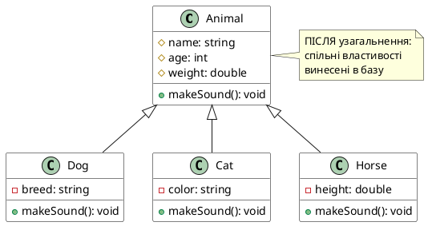
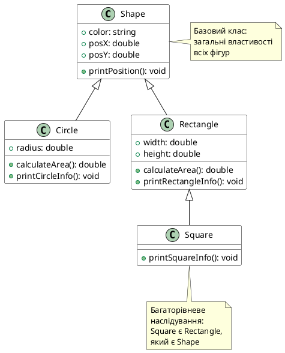

## Чому композиція — це ще не вся історія

У попередніх статтях ми познайомилися з композицією — способом побудови складних класів шляхом включення інших класів як полів даних. Композиція ідеально моделює відношення **«має»** (*has-a*): `Car` має `Engine`, `University` має `Department`, `Computer` має `CPU`.

Але існує інший, не менш фундаментальний тип зв'язку між сутностями — відношення **«є різновидом»** (*is-a*). Розглянемо практичну задачу:

```cpp
class Student {
public:
    std::string name;
    int age;
    std::string email;
    std::string phoneNumber;
    std::string address;
    
    void printInfo() {
        std::cout << "Name: " << name << ", Age: " << age << '\n';
    }
};

class Teacher {
public:
    std::string name;
    int age;
    std::string email;
    std::string phoneNumber;
    std::string address;
    int salary;
    
    void printInfo() {
        std::cout << "Name: " << name << ", Age: " << age << '\n';
    }
};

class Employee {
public:
    std::string name;
    int age;
    std::string email;
    std::string phoneNumber;
    std::string address;
    long employeeId;
    
    void printInfo() {
        std::cout << "Name: " << name << ", Age: " << age << '\n';
    }
};
```

Проблема очевидна: **п'ять полів і один метод продубльовані тричі**. Якщо додамо клас `Administrator`, дублювання зросте до чотирьох копій. Це не просто неелегантно — це **архітектурна бомба сповільненої дії**:

- **Синхронізація вручну**: додавання поля `birthDate` потребує змін у п'яти класах.
- **Поширення помилок**: якщо `printInfo()` містить баг, його треба виправляти у п'яти місцях.
- **Розмивання логіки**: немає єдиної точки відповідальності за «що означає бути Людиною».

Композиція тут не допоможе: `Teacher` **не має** (`has-a`) `Person` — `Teacher` **є** (`is-a`) `Person`. Для моделювання такого роду зв'язку існує **наслідування** (*inheritance*).

::note
**Наслідування** — другий стовп ООП (поряд із інкапсуляцією). Третій стовп — **поліморфізм** — ми розглянемо в наступних статтях (віртуальні функції).
::

---

## Відношення «is-a»: ієрархія класифікацій

Відношення **«is-a»** означає, що один об'єкт — це **спеціалізований випадок** іншого. У термінах біологічної таксономії:

- Кіт **є** Ссавець
- Ссавець **є** Тварина
- Тварина **є** Організм

Кожен рівень **успадковує** властивості верхнього та **розширює** їх специфічними ознаками.

### Тест на підстановку (Substitution Test)

Найкращий спосіб перевірити, чи коректне відношення `is-a` — це **тест на підстановку Лісков** (Liskov Substitution Principle, LSP):

::card-group
:::card
---
title: '✅ Коректне «is-a»'
icon: 'i-lucide-check'
---
- **Студент є Людиною** → Будь-яке місце, де можна використати Людину, можна використати Студента.
- **Квадрат є Прямокутник** → Геометрично квадрат — окремий випадок прямокутника.
- **Електромобіль є Автомобіль** → Поведінка автомобіля застосовна до електромобіля.
:::

:::card
---
title: '❌ Помилкове «is-a»'
icon: 'i-lucide-x'
---
- **Автомобіль є Двигун** → Автомобіль **має** двигун, але не **є** двигуном (це `has-a`, не `is-a`).
- **Працівник є Зарплата** → Працівник **отримує** зарплату, але сам не є грошовою величиною.
- **Книга є Сторінки** → Книга **складається з** сторінок (це композиція, а не наслідування).
:::
::

::warning
**Помилкове використання наслідування** — одна з найчастіших причин важко підтримуваного коду. Якщо відношення — це `has-a` (має), `uses-a` (використовує) чи `consists-of` (складається з), то правильний вибір — **композиція, асоціація або агрегація**, а не наслідування.
::

---

## Синтаксис наслідування в C++

Мова C++ надає синтаксис для явного позначення, що один клас **успадковує** (*inherits*) властивості іншого:



::note
**Термінологія успадкування** (обидва варіанти терміну прийнятні):

| Роль | Англійський термін | Український термін |
|:-----|:-------------------|:-------------------|
| Клас-джерело | Base class / Parent class / Superclass | Базовий клас / Батьківський клас |
| Клас-спадкоємець | Derived class / Child class / Subclass | Похідний клас / Дочірній клас |

На діаграмах UML стрілка з **порожнім трикутником** указує на базовий клас.
::

### Базовий клас `Person`

Виділяємо **спільні** властивості, що належать будь-якій Людині:

```cpp
#include <iostream>
#include <string>

class Person {
public:
    std::string name;
    int age;
    std::string email;
    
    Person(const std::string& name = "", int age = 0, 
           const std::string& email = "")
        : name(name), age(age), email(email)
    {
    }
    
    void printInfo() const {
        std::cout << "Name: " << name << ", Age: " << age 
                  << ", Email: " << email << '\n';
    }
};
```

::tip
Зверніть увагу: ми оголосили всі члени `public` для спрощення прикладу. У реальному коді поля зазвичай `private`, а доступ надається через геттери. Специфікатор `protected` та взаємодія наслідування зі специфікаторами доступу — тема наступної статті.
::


### Похідний клас `Student`

Тепер створимо клас `Student`, який **успадковує** всі члени `Person` і додає свої власні:

```cpp
// Student ПУБЛІЧНО успадковує Person
class Student : public Person {
public:
    int studentId;
    std::string major;  // спеціальність
    
    Student(const std::string& name = "", int age = 0,
            const std::string& email = "", int studentId = 0,
            const std::string& major = "")
        : Person(name, age, email),  // викликаємо конструктор базового класу
          studentId(studentId), major(major)
    {
    }
    
    void printStudentInfo() const {
        printInfo();  // використовуємо успадкований метод
        std::cout << "Student ID: " << studentId 
                  << ", Major: " << major << '\n';
    }
};
```

**Розбір синтаксису:**

1. **`: public Person`** — специфікатор публічного наслідування. Це означає:
   - Всі `public` члени `Person` залишаються `public` у `Student`.
   - Всі `protected` члени `Person` залишаються `protected` у `Student`.
   
2. **`Person(name, age, email)`** у списку ініціалізації — явний виклик конструктора базового класу. Це **обов'язково**, якщо у `Person` немає дефолтного конструктора без параметрів.

3. **`printInfo()`** — успадкований метод, доступний безпосередньо, без префікса.

::debugger-view
---
title: 'Структура об'єкта Student у пам'яті'
---
```
┌─────────────────────────────────┐
│   Об'єкт типу Student           │
├─────────────────────────────────┤
│ ┌─────────────────────────────┐ │
│ │   Під'об'єкт Person         │ │ ← Базовий клас
│ ├─────────────────────────────┤ │
│ │ name: "Alice"               │ │
│ │ age: 20                     │ │
│ │ email: "alice@example.com"  │ │
│ └─────────────────────────────┘ │
│                                 │
│ ┌─────────────────────────────┐ │
│ │   Специфічні поля Student   │ │ ← Похідний клас
│ ├─────────────────────────────┤ │
│ │ studentId: 12345            │ │
│ │ major: "Computer Science"   │ │
│ └─────────────────────────────┘ │
└─────────────────────────────────┘
```
::

### Використання успадкованого класу

```cpp
int main() {
    Student alice("Alice", 20, "alice@example.com", 12345, "Computer Science");
    
    // Доступ до успадкованих полів
    std::cout << "Name: " << alice.name << '\n';
    std::cout << "Age: " << alice.age << '\n';
    
    // Доступ до власних полів
    std::cout << "ID: " << alice.studentId << '\n';
    
    // Виклик успадкованого методу
    alice.printInfo();
    
    // Виклик власного методу
    alice.printStudentInfo();
    
    return 0;
}
```

**Вивід:**
```
Name: Alice
Age: 20
ID: 12345
Name: Alice, Age: 20, Email: alice@example.com
Name: Alice, Age: 20, Email: alice@example.com
Student ID: 12345, Major: Computer Science
```

::note
Об'єкт `alice` **фізично містить** під'об'єкт `Person` всередині себе. Це **не композиція** (де поле має тип іншого класу), а **розширення структури**: пам'ять об'єкта `Student` починається з полів `Person`, а потім продовжується власними полями.
::

---

## Множинні похідні класи від одного базового

Один базовий клас може мати **багато похідних класів**. Побудуємо ще два класи на основі `Person`:

### Клас `Teacher`

```cpp
class Teacher : public Person {
public:
    int salary;
    std::string department;
    
    Teacher(const std::string& name = "", int age = 0,
            const std::string& email = "", int salary = 0,
            const std::string& department = "")
        : Person(name, age, email),
          salary(salary), department(department)
    {
    }
    
    void printTeacherInfo() const {
        printInfo();
        std::cout << "Salary: " << salary 
                  << ", Department: " << department << '\n';
    }
};
```

### Клас `Employee`

```cpp
class Employee : public Person {
public:
    long employeeId;
    int wage;
    
    Employee(const std::string& name = "", int age = 0,
             const std::string& email = "", long employeeId = 0,
             int wage = 0)
        : Person(name, age, email),
          employeeId(employeeId), wage(wage)
    {
    }
    
    void printEmployeeInfo() const {
        printInfo();
        std::cout << "Employee ID: " << employeeId 
                  << ", Wage: " << wage << '\n';
    }
};
```

**Діаграма взаємозв'язків:**



::tip
**Зверніть увагу:** класи `Student`, `Teacher` та `Employee` **не пов'язані між собою** напряму. Вони **незалежні спадкоємці** одного предка. Це відрізняється від **багаторівневого наслідування**, де один клас успадковує від іншого похідного класу.
::

---

## Багаторівневе наслідування

Похідний клас сам може стати базовим для іншого класу, утворюючи **ланцюжок спадкування**:

```cpp
class Supervisor : public Employee {
public:
    int teamSize;  // кількість підлеглих
    
    Supervisor(const std::string& name = "", int age = 0,
               const std::string& email = "", long employeeId = 0,
               int wage = 0, int teamSize = 0)
        : Employee(name, age, email, employeeId, wage),
          teamSize(teamSize)
    {
    }
    
    void printSupervisorInfo() const {
        printEmployeeInfo();
        std::cout << "Team Size: " << teamSize << '\n';
    }
};
```

**Ієрархія наслідування:**

```
Person
  ↑
  │
Employee
  ↑
  │
Supervisor
```

Об'єкт `Supervisor` містить:
1. Поля `Person` (name, age, email)
2. Поля `Employee` (employeeId, wage)
3. Власні поля (teamSize)

::memory-view
---
title: 'Фізична структура об'єкта Supervisor'
---
```
┌────────────────────────────────────┐
│   Об'єкт типу Supervisor           │
├────────────────────────────────────┤
│ ┌────────────────────────────────┐ │
│ │   Під'об'єкт Person            │ │
│ ├────────────────────────────────┤ │
│ │ name: "Bob"                    │ │
│ │ age: 35                        │ │
│ │ email: "bob@company.com"       │ │
│ └────────────────────────────────┘ │
│                                    │
│ ┌────────────────────────────────┐ │
│ │   Під'об'єкт Employee          │ │
│ ├────────────────────────────────┤ │
│ │ employeeId: 987654             │ │
│ │ wage: 5000                     │ │
│ └────────────────────────────────┘ │
│                                    │
│ ┌────────────────────────────────┐ │
│ │   Специфічні поля Supervisor   │ │
│ ├────────────────────────────────┤ │
│ │ teamSize: 8                    │ │
│ └────────────────────────────────┘ │
└────────────────────────────────────┘
```

**Розмір об'єкта в пам'яті:**  
`sizeof(Supervisor) = sizeof(Person) + sizeof(Employee-специфічні) + sizeof(Supervisor-специфічні)`
::


---

## Процеси узагальнення та спеціалізації

Наслідування підтримує два протилежні напрямки мислення:

### Узагальнення (Generalization)

**Рух від конкретного до загального:** виявлення спільних властивостей кількох класів і винесення їх у базовий клас.

**Приклад:** маємо класи `Dog`, `Cat`, `Horse`. Помічаємо спільні поля: `name`, `age`, `weight`. Створюємо базовий клас `Animal` і виносимо в нього дублювання.



**Після узагальнення:**



### Спеціалізація (Specialization)

**Рух від загального до конкретного:** створення нових класів шляхом розширення існуючого базового класу додатковими властивостями.

**Приклад:** маємо базовий клас `Shape` з методом `calculateArea()`. Створюємо спеціалізовані класи `Circle`, `Rectangle`, `Triangle`, кожен з яких додає свої специфічні поля (`radius`, `width/height`, `base/height`).

::card-group
:::card
---
title: 'Узагальнення (Generalization)'
icon: 'i-lucide-arrow-up'
---
- **Напрямок:** знизу вгору (від конкретного до абстрактного)
- **Мета:** ліквідація дублювання, підвищення повторного використання
- **Результат:** базовий клас містить **загальні** характеристики
:::

:::card
---
title: 'Спеціалізація (Specialization)'
icon: 'i-lucide-arrow-down'
---
- **Напрямок:** зверху вниз (від абстрактного до конкретного)
- **Мета:** додавання специфічної функціональності
- **Результат:** похідні класи містять **унікальні** характеристики
:::
::

---

## Переваги наслідування

### 1. Усунення дублювання коду

Без наслідування клас `Student` міг би виглядати так:

```cpp
// ❌ Антипаттерн: дублювання логіки
class Student {
public:
    std::string name;
    int age;
    std::string email;
    int studentId;
    std::string major;
    
    void printInfo() {  // ← ця логіка дублюється в Teacher, Employee...
        std::cout << "Name: " << name << ", Age: " << age 
                  << ", Email: " << email << '\n';
    }
};
```

З наслідуванням логіка `printInfo()` існує **в одному місці** — у класі `Person`.

### 2. Єдина точка змін (Single Point of Change)

Якщо потрібно додати поле `phoneNumber` до всіх людей:

```cpp
// ✅ Зміна в одному місці
class Person {
public:
    std::string name;
    int age;
    std::string email;
    std::string phoneNumber;  // ← нове поле
    
    // ...
};
```

Автоматично всі похідні класи (`Student`, `Teacher`, `Employee`) отримують це поле **без жодних змін у їхньому коді**.

### 3. Поліморфна обробка (анонс)

Наслідування дозволяє обробляти різнорідні об'єкти через єдиний інтерфейс:

```cpp
void printPersonInfo(const Person& person) {
    person.printInfo();
}

int main() {
    Student student("Alice", 20, "alice@example.com", 12345, "CS");
    Teacher teacher("Dr. Smith", 45, "smith@university.edu", 5000, "Physics");
    
    printPersonInfo(student);  // ✅ Student передається як Person
    printPersonInfo(teacher);  // ✅ Teacher передається як Person
    
    return 0;
}
```

::note
Це приклад **статичного поліморфізму** через посилання на базовий клас. Повний **динамічний поліморфізм** через віртуальні функції ми розглянемо у статтях 75–80.
::

### 4. Повторне використання коду (Reusability)

Створивши один раз надійний базовий клас `Person`, ми можемо **безкоштовно** використовувати його функціональність у десятках похідних класів: `Student`, `Teacher`, `Administrator`, `Guest`, `Parent`, `Alumni` тощо.

---

## Наслідування vs Композиція: коли що обирати?

| Критерій | Наслідування (`is-a`) | Композиція (`has-a`) |
|:---------|:----------------------|:---------------------|
| **Відношення** | Student **є** Person | Car **має** Engine |
| **Тест підстановки** | Похідний клас може замінити базовий | Неможливо замінити ціле на частину |
| **Структура пам'яті** | Під'об'єкт базового класу всередині похідного | Поле-об'єкт іншого класу |
| **Доступ до членів** | Безпосередній доступ до `public`/`protected` членів базового класу | Через інтерфейс об'єкта-поля |
| **Приклад коду** | `class Student : public Person` | `class Car { Engine engine; };` |

::warning
**Найчастіша помилка новачків:** спроба використовувати наслідування там, де потрібна композиція.

**Приклад помилки:**
```cpp
// ❌ НЕПРАВИЛЬНО: House не "є" Door
class House : public Door {
    // ...
};

// ✅ ПРАВИЛЬНО: House "має" Door
class House {
    Door mainDoor;
    Door backDoor;
};
```

**Правило:** якщо сумніваєтесь між `is-a` та `has-a`, **віддавайте перевагу композиції**. Надмірне використання наслідування призводить до негнучких ієрархій, важких для підтримки.
::

---

## Обмеження та підводні камені наслідування

### 1. Похідний клас не може обмежити базовий

Якщо базовий клас має поле чи метод, похідний клас **не може їх видалити**:

```cpp
class Bird {
public:
    void fly() { std::cout << "Flying...\n"; }
};

class Penguin : public Bird {
    // ❌ Пінгвін не літає, але метод fly() успадкований!
    // Немає способу "заборонити" fly() для Penguin
};
```

**Рішення:** переосмислити ієрархію (наприклад, створити `FlyingBird` і `FlightlessBird`).

### 2. Зв'язування на етапі компіляції

Базовий клас визначається **статично**, на етапі написання коду. Не можна динамічно змінити базовий клас під час виконання програми.

### 3. Проблема крихкого базового класу (Fragile Base Class)

Зміна в базовому класі може **несподівано зламати** всі похідні класи. Наприклад:

```cpp
// Версія 1.0
class Person {
public:
    void printInfo() {
        std::cout << name << '\n';
    }
};

// Версія 2.0 — додали перевірку
class Person {
public:
    void printInfo() {
        if (name.empty()) return;  // ← нова логіка
        std::cout << name << '\n';
    }
};
```

Якщо похідний клас `Student` перевизначав `printInfo()` і покладався на **обов'язковий вивід**, код зламається.

::tip
**Захист від крихкості:**
1. Документувати контракти методів (що гарантується, а що ні).
2. Робити методи `virtual` (віртуальними), якщо передбачається їх перевизначення (стаття 75).
3. Застосовувати принцип відкритості/закритості (Open/Closed Principle): клас відкритий для розширення, але закритий для модифікації.
::


---

## Практичний приклад: ієрархія геометричних фігур

Побудуємо класичну навчальну ієрархію для моделювання геометричних фігур:

### Базовий клас `Shape`

```cpp
#include <iostream>
#include <string>

class Shape {
public:
    std::string color;
    double posX;
    double posY;
    
    Shape(const std::string& color = "black", double x = 0.0, double y = 0.0)
        : color(color), posX(x), posY(y)
    {
        std::cout << "Shape constructor called\n";
    }
    
    void printPosition() const {
        std::cout << "Position: (" << posX << ", " << posY 
                  << "), Color: " << color << '\n';
    }
};
```

### Похідний клас `Circle`

```cpp
class Circle : public Shape {
public:
    double radius;
    
    Circle(const std::string& color = "black", double x = 0.0, 
           double y = 0.0, double radius = 1.0)
        : Shape(color, x, y), radius(radius)
    {
        std::cout << "Circle constructor called\n";
    }
    
    double calculateArea() const {
        return 3.14159 * radius * radius;
    }
    
    void printCircleInfo() const {
        printPosition();
        std::cout << "Radius: " << radius 
                  << ", Area: " << calculateArea() << '\n';
    }
};
```

### Похідний клас `Rectangle`

```cpp
class Rectangle : public Shape {
public:
    double width;
    double height;
    
    Rectangle(const std::string& color = "black", double x = 0.0,
              double y = 0.0, double width = 1.0, double height = 1.0)
        : Shape(color, x, y), width(width), height(height)
    {
        std::cout << "Rectangle constructor called\n";
    }
    
    double calculateArea() const {
        return width * height;
    }
    
    void printRectangleInfo() const {
        printPosition();
        std::cout << "Width: " << width << ", Height: " << height
                  << ", Area: " << calculateArea() << '\n';
    }
};
```

### Багаторівневе наслідування: клас `Square`

Квадрат — це **спеціальний випадок** прямокутника, де `width == height`:

```cpp
class Square : public Rectangle {
public:
    Square(const std::string& color = "black", double x = 0.0,
           double y = 0.0, double side = 1.0)
        : Rectangle(color, x, y, side, side)
    {
        std::cout << "Square constructor called\n";
    }
    
    void printSquareInfo() const {
        printRectangleInfo();
        std::cout << "This is a square (width == height)\n";
    }
};
```

### Використання ієрархії

```cpp
int main() {
    std::cout << "=== Creating Circle ===\n";
    Circle circle("red", 5.0, 10.0, 3.5);
    circle.printCircleInfo();
    
    std::cout << "\n=== Creating Rectangle ===\n";
    Rectangle rect("blue", 0.0, 0.0, 4.0, 6.0);
    rect.printRectangleInfo();
    
    std::cout << "\n=== Creating Square ===\n";
    Square square("green", 2.0, 2.0, 5.0);
    square.printSquareInfo();
    
    // Доступ до успадкованих членів
    std::cout << "\n=== Direct access to base members ===\n";
    std::cout << "Circle color: " << circle.color << '\n';
    std::cout << "Square position X: " << square.posX << '\n';
    
    return 0;
}
```

**Вивід програми:**

```
=== Creating Circle ===
Shape constructor called
Circle constructor called
Position: (5, 10), Color: red
Radius: 3.5, Area: 38.4845

=== Creating Rectangle ===
Shape constructor called
Rectangle constructor called
Position: (0, 0), Color: blue
Width: 4, Height: 6, Area: 24

=== Creating Square ===
Shape constructor called
Rectangle constructor called
Square constructor called
Position: (2, 2), Color: green
Width: 5, Height: 5, Area: 25
This is a square (width == height)

=== Direct access to base members ===
Circle color: red
Square position X: 2
```

::note
**Порядок виклику конструкторів:**  
При створенні об'єкта `Square` конструктори викликаються **знизу вгору по ієрархії**:
1. `Shape` (найвищий предок)
2. `Rectangle` (проміжний предок)
3. `Square` (сам об'єкт)

**Порядок виклику деструкторів** буде **зворотним**: спочатку `~Square()`, потім `~Rectangle()`, потім `~Shape()`. Детально це розглянемо у статті 71.
::

**Діаграма класів:**



---

## Вправа: розробка ієрархії транспортних засобів

::::accordion
:::accordion-item
::span[Завдання]{slot="title"}

Спроєктуйте ієрархію класів для моделювання транспортних засобів у системі моніторингу автопарку.

**Вимоги:**

1. **Базовий клас `Vehicle`** повинен містити:
   - Поля: `brand` (марка), `model` (модель), `year` (рік випуску), `mileage` (пробіг)
   - Конструктор з параметрами
   - Метод `printInfo()` для виведення загальної інформації

2. **Похідний клас `Car`** повинен містити:
   - Додаткове поле: `numberOfDoors` (кількість дверей)
   - Власний конструктор
   - Метод `printCarInfo()`

3. **Похідний клас `Truck`** повинен містити:
   - Додаткове поле: `cargoCapacity` (вантажопідйомність у кг)
   - Власний конструктор
   - Метод `printTruckInfo()`

4. **Похідний клас `ElectricCar`** (наслідує від `Car`):
   - Додаткове поле: `batteryCapacity` (ємність батареї у кВт·год)
   - Власний конструктор
   - Метод `printElectricCarInfo()`

5. У `main()` створіть по одному об'єкту кожного типу та виведіть їхню інформацію.

:::

:::accordion-item
::span[Рішення]{slot="title"}

```cpp
#include <iostream>
#include <string>

// Базовий клас Vehicle
class Vehicle {
public:
    std::string brand;
    std::string model;
    int year;
    double mileage;
    
    Vehicle(const std::string& brand = "", const std::string& model = "",
            int year = 0, double mileage = 0.0)
        : brand(brand), model(model), year(year), mileage(mileage)
    {
    }
    
    void printInfo() const {
        std::cout << "Brand: " << brand << ", Model: " << model
                  << ", Year: " << year << ", Mileage: " << mileage << " km\n";
    }
};

// Похідний клас Car
class Car : public Vehicle {
public:
    int numberOfDoors;
    
    Car(const std::string& brand = "", const std::string& model = "",
        int year = 0, double mileage = 0.0, int numberOfDoors = 4)
        : Vehicle(brand, model, year, mileage), numberOfDoors(numberOfDoors)
    {
    }
    
    void printCarInfo() const {
        printInfo();
        std::cout << "Number of doors: " << numberOfDoors << '\n';
    }
};

// Похідний клас Truck
class Truck : public Vehicle {
public:
    double cargoCapacity;
    
    Truck(const std::string& brand = "", const std::string& model = "",
          int year = 0, double mileage = 0.0, double cargoCapacity = 0.0)
        : Vehicle(brand, model, year, mileage), cargoCapacity(cargoCapacity)
    {
    }
    
    void printTruckInfo() const {
        printInfo();
        std::cout << "Cargo capacity: " << cargoCapacity << " kg\n";
    }
};

// Багаторівневе наслідування: ElectricCar
class ElectricCar : public Car {
public:
    double batteryCapacity;
    
    ElectricCar(const std::string& brand = "", const std::string& model = "",
                int year = 0, double mileage = 0.0, int numberOfDoors = 4,
                double batteryCapacity = 0.0)
        : Car(brand, model, year, mileage, numberOfDoors),
          batteryCapacity(batteryCapacity)
    {
    }
    
    void printElectricCarInfo() const {
        printCarInfo();
        std::cout << "Battery capacity: " << batteryCapacity << " kWh\n";
    }
};

int main() {
    std::cout << "=== Car ===\n";
    Car car("Toyota", "Camry", 2020, 35000.0, 4);
    car.printCarInfo();
    
    std::cout << "\n=== Truck ===\n";
    Truck truck("Volvo", "FH16", 2018, 120000.0, 25000.0);
    truck.printTruckInfo();
    
    std::cout << "\n=== Electric Car ===\n";
    ElectricCar eCar("Tesla", "Model 3", 2022, 15000.0, 4, 75.0);
    eCar.printElectricCarInfo();
    
    return 0;
}
```

**Вивід:**
```
=== Car ===
Brand: Toyota, Model: Camry, Year: 2020, Mileage: 35000 km
Number of doors: 4

=== Truck ===
Brand: Volvo, Model: FH16, Year: 2018, Mileage: 120000 km
Cargo capacity: 25000 kg

=== Electric Car ===
Brand: Tesla, Model: 3, Year: 2022, Mileage: 15000 km
Number of doors: 4
Battery capacity: 75 kWh
```

::tip
**Альтернативний дизайн:** можна було б створити клас `ElectricVehicle` як окремого спадкоємця `Vehicle`, а потім `ElectricCar` успадкувати від **обох** (`Car` та `ElectricVehicle`) через множинне наслідування. Але це призводить до проблеми ромба (Diamond Problem), яку ми розглянемо у статті 74.
::

:::
::::

---

## Резюме

::card-group
:::card
---
title: 'Що ми вивчили'
icon: 'i-lucide-check-circle'
---
- **Наслідування** — другий стовп ООП, що моделює відношення **«is-a»** (є різновидом).
- **Синтаксис:** `class Derived : public Base` — публічне наслідування.
- **Структура пам'яті:** похідний об'єкт фізично містить під'об'єкт базового класу.
- **Доступ:** успадковані `public` члени доступні безпосередньо в похідному класі.
- **Багаторівневе наслідування:** клас може успадковувати від іншого похідного класу.
- **Переваги:** усунення дублювання, єдина точка змін, повторне використання.
:::

:::card
---
title: 'Ключові терміни'
icon: 'i-lucide-book-open'
---
- **Base class** (базовий клас) — клас-джерело властивостей.
- **Derived class** (похідний клас) — клас-спадкоємець.
- **Generalization** (узагальнення) — винесення спільного в базу.
- **Specialization** (спеціалізація) — розширення базового класу.
- **Substitution test** (тест підстановки) — перевірка коректності `is-a`.
:::
::

::warning
**Частi помилки:**
1. **Плутанина `is-a` та `has-a`:** використання наслідування замість композиції.
2. **Забування виклику конструктора базового класу** у списку ініціалізації похідного класу.
3. **Надмірне наслідування:** створення глибоких ієрархій (5+ рівнів), які важко підтримувати.
4. **Наслідування для повторного використання коду**, де семантично відношення не є `is-a` (краще композиція).
::

---

## Що далі?

У наступній статті ми детально розберемо:

- **Порядок виклику конструкторів і деструкторів** у ієрархіях наслідування
- Як правильно **передавати параметри** від похідного класу до базового
- Чому **деструктори викликаються у зворотному порядку**
- Як діє **RAII** у контексті наслідування
- Типові помилки: «no matching constructor» та «undefined reference»

**Анонс статті 71:** *Конструктори, деструктори та порядок ініціалізації в ієрархіях*.

