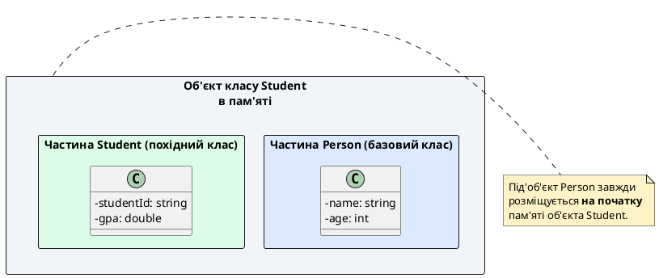
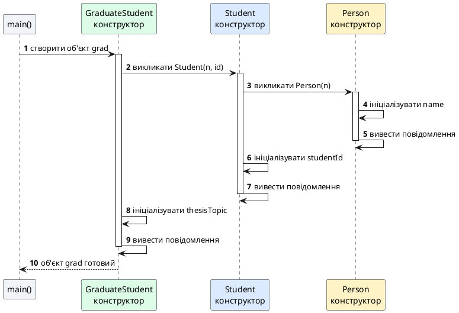
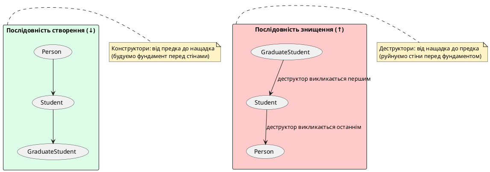

## Від простих класів до ієрархій: нова складність

У попередній статті ми дослідили наслідування як відношення «є різновидом» (*is-a*) та побудували перші ієрархії класів — `Person` → `Student`, `Employee`. Ми навчилися створювати похідні класи за допомогою синтаксису `class Derived : public Base` та розуміти, що похідний об'єкт фізично містить у собі під'об'єкт базового класу.

Проте ми не розглянули фундаментальне питання: **що відбувається під час створення та знищення об'єктів у ієрархіях?** Якщо похідний клас містить у собі базовий як частину, то хто відповідає за ініціалізацію полів базового класу? У якому порядку викликаються конструктори та деструктори? Чи може похідний клас безпосередньо ініціалізувати поля предка?

Ці питання не виникали при роботі з автономними класами, але у світі наслідування вони стають критично важливими. Без розуміння життєвого циклу об'єктів у ієрархіях ми не зможемо коректно проєктувати конструктори, керувати ресурсами та уникати тонких помилок ініціалізації.

::card-group

::card{title="🎯 Мета статті" icon="i-lucide-target"}

- Дослідити точний життєвий цикл об'єктів у ієрархіях: порядок виклику конструкторів (згори донизу) та деструкторів (знизу догори)
- Навчитися явно викликати конструктор базового класу через список ініціалізації (`Derived(...) : Base(...)`)
- Розібрати типову помилку компілятора за відсутності конструктора за замовчуванням у базовому класі
- Дослідити порядок конструювання та руйнування при багаторівневому наслідуванні (`A` → `B` → `C`)
- Засвоїти правило: похідний клас не повинен безпосередньо ініціалізувати поля предка в тілі свого конструктора

::

::card{title="🔑 Ключові терміни" icon="i-lucide-key"}

- **Під'об'єкт базового класу** (*base class subobject*): частина пам'яті похідного об'єкта, що відповідає базовому класу
- **Поетапна ініціалізація** (*staged initialization*): процес послідовного конструювання об'єктів ієрархії від предка до нащадка
- **Виклик конструктора батька** (*parent constructor invocation*): явна передача параметрів конструктору базового класу через список ініціалізації
- **Правило безпосереднього батька** (*direct parent rule*): похідний клас може викликати лише конструктор свого безпосереднього предка

::

::

## Фізична структура похідного об'єкта

Перш ніж аналізувати життєвий цикл, нагадаємо фундаментальну властивість наслідування: **похідний об'єкт не копіює члени базового класу — він містить у собі під'об'єкт базового класу як фізичну частину**.

Розглянемо просту ієрархію:

```cpp
class Person
{
private:
    string name;
    int age;

public:
    Person(string n, int a) : name(n), age(a) {}
    
    string getName() const { return name; }
    int getAge() const { return age; }
};

class Student : public Person
{
private:
    string studentId;
    double gpa;

public:
    Student(string n, int a, string id, double g)
        : Person(n, a), studentId(id), gpa(g) 
    {}
    
    string getStudentId() const { return studentId; }
    double getGpa() const { return gpa; }
};
```

Коли ми створюємо об'єкт `Student`, компілятор виділяє в пам'яті достатньо місця для **усіх полів**: `name` та `age` (з `Person`) + `studentId` та `gpa` (власні поля `Student`). Концептуально об'єкт `Student` складається з двох логічних частин:

::plant-uml{alt="Структура об'єкта Student у пам'яті"}



::

::note
Ця структура — не просто концептуальна модель, а **реальна організація пам'яті**. Під'об'єкт базового класу завжди розміщується на початку адресного простору похідного об'єкта. Саме тому покажчик `Student*` може безпечно приводитися до `Person*` — адреса об'єкта збігається з адресою його першого поля (під'об'єкта `Person`).

::

## Чому фундамент будують раніше за стіни

Логіка поетапної ініціалізації ієрархій спирається на фундаментальний принцип: **базовий клас повинен бути повністю сконструйований раніше похідного**. Цей принцип не є довільним рішенням розробників C++ — він диктується реальними потребами безпеки та коректності.

Розглянемо причини, чому конструктор базового класу завжди викликається першим:

::card-group

::card{title="🔒 Гарантія інваріантів базового класу" icon="i-lucide-shield-check"}

Конструктор базового класу встановлює **інваріанти** (*invariants*) — умови, які завжди мають виконуватись для коректної роботи об'єкта. Наприклад, конструктор `Person` може забезпечити, що `age` ніколи не буде від'ємним, або що `name` не буде порожнім.

Якби похідний клас конструювався першим, він міг би викликати методи базового класу **до того, як ці інваріанти встановлені** — що призвело б до невизначеної поведінки.

::

::card{title="⚙️ Похідний клас використовує інтерфейс базового" icon="i-lucide-cog"}

Конструктор похідного класу часто викликає публічні методи базового класу для виконання підготовчих операцій. Наприклад, конструктор `Student` може викликати `Person::getName()` для логування або валідації.

Ці виклики безпечні лише якщо **базовий об'єкт уже повністю ініціалізований**. Інакше метод працюватиме з неініціалізованими полями.

::

::

::card{title="📦 Ефективність компіляції та виконання" icon="i-lucide-zap"}

Гарантований порядок конструювання дозволяє компілятору генерувати оптимальний машинний код. Компілятор знає, що після виконання конструктора `Person` усі поля `name` та `age` вже мають коректні значення — не потрібні додаткові перевірки валідності при кожному зверненні до них з конструктора `Student`.

::

::

Правило просте: **фундамент будують раніше за стіни**. Базовий клас — це «фундамент» об'єкта, а похідний — «стіни», які на ньому зведені. Спроба побудувати стіни на неготовому фундаменті завершиться катастрофою.

## Порядок виклику конструкторів: демонстрація

Продемонструємо порядок виклику конструкторів на простому прикладі. Додамо виведення повідомлень у конструктори, щоб побачити послідовність їхнього виконання:

```cpp [ConstructorOrder.cpp]
#include <iostream>

using namespace std;

class Person
{
private:
    string name;
    int age;

public:
    Person(string n, int a) : name(n), age(a)
    {
        cout << "  Конструктор Person: " << name << ", вік " << age << "\n";
    }
    
    string getName() const { return name; }
    int getAge() const { return age; }
};

class Student : public Person
{
private:
    string studentId;

public:
    Student(string n, int a, string id)
        : Person(n, a), studentId(id)
    {
        cout << "  Конструктор Student: ID " << studentId << "\n";
    }
    
    string getStudentId() const { return studentId; }
};

int main()
{
    cout << "Створюємо автономний об'єкт Person:\n";
    Person person("Олена Петрова", 42);
    
    cout << "\nСтворюємо об'єкт Student:\n";
    Student student("Іван Сидоренко", 20, "CS-2024-0517");
    
    return 0;
}
```

::terminal-preview{title="g++ ConstructorOrder.cpp -o order && ./order"}

<div class="line"><span class="opacity-40">$</span> <strong class="font-bold">./order</strong></div>
<div class="line">Створюємо автономний об'єкт Person:</div>
<div class="line">  Конструктор Person: Олена Петрова, вік 42</div>
<div class="line"></div>
<div class="line">Створюємо об'єкт Student:</div>
<div class="line">  Конструктор Person: Іван Сидоренко, вік 20</div>
<div class="line">  Конструктор Student: ID CS-2024-0517</div>

::

Результат підтверджує послідовність:

1. **Створення `Person person(...)`:** викликається лише конструктор `Person` — це автономний клас без предків.
2. **Створення `Student student(...)`:** спочатку викликається конструктор `Person` (для ініціалізації частини `Person` об'єкта `student`), а потім — конструктор `Student` (для ініціалізації власних полів `Student`).

::note
У момент виконання конструктора `Person` під'об'єкт `Person` вже повністю сформований: поля `name` та `age` проініціалізовані. У момент виконання конструктора `Student` частина `Person` **вже готова**, і конструктор `Student` може безпечно викликати `getName()`, `getAge()` та інші успадковані методи.

::


## Детальна послідовність створення об'єкта похідного класу

Розглянемо покроково, що відбувається під час виконання рядка `Student student("Іван Сидоренко", 20, "CS-2024-0517");`:

::steps

### Крок 1. Виділення пам'яті

Компілятор обчислює розмір об'єкта `Student`: розмір базової частини `Person` (дві змінні: `string name` + `int age`) плюс розмір власних полів `Student` (`string studentId`).

Виділяється **єдиний безперервний блок пам'яті**, достатній для збереження всіх полів ієрархії. Цей блок розміщується на стеку (якщо об'єкт локальний) або в купі (якщо створений через `new`).

### Крок 2. Виклик конструктора похідного класу

Компілятор викликає конструктор `Student(string n, int a, string id)` з аргументами `"Іван Сидоренко"`, `20`, `"CS-2024-0517"`.

Виконання конструктора **ще не почалося** — компілятор лише встановлює контекст виклику та передає параметри.

### Крок 3. Виконання списку ініціалізації: виклик конструктора базового класу

Компілятор аналізує список ініціалізації (`Member Initializer List`) конструктора `Student`:

```cpp
Student(string n, int a, string id)
    : Person(n, a), studentId(id)  // ← Список ініціалізації
```

Перший запис у списку — `Person(n, a)` — **явний виклик конструктора базового класу**. Компілятор викликає `Person(string n, int a)` з аргументами `"Іван Сидоренко"` та `20`.

Конструктор `Person` ініціалізує поля `name` і `age`, виконує своє тіло (виводить повідомлення) і завершує роботу. Тепер під'об'єкт `Person` усередині об'єкта `student` **повністю готовий**.

### Крок 4. Ініціалізація власних полів похідного класу

Після завершення конструктора `Person` компілятор продовжує обробляти список ініціалізації. Наступний запис — `studentId(id)` — ініціалізує поле `studentId` значенням `"CS-2024-0517"`.

### Крок 5. Виконання тіла конструктора похідного класу

Після завершення списку ініціалізації виконується тіло конструктора `Student`:

```cpp
{
    cout << "  Конструктор Student: ID " << studentId << "\n";
}
```

У цей момент **усі поля об'єкта вже проініціалізовані**: і частина `Person`, і власні поля `Student`. Тіло конструктора може безпечно з ними працювати.

### Крок 6. Повернення управління

Конструктор `Student` завершує роботу. Виконання повертається до місця створення об'єкта (`main()`). Об'єкт `student` готовий до використання.

::

::debugger-view{title="Стан об'єкта student після завершення конструктора" :variables='[{"name": "student", "type": "Student", "value": "{\n  Person: { name: \"Іван Сидоренко\", age: 20 },\n  studentId: \"CS-2024-0517\"\n}"}]'}
::

::warning
Порядок записів у списку ініціалізації **не впливає** на порядок виконання конструкторів. Базовий клас **завжди** конструюється першим, незалежно від того, де у списку ініціалізації записаний виклик `Person(...)`.

Наприклад, навіть якщо написати так:

```cpp
Student(string n, int a, string id)
    : studentId(id), Person(n, a)  // Person записаний другим
```

Конструктор `Person` усе одно виконається **першим**. Порядок визначається **порядком успадкування та оголошення полів**, а не порядком записів у списку ініціалізації.

::

## Неявний виклик конструктора за замовчуванням базового класу

У попередньому прикладі ми явно викликали конструктор `Person(string, int)` через список ініціалізації:

```cpp
Student(string n, int a, string id)
    : Person(n, a), studentId(id)  // Явний виклик Person(string, int)
```

Але що станеться, якщо **не вказати виклик конструктора базового класу**? Компілятор не може залишити базову частину об'єкта неініціалізованою — це порушило б гарантії C++. Тому компілятор автоматично викликає **конструктор за замовчуванням** базового класу.

Розглянемо приклад:

```cpp
class Person
{
private:
    string name;
    int age;

public:
    // Конструктор за замовчуванням
    Person() : name("Невідомо"), age(0)
    {
        cout << "  Person(): використано значення за замовчуванням\n";
    }
    
    Person(string n, int a) : name(n), age(a)
    {
        cout << "  Person(string, int): " << name << ", вік " << age << "\n";
    }
    
    string getName() const { return name; }
    int getAge() const { return age; }
};

class Student : public Person
{
private:
    string studentId;

public:
    // Не вказуємо виклик конструктора Person!
    Student(string id) : studentId(id)
    {
        cout << "  Student(string): ID " << studentId << "\n";
    }
};

int main()
{
    Student student("CS-2024-1001");
    
    cout << "\nДані студента:\n";
    cout << "Ім'я: " << student.getName() << "\n";
    cout << "Вік: " << student.getAge() << "\n";
    
    return 0;
}
```

::terminal-preview{title="g++ ImplicitDefault.cpp -o implicit && ./implicit"}

<div class="line"><span class="opacity-40">$</span> <strong class="font-bold">./implicit</strong></div>
<div class="line">  Person(): використано значення за замовчуванням</div>
<div class="line">  Student(string): ID CS-2024-1001</div>
<div class="line"></div>
<div class="line">Дані студента:</div>
<div class="line">Ім'я: Невідомо</div>
<div class="line">Вік: 0</div>

::

Оскільки конструктор `Student(string id)` не містить явного виклику конструктора `Person`, компілятор автоматично вставляє виклик `Person()` — конструктора за замовчуванням. Результат: частина `Person` об'єкта `student` ініціалізована значеннями «Невідомо» та `0`.

::tip
Це поведінка може бути корисною для простих сценаріїв, де похідний клас «нічого не знає» про базовий і просто покладається на його значення за замовчуванням.

Однак у реальних проєктах такий підхід рідко буває коректним. Зазвичай похідний клас повинен **явно передавати параметри** конструктору базового класу, щоб ініціалізувати базову частину осмисленими даними.

::

## Проблема: відсутність конструктора за замовчуванням

А що станеться, якщо в базовому класі **немає конструктора за замовчуванням**, а похідний клас не викликає жодний конструктор базового класу явно?

Розглянемо приклад:

```cpp
class Person
{
private:
    string name;
    int age;

public:
    // Є лише параметризований конструктор, немає конструктора за замовчуванням
    Person(string n, int a) : name(n), age(a)
    {
        cout << "  Person(string, int): " << name << "\n";
    }
    
    string getName() const { return name; }
};

class Student : public Person
{
private:
    string studentId;

public:
    // Не вказуємо виклик Person(string, int)
    Student(string id) : studentId(id)  // ❌ Помилка компіляції!
    {
        cout << "  Student(string): ID " << studentId << "\n";
    }
};
```

Спроба скомпілювати цей код призведе до помилки:

::terminal-preview{title="g++ NoDefaultConstructor.cpp -o error"}

<div class="line"><span class="opacity-40">$</span> <strong class="font-bold">g++ NoDefaultConstructor.cpp -o error</strong></div>
<div class="line"><span class="text-red-400 font-bold">error:</span> no matching function for call to 'Person::Person()'</div>
<div class="line">    Student(string id) : studentId(id)</div>
<div class="line">                         ^</div>
<div class="line"><span class="text-blue-400">note:</span> candidate: 'Person::Person(std::string, int)'</div>
<div class="line"><span class="text-blue-400">note:</span>   requires 2 arguments, 0 provided</div>

::

Компілятор намагається неявно викликати `Person()` (конструктор за замовчуванням), але такого конструктора не існує. Є лише `Person(string, int)`, який вимагає два аргументи.

::warning
Як тільки ви оголошуєте **будь-який** параметризований конструктор у класі, компілятор **перестає автоматично генерувати** конструктор за замовчуванням. Тому клас `Person` з єдиним конструктором `Person(string, int)` **не має** конструктора за замовчуванням.

Якщо похідний клас не викликає явно `Person(string, int)`, компіляція завершується помилкою.

::

**Виправлення:** завжди явно викликайте потрібний конструктор базового класу:

```cpp
class Student : public Person
{
private:
    string studentId;

public:
    Student(string id, string name, int age)
        : Person(name, age), studentId(id)  // ✅ Явний виклик Person(string, int)
    {
        cout << "  Student: ID " << studentId << "\n";
    }
};
```

Тепер компіляція успішна:

```cpp
Student student("CS-2024-1001", "Марія Коваленко", 19);
```

::terminal-preview{title="./fixed"}

<div class="line">  Person(string, int): Марія Коваленко</div>
<div class="line">  Student: ID CS-2024-1001</div>

::

## Ініціалізація полів базового класу: чому не можна це робити безпосередньо

Початківці часто намагаються ініціалізувати успадковані поля базового класу безпосередньо у списку ініціалізації похідного конструктора:

```cpp
class Student : public Person
{
private:
    string studentId;

public:
    Student(string n, int a, string id)
        : name(n), age(a), studentId(id)  // ❌ Помилка компіляції!
    {
    }
};
```

Компілятор відхилить цей код із помилкою:

::terminal-preview{title="g++ DirectInit.cpp -o error"}

<div class="line"><span class="opacity-40">$</span> <strong class="font-bold">g++ DirectInit.cpp -o error</strong></div>
<div class="line"><span class="text-red-400 font-bold">error:</span> class 'Student' does not have any field named 'name'</div>
<div class="line">        : name(n), age(a), studentId(id)</div>
<div class="line">          ^</div>
<div class="line"><span class="text-red-400 font-bold">error:</span> class 'Student' does not have any field named 'age'</div>

::

C++ **категорично забороняє** похідному класу ініціалізувати успадковані поля в своєму списку ініціалізації. Чому? З кількох причин:

::card-group

::card{title="🔐 Захист const-полів та посилань" icon="i-lucide-lock"}

Якщо поле базового класу оголошене як `const` або є посиланням (`&`), воно **повинно бути ініціалізоване в списку ініціалізації конструктора базового класу** — і лише там.

Якби похідний клас міг «переініціалізувати» це поле, константа змінювала б своє значення після створення, що порушує семантику `const`.

::

::card{title="🎯 Гарантія однократної ініціалізації" icon="i-lucide-shield-check"}

C++ гарантує, що кожне поле ініціалізується **рівно один раз** — у конструкторі класу, якому це поле належить. Це запобігає складним помилкам, коли поле «переініціалізується» кілька разів у ланцюжку наслідування.

::

::

::card{title="⚙️ Інкапсуляція та приховування реалізації" icon="i-lucide-eye-off"}

Поля базового класу можуть бути `private` — похідний клас не має до них доступу. Навіть якщо поля `protected` або `public`, їх ініціалізація може включати складну логіку валідації, яка інкапсульована в конструкторі базового класу.

Дозволити похідному класу напряму ініціалізувати поля означало б порушити інкапсуляцію.

::

::

**Правильний підхід:** завжди викликати конструктор базового класу та передавати йому параметри:

```cpp
Student(string n, int a, string id)
    : Person(n, a), studentId(id)  // ✅ Базовий клас сам ініціалізує свої поля
```


## Альтернативний (але не рекомендований) підхід: присвоєння в тілі конструктора

Деякі початківці намагаються обійти обмеження списку ініціалізації, присвоюючи значення успадкованим полям **у тілі конструктора** похідного класу:

```cpp
class Person
{
protected:  // Змінили на protected, щоб похідний клас мав доступ
    string name;
    int age;

public:
    Person() : name(""), age(0) {}  // Потрібен конструктор за замовчуванням
    
    string getName() const { return name; }
    int getAge() const { return age; }
};

class Student : public Person
{
private:
    string studentId;

public:
    Student(string n, int a, string id) : studentId(id)
    {
        // Присвоєння в тілі конструктора
        name = n;
        age = a;
    }
};
```

Цей код **скомпілюється та працюватиме**, але він має кілька серйозних недоліків:

::card-group

::card{title="⚠️ Неефективність" icon="i-lucide-alert-triangle"}

Поля `name` та `age` ініціалізуються **двічі**:

1. Спочатку конструктор за замовчуванням `Person()` ініціалізує їх значеннями `""` та `0`.
2. Потім тіло конструктора `Student` **перезаписує** ці значення через `name = n;` та `age = a;`.

Для простих типів (`int`) це незначна витрата, але для складних типів (`std::string`, контейнери STL) це означає подвійне виділення пам'яті та копіювання даних.

::

::card{title="🚫 Не працює з const-полями та посиланнями" icon="i-lucide-x-circle"}

Якщо поле `name` було б оголошено як `const string name;` або `string& name;`, цей підхід **взагалі не скомпілювався б**. Константи та посилання **повинні** бути ініціалізовані в списку ініціалізації — присвоєння в тілі конструктора заборонене.

::

::

::card{title="🔓 Порушення інкапсуляції" icon="i-lucide-unlock"}

Щоб похідний клас міг присвоювати значення полям базового класу, ці поля мають бути `protected` або `public`. Це порушує принцип інкапсуляції — поля базового класу стають доступними зовнішньому коду, а не лише через контрольований інтерфейс (геттери/сеттери).

::

::card{title="❓ Що якщо базовому класу потрібні ці дані під час ініціалізації?" icon="i-lucide-help-circle"}

Припустимо, конструктор `Person` виконує валідацію `age` (перевіряє, що вік не від'ємний) або логує створення об'єкта. Якщо похідний клас присвоює `age` **після** завершення конструктора `Person`, ця валідація та логування **не спрацюють** — вони виконались раніше, з неправильними значеннями.

::

::

**Висновок:** завжди передавайте параметри конструктору базового класу через список ініціалізації. Присвоєння в тілі конструктора — це анти-патерн, який призводить до неефективності та тонких помилок.

## Багаторівневе наслідування: ланцюжок викликів конструкторів

До цього моменту ми розглядали прості ієрархії з двома рівнями: `Person` → `Student`. Але реальні системи часто будують **багаторівневі ієрархії** (*multi-level inheritance*), де один клас успадковує від іншого, який, у свою чергу, успадковує від третього.

Розглянемо триланкову ієрархію:

```cpp
class Person
{
protected:
    string name;

public:
    Person(string n) : name(n)
    {
        cout << "  → Конструктор Person: " << name << "\n";
    }
};

class Student : public Person
{
protected:
    string studentId;

public:
    Student(string n, string id) : Person(n), studentId(id)
    {
        cout << "  → Конструктор Student: ID " << studentId << "\n";
    }
};

class GraduateStudent : public Student
{
private:
    string thesisTopic;

public:
    GraduateStudent(string n, string id, string topic)
        : Student(n, id), thesisTopic(topic)
    {
        cout << "  → Конструктор GraduateStudent: тема \"" << thesisTopic << "\"\n";
    }
};

int main()
{
    cout << "Створюємо аспіранта:\n";
    GraduateStudent grad("Олександр Мельник", "PhD-2025-042", 
                         "Оптимізація алгоритмів машинного навчання");
    
    return 0;
}
```

::terminal-preview{title="g++ MultiLevel.cpp -o multilevel && ./multilevel"}

<div class="line"><span class="opacity-40">$</span> <strong class="font-bold">./multilevel</strong></div>
<div class="line">Створюємо аспіранта:</div>
<div class="line">  → Конструктор Person: Олександр Мельник</div>
<div class="line">  → Конструктор Student: ID PhD-2025-042</div>
<div class="line">  → Конструктор GraduateStudent: тема "Оптимізація алгоритмів машинного навчання"</div>

::

Порядок виклику конструкторів у багаторівневій ієрархії: **від найвищого предка до найнижчого нащадка**, як будівництво будинку поверх за поверхом:

::plant-uml{alt="Послідовність конструювання триланкової ієрархії"}



::

::note
Кожен конструктор у ланцюжку **викликає лише конструктор свого безпосереднього батька**. Конструктор `GraduateStudent` викликає `Student(...)`, конструктор `Student` викликає `Person(...)`. Конструктор `GraduateStudent` **не може** напряму викликати `Person(...)` — він навіть не знає, що `Student` успадковує від `Person`.

Це **правило безпосереднього батька** (*direct parent rule*): кожен клас відповідає лише за передачу параметрів своєму безпосередньому предку, а не всім предкам у ланцюжку.

::

## Правило безпосереднього батька: чому не можна «перестрибнути» рівень

Початківці іноді намагаються оптимізувати код, напряму викликаючи конструктор «віддаленого предка»:

```cpp
class GraduateStudent : public Student
{
public:
    GraduateStudent(string n, string id, string topic)
        : Person(n), thesisTopic(topic)  // ❌ Спроба викликати Person напряму
    {
    }
};
```

Цей код **не скомпілюється**:

::terminal-preview{title="g++ SkipLevel.cpp -o error"}

<div class="line"><span class="opacity-40">$</span> <strong class="font-bold">g++ SkipLevel.cpp -o error</strong></div>
<div class="line"><span class="text-red-400 font-bold">error:</span> 'Person' is not a direct base of 'GraduateStudent'</div>
<div class="line">        : Person(n), thesisTopic(topic)</div>
<div class="line">          ^</div>

::

C++ забороняє похідному класу викликати конструктори класів, від яких він **не успадковує безпосередньо**. `GraduateStudent` успадковує від `Student`, а не від `Person`. Тому `GraduateStudent` може викликати лише конструктори `Student`.

Чому це обмеження існує?

::card-group

::card{title="🔒 Гарантія послідовності ініціалізації" icon="i-lucide-shield"}

Якби `GraduateStudent` міг викликати `Person(...)` напряму, проміжний клас `Student` залишився б неініціалізованим. Поле `studentId` класу `Student` не мало б значення, що призвело б до невизначеної поведінки при спробі викликати `getStudentId()`.

::

::card{title="📦 Інкапсуляція проміжних класів" icon="i-lucide-package"}

Клас `GraduateStudent` не повинен знати деталі реалізації `Person`. Він знає лише про свій безпосередній базовий клас — `Student`. Якщо `Student` вирішить змінити свою базу (наприклад, успадкувати від іншого класу замість `Person`), код `GraduateStudent` не повинен ламатися.

::

::

**Правильний підхід:** кожен клас передає параметри своєму безпосередньому батьку, а той — своєму батьку, і так далі:

```cpp
GraduateStudent(string n, string id, string topic)
    : Student(n, id), thesisTopic(topic)  // ✅ Викликаємо лише безпосереднього батька
```

Клас `Student` сам вирішить, як передати параметри конструктору `Person`.

## Порядок деструкторів: дзеркальне відображення конструкторів

Тепер розглянемо **знищення об'єктів** у ієрархіях. Коли об'єкт похідного класу виходить зі scope або видаляється через `delete`, деструктори викликаються у **зворотному порядку** відносно конструкторів: від нащадка до предка.

Продемонструємо це на попередньому прикладі, додавши деструктори:

```cpp [Destructors.cpp]
#include <iostream>

using namespace std;

class Person
{
protected:
    string name;

public:
    Person(string n) : name(n)
    {
        cout << "  → Конструктор Person: " << name << "\n";
    }
    
    ~Person()
    {
        cout << "  ← Деструктор Person: " << name << "\n";
    }
};

class Student : public Person
{
protected:
    string studentId;

public:
    Student(string n, string id) : Person(n), studentId(id)
    {
        cout << "  → Конструктор Student: ID " << studentId << "\n";
    }
    
    ~Student()
    {
        cout << "  ← Деструктор Student: ID " << studentId << "\n";
    }
};

class GraduateStudent : public Student
{
private:
    string thesisTopic;

public:
    GraduateStudent(string n, string id, string topic)
        : Student(n, id), thesisTopic(topic)
    {
        cout << "  → Конструктор GraduateStudent: \"" << thesisTopic << "\"\n";
    }
    
    ~GraduateStudent()
    {
        cout << "  ← Деструктор GraduateStudent: \"" << thesisTopic << "\"\n";
    }
};

int main()
{
    cout << "Створюємо аспіранта:\n";
    {
        GraduateStudent grad("Олександр Мельник", "PhD-2025-042",
                             "Оптимізація алгоритмів");
        cout << "\n(об'єкт grad існує)\n\n";
    }
    cout << "Об'єкт grad знищено (вийшов зі scope)\n";
    
    return 0;
}
```

::terminal-preview{title="g++ Destructors.cpp -o destructors && ./destructors"}

<div class="line"><span class="opacity-40">$</span> <strong class="font-bold">./destructors</strong></div>
<div class="line">Створюємо аспіранта:</div>
<div class="line">  → Конструктор Person: Олександр Мельник</div>
<div class="line">  → Конструктор Student: ID PhD-2025-042</div>
<div class="line">  → Конструктор GraduateStudent: "Оптимізація алгоритмів"</div>
<div class="line"></div>
<div class="line">(об'єкт grad існує)</div>
<div class="line"></div>
<div class="line">  ← Деструктор GraduateStudent: "Оптимізація алгоритмів"</div>
<div class="line">  ← Деструктор Student: ID PhD-2025-042</div>
<div class="line">  ← Деструктор Person: Олександр Мельник</div>
<div class="line">Об'єкт grad знищено (вийшов зі scope)</div>

::

Порядок деструкції — **дзеркальне відображення** порядку конструкції:

1. Спочатку викликається деструктор `GraduateStudent` (найнижчого класу ієрархії).
2. Потім деструктор `Student`.
3. Нарешті деструктор `Person` (найвищого класу ієрархії).

::plant-uml{alt="Зворотний порядок деструкторів"}



::

Чому деструктори викликаються у зворотному порядку? З тих самих причин, що й конструктори — але навпаки:

- **Похідний клас використовує ресурси базового класу.** Поки виконується деструктор `GraduateStudent`, він може викликати методи `Student` та `Person` для звільнення ресурсів. Якби деструктор `Person` виконався першим, об'єкт був би частково знищений, і виклики методів призвели б до невизначеної поведінки.
- **Правило RAII:** ресурси звільняються у зворотному порядку відносно захоплення. Якщо конструктор `Student` відкрив файл, а конструктор `GraduateStudent` захопив м'ютекс, то спочатку потрібно звільнити м'ютекс (деструктор `GraduateStudent`), а потім закрити файл (деструктор `Student`).

::note
Деструктори базових класів викликаються **автоматично** — вам не потрібно (і не можна) викликати їх явно. Компілятор автоматично генерує код виклику деструкторів усієї ієрархії.

::


## Практичний приклад: ієрархія транспортних засобів

Закріпимо знання на реалістичному прикладі. Побудуємо ієрархію транспортних засобів з правильною ініціалізацією всіх рівнів:

```cpp [VehicleHierarchy.cpp]
#include <iostream>

using namespace std;

// Базовий клас: транспортний засіб
class Vehicle
{
private:
    string manufacturer;
    int yearOfManufacture;

public:
    Vehicle(string manuf, int year) 
        : manufacturer(manuf), yearOfManufacture(year)
    {
        cout << "  [Vehicle] створено: " << manufacturer 
             << ", рік " << yearOfManufacture << "\n";
    }
    
    ~Vehicle()
    {
        cout << "  [Vehicle] знищено: " << manufacturer << "\n";
    }
    
    string getManufacturer() const { return manufacturer; }
    int getYear() const { return yearOfManufacture; }
};

// Проміжний клас: автомобіль
class Car : public Vehicle
{
private:
    int numberOfDoors;
    string fuelType;

public:
    Car(string manuf, int year, int doors, string fuel)
        : Vehicle(manuf, year), numberOfDoors(doors), fuelType(fuel)
    {
        cout << "  [Car] створено: " << doors << " дверей, паливо: " 
             << fuel << "\n";
    }
    
    ~Car()
    {
        cout << "  [Car] знищено: " << numberOfDoors << " дверей\n";
    }
    
    int getDoors() const { return numberOfDoors; }
    string getFuelType() const { return fuelType; }
};

// Конкретний клас: електромобіль
class ElectricCar : public Car
{
private:
    int batteryCapacity;  // Ємність батареї в кВт·год

public:
    ElectricCar(string manuf, int year, int doors, int battery)
        : Car(manuf, year, doors, "Електрика"), 
          batteryCapacity(battery)
    {
        cout << "  [ElectricCar] створено: батарея " << battery << " кВт·год\n";
    }
    
    ~ElectricCar()
    {
        cout << "  [ElectricCar] знищено: батарея " << batteryCapacity 
             << " кВт·год\n";
    }
    
    int getBatteryCapacity() const { return batteryCapacity; }
};

int main()
{
    cout << "=== Створення електромобіля ===\n\n";
    
    {
        ElectricCar tesla("Tesla", 2024, 4, 75);
        
        cout << "\n--- Використання об'єкта ---\n";
        cout << "Виробник: " << tesla.getManufacturer() << "\n";
        cout << "Рік випуску: " << tesla.getYear() << "\n";
        cout << "Кількість дверей: " << tesla.getDoors() << "\n";
        cout << "Тип палива: " << tesla.getFuelType() << "\n";
        cout << "Ємність батареї: " << tesla.getBatteryCapacity() << " кВт·год\n";
        
        cout << "\n=== Вихід зі scope — знищення об'єкта ===\n\n";
    }
    
    cout << "\n=== Програма завершена ===\n";
    return 0;
}
```

::terminal-preview{title="g++ VehicleHierarchy.cpp -o vehicle && ./vehicle"}

<div class="line"><span class="opacity-40">$</span> <strong class="font-bold">./vehicle</strong></div>
<div class="line">=== Створення електромобіля ===</div>
<div class="line"></div>
<div class="line">  [Vehicle] створено: Tesla, рік 2024</div>
<div class="line">  [Car] створено: 4 дверей, паливо: Електрика</div>
<div class="line">  [ElectricCar] створено: батарея 75 кВт·год</div>
<div class="line"></div>
<div class="line">--- Використання об'єкта ---</div>
<div class="line">Виробник: Tesla</div>
<div class="line">Рік випуску: 2024</div>
<div class="line">Кількість дверей: 4</div>
<div class="line">Тип палива: Електрика</div>
<div class="line">Ємність батареї: 75 кВт·год</div>
<div class="line"></div>
<div class="line">=== Вихід зі scope — знищення об'єкта ===</div>
<div class="line"></div>
<div class="line">  [ElectricCar] знищено: батарея 75 кВт·год</div>
<div class="line">  [Car] знищено: 4 дверей</div>
<div class="line">  [Vehicle] знищено: Tesla</div>
<div class="line"></div>
<div class="line">=== Програма завершена ===</div>

::

Цей приклад демонструє всі ключові принципи:

1. **Явна передача параметрів:** кожен конструктор явно викликає конструктор свого безпосереднього батька та передає йому потрібні параметри.
2. **Правило безпосереднього батька:** `ElectricCar` викликає `Car(...)`, `Car` викликає `Vehicle(...)`. `ElectricCar` не знає про існування `Vehicle`.
3. **Порядок конструювання:** від `Vehicle` до `Car` до `ElectricCar` — фундамент перед стінами.
4. **Порядок руйнування:** від `ElectricCar` до `Car` до `Vehicle` — стіни перед фундаментом.
5. **Доступ до всіх рівнів ієрархії:** об'єкт `tesla` може викликати методи `getManufacturer()` (з `Vehicle`), `getDoors()` (з `Car`) та `getBatteryCapacity()` (з `ElectricCar`).

## Типові помилки та як їх уникнути

::card-group

::card{title="❌ Помилка 1: Забули викликати конструктор базового класу" icon="i-lucide-x-circle"}

```cpp
class Student : public Person
{
public:
    Student(string n, int a, string id) : studentId(id)  // Забули Person(n, a)
    {
    }
};
```

**Наслідок:** якщо в `Person` немає конструктора за замовчуванням — помилка компіляції. Якщо є — поля базового класу ініціалізовані невірно.

**Виправлення:** завжди явно викликати потрібний конструктор базового класу:

```cpp
Student(string n, int a, string id) : Person(n, a), studentId(id) {}
```

::

::card{title="❌ Помилка 2: Спроба ініціалізувати поля базового класу в списку ініціалізації" icon="i-lucide-x-circle"}

```cpp
class Student : public Person
{
public:
    Student(string n, int a, string id)
        : name(n), age(a), studentId(id)  // ❌ name і age — не члени Student!
    {
    }
};
```

**Наслідок:** помилка компіляції — `Student` не має полів `name` та `age`.

**Виправлення:** передати параметри конструктору `Person`:

```cpp
Student(string n, int a, string id) : Person(n, a), studentId(id) {}
```

::

::

::card-group

::card{title="❌ Помилка 3: Спроба викликати конструктор «віддаленого предка»" icon="i-lucide-x-circle"}

```cpp
class GraduateStudent : public Student
{
public:
    GraduateStudent(string n, string id, string topic)
        : Person(n), thesisTopic(topic)  // ❌ Person — не прямий батько!
    {
    }
};
```

**Наслідок:** помилка компіляції — `Person` не є безпосереднім базовим класом `GraduateStudent`.

**Виправлення:** викликати конструктор безпосереднього батька `Student`:

```cpp
GraduateStudent(string n, string id, string topic)
    : Student(n, id), thesisTopic(topic) {}
```

::

::card{title="❌ Помилка 4: Присвоєння полям базового класу в тілі конструктора" icon="i-lucide-x-circle"}

```cpp
class Student : public Person
{
public:
    Student(string n, int a, string id) : studentId(id)
    {
        name = n;   // ❌ Неефективно, не працює з const/посиланнями
        age = a;
    }
};
```

**Наслідок:** неефективність (подвійна ініціалізація), не працює з `const`-полями.

**Виправлення:** завжди передавати параметри конструктору базового класу:

```cpp
Student(string n, int a, string id) : Person(n, a), studentId(id) {}
```

::

::

## Практичне завдання

::::accordion

:::accordion-item{label="📋 Завдання: Ієрархія публікацій" icon="i-lucide-clipboard-list"}

Створіть ієрархію класів для моделювання публікацій у бібліотеці:

- **Базовий клас `Publication`** має поля: `title` (назва, `string`), `year` (рік видання, `int`).
- **Похідний клас `Book`** успадковує `Publication` та додає поле `author` (автор, `string`).
- **Похідний клас `Magazine`** успадковує `Publication` та додає поле `issueNumber` (номер випуску, `int`).

**Вимоги:**

1. Усі поля мають бути `private`.
2. Кожен клас має конструктор, що ініціалізує всі поля (власні + успадковані).
3. Кожен клас має геттери для всіх полів.
4. Додайте в кожен конструктор та деструктор виведення повідомлення, щоб побачити порядок викликів.

**Тестовий код:**

```cpp
int main()
{
    cout << "=== Створення книги ===\n";
    Book book("Чистий код", 2008, "Роберт Мартін");
    
    cout << "\nДані книги:\n";
    cout << "Назва: " << book.getTitle() << "\n";
    cout << "Рік: " << book.getYear() << "\n";
    cout << "Автор: " << book.getAuthor() << "\n";
    
    cout << "\n=== Створення журналу ===\n";
    Magazine magazine("National Geographic", 2025, 3);
    
    cout << "\nДані журналу:\n";
    cout << "Назва: " << magazine.getTitle() << "\n";
    cout << "Рік: " << magazine.getYear() << "\n";
    cout << "Номер випуску: " << magazine.getIssueNumber() << "\n";
    
    cout << "\n=== Знищення об'єктів ===\n";
    return 0;
}
```

**Очікуваний вивід:**

```
=== Створення книги ===
  [Publication] створено: Чистий код, 2008
  [Book] створено: автор Роберт Мартін

Дані книги:
Назва: Чистий код
Рік: 2008
Автор: Роберт Мартін

=== Створення журналу ===
  [Publication] створено: National Geographic, 2025
  [Magazine] створено: випуск #3

Дані журналу:
Назва: National Geographic
Рік: 2025
Номер випуску: 3

=== Знищення об'єктів ===
  [Magazine] знищено: випуск #3
  [Publication] знищено: National Geographic
  [Book] знищено: автор Роберт Мартін
  [Publication] знищено: Чистий код
```

:::

:::accordion-item{label="✅ Розв'язок" icon="i-lucide-check-circle"}

```cpp [PublicationHierarchy.cpp]
#include <iostream>

using namespace std;

class Publication
{
private:
    string title;
    int year;

public:
    Publication(string t, int y) : title(t), year(y)
    {
        cout << "  [Publication] створено: " << title << ", " << year << "\n";
    }
    
    ~Publication()
    {
        cout << "  [Publication] знищено: " << title << "\n";
    }
    
    string getTitle() const { return title; }
    int getYear() const { return year; }
};

class Book : public Publication
{
private:
    string author;

public:
    Book(string t, int y, string a) : Publication(t, y), author(a)
    {
        cout << "  [Book] створено: автор " << author << "\n";
    }
    
    ~Book()
    {
        cout << "  [Book] знищено: автор " << author << "\n";
    }
    
    string getAuthor() const { return author; }
};

class Magazine : public Publication
{
private:
    int issueNumber;

public:
    Magazine(string t, int y, int issue) 
        : Publication(t, y), issueNumber(issue)
    {
        cout << "  [Magazine] створено: випуск #" << issueNumber << "\n";
    }
    
    ~Magazine()
    {
        cout << "  [Magazine] знищено: випуск #" << issueNumber << "\n";
    }
    
    int getIssueNumber() const { return issueNumber; }
};

int main()
{
    cout << "=== Створення книги ===\n";
    Book book("Чистий код", 2008, "Роберт Мартін");
    
    cout << "\nДані книги:\n";
    cout << "Назва: " << book.getTitle() << "\n";
    cout << "Рік: " << book.getYear() << "\n";
    cout << "Автор: " << book.getAuthor() << "\n";
    
    cout << "\n=== Створення журналу ===\n";
    Magazine magazine("National Geographic", 2025, 3);
    
    cout << "\nДані журналу:\n";
    cout << "Назва: " << magazine.getTitle() << "\n";
    cout << "Рік: " << magazine.getYear() << "\n";
    cout << "Номер випуску: " << magazine.getIssueNumber() << "\n";
    
    cout << "\n=== Знищення об'єктів ===\n";
    return 0;
}
```

**Ключові моменти розв'язку:**

- Кожен конструктор явно викликає конструктор свого безпосереднього батька (`Publication(t, y)`) та передає йому потрібні параметри.
- Усі поля `private` — доступ лише через геттери.
- Деструктори викликаються автоматично у зворотному порядку: спочатку `~Magazine` / `~Book`, потім `~Publication`.

:::

::::

## Резюме

У цій статті ми дослідили життєвий цикл об'єктів у ієрархіях наслідування — від моменту створення до знищення. Тепер ви розумієте фундаментальні правила роботи конструкторів та деструкторів у багаторівневих ієрархіях і можете коректно проєктувати ініціалізацію складних об'єктних структур.

::card-group

::card{title="🎯 Головні висновки" icon="i-lucide-check-circle"}

- **Поетапна ініціалізація:** об'єкти ієрархії конструюються від предка до нащадка — фундамент будують раніше за стіни
- **Явний виклик конструктора батька:** завжди передавайте параметри конструктору базового класу через список ініціалізації: `Derived(...) : Base(...), field(...) {}`
- **Правило безпосереднього батька:** кожен клас може викликати лише конструктор свого прямого батька, а не «віддалених предків»
- **Зворотний порядок деструкції:** деструктори викликаються від нащадка до предка — стіни руйнують раніше за фундамент

::

::card{title="⚠️ Що запам'ятати" icon="i-lucide-alert-circle"}

- C++ забороняє похідному класу ініціалізувати успадковані поля безпосередньо в своєму списку ініціалізації
- Якщо в базовому класі немає конструктора за замовчуванням, похідний клас **зобов'язаний** явно викликати один з параметризованих конструкторів базового класу
- Присвоєння успадкованим полям у тілі конструктора — антипатерн: неефективно та не працює з `const`-полями
- Деструктори базових класів викликаються автоматично — їх не потрібно (і не можна) викликати явно

::

::

::card{title="🔜 Наступна стаття" icon="i-lucide-arrow-right"}

На наступному етапі ми розглянемо **специфікатор доступу `protected`** та **види наслідування** (`public`, `protected`, `private`). Ви дізнаєтесь, як контролювати доступ похідних класів до членів базового класу та чим відрізняється публічне наслідування від приватного.

::

