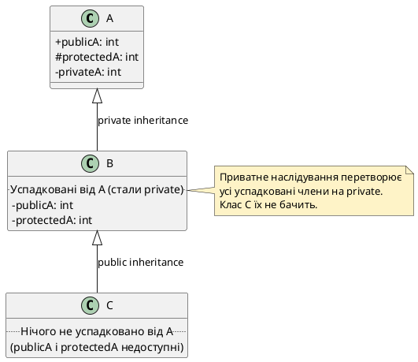

## Нова проблема: доступ похідного класу до полів предка

У попередніх статтях ми дослідили створення ієрархій наслідування, ініціалізацію об'єктів та передачу параметрів конструкторам базових класів. Усі наші приклади використовували **публічне наслідування** (`class Derived : public Base`) та специфікатори доступу `public` і `private` для членів класу.

Проте досі ми стикалися з фундаментальною незручністю: **похідний клас не має доступу до `private`-полів базового класу**, навіть якщо логічно він є «продовженням» базового класу і повинен мати можливість безпосередньо працювати з цими полями. Єдиний спосіб доступу — через публічні геттери та сеттери, що призводить до надмірної многослівності коду:

```cpp
class Person
{
private:
    string name;  // Похідний клас не має доступу!
    int age;

public:
    Person(string n, int a) : name(n), age(a) {}
    
    string getName() const { return name; }
    void setName(string n) { name = n; }
    int getAge() const { return age; }
    void setAge(int a) { if (a >= 0) age = a; }
};

class Student : public Person
{
private:
    string studentId;

public:
    Student(string n, int a, string id) : Person(n, a), studentId(id) {}
    
    void celebrateBirthday()
    {
        // Не можемо написати: age++;
        // Доводиться робити через геттер і сеттер:
        setAge(getAge() + 1);  // Незручно і незрозуміло
    }
};
```

Цей код працює, але виглядає громіздко. Чи існує спосіб дозволити похідному класу **безпосередній доступ** до полів базового класу, але **зберегти інкапсуляцію** відносно зовнішнього коду?

Так, існує — для цього C++ надає третій специфікатор доступу: **`protected`**.

::card-group

::card{title="🎯 Мета статті" icon="i-lucide-target"}

- Розкрити роль специфікатора доступу `protected`: «золота середина» між `public` і `private` для похідних класів
- Вивчити три види наслідування: `public`, `private`, `protected` та їхній вплив на доступ до успадкованих членів
- Побудувати зведену таблицю взаємодії специфікаторів доступу та типів наслідування
- Навчитися обирати правильний тип наслідування залежно від проєктної задачі
- Зрозуміти, чому публічне наслідування є стандартом у 99% випадків

::

::card{title="🔑 Ключові терміни" icon="i-lucide-key"}

- **`protected`** (*захищений*): специфікатор доступу, що відкриває доступ до членів класу для похідних класів, але закриває для зовнішнього коду
- **Публічне наслідування** (*public inheritance*): тип наслідування, що зберігає специфікатори доступу успадкованих членів без змін
- **Приватне наслідування** (*private inheritance*): тип наслідування, що перетворює всі успадковані `public` та `protected` члени на `private`
- **Захищене наслідування** (*protected inheritance*): тип наслідування, що перетворює успадковані `public` члени на `protected`

::

::

## Специфікатор доступу `protected`: доступ для нащадків

**Специфікатор `protected`** — це третій рівень доступу між `public` (доступно всім) і `private` (доступно лише членам класу). Член, оголошений як `protected`, **доступний для членів класу, дружніх класів/функцій та похідних класів**, але **недоступний для зовнішнього коду**.

Семантика проста:

::card-group

::card{title="`public` — відкритий інтерфейс" icon="i-lucide-unlock"}

Доступ **для всіх**: зовнішнього коду, похідних класів, дружніх класів. Це публічний API класу.

::

::card{title="`protected` — інтерфейс для нащадків" icon="i-lucide-shield"}

Доступ **для похідних класів та дружніх класів**, але **закритий для зовнішнього коду**. Це «напівприватний» API: використовується похідними класами, але не частина публічного інтерфейсу.

::

::card{title="`private` — внутрішня реалізація" icon="i-lucide-lock"}

Доступ **лише для членів класу та дружніх класів**. Повна інкапсуляція, навіть похідні класи не мають доступу.

::

::

Розглянемо приклад:

```cpp [ProtectedExample.cpp]
#include <iostream>

using namespace std;

class Person
{
public:
    string name;  // Публічне поле — доступне всім

private:
    string passport;  // Приватне поле — доступне лише Person

protected:
    int age;  // Захищене поле — доступне Person та похідним класам
};

class Student : public Person
{
public:
    void celebrateBirthday()
    {
        age++;  // ✅ Дозволено: age є protected у базовому класі
        name += " (студент)";  // ✅ Дозволено: name є public
        // passport = "...";  // ❌ Помилка: passport є private у базовому класі
    }
};

int main()
{
    Person person;
    person.name = "Іван Петренко";  // ✅ Дозволено: name є public
    // person.age = 25;  // ❌ Помилка: age є protected — недоступний ззовні
    // person.passport = "AA123456";  // ❌ Помилка: passport є private
    
    Student student;
    student.name = "Марія Коваленко";  // ✅ Дозволено: name є public
    // student.age = 20;  // ❌ Помилка: age є protected — недоступний ззовні
    
    return 0;
}
```

::terminal-preview{title="g++ ProtectedExample.cpp -o protected && ./protected"}

<div class="line"><span class="opacity-40">$</span> <strong class="font-bold">g++ ProtectedExample.cpp -o protected</strong></div>
<div class="line"><span class="text-red-400 font-bold">error:</span> 'int Person::age' is protected within this context</div>
<div class="line">    person.age = 25;</div>
<div class="line">           ^</div>
<div class="line"><span class="text-red-400 font-bold">error:</span> 'std::string Person::passport' is private within this context</div>
<div class="line">    person.passport = "AA123456";</div>
<div class="line">           ^</div>

::

Ключові спостереження:

1. **Всередині `Student::celebrateBirthday()`:** метод має доступ до `age` (захищене поле базового класу) та `name` (публічне поле), але **не має доступу** до `passport` (приватне поле).
2. **У `main()`:** зовнішній код має доступ лише до `name` (публічне поле). Поля `age` та `passport` недоступні — компілятор видає помилку.

::note
`protected` — це **компроміс між інкапсуляцією та зручністю**: похідний клас отримує безпосередній доступ до полів базового класу (не потрібні геттери/сеттери для кожної дрібниці), але зовнішній код цих полів не бачить.

::

## Коли використовувати `protected`: правила та обережність

Специфікатор `protected` — потужний інструмент, але він **послаблює інкапсуляцію**. Похідні класи отримують прямий доступ до реалізації базового класу, що створює **тісний зв'язок** (*tight coupling*) між ними.

::card-group

::card{title="✅ Коли доречний `protected`" icon="i-lucide-check-circle"}

- Ви повністю контролюєте ієрархію класів (вони всі у вашому проєкті, а не в зовнішній бібліотеці).
- Кількість похідних класів невелика (до 5–10 класів).
- Вам потрібен ефективний доступ до полів базового класу без накладних витрат на виклики методів.
- Поле є логічною частиною "внутрішнього API" для нащадків (наприклад, внутрішній стан, спільний для всієї ієрархії).

**Приклад:** клас `Shape` з полем `protected int x, y;` (координати) — усі похідні класи (`Circle`, `Rectangle`) використовують ці координати.

::

::card{title="⚠️ Коли краще `private` + геттери/сеттери" icon="i-lucide-alert-triangle"}

- Ви розробляєте бібліотеку, яку використовуватимуть інші розробники. Зміна `protected`-поля зламає їхній код.
- Кількість похідних класів велика або невідома.
- Поле вимагає валідації при зміні (наприклад, `age` не може бути від'ємним).
- Ви хочете мати можливість змінити внутрішню реалізацію базового класу без впливу на похідні класи.

**Приклад:** клас `BankAccount` з балансом — краще зробити `balance` приватним і надати метод `deposit(amount)` із валідацією, ніж дозволити похідним класам напряму змінювати баланс.

::

::

::warning
**Небезпека `protected`-полів:** якщо ви змінюєте тип або семантику `protected`-поля в базовому класі, **всі похідні класи**, що використовують це поле, **також потрібно оновити**. Це створює каскадні зміни, особливо небезпечні в великих ієрархіях або бібліотеках.

**Золоте правило:** використовуйте `protected` для **методів** (допоміжні функції, доступні нащадкам) частіше, ніж для **полів** (даних). Методи легше змінювати без порушення похідних класів.

::

## Практичний приклад: `protected` для зручності нащадків

Перепишемо клас `Person` з використанням `protected` для полів, що часто використовуються похідними класами:

```cpp [PersonProtected.cpp]
#include <iostream>

using namespace std;

class Person
{
protected:
    string name;
    int age;

public:
    Person(string n, int a) : name(n), age(a)
    {
        if (age < 0) age = 0;  // Валідація при створенні
    }
    
    // Публічний інтерфейс для зовнішнього коду
    string getName() const { return name; }
    int getAge() const { return age; }
    
    void setAge(int a)
    {
        if (a >= 0 && a < 150) {
            age = a;
        }
    }
};

class Student : public Person
{
private:
    string studentId;
    double gpa;

public:
    Student(string n, int a, string id, double g)
        : Person(n, a), studentId(id), gpa(g) {}
    
    void celebrateBirthday()
    {
        age++;  // ✅ Прямий доступ до protected-поля — просто і зрозуміло
        cout << name << " тепер " << age << " років!\n";
    }
    
    void updateProfile(string newName)
    {
        name = newName;  // ✅ Похідний клас може змінювати protected-поля
    }
    
    string getStudentId() const { return studentId; }
    double getGpa() const { return gpa; }
};

int main()
{
    Student student("Олена Сидоренко", 19, "CS-2024-0831", 4.5);
    
    cout << "Студент: " << student.getName() 
         << ", вік: " << student.getAge() << "\n";
    
    student.celebrateBirthday();
    
    // student.name = "Інше ім'я";  // ❌ Помилка: name є protected
    // student.age = 25;  // ❌ Помилка: age є protected
    
    student.setAge(20);  // ✅ Зміна через публічний метод з валідацією
    cout << "Оновлений вік: " << student.getAge() << "\n";
    
    return 0;
}
```

::terminal-preview{title="./person_protected"}

<div class="line">Студент: Олена Сидоренко, вік: 19</div>
<div class="line">Олена Сидоренко тепер 20 років!</div>
<div class="line">Оновлений вік: 20</div>

::

**Переваги цього підходу:**

- Похідний клас `Student` має **безпосередній доступ** до `name` та `age` без громіздких викликів геттерів/сеттерів.
- Зовнішній код **не може** напряму змінювати `name` або `age` — інкапсуляція збережена.
- Базовий клас надає **публічні методи з валідацією** (`setAge()`) для зовнішнього коду.


## Види наслідування: `public`, `private`, `protected`

До цього моменту всі наші ієрархії використовували **публічне наслідування** (`class Derived : public Base`). Проте C++ підтримує **три види наслідування**, кожен з яких змінює доступ до успадкованих членів базового класу:

::card-group

::card{title="`public` наслідування" icon="i-lucide-users"}

```cpp
class Derived : public Base
```

Найпоширеніший тип. Успадковані члени **зберігають свої специфікатори доступу**: `public` залишається `public`, `protected` залишається `protected`.

**Семантика:** відношення «є різновидом» (*is-a*). `Student` є різновидом `Person`.

::

::card{title="`private` наслідування" icon="i-lucide-lock"}

```cpp
class Derived : private Base
```

Усі успадковані `public` і `protected` члени **стають `private`** у похідному класі.

**Семантика:** відношення «реалізовано через» (*implemented-in-terms-of*). Похідний клас використовує базовий як деталь реалізації, але **не є** різновидом базового.

::

::card{title="`protected` наслідування" icon="i-lucide-shield"}

```cpp
class Derived : protected Base
```

Усі успадковані `public` члени **стають `protected`**, а `protected` залишається `protected`.

**Семантика:** рідко використовується. Проміжний варіант між `public` і `private` наслідуванням.

::

::

::note
Якщо тип наслідування не вказаний, C++ за замовчуванням використовує **`private` наслідування** для класів (`class`). Для структур (`struct`) за замовчуванням використовується `public` наслідування.

```cpp
class Derived : Base {};  // Еквівалентно: class Derived : private Base {};
struct Derived : Base {};  // Еквівалентно: struct Derived : public Base {};
```

::

## Публічне наслідування: зберігання специфікаторів доступу

Публічне наслідування — це стандартний і найінтуїтивніший тип наслідування. Він **не змінює** специфікатори доступу успадкованих членів:

| **Специфікатор у базовому класі** | **Специфікатор у похідному класі (public наслідування)** |
|:-----------------------------------|:---------------------------------------------------------|
| `public`                           | `public`                                                 |
| `protected`                        | `protected`                                              |
| `private`                          | Недоступний                                              |

Приклад:

```cpp [PublicInheritance.cpp]
#include <iostream>

using namespace std;

class Base
{
public:
    int publicField;

protected:
    int protectedField;

private:
    int privateField;
};

class Derived : public Base  // Публічне наслідування
{
public:
    void testAccess()
    {
        publicField = 1;      // ✅ Дозволено: public залишається public
        protectedField = 2;   // ✅ Дозволено: protected залишається protected
        // privateField = 3;  // ❌ Помилка: private недоступний похідному класу
    }
};

int main()
{
    Base base;
    base.publicField = 10;       // ✅ Дозволено: public доступний ззовні
    // base.protectedField = 20; // ❌ Помилка: protected недоступний ззовні
    // base.privateField = 30;   // ❌ Помилка: private недоступний ззовні
    
    Derived derived;
    derived.publicField = 100;       // ✅ Дозволено: public залишився public у Derived
    // derived.protectedField = 200; // ❌ Помилка: protected недоступний ззовні
    // derived.privateField = 300;   // ❌ Помилка: private недоступний
    
    return 0;
}
```

::tip
**Правило за замовчуванням:** використовуйте публічне наслідування в 99% випадків. Це єдиний тип, що правильно моделює відношення «є різновидом» (*is-a*), яке є основою об'єктно-орієнтованого проєктування.

Приватне та захищене наслідування — спеціалізовані інструменти для рідкісних випадків.

::

## Приватне наслідування: приховування базового класу

Приватне наслідування **перетворює всі успадковані `public` і `protected` члени на `private`** у похідному класі. Це означає:

- Похідний клас **має доступ** до `public` та `protected` членів базового класу (як і при публічному наслідуванні).
- Зовнішній код **не має доступу** до цих членів через об'єкти похідного класу.
- Класи, похідні від `Derived`, **також не мають доступу** до цих членів (вони стали `private`).

| **Специфікатор у базовому класі** | **Специфікатор у похідному класі (private наслідування)** |
|:-----------------------------------|:----------------------------------------------------------|
| `public`                           | `private`                                                 |
| `protected`                        | `private`                                                 |
| `private`                          | Недоступний                                               |

Приклад:

```cpp [PrivateInheritance.cpp]
#include <iostream>

using namespace std;

class Base
{
public:
    void publicMethod() { cout << "Base::publicMethod()\n"; }

protected:
    void protectedMethod() { cout << "Base::protectedMethod()\n"; }
};

class Derived : private Base  // Приватне наслідування
{
public:
    void testAccess()
    {
        publicMethod();     // ✅ Дозволено всередині Derived
        protectedMethod();  // ✅ Дозволено всередині Derived
    }
};

class FurtherDerived : public Derived
{
public:
    void testAccess()
    {
        // publicMethod();  // ❌ Помилка: publicMethod став private у Derived
        // protectedMethod();  // ❌ Помилка: protectedMethod став private у Derived
    }
};

int main()
{
    Base base;
    base.publicMethod();  // ✅ Дозволено: public метод базового класу
    
    Derived derived;
    // derived.publicMethod();  // ❌ Помилка: publicMethod став private у Derived
    derived.testAccess();  // ✅ Дозволено: викликає публічний метод Derived
    
    return 0;
}
```

::terminal-preview{title="./private_inheritance"}

<div class="line">Base::publicMethod()</div>
<div class="line">Base::publicMethod()</div>
<div class="line">Base::protectedMethod()</div>

::

**Коли використовувати приватне наслідування:**

Приватне наслідування моделює відношення **«реалізовано через»** (*implemented-in-terms-of*), а не «є різновидом». Похідний клас використовує базовий як **деталь реалізації**, але **не є** його різновидом з точки зору зовнішнього коду.

::card-group

::card{title="✅ Приватне наслідування доречне" icon="i-lucide-check-circle"}

Коли похідний клас хоче **переповторно використовувати реалізацію** базового класу, але **не є його різновидом** з точки зору інтерфейсу.

**Приклад:** клас `Set` може використовувати `Vector` як внутрішнє сховище, але `Set` **не є** різновидом `Vector` (у `Set` немає операції індексації `[]`).

```cpp
class Set : private Vector  // Set НЕ є різновидом Vector
{
    // Використовуємо методи Vector всередині, але не публікуємо їх
};
```

::

::card{title="⚠️ Альтернатива: композиція" icon="i-lucide-package"}

У більшості випадків замість приватного наслідування краще використовувати **композицію** (приватне поле типу базового класу):

```cpp
class Set
{
private:
    Vector storage;  // Композиція замість наслідування
    
public:
    void add(int value) { storage.pushBack(value); }
};
```

Композиція чіткіша та гнучкіша. Приватне наслідування використовується рідко.

::

::

::warning
**Приватне наслідування порушує принцип підстановки Лісков** (*Liskov Substitution Principle*): не можна використовувати об'єкт `Derived` там, де очікується `Base`, бо зовнішній код не має доступу до інтерфейсу `Base`.

```cpp
void processBase(Base& b) { b.publicMethod(); }

Derived derived;
// processBase(derived);  // ❌ Помилка компіляції: Derived не конвертується до Base
```

::

## Захищене наслідування: рідкісний проміжний варіант

Захищене наслідування перетворює всі успадковані `public` члени на `protected`, а `protected` члени залишаються `protected`:

| **Специфікатор у базовому класі** | **Специфікатор у похідному класі (protected наслідування)** |
|:-----------------------------------|:------------------------------------------------------------|
| `public`                           | `protected`                                                 |
| `protected`                        | `protected`                                                 |
| `private`                          | Недоступний                                                 |

Приклад:

```cpp [ProtectedInheritance.cpp]
class Base
{
public:
    void publicMethod() {}

protected:
    void protectedMethod() {}
};

class Derived : protected Base  // Захищене наслідування
{
    // publicMethod() тепер protected у Derived
    // protectedMethod() залишається protected
};

class FurtherDerived : public Derived
{
public:
    void test()
    {
        publicMethod();     // ✅ Дозволено: publicMethod тепер protected у Derived
        protectedMethod();  // ✅ Дозволено: protectedMethod залишився protected
    }
};

int main()
{
    Derived derived;
    // derived.publicMethod();  // ❌ Помилка: publicMethod став protected у Derived
    
    return 0;
}
```

**Коли використовувати захищене наслідування:**

Захищене наслідування використовується **вкрай рідко** — лише в складних ієрархіях, де потрібно зберегти доступ до членів базового класу для **подальших похідних класів**, але приховати їх від зовнішнього коду.

::note
На практиці захищене наслідування зустрічається рідше за приватне. Його складно обґрунтувати, і зазвичай є кращі альтернативи (публічне наслідування + `protected`-методи або композиція).

::

## Зведена таблиця: специфікатори доступу та види наслідування

Ось повна таблиця, що показує, як специфікатори доступу членів базового класу змінюються в похідному класі залежно від типу наслідування:

| **Базовий клас** | **`public` наслідування** | **`private` наслідування** | **`protected` наслідування** |
|:-----------------|:--------------------------|:---------------------------|:-----------------------------|
| `public`         | `public`                  | `private`                  | `protected`                  |
| `protected`      | `protected`               | `private`                  | `protected`                  |
| `private`        | Недоступний               | Недоступний                | Недоступний                  |

::tip
**Як запам'ятати таблицю:**

1. **`public` наслідування:** нічого не змінює — все залишається як було.
2. **`private` наслідування:** усе успадковане стає `private`.
3. **`protected` наслідування:** усе успадковане стає **щонайменше** `protected`.
4. **`private` члени базового класу:** завжди недоступні похідному класу, незалежно від типу наслідування.

::


## Фундаментальні правила доступу в ієрархіях

Щоб уникнути плутанини при роботі зі специфікаторами доступу та типами наслідування, запам'ятайте три фундаментальні правила:

::steps

### Правило 1. Клас завжди має доступ до своїх власних членів

Клас має **необмежений доступ** до своїх **власних** (не успадкованих) членів, незалежно від їхніх специфікаторів доступу. Специфікатори впливають лише на доступ **ззовні** класу та з **похідних класів**.

```cpp
class MyClass
{
private:
    int privateField;

public:
    void myMethod()
    {
        privateField = 42;  // ✅ Завжди дозволено: доступ до власного члена
    }
};
```

### Правило 2. Доступ похідного класу до успадкованих членів визначається специфікатором базового класу

Коли похідний клас **успадковує члени**, він отримує доступ до них **відповідно до специфікаторів доступу в базовому класі**:

- `public` і `protected` члени базового класу доступні похідному.
- `private` члени базового класу **ніколи не доступні** похідному класу (навіть при публічному наслідуванні).

Це правило не залежить від типу наслідування — воно визначає, **чи може похідний клас взагалі бачити член**.

```cpp
class Base
{
public:
    int publicField;  // Похідний клас має доступ

protected:
    int protectedField;  // Похідний клас має доступ

private:
    int privateField;  // Похідний клас НЕ має доступу
};
```

### Правило 3. Тип наслідування визначає доступ зовнішнього коду та подальших нащадків

**Тип наслідування** (`public`, `private`, `protected`) змінює специфікатори доступу успадкованих членів **у похідному класі**. Це впливає на:

- Доступ **зовнішнього коду** до успадкованих членів через об'єкти похідного класу.
- Доступ **подальших похідних класів** до цих членів.

Але тип наслідування **не впливає** на:

- Доступ самого похідного класу до успадкованих членів (це визначається правилом 2).
- Специфікатори доступу власних (не успадкованих) членів похідного класу.

::

::warning
**Типова помилка початківців:** плутати два аспекти:

1. **Чи може похідний клас бачити член базового класу** (визначається специфікатором у базовому класі).
2. **Який специфікатор має успадкований член у похідному класі** (визначається типом наслідування).

Приклад:

```cpp
class Base
{
private:
    int privateField;  // Похідний клас НЕ БАЧИТЬ цей член

public:
    int publicField;  // Похідний клас БАЧИТЬ цей член
};

class Derived : private Base  // Приватне наслідування
{
public:
    void test()
    {
        publicField = 1;  // ✅ Дозволено: Derived бачить publicField (правило 2)
        // privateField = 2;  // ❌ Помилка: Derived не бачить privateField
    }
};

int main()
{
    Derived d;
    // d.publicField = 10;  // ❌ Помилка: publicField став private у Derived (правило 3)
}
```

::

## Практичний приклад: багаторівнева ієрархія зі специфікаторами

Розглянемо складну ієрархію, що демонструє взаємодію специфікаторів доступу та типів наслідування:

```cpp [ComplexHierarchy.cpp]
#include <iostream>

using namespace std;

class A
{
public:
    int publicA;

protected:
    int protectedA;

private:
    int privateA;
};

class B : private A  // Приватне наслідування
{
    // publicA тепер private у B
    // protectedA тепер private у B
    // privateA недоступний у B

public:
    void testB()
    {
        publicA = 1;      // ✅ Дозволено: B бачить publicA (він успадкований)
        protectedA = 2;   // ✅ Дозволено: B бачить protectedA
        // privateA = 3;  // ❌ Помилка: privateA недоступний похідним класам
    }
};

class C : public B  // Публічне наслідування від B
{
public:
    void testC()
    {
        // publicA = 10;      // ❌ Помилка: publicA став private у B — C не бачить його
        // protectedA = 20;   // ❌ Помилка: protectedA став private у B
    }
};

int main()
{
    A a;
    a.publicA = 100;       // ✅ Дозволено
    // a.protectedA = 200; // ❌ Помилка
    
    B b;
    // b.publicA = 100;  // ❌ Помилка: publicA став private у B
    
    C c;
    // c.publicA = 100;  // ❌ Помилка: publicA недоступний через C
    
    return 0;
}
```

**Ключові спостереження:**

1. Клас `B` **приватно** успадковує `A` → `publicA` і `protectedA` стають `private` у `B`.
2. Клас `C` **публічно** успадковує `B` → але він не має доступу до `publicA` і `protectedA`, бо вони вже стали `private` у `B`.
3. **Приватне наслідування «обрізає» ланцюжок доступу** — подальші нащадки не бачать членів, що стали `private`.

::plant-uml{alt="Візуалізація доступу в багаторівневій ієрархії"}



::

## Рекомендації: коли використовувати який тип наслідування

::card-group

::card{title="✅ `public` наслідування — стандарт" icon="i-lucide-star"}

**Використовуйте у 99% випадків.**

- Моделює відношення «є різновидом» (*is-a*).
- Похідний клас є **повноцінним різновидом** базового класу.
- Об'єкт похідного класу може бути переданий туди, де очікується базовий клас (принцип підстановки Лісков).

**Приклад:** `Dog : public Animal`, `Student : public Person`, `Circle : public Shape`.

::

::card{title="🔧 `private` наслідування — для реалізації" icon="i-lucide-tool"}

**Використовуйте рідко, коли базовий клас — деталь реалізації.**

- Моделює відношення «реалізовано через» (*implemented-in-terms-of*).
- Зовнішній код не повинен знати про базовий клас.
- **Альтернатива:** композиція (приватне поле) — часто краща.

**Приклад:** `Stack : private Vector` (стек реалізований через вектор, але не є його різновидом).

::

::card{title="🛡️ `protected` наслідування — майже ніколи" icon="i-lucide-shield"}

**Використовується вкрай рідко в спеціалізованих ієрархіях.**

- Моделює проміжний варіант між `public` і `private`.
- Зазвичай є кращі альтернативи (публічне наслідування + `protected` члени).

**Приклад:** важко знайти переконливий приклад — це говорить про його рідкісність.

::

::

::tip
**Правило великого пальця:** якщо ви сумніваєтесь, який тип наслідування використовувати, **використовуйте `public`**. Якщо публічне наслідування не підходить концептуально (похідний клас **не є** різновидом базового), то краще використовувати **композицію** (приватне поле), а не приватне наслідування.

::

## Практичне завдання

::::accordion

:::accordion-item{label="📋 Завдання: Ієрархія транспортних засобів із різними рівнями доступу" icon="i-lucide-clipboard-list"}

Створіть ієрархію класів для моделювання транспортних засобів:

- **Базовий клас `Vehicle`** має:
  - `protected` поле `fuelLevel` (рівень палива, `double`)
  - `private` поле `engineCode` (код двигуна, `string`)
  - `public` метод `refuel(double amount)` — збільшує `fuelLevel`
  - `public` метод `getFuelLevel()` — повертає `fuelLevel`

- **Похідний клас `Car`** (публічне наслідування від `Vehicle`) має:
  - `private` поле `numberOfDoors` (кількість дверей, `int`)
  - `public` метод `drive(double distance)` — зменшує `fuelLevel` на `distance / 10.0`
  - `public` метод `getNumberOfDoors()` — повертає `numberOfDoors`

- **Похідний клас `Truck`** (публічне наслідування від `Vehicle`) має:
  - `private` поле `cargoCapacity` (вантажопідйомність, `double`)
  - `public` метод `loadCargo(double weight)` — виводить повідомлення про завантаження
  - `public` метод `getCargoCapacity()` — повертає `cargoCapacity`

**Тестовий код:**

```cpp
int main()
{
    Car car(4, 50.0);
    cout << "Автомобіль: " << car.getNumberOfDoors() << " дверей, "
         << car.getFuelLevel() << " л палива\n";
    
    car.drive(100.0);
    cout << "Після поїздки: " << car.getFuelLevel() << " л\n";
    
    car.refuel(20.0);
    cout << "Після заправки: " << car.getFuelLevel() << " л\n";
    
    Truck truck(5000.0, 200.0);
    cout << "\nВантажівка: вантажопідйомність " 
         << truck.getCargoCapacity() << " кг, "
         << truck.getFuelLevel() << " л палива\n";
    
    truck.loadCargo(3000.0);
    
    return 0;
}
```

:::

:::accordion-item{label="✅ Розв'язок" icon="i-lucide-check-circle"}

```cpp [VehicleHierarchy.cpp]
#include <iostream>

using namespace std;

class Vehicle
{
protected:
    double fuelLevel;  // Доступний похідним класам

private:
    string engineCode;  // Недоступний похідним класам

public:
    Vehicle(double fuel, string code = "UNKNOWN")
        : fuelLevel(fuel), engineCode(code) {}
    
    void refuel(double amount)
    {
        fuelLevel += amount;
    }
    
    double getFuelLevel() const
    {
        return fuelLevel;
    }
};

class Car : public Vehicle
{
private:
    int numberOfDoors;

public:
    Car(int doors, double fuel) : Vehicle(fuel, "CAR-2024"), numberOfDoors(doors) {}
    
    void drive(double distance)
    {
        double consumption = distance / 10.0;  // 10 км на 1 л
        fuelLevel -= consumption;  // ✅ Доступ до protected-поля базового класу
        
        if (fuelLevel < 0) fuelLevel = 0;
    }
    
    int getNumberOfDoors() const
    {
        return numberOfDoors;
    }
};

class Truck : public Vehicle
{
private:
    double cargoCapacity;

public:
    Truck(double capacity, double fuel)
        : Vehicle(fuel, "TRUCK-2024"), cargoCapacity(capacity) {}
    
    void loadCargo(double weight)
    {
        if (weight <= cargoCapacity) {
            cout << "Завантажено " << weight << " кг вантажу\n";
        } else {
            cout << "Перевищено вантажопідйомність!\n";
        }
    }
    
    double getCargoCapacity() const
    {
        return cargoCapacity;
    }
};

int main()
{
    Car car(4, 50.0);
    cout << "Автомобіль: " << car.getNumberOfDoors() << " дверей, "
         << car.getFuelLevel() << " л палива\n";
    
    car.drive(100.0);
    cout << "Після поїздки: " << car.getFuelLevel() << " л\n";
    
    car.refuel(20.0);
    cout << "Після заправки: " << car.getFuelLevel() << " л\n";
    
    Truck truck(5000.0, 200.0);
    cout << "\nВантажівка: вантажопідйомність " 
         << truck.getCargoCapacity() << " кг, "
         << truck.getFuelLevel() << " л палива\n";
    
    truck.loadCargo(3000.0);
    
    return 0;
}
```

::terminal-preview{title="./vehicle_hierarchy"}

<div class="line">Автомобіль: 4 дверей, 50 л палива</div>
<div class="line">Після поїздки: 40 л</div>
<div class="line">Після заправки: 60 л</div>
<div class="line"></div>
<div class="line">Вантажівка: вантажопідйомність 5000 кг, 200 л палива</div>
<div class="line">Завантажено 3000 кг вантажу</div>

::

**Ключові моменти розв'язку:**

- `fuelLevel` оголошене як `protected` — похідні класи `Car` і `Truck` мають до нього безпосередній доступ (метод `drive()` безпосередньо зменшує `fuelLevel`).
- `engineCode` оголошене як `private` — похідні класи не мають до нього доступу (повна інкапсуляція).
- Обидва похідні класи використовують **публічне наслідування** — вони є різновидами `Vehicle`.

:::

::::

## Резюме

У цій статті ми дослідили третій специфікатор доступу `protected` та його роль у наслідуванні, а також три види наслідування (`public`, `private`, `protected`) і їхній вплив на доступ до успадкованих членів.

::card-group

::card{title="🎯 Головні висновки" icon="i-lucide-check-circle"}

- **`protected`** — специфікатор доступу, що відкриває члени для похідних класів, але закриває для зовнішнього коду
- **Публічне наслідування** (`public`) — стандартний тип, що зберігає специфікатори доступу успадкованих членів
- **Приватне наслідування** (`private`) — перетворює всі успадковані `public` і `protected` члени на `private`
- **Захищене наслідування** (`protected`) — перетворює успадковані `public` члени на `protected`
- **Золоте правило:** використовуйте публічне наслідування в 99% випадків

::

::card{title="⚠️ Що запам'ятати" icon="i-lucide-alert-circle"}

- `protected` послаблює інкапсуляцію — використовуйте обережно, переважно для методів, а не полів
- `private` члени базового класу **ніколи не доступні** похідним класам, незалежно від типу наслідування
- Тип наслідування визначає **доступ зовнішнього коду та подальших нащадків**, але не впливає на доступ самого похідного класу до успадкованих членів
- Приватне та захищене наслідування використовуються рідко — зазвичай краща альтернатива — композиція

::

::

::card{title="🔜 Наступна стаття" icon="i-lucide-arrow-right"}

На наступному етапі ми розглянемо **додання нового функціоналу в похідних класах** та **перевизначення методів**. Ви дізнаєтесь, як похідні класи можуть розширювати та модифікувати поведінку базових класів, зберігаючи або змінюючи їхню реалізацію.

::

