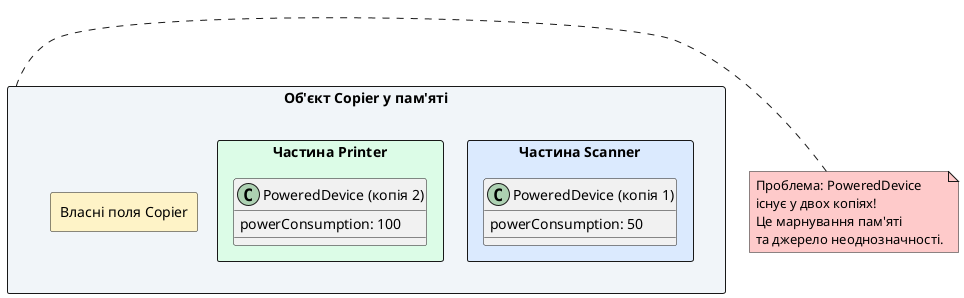
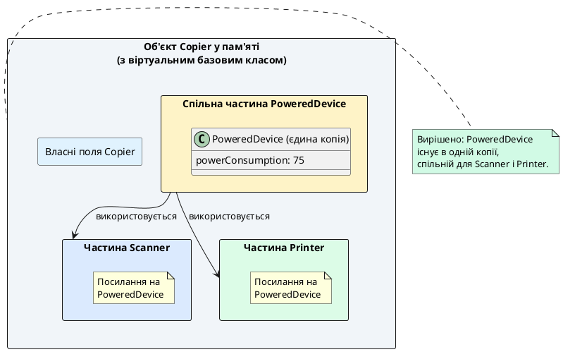

## Від одного батька до багатьох: розширення можливостей

До цього моменту ми розглядали лише **одиночне наслідування** (*single inheritance*), де похідний клас має рівно один безпосередній базовий клас. Це найпоширеніший та найбезпечніший спосіб побудови ієрархій класів. Проте C++ підтримує **множинне наслідування** (*multiple inheritance*) — можливість класу успадковувати від **двох або більше базових класів одночасно**.

Розглянемо мотивацію: припустимо, ми моделюємо вчителя (*Teacher*). Вчитель — це людина (*Person*), але також це працівник (*Employee*) з зарплатою, посадою та графіком роботи. З точки зору моделювання, вчитель **одночасно є** людиною та працівником:

- `Teacher` **є різновидом** `Person` (має ім'я, вік, адресу)
- `Teacher` **є різновидом** `Employee` (має роботодавця, зарплату, посаду)

Одиночне наслідування не дозволяє виразити цю подвійність — клас може успадковувати лише від одного батька. Множинне наслідування вирішує цю проблему, дозволяючи `Teacher` успадковувати від обох класів одночасно.

::card-group

::card{title="🎯 Мета статті" icon="i-lucide-target"}

- Опанувати синтаксис множинного наслідування: успадкування від кількох базових класів
- Зрозуміти порядок виклику конструкторів та деструкторів при множинному наслідуванні
- Дослідити проблему діамантового наслідування (ромб смерті) та її наслідки
- Навчитися вирішувати проблему ромба через **віртуальні базові класи**
- Усвідомити, чому множинне наслідування варто використовувати обережно

::

::card{title="🔑 Ключові терміни" icon="i-lucide-key"}

- **Множинне наслідування** (*multiple inheritance*): клас успадковує від двох або більше базових класів одночасно
- **Проблема діамантового наслідування** (*diamond problem*): коли два проміжні класи успадковують від одного базового, а похідний клас успадковує від обох проміжних
- **Віртуальний базовий клас** (*virtual base class*): базовий клас, оголошений як `virtual`, забезпечує існування лише однієї копії цього класу в ієрархії
- **Неоднозначність імен** (*name ambiguity*): коли кілька базових класів мають методи з однаковими іменами

::

::

## Синтаксис множинного наслідування

Щоб клас успадкував від кількох базових класів, потрібно перелічити їх через кому після двокрапки:

```cpp
class Derived : public Base1, public Base2, public Base3
{
    // Тіло класу
};
```

Розглянемо повний приклад з вчителем:

```cpp [MultipleInheritance.cpp]
#include <iostream>

using namespace std;

class Person
{
protected:
    string name;
    int age;

public:
    Person(string n, int a) : name(n), age(a)
    {
        cout << "  → Конструктор Person: " << name << "\n";
    }
    
    string getName() const { return name; }
    int getAge() const { return age; }
};

class Employee
{
protected:
    string employer;
    double salary;

public:
    Employee(string emp, double sal) : employer(emp), salary(sal)
    {
        cout << "  → Конструктор Employee: " << employer << "\n";
    }
    
    string getEmployer() const { return employer; }
    double getSalary() const { return salary; }
};

// Teacher успадковує від Person та Employee одночасно
class Teacher : public Person, public Employee
{
private:
    string subject;

public:
    Teacher(string n, int a, string emp, double sal, string subj)
        : Person(n, a), Employee(emp, sal), subject(subj)
    {
        cout << "  → Конструктор Teacher: предмет " << subject << "\n";
    }
    
    void displayInfo()
    {
        cout << "Вчитель: " << getName() << ", вік " << getAge() << "\n";
        cout << "Працює в: " << getEmployer() << "\n";
        cout << "Зарплата: " << getSalary() << " грн\n";
        cout << "Викладає: " << subject << "\n";
    }
};

int main()
{
    Teacher teacher("Олена Петрівна", 45, "Ліцей №7", 18000, "Математика");
    
    cout << "\nІнформація про вчителя:\n";
    teacher.displayInfo();
    
    return 0;
}
```

::terminal-preview{title="./multiple_inheritance"}

<div class="line">  → Конструктор Person: Олена Петрівна</div>
<div class="line">  → Конструктор Employee: Ліцей №7</div>
<div class="line">  → Конструктор Teacher: предмет Математика</div>
<div class="line"></div>
<div class="line">Інформація про вчителя:</div>
<div class="line">Вчитель: Олена Петрівна, вік 45</div>
<div class="line">Працює в: Ліцей №7</div>
<div class="line">Зарплата: 18000 грн</div>
<div class="line">Викладає: Математика</div>

::

**Ключові спостереження:**

1. **Порядок ініціалізації:** конструктори базових класів викликаються **у порядку їхнього оголошення** у списку наслідування: спочатку `Person`, потім `Employee`, нарешті `Teacher`.
2. **Доступ до членів:** клас `Teacher` має доступ до всіх `public` та `protected` членів обох базових класів — `getName()` з `Person`, `getEmployer()` з `Employee`.
3. **Список ініціалізації:** конструктор `Teacher` явно викликає конструктори **обох** базових класів через список ініціалізації.

::note
Порядок виклику конструкторів визначається **порядком оголошення базових класів** у рядку наслідування, а не порядком у списку ініціалізації конструктора. Якби ми написали `: Employee(emp, sal), Person(n, a)`, все одно спочатку виконався б `Person`, потім `Employee`.

::

## Порядок деструкторів при множинному наслідуванні

Деструктори викликаються у **зворотному порядку** відносно конструкторів: спочатку деструктор похідного класу, потім базових класів у зворотному порядку їхнього оголошення.

```cpp [Destructors.cpp]
class Person
{
public:
    Person(string n) : name(n) {}
    ~Person() { cout << "  ← Деструктор Person\n"; }
};

class Employee
{
public:
    Employee(string e) : employer(e) {}
    ~Employee() { cout << "  ← Деструктор Employee\n"; }
};

class Teacher : public Person, public Employee
{
public:
    Teacher(string n, string e, string s)
        : Person(n), Employee(e), subject(s) {}
    ~Teacher() { cout << "  ← Деструктор Teacher\n"; }
};

int main()
{
    {
        Teacher teacher("Іван", "Школа", "Фізика");
    }
    cout << "Об'єкт знищено\n";
    return 0;
}
```

::terminal-preview{title="./destructors"}

<div class="line">  ← Деструктор Teacher</div>
<div class="line">  ← Деструктор Employee</div>
<div class="line">  ← Деструктор Person</div>
<div class="line">Об'єкт знищено</div>

::

Порядок: `Teacher` → `Employee` → `Person` (зворотний до порядку конструювання).

## Проблема неоднозначності імен

Перша серйозна проблема множинного наслідування: **неоднозначність імен** (*name ambiguity*). Якщо кілька базових класів мають методи з однаковими іменами, компілятор не знає, який з них викликати.

Розглянемо приклад:

```cpp [Ambiguity.cpp]
#include <iostream>

using namespace std;

class USBDevice
{
protected:
    long id;

public:
    USBDevice(long i) : id(i) {}
    
    long getId() const { return id; }
};

class NetworkDevice
{
protected:
    long id;

public:
    NetworkDevice(long i) : id(i) {}
    
    long getId() const { return id; }
};

class WirelessAdapter : public USBDevice, public NetworkDevice
{
public:
    WirelessAdapter(long usbId, long networkId)
        : USBDevice(usbId), NetworkDevice(networkId) {}
};

int main()
{
    WirelessAdapter adapter(5521, 8842);
    
    // cout << adapter.getId();  // ❌ Помилка компіляції: неоднозначність!
    
    // Потрібно явно вказати, який getId() викликати:
    cout << "USB ID: " << adapter.USBDevice::getId() << "\n";
    cout << "Network ID: " << adapter.NetworkDevice::getId() << "\n";
    
    return 0;
}
```

::terminal-preview{title="g++ Ambiguity.cpp -o ambiguity"}

<div class="line"><span class="opacity-40">$</span> <strong class="font-bold">g++ Ambiguity.cpp -o ambiguity</strong></div>
<div class="line"><span class="text-red-400 font-bold">error:</span> request for member 'getId' is ambiguous</div>
<div class="line">    cout << adapter.getId();</div>
<div class="line">                    ^</div>
<div class="line"><span class="text-blue-400">note:</span> candidates are: 'long int NetworkDevice::getId() const'</div>
<div class="line"><span class="text-blue-400">note:</span>                 'long int USBDevice::getId() const'</div>

::

**Проблема:** обидва базові класи мають метод `getId()`. Компілятор не може вибрати один з них автоматично — це **неоднозначність**.

**Рішення:** явно вказати, який саме метод викликати, через оператор `::`:

```cpp
adapter.USBDevice::getId();     // Викликати getId() з USBDevice
adapter.NetworkDevice::getId(); // Викликати getId() з NetworkDevice
```

::warning
Чим більше базових класів має похідний клас, тим вища ймовірність конфліктів імен. У великих ієрархіях це може призвести до **експоненціального зростання складності** — кожен новий базовий клас потенційно конфліктує з усіма існуючими.

::

## Проблема діамантового наслідування (ромб смерті)

Найсерйозніша проблема множинного наслідування — **проблема ромба** (*diamond problem*), також відома як **«ромб смерті»** (*diamond of death* або *diamond of doom*).

**Сценарій:** два проміжні класи успадковують від одного спільного базового класу, а похідний клас успадковує від обох проміжних. Структура нагадує ромб (діамант):

```
      PoweredDevice
       /         \
   Scanner      Printer
       \         /
         Copier
```

Розглянемо код:

```cpp [DiamondProblem.cpp]
#include <iostream>

using namespace std;

class PoweredDevice
{
protected:
    int powerConsumption;

public:
    PoweredDevice(int power) : powerConsumption(power)
    {
        cout << "  → PoweredDevice: споживання " << power << " Вт\n";
    }
    
    int getPower() const { return powerConsumption; }
};

class Scanner : public PoweredDevice
{
public:
    Scanner(int power) : PoweredDevice(power)
    {
        cout << "  → Scanner\n";
    }
};

class Printer : public PoweredDevice
{
public:
    Printer(int power) : PoweredDevice(power)
    {
        cout << "  → Printer\n";
    }
};

class Copier : public Scanner, public Printer
{
public:
    Copier(int scannerPower, int printerPower)
        : Scanner(scannerPower), Printer(printerPower)
    {
        cout << "  → Copier\n";
    }
};

int main()
{
    Copier copier(50, 100);
    
    // cout << copier.getPower();  // ❌ Помилка: неоднозначність!
    
    cout << "\nСпоживання сканера: " << copier.Scanner::getPower() << " Вт\n";
    cout << "Споживання принтера: " << copier.Printer::getPower() << " Вт\n";
    
    return 0;
}
```

::terminal-preview{title="./diamond_problem"}

<div class="line">  → PoweredDevice: споживання 50 Вт</div>
<div class="line">  → Scanner</div>
<div class="line">  → PoweredDevice: споживання 100 Вт</div>
<div class="line">  → Printer</div>
<div class="line">  → Copier</div>
<div class="line"></div>
<div class="line">Споживання сканера: 50 Вт</div>
<div class="line">Споживання принтера: 100 Вт</div>

::

**Що сталося:**

1. **`PoweredDevice` створено двічі:** спочатку для `Scanner` (50 Вт), потім для `Printer` (100 Вт).
2. Об'єкт `Copier` містить **дві незалежні копії** `PoweredDevice` — одну від `Scanner`, іншу від `Printer`.
3. Виклик `copier.getPower()` неоднозначний — компілятор не знає, яку версію використовувати.

::plant-uml{alt="Фізична структура об'єкта Copier з дублюванням PoweredDevice"}



::

**Наслідки проблеми ромба:**

1. **Дублювання даних:** кожен базовий клас займає місце в пам'яті двічі.
2. **Неоднозначність:** виклики методів базового класу вимагають явного уточнення.
3. **Логічна неузгодженість:** концептуально `Copier` — це **один** пристрій, який **одного разу** підключається до розетки, але код моделює це як **два окремі пристрої** із різним споживанням.


## Вирішення проблеми ромба: віртуальні базові класи

C++ надає механізм вирішення проблеми діамантового наслідування: **віртуальні базові класи** (*virtual base classes*). Якщо оголосити базовий клас як `virtual` при наслідуванні, компілятор забезпечує існування **лише однієї копії** цього класу в усій ієрархії, навіть якщо він успадковується через кілька шляхів.

Синтаксис:

```cpp
class Derived : virtual public Base
{
    // ...
};
```

Ключове слово `virtual` вказує, що `Base` є **віртуальним базовим класом**. Усі класи, що успадковують від цього віртуального базового класу, **спільно використовують одну його копію**.

Застосуємо це до нашого прикладу:

```cpp [VirtualBase.cpp]
#include <iostream>

using namespace std;

class PoweredDevice
{
protected:
    int powerConsumption;

public:
    PoweredDevice(int power) : powerConsumption(power)
    {
        cout << "  → PoweredDevice: споживання " << power << " Вт\n";
    }
    
    int getPower() const { return powerConsumption; }
};

// Scanner віртуально успадковує PoweredDevice
class Scanner : virtual public PoweredDevice
{
public:
    Scanner(int power) : PoweredDevice(power)
    {
        cout << "  → Scanner\n";
    }
};

// Printer віртуально успадковує PoweredDevice
class Printer : virtual public PoweredDevice
{
public:
    Printer(int power) : PoweredDevice(power)
    {
        cout << "  → Printer\n";
    }
};

class Copier : public Scanner, public Printer
{
public:
    // Copier відповідає за створення віртуального базового класу!
    Copier(int power)
        : PoweredDevice(power),  // Явний виклик віртуального базового класу
          Scanner(power),        // Ці виклики PoweredDevice ігноруються
          Printer(power)
    {
        cout << "  → Copier\n";
    }
};

int main()
{
    Copier copier(75);
    
    cout << "\nСпоживання пристрою: " << copier.getPower() << " Вт\n";
    
    return 0;
}
```

::terminal-preview{title="./virtual_base"}

<div class="line">  → PoweredDevice: споживання 75 Вт</div>
<div class="line">  → Scanner</div>
<div class="line">  → Printer</div>
<div class="line">  → Copier</div>
<div class="line"></div>
<div class="line">Споживання пристрою: 75 Вт</div>

::

**Ключові зміни:**

1. **`virtual public PoweredDevice`** у класах `Scanner` та `Printer` — оголошуємо `PoweredDevice` віртуальним базовим класом.
2. **`PoweredDevice` створюється лише один раз** — тепер в пам'яті існує лише одна копія, спільна для всієї ієрархії.
3. **Copier викликає конструктор `PoweredDevice` напряму** — найнижчий клас у ієрархії відповідає за ініціалізацію віртуального базового класу.
4. **Виклики `PoweredDevice(power)` у `Scanner` та `Printer` ігноруються** при створенні `Copier` — але вони все ще потрібні для можливості створення автономних об'єктів `Scanner` та `Printer`.

::note
**Порядок конструювання з віртуальними базовими класами:**

1. **Спочатку віртуальні базові класи** — у порядку їхньої появи в дереві наслідування (зліва направо, зверху вниз).
2. **Потім невіртуальні базові класи** — у порядку їхнього оголошення.
3. **Нарешті власний конструктор похідного класу**.

У нашому прикладі: `PoweredDevice` (віртуальний) → `Scanner` → `Printer` → `Copier`.

::

::plant-uml{alt="Фізична структура об'єкта Copier з єдиною копією PoweredDevice"}



::

## Правила роботи з віртуальними базовими класами

::steps

### Правило 1. Віртуальний базовий клас створюється найнижчим класом ієрархії

У діамантовій ієрархії **найнижчий клас** (той, який успадковує від кількох проміжних класів) відповідає за виклик конструктора віртуального базового класу. У нашому прикладі це `Copier`.

Конструктори проміжних класів (`Scanner`, `Printer`) **все ще мають** виклики конструктора `PoweredDevice`, але при створенні `Copier` ці виклики **ігноруються**.

### Правило 2. Віртуальні базові класи створюються першими

Віртуальні базові класи завжди конструюються **раніше за невіртуальні**, щоб гарантувати їхню готовність до використання всіма похідними класами.

### Правило 3. Проміжні класи повинні мати конструктори, що викликають віртуальний базовий клас

Навіть якщо при створенні `Copier` виклики `PoweredDevice(power)` у `Scanner` та `Printer` ігноруються, вони **необхідні** для можливості створення автономних об'єктів:

```cpp
Scanner scanner(50);  // ✅ Використовує Scanner::Scanner(int), який викликає PoweredDevice(50)
Printer printer(100); // ✅ Використовує Printer::Printer(int), який викликає PoweredDevice(100)
```

Без цих викликів компілятор не зміг би створити `Scanner` або `Printer` окремо.

### Правило 4. Віртуальне наслідування транзитивне

Якщо `A` віртуально успадковує `Base`, а `B` віртуально успадковує `Base`, і `C` успадковує від `A` та `B`, то `C` має **одну спільну копію** `Base`, навіть якщо `C` сам не оголошує `Base` як віртуальний.

::

## Коли використовувати віртуальні базові класи

::card-group

::card{title="✅ Використовуйте віртуальні базові класи" icon="i-lucide-check-circle"}

- Коли у вас **діамантова ієрархія** (два шляхи до одного спільного предка).
- Коли концептуально базовий клас **повинен існувати в одній копії** (наприклад, `PoweredDevice` — це одне з'єднання з розеткою, а не два).
- Коли дублювання базового класу призводить до логічних помилок або марнування пам'яті.

::

::card{title="⚠️ Обережність із віртуальними базовими класами" icon="i-lucide-alert-triangle"}

- Віртуальні базові класи **ускладнюють** ініціалізацію: найнижчий клас повинен знати про віртуальний базовий клас і викликати його конструктор.
- Вони додають **накладні витрати** на виконання: компілятор використовує додаткові таблиці покажчиків для управління спільною копією.
- Вони **порушують інкапсуляцію**: похідний клас повинен знати про деталі реалізації проміжних класів (що вони мають віртуальний базовий клас).

::

::

## Чи варто використовувати множинне наслідування?

Множинне наслідування — **потужний, але небезпечний інструмент**. Більшість завдань, що вирішуються множинним наслідуванням, можна вирішити **одиночним наслідуванням** або **композицією**.

::card-group

::card{title="❌ Проблеми множинного наслідування" icon="i-lucide-x-circle"}

- **Конфлікти імен:** чим більше базових класів, тим вища ймовірність неоднозначності.
- **Складність підтримки:** зміна в одному базовому класі може зламати всю ієрархію.
- **Проблема ромба:** вимагає віртуальних базових класів та ускладнює ініціалізацію.
- **Накладні витрати:** віртуальні базові класи сповільнюють виконання та збільшують розмір об'єктів.

::

::card{title="✅ Альтернативи множинному наслідуванню" icon="i-lucide-lightbulb"}

**1. Композиція замість наслідування:**

```cpp
class Teacher
{
private:
    Person personData;    // Композиція замість наслідування
    Employee employeeData;
    string subject;
};
```

**2. Інтерфейси (чисто віртуальні класи):**

Багато мов (Java, C#) забороняють множинне наслідування класів, але дозволяють множинне наслідування **інтерфейсів** (абстрактних класів без даних). Ми розглянемо це в наступних статтях.

::

::

::note
**Факт:** багато великих проєктів на C++ **повністю забороняють** множинне наслідування у своїх стандартах кодування (Google C++ Style Guide, Qt Coding Conventions). Вони дозволяють лише множинне наслідування **інтерфейсів** (чисто віртуальних класів).

Навіть стандартна бібліотека C++ використовує множинне наслідування рідко і обережно (наприклад, `std::iostream` успадковує від `std::istream` та `std::ostream`).

::

::warning
**Золоте правило:** використовуйте множинне наслідування **лише в крайніх випадках**, коли завдання неможливо вирішити одиночним наслідуванням або композицією, і ви повністю розумієте наслідки.

У 95% випадків є кращі альтернативи:
- Композиція (об'єкти як поля класу)
- Одиночне наслідування з додаванням функціоналу через композицію
- Шаблони проєктування (Strategy, Decorator, Adapter)

::


## Практичний приклад: ієрархія пристроїв із віртуальним базовим класом

Закріпимо знання на повному прикладі з множинним наслідуванням та віртуальним базовим класом:

```cpp [DeviceHierarchy.cpp]
#include <iostream>

using namespace std;

// Базовий клас — електронний пристрій
class ElectronicDevice
{
protected:
    string serialNumber;
    int warrantyMonths;

public:
    ElectronicDevice(string serial, int warranty)
        : serialNumber(serial), warrantyMonths(warranty)
    {
        cout << "  → ElectronicDevice: серійний номер " << serialNumber << "\n";
    }
    
    string getSerialNumber() const { return serialNumber; }
    int getWarranty() const { return warrantyMonths; }
    
    void displayInfo() const
    {
        cout << "Серійний номер: " << serialNumber << "\n";
        cout << "Гарантія: " << warrantyMonths << " місяців\n";
    }
};

// Камера — віртуально успадковує ElectronicDevice
class Camera : virtual public ElectronicDevice
{
protected:
    int megapixels;

public:
    Camera(string serial, int warranty, int mp)
        : ElectronicDevice(serial, warranty), megapixels(mp)
    {
        cout << "  → Camera: " << megapixels << " Мп\n";
    }
    
    int getMegapixels() const { return megapixels; }
};

// Мобільний телефон — віртуально успадковує ElectronicDevice
class MobilePhone : virtual public ElectronicDevice
{
protected:
    string phoneNumber;

public:
    MobilePhone(string serial, int warranty, string number)
        : ElectronicDevice(serial, warranty), phoneNumber(number)
    {
        cout << "  → MobilePhone: номер " << phoneNumber << "\n";
    }
    
    string getPhoneNumber() const { return phoneNumber; }
};

// Смартфон — успадковує Camera та MobilePhone
class Smartphone : public Camera, public MobilePhone
{
private:
    string operatingSystem;

public:
    Smartphone(string serial, int warranty, int mp, string number, string os)
        : ElectronicDevice(serial, warranty),  // Ініціалізуємо віртуальний базовий клас
          Camera(serial, warranty, mp),
          MobilePhone(serial, warranty, number),
          operatingSystem(os)
    {
        cout << "  → Smartphone: ОС " << operatingSystem << "\n";
    }
    
    void displayFullInfo() const
    {
        displayInfo();  // Викликає ElectronicDevice::displayInfo()
        cout << "Камера: " << megapixels << " Мп\n";
        cout << "Номер: " << phoneNumber << "\n";
        cout << "ОС: " << operatingSystem << "\n";
    }
};

int main()
{
    cout << "=== Створення смартфона ===\n\n";
    
    Smartphone phone("SM-2024-1234", 24, 108, "+380501234567", "Android 14");
    
    cout << "\n=== Інформація про пристрій ===\n";
    phone.displayFullInfo();
    
    return 0;
}
```

::terminal-preview{title="./device_hierarchy"}

<div class="line">=== Створення смартфона ===</div>
<div class="line"></div>
<div class="line">  → ElectronicDevice: серійний номер SM-2024-1234</div>
<div class="line">  → Camera: 108 Мп</div>
<div class="line">  → MobilePhone: номер +380501234567</div>
<div class="line">  → Smartphone: ОС Android 14</div>
<div class="line"></div>
<div class="line">=== Інформація про пристрій ===</div>
<div class="line">Серійний номер: SM-2024-1234</div>
<div class="line">Гарантія: 24 місяців</div>
<div class="line">Камера: 108 Мп</div>
<div class="line">Номер: +380501234567</div>
<div class="line">ОС: Android 14</div>

::

**Ключові моменти прикладу:**

1. `ElectronicDevice` оголошено як **віртуальний базовий клас** у `Camera` та `MobilePhone` — лише одна копія в пам'яті.
2. `Smartphone` **явно викликає конструктор** `ElectronicDevice` — найнижчий клас відповідає за ініціалізацію.
3. Виклики `ElectronicDevice(serial, warranty)` у конструкторах `Camera` та `MobilePhone` **ігноруються** при створенні `Smartphone`.
4. Метод `displayInfo()` викликається без неоднозначності — існує лише одна версія від єдиної копії `ElectronicDevice`.

## Практичне завдання

::::accordion

:::accordion-item{label="📋 Завдання: Ієрархія транспортних засобів з електродвигуном" icon="i-lucide-clipboard-list"}

Створіть ієрархію класів для моделювання гібридних транспортних засобів:

- **Базовий клас `Vehicle`** (віртуальний базовий клас) має:
  - `protected` поле `brand` (марка, `string`)
  - `protected` поле `year` (рік випуску, `int`)
  - `public` метод `displayBasicInfo()` — виводить марку та рік

- **Похідний клас `Car`** (віртуально успадковує `Vehicle`) має:
  - `private` поле `fuelCapacity` (ємність бака, `double`)
  - `public` конструктор, що ініціалізує всі поля

- **Похідний клас `ElectricVehicle`** (віртуально успадковує `Vehicle`) має:
  - `private` поле `batteryCapacity` (ємність батареї в кВт·год, `int`)
  - `public` конструктор, що ініціалізує всі поля

- **Похідний клас `HybridCar`** (успадковує `Car` та `ElectricVehicle`) має:
  - `private` поле `hybridMode` (режим роботи: "EV", "Hybrid", "Gasoline")
  - `public` метод `displayFullInfo()` — виводить всю інформацію
  - `public` метод `switchMode(string mode)` — змінює режим

**Тестовий код:**

```cpp
int main()
{
    HybridCar toyota("Toyota Prius", 2024, 43.0, 8, "Hybrid");
    
    toyota.displayFullInfo();
    
    cout << "\nПеремикання на електричний режим...\n";
    toyota.switchMode("EV");
    
    return 0;
}
```

:::

:::accordion-item{label="✅ Розв'язок" icon="i-lucide-check-circle"}

```cpp [HybridCarHierarchy.cpp]
#include <iostream>

using namespace std;

class Vehicle
{
protected:
    string brand;
    int year;

public:
    Vehicle(string b, int y) : brand(b), year(y)
    {
        cout << "  → Vehicle: " << brand << ", " << year << " рік\n";
    }
    
    void displayBasicInfo() const
    {
        cout << "Марка: " << brand << "\n";
        cout << "Рік випуску: " << year << "\n";
    }
};

class Car : virtual public Vehicle
{
protected:
    double fuelCapacity;

public:
    Car(string b, int y, double fuel)
        : Vehicle(b, y), fuelCapacity(fuel)
    {
        cout << "  → Car: ємність бака " << fuel << " л\n";
    }
    
    double getFuelCapacity() const { return fuelCapacity; }
};

class ElectricVehicle : virtual public Vehicle
{
protected:
    int batteryCapacity;

public:
    ElectricVehicle(string b, int y, int battery)
        : Vehicle(b, y), batteryCapacity(battery)
    {
        cout << "  → ElectricVehicle: батарея " << battery << " кВт·год\n";
    }
    
    int getBatteryCapacity() const { return batteryCapacity; }
};

class HybridCar : public Car, public ElectricVehicle
{
private:
    string hybridMode;

public:
    HybridCar(string b, int y, double fuel, int battery, string mode)
        : Vehicle(b, y),  // Ініціалізуємо віртуальний базовий клас
          Car(b, y, fuel),
          ElectricVehicle(b, y, battery),
          hybridMode(mode)
    {
        cout << "  → HybridCar: режим " << mode << "\n";
    }
    
    void switchMode(string mode)
    {
        hybridMode = mode;
        cout << "Режим змінено на: " << mode << "\n";
    }
    
    void displayFullInfo() const
    {
        displayBasicInfo();
        cout << "Ємність бака: " << fuelCapacity << " л\n";
        cout << "Ємність батареї: " << batteryCapacity << " кВт·год\n";
        cout << "Поточний режим: " << hybridMode << "\n";
    }
};

int main()
{
    HybridCar toyota("Toyota Prius", 2024, 43.0, 8, "Hybrid");
    
    toyota.displayFullInfo();
    
    cout << "\nПеремикання на електричний режим...\n";
    toyota.switchMode("EV");
    
    return 0;
}
```

::terminal-preview{title="./hybrid_car"}

<div class="line">  → Vehicle: Toyota Prius, 2024 рік</div>
<div class="line">  → Car: ємність бака 43 л</div>
<div class="line">  → ElectricVehicle: батарея 8 кВт·год</div>
<div class="line">  → HybridCar: режим Hybrid</div>
<div class="line">Марка: Toyota Prius</div>
<div class="line">Рік випуску: 2024</div>
<div class="line">Ємність бака: 43 л</div>
<div class="line">Ємність батареї: 8 кВт·год</div>
<div class="line">Поточний режим: Hybrid</div>
<div class="line"></div>
<div class="line">Перемикання на електричний режим...</div>
<div class="line">Режим змінено на: EV</div>

::

**Ключові моменти розв'язку:**

- `Vehicle` оголошено як `virtual public` у `Car` та `ElectricVehicle` — лише одна копія в ієрархії.
- `HybridCar` явно викликає конструктор `Vehicle` — найнижчий клас відповідає за віртуальний базовий клас.
- Методи базового класу (`displayBasicInfo()`) викликаються без неоднозначності.

:::

::::

## Резюме

У цій статті ми дослідили множинне наслідування — потужний, але складний механізм C++, що дозволяє класу успадковувати від кількох базових класів одночасно.

::card-group

::card{title="🎯 Головні висновки" icon="i-lucide-check-circle"}

- **Множинне наслідування** дозволяє класу успадковувати від двох або більше базових класів одночасно
- **Проблема неоднозначності** виникає, коли кілька базових класів мають методи з однаковими іменами
- **Проблема ромба** — коли два шляхи наслідування ведуть до одного спільного предка, що призводить до дублювання
- **Віртуальні базові класи** вирішують проблему ромба, забезпечуючи існування лише однієї копії базового класу
- Множинне наслідування варто використовувати **обережно** — у більшості випадків є кращі альтернативи

::

::card{title="⚠️ Що запам'ятати" icon="i-lucide-alert-circle"}

- Порядок конструювання: віртуальні базові класи → невіртуальні базові класи → власний конструктор
- Найнижчий клас у ієрархії відповідає за ініціалізацію віртуального базового класу
- Віртуальні базові класи додають накладні витрати на виконання та ускладнюють ініціалізацію
- У 95% випадків краще використовувати композицію або одиночне наслідування замість множинного
- Багато стандартів кодування (Google, Qt) забороняють множинне наслідування класів, але дозволяють множинне наслідування інтерфейсів

::

::

::card{title="🔜 Наступна стаття" icon="i-lucide-arrow-right"}

На наступному етапі ми розглянемо **віртуальні функції та поліморфізм** — механізм динамічної зв'язки, що дозволяє обирати метод для виклику під час виконання залежно від реального типу об'єкта. Це третій фундаментальний принцип ООП після інкапсуляції та наслідування.

::

