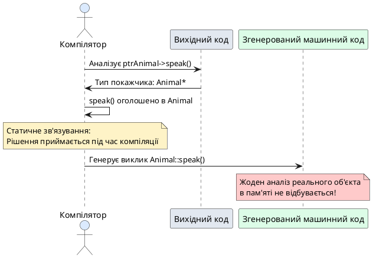
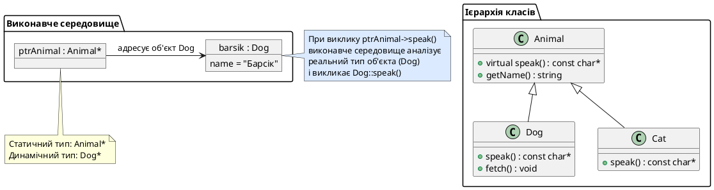
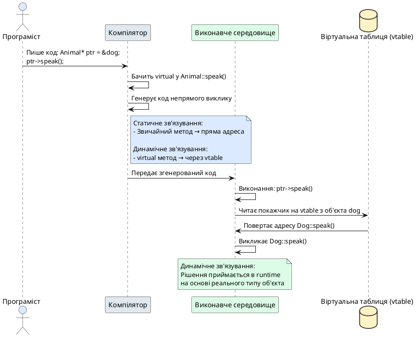

## Парадокс покажчиків: коли собака втратив свій гавкіт

Припустимо, ми реалізували ієрархію класів для моделювання тварин: базовий клас `Animal` та два похідні класи `Cat` і `Dog`. Кожна тварина має метод `speak()`, який повертає характерний для неї звук. Ми написали функцію `report()`, що приймає посилання на `Animal` та виводить ім'я і звук тварини:

```cpp [AnimalReport.cpp]
#include <iostream>
#include <string>

class Animal
{
protected:
    std::string name;

public:
    Animal(std::string n) : name(n) {}
    
    std::string getName() const { return name; }
    const char* speak() const { return "???"; }
};

class Dog : public Animal
{
public:
    Dog(std::string n) : Animal(n) {}
    
    const char* speak() const { return "Woof"; }
};

void report(const Animal& animal)
{
    std::cout << animal.getName() << " каже " << animal.speak() << "\n";
}

int main()
{
    Dog barsik("Барсик");
    report(barsik);  // Очікуємо: Барсик каже Woof
    
    return 0;
}
```

Інтуїтивно ми очікуємо, що виклик `report(barsik)` виведе **«Барсик каже Woof»**, адже `barsik` — це об'єкт класу `Dog`, а метод `Dog::speak()` повертає `"Woof"`. Проте результат виконання програми вас здивує:

::terminal-preview{title="./AnimalReport"}
<div class="line">Барсик каже ???</div>
::

Замість гавкоту собаки програма друкує невиразний базовий звук `"???"`. Чому так сталося? Об'єкт `barsik` є екземпляром класу `Dog`, він «знає», що має гавкати — але функція `report()` приймає параметр типу `const Animal&`, і компілятор викликає **саме** `Animal::speak()`, ігноруючи існування `Dog::speak()`.

Це фундаментальна проблема, з якою стикаються всі розробники при переході від процедурного програмування до об'єктно-орієнтованого. У цій статті ми дослідимо **статичне зв'язування** (*static binding*), дізнаємося, чому покажчики та посилання на базовий клас за замовчуванням викликають методи базового класу, і навчимося вирішувати цю проблему за допомогою **віртуальних функцій** (*virtual functions*) — механізму, що реалізує третій фундаментальний принцип ООП: **поліморфізм** (*polymorphism*).

::card-group

::card{title="🎯 Мета статті" icon="i-lucide-target"}

- Зрозуміти поведінку покажчиків та посилань на базовий клас, що адресують об'єкти похідних класів
- Пояснити обмеження раннього (статичного) зв'язування: чому виклик `basePtr->speak()` викликає метод базового класу
- Ввести ключове слово `virtual` для активації динамічного (runtime) поліморфізму
- Сформулювати третій стовп ООП — поліморфізм: єдиний інтерфейс для різноманітної поведінки об'єктів
- Навчитися обробляти гетерогенні колекції через масиви покажчиків на базовий клас
- Розібрати поняття коваріантних типів повернення

::

::card{title="🔑 Ключові терміни" icon="i-lucide-key"}

- **Поліморфізм** (*polymorphism*): здатність об'єктів різних типів реагувати на одне й те саме повідомлення (виклик методу) різними способами
- **Віртуальна функція** (*virtual function*): метод базового класу, позначений ключовим словом `virtual`, який дозволяє похідним класам змінити його поведінку
- **Статичне зв'язування** (*static / early binding*): вибір методу для виклику відбувається під час компіляції на основі типу покажчика/посилання
- **Динамічне зв'язування** (*dynamic / late binding*): вибір методу відбувається під час виконання на основі реального типу об'єкта в пам'яті
- **Перевизначення** (*override*): заміна реалізації віртуального методу базового класу новою реалізацією в похідному класі
- **Коваріантний тип повернення** (*covariant return type*): можливість перевизначеного методу повертати покажчик або посилання на похідний клас замість базового

::

::

## Покажчики та посилання на базовий клас: сумісність за наслідуванням

### Природність неявного перетворення

У попередньому розділі ми вивчили, що похідний клас успадковує структуру та поведінку базового класу через відношення **«є різновидом»** (*is-a*). Це означає, що об'єкт похідного класу **містить всередині себе** повноцінну частину базового класу. При створенні об'єкта `Dog` компілятор спочатку конструює частину `Animal`, а потім додає специфічні для `Dog` поля та методи.

З цієї властивості випливає важливий висновок: **покажчик або посилання на базовий клас може адресувати об'єкт похідного класу**. Таке неявне перетворення називається **висхідним приведенням типів** (*upcasting*) — ми піднімаємося вгору по ієрархії класів:

```cpp [Upcasting.cpp]
#include <iostream>

class Animal
{
protected:
    std::string name;

public:
    Animal(std::string n) : name(n) {}
    
    std::string getName() const { return name; }
    const char* speak() const { return "???"; }
};

class Dog : public Animal
{
public:
    Dog(std::string n) : Animal(n) {}
    
    const char* speak() const { return "Woof"; }
    void fetch() { std::cout << "Біжу за м'ячем!\n"; }
};

int main()
{
    Dog barsik("Барсик");
    
    // Покажчик на базовий клас адресує об'єкт похідного класу
    Animal* ptrAnimal = &barsik;  // ✅ Upcasting — завжди безпечний
    
    // Посилання на базовий клас адресує об'єкт похідного класу
    Animal& refAnimal = barsik;   // ✅ Upcasting через посилання
    
    std::cout << "barsik.getName() = " << barsik.getName() << "\n";
    std::cout << "ptrAnimal->getName() = " << ptrAnimal->getName() << "\n";
    std::cout << "refAnimal.getName() = " << refAnimal.getName() << "\n";
    
    return 0;
}
```

::terminal-preview{title="./Upcasting"}
<div class="line">barsik.getName() = Барсик</div>
<div class="line">ptrAnimal->getName() = Барсик</div>
<div class="line">refAnimal.getName() = Барсік</div>
::

Компілятор безпечно дозволяє таке присвоєння, адже `Dog` **є** `Animal` — об'єкт `barsik` гарантовано містить усі поля та методи класу `Animal`. Покажчик `ptrAnimal` та посилання `refAnimal` адресують частину `Animal` всередині об'єкта `barsik`.

::note
**Upcasting завжди безпечний і неявний**: компілятор автоматично дозволяє присвоювати адресу об'єкта похідного класу покажчику на базовий клас. Не потрібно явного приведення типів. Це природне перетворення, яке відображає семантику наслідування.

::

### Обмеження видимості: покажчик бачить лише інтерфейс базового класу

Проте таке перетворення має важливе обмеження: **покажчик або посилання на базовий клас може викликати лише ті методи, які оголошені в базовому класі**. Компілятор розглядає тип покажчика (`Animal*`), а не реальний тип об'єкта в пам'яті (`Dog`):

```cpp [VisibilityLimit.cpp] {6-9}
int main()
{
    Dog barsik("Барсик");
    Animal* ptrAnimal = &barsik;
    
    ptrAnimal->getName();   // ✅ Animal::getName() існує
    ptrAnimal->speak();     // ✅ Animal::speak() існує
    
    // ptrAnimal->fetch();  // ❌ Помилка компіляції: fetch() не оголошено в Animal
    
    return 0;
}
```

Метод `fetch()` існує лише в класі `Dog`, тому покажчик типу `Animal*` не може його викликати — компілятор перевіряє лише оголошення класу `Animal` і не знаходить там `fetch()`.

::warning
Покажчик чи посилання на базовий клас обмежені **інтерфейсом базового класу**. Вони не мають доступу до методів, доданих у похідних класах. Це обмеження видимості, а не обмеження пам'яті — об'єкт `barsik` у пам'яті залишається повноцінним `Dog` з методом `fetch()`, але доступ до нього через `Animal*` заборонено на етапі компіляції.

::

## Статичне зв'язування: коли компілятор вирішує все заздалегідь

### Проблема викликів через покажчики базового класу

Тепер розглянемо критичну проблему: що станеться, коли ми викличемо метод `speak()` через покажчик `Animal*`, який адресує об'єкт `Dog`?

```cpp [EarlyBindingProblem.cpp]
#include <iostream>

class Animal
{
public:
    const char* speak() const { return "???"; }
};

class Cat : public Animal
{
public:
    const char* speak() const { return "Meow"; }
};

class Dog : public Animal
{
public:
    const char* speak() const { return "Woof"; }
};

int main()
{
    Cat murka("Мурка");
    Dog barsik("Барсік");
    
    std::cout << "Пряме звернення:\n";
    std::cout << "  murka.speak() = " << murka.speak() << "\n";
    std::cout << "  barsik.speak() = " << barsik.speak() << "\n\n";
    
    std::cout << "Виклик через покажчики базового класу:\n";
    Animal* ptrAnimal = &murka;
    std::cout << "  ptrAnimal->speak() = " << ptrAnimal->speak() << "\n";
    
    ptrAnimal = &barsik;
    std::cout << "  ptrAnimal->speak() = " << ptrAnimal->speak() << "\n";
    
    return 0;
}
```

::terminal-preview{title="./EarlyBindingProblem"}
<div class="line">Пряме звернення:</div>
<div class="line">  murka.speak() = Meow</div>
<div class="line">  barsik.speak() = Woof</div>
<div class="line"></div>
<div class="line">Виклик через покажчики базового класу:</div>
<div class="line">  ptrAnimal->speak() = ???</div>
<div class="line">  ptrAnimal->speak() = ???</div>
::

Результат показує фундаментальну проблему: пряме звернення `murka.speak()` і `barsik.speak()` правильно викликає методи похідних класів (`Cat::speak()` і `Dog::speak()`), але виклики через покажчик `ptrAnimal->speak()` завжди виконують `Animal::speak()`, незалежно від того, на який об'єкт насправді вказує покажчик.

### Механізм статичного зв'язування

Ця поведінка пояснюється механізмом **статичного зв'язування** (*static binding*, також **раннє зв'язування** — *early binding*). Коли компілятор зустрічає виклик `ptrAnimal->speak()`, він аналізує **тип покажчика** (`Animal*`), а не реальний тип об'єкта в пам'яті. Компілятор бачить:

> «Покажчик має тип `Animal*` → метод `speak()` оголошено в класі `Animal` → генерую виклик `Animal::speak()`».

Це рішення приймається під час компіляції, задовго до виконання програми. Компілятор не може (і не намагається) визначити, на який конкретний об'єкт вказуватиме `ptrAnimal` під час виконання — адже значення покажчика може змінюватися динамічно (як у нашому прикладі, де ми спочатку присвоїли `&murka`, а потім `&barsik`).

::plant-uml{alt="Статичне зв'язування: компілятор генерує виклик на основі типу покажчика"}



::

### Чому статичне зв'язування є поведінкою за замовчуванням

Статичне зв'язування — це поведінка за замовчуванням у C++ з двох причин:

1. **Продуктивність**: виклик методу через статичне зв'язування не вимагає жодних додаткових операцій під час виконання. Компілятор безпосередньо вставляє адресу функції в машинний код. Це максимально ефективно.

2. **Сумісність із мовою C**: C++ розширює мову C, яка не має об'єктів і завжди використовує статичне зв'язування для викликів функцій. Якби C++ змінив цю поведінку за замовчуванням, це порушило б сумісність і створило б несподівані накладні витрати.

Проте для реалізації поліморфізму — здатності обробляти об'єкти різних типів через єдиний інтерфейс — нам потрібен інший механізм.

## Ключове слово `virtual`: активація динамічного зв'язування

### Синтаксис віртуальних функцій

Щоб змусити компілятор викликати правильний метод похідного класу через покажчик на базовий клас, потрібно позначити метод базового класу ключовим словом `virtual`. **Віртуальна функція** (*virtual function*) — це метод, для якого вибір конкретної реалізації відбувається під час виконання програми на основі реального типу об'єкта, а не типу покажчика:

```cpp [VirtualFunction.cpp] {6}
class Animal
{
public:
    // Додали ключове слово virtual перед оголошенням методу
    virtual const char* speak() const { return "???"; }
};

class Cat : public Animal
{
public:
    const char* speak() const { return "Meow"; }
};

class Dog : public Animal
{
public:
    const char* speak() const { return "Woof"; }
};
```

Тепер метод `speak()` класу `Animal` став **віртуальним**. Це автоматично робить віртуальними всі його перевизначення в похідних класах (`Cat::speak()` та `Dog::speak()`), навіть якщо ми не пишемо `virtual` перед ними (хоча це рекомендовано для ясності коду).

::tip
Хоча методи похідних класів автоматично стають віртуальними, якщо вони перевизначають віртуальний метод базового класу, **хорошою практикою** є явне вказування `virtual` перед перевизначеннями. Це підвищує читабельність коду та служить нагадуванням для інших розробників (і для вас у майбутньому), що метод бере участь у динамічному поліморфізмі.

::

### Динамічне зв'язування в дії

Тепер повторимо наш експеримент з викликами через покажчик на базовий клас:

```cpp [DynamicBinding.cpp]
#include <iostream>

class Animal
{
public:
    virtual const char* speak() const { return "???"; }
};

class Cat : public Animal
{
public:
    const char* speak() const { return "Meow"; }
};

class Dog : public Animal
{
public:
    const char* speak() const { return "Woof"; }
};

int main()
{
    Cat murka("Мурка");
    Dog barsik("Барсік");
    
    Animal* ptrAnimal = &murka;
    std::cout << "ptrAnimal->speak() = " << ptrAnimal->speak() << "\n";
    
    ptrAnimal = &barsik;
    std::cout << "ptrAnimal->speak() = " << ptrAnimal->speak() << "\n";
    
    return 0;
}
```

::terminal-preview{title="./DynamicBinding"}
<div class="line">ptrAnimal->speak() = Meow</div>
<div class="line">ptrAnimal->speak() = Woof</div>
::

Чудово працює! Тепер виклик `ptrAnimal->speak()` правильно визначає, що спочатку `ptrAnimal` адресує об'єкт `Cat` і викликає `Cat::speak()`, а потім адресує об'єкт `Dog` і викликає `Dog::speak()`.

Це називається **динамічним зв'язуванням** (*dynamic binding* або **пізнім зв'язуванням** — *late binding*). Рішення про те, який саме метод викликати, відкладається до моменту виконання програми. Коли програма доходить до рядка `ptrAnimal->speak()`, виконавче середовище С++ аналізує реальний тип об'єкта в пам'яті (за допомогою спеціального механізму, про який ми поговоримо в наступних статтях) і викликає відповідну реалізацію.

::note
**Віртуальність поширюється вниз по ієрархії**: якщо метод оголошено як `virtual` у базовому класі, всі його перевизначення в похідних класах автоматично стають віртуальними, навіть без явного ключового слова `virtual`. Проте явне вказування `virtual` у похідних класах робить код чіткішим і підкреслює намір програміста.

::

## Поліморфізм: третій стовп об'єктно-орієнтованого програмування

### Визначення та філософія поліморфізму

**Поліморфізм** (*polymorphism*, від грецького *poly* — «багато», *morphē* — «форма») — це здатність об'єктів різних типів реагувати на одне й те саме повідомлення (виклик методу) різними способами. У контексті C++ поліморфізм досягається через віртуальні функції: єдиний виклик `animal.speak()` породжує різну поведінку залежно від того, чи `animal` насправді є `Cat`, `Dog`, чи `Bird`.

Поліморфізм — це третій фундаментальний принцип ООП поруч із інкапсуляцією та наслідуванням:

::card-group

::card{title="🔒 Інкапсуляція" icon="i-lucide-lock"}

Приховування внутрішньої структури об'єкта та надання контрольованого доступу через публічний інтерфейс. Захищає дані від некоректного використання.

::

::card{title="🧬 Наслідування" icon="i-lucide-git-branch"}

Створення нових класів на основі існуючих шляхом успадкування їхньої структури та поведінки. Дозволяє повторно використовувати код і будувати ієрархії типів.

::

::card{title="🎭 Поліморфізм" icon="i-lucide-shapes"}

Здатність обробляти об'єкти різних класів через єдиний інтерфейс базового класу. Забезпечує гнучкість, розширюваність та уніфікацію коду.

::

::

Поліморфізм звільняє програміста від необхідності знати точний тип об'єкта під час написання коду. Замість написання окремої функції для кожного типу тварини ми пишемо одну функцію, яка приймає `Animal&` і працює з будь-яким нащадком:

```cpp [PolymorphicReport.cpp]
void report(const Animal& animal)
{
    std::cout << animal.speak() << "\n";
}

int main()
{
    Cat murka("Мурка");
    Dog barsik("Барсік");
    Bird kesha("Кеша");
    
    report(murka);   // Meow
    report(barsik);  // Woof
    report(kesha);   // Tweet
    
    return 0;
}
```

Функція `report()` не знає і не повинна знати, з яким конкретним класом вона працює — їй достатньо знати, що об'єкт успадковує `Animal` і має метод `speak()`. Це **програмування до інтерфейсу, а не до реалізації** (*programming to an interface, not an implementation*) — один із ключових принципів проєктування програмних систем.

### Унікальна функція замість перевантажень

Без поліморфізму для обробки різних типів тварин довелося б писати окремі перевантаження функції `report()` для кожного класу:

```cpp [WithoutPolymorphism.cpp]
void report(const Cat& cat)
{
    std::cout << cat.speak() << "\n";
}

void report(const Dog& dog)
{
    std::cout << dog.speak() << "\n";
}

void report(const Bird& bird)
{
    std::cout << bird.speak() << "\n";
}

// І так далі для кожного нового типу тварини...
```

Уявіть, що у вашій ієрархії 30 різних класів тварин. Вам довелося б написати 30 версій функції `report()`. Більше того, кожного разу, коли ви додаєте новий клас (`class Snake`), вам потрібно не забути додати ще одне перевантаження. Це призводить до надмірного дублювання коду, підвищує ймовірність помилок і ускладнює підтримку.

Поліморфізм вирішує цю проблему елегантно: **одна функція працює з усіма поточними та майбутніми похідними класами**. Додавання нового класу `Snake : public Animal` не вимагає жодних змін у функції `report()` — вона автоматично працюватиме з новим типом.

::note
**Принцип відкритості/закритості** (*Open/Closed Principle*): програмні сутності мають бути відкриті для розширення, але закриті для модифікації. Поліморфізм дозволяє додавати нові типи (розширювати систему) без зміни існуючого коду, який працює з базовим класом.

::

## Гетерогенні колекції: єдиний масив для різних типів

### Проблема зберігання об'єктів різних класів

Припустимо, ми хочемо зберегти кілька тварин різних типів і обробити їх у циклі. Без поліморфізму нам довелося б створювати окремі масиви для кожного типу:

```cpp [SeparateArrays.cpp]
int main()
{
    Cat cats[] = { Cat("Мурка"), Cat("Рижик"), Cat("Барсик") };
    Dog dogs[] = { Dog("Бобік"), Dog("Джек"), Dog("Рекс") };
    
    for (int i = 0; i < 3; i++) {
        std::cout << cats[i].speak() << "\n";
    }
    
    for (int i = 0; i < 3; i++) {
        std::cout << dogs[i].speak() << "\n";
    }
    
    return 0;
}
```

Це незручно, негнучко і не масштабується. Якщо у нас 10 типів тварин, потрібно 10 окремих масивів і 10 окремих циклів. Більше того, ми не можемо легко перемішати тварин різних типів у порядку, який нам потрібен (наприклад, кіт, собака, кіт, птах).

### Масив покажчиків на базовий клас

Поліморфізм дозволяє створити **гетерогенну колекцію** (*heterogeneous collection*) — масив покажчиків на базовий клас, де кожен елемент може адресувати об'єкт будь-якого похідного класу:

```cpp [PolymorphicArray.cpp]
#include <iostream>

class Animal
{
protected:
    std::string name;

public:
    Animal(std::string n) : name(n) {}
    
    std::string getName() const { return name; }
    virtual const char* speak() const { return "???"; }
};

class Cat : public Animal
{
public:
    Cat(std::string n) : Animal(n) {}
    const char* speak() const { return "Meow"; }
};

class Dog : public Animal
{
public:
    Dog(std::string n) : Animal(n) {}
    const char* speak() const { return "Woof"; }
};

class Bird : public Animal
{
public:
    Bird(std::string n) : Animal(n) {}
    const char* speak() const { return "Tweet"; }
};

int main()
{
    Cat murka("Мурка");
    Dog barsik("Барсік");
    Bird kesha("Кеша");
    Cat ryzhyk("Рижик");
    Dog bobik("Бобік");
    
    // Масив покажчиків на Animal може зберігати адреси об'єктів різних похідних класів
    Animal* animals[] = { &murka, &barsik, &kesha, &ryzhyk, &bobik };
    
    std::cout << "Усі тварини говорять:\n";
    for (int i = 0; i < 5; i++) {
        std::cout << "  " << animals[i]->getName() 
                  << " каже " << animals[i]->speak() << "\n";
    }
    
    return 0;
}
```

::terminal-preview{title="./PolymorphicArray"}
<div class="line">Усі тварини говорять:</div>
<div class="line">  Мурка каже Meow</div>
<div class="line">  Барсік каже Woof</div>
<div class="line">  Кеша каже Tweet</div>
<div class="line">  Рижик каже Meow</div>
<div class="line">  Бобік каже Woof</div>
::

Тепер ми можемо обробити всі об'єкти в єдиному циклі, незалежно від їхнього реального типу. Кожен виклик `animals[i]->speak()` автоматично диспетчеризується до правильної реалізації методу завдяки динамічному зв'язуванню.

::tip
У реальних проєктах замість масивів C-style (`Animal* animals[]`) використовують контейнери STL, такі як `std::vector<Animal*>` або (краще) `std::vector<std::unique_ptr<Animal>>`. Розумні покажчики автоматично керують пам'яттю і запобігають витокам ресурсів. Ми розглянемо їх у майбутніх статтях.

::

### Розширюваність без змін існуючого коду

Ключова перевага поліморфних колекцій — **розширюваність**. Якщо ми додамо новий клас `Snake : public Animal`, нам не потрібно змінювати цикл обробки:

```cpp [AddingNewType.cpp] {8-13,22}
class Snake : public Animal
{
public:
    Snake(std::string n) : Animal(n) {}
    const char* speak() const { return "Hiss"; }
};

int main()
{
    Cat murka("Мурка");
    Snake viper("Гадюка");
    Dog barsik("Барсік");
    
    Animal* animals[] = { &murka, &viper, &barsik };
    
    // Той самий цикл без жодних змін!
    for (int i = 0; i < 3; i++) {
        std::cout << animals[i]->getName() 
                  << " каже " << animals[i]->speak() << "\n";
    }
    
    return 0;
}
```

Цикл залишається незмінним — поліморфізм автоматично обробляє новий тип. Це фундаментальна властивість, яка робить великі системи керованими та підтримуваними.

## Вимоги до віртуальних функцій та перевизначення

### Збіг сигнатури: обов'язкова умова перевизначення

Щоб метод похідного класу вважався **перевизначенням** (*override*) віртуального методу базового класу, їхні **сигнатури** мають повністю збігатися. Сигнатура включає:

- Ім'я методу
- Кількість і типи параметрів
- Специфікатор `const` (якщо метод константний)

Якщо сигнатури різняться хоча б в одному аспекті, метод похідного класу **не є перевизначенням** — це окремий, незалежний метод:

```cpp [SignatureMismatch.cpp]
class Animal
{
public:
    virtual void makeSound() const { std::cout << "???\n"; }
};

class Dog : public Animal
{
public:
    // ❌ Це НЕ перевизначення Animal::makeSound()!
    // Відсутній специфікатор const — сигнатури різні
    void makeSound() { std::cout << "Woof\n"; }
};

int main()
{
    Dog barsik;
    Animal* ptr = &barsik;
    
    ptr->makeSound();  // Викличе Animal::makeSound(), виведе "???"
    
    return 0;
}
```

У цьому прикладі `Animal::makeSound()` позначено як `const`, а `Dog::makeSound()` — ні. Сигнатури не збігаються, тому `Dog::makeSound()` — це окремий метод, а не перевизначення. Виклик через `ptr->makeSound()` виконає `Animal::makeSound()`.

::warning
**Типова пастка**: забути `const` у перевизначенні константного віртуального методу. Код скомпілюється без помилок, але поліморфізм не працюватиме — компілятор розглядатиме це як незалежний метод. У наступній статті ми вивчимо специфікатор `override` (C++11), який змушує компілятор перевірити, чи дійсно метод є перевизначенням, і видати помилку, якщо сигнатури не збігаються.

::

### Збіг типу повернення

Тип повернення віртуального методу та його перевизначення також має збігатися:

```cpp [ReturnTypeMismatch.cpp]
class Animal
{
public:
    virtual int getAge() const { return 0; }
};

class Dog : public Animal
{
public:
    // ❌ Помилка компіляції: тип повернення double не збігається з int
    virtual double getAge() const { return 5.5; }
};
```

Компілятор видасть помилку, адже `Dog::getAge()` повертає `double`, а `Animal::getAge()` повертає `int`. Це не є валідним перевизначенням.

**Виняток**: коваріантні типи повернення, які ми розглянемо далі.

## Коваріантні типи повернення: елегантна гнучкість

### Мотивація: повернення похідного типу

Іноді зручно, щоб перевизначений метод повертав більш специфічний тип, ніж базовий метод. Розглянемо ієрархію `Animal` → `Dog` і метод `clone()`, який повертає копію об'єкта:

```cpp [CloningProblem.cpp]
class Animal
{
public:
    virtual Animal* clone() const
    {
        return new Animal(*this);
    }
};

class Dog : public Animal
{
public:
    // Хотілося б повернути Dog*, але базовий метод повертає Animal*
    virtual Animal* clone() const
    {
        return new Dog(*this);
    }
};
```

Метод `Dog::clone()` повертає `Animal*`, хоча фактично створює об'єкт `Dog`. Це не зовсім природньо — користувачу доведеться вручну приводити результат до `Dog*`:

```cpp
Dog barsik;
Dog* copy = static_cast<Dog*>(barsik.clone());  // Незручне приведення
```

### Коваріантні типи: легальна зміна типу повернення

C++ дозволяє перевизначеному методу повертати **покажчик або посилання на похідний клас** замість покажчика на базовий клас. Це називається **коваріантним типом повернення** (*covariant return type*):

```cpp [CovariantReturn.cpp]
class Animal
{
public:
    virtual Animal* clone() const
    {
        return new Animal(*this);
    }
};

class Dog : public Animal
{
public:
    // ✅ Коваріантний тип повернення: Dog* замість Animal*
    virtual Dog* clone() const override
    {
        return new Dog(*this);
    }
};

int main()
{
    Dog barsik;
    Dog* copy = barsik.clone();  // Природно і без приведення типів!
    
    delete copy;
    return 0;
}
```

Тепер `Dog::clone()` повертає `Dog*`, що є більш конкретним типом, ніж `Animal*`. Компілятор дозволяє таку зміну, адже `Dog*` можна неявно перетворити на `Animal*` (upcasting). Це зберігає сумісність із базовим інтерфейсом, але надає зручніший тип під час прямого виклику `barsik.clone()`.

::note
**Умови коваріантності**: тип повернення перевизначеного методу може бути покажчиком або посиланням на похідний клас лише якщо:
1. Базовий метод повертає покажчик або посилання (не значення)
2. Похідний клас є нащадком класу, який повертає базовий метод
3. Повертається саме покажчик/посилання, а не значення

Це не працює для повернення за значенням (`Animal clone()` не може бути перевизначено як `Dog clone()`).

::

## Не викликайте віртуальні функції в конструкторах та деструкторах

### Підступна пастка ініціалізації

Розглянемо код, де базовий конструктор викликає віртуальний метод:

```cpp [VirtualInConstructor.cpp]
#include <iostream>

class Animal
{
public:
    Animal()
    {
        std::cout << "Створення Animal, звук: " << speak() << "\n";
    }
    
    virtual const char* speak() const { return "???"; }
};

class Dog : public Animal
{
public:
    Dog()
    {
        std::cout << "Створення Dog, звук: " << speak() << "\n";
    }
    
    const char* speak() const { return "Woof"; }
};

int main()
{
    Dog barsik;
    return 0;
}
```

Інтуїтивно здається, що виклик `speak()` у конструкторі `Animal` має викликати `Dog::speak()`, адже ми створюємо об'єкт `Dog`. Проте результат виконання програми інший:

::terminal-preview{title="./VirtualInConstructor"}
<div class="line">Створення Animal, звук: ???</div>
<div class="line">Створення Dog, звук: Woof</div>
::

Виклик `speak()` у конструкторі `Animal` виконав `Animal::speak()`, а не `Dog::speak()`. Чому?

### Порядок конструювання та проблема неповного об'єкта

Пригадаємо порядок конструювання об'єкта похідного класу:

1. Спочатку викликається конструктор **базового** класу (`Animal`)
2. Потім викликається конструктор **похідного** класу (`Dog`)

Коли виконується конструктор `Animal`, **частина `Dog` ще не існує** — поля класу `Dog` не ініціалізовані, а віртуальна таблиця (механізм, що забезпечує динамічне зв'язування) вказує на `Animal`, а не на `Dog`. З точки зору системи типів у цей момент об'єкт є `Animal`, а не `Dog`.

Тому виклик віртуальної функції з конструктора базового класу завжди виконує **реалізацію базового класу**, навіть якщо ви створюєте об'єкт похідного класу. Це захисний механізм: якби С++ дозволив викликати `Dog::speak()` у цей момент, метод міг би звернутися до неініціалізованих полів класу `Dog`, що призвело б до Undefined Behavior.

::caution
**Категорична заборона**: ніколи не викликайте віртуальні функції в тілі конструкторів або деструкторів. Поведінка не відповідає інтуїтивним очікуванням — завжди виконується реалізація поточного класу, а не найпохіднішого. Якщо вам потрібна поліморфна ініціалізація, винесіть логіку в окремий метод `init()`, який викликається після конструювання об'єкта.

::

Аналогічна проблема існує з деструкторами: коли виконується деструктор базового класу, частина похідного класу вже знищена, тому виклик віртуальної функції знову виконає реалізацію базового класу.

## Продуктивність віртуальних функцій: немає безкоштовних обідів

### Накладні витрати динамічного зв'язування

Віртуальні функції — це потужний інструмент, але вони не безкоштовні. Динамічне зв'язування вимагає додаткових ресурсів:

1. **Додатковий покажчик у кожному об'єкті**: кожен екземпляр класу з віртуальними функціями зберігає прихований покажчик на **віртуальну таблицю** (*vtable*) — структуру даних, що містить адреси всіх віртуальних методів класу. Це збільшує розмір об'єкта на 8 байт (64-бітна система).

2. **Непрямий виклик через vtable**: замість прямого виклику функції за фіксованою адресою компілятор генерує код, який:
   - Читає покажчик на vtable з об'єкта
   - Знаходить у vtable адресу потрібного методу
   - Виконує непрямий виклик за цією адресою

   Це додає кілька машинних інструкцій до кожного виклику віртуальної функції.

3. **Обмеження оптимізацій**: компілятор не може вбудувати (*inline*) виклик віртуальної функції, адже не знає під час компіляції, яка реалізація буде викликана. Це блокує низку оптимізацій.

::debugger-view{title="Розмір об'єкта з віртуальними функціями" :variables='[{"name": "sizeof(AnimalNoVirtual)", "type": "size_t", "value": "32"}, {"name": "sizeof(AnimalWithVirtual)", "type": "size_t", "value": "40"}]'}
::

### Коли використовувати віртуальні функції

Незважаючи на накладні витрати, віртуальні функції є **правильним вибором** у більшості випадків, коли потрібен поліморфізм. Накладні витрати мізерні порівняно з перевагами гнучкості та розширюваності коду.

**Використовуйте віртуальні функції, коли**:
- Потрібна поліморфна поведінка: різні класи реагують на один виклик по-різному
- Ви працюєте з колекціями покажчиків на базовий клас
- Архітектура системи базується на абстракціях та інтерфейсах

**Уникайте віртуальних функцій, коли**:
- Клас не призначений для наслідування (позначте його `final`)
- Критична продуктивність у вузькому місці коду (гарячий цикл, що виконується мільйони разів на секунду)
- Клас є простою структурою даних без поведінкової логіки

::tip
**Правило**: якщо клас має хоча б один віртуальний метод, він майже напевно потребує **віртуального деструктора**. Про це ми детально поговоримо в наступній статті — невіртуальний деструктор у поліморфному класі призводить до витоків пам'яті та Undefined Behavior при видаленні об'єкта через покажчик на базовий клас.

::

## Резюме

У цій статті ми дослідили фундаментальний механізм C++, що реалізує поліморфізм — третій стовп об'єктно-орієнтованого програмування. Ми навчилися:

::card-group

::card{title="🔗 Upcasting" icon="i-lucide-arrow-up"}

Покажчик або посилання на базовий клас може безпечно адресувати об'єкт похідного класу. Це природне перетворення, що відображає семантику наслідування («похідний клас є різновидом базового класу»).

::

::card{title="⚙️ Статичне зв'язування" icon="i-lucide-link"}

За замовчуванням виклик методу через покажчик на базовий клас виконує реалізацію базового класу, навіть якщо покажчик адресує об'єкт похідного класу. Рішення приймається під час компіляції на основі типу покажчика.

::

::card{title="🎭 Віртуальні функції" icon="i-lucide-sparkles"}

Ключове слово `virtual` активує динамічне зв'язування: виклик методу диспетчеризується до правильної реалізації на основі реального типу об'єкта в пам'яті під час виконання програми.

::

::card{title="📦 Поліморфні колекції" icon="i-lucide-boxes"}

Масив покажчиків на базовий клас дозволяє зберігати та обробляти об'єкти різних похідних класів у єдиному циклі. Це забезпечує розширюваність без зміни існуючого коду.

::

::

**Ключові правила, які слід запам'ятати**:

1. Позначайте методи як `virtual` у базовому класі, якщо очікуєте, що похідні класи змінюватимуть їхню поведінку
2. Сигнатури віртуального методу та його перевизначення мають повністю збігатися (включно з `const`)
3. Ніколи не викликайте віртуальні функції в конструкторах та деструкторах
4. Якщо клас має віртуальні методи, він майже напевно потребує віртуального деструктора
5. Поліморфізм має невеликі накладні витрати, але забезпечує величезну гнучкість архітектури

У наступній статті ми вивчимо специфікатори `override` і `final` (C++11), які підвищують безпеку та ясність коду при роботі з віртуальними функціями, а також детально розберемо **віртуальні деструктори** — критично важливий механізм для коректного видалення поліморфних об'єктів через покажчики на базовий клас.

::::accordion

:::accordion-item{label="📋 Завдання 1: Поліморфна геометрія" icon="i-lucide-clipboard-list"}

Реалізуйте ієрархію геометричних фігур із базовим класом `Shape` та похідними класами `Circle`, `Rectangle`, `Triangle`. Кожна фігура має метод `double getArea() const`, що обчислює площу. Створіть масив покажчиків на `Shape` та обчисліть загальну площу всіх фігур у циклі.

:::

:::accordion-item{label="📋 Завдання 2: Поліморфний друк" icon="i-lucide-clipboard-list"}

Створіть базовий клас `Printer` з віртуальним методом `void print(const std::string& text) const`. Реалізуйте похідні класи `ConsolePrinter` (виводить на екран), `FilePrinter` (записує у файл), `UpperCasePrinter` (виводить великими літерами). Напишіть функцію `void sendDocument(const Printer& printer, const std::string& doc)`, що працює з будь-яким типом принтера.

:::

:::accordion-item{label="❓ Чому виклик basePtr->method() викликає базовий метод без virtual?" icon="i-lucide-help-circle"}

Без ключового слова `virtual` C++ використовує **статичне зв'язування** (*static binding*): вибір методу для виклику відбувається під час компіляції на основі типу покажчика (`Base*`), а не реального типу об'єкта в пам'яті (`Derived`). Це поведінка за замовчуванням заради продуктивності та сумісності з мовою C. Динамічне зв'язування (вибір методу під час виконання) активується лише для віртуальних функцій.

:::

:::accordion-item{label="❓ Чи потрібно писати virtual у похідних класах, якщо базовий метод віртуальний?" icon="i-lucide-help-circle"}

Технічно — ні. Якщо метод базового класу позначено як `virtual`, всі його перевизначення автоматично стають віртуальними, навіть без явного `virtual`. Проте **хорошою практикою** є явне вказування `virtual` у похідних класах (або краще — специфікатора `override` у C++11 і новіших), адже це підвищує читабельність коду та чітко показує намір програміста.

:::

:::accordion-item{label="❓ Що станеться, якщо перевизначення відрізняється специфікатором const?" icon="i-lucide-help-circle"}

Метод **не вважатиметься перевизначенням** — це буде незалежна функція з іншою сигнатурою. Виклик через покажчик на базовий клас виконає базову реалізацію, а не похідну. Це типова пастка: програміст забуває `const` у перевизначенні, код компілюється без попереджень, але поліморфізм не працює. Тому в C++11 рекомендовано використовувати специфікатор `override`, який змушує компілятор перевірити сигнатуру та видати помилку за невідповідності.

:::

::::


## Архітектура динамічного зв'язування: як працює поліморфізм під капотом

### Концептуальна модель диспетчеризації викликів

Щоб зрозуміти, як C++ вибирає правильний метод під час виконання віртуального виклику, розглянемо концептуальну модель роботи динамічного зв'язування. Коли компілятор зустрічає клас із віртуальними функціями, він автоматично генерує допоміжні структури даних, які забезпечують диспетчеризацію викликів у runtime.

::plant-uml{alt="Диспетчеризація віртуального виклику через покажчик на базовий клас"}



::

Коли ми викликаємо `ptrAnimal->speak()`, відбувається наступне:

1. **Компілятор** бачить, що `speak()` є віртуальним методом класу `Animal`
2. Генерується код для **непрямого виклику**: замість прямого переходу за адресою `Animal::speak()`, виконавче середовище перевіряє реальний тип об'єкта в пам'яті
3. **Runtime-система** визначає, що `ptrAnimal` адресує об'єкт класу `Dog`
4. Викликається реалізація `Dog::speak()` замість `Animal::speak()`

Це працює завдяки **віртуальній таблиці** (*vtable*) — механізму, який ми детально вивчимо в одній із наступних статей. На даному етапі важливо зрозуміти концептуальну різницю між **статичним типом** покажчика (тип, оголошений у коді — `Animal*`) та **динамічним типом** об'єкта (реальний тип об'єкта в пам'яті — `Dog`).

### Статичний тип проти динамічного типу

**Статичний тип** (*static type*) — це тип змінної, оголошений у коді. Він відомий компілятору під час компіляції і ніколи не змінюється:

```cpp
Animal* ptrAnimal = &barsik;  // Статичний тип: Animal*
```

**Динамічний тип** (*dynamic type*) — це реальний тип об'єкта, на який вказує покажчик під час виконання програми. Він може змінюватися протягом життя покажчика:

```cpp
Animal* ptrAnimal = &murka;   // Динамічний тип: Cat*
ptrAnimal = &barsik;          // Динамічний тип змінився: Dog*
```

Для **невіртуальних методів** компілятор орієнтується на статичний тип — рішення приймається під час компіляції. Для **віртуальних методів** виконавче середовище орієнтується на динамічний тип — рішення приймається під час виконання.

::code-group

```cpp [Невіртуальний метод]
class Animal {
public:
    void move() const { 
        std::cout << "Тварина рухається\n"; 
    }
};

class Dog : public Animal {
public:
    void move() const { 
        std::cout << "Собака біжить\n"; 
    }
};

int main() {
    Dog barsik;
    Animal* ptr = &barsik;
    
    // Компілятор бачить статичний тип Animal*
    // Викликається Animal::move()
    ptr->move();  // Виведе: "Тварина рухається"
}
```

```cpp [Віртуальний метод]
class Animal {
public:
    virtual void move() const { 
        std::cout << "Тварина рухається\n"; 
    }
};

class Dog : public Animal {
public:
    void move() const { 
        std::cout << "Собака біжить\n"; 
    }
};

int main() {
    Dog barsik;
    Animal* ptr = &barsik;
    
    // Runtime аналізує динамічний тип Dog*
    // Викликається Dog::move()
    ptr->move();  // Виведе: "Собака біжить"
}
```

::

## Складніший приклад: багаторівнева ієрархія

### Пошук найпохіднішого методу

У реальних системах ієрархії класів часто мають більше двох рівнів. Розглянемо багаторівневу ієрархію, де клас `C` успадковує `B`, який у свою чергу успадковує `A`:

```cpp [MultiLevelHierarchy.cpp]
#include <iostream>

class A
{
public:
    virtual const char* getName() const { return "A"; }
};

class B : public A
{
public:
    virtual const char* getName() const { return "B"; }
};

class C : public B
{
public:
    // Клас C не перевизначає getName()
};

class D : public C
{
public:
    virtual const char* getName() const { return "D"; }
};

int main()
{
    C objC;
    A& refA = objC;  // Посилання типу A& на об'єкт класу C
    
    std::cout << "refA.getName() = " << refA.getName() << "\n";
    
    return 0;
}
```

Який результат виведе ця програма? Проаналізуймо крок за кроком:

1. Створюється об'єкт `objC` класу `C`
2. Посилання `refA` типу `A&` адресує цей об'єкт
3. Викликається `refA.getName()` — це віртуальний метод
4. Runtime шукає **найпохідніший метод** між класами `A` і `C` (динамічний тип об'єкта — `C`)
5. Клас `C` не має власної реалізації `getName()`, тому пошук продовжується вверх по ієрархії
6. Клас `B` має метод `getName()` — це найпохідніша реалізація
7. Викликається `B::getName()`

::terminal-preview{title="./MultiLevelHierarchy"}
<div class="line">refA.getName() = B</div>
::

Важливо: динамічне зв'язування розглядає **тільки ті класи, які знаходяться між статичним типом покажчика та динамічним типом об'єкта**. У нашому випадку це класи `A`, `B` і `C`. Клас `D` не розглядається, адже об'єкт має тип `C`, а не `D`.

::note
**Алгоритм пошуку віртуального методу**: коли викликається віртуальна функція через покажчик або посилання, виконавче середовище починає пошук з динамічного типу об'єкта і рухається вгору по ієрархії до статичного типу покажчика, шукаючи першу (найпохіднішу) реалізацію методу. Якщо жоден похідний клас не перевизначив метод, викликається реалізація базового класу.

::

### Ієрархія з пропущеним перевизначенням

Розглянемо ситуацію, коли проміжний клас у ланцюгу не перевизначає віртуальний метод:

```cpp [SkippedOverride.cpp]
#include <iostream>

class A
{
public:
    virtual const char* getName() const { return "A"; }
};

class B : public A
{
public:
    // B не перевизначає getName()
};

class C : public B
{
public:
    virtual const char* getName() const { return "C"; }
};

int main()
{
    C objC;
    
    B& refB = objC;  // Посилання типу B& на об'єкт класу C
    std::cout << "refB.getName() = " << refB.getName() << "\n";
    
    A& refA = objC;  // Посилання типу A& на той самий об'єкт
    std::cout << "refA.getName() = " << refA.getName() << "\n";
    
    return 0;
}
```

::terminal-preview{title="./SkippedOverride"}
<div class="line">refB.getName() = C</div>
<div class="line">refA.getName() = C</div>
::

Обидва виклики виконують `C::getName()`, адже це найпохідніша реалізація в ієрархії об'єкта `objC`. Той факт, що клас `B` не має власної реалізації, не впливає на динамічне зв'язування — пошук просто пропускає клас `B` і знаходить `C::getName()`.

## Практичний приклад: система обробки подій

### Моделювання обробників подій інтерфейсу

Розглянемо реалістичний приклад: система обробки подій користувацького інтерфейсу. У графічних додатках різні віджети (кнопки, текстові поля, слайдери) реагують на події миші та клавіатури по-різному. Поліморфізм дозволяє обробляти всі віджети через єдиний інтерфейс:

```cpp [EventHandling.cpp]
#include <iostream>
#include <vector>

class Widget
{
protected:
    int x, y;
    int width, height;

public:
    Widget(int posX, int posY, int w, int h)
        : x(posX), y(posY), width(w), height(h) {}
    
    virtual ~Widget() {}
    
    virtual void onClick()
    {
        std::cout << "Widget: базова обробка кліку\n";
    }
    
    virtual void onKeyPress(char key)
    {
        std::cout << "Widget: базова обробка клавіші " << key << "\n";
    }
    
    virtual void render() const
    {
        std::cout << "Widget: рендеринг базового віджета\n";
    }
};

class Button : public Widget
{
private:
    std::string label;

public:
    Button(int x, int y, int w, int h, std::string lbl)
        : Widget(x, y, w, h), label(lbl) {}
    
    void onClick() override
    {
        std::cout << "Button [" << label << "]: виконання дії кнопки\n";
    }
    
    void render() const override
    {
        std::cout << "Button: малюю кнопку з текстом '" << label << "'\n";
    }
};

class TextField : public Widget
{
private:
    std::string content;

public:
    TextField(int x, int y, int w, int h)
        : Widget(x, y, w, h), content("") {}
    
    void onClick() override
    {
        std::cout << "TextField: встановлення фокусу вводу\n";
    }
    
    void onKeyPress(char key) override
    {
        content += key;
        std::cout << "TextField: додано символ '" << key 
                  << "', вміст: " << content << "\n";
    }
    
    void render() const override
    {
        std::cout << "TextField: малюю текстове поле з вмістом '" 
                  << content << "'\n";
    }
};

class Slider : public Widget
{
private:
    int value;
    int minValue, maxValue;

public:
    Slider(int x, int y, int w, int h, int min, int max)
        : Widget(x, y, w, h), value(min), minValue(min), maxValue(max) {}
    
    void onClick() override
    {
        value = (value + 10 <= maxValue) ? value + 10 : maxValue;
        std::cout << "Slider: нове значення " << value << "\n";
    }
    
    void render() const override
    {
        std::cout << "Slider: малюю слайдер зі значенням " << value << "\n";
    }
};

int main()
{
    // Створюємо різні віджети
    Button btnSubmit(10, 10, 100, 30, "Submit");
    TextField inputName(10, 50, 200, 30);
    Slider volumeControl(10, 90, 150, 20, 0, 100);
    
    // Поліморфна колекція: масив покажчиків на базовий клас Widget
    std::vector<Widget*> widgets = { &btnSubmit, &inputName, &volumeControl };
    
    std::cout << "=== Рендеринг усіх віджетів ===\n";
    for (Widget* w : widgets) {
        w->render();
    }
    
    std::cout << "\n=== Симуляція кліків ===\n";
    for (Widget* w : widgets) {
        w->onClick();
    }
    
    std::cout << "\n=== Симуляція введення у TextField ===\n";
    inputName.onKeyPress('H');
    inputName.onKeyPress('i');
    
    return 0;
}
```

::terminal-preview{title="./EventHandling" :cursor="false"}
<div class="line">=== Рендеринг усіх віджетів ===</div>
<div class="line">Button: малюю кнопку з текстом 'Submit'</div>
<div class="line">TextField: малюю текстове поле з вмістом ''</div>
<div class="line">Slider: малюю слайдер зі значенням 0</div>
<div class="line"></div>
<div class="line">=== Симуляція кліків ===</div>
<div class="line">Button [Submit]: виконання дії кнопки</div>
<div class="line">TextField: встановлення фокусу вводу</div>
<div class="line">Slider: нове значення 10</div>
<div class="line"></div>
<div class="line">=== Симуляція введення у TextField ===</div>
<div class="line">TextField: додано символ 'H', вміст: H</div>
<div class="line">TextField: додано символ 'i', вміст: Hi</div>
::

Цей приклад демонструє ключову силу поліморфізму: **єдиний код обробки для різноманітних об'єктів**. Цикл рендерингу та цикл обробки кліків не знають і не повинні знати, з якими конкретними типами віджетів вони працюють. Коли ми додамо нові типи віджетів (`Checkbox`, `RadioButton`, `ComboBox`), існуючі цикли продовжуватимуть працювати без жодних змін.

::tip
**Стандартна практика в реальних проєктах**: замість зберігання сирих покажчиків (`Widget*`) використовують розумні покажчики `std::unique_ptr<Widget>` або `std::shared_ptr<Widget>`, які автоматично звільняють пам'ять. У поточному прикладі ми працюємо з локальними об'єктами (`btnSubmit`, `inputName`), тому зберігаємо їхні адреси в масиві — пам'ять звільниться автоматично при виході зі `main()`.

::

## Віртуальність та `const`: збіг сигнатури є обов'язковим

### Підступна відмінність: const змінює сигнатуру

Одна з найпоширеніших помилок початківців при роботі з віртуальними функціями — забути специфікатор `const` у перевизначенні. Розглянемо приклад:

```cpp [ConstMismatch.cpp]
#include <iostream>

class Animal
{
public:
    virtual const char* speak() const  // ← const у кінці
    { 
        return "???"; 
    }
};

class Dog : public Animal
{
public:
    // ❌ Забули const — це НЕ перевизначення!
    virtual const char* speak()
    { 
        return "Woof"; 
    }
};

int main()
{
    Dog barsik;
    Animal* ptr = &barsik;
    
    std::cout << "ptr->speak() = " << ptr->speak() << "\n";
    
    return 0;
}
```

::terminal-preview{title="./ConstMismatch"}
<div class="line">ptr->speak() = ???</div>
::

Виклик `ptr->speak()` виконує `Animal::speak()`, а не `Dog::speak()`, адже `Dog::speak()` не є перевизначенням — сигнатури різні. `Animal::speak()` — це **константний метод** (`const` після параметрів), а `Dog::speak()` — **неконстантний метод**. Це **різні сигнатури**, тому компілятор вважає їх незалежними методами.

Компілятор не видає помилку, адже технічно можливо мати в одному класі два методи з однаковим ім'ям, але різними сигнатурами (це перевантаження). Проте це не те, що програміст мав на увазі — поліморфізм не працює.

::warning
**Типова пастка**: забути `const`, `&` або інший модифікатор у сигнатурі перевизначення. Код компілюється без попереджень, але поліморфізм не працює. Саме тому в C++11 був доданий специфікатор `override` — він змушує компілятор перевірити, чи дійсно метод є перевизначенням, і видати помилку, якщо сигнатури не збігаються. Ми детально розглянемо `override` у наступній статті.

::

### Правило повної відповідності сигнатур

Щоб метод похідного класу вважався перевизначенням віртуального методу базового класу, **мають збігатися**:

1. **Ім'я методу**
2. **Кількість параметрів**
3. **Типи параметрів** (включно з `const`, `&`, `*`)
4. **Специфікатор `const`** після списку параметрів
5. **Тип повернення** (з винятком коваріантних типів)

Якщо хоч один із цих аспектів різниться, метод **не є перевизначенням** — це окремий метод, який може співіснувати з базовим методом (перевантаження).

::code-group

```cpp [✅ Валідне перевизначення]
class Base {
public:
    virtual void process(int x) const {
        // ...
    }
};

class Derived : public Base {
public:
    void process(int x) const override {
        // Сигнатури повністю збігаються
    }
};
```

```cpp [❌ Не перевизначення: відсутній const]
class Base {
public:
    virtual void process(int x) const {
        // ...
    }
};

class Derived : public Base {
public:
    void process(int x) {
        // Сигнатури різні: const vs не-const
    }
};
```

```cpp [❌ Не перевизначення: інший тип параметра]
class Base {
public:
    virtual void process(int x) {
        // ...
    }
};

class Derived : public Base {
public:
    void process(double x) {
        // Сигнатури різні: int vs double
    }
};
```

::

## Чому віртуальні функції за замовчуванням не є стандартом

### Філософія продуктивності C++

Досвідчені розробники іноді запитують: «Якщо віртуальні функції настільки корисні, чому C++ не робить усі методи віртуальними за замовчуванням?» Деякі мови (наприклад, Java, C#) дійсно мають таку поведінку — всі методи віртуальні за замовчуванням, якщо їх явно не позначено як `final`.

Проте C++ обрав інший шлях, і на це є кілька причин:

1. **Принцип «ти не платиш за те, що не використовуєш»** (*you don't pay for what you don't use*): C++ дотримується філософії нульових накладних витрат. Якщо програмісту не потрібен динамічний поліморфізм для конкретного методу, він не повинен платити за додатковий покажчик у кожному об'єкті та непрямі виклики.

2. **Сумісність із мовою C**: C++ розроблявся як «C з класами» і зберігає максимальну сумісність із C. У C всі виклики функцій є прямими (статичне зв'язування), і зміна цієї поведінки за замовчуванням порушила б сумісність.

3. **Оптимізації компілятора**: невіртуальні методи можуть бути вбудовані (*inlined*) компілятором, що радикально підвищує продуктивність у критичних ділянках коду. Віртуальні методи блокують більшість оптимізацій.

4. **Явність наміру**: необхідність явно позначати методи як `virtual` змушує програміста свідомо приймати рішення про архітектуру класу. Це частина філософії C++: «будь явним, а не неявним».

::note
**Коли все є віртуальним за замовчуванням**: мови Java та C# обрали протилежний підхід — усі методи віртуальні за замовчуванням (Java) або можуть бути віртуальними без явного позначення (C#). Це спрощує написання поліморфного коду, але накладає постійні витрати на всі виклики методів. C++ віддає програмісту контроль над продуктивністю за рахунок додаткового синтаксису.

::

### Коли НЕ використовувати віртуальні функції

Віртуальні функції не є універсальним рішенням для всіх класів. Уникайте віртуальних методів у наступних випадках:

**1. Прості структури даних (POD — Plain Old Data)**

```cpp
// ❌ Не робіть це — Point не призначений для наслідування
struct Point
{
    double x, y;
    
    virtual double distance() const { return std::sqrt(x*x + y*y); }
};
```

Структури даних без поведінкової логіки не потребують поліморфізму. Додавання віртуального методу збільшує розмір кожного об'єкта `Point` на 8 байт (покажчик на vtable) і блокує оптимізації.

**2. Фінальні класи, не призначені для наслідування**

```cpp
class MathUtils  // Утилітний клас без наслідників
{
public:
    static double sqrt(double x) { /* ... */ }
    static double pow(double x, double y) { /* ... */ }
};
```

Якщо клас не призначений для наслідування (утилітні класи, класи зі статичними методами), віртуальні функції не мають сенсу.

**3. Гарячі цикли з критичною продуктивністю**

У вузьких місцях коду, що виконуються мільйони разів на секунду (наприклад, внутрішні цикли обробки зображень, фізичні симуляції), накладні витрати віртуальних викликів можуть бути відчутними. У таких випадках краще використовувати шаблони (*templates*) замість поліморфізму.

::tip
**Правило здорового глузду**: якщо клас має лише один або два методи і не планується його успадкування, віртуальність зайва. Якщо клас моделює абстракцію, яка має кілька реалізацій (тварина → кіт/собака, фігура → коло/прямокутник), віртуальні функції — природний і правильний вибір.

::


## Розширені сценарії: поліморфізм у складних системах

### Фабричний метод та динамічне створення об'єктів

У реальних проєктах часто виникає потреба динамічно створювати об'єкти різних типів на основі зовнішніх даних (наприклад, конфігураційних файлів, запитів користувача, мережевих повідомлень). Поліморфізм дозволяє реалізувати **фабричний метод** (*factory method*) — функцію, що повертає покажчик на базовий клас, але створює об'єкт конкретного похідного класу:

```cpp [FactoryMethod.cpp]
#include <iostream>
#include <memory>
#include <string>

class Animal
{
protected:
    std::string name;

public:
    Animal(std::string n) : name(n) {}
    virtual ~Animal() {}
    
    std::string getName() const { return name; }
    virtual const char* speak() const = 0;  // Чисто віртуальна функція (абстрактний клас)
};

class Cat : public Animal
{
public:
    Cat(std::string n) : Animal(n) {}
    const char* speak() const override { return "Meow"; }
};

class Dog : public Animal
{
public:
    Dog(std::string n) : Animal(n) {}
    const char* speak() const override { return "Woof"; }
};

class Bird : public Animal
{
public:
    Bird(std::string n) : Animal(n) {}
    const char* speak() const override { return "Tweet"; }
};

// Фабричний метод: створює тварину на основі типу
std::unique_ptr<Animal> createAnimal(const std::string& type, const std::string& name)
{
    if (type == "cat") {
        return std::make_unique<Cat>(name);
    } else if (type == "dog") {
        return std::make_unique<Dog>(name);
    } else if (type == "bird") {
        return std::make_unique<Bird>(name);
    } else {
        return nullptr;
    }
}

int main()
{
    // Імітація введення користувача або конфігураційного файлу
    std::string types[] = { "cat", "dog", "bird", "cat" };
    std::string names[] = { "Мурка", "Барсік", "Кеша", "Рижик" };
    
    std::vector<std::unique_ptr<Animal>> zoo;
    
    for (int i = 0; i < 4; i++) {
        auto animal = createAnimal(types[i], names[i]);
        if (animal) {
            zoo.push_back(std::move(animal));
        }
    }
    
    std::cout << "Тварини в зоопарку:\n";
    for (const auto& animal : zoo) {
        std::cout << "  " << animal->getName() 
                  << " каже " << animal->speak() << "\n";
    }
    
    return 0;
}
```

::terminal-preview{title="./FactoryMethod"}
<div class="line">Тварини в зоопарку:</div>
<div class="line">  Мурка каже Meow</div>
<div class="line">  Барсік каже Woof</div>
<div class="line">  Кеша каже Tweet</div>
<div class="line">  Рижик каже Meow</div>
::

У цьому прикладі функція `createAnimal()` **інкапсулює логіку створення об'єктів**. Код, що викликає цю функцію, не знає і не повинен знати, який конкретно клас буде створено — йому достатньо отримати покажчик на `Animal`. Це **принцип інверсії залежностей** (*Dependency Inversion Principle*): високорівневий код (головний цикл) залежить від абстракції (`Animal`), а не від конкретних реалізацій (`Cat`, `Dog`).

::note
У цьому прикладі ми використали `std::unique_ptr<Animal>` замість сирого покажчика `Animal*`. **Розумний покажчик** (*smart pointer*) `std::unique_ptr` автоматично звільняє пам'ять при виході зі scope, запобігаючи витокам пам'яті. Це стандартна практика сучасного C++ (C++11 і новіше). Розумні покажчики ми детально вивчимо в одній із майбутніх статей.

::

### Стратегія: інкапсуляція алгоритмів

Поліморфізм дозволяє реалізувати патерн **Стратегія** (*Strategy*) — можливість динамічно змінювати поведінку об'єкта шляхом заміни його внутрішнього алгоритму. Розглянемо приклад системи сортування:

```cpp [Strategy.cpp]
#include <iostream>
#include <vector>
#include <algorithm>

// Абстрактна стратегія сортування
class SortStrategy
{
public:
    virtual ~SortStrategy() {}
    virtual void sort(std::vector<int>& data) const = 0;
    virtual const char* getName() const = 0;
};

// Конкретна стратегія: бульбашкове сортування
class BubbleSort : public SortStrategy
{
public:
    void sort(std::vector<int>& data) const override
    {
        for (size_t i = 0; i < data.size(); i++) {
            for (size_t j = 0; j < data.size() - 1 - i; j++) {
                if (data[j] > data[j + 1]) {
                    std::swap(data[j], data[j + 1]);
                }
            }
        }
    }
    
    const char* getName() const override { return "Bubble Sort"; }
};

// Конкретна стратегія: швидке сортування
class QuickSort : public SortStrategy
{
public:
    void sort(std::vector<int>& data) const override
    {
        std::sort(data.begin(), data.end());
    }
    
    const char* getName() const override { return "Quick Sort"; }
};

// Контекст: клас, що використовує стратегію
class DataProcessor
{
private:
    SortStrategy* strategy;

public:
    DataProcessor(SortStrategy* s) : strategy(s) {}
    
    void setStrategy(SortStrategy* s) { strategy = s; }
    
    void processData(std::vector<int>& data) const
    {
        std::cout << "Використовую стратегію: " << strategy->getName() << "\n";
        strategy->sort(data);
        
        std::cout << "Відсортовані дані: ";
        for (int val : data) {
            std::cout << val << " ";
        }
        std::cout << "\n\n";
    }
};

int main()
{
    std::vector<int> data1 = { 5, 2, 9, 1, 5, 6 };
    std::vector<int> data2 = { 8, 3, 7, 4, 2 };
    
    BubbleSort bubbleStrategy;
    QuickSort quickStrategy;
    
    DataProcessor processor(&bubbleStrategy);
    processor.processData(data1);
    
    // Динамічна зміна стратегії
    processor.setStrategy(&quickStrategy);
    processor.processData(data2);
    
    return 0;
}
```

::terminal-preview{title="./Strategy"}
<div class="line">Використовую стратегію: Bubble Sort</div>
<div class="line">Відсортовані дані: 1 2 5 5 6 9</div>
<div class="line"></div>
<div class="line">Використовую стратегію: Quick Sort</div>
<div class="line">Відсортовані дані: 2 3 4 7 8</div>
::

Клас `DataProcessor` не знає, який саме алгоритм сортування використовується — йому достатньо знати, що об'єкт `strategy` має метод `sort()`. Це дозволяє легко додавати нові алгоритми сортування (`MergeSort`, `HeapSort`) без зміни коду `DataProcessor`.

## Типові помилки та підводні камені

### Помилка 1: забування virtual у базовому класі

```cpp
class Base
{
public:
    void doSomething() { std::cout << "Base\n"; }  // ❌ Відсутнє virtual
};

class Derived : public Base
{
public:
    void doSomething() { std::cout << "Derived\n"; }
};

int main()
{
    Derived d;
    Base* ptr = &d;
    ptr->doSomething();  // Виведе "Base", а не "Derived"
}
```

**Рішення**: завжди позначайте методи, призначені для перевизначення, як `virtual` у базовому класі.

### Помилка 2: невідповідність сигнатур (забутий const)

```cpp
class Base
{
public:
    virtual void process() const { /* ... */ }  // const метод
};

class Derived : public Base
{
public:
    void process() { /* ... */ }  // ❌ Забули const — не перевизначення!
};
```

**Рішення**: використовуйте специфікатор `override` (C++11), який змусить компілятор перевірити сигнатуру та видати помилку за невідповідності.

### Помилка 3: виклик віртуальної функції в конструкторі

```cpp
class Base
{
public:
    Base() { init(); }
    virtual void init() { std::cout << "Base init\n"; }
};

class Derived : public Base
{
public:
    Derived() { std::cout << "Derived constructor\n"; }
    void init() override { std::cout << "Derived init\n"; }
};

int main()
{
    Derived d;  // Виведе "Base init", а не "Derived init"
}
```

**Пояснення**: під час виконання конструктора `Base` частина `Derived` ще не створена, тому викликається `Base::init()`.

**Рішення**: не викликайте віртуальні функції в конструкторах. Якщо потрібна поліморфна ініціалізація, винесіть її в окремий метод `init()`, який викликається після конструювання.

### Помилка 4: відсутність віртуального деструктора

```cpp
class Base
{
public:
    ~Base() { std::cout << "~Base\n"; }  // ❌ Не віртуальний!
};

class Derived : public Base
{
private:
    int* data;
public:
    Derived() { data = new int[100]; }
    ~Derived() { delete[] data; std::cout << "~Derived\n"; }
};

int main()
{
    Base* ptr = new Derived();
    delete ptr;  // Викличе тільки ~Base, ~Derived не виконається → витік пам'яті!
}
```

**Рішення**: якщо клас має віртуальні методи, він **обов'язково повинен мати віртуальний деструктор**. Ми детально розглянемо цю тему в наступній статті.

## Підсумкові рекомендації та найкращі практики

::card-group

::card{title="✅ Завжди робіть" icon="i-lucide-check-circle"}

- Позначайте методи як `virtual` у базовому класі, якщо очікуєте їх перевизначення
- Використовуйте специфікатор `override` у похідних класах (C++11)
- Робіть деструктор віртуальним, якщо клас має віртуальні методи
- Проєктуйте інтерфейси (абстрактні класи) для визначення контрактів поведінки

::

::card{title="❌ Ніколи не робіть" icon="i-lucide-x-circle"}

- Не викликайте віртуальні функції в конструкторах або деструкторах
- Не робіть всі методи віртуальними «на всяк випадок» — це неефективно
- Не забувайте `const` у сигнатурі перевизначення, якщо базовий метод константний
- Не ігноруйте витоки пам'яті при роботі з поліморфними об'єктами через покажчики

::

::card{title="💡 Рекомендації" icon="i-lucide-lightbulb"}

- Використовуйте розумні покажчики (`std::unique_ptr`, `std::shared_ptr`) замість сирих покажчиків
- Віддавайте перевагу композиції над наслідуванням, де це доречно
- Документуйте контракти віртуальних методів: що вони повинні робити, які передумови та постумови
- Пишіть юніт-тести для перевірки коректності поліморфної поведінки

::

::card{title="🎯 Архітектурні принципи" icon="i-lucide-target"}

- Програмуйте до інтерфейсу, а не до реалізації
- Дотримуйтеся принципу відкритості/закритості: код відкритий для розширення, закритий для модифікації
- Застосовуйте принцип інверсії залежностей: залежте від абстракцій, а не від конкретних класів
- Використовуйте поліморфізм для усунення умовних операторів (`if`/`switch` за типом)

::

::

## Візуальна діаграма: динамічне зв'язування у виконавчому середовищі

::plant-uml{alt="Повний процес виклику віртуального методу"}



::

Ця діаграма ілюструє повний цикл від написання коду до виконання віртуального виклику. Ключовий момент: компілятор не знає, який саме метод буде викликано — він генерує код, що делегує це рішення виконавчому середовищу.

## Погляд вперед: що далі

У цій статті ми опанували фундаментальні концепції віртуальних функцій та поліморфізму. Проте ми лише торкнулися поверхні цієї теми. У наступних статтях ми вивчимо:

- **Специфікатори `override` та `final`** (C++11): як уникнути підступних помилок у сигнатурах віртуальних методів та заборонити подальше перевизначення
- **Віртуальні деструктори**: чому вони критично важливі для коректного видалення поліморфних об'єктів
- **Віртуальні таблиці (vtable)**: як C++ реалізує динамічне зв'язування під капотом
- **Абстрактні класи та інтерфейси**: проєктування контрактів поведінки через чисто віртуальні функції
- **Множинне наслідування**: як поєднувати кілька інтерфейсів та уникати проблеми діамантового наслідування
- **Динамічне приведення типів (`dynamic_cast`) та RTTI**: як безпечно перевірити реальний тип об'єкта в runtime

Поліморфізм — це інструмент, що відкриває шлях до написання гнучких, розширюваних та підтримуваних систем. Опануйте його — і ваш код стане значно елегантнішим.

::::accordion

:::accordion-item{label="✅ Розв'язок: Завдання 1 — Поліморфна геометрія" icon="i-lucide-check-circle"}

```cpp
#include <iostream>
#include <cmath>
#include <vector>

class Shape
{
public:
    virtual ~Shape() {}
    virtual double getArea() const = 0;  // Чисто віртуальна функція
    virtual const char* getName() const = 0;
};

class Circle : public Shape
{
private:
    double radius;

public:
    Circle(double r) : radius(r) {}
    
    double getArea() const override
    {
        return 3.14159 * radius * radius;
    }
    
    const char* getName() const override { return "Circle"; }
};

class Rectangle : public Shape
{
private:
    double width, height;

public:
    Rectangle(double w, double h) : width(w), height(h) {}
    
    double getArea() const override
    {
        return width * height;
    }
    
    const char* getName() const override { return "Rectangle"; }
};

class Triangle : public Shape
{
private:
    double base, height;

public:
    Triangle(double b, double h) : base(b), height(h) {}
    
    double getArea() const override
    {
        return 0.5 * base * height;
    }
    
    const char* getName() const override { return "Triangle"; }
};

int main()
{
    Circle c(5.0);
    Rectangle r(4.0, 6.0);
    Triangle t(3.0, 8.0);
    
    std::vector<Shape*> shapes = { &c, &r, &t };
    
    double totalArea = 0.0;
    
    for (Shape* shape : shapes) {
        double area = shape->getArea();
        std::cout << shape->getName() << ": площа = " << area << "\n";
        totalArea += area;
    }
    
    std::cout << "\nЗагальна площа всіх фігур: " << totalArea << "\n";
    
    return 0;
}
```

::terminal-preview{title="./PolymorphicGeometry"}
<div class="line">Circle: площа = 78.5398</div>
<div class="line">Rectangle: площа = 24</div>
<div class="line">Triangle: площа = 12</div>
<div class="line"></div>
<div class="line">Загальна площа всіх фігур: 114.54</div>
::

:::

:::accordion-item{label="✅ Розв'язок: Завдання 2 — Поліморфний друк" icon="i-lucide-check-circle"}

```cpp
#include <iostream>
#include <fstream>
#include <algorithm>
#include <string>

class Printer
{
public:
    virtual ~Printer() {}
    virtual void print(const std::string& text) const = 0;
};

class ConsolePrinter : public Printer
{
public:
    void print(const std::string& text) const override
    {
        std::cout << "[Console] " << text << "\n";
    }
};

class FilePrinter : public Printer
{
private:
    std::string filename;

public:
    FilePrinter(std::string fname) : filename(fname) {}
    
    void print(const std::string& text) const override
    {
        std::ofstream file(filename, std::ios::app);
        if (file.is_open()) {
            file << text << "\n";
            std::cout << "[File] Записано у " << filename << "\n";
        }
    }
};

class UpperCasePrinter : public Printer
{
public:
    void print(const std::string& text) const override
    {
        std::string upper = text;
        std::transform(upper.begin(), upper.end(), upper.begin(), ::toupper);
        std::cout << "[UpperCase] " << upper << "\n";
    }
};

void sendDocument(const Printer& printer, const std::string& doc)
{
    printer.print(doc);
}

int main()
{
    ConsolePrinter console;
    FilePrinter file("output.txt");
    UpperCasePrinter upper;
    
    std::string document = "Важливий документ для друку";
    
    sendDocument(console, document);
    sendDocument(file, document);
    sendDocument(upper, document);
    
    return 0;
}
```

::terminal-preview{title="./PolymorphicPrinter"}
<div class="line">[Console] Важливий документ для друку</div>
<div class="line">[File] Записано у output.txt</div>
<div class="line">[UpperCase] ВАЖЛИВИЙ ДОКУМЕНТ ДЛЯ ДРУКУ</div>
::

:::

::::
