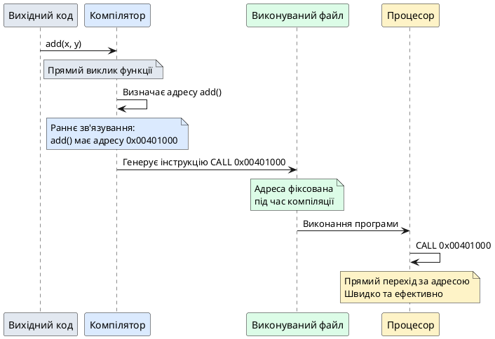
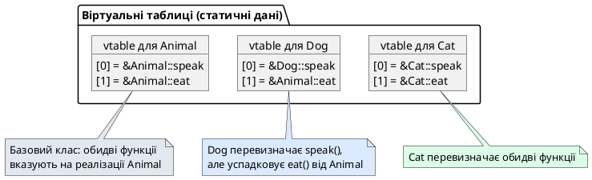
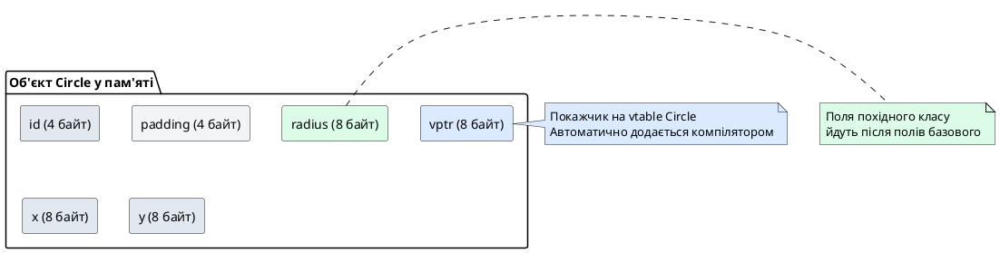
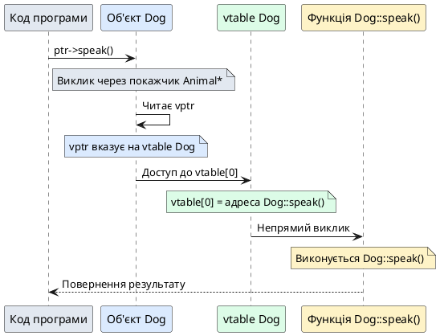
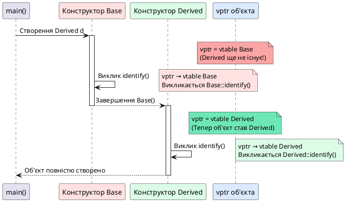
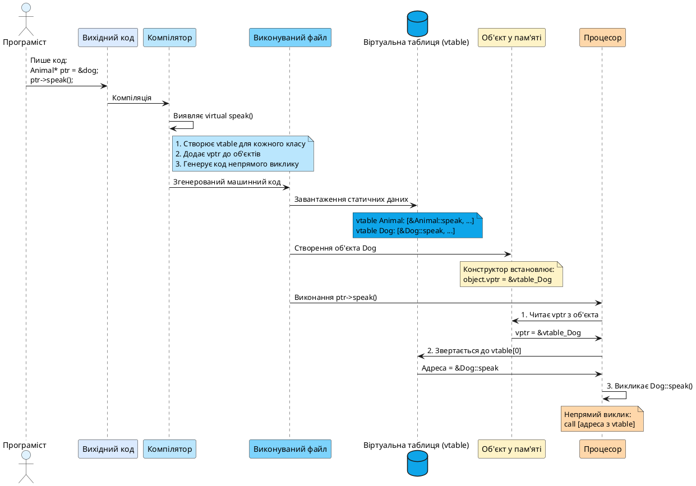

## Загадка восьми зайвих байтів

Розглянемо два схожі класи — один без віртуальних методів, інший з єдиним віртуальним методом:

```cpp [MysteriousBytes.cpp]
#include <iostream>

class EmptyNonPolymorphic
{
    // Клас без віртуальних методів
};

class EmptyPolymorphic
{
public:
    virtual void doNothing() {}  // Один віртуальний метод
};

int main()
{
    std::cout << "sizeof(EmptyNonPolymorphic) = " 
              << sizeof(EmptyNonPolymorphic) << " байт\n";
    std::cout << "sizeof(EmptyPolymorphic) = " 
              << sizeof(EmptyPolymorphic) << " байт\n";
    
    return 0;
}
```

::terminal-preview{title="./MysteriousBytes (64-бітна система)"}
<div class="line">sizeof(EmptyNonPolymorphic) = 1 байт</div>
<div class="line">sizeof(EmptyPolymorphic) = 8 байт</div>
::

Обидва класи не мають полів даних, проте їхні розміри радикально різняться. Порожній клас `EmptyNonPolymorphic` займає 1 байт (мінімальний розмір, щоб кожен об'єкт мав унікальну адресу в пам'яті), а клас `EmptyPolymorphic` з єдиним віртуальним методом раптово «важить» 8 байт!

Звідки взялися ці додаткові 7 байт? Що компілятор приховує всередині поліморфного об'єкта? Чому простий віртуальний метод, який навіть нічого не робить, спричиняє таке збільшення розміру?

У цій статті ми заглибимося в **внутрішню архітектуру поліморфізму C++** — дослідимо, як компілятор реалізує динамічне зв'язування через **віртуальні таблиці методів** (*virtual method table* або *vtable*) та **прихований покажчик на віртуальну таблицю** (*virtual table pointer* або *vptr*). Ми побачимо, як саме процесор виконує поліморфний виклик, чому віртуальні функції не працюють у конструкторах і деструкторах, та оцінимо реальну вартість поліморфізму.

::card-group

::card{title="🎯 Мета статті" icon="i-lucide-target"}

- Дослідити внутрішню архітектуру віртуальних викликів на рівні машинних інструкцій та пам'яті
- Розібрати віртуальну таблицю методів (vtable): структуру таблиці покажчиків та її розміщення в пам'яті
- Дослідити покажчик на віртуальну таблицю (vptr): неявне приховане поле в кожному поліморфному об'єкті
- Пояснити різницю між раннім (статичним) та пізнім (динамічним) зв'язуванням
- З'ясувати, чому віртуальні функції категорично не працюють у конструкторах та деструкторах
- Оцінити вартість поліморфізму: накладні витрати на пам'ять та втрату кеш-локальності

::

::card{title="🔑 Ключові терміни" icon="i-lucide-key"}

- **Зв'язування** (*binding*): процес перетворення ідентифікатора (імені функції) в конкретну адресу в пам'яті
- **Раннє зв'язування** (*early / static binding*): вибір функції відбувається під час компіляції на основі типу покажчика
- **Пізнє зв'язування** (*late / dynamic binding*): вибір функції відбувається під час виконання на основі реального типу об'єкта
- **Віртуальна таблиця** (*virtual table / vtable*): статичний масив покажчиків на віртуальні методи класу
- **Покажчик на віртуальну таблицю** (*vptr*): приховане поле в кожному об'єкті поліморфного класу, що вказує на vtable
- **Непрямий виклик** (*indirect call*): виклик функції через покажчик замість прямого переходу за фіксованою адресою

::

::

## Зв'язування: від імені функції до машинної адреси

### Що таке зв'язування

Коли ви пишете виклик функції `foo()` у коді, компілятор має перетворити це ім'я на **конкретну адресу в пам'яті**, за якою знаходиться машинний код функції. Процес перетворення ідентифікатора (імені функції або змінної) в адресу називається **зв'язуванням** (*binding*).

Під час компіляції кожна функція перетворюється на послідовність машинних інструкцій і отримує унікальну адресу в пам'яті виконуваного файлу. Коли програма запускається, операційна система завантажує код у пам'ять, і кожна функція «живе» за певною адресою.

Розглянемо просту функцію та її приблизне відображення в пам'яті:

```cpp
void greet()
{
    std::cout << "Hello!\n";
}

int main()
{
    greet();  // Як процесор знає, куди стрибнути?
    return 0;
}
```

Після компіляції функція `greet()` може мати, наприклад, адресу `0x00401000` у пам'яті. Виклик `greet()` у коді перетворюється на машинну інструкцію `CALL 0x00401000` — процесор переходить за цією адресою, виконує код функції, а потім повертається.

### Раннє зв'язування: компілятор знає все заздалегідь

Більшість викликів функцій у C++ використовують **раннє зв'язування** (*early binding* або *static binding*). Це означає, що компілятор або компонувальник (*linker*) може визначити точну адресу функції **під час компіляції або компонування** програми, задовго до її запуску.

**Прямий виклик функції** (*direct function call*) — це виклик, де ім'я функції явно вказано в коді. Усі такі виклики використовують раннє зв'язування:

```cpp [EarlyBinding.cpp]
#include <iostream>

int add(int a, int b)
{
    return a + b;
}

int subtract(int a, int b)
{
    return a - b;
}

int main()
{
    int x = 10, y = 5;
    
    // Прямі виклики — раннє зв'язування
    std::cout << "add(x, y) = " << add(x, y) << "\n";
    std::cout << "subtract(x, y) = " << subtract(x, y) << "\n";
    
    return 0;
}
```

Компілятор аналізує код, бачить виклики `add(x, y)` і `subtract(x, y)`, знаходить визначення цих функцій і **замінює виклики на інструкції переходу за фіксованими адресами**:

```nasm
; Приблизний асемблерний код (x86-64)
call 0x00401000   ; Перехід до add()
call 0x00401050   ; Перехід до subtract()
```

Це максимально ефективно — процесор напряму переходить за адресою без жодних додаткових операцій.

::plant-uml{alt="Раннє зв'язування: компілятор фіксує адреси під час збірки"}



::

### Пізнє зв'язування: вибір функції під час виконання

Проте не завжди компілятор може визначити, яка саме функція буде викликана. Розглянемо програму-калькулятор, де користувач обирає операцію під час виконання:

```cpp [LateBinding.cpp]
#include <iostream>

int add(int a, int b) { return a + b; }
int subtract(int a, int b) { return a - b; }
int multiply(int a, int b) { return a * b; }

int main()
{
    int a, b, operation;
    
    std::cout << "Введіть два числа: ";
    std::cin >> a >> b;
    
    std::cout << "Виберіть операцію (0=додавання, 1=віднімання, 2=множення): ";
    std::cin >> operation;
    
    // ❌ Компілятор НЕ може визначити, яка функція викликатиметься
    if (operation == 0)
        std::cout << "Результат: " << add(a, b) << "\n";
    else if (operation == 1)
        std::cout << "Результат: " << subtract(a, b) << "\n";
    else if (operation == 2)
        std::cout << "Результат: " << multiply(a, b) << "\n";
    
    return 0;
}
```

Компілятор бачить три можливі виклики, але не може знати заздалегідь, який саме виконається — це залежить від введення користувача під час виконання. Такі випадки вимагають **пізнього зв'язування** (*late binding* або *dynamic binding*).

У C++ пізнє зв'язування реалізується через **покажчики на функції** (*function pointers*):

```cpp [FunctionPointer.cpp]
#include <iostream>

int add(int a, int b) { return a + b; }
int subtract(int a, int b) { return a - b; }
int multiply(int a, int b) { return a * b; }

int main()
{
    int a, b, operation;
    
    std::cout << "Введіть два числа: ";
    std::cin >> a >> b;
    
    std::cout << "Виберіть операцію (0=додавання, 1=віднімання, 2=множення): ";
    std::cin >> operation;
    
    // Покажчик на функцію
    int (*operationFunc)(int, int) = nullptr;
    
    // Вибираємо функцію під час виконання
    if (operation == 0)
        operationFunc = add;
    else if (operation == 1)
        operationFunc = subtract;
    else if (operation == 2)
        operationFunc = multiply;
    
    // Непрямий виклик через покажчик
    if (operationFunc != nullptr) {
        std::cout << "Результат: " << operationFunc(a, b) << "\n";
    }
    
    return 0;
}
```

Тепер виклик функції відбувається **непрямо** — через покажчик `operationFunc`. Процесор не може просто перейти за фіксованою адресою, адже значення покажчика визначається лише під час виконання програми. Замість цього процесор виконує:

1. Читає значення покажчика `operationFunc` з пам'яті
2. Переходить за адресою, що зберігається в покажчику
3. Виконує код функції

Це повільніше за пряме зв'язування (додатковий крок читання адреси), але набагато гнучкіше — вибір функції відкладається до моменту виконання.

::note
**Непрямий виклик функції** (*indirect function call*) — виклик через покажчик на функцію замість прямого переходу за фіксованою адресою. Це основа пізнього зв'язування. Віртуальні методи C++ реалізовані саме через непрямі виклики, але замість простих покажчиків використовується складніша структура — **віртуальна таблиця** (*vtable*).

::

## Віртуальна таблиця: як компілятор організовує поліморфізм

### Що таке vtable

**Віртуальна таблиця** (*virtual table* або скорочено *vtable*) — це статичний масив покажчиків на віртуальні методи класу, який створюється компілятором під час компіляції. Кожен клас, що має хоча б один віртуальний метод, отримує власну vtable.

Розглянемо простий приклад:

```cpp [VTableExample.cpp]
class Animal
{
public:
    virtual void speak() { std::cout << "???\n"; }
    virtual void eat() { std::cout << "Їм їжу\n"; }
};

class Dog : public Animal
{
public:
    void speak() override { std::cout << "Woof\n"; }
    // eat() не перевизначено — використовується Animal::eat()
};

class Cat : public Animal
{
public:
    void speak() override { std::cout << "Meow\n"; }
    void eat() override { std::cout << "Їм рибу\n"; }
};
```

Компілятор створює **три окремі vtable** — по одній для кожного класу:

::plant-uml{alt="Структура віртуальних таблиць для ієрархії Animal → Dog / Cat"}



::

Кожен запис у vtable — це адреса **найпохіднішого методу**, доступного для об'єктів цього класу:

- **vtable для `Animal`**: обидва записи вказують на методи `Animal`
- **vtable для `Dog`**: `speak()` вказує на `Dog::speak()`, але `eat()` — на `Animal::eat()` (не перевизначено)
- **vtable для `Cat`**: обидва записи вказують на методи `Cat` (перевизначено обидва)

::tip
**Важливо**: vtable створюється **один раз для кожного класу** під час компіляції і зберігається в **сегменті констант** (*read-only data section*) виконуваного файлу. Це не частина об'єкта — це глобальна статична структура, спільна для всіх об'єктів класу. Кожен об'єкт зберігає лише **покажчик на vtable**, а не саму таблицю.

::

### Приховане поле vptr: мост між об'єктом і vtable

Щоб зв'язати об'єкт із його vtable, компілятор додає до кожного поліморфного об'єкта **приховане поле** — покажчик на віртуальну таблицю, який зазвичай називають **vptr** (*virtual table pointer*).

На відміну від прихованого покажчика `this` (який є параметром методу, а не полем), **vptr є реальним полем** — він займає пам'ять усередині кожного об'єкта. Розмір vptr — 8 байт на 64-бітних системах, 4 байти на 32-бітних.

```cpp [VPtrDemo.cpp]
class Animal
{
public:
    virtual void speak() { std::cout << "???\n"; }
};

class Dog : public Animal
{
public:
    void speak() override { std::cout << "Woof\n"; }
};

int main()
{
    Animal a;  // a.vptr вказує на vtable Animal
    Dog d;     // d.vptr вказує на vtable Dog
    
    Animal* ptr = &d;  // ptr вказує на об'єкт Dog
                       // ptr->vptr все ще вказує на vtable Dog!
    
    ptr->speak();  // Викличе Dog::speak()
    
    return 0;
}
```

Кожен об'єкт зберігає vptr, який вказує на vtable свого класу. Навіть якщо ми адресуємо об'єкт `Dog` через покажчик `Animal*`, vptr усередині об'єкта залишається вказувати на vtable `Dog`.

::memory-view{title="Структура поліморфного об'єкта в пам'яті" :variables='[{"name": "Dog object", "type": "struct", "value": "vptr → vtable Dog | data fields..."}]'}
::

Ось чому при виклику `ptr->speak()` виконається `Dog::speak()`, а не `Animal::speak()` — компілятор генерує код, що читає vptr із об'єкта, знаходить адресу `speak()` у vtable і викликає саме `Dog::speak()`.

### Структура пам'яті поліморфного об'єкта

Розглянемо клас із полями даних та віртуальними методами:

```cpp [MemoryLayout.cpp]
#include <iostream>

class Shape
{
private:
    int id;
    double x, y;

public:
    Shape(int i, double px, double py) : id(i), x(px), y(py) {}
    
    virtual double getArea() const = 0;
    virtual void draw() const { /* ... */ }
};

class Circle : public Shape
{
private:
    double radius;

public:
    Circle(int i, double px, double py, double r)
        : Shape(i, px, py), radius(r) {}
    
    double getArea() const override
    {
        return 3.14159 * radius * radius;
    }
};

int main()
{
    std::cout << "sizeof(Shape) = " << sizeof(Shape) << " байт\n";
    std::cout << "sizeof(Circle) = " << sizeof(Circle) << " байт\n";
    
    return 0;
}
```

::terminal-preview{title="./MemoryLayout (64-бітна система)"}
<div class="line">sizeof(Shape) = 32 байт</div>
<div class="line">sizeof(Circle) = 40 байт</div>
::

Розберемо структуру пам'яті:

**Shape (32 байти):**
- 8 байт — vptr (покажчик на vtable)
- 4 байти — `int id`
- 4 байти — вирівнювання (*padding*)
- 8 байт — `double x`
- 8 байт — `double y`

**Circle (40 байт):**
- 32 байти — частина Shape (включно з vptr)
- 8 байт — `double radius`

::plant-uml{alt="Розташування vptr та полів даних в пам'яті"}



::

Зверніть увагу: **vptr зазвичай розміщується на початку об'єкта** (хоча стандарт C++ не гарантує це — залежить від компілятора). Це забезпечує ефективний доступ до vtable без додаткових обчислень зміщень.

## Алгоритм виклику віртуального методу

### Покрокова диспетчеризація

Тепер розберемо, що саме відбувається під час виклику віртуального методу. Розглянемо код:

```cpp
Animal* ptr = new Dog();
ptr->speak();
```

Компілятор генерує приблизно такий алгоритм:

**Крок 1**: Читає vptr із об'єкта, на який вказує `ptr`

```cpp
// Приблизний псевдокод
vtable* objVTable = ptr->vptr;
```

**Крок 2**: Знаходить потрібний метод у vtable за індексом

```cpp
// speak() має індекс 0 у vtable
void (*speakFunc)() = objVTable[0];
```

**Крок 3**: Викликає функцію за знайденою адресою

```cpp
speakFunc();  // Непрямий виклик
```

Це три додаткові операції порівняно з прямим викликом:
1. Читання vptr з пам'яті
2. Індексація масиву vtable
3. Непрямий виклик через покажчик

::plant-uml{alt="Алгоритм виклику ptr->speak() через vtable"}



::

### Порівняння з прямим викликом

Для порівняння, прямий виклик (раннє зв'язування) набагато простіший:

```cpp
Dog dog;
dog.speak();  // Пряме зв'язування
```

Компілятор генерує:

```cpp
call Dog::speak()  // Прямий перехід за адресою
```

Одна операція замість трьох — ось чому невіртуальні виклики швидші.

::code-group

```cpp [Віртуальний виклик (3 операції)]
Animal* ptr = &dog;
ptr->speak();

// Згенерований код:
// 1. mov rax, [ptr]       ; Отримати адресу об'єкта
// 2. mov rax, [rax]       ; Прочитати vptr
// 3. call [rax + offset]  ; Викликати через vtable
```

```cpp [Прямий виклик (1 операція)]
Dog dog;
dog.speak();

// Згенерований код:
// 1. call Dog::speak()    ; Прямий виклик
```

::

## Чому віртуальні функції не працюють у конструкторах

### Проблема неповного об'єкта

Одна з найпідступніших пасток віртуальних функцій — їх поведінка в конструкторах та деструкторах. Розглянемо приклад:

```cpp [VirtualInConstructor.cpp]
#include <iostream>

class Base
{
public:
    Base()
    {
        std::cout << "Конструктор Base, виклик identify(): ";
        identify();  // Виклик віртуального методу
    }
    
    virtual void identify() const
    {
        std::cout << "Я Base\n";
    }
};

class Derived : public Base
{
public:
    Derived()
    {
        std::cout << "Конструктор Derived, виклик identify(): ";
        identify();
    }
    
    void identify() const override
    {
        std::cout << "Я Derived\n";
    }
};

int main()
{
    Derived d;
    return 0;
}
```

Інтуїтивно здається, що обидва виклики `identify()` мають виконати `Derived::identify()`, адже ми створюємо об'єкт `Derived`. Проте результат інший:

::terminal-preview{title="./VirtualInConstructor"}
<div class="line">Конструктор Base, виклик identify(): Я Base</div>
<div class="line">Конструктор Derived, виклик identify(): Я Derived</div>
::

Перший виклик `identify()` у конструкторі `Base` виконав **`Base::identify()`**, а не `Derived::identify()`! Чому?

### Еволюція vptr під час конструювання

Ключ до розуміння — **порядок конструювання об'єкта** та динамічна зміна vptr:

**Етап 1: Початок конструювання `Derived`**
- Спочатку викликається конструктор базового класу `Base()`
- vptr встановлюється на **vtable `Base`**
- Частина `Derived` ще **не існує** — поля не ініціалізовані, віртуальні методи недоступні

**Етап 2: Виконання тіла `Base()`**
- Виклик `identify()` дивиться на vptr
- vptr вказує на vtable `Base`
- Викликається `Base::identify()`

**Етап 3: Початок тіла `Derived()`**
- Конструктор `Base()` завершився
- vptr **перемикається** на vtable `Derived`
- Тепер об'єкт «став» `Derived`

**Етап 4: Виконання тіла `Derived()`**
- Виклик `identify()` дивиться на vptr
- vptr вказує на vtable `Derived`
- Викликається `Derived::identify()`

::plant-uml{alt="Зміна vptr під час конструювання об'єкта Derived"}



::

Це не баг — це **захисний механізм**. Якби C++ дозволив викликати `Derived::identify()` у конструкторі `Base()`, метод міг би звернутися до полів класу `Derived`, які ще не ініціалізовані. Це призвело б до Undefined Behavior — читання сміття з пам'яті, краху програми, непередбачуваної поведінки.

::caution
**Категорична заборона**: ніколи не викликайте віртуальні функції в конструкторах або деструкторах з розрахунку на поліморфну поведінку. Під час виконання конструктора базового класу об'єкт «є» базовим класом, а не похідним. Віртуальний виклик завжди виконає реалізацію поточного класу в ієрархії конструювання, а не найпохіднішого.

::

Аналогічна ситуація з деструкторами: коли виконується деструктор `Base`, частина `Derived` вже знищена, vptr перемикається назад на vtable `Base`.


## Вартість поліморфізму: реальні накладні витрати

### Витрати на пам'ять

Поліморфізм не безкоштовний. Кожен об'єкт поліморфного класу несе додаткові витрати:

**1. Покажчик vptr у кожному об'єкті**

Незалежно від того, скільки віртуальних методів має клас (один чи десять), кожен об'єкт зберігає **один vptr** розміром 8 байт (64-бітна система) або 4 байти (32-бітна).

```cpp [MemoryOverhead.cpp]
#include <iostream>

struct NonPolymorphic
{
    int data;  // 4 байти
};

struct Polymorphic
{
    int data;  // 4 байти
    virtual void foo() {}  // +8 байт (vptr)
};

int main()
{
    std::cout << "sizeof(NonPolymorphic) = " << sizeof(NonPolymorphic) << " байт\n";
    std::cout << "sizeof(Polymorphic) = " << sizeof(Polymorphic) << " байт\n";
    
    return 0;
}
```

::terminal-preview{title="./MemoryOverhead"}
<div class="line">sizeof(NonPolymorphic) = 4 байт</div>
<div class="line">sizeof(Polymorphic) = 16 байт</div>
::

Чому 16, а не 12? Через **вирівнювання** (*alignment*) — компілятор вирівнює структури до меж машинного слова (8 байт на 64-бітних системах).

**2. Глобальна vtable для кожного класу**

Кожен поліморфний клас має свою vtable, яка зберігається в сегменті констант виконуваного файлу. Розмір vtable залежить від кількості віртуальних методів:

```
Розмір vtable = (кількість віртуальних методів) × (розмір покажчика)
```

Для класу з 10 віртуальними методами на 64-бітній системі: `10 × 8 = 80 байт`.

Проте це **одна таблиця на клас**, а не на об'єкт. Мільйон об'єктів класу `Dog` ділять одну спільну vtable `Dog`.

**3. Оцінка впливу для малих об'єктів**

Для великих об'єктів (сотні байт) додаткові 8 байт vptr — мізерні витрати. Проте для **малих об'єктів** вплив значний:

```cpp
struct Tiny
{
    char flag;  // 1 байт
};

struct TinyPolymorphic
{
    char flag;  // 1 байт
    virtual void foo() {}  // +8 байт vptr
};

// sizeof(Tiny) = 1 байт
// sizeof(TinyPolymorphic) = 16 байт (1600% збільшення!)
```

Якщо ви створюєте мільйони таких об'єктів (наприклад, вузли дерева, елементи великих графів), накладні витрати стають відчутними.

::note
**Компромісна архітектура**: у системах із суворими обмеженнями пам'яті (вбудовані системи, ігрові движки з мільйонами сутностей) іноді відмовляються від віртуальних методів на користь інших патернів поліморфізму (type erasure, visitors, variant-based dispatch). У загальних додатках накладні витрати віртуальних методів мізерні порівняно з перевагами гнучкості архітектури.

::

### Витрати на продуктивність

**1. Непрямий виклик через vtable**

Віртуальний виклик вимагає трьох операцій замість однієї:

- Читання vptr з пам'яті (можливий cache miss)
- Індексація vtable (ще одне звернення до пам'яті)
- Непрямий виклик за покажчиком

На сучасних процесорах з глибокими конвеєрами та предиктором переходів (*branch predictor*) непрямий виклик може призвести до **простою конвеєра** (*pipeline stall*), якщо предиктор не вгадав адресу.

**2. Блокування оптимізацій компілятора**

Компілятор не може **вбудувати** (*inline*) віртуальний виклик, адже не знає під час компіляції, яка реалізація буде викликана. Інлайнінг — одна з найпотужніших оптимізацій (усуває накладні витрати виклику, дозволяє інші оптимізації), але віртуальні методи його блокують.

::code-group

```cpp [Невіртуальний метод (може бути inline)]
class Point {
    double x, y;
public:
    double getX() const { return x; }  // Компілятор може inline
};

// Виклик:
double val = point.getX();

// Може стати просто:
double val = point.x;  // Інлайнінг усунув виклик функції
```

```cpp [Віртуальний метод (НЕ може бути inline)]
class Shape {
public:
    virtual double getArea() const = 0;
};

// Виклик:
double area = shape->getArea();

// Компілятор НЕ може inline — невідома реалізація
// Завжди непрямий виклик через vtable
```

::

**3. Втрата кеш-локальності**

Втable зберігається в окремій ділянці пам'яті (сегмент констант), тому звернення до vtable може призвести до **cache miss** — процесор не знайде потрібні дані в швидкому кеші і змушений буде читати з повільної оперативної пам'яті. Для гарячих циклів, що виконують мільйони викликів на секунду, це відчутно.

**4. Кількісна оцінка**

На практиці накладні витрати віртуального виклику:

- **Ідеальний випадок** (дані в кеші, предиктор переходів вгадав): 2–3 додаткові тактові цикли
- **Реалістичний випадок** (деякі cache miss): 10–50 тактових циклів
- **Песимістичний випадок** (постійні cache miss, непередбачувані переходи): 100+ тактових циклів

Для порівняння, прямий виклик невіртуальної функції: 1–2 тактові цикли.

У більшості додатків ці витрати **мізерні** порівняно з іншими операціями (введення/виведення, обчислення, робота з базами даних). Проте в **критичних гарячих циклах** (фізичні симуляції, обробка зображень, рендеринг графіки) віртуальні виклики можуть стати вузьким місцем.

::warning
**Передчасна оптимізація**: не відмовляйтеся від віртуальних методів «на всяк випадок» через страх перед накладними витратами. Використовуйте віртуальні методи для побудови чистої архітектури. Якщо профілювання покаже, що віртуальні виклики є вузьким місцем (що трапляється рідко), тоді оптимізуйте конкретні гарячі ділянки. **Правило**: спочатку зробіть код правильним і зрозумілим, потім швидким — але лише там, де це дійсно потрібно.

::

### Порівняльна таблиця: віртуальний vs невіртуальний виклик

| Аспект | Невіртуальний виклик | Віртуальний виклик |
|:-------|:---------------------|:-------------------|
| **Зв'язування** | Раннє (статичне) — під час компіляції | Пізнє (динамічне) — під час виконання |
| **Операцій для виклику** | 1 (прямий перехід) | 3 (читання vptr → індексація vtable → непрямий виклік) |
| **Можливість inline** | ✅ Так | ❌ Ні |
| **Розмір об'єкта** | Лише поля класу | Поля класу + 8 байт (vptr) |
| **Предиктор переходів** | Легко передбачити | Складно передбачити |
| **Кеш-локальність** | Висока | Нижча (vtable в іншій ділянці пам'яті) |
| **Типова швидкість** | ~1–2 тактові цикли | ~2–50 тактових циклів (залежить від кешу) |
| **Коли використовувати** | Методи без поліморфізму | Методи, що потребують перевизначення в нащадках |

## Візуалізація повного процесу: від коду до виконання

::plant-uml{alt="Повний ланцюг виклику віртуального методу: код → компіляція → виконання"}



::

Ця діаграма показує повний цикл від написання коду до виконання віртуального виклику. Ключові етапи:

1. **Компіляція**: компілятор створює vtable для кожного класу та додає vptr до об'єктів
2. **Завантаження**: vtable завантажуються в пам'ять як статичні дані
3. **Створення об'єкта**: конструктор ініціалізує vptr
4. **Виклик методу**: процесор виконує триетапний алгоритм (vptr → vtable → виклик)

## Девіртуалізація: оптимізація компілятора

### Коли компілятор може усунути віртуальний виклик

Сучасні компілятори (GCC, Clang, MSVC) намагаються виконати **девіртуалізацію** (*devirtualization*) — заміну віртуального виклику на прямий, якщо реальний тип об'єкта відомий під час компіляції:

```cpp [Devirtualization.cpp]
void example()
{
    Dog dog;
    
    // Тип відомий — компілятор може девіртуалізувати
    dog.speak();  // Замінюється на прямий виклик Dog::speak()
    
    // Через покажчик на базовий клас — девіртуалізація неможлива
    Animal* ptr = &dog;
    ptr->speak();  // Залишається віртуальним викликом
}
```

У першому випадку компілятор **точно знає**, що `dog` має тип `Dog`, тому може замінити віртуальний виклик на прямий. У другому випадку тип покажчика — `Animal*`, і компілятор не може гарантувати, що `ptr` завжди адресує саме `Dog`, тому віртуальний виклик залишається.

### Специфікатор `final` допомагає оптимізації

Клас або метод, позначений як `final`, дозволяє компілятору виконати девіртуалізацію, адже точно відомо, що подальших перевизначень не буде:

```cpp
class Dog final : public Animal
{
public:
    void speak() override { std::cout << "Woof\n"; }
};

void example(Dog* ptr)
{
    // Клас Dog позначено final → компілятор може девіртуалізувати
    ptr->speak();  // Може стати прямим викликом Dog::speak()
}
```

Це одна з причин використання `final` — не лише заборона наслідування, але й можливість оптимізації.

## Практичні рекомендації

::card-group

::card{title="✅ Коли віртуальні методи доречні" icon="i-lucide-check-circle"}

- Клас призначений для наслідування та поліморфізму
- Потрібна гнучкість архітектури: різні реалізації одного інтерфейсу
- Накладні витрати мізерні порівняно з іншими операціями (більшість додатків)
- Читабельність і підтримуваність важливіші за мікрооптимізації

::

::card{title="❌ Коли уникати віртуальних методів" icon="i-lucide-x-circle"}

- Гарячі цикли, що виконують мільйони викликів на секунду
- Малі об'єкти, де 8 байт vptr становлять значну частку розміру
- Профілювання показало, що віртуальні виклики — вузьке місце
- Клас є простою структурою даних (POD) без поліморфізму

::

::card{title="🔍 Діагностика проблем" icon="i-lucide-search"}

- `sizeof(Class)` більший за очікуване → перевірте наявність vptr (8 байт)
- Повільні цикли з викликами методів → профілюйте, можливо віртуальні виклики
- Неочікувана поведінка в конструкторах → не викликайте віртуальні методи там
- Витоки пам'яті при `delete basePtr` → деструктор базового класу не віртуальний

::

::card{title="⚡ Оптимізації" icon="i-lucide-zap"}

- Використовуйте `final` для класів та методів, що не мають нащадків
- Уникайте віртуальних викликів у найвнутрішніших циклах
- Розглядайте шаблони замість поліморфізму для критичних ділянок
- Профілюйте перед оптимізацією — передчасна оптимізація шкідлива

::

::

## Резюме

У цій статті ми розібрали внутрішні механізми реалізації поліморфізму в C++:

::card-group

::card{title="🔗 Раннє vs пізнє зв'язування" icon="i-lucide-link"}

**Раннє зв'язування** (статичне): компілятор фіксує адреси функцій під час компіляції. Максимально ефективно, але негнучко.

**Пізнє зв'язування** (динамічне): вибір функції відбувається під час виконання на основі реального типу об'єкта. Гнучко, але має накладні витрати.

::

::card{title="📋 Віртуальна таблиця (vtable)" icon="i-lucide-table"}

Статичний масив покажчиків на віртуальні методи класу. Створюється компілятором під час компіляції, по одній таблиці на клас. Зберігається в сегменті констант виконуваного файлу.

::

::card{title="➡️ Покажчик vptr" icon="i-lucide-arrow-right"}

Приховане поле в кожному об'єкті поліморфного класу, що вказує на vtable. Розмір: 8 байт (64-біт) або 4 байти (32-біт). Автоматично ініціалізується конструктором.

::

::card{title="⚙️ Алгоритм виклику" icon="i-lucide-settings"}

Віртуальний виклик: читання vptr → індексація vtable → непрямий виклік. Три операції замість однієї для прямого виклику.

::

::

**Ключові висновки**:

1. Поліморфізм реалізовано через vtable та vptr — простий, але елегантний механізм
2. vptr додається компілятором автоматично, збільшуючи розмір кожного об'єкта на 8 байт
3. Віртуальні функції не працюють у конструкторах через порядок ініціалізації vptr
4. Накладні витрати мізерні для більшості додатків, критичні лише в гарячих циклах
5. Використовуйте віртуальні методи для чистої архітектури, оптимізуйте лише за потреби

У наступній статті ми вивчимо **абстрактні класи та чисті віртуальні функції** — механізм визначення інтерфейсів у C++, який дозволяє проєктувати системи з чіткими контрактами поведінки та принципом інверсії залежностей.

::::accordion

:::accordion-item{label="📋 Завдання: Дослідження розміру об'єктів" icon="i-lucide-clipboard-list"}

Створіть кілька класів з різною кількістю віртуальних методів та полів. Виміряйте їхні розміри через `sizeof()` і поясніть результати з урахуванням vptr та вирівнювання пам'яті:

```cpp
class A { };
class B { virtual void f() {} };
class C { int x; };
class D { int x; virtual void f() {} };
class E { int x; virtual void f() {} virtual void g() {} };
```

:::

:::accordion-item{label="❓ Чому vtable є статичною, а не частиною об'єкта?" icon="i-lucide-help-circle"}

Якби кожен об'єкт зберігав власну копію vtable, витрати пам'яті були б величезними. Для класу з 10 віртуальними методами vtable займає 80 байт (10 × 8). Якщо створити мільйон об'єктів, це 80 МБ лише на vtable! Натомість компілятор створює **одну спільну vtable на клас**, а кожен об'єкт зберігає лише **маленький покажчик** (8 байт) на цю спільну таблицю. Для мільйона об'єктів: 8 МБ покажчиків + 80 байт таблиця = ~8 МБ замість 80 МБ.

:::

:::accordion-item{label="❓ Чому непрямий виклик повільніший за прямий?" icon="i-lucide-help-circle"}

Прямий виклик — це одна машинна інструкція `CALL <адреса>`, яка переходить за фіксованою адресою. Процесор може завчасно завантажити код функції в кеш і підготувати конвеєр виконання. Непрямий виклик вимагає трьох кроків: (1) прочитати адресу з пам'яті (vptr), (2) індексувати таблицю (vtable), (3) викликати за отриманою адресою. Кожен крок — звернення до пам'яті (можливі cache miss). Процесор не може передбачити, куди відбудеться перехід, тому конвеєр виконання може зупинитися в очікуванні даних.

:::

:::accordion-item{label="❓ Чи можна обійти віртуальний виклик та викликати базовий метод?" icon="i-lucide-help-circle"}

Так, можна явно вказати, який саме метод викликати, використовуючи оператор розв'язання області видимості `::`:

```cpp
Animal* ptr = &dog;
ptr->speak();           // Віртуальний виклик → Dog::speak()
ptr->Animal::speak();   // Прямий виклик → Animal::speak()
```

Це обходить механізм vtable і викликає конкретну реалізацію базового класу. Корисно, якщо перевизначений метод викликає базову реалізацію через `Base::method()`.

:::

::::
