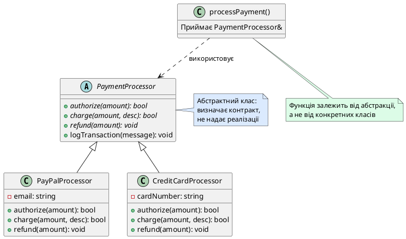
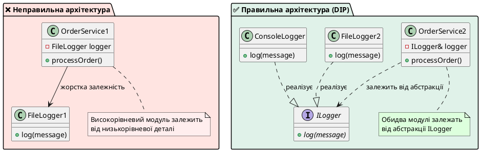
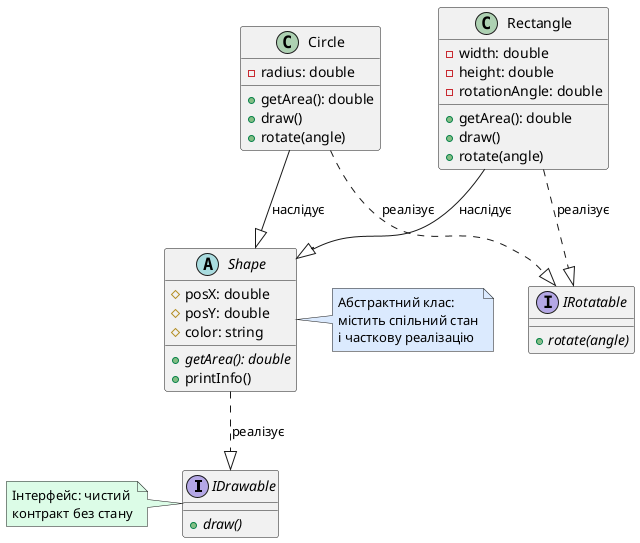

## Коли реалізація базового класу не має сенсу

Припустимо, ви розробляєте графічну систему з ієрархією фігур. Базовий клас `Shape` оголошує метод `getArea()` для обчислення площі:

```cpp [ShapeProblem.cpp]
#include <iostream>

class Shape
{
public:
    virtual double getArea() const
    {
        // ❓ Яку площу повертати для "абстрактної фігури"?
        return 0.0;  // Заглушка, яка не має сенсу
    }
    
    virtual ~Shape() = default;
};

class Circle : public Shape
{
private:
    double radius;

public:
    Circle(double r) : radius(r) {}
    
    double getArea() const override
    {
        return 3.14159 * radius * radius;
    }
};

class Rectangle : public Shape
{
private:
    double width, height;

public:
    Rectangle(double w, double h) : width(w), height(h) {}
    
    double getArea() const override
    {
        return width * height;
    }
};
```

Є дві фундаментальні проблеми:

**Проблема 1: Безсенсовна реалізація `Shape::getArea()`**

Яку площу має повертати метод `getArea()` для абстрактної «фігури взагалі»? Коло має площу, прямокутник має площу, але сама концепція «фігура» без конкретної форми — це абстракція, що не має площі. Повернення `0.0` — це заглушка, яка може призвести до підступних помилок:

```cpp
Shape shape;  // Створюємо "абстрактну фігуру"
std::cout << shape.getArea();  // Виведе 0.0 — некоректно!
```

**Проблема 2: Забуті перевизначення**

Якщо програміст створить новий клас `Triangle` і забуде перевизначити `getArea()`, компілятор мовчки скомпілює код, але виклик `triangle.getArea()` поверне `0.0` — базова заглушка. Помилка проявиться лише під час виконання:

```cpp
class Triangle : public Shape
{
    // Забули перевизначити getArea()!
};

int main()
{
    Triangle tri;
    std::cout << tri.getArea();  // Виведе 0.0 — баг!
}
```

C++ пропонує елегантне рішення обох проблем: **чисті віртуальні функції** (*pure virtual functions*) — методи, що оголошують контракт поведінки без надання реалізації. Це змушує похідні класи надати власну реалізацію і робить базовий клас **абстрактним** — таким, об'єкти якого не можна створювати.

У цій статті ми опануємо чисті віртуальні функції, абстрактні класи та інтерфейси — механізми, які дозволяють проєктувати системи через чіткі контракти поведінки та принцип інверсії залежностей.

::card-group

::card{title="🎯 Мета статті" icon="i-lucide-target"}

- Ввести концепцію чистої віртуальної функції через синтаксис `= 0`
- Зрозуміти сутність абстрактного класу: неможливість інстанціювання та роль архітектурного контракту
- Опанувати концепцію інтерфейсів у C++: класи без стану, що містять лише чисті віртуальні методи
- Ознайомитися з принципом інверсії залежностей (Dependency Inversion Principle)
- Розібрати особливість чистого віртуального деструктора: чому йому потрібне тіло реалізації

::

::card{title="🔑 Ключові терміни" icon="i-lucide-key"}

- **Чиста віртуальна функція** (*pure virtual function*): віртуальний метод без реалізації, позначений `= 0`
- **Абстрактний клас** (*abstract class*): клас, що містить хоча б одну чисту віртуальну функцію; не можна створювати його об'єкти
- **Конкретний клас** (*concrete class*): клас без чистих віртуальних функцій; можна створювати його об'єкти
- **Інтерфейс** (*interface*): абстрактний клас без полів даних, що містить лише чисті віртуальні методи
- **Інверсія залежностей** (*dependency inversion*): принцип, згідно з яким високорівневі модулі залежать від абстракцій, а не конкретних реалізацій

::

::

## Чисті віртуальні функції: контракт без реалізації

### Синтаксис та семантика

**Чиста віртуальна функція** (*pure virtual function*) — це віртуальний метод, який оголошує сигнатуру та семантику без надання реалізації. Синтаксис: після сигнатури методу додається `= 0`:

```cpp [PureVirtualSyntax.cpp]
class Shape
{
public:
    // Чиста віртуальна функція: оголошення без реалізації
    virtual double getArea() const = 0;
    virtual void draw() const = 0;
    
    virtual ~Shape() = default;
};
```

Символ `= 0` не має нічого спільного з присвоєнням нуля покажчику — це спеціальний синтаксис C++, що позначає чисту віртуальну функцію. Компілятор розуміє: «цей метод **має** бути перевизначений у похідних класах».

::note
**Історія синтаксису**: символ `= 0` був обраний Б'ярном Страуструпом (творцем C++) як компромісний варіант, що не вимагав нового ключового слова. У той час (1980-ті) додавання нових ключових слів могло порушити сумісність з існуючим кодом C. Сьогодні це просто історична особливість синтаксису, яку треба запам'ятати.

::

Чиста віртуальна функція може мати лише оголошення (без тіла) або оголошення з окремим визначенням поза класом (рідкісний випадок, який ми розглянемо пізніше).

### Наслідки оголошення чистої віртуальної функції

Наявність хоча б однієї чистої віртуальної функції має два критичні наслідки:

**1. Клас стає абстрактним**

Неможливо створювати об'єкти абстрактного класу напряму:

```cpp [AbstractClassError.cpp]
class Shape
{
public:
    virtual double getArea() const = 0;
    virtual ~Shape() = default;
};

int main()
{
    // ❌ Помилка компіляції: не можна створювати об'єкти абстрактного класу
    Shape shape;  
    
    // ❌ Помилка: не можна створювати через new
    Shape* ptr = new Shape();
    
    return 0;
}
```

Компілятор видасть помилку на кшталт:

```
error: cannot declare variable 'shape' to be of abstract type 'Shape'
note: because the following virtual functions are pure within 'Shape':
    virtual double Shape::getArea() const
```

Це **захисний механізм**: якби компілятор дозволив створити об'єкт `Shape`, що станеться при виклику `shape.getArea()`? Метод не має реалізації — це призвело б до Undefined Behavior або краху програми.

**2. Похідні класи зобов'язані перевизначити чисті віртуальні функції**

Якщо похідний клас **не перевизначає** всі чисті віртуальні функції базового класу, він **також стає абстрактним**:

```cpp [InheritedAbstraction.cpp]
class Shape
{
public:
    virtual double getArea() const = 0;
    virtual void draw() const = 0;
    virtual ~Shape() = default;
};

class Circle : public Shape
{
private:
    double radius;

public:
    Circle(double r) : radius(r) {}
    
    // ✅ Перевизначили getArea()
    double getArea() const override
    {
        return 3.14159 * radius * radius;
    }
    
    // ❌ Забули перевизначити draw()
    // Circle залишається абстрактним!
};

int main()
{
    // ❌ Помилка: Circle все ще абстрактний клас
    Circle c(5.0);
    
    return 0;
}
```

Компілятор видасть помилку:

```
error: cannot declare variable 'c' to be of abstract type 'Circle'
note: because the following virtual functions are pure within 'Circle':
    virtual void Shape::draw() const
```

Щоб `Circle` став **конкретним класом** (*concrete class*), потрібно перевизначити **всі** чисті віртуальні функції базового класу:

```cpp [ConcreteClass.cpp]
class Circle : public Shape
{
private:
    double radius;

public:
    Circle(double r) : radius(r) {}
    
    double getArea() const override
    {
        return 3.14159 * radius * radius;
    }
    
    void draw() const override
    {
        std::cout << "Малюю коло радіусом " << radius << "\n";
    }
};

int main()
{
    // ✅ Тепер можна створювати об'єкти Circle
    Circle c(5.0);
    std::cout << "Площа кола: " << c.getArea() << "\n";
    c.draw();
    
    return 0;
}
```

::terminal-preview{title="./ConcreteClass"}
<div class="line">Площа кола: 78.5398</div>
<div class="line">Малюю коло радіусом 5</div>
::

::tip
**Золоте правило**: чисті віртуальні функції — це **непорушний контракт**. Похідний клас не може ігнорувати чисту віртуальну функцію — він **зобов'язаний** надати реалізацію, інакше залишається абстрактним і не може бути інстанційованим. Це гарантує, що всі конкретні класи мають повну функціональність, оголошену в базовому класі.

::

## Абстрактні класи: архітектурні контракти без інстанцій

### Призначення абстрактних класів

**Абстрактний клас** (*abstract class*) — це клас, що визначає **інтерфейс** (набір методів) та частково чи повністю делегує реалізацію похідним класам. Абстрактні класи служать:

1. **Архітектурними контрактами**: визначають, що **має** робити похідний клас, але не як саме
2. **Спільною базою для поліморфізму**: дозволяють обробляти різні похідні класи через єдиний інтерфейс
3. **Захистом від некоректного використання**: забороняють створення об'єктів «напівготових» класів

Розглянемо реалістичний приклад: система обробки платежів.

```cpp [PaymentSystem.cpp]
#include <iostream>
#include <string>

// Абстрактний клас: визначає контракт для всіх платіжних систем
class PaymentProcessor
{
public:
    virtual ~PaymentProcessor() = default;
    
    // Чисті віртуальні функції: обов'язковий контракт
    virtual bool authorize(double amount) = 0;
    virtual bool charge(double amount, const std::string& description) = 0;
    virtual void refund(double amount) = 0;
    
    // Невіртуальний метод: спільна логіка для всіх процесорів
    void logTransaction(const std::string& message) const
    {
        std::cout << "[LOG] " << message << "\n";
    }
};

// Конкретна реалізація: PayPal
class PayPalProcessor : public PaymentProcessor
{
private:
    std::string email;

public:
    PayPalProcessor(std::string userEmail) : email(userEmail) {}
    
    bool authorize(double amount) override
    {
        logTransaction("PayPal: перевірка ліміту для " + email);
        return amount <= 10000.0;  // Ліміт $10,000
    }
    
    bool charge(double amount, const std::string& description) override
    {
        logTransaction("PayPal: списано $" + std::to_string(amount) + " - " + description);
        return true;
    }
    
    void refund(double amount) override
    {
        logTransaction("PayPal: повернуто $" + std::to_string(amount));
    }
};

// Конкретна реалізація: кредитна картка
class CreditCardProcessor : public PaymentProcessor
{
private:
    std::string cardNumber;

public:
    CreditCardProcessor(std::string card) : cardNumber(card) {}
    
    bool authorize(double amount) override
    {
        logTransaction("Картка " + cardNumber + ": перевірка через банк");
        return amount <= 50000.0;  // Ліміт $50,000
    }
    
    bool charge(double amount, const std::string& description) override
    {
        logTransaction("Картка: списано $" + std::to_string(amount));
        return true;
    }
    
    void refund(double amount) override
    {
        logTransaction("Картка: повернуто $" + std::to_string(amount));
    }
};

// Функція обробки платежу: працює з будь-яким процесором
void processPayment(PaymentProcessor& processor, double amount, const std::string& description)
{
    if (processor.authorize(amount)) {
        if (processor.charge(amount, description)) {
            std::cout << "✅ Платіж успішний\n\n";
        }
    } else {
        std::cout << "❌ Платіж відхилено: недостатній ліміт\n\n";
    }
}

int main()
{
    PayPalProcessor paypal("user@example.com");
    CreditCardProcessor card("**** 1234");
    
    processPayment(paypal, 500.0, "Підписка Premium");
    processPayment(card, 1500.0, "Покупка обладнання");
    
    return 0;
}
```

::terminal-preview{title="./PaymentSystem"}
<div class="line">[LOG] PayPal: перевірка ліміту для user@example.com</div>
<div class="line">[LOG] PayPal: списано $500.000000 - Підписка Premium</div>
<div class="line">✅ Платіж успішний</div>
<div class="line"></div>
<div class="line">[LOG] Картка **** 1234: перевірка через банк</div>
<div class="line">[LOG] Картка: списано $1500.000000 - Покупка обладнання</div>
<div class="line">✅ Платіж успішний</div>
::

У цьому прикладі:

- **`PaymentProcessor`** — абстрактний клас, що визначає контракт: «будь-який платіжний процесор має вміти авторизувати, списувати та повертати гроші»
- **`PayPalProcessor` і `CreditCardProcessor`** — конкретні реалізації з різною внутрішньою логікою
- **`processPayment()`** — функція, яка працює з **будь-яким** процесором через абстракцію `PaymentProcessor`

Ключова перевага: якщо додати новий процесор (`BitcoinProcessor`, `ApplePayProcessor`), функція `processPayment()` **не потребує змін** — вона працює з абстракцією, а не з конкретними типами.

::plant-uml{alt="Архітектура системи платежів: залежність від абстракції"}



::

### Абстрактні класи зі спільною логікою

Абстрактний клас не обов'язково містить **лише** чисті віртуальні функції. Він може мати:

- **Звичайні (невіртуальні) методи** зі спільною логікою для всіх похідних класів
- **Віртуальні методи з реалізацією за замовчуванням**, які похідні класи можуть перевизначити
- **Поля даних**, спільні для всіх похідних класів

```cpp [AbstractWithCommonLogic.cpp]
#include <iostream>
#include <string>

class Document
{
protected:
    std::string title;
    std::string author;

public:
    Document(std::string t, std::string a) : title(t), author(a) {}
    
    virtual ~Document() = default;
    
    // Невіртуальний метод: спільна логіка
    void printMetadata() const
    {
        std::cout << "Назва: " << title << "\n";
        std::cout << "Автор: " << author << "\n";
    }
    
    // Віртуальний метод з реалізацією за замовчуванням
    virtual std::string getType() const
    {
        return "Загальний документ";
    }
    
    // Чиста віртуальна функція: кожен тип документа має свій спосіб відображення
    virtual void render() const = 0;
};

class PDFDocument : public Document
{
public:
    PDFDocument(std::string t, std::string a) : Document(t, a) {}
    
    std::string getType() const override
    {
        return "PDF документ";
    }
    
    void render() const override
    {
        std::cout << "Рендеринг PDF: відкриття Adobe Reader...\n";
    }
};

class MarkdownDocument : public Document
{
public:
    MarkdownDocument(std::string t, std::string a) : Document(t, a) {}
    
    std::string getType() const override
    {
        return "Markdown документ";
    }
    
    void render() const override
    {
        std::cout << "Рендеринг Markdown: перетворення на HTML...\n";
    }
};

int main()
{
    PDFDocument pdf("Звіт_2024", "Іван Петренко");
    MarkdownDocument md("README", "Марія Коваль");
    
    Document* docs[] = { &pdf, &md };
    
    for (Document* doc : docs) {
        doc->printMetadata();
        std::cout << "Тип: " << doc->getType() << "\n";
        doc->render();
        std::cout << "\n";
    }
    
    return 0;
}
```

::terminal-preview{title="./AbstractWithCommonLogic"}
<div class="line">Назва: Звіт_2024</div>
<div class="line">Автор: Іван Петренко</div>
<div class="line">Тип: PDF документ</div>
<div class="line">Рендеринг PDF: відкриття Adobe Reader...</div>
<div class="line"></div>
<div class="line">Назва: README</div>
<div class="line">Автор: Марія Коваль</div>
<div class="line">Тип: Markdown документ</div>
<div class="line">Рендеринг Markdown: перетворення на HTML...</div>
::

Тут `Document` є абстрактним класом (має чисту віртуальну функцію `render()`), але також містить:

- Поля даних (`title`, `author`)
- Невіртуальний метод (`printMetadata()`)
- Віртуальний метод з реалізацією за замовчуванням (`getType()`)

Це **частково реалізований абстрактний клас** — поширений патерн, коли частина логіки спільна для всіх похідних класів, а специфічна поведінка делегується через чисті віртуальні функції.

## Інтерфейси: «чисті» абстракції без стану

### Визначення та призначення

**Інтерфейс** (*interface*) у C++ — це абстрактний клас **без полів даних**, у якого **всі** методи (окрім деструктора) є чистими віртуальними функціями. Інтерфейс визначає **«що можна робити»**, але не зберігає **«який стан»**.

На відміну від Java або C#, де `interface` — це окреме ключове слово, у C++ інтерфейси створюються як звичайні класи з домовленостями про структуру. Прийнято називати інтерфейси з префіксом **`I`** (велика літера «І»):

```cpp [Interface.cpp]
class ILogger
{
public:
    virtual ~ILogger() = default;
    
    // Всі методи — чисті віртуальні функції
    virtual void log(const std::string& message) = 0;
    virtual void logError(const std::string& error) = 0;
    virtual void logWarning(const std::string& warning) = 0;
};
```

Інтерфейс не має:
- Полів даних (змінних-членів)
- Конструкторів (окрім за замовчуванням, якщо потрібно)
- Невіртуальних методів (окрім можливих допоміжних)

Інтерфейс **має**:
- Чисті віртуальні функції, що визначають контракт
- Віртуальний деструктор (обов'язково!)

### Приклад: система логування

Розглянемо систему, де логи можуть записуватися в різні місця: файл, консоль, мережевий сервер. Замість жорсткого зв'язування з конкретною реалізацією, визначимо інтерфейс:

```cpp [LoggingSystem.cpp]
#include <iostream>
#include <fstream>
#include <string>

// Інтерфейс: контракт для всіх логерів
class ILogger
{
public:
    virtual ~ILogger() = default;
    
    virtual void log(const std::string& message) = 0;
    virtual void logError(const std::string& error) = 0;
    virtual void logWarning(const std::string& warning) = 0;
};

// Конкретна реалізація: логування в консоль
class ConsoleLogger : public ILogger
{
public:
    void log(const std::string& message) override
    {
        std::cout << "[INFO] " << message << "\n";
    }
    
    void logError(const std::string& error) override
    {
        std::cout << "[ERROR] " << error << "\n";
    }
    
    void logWarning(const std::string& warning) override
    {
        std::cout << "[WARNING] " << warning << "\n";
    }
};

// Конкретна реалізація: логування у файл
class FileLogger : public ILogger
{
private:
    std::ofstream file;

public:
    FileLogger(const std::string& filename)
    {
        file.open(filename, std::ios::app);
    }
    
    ~FileLogger()
    {
        if (file.is_open()) {
            file.close();
        }
    }
    
    void log(const std::string& message) override
    {
        if (file.is_open()) {
            file << "[INFO] " << message << "\n";
        }
    }
    
    void logError(const std::string& error) override
    {
        if (file.is_open()) {
            file << "[ERROR] " << error << "\n";
        }
    }
    
    void logWarning(const std::string& warning) override
    {
        if (file.is_open()) {
            file << "[WARNING] " << warning << "\n";
        }
    }
};

// Функція, що використовує логер: залежить від абстракції, а не реалізації
void processData(ILogger& logger, int value)
{
    logger.log("Початок обробки даних");
    
    if (value < 0) {
        logger.logError("Від'ємне значення: " + std::to_string(value));
        return;
    }
    
    if (value > 100) {
        logger.logWarning("Велике значення: " + std::to_string(value));
    }
    
    logger.log("Обробка завершена: результат = " + std::to_string(value * 2));
}

int main()
{
    ConsoleLogger console;
    FileLogger fileLog("app.log");
    
    std::cout << "=== Логування в консоль ===\n";
    processData(console, 50);
    processData(console, -10);
    processData(console, 150);
    
    std::cout << "\n=== Логування у файл (перевірте app.log) ===\n";
    processData(fileLog, 75);
    
    return 0;
}
```

::terminal-preview{title="./LoggingSystem"}
<div class="line">=== Логування в консоль ===</div>
<div class="line">[INFO] Початок обробки даних</div>
<div class="line">[INFO] Обробка завершена: результат = 100</div>
<div class="line">[INFO] Початок обробки даних</div>
<div class="line">[ERROR] Від'ємне значення: -10</div>
<div class="line">[INFO] Початок обробки даних</div>
<div class="line">[WARNING] Велике значення: 150</div>
<div class="line">[INFO] Обробка завершена: результат = 300</div>
<div class="line"></div>
<div class="line">=== Логування у файл (перевірте app.log) ===</div>
::

Ключова перевага інтерфейсів: **інверсія залежностей**. Функція `processData()` не знає і не повинна знати, чи логи пишуться в консоль, файл чи відправляються на сервер. Вона залежить лише від **абстракції** `ILogger`. Це дозволяє:

1. **Легко додавати нові реалізації** (`NetworkLogger`, `DatabaseLogger`) без зміни `processData()`
2. **Тестувати** через mock-реалізації (`MockLogger` для юніт-тестів)
3. **Змінювати поведінку** під час виконання (передати різний логер)

::tip
**Конвенція іменування**: у C++ та C# прийнято називати інтерфейси з префіксом `I` (велика літера «і»): `ILogger`, `IDatabase`, `IRenderer`. У Java та Python така конвенція не використовується. Префікс `I` робить код читабельнішим — одразу ясно, що це інтерфейс, а не конкретний клас.

::

### Множинна реалізація інтерфейсів

На відміну від Java (де клас може наслідувати лише від одного класу, але реалізовувати кілька інтерфейсів), C++ дозволяє множинне наслідування від будь-яких класів. Це означає, що клас може реалізовувати **кілька інтерфейсів одночасно**:

```cpp [MultipleInterfaces.cpp]
#include <iostream>
#include <string>

// Інтерфейс: сериалізація у рядок
class ISerializable
{
public:
    virtual ~ISerializable() = default;
    virtual std::string serialize() const = 0;
};

// Інтерфейс: порівняння об'єктів
class IComparable
{
public:
    virtual ~IComparable() = default;
    virtual int compareTo(const IComparable& other) const = 0;
};

// Конкретний клас, що реалізує обидва інтерфейси
class Product : public ISerializable, public IComparable
{
private:
    std::string name;
    double price;

public:
    Product(std::string n, double p) : name(n), price(p) {}
    
    // Реалізація ISerializable
    std::string serialize() const override
    {
        return "Product{name=\"" + name + "\", price=" + std::to_string(price) + "}";
    }
    
    // Реалізація IComparable
    int compareTo(const IComparable& other) const override
    {
        const Product& otherProduct = dynamic_cast<const Product&>(other);
        if (price < otherProduct.price) return -1;
        if (price > otherProduct.price) return 1;
        return 0;
    }
    
    double getPrice() const { return price; }
};

int main()
{
    Product laptop("Asus ZenBook", 35000.0);
    Product phone("iPhone 15", 45000.0);
    
    // Використання через інтерфейс ISerializable
    ISerializable* s = &laptop;
    std::cout << "Сериалізація: " << s->serialize() << "\n\n";
    
    // Використання через інтерфейс IComparable
    IComparable* c1 = &laptop;
    IComparable* c2 = &phone;
    
    int result = c1->compareTo(*c2);
    if (result < 0) {
        std::cout << "Laptop дешевший за Phone\n";
    } else if (result > 0) {
        std::cout << "Laptop дорожчий за Phone\n";
    } else {
        std::cout << "Однакова ціна\n";
    }
    
    return 0;
}
```

::terminal-preview{title="./MultipleInterfaces"}
<div class="line">Сериалізація: Product{name="Asus ZenBook", price=35000.000000}</div>
<div class="line"></div>
<div class="line">Laptop дешевший за Phone</div>
::

У цьому прикладі клас `Product` **одночасно** реалізує два контракти:
- `ISerializable` — можливість перетворення на рядок
- `IComparable` — можливість порівняння з іншими об'єктами

Це робить клас `Product` гнучким: його можна передавати у будь-яку функцію, що очікує `ISerializable&` або `IComparable&`.

::note
**Технічна деталь**: у методі `compareTo()` ми використовуємо `dynamic_cast<const Product&>` для безпечного приведення від `IComparable&` до `Product&`. Це необхідно, щоб отримати доступ до поля `price` для порівняння. Детальніше про `dynamic_cast` ми поговоримо у статті 80.

::

## Принцип інверсії залежностей (Dependency Inversion Principle)

### Суть принципу

**Принцип інверсії залежностей** (*Dependency Inversion Principle, DIP*) — один із п'яти принципів SOLID, що визначає правильну архітектуру програмних систем. Принцип формулюється так:

::card-group

::card{title="📜 Формулювання DIP" icon="i-lucide-book-open"}

**А. Високорівневі модулі не повинні залежати від низькорівневих модулів. Обидва мають залежати від абстракцій.**

**Б. Абстракції не повинні залежати від деталей. Деталі мають залежати від абстракцій.**

::

::

Що це означає на практиці? Розглянемо антипатерн — **жорстке зв'язування** (*tight coupling*):

```cpp [TightCoupling.cpp]
#include <iostream>
#include <fstream>

// Низькорівнева деталь: конкретний спосіб логування
class FileLogger
{
private:
    std::ofstream file;

public:
    FileLogger() { file.open("app.log", std::ios::app); }
    ~FileLogger() { if (file.is_open()) file.close(); }
    
    void log(const std::string& message)
    {
        if (file.is_open()) {
            file << "[LOG] " << message << "\n";
        }
    }
};

// Високорівнева бізнес-логіка: сервіс обробки замовлень
class OrderService
{
private:
    FileLogger logger;  // ❌ Жорстка залежність від конкретної реалізації

public:
    void processOrder(int orderId)
    {
        logger.log("Обробка замовлення " + std::to_string(orderId));
        // ... бізнес-логіка ...
        logger.log("Замовлення " + std::to_string(orderId) + " завершено");
    }
};

int main()
{
    OrderService service;
    service.processOrder(12345);
    
    return 0;
}
```

**Проблеми цього підходу:**

1. **Негнучкість**: `OrderService` завжди пише логи у файл. Що, якщо потрібно логувати в консоль або на сервер моніторингу?
2. **Складність тестування**: неможливо створити mock-логер для юніт-тестів — доведеться реально писати у файл
3. **Порушення принципу єдиної відповідальності**: `OrderService` не тільки обробляє замовлення, а ще й «знає», що логи пишуться саме у файл

Застосуємо **принцип інверсії залежностей** через абстракцію:

```cpp [DependencyInversion.cpp]
#include <iostream>
#include <fstream>

// Абстракція (інтерфейс)
class ILogger
{
public:
    virtual ~ILogger() = default;
    virtual void log(const std::string& message) = 0;
};

// Конкретна реалізація #1: файл
class FileLogger : public ILogger
{
private:
    std::ofstream file;

public:
    FileLogger() { file.open("app.log", std::ios::app); }
    ~FileLogger() { if (file.is_open()) file.close(); }
    
    void log(const std::string& message) override
    {
        if (file.is_open()) {
            file << "[FILE] " << message << "\n";
        }
    }
};

// Конкретна реалізація #2: консоль
class ConsoleLogger : public ILogger
{
public:
    void log(const std::string& message) override
    {
        std::cout << "[CONSOLE] " << message << "\n";
    }
};

// Високорівнева бізнес-логіка залежить від абстракції
class OrderService
{
private:
    ILogger& logger;  // ✅ Залежність від інтерфейсу, а не реалізації

public:
    OrderService(ILogger& log) : logger(log) {}
    
    void processOrder(int orderId)
    {
        logger.log("Обробка замовлення " + std::to_string(orderId));
        // ... бізнес-логіка ...
        logger.log("Замовлення " + std::to_string(orderId) + " завершено");
    }
};

int main()
{
    FileLogger fileLog;
    ConsoleLogger consoleLog;
    
    // Можемо легко змінювати реалізацію логування
    OrderService service1(fileLog);
    service1.processOrder(12345);
    
    std::cout << "\n--- Змінюємо логер ---\n\n";
    
    OrderService service2(consoleLog);
    service2.processOrder(67890);
    
    return 0;
}
```

::terminal-preview{title="./DependencyInversion"}
<div class="line"></div>
<div class="line">--- Змінюємо логер ---</div>
<div class="line"></div>
<div class="line">[CONSOLE] Обробка замовлення 67890</div>
<div class="line">[CONSOLE] Замовлення 67890 завершено</div>
::

**Переваги цього підходу:**

1. **Гнучкість**: `OrderService` працює з будь-яким логером, що реалізує `ILogger`
2. **Тестовність**: можна створити `MockLogger` для юніт-тестів без жодних реальних операцій вводу-виводу
3. **Змінюваність у runtime**: можна передавати різні реалізації залежно від конфігурації або середовища (продакшн vs розробка)

::plant-uml{alt="Інверсія залежностей: архітектурний перехід"}



::


### Діаграма залежностей: до і після

У **неправильній архітектурі** стрілка залежності спрямована від високорівневого модуля (`OrderService`) до низькорівневої деталі (`FileLogger`). Це означає, що зміна реалізації логування змусить змінювати `OrderService`.

У **правильній архітектурі** стрілка залежності **інвертована**: і `OrderService`, і `FileLogger` залежать від **абстракції** `ILogger`. Зміна або додавання нових реалізацій логування не вимагає жодних змін у бізнес-логіці.

::warning
**Типова помилка**: багато початківців думають, що DIP — це просто «використовуй інтерфейси». Насправді DIP — це **інверсія напрямку залежності**. Без інтерфейсу високорівневий код залежить від низькорівневого. З інтерфейсом **обидва** залежать від абстракції, що розташована **вище за них обох** у концептуальній ієрархії.

::

## Чистий віртуальний деструктор: особливий випадок

### Коли потрібен чистий віртуальний деструктор

Розглянемо ситуацію: потрібен **інтерфейс без жодних методів поведінки** — тільки віртуальний деструктор для безпечного знищення об'єктів через покажчик на базовий клас. Як створити абстрактний клас, якщо немає жодної чистої віртуальної функції?

```cpp [EmptyInterface.cpp]
class IBase
{
public:
    virtual ~IBase() = default;  // ❌ Клас НЕ абстрактний!
};

int main()
{
    // ✅ Компілюється — IBase не є абстрактним класом
    IBase base;  
    
    return 0;
}
```

Щоб зробити клас абстрактним **без додавання методів**, можна оголосити деструктор як **чисто віртуальний**:

```cpp [PureVirtualDestructor.cpp]
class IBase
{
public:
    virtual ~IBase() = 0;  // Чистий віртуальний деструктор
};

int main()
{
    // ❌ Помилка компіляції: IBase є абстрактним класом
    IBase base;
    
    return 0;
}
```

**Але є підступна деталь:** на відміну від інших чистих віртуальних функцій, **чистий віртуальний деструктор ПОВИНЕН мати реалізацію** (тіло). Чому?

Під час знищення об'єкта похідного класу деструктори викликаються **знизу догори** (спочатку `~Derived()`, потім `~Base()`). Якщо `~Base()` не має реалізації, програма крашне під час спроби викликати неіснуючу функцію.

Правильна реалізація чистого віртуального деструктора:

```cpp [PureVirtualDestructorCorrect.cpp]
#include <iostream>

class IBase
{
public:
    virtual ~IBase() = 0;  // Оголошення: чистий віртуальний
};

// Визначення: обов'язкове тіло реалізації поза класом
IBase::~IBase()
{
    std::cout << "Деструктор IBase викликано\n";
}

class Derived : public IBase
{
public:
    ~Derived()
    {
        std::cout << "Деструктор Derived викликано\n";
    }
};

int main()
{
    // ❌ Не можемо створювати IBase напряму — абстрактний клас
    // IBase base;
    
    // ✅ Створюємо Derived, знищуємо через IBase*
    IBase* ptr = new Derived();
    delete ptr;
    
    return 0;
}
```

::terminal-preview{title="./PureVirtualDestructorCorrect"}
<div class="line">Деструктор Derived викликано</div>
<div class="line">Деструктор IBase викликано</div>
::

Зверніть увагу: хоча `~IBase()` оголошений як чистий віртуальний (`= 0`), він має **тіло реалізації** (`IBase::~IBase() { ... }`). Це єдина чиста віртуальна функція, що зобов'язана мати реалізацію.

::note
**Практичне застосування**: чистий віртуальний деструктор використовується рідко — в основному, коли потрібен «порожній» абстрактний клас для позначення загальної категорії об'єктів без конкретних методів. У більшості випадків інтерфейси містять хоча б один метод поведінки, тому не потребують цього трюку.

::

## Абстрактні класи проти інтерфейсів: порівняльна таблиця

| Характеристика | Абстрактний клас | Інтерфейс (у стилі C++) |
|:--------------|:----------------|:------------------------|
| **Поля даних** | ✅ Може містити | ❌ Не містить (лише `static const`) |
| **Конструктори** | ✅ Може мати (викликаються з похідних класів) | ❌ Зазвичай немає (окрім дефолтного) |
| **Чисті віртуальні функції** | ✅ Хоча б одна | ✅ Усі методи (окрім деструктора) |
| **Віртуальні функції з реалізацією** | ✅ Може містити | ❌ Не містить |
| **Невіртуальні методи** | ✅ Може містити | ❌ Не містить |
| **Множинне наслідування** | ⚠️ Можливе, але ризиковане | ✅ Рекомендоване (інтерфейси легкі) |
| **Префікс імені** | Без префіксу (`Shape`, `Document`) | `I` (`ILogger`, `ISerializable`) |
| **Призначення** | Часткова реалізація + контракт | Чистий контракт без реалізації |

::tip
**Правило вибору**: якщо класи-нащадки мають **спільний стан** (поля) або **спільну частину поведінки** (невіртуальні методи) — використовуйте **абстрактний клас**. Якщо класи лише **реалізують спільний контракт**, але не мають нічого спільного у внутрішній будові — використовуйте **інтерфейс**.

::

## Практичний приклад: система рендерингу графіки

Завершимо статтю реалістичним прикладом: система рендерингу геометричних фігур із використанням абстрактного базового класу та інтерфейсів.

```cpp [RenderingSystem.cpp]
#include <iostream>
#include <vector>
#include <cmath>

// Інтерфейс: можливість малювання
class IDrawable
{
public:
    virtual ~IDrawable() = default;
    virtual void draw() const = 0;
};

// Інтерфейс: можливість обертання
class IRotatable
{
public:
    virtual ~IRotatable() = default;
    virtual void rotate(double angle) = 0;
};

// Абстрактний базовий клас: геометрична фігура
class Shape : public IDrawable
{
protected:
    double posX, posY;
    std::string color;

public:
    Shape(double x, double y, std::string c) 
        : posX(x), posY(y), color(c) {}
    
    virtual ~Shape() = default;
    
    // Чиста віртуальна функція: площа (кожна фігура обчислює по-своєму)
    virtual double getArea() const = 0;
    
    // Спільна невіртуальна логіка
    void printInfo() const
    {
        std::cout << "  Позиція: (" << posX << ", " << posY << ")\n";
        std::cout << "  Колір: " << color << "\n";
        std::cout << "  Площа: " << getArea() << "\n";
    }
};

// Конкретна фігура: коло
class Circle : public Shape, public IRotatable
{
private:
    double radius;

public:
    Circle(double x, double y, std::string c, double r)
        : Shape(x, y, c), radius(r) {}
    
    double getArea() const override
    {
        return 3.14159 * radius * radius;
    }
    
    void draw() const override
    {
        std::cout << "Малюю коло:\n";
        printInfo();
    }
    
    void rotate(double angle) override
    {
        std::cout << "  Обертаю коло на " << angle << " градусів (без візуального ефекту)\n";
    }
};

// Конкретна фігура: прямокутник
class Rectangle : public Shape, public IRotatable
{
private:
    double width, height;
    double rotationAngle = 0.0;

public:
    Rectangle(double x, double y, std::string c, double w, double h)
        : Shape(x, y, c), width(w), height(h) {}
    
    double getArea() const override
    {
        return width * height;
    }
    
    void draw() const override
    {
        std::cout << "Малюю прямокутник:\n";
        printInfo();
        std::cout << "  Кут обертання: " << rotationAngle << " градусів\n";
    }
    
    void rotate(double angle) override
    {
        rotationAngle += angle;
        std::cout << "  Обертаю прямокутник на " << angle << " градусів (новий кут: " << rotationAngle << ")\n";
    }
};

// Функція: малювання всіх об'єктів через інтерфейс
void renderScene(const std::vector<IDrawable*>& objects)
{
    std::cout << "=== Рендеринг сцени ===\n\n";
    for (const IDrawable* obj : objects) {
        obj->draw();
        std::cout << "\n";
    }
}

int main()
{
    Circle circle(100, 100, "червоний", 50);
    Rectangle rect(200, 150, "синій", 80, 40);
    
    // Обертаємо фігури
    IRotatable* rotatable1 = &circle;
    IRotatable* rotatable2 = &rect;
    
    rotatable1->rotate(45);
    rotatable2->rotate(90);
    std::cout << "\n";
    
    // Малюємо всі фігури через єдиний інтерфейс
    std::vector<IDrawable*> scene = { &circle, &rect };
    renderScene(scene);
    
    return 0;
}
```

::terminal-preview{title="./RenderingSystem"}
<div class="line">  Обертаю коло на 45 градусів (без візуального ефекту)</div>
<div class="line">  Обертаю прямокутник на 90 градусів (новий кут: 90)</div>
<div class="line"></div>
<div class="line">=== Рендеринг сцени ===</div>
<div class="line"></div>
<div class="line">Малюю коло:</div>
<div class="line">  Позиція: (100, 100)</div>
<div class="line">  Колір: червоний</div>
<div class="line">  Площа: 7853.98</div>
<div class="line"></div>
<div class="line">Малюю прямокутник:</div>
<div class="line">  Позиція: (200, 150)</div>
<div class="line">  Колір: синій</div>
<div class="line">  Площа: 3200</div>
<div class="line">  Кут обертання: 90 градусів</div>
::

У цьому прикладі:

- **`Shape`** — абстрактний базовий клас: містить спільні поля (`posX`, `posY`, `color`), спільну логіку (`printInfo()`) та чистий віртуальний метод `getArea()`
- **`IDrawable`** — інтерфейс малювання: усі об'єкти сцени мають уміти малюватися
- **`IRotatable`** — інтерфейс обертання: не всі фігури обертаються однаково (коло візуально не змінюється при обертанні)
- **`Circle` і `Rectangle`** — конкретні класи, що успадковують абстрактний клас `Shape` і реалізують інтерфейси

Функція `renderScene()` працює з **гетерогенною колекцією** через інтерфейс `IDrawable*` — вона не знає і не повинна знати, які саме фігури малює. Це демонструє силу поліморфізму через абстракції.

::plant-uml{alt="Архітектура системи рендерингу"}



::


## Практичні завдання

::::accordion

:::accordion-item{label="📋 Завдання 1: Абстрактна платіжна система" icon="i-lucide-clipboard-list"}

Спроєктуйте систему обробки платежів для інтернет-магазину. Створіть:

1. Абстрактний клас `PaymentMethod` із:
   - Полями: `accountHolder` (власник рахунку), `balance` (баланс)
   - Методом `displayInfo()` — виводить базову інформацію
   - Чистими віртуальними методами:
     - `processPayment(double amount)` — обробка платежу
     - `refund(double amount)` — повернення коштів
     - `getTransactionFee()` — комісія за операцію

2. Три конкретні класи:
   - `CreditCard` — фіксована комісія 2%
   - `PayPal` — комісія 3% + $0.30
   - `BankTransfer` — безкоштовно, але мінімум $50

3. Функцію `processMultiplePayments(PaymentMethod** methods, int count, double amount)`, що обробляє масив платежів різних типів

**Вимоги:**
- Використовуйте віртуальні деструктори
- Усі чисті віртуальні функції мають бути перевизначені
- Продемонструйте поліморфізм через покажчики на базовий клас

:::

:::accordion-item{label="✅ Розв'язок завдання 1" icon="i-lucide-check-circle"}

```cpp
#include <iostream>
#include <string>

class PaymentMethod
{
protected:
    std::string accountHolder;
    double balance;

public:
    PaymentMethod(std::string holder, double bal)
        : accountHolder(holder), balance(bal) {}
    
    virtual ~PaymentMethod() = default;
    
    void displayInfo() const
    {
        std::cout << "Власник: " << accountHolder << "\n";
        std::cout << "Баланс: $" << balance << "\n";
    }
    
    virtual bool processPayment(double amount) = 0;
    virtual bool refund(double amount) = 0;
    virtual double getTransactionFee(double amount) const = 0;
};

class CreditCard : public PaymentMethod
{
public:
    CreditCard(std::string holder, double bal) 
        : PaymentMethod(holder, bal) {}
    
    bool processPayment(double amount) override
    {
        double fee = getTransactionFee(amount);
        double total = amount + fee;
        
        if (balance >= total) {
            balance -= total;
            std::cout << "Кредитна картка: списано $" << amount 
                      << " (комісія: $" << fee << ")\n";
            return true;
        }
        std::cout << "Кредитна картка: недостатньо коштів\n";
        return false;
    }
    
    bool refund(double amount) override
    {
        balance += amount;
        std::cout << "Кредитна картка: повернуто $" << amount << "\n";
        return true;
    }
    
    double getTransactionFee(double amount) const override
    {
        return amount * 0.02;  // 2%
    }
};

class PayPal : public PaymentMethod
{
public:
    PayPal(std::string holder, double bal) 
        : PaymentMethod(holder, bal) {}
    
    bool processPayment(double amount) override
    {
        double fee = getTransactionFee(amount);
        double total = amount + fee;
        
        if (balance >= total) {
            balance -= total;
            std::cout << "PayPal: списано $" << amount 
                      << " (комісія: $" << fee << ")\n";
            return true;
        }
        std::cout << "PayPal: недостатньо коштів\n";
        return false;
    }
    
    bool refund(double amount) override
    {
        balance += amount;
        std::cout << "PayPal: повернуто $" << amount << "\n";
        return true;
    }
    
    double getTransactionFee(double amount) const override
    {
        return amount * 0.03 + 0.30;  // 3% + $0.30
    }
};

class BankTransfer : public PaymentMethod
{
public:
    BankTransfer(std::string holder, double bal) 
        : PaymentMethod(holder, bal) {}
    
    bool processPayment(double amount) override
    {
        if (amount < 50.0) {
            std::cout << "Банківський переказ: мінімальна сума $50\n";
            return false;
        }
        
        if (balance >= amount) {
            balance -= amount;
            std::cout << "Банківський переказ: списано $" << amount 
                      << " (без комісії)\n";
            return true;
        }
        std::cout << "Банківський переказ: недостатньо коштів\n";
        return false;
    }
    
    bool refund(double amount) override
    {
        balance += amount;
        std::cout << "Банківський переказ: повернуто $" << amount << "\n";
        return true;
    }
    
    double getTransactionFee(double amount) const override
    {
        return 0.0;  // Безкоштовно
    }
};

void processMultiplePayments(PaymentMethod** methods, int count, double amount)
{
    std::cout << "=== Обробка платежів на суму $" << amount << " ===\n\n";
    
    for (int i = 0; i < count; i++) {
        std::cout << "Платіж " << (i + 1) << ":\n";
        methods[i]->displayInfo();
        
        bool success = methods[i]->processPayment(amount);
        if (success) {
            std::cout << "✅ Успішно\n";
        } else {
            std::cout << "❌ Помилка\n";
        }
        std::cout << "\n";
    }
}

int main()
{
    CreditCard card("Іван Петренко", 1000.0);
    PayPal paypal("Марія Коваль", 500.0);
    BankTransfer bank("Олексій Шевченко", 5000.0);
    
    PaymentMethod* methods[] = { &card, &paypal, &bank };
    
    processMultiplePayments(methods, 3, 100.0);
    
    return 0;
}
```

::terminal-preview{title="./PaymentSystem"}
<div class="line">=== Обробка платежів на суму $100 ===</div>
<div class="line"></div>
<div class="line">Платіж 1:</div>
<div class="line">Власник: Іван Петренко</div>
<div class="line">Баланс: $1000</div>
<div class="line">Кредитна картка: списано $100 (комісія: $2)</div>
<div class="line">✅ Успішно</div>
<div class="line"></div>
<div class="line">Платіж 2:</div>
<div class="line">Власник: Марія Коваль</div>
<div class="line">Баланс: $500</div>
<div class="line">PayPal: списано $100 (комісія: $3.3)</div>
<div class="line">✅ Успішно</div>
<div class="line"></div>
<div class="line">Платіж 3:</div>
<div class="line">Власник: Олексій Шевченко</div>
<div class="line">Баланс: $5000</div>
<div class="line">Банківський переказ: списано $100 (без комісії)</div>
<div class="line">✅ Успішно</div>
::

:::

:::accordion-item{label="📋 Завдання 2: Система сповіщень" icon="i-lucide-clipboard-list"}

Створіть систему сповіщень для застосунку:

1. Інтерфейс `INotifier` із методами:
   - `sendNotification(const std::string& message)` — відправка повідомлення
   - `isAvailable()` — перевірка доступності каналу

2. Конкретні реалізації:
   - `EmailNotifier` — надсилає email (завжди доступний)
   - `SMSNotifier` — надсилає SMS (доступний, якщо є баланс)
   - `PushNotifier` — push-сповіщення (доступний, якщо користувач онлайн)

3. Клас `NotificationManager`, що:
   - Зберігає масив покажчиків на `INotifier`
   - Має метод `notifyAll(const std::string& message)` — відправляє через усі доступні канали
   - Має метод `addNotifier(INotifier* notifier)` — додає новий канал

**Вимоги:**
- Усі класи мають реалізовувати інтерфейс `INotifier`
- Використовуйте віртуальний деструктор в інтерфейсі
- Продемонструйте динамічне додавання каналів сповіщень

:::

:::accordion-item{label="✅ Розв'язок завдання 2" icon="i-lucide-check-circle"}

```cpp
#include <iostream>
#include <string>
#include <vector>

class INotifier
{
public:
    virtual ~INotifier() = default;
    virtual void sendNotification(const std::string& message) = 0;
    virtual bool isAvailable() const = 0;
};

class EmailNotifier : public INotifier
{
private:
    std::string email;

public:
    EmailNotifier(std::string addr) : email(addr) {}
    
    void sendNotification(const std::string& message) override
    {
        std::cout << "[Email → " << email << "] " << message << "\n";
    }
    
    bool isAvailable() const override
    {
        return true;  // Email завжди доступний
    }
};

class SMSNotifier : public INotifier
{
private:
    std::string phone;
    double balance;

public:
    SMSNotifier(std::string ph, double bal) 
        : phone(ph), balance(bal) {}
    
    void sendNotification(const std::string& message) override
    {
        if (isAvailable()) {
            balance -= 0.50;  // Вартість SMS
            std::cout << "[SMS → " << phone << "] " << message << "\n";
        } else {
            std::cout << "[SMS → " << phone << "] ❌ Недостатньо коштів\n";
        }
    }
    
    bool isAvailable() const override
    {
        return balance >= 0.50;
    }
};

class PushNotifier : public INotifier
{
private:
    std::string deviceId;
    bool online;

public:
    PushNotifier(std::string id, bool isOnline) 
        : deviceId(id), online(isOnline) {}
    
    void sendNotification(const std::string& message) override
    {
        if (isAvailable()) {
            std::cout << "[Push → Device " << deviceId << "] " << message << "\n";
        } else {
            std::cout << "[Push → Device " << deviceId << "] ❌ Користувач офлайн\n";
        }
    }
    
    bool isAvailable() const override
    {
        return online;
    }
    
    void setOnline(bool status) { online = status; }
};

class NotificationManager
{
private:
    std::vector<INotifier*> notifiers;

public:
    void addNotifier(INotifier* notifier)
    {
        notifiers.push_back(notifier);
    }
    
    void notifyAll(const std::string& message)
    {
        std::cout << "=== Розсилка: \"" << message << "\" ===\n";
        
        int sent = 0;
        int failed = 0;
        
        for (INotifier* notifier : notifiers) {
            if (notifier->isAvailable()) {
                notifier->sendNotification(message);
                sent++;
            } else {
                failed++;
            }
        }
        
        std::cout << "\nРезультат: " << sent << " успішно, " 
                  << failed << " недоступно\n\n";
    }
};

int main()
{
    EmailNotifier email("user@example.com");
    SMSNotifier sms("+380991234567", 1.0);
    PushNotifier push("device-12345", false);
    
    NotificationManager manager;
    manager.addNotifier(&email);
    manager.addNotifier(&sms);
    manager.addNotifier(&push);
    
    manager.notifyAll("Ваше замовлення відправлено!");
    
    // Користувач зайшов онлайн
    push.setOnline(true);
    
    manager.notifyAll("Ваше замовлення доставлено!");
    
    return 0;
}
```

::terminal-preview{title="./NotificationSystem"}
<div class="line">=== Розсилка: "Ваше замовлення відправлено!" ===</div>
<div class="line">[Email → user@example.com] Ваше замовлення відправлено!</div>
<div class="line">[SMS → +380991234567] Ваше замовлення відправлено!</div>
<div class="line"></div>
<div class="line">Результат: 2 успішно, 1 недоступно</div>
<div class="line"></div>
<div class="line">=== Розсилка: "Ваше замовлення доставлено!" ===</div>
<div class="line">[Email → user@example.com] Ваше замовлення доставлено!</div>
<div class="line">[SMS → +380991234567] Ваше замовлення доставлено!</div>
<div class="line">[Push → Device device-12345] Ваше замовлення доставлено!</div>
<div class="line"></div>
<div class="line">Результат: 3 успішно, 0 недоступно</div>
::

:::

:::accordion-item{label="❓ Питання для самоперевірки" icon="i-lucide-help-circle"}

1. **Чому не можна створити об'єкт класу, що містить чисту віртуальну функцію?**

   ::collapsible{title="Показати відповідь"}
   Клас із чистою віртуальною функцією є абстрактним. Спроба створити його об'єкт призвела б до ситуації, коли виклик цього методу не має реалізації — це Undefined Behavior. Компілятор запобігає цьому, забороняючи інстанціювання абстрактних класів.
   ::

2. **У чому різниця між абстрактним класом та інтерфейсом у C++?**

   ::collapsible{title="Показати відповідь"}
   Технічно у C++ немає окремого ключового слова `interface` — обидва є класами. Але за домовленістю: **інтерфейс** не містить полів даних і має лише чисті віртуальні методи (+ деструктор), а **абстрактний клас** може містити поля, невіртуальні методи та часткову реалізацію. Інтерфейс — це «чистий контракт», абстрактний клас — «частково реалізований базис».
   ::

3. **Чому чистий віртуальний деструктор потребує визначення (тіла реалізації)?**

   ::collapsible{title="Показати відповідь"}
   Під час знищення об'єкта похідного класу деструктор базового класу викликається автоматично (після деструктора нащадка). Якщо `~Base()` не має реалізації, програма спробує викликати неіснуючу функцію, що призведе до краху. Тому чистий віртуальний деструктор — єдина чиста віртуальна функція, що має мати тіло.
   ::

4. **Що таке принцип інверсії залежностей (DIP)?**

   ::collapsible{title="Показати відповідь"}
   DIP стверджує: високорівневі модулі не повинні залежати від низькорівневих модулів — обидва мають залежати від абстракцій. Це означає, що бізнес-логіка не повинна жорстко зв'язуватися з конкретними реалізаціями (база даних, логер, API). Замість цього вона працює через інтерфейси, що дозволяє легко замінювати реалізації без зміни основного коду.
   ::

5. **Чи може похідний клас стати конкретним, якщо він перевизначив лише частину чистих віртуальних функцій?**

   ::collapsible{title="Показати відповідь"}
   Ні. Похідний клас залишається абстрактним, доки не перевизначить **усі** чисті віртуальні функції з усієї ієрархії предків. Компілятор заборонить створювати об'єкти такого класу.
   ::

:::

::::

## Резюме

У цій статті ми опанували третій фундаментальний механізм об'єктно-орієнтованого програмування — **чисті віртуальні функції** та **абстрактні класи**. Ці інструменти дозволяють проєктувати системи через непорушні контракти поведінки, забезпечуючи гнучкість, розширюваність та захист від помилок на етапі компіляції.

::card-group

::card{title="✅ Ключові висновки" icon="i-lucide-check-circle"}

**Чисті віртуальні функції (`= 0`)**:
- Оголошують метод без реалізації
- Роблять клас абстрактним
- Зобов'язують похідні класи надати реалізацію

**Абстрактні класи**:
- Неможливо створити їх об'єкти напряму
- Служать архітектурними контрактами та базисом для поліморфізму
- Можуть містити як чисті віртуальні, так і звичайні методи

**Інтерфейси (у стилі C++)**:
- Класи без стану, що містять лише чисті віртуальні методи
- Визначають чистий контракт поведінки без реалізації
- Ідеальні для множинного наслідування

::

::card{title="🎯 Практичне застосування" icon="i-lucide-target"}

**Принцип інверсії залежностей**:
- Високорівневий код залежить від абстракцій
- Низькорівневі деталі реалізують інтерфейси
- Легке тестування через mock-реалізації

**Проєктування систем**:
- Програмуйте до інтерфейсів, а не реалізацій
- Використовуйте абстрактні класи для спільної часткової реалізації
- Використовуйте інтерфейси для чистих контрактів

**Чистий віртуальний деструктор**:
- Робить клас абстрактним без додаткових методів
- Завжди потребує визначення (тіла реалізації)

::

::

У наступній статті ми продовжимо дослідження поліморфізму та розглянемо небезпечний дефект **зрізки об'єктів** (*object slicing*), віртуальне базове наслідування для розв'язання проблеми ромба та патерн поліморфного виводу у потоки. Ми побачимо, що навіть правильне використання віртуальних функцій має свої підводні камені, які потрібно знати та уникати.
