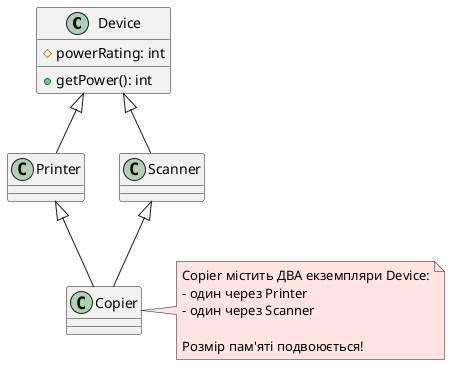
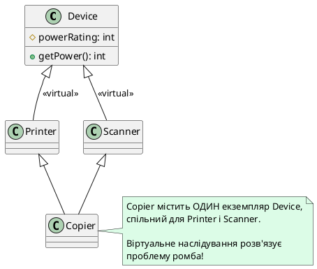
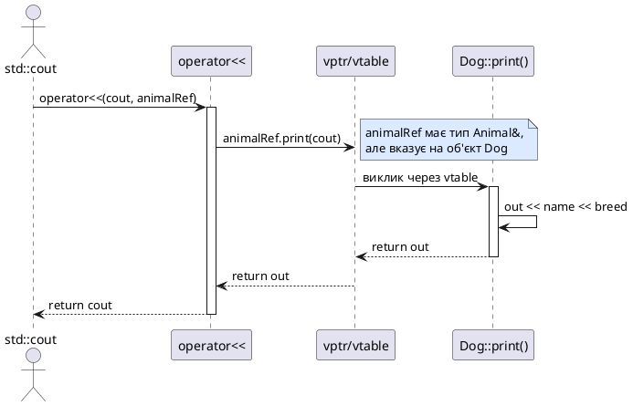

## Коли поліморфізм перестає працювати

У попередніх статтях ми опанували віртуальні функції та поліморфізм — механізми, що дозволяють викликати правильний метод похідного класу через покажчик або посилання на базовий клас. Це працює елегантно та безпечно, якщо дотримуватися правил. Але що станеться, якщо ми порушимо головне правило поліморфізму — **завжди працювати через покажчики або посилання**?

```cpp [PolymorphismBreak.cpp]
#include <iostream>

class Animal
{
protected:
    std::string name;

public:
    Animal(std::string n) : name(n) {}
    
    virtual std::string speak() const
    {
        return name + " видає звук";
    }
};

class Dog : public Animal
{
private:
    std::string breed;

public:
    Dog(std::string n, std::string b) : Animal(n), breed(b) {}
    
    std::string speak() const override
    {
        return name + " (" + breed + ") гавкає: Гав-гав!";
    }
};

// ❌ Функція приймає Animal ЗА ЗНАЧЕННЯМ
void printAnimalSound(Animal animal)
{
    std::cout << animal.speak() << "\n";
}

int main()
{
    Dog dog("Рекс", "німецька вівчарка");
    
    // Передаємо Dog у функцію, що очікує Animal за значенням
    printAnimalSound(dog);
    
    return 0;
}
```

Очікуваний результат: `Рекс (німецька вівчарка) гавкає: Гав-гав!`

Фактичний результат:

::terminal-preview{title="./PolymorphismBreak"}
<div class="line">Рекс видає звук</div>
::

Що сталося? Чому собака перестала гавкати і породу втратила? Гавкіт зник, порода стерлася, об'єкт `Dog` **перетворився на примітивного предка** `Animal`. Це не помилка компілятора — це **зрізка об'єктів** (*object slicing*), один із найпідступніших дефектів C++, що часто залишається непоміченим до моменту виникнення серйозних проблем у production.

У цій статті ми детально розберемо механізм зрізки, дослідимо віртуальне базове наслідування як остаточне розв'язання проблеми ромба та опануємо патерн поліморфного виводу у потоки через делегування `operator<<` віртуальному методу.

::card-group

::card{title="🎯 Мета статті" icon="i-lucide-target"}

- Зрозуміти фізичну природу зрізки об'єктів: що відбувається в пам'яті при копіюванні за значенням
- Навчитися виявляти та запобігати зрізці через передачу за посиланням або покажчиком
- Опанувати віртуальне базове наслідування (`virtual public Base`) для розв'язання проблеми ромба
- Дослідити обов'язок найбільш похідного класу (*most derived class*) ініціалізувати віртуальну базу
- Реалізувати патерн поліморфного виводу: невіртуальний `operator<<` + віртуальний `print(std::ostream&)`

::

::card{title="🔑 Ключові терміни" icon="i-lucide-key"}

- **Зрізка об'єктів** (*object slicing*): втрата даних похідного класу при копіюванні об'єкта в базовий тип за значенням
- **Віртуальне базове наслідування** (*virtual base inheritance*): ключове слово `virtual` у списку наслідування для створення спільного екземпляра базового класу
- **Найбільш похідний клас** (*most derived class*): «нижній» клас у ієрархії наслідування, що безпосередньо створюється
- **Проблема ромба** (*diamond problem*): дублювання полів спільного предка при множинному наслідуванні через проміжні класи
- **Поліморфний вивід** (*polymorphic output*): делегування виводу об'єкта в потік через віртуальний метод для збереження поліморфної поведінки

::

::

## Зрізка об'єктів: анатомія втрати даних

### Що відбувається в пам'яті

**Зрізка об'єктів** (*object slicing*) — це фізична втрата частини об'єкта при копіюванні об'єкта похідного класу в змінну базового типу **за значенням**. Коли компілятор виконує таке копіювання, він:

1. Виділяє пам'ять розміру **базового класу** (менший блок)
2. Копіює лише **базову частину** похідного об'єкта
3. **Відсікає** (*slices off*) всі додаткові поля та переписує вказівник віртуальної таблиці (vptr)

Подивимося на це під мікроскопом:

```cpp [SlicingMemory.cpp]
#include <iostream>

class Base
{
protected:
    int baseData;

public:
    Base(int data) : baseData(data)
    {
        std::cout << "Base конструктор: baseData = " << baseData << "\n";
    }
    
    virtual void display() const
    {
        std::cout << "[Base] baseData = " << baseData << "\n";
    }
    
    virtual ~Base() = default;
};

class Derived : public Base
{
private:
    int derivedData;
    double extraValue;

public:
    Derived(int base, int derived, double extra)
        : Base(base), derivedData(derived), extraValue(extra)
    {
        std::cout << "Derived конструктор: derivedData = " << derivedData 
                  << ", extraValue = " << extraValue << "\n";
    }
    
    void display() const override
    {
        std::cout << "[Derived] baseData = " << baseData 
                  << ", derivedData = " << derivedData 
                  << ", extraValue = " << extraValue << "\n";
    }
};

int main()
{
    std::cout << "=== Створення об'єкта Derived ===\n";
    Derived derived(10, 20, 3.14);
    
    std::cout << "\n=== Виклик через посилання (правильно) ===\n";
    Base& refBase = derived;
    refBase.display();  // ✅ Поліморфізм працює
    
    std::cout << "\n=== Присвоєння за значенням (зрізка!) ===\n";
    Base slicedBase = derived;  // ❌ Зрізка об'єкта
    slicedBase.display();  // Викличеться Base::display()
    
    std::cout << "\nРозмір Base:    " << sizeof(Base) << " байт\n";
    std::cout << "Розмір Derived: " << sizeof(Derived) << " байт\n";
    
    return 0;
}
```

::terminal-preview{title="./SlicingMemory"}
<div class="line">=== Створення об'єкта Derived ===</div>
<div class="line">Base конструктор: baseData = 10</div>
<div class="line">Derived конструктор: derivedData = 20, extraValue = 3.14</div>
<div class="line"></div>
<div class="line">=== Виклик через посилання (правильно) ===</div>
<div class="line">[Derived] baseData = 10, derivedData = 20, extraValue = 3.14</div>
<div class="line"></div>
<div class="line">=== Присвоєння за значенням (зрізка!) ===</div>
<div class="line">Base конструктор: baseData = 10</div>
<div class="line">[Base] baseData = 10</div>
<div class="line"></div>
<div class="line">Розмір Base:    16 байт</div>
<div class="line">Розмір Derived: 32 байт</div>
::

**Що ми бачимо:**

1. Об'єкт `Derived` займає **32 байти** (8 байт vptr + 4 байт `baseData` + вирівнювання + 4 байт `derivedData` + 8 байт `double extraValue`)
2. Об'єкт `Base` займає лише **16 байт** (8 байт vptr + 4 байт `baseData` + вирівнювання)
3. При копіюванні `derived` у `slicedBase` **половина даних фізично втрачається** — `derivedData` та `extraValue` відсікаються
4. Вказівник віртуальної таблиці (vptr) перезаписується: замість вказування на vtable `Derived`, він тепер вказує на vtable `Base`

::memory-view{title="Пам'ять до і після зрізки" startAddress="0x00401000" :data="[0x10, 0x00, 0x00, 0x00, 0x0A, 0x00, 0x00, 0x00, 0x14, 0x00, 0x00, 0x00, 0x1F, 0x85, 0xEB, 0x51, 0xB8, 0x1E, 0x09, 0x40, 0x00, 0x00, 0x00, 0x00, 0x0A, 0x00, 0x00, 0x00, 0x00, 0x00, 0x00, 0x00]" :highlight="[0, 1, 2, 3, 4, 5, 6, 7, 8, 9, 10, 11, 12, 13, 14, 15]"}
::

У цьому дампі пам'яті перші 16 байтів (виділені) — це те, що залишилося в `slicedBase`. Решта даних (байти 16–31) існували лише в оригінальному об'єкті `derived` і були втрачені при копіюванні.

::warning
**Зрізка — це не помилка компіляції**: компілятор C++ дозволяє присвоювати об'єкти похідних класів об'єктам базових класів. Це легальна операція з погляду мови, але вона призводить до втрати інформації та порушення поліморфізму. Компілятор навіть **не попередить** вас про зрізку — код скомпілюється без жодних попереджень.

::

### Коли відбувається зрізка

Зрізка відбувається у трьох основних сценаріях:

**1. Пряме присвоєння об'єктів**

```cpp
Derived derived(10, 20, 3.14);
Base base = derived;  // ❌ Зрізка: derived відсікається до Base
```

**2. Передача параметра за значенням**

```cpp
void processAnimal(Animal animal)  // ❌ Параметр за значенням
{
    animal.speak();  // Завжди викликається Animal::speak()
}

Dog dog("Рекс", "лабрадор");
processAnimal(dog);  // Зрізка при копіюванні dog → animal
```

**3. Повернення з функції за значенням (рідко)**

```cpp
Base createDerived()
{
    Derived d(10, 20, 3.14);
    return d;  // ❌ Зрізка при поверненні
}
```

::note
**Оптимізація RVO/NRVO**: сучасні компілятори застосовують Return Value Optimization (RVO) та Named Return Value Optimization (NRVO), які елімінують копіювання при поверненні з функції. Але навіть з цими оптимізаціями тип повернення `Base` означає, що об'єкт **конструюється** як `Base`, тому частина `Derived` ніколи не існуватиме.

::

### Зрізка та контейнери STL

Особливо підступна зрізка проявляється при роботі з контейнерами стандартної бібліотеки. Початківці часто намагаються зберігати поліморфні об'єкти у `std::vector` за значенням:

```cpp [SlicingVector.cpp]
#include <iostream>
#include <vector>

class Shape
{
public:
    virtual std::string getType() const { return "Shape"; }
    virtual ~Shape() = default;
};

class Circle : public Shape
{
public:
    std::string getType() const override { return "Circle"; }
};

class Rectangle : public Shape
{
public:
    std::string getType() const override { return "Rectangle"; }
};

int main()
{
    std::vector<Shape> shapes;  // ❌ Вектор зберігає Shape за значенням
    
    shapes.push_back(Circle());     // Зрізка: Circle → Shape
    shapes.push_back(Rectangle());  // Зрізка: Rectangle → Shape
    
    for (const Shape& shape : shapes) {
        std::cout << shape.getType() << "\n";  // Завжди виводить "Shape"
    }
    
    return 0;
}
```

::terminal-preview{title="./SlicingVector"}
<div class="line">Shape</div>
<div class="line">Shape</div>
::

**Проблема**: `std::vector<Shape>` зберігає об'єкти **за значенням**. Коли ми викликаємо `push_back(Circle())`, вектор виділяє пам'ять розміру `sizeof(Shape)` і копіює лише базову частину.

**Розв'язання**: використовуйте вектор **покажчиків**:

```cpp [VectorPointers.cpp]
std::vector<Shape*> shapes;

shapes.push_back(new Circle());
shapes.push_back(new Rectangle());

for (const Shape* shape : shapes) {
    std::cout << shape->getType() << "\n";  // ✅ Поліморфізм працює
}

// Обов'язкове очищення
for (Shape* shape : shapes) {
    delete shape;
}
```

::terminal-preview{title="./VectorPointers"}
<div class="line">Circle</div>
<div class="line">Rectangle</div>
::

Або, краще, використовуйте **розумні покажчики** (детальніше у статтях про move-семантику):

```cpp
std::vector<std::unique_ptr<Shape>> shapes;

shapes.push_back(std::make_unique<Circle>());
shapes.push_back(std::make_unique<Rectangle>());

for (const auto& shape : shapes) {
    std::cout << shape->getType() << "\n";  // ✅ Безпечно і без витоків пам'яті
}
```


## Захист від зрізки: правила безпечного поліморфізму

### Передача за посиланням або покажчиком

**Золоте правило поліморфізму**: ніколи не передавайте поліморфні об'єкти за значенням. Завжди використовуйте **посилання** (`const T&`) або **покажчики** (`T*`).

::code-group

```cpp [❌ Зрізка (неправильно)]
void processShape(Shape shape)  // Параметр за значенням
{
    std::cout << shape.getType() << "\n";
}

Circle circle;
processShape(circle);  // Зрізка: Circle → Shape
// Виведе "Shape" замість "Circle"
```

```cpp [✅ Посилання (правильно)]
void processShape(const Shape& shape)  // Параметр за посиланням
{
    std::cout << shape.getType() << "\n";
}

Circle circle;
processShape(circle);  // ✅ Поліморфізм працює
// Виведе "Circle"
```

```cpp [✅ Покажчик (правильно)]
void processShape(const Shape* shape)  // Параметр-покажчик
{
    if (shape) {  // Перевірка на nullptr
        std::cout << shape->getType() << "\n";
    }
}

Circle circle;
processShape(&circle);  // ✅ Поліморфізм працює
// Виведе "Circle"
```

::

**Переваги посилання над покажчиком:**
- Не потребує перевірки на `nullptr` (посилання завжди валідні)
- Синтаксис виклику методів простіший (`.` замість `->`)
- Неможливо випадково переприсвоїти (`const` посилання)

**Переваги покажчика над посиланням:**
- Можна передати `nullptr` для позначення «відсутність об'єкта»
- Можна змінювати, на що вказує покажчик (без `const`)
- Явність: одразу видно, що це не копія

### Заборона копіювання базового класу

Якщо ваш базовий клас призначений виключно для поліморфізму і ніколи не повинен копіюватися, **заборoніть копіювання** через `= delete`:

```cpp [NoCopyBase.cpp]
#include <iostream>

class Shape
{
public:
    // Заборона конструктора копіювання
    Shape(const Shape&) = delete;
    
    // Заборона оператора присвоювання
    Shape& operator=(const Shape&) = delete;
    
    // Віртуальний деструктор обов'язковий
    virtual ~Shape() = default;
    
    virtual std::string getType() const = 0;

protected:
    // Дозволити похідним класам викликати дефолтний конструктор
    Shape() = default;
};

class Circle : public Shape
{
public:
    std::string getType() const override { return "Circle"; }
};

int main()
{
    Circle c1;
    
    // ❌ Помилка компіляції: копіювання заборонене
    // Shape shape = c1;
    
    // ✅ Посилання та покажчики дозволені
    Shape& ref = c1;
    Shape* ptr = &c1;
    
    std::cout << ref.getType() << "\n";
    std::cout << ptr->getType() << "\n";
    
    return 0;
}
```

::terminal-preview{title="./NoCopyBase"}
<div class="line">Circle</div>
<div class="line">Circle</div>
::

Спроба скомпілювати `Shape shape = c1;` призведе до помилки:

```
error: use of deleted function 'Shape::Shape(const Shape&)'
note: declared here: Shape(const Shape&) = delete
```

Це **компіляційний захист** від зрізки — найкращий вид захисту.

::tip
**Правило Effective C++**: якщо клас призначений для наслідування та містить віртуальні функції, зробіть його копіювання або забороненим (`= delete`), або захищеним (`protected`). Це запобігає випадковій зрізці на етапі компіляції.

::

## Віртуальне базове наслідування: остаточне розв'язання проблеми ромба

### Проблема дублювання спільного предка

У статті 74 ми розглянули множинне наслідування та проблему ромба (*diamond problem*): коли клас наслідує від двох класів, що мають спільного предка, виникає **дублювання полів** предка.

Пригадаємо класичний приклад:

```cpp [DiamondProblem.cpp]
#include <iostream>

class Device
{
protected:
    int powerRating;

public:
    Device(int power) : powerRating(power)
    {
        std::cout << "Device конструктор: power = " << power << "\n";
    }
    
    int getPower() const { return powerRating; }
};

class Printer : public Device
{
public:
    Printer(int power) : Device(power)
    {
        std::cout << "Printer конструктор\n";
    }
};

class Scanner : public Device
{
public:
    Scanner(int power) : Device(power)
    {
        std::cout << "Scanner конструктор\n";
    }
};

class Copier : public Printer, public Scanner
{
public:
    Copier(int printerPower, int scannerPower)
        : Printer(printerPower), Scanner(scannerPower)
    {
        std::cout << "Copier конструктор\n";
    }
};

int main()
{
    Copier copier(100, 50);
    
    // ❌ Помилка компіляції: неоднозначність
    // std::cout << copier.getPower();
    
    // Потрібна явна кваліфікація
    std::cout << "Printer power: " << copier.Printer::getPower() << "\n";
    std::cout << "Scanner power: " << copier.Scanner::getPower() << "\n";
    
    return 0;
}
```

::terminal-preview{title="./DiamondProblem"}
<div class="line">Device конструктор: power = 100</div>
<div class="line">Printer конструктор</div>
<div class="line">Device конструктор: power = 50</div>
<div class="line">Scanner конструктор</div>
<div class="line">Copier конструктор</div>
<div class="line">Printer power: 100</div>
<div class="line">Scanner power: 50</div>
::

**Проблеми:**

1. **Дублювання в пам'яті**: `Copier` містить **два окремих екземпляри** `Device` — один через `Printer`, другий через `Scanner`
2. **Неоднозначність**: виклик `copier.getPower()` не компілюється — компілятор не знає, який `getPower()` викликати
3. **Логічна неузгодженість**: копіювальний пристрій фізично має два різних значення `powerRating`, хоча логічно має бути лише один

::plant-uml{alt="Проблема ромба: дублювання Device"}



::

### Віртуальне наслідування: спільний екземпляр предка

**Віртуальне базове наслідування** (*virtual base inheritance*) — це механізм, що змушує проміжні класи (`Printer`, `Scanner`) спільно використовувати **єдиний екземпляр** базового класу (`Device`). Синтаксис: додати ключове слово `virtual` у специфікатор наслідування:

```cpp [VirtualBaseInheritance.cpp]
#include <iostream>

class Device
{
protected:
    int powerRating;

public:
    Device(int power) : powerRating(power)
    {
        std::cout << "Device конструктор: power = " << power << "\n";
    }
    
    int getPower() const { return powerRating; }
};

// virtual public Device — віртуальне наслідування
class Printer : virtual public Device
{
public:
    Printer(int power) : Device(power)
    {
        std::cout << "Printer конструктор\n";
    }
};

// virtual public Device — віртуальне наслідування
class Scanner : virtual public Device
{
public:
    Scanner(int power) : Device(power)
    {
        std::cout << "Scanner конструктор\n";
    }
};

class Copier : public Printer, public Scanner
{
public:
    // Найбільш похідний клас викликає конструктор віртуальної бази напряму
    Copier(int power)
        : Device(power),           // ✅ Copier відповідає за Device
          Printer(power),          // Цей виклик ігнорується
          Scanner(power)           // Цей виклик ігнорується
    {
        std::cout << "Copier конструктор\n";
    }
};

int main()
{
    Copier copier(120);
    
    // ✅ Тепер немає неоднозначності — Device існує в одному екземплярі
    std::cout << "Power: " << copier.getPower() << "\n";
    
    std::cout << "\nРозмір Copier: " << sizeof(Copier) << " байт\n";
    
    return 0;
}
```

::terminal-preview{title="./VirtualBaseInheritance"}
<div class="line">Device конструктор: power = 120</div>
<div class="line">Printer конструктор</div>
<div class="line">Scanner конструктор</div>
<div class="line">Copier конструктор</div>
<div class="line">Power: 120</div>
<div class="line"></div>
<div class="line">Розмір Copier: 40 байт</div>
::

**Ключові зміни:**

1. **`virtual public Device`** у `Printer` та `Scanner` — позначає віртуальне наслідування
2. **`Device` створюється лише один раз** — зверніть увагу, що `Device конструктор` виводиться лише один раз
3. **Neм неоднозначності** — `copier.getPower()` працює без явної кваліфікації
4. **Розмір пам'яті менший** — лише один екземпляр `Device` замість двох

::plant-uml{alt="Віртуальне наслідування: спільний Device"}



::

### Порядок конструювання віртуальних баз

**Найважливіше правило**: віртуальні базові класи завжди конструюються **першими**, ще до невіртуальних базових класів. Це гарантує, що спільний предок існує до того, як почнуть конструюватися класи, що від нього залежать.

Порядок конструювання для `Copier`:

1. **Віртуальна база `Device`** — конструюється найпершою
2. **Невіртуальна база `Printer`** — конструюється другою (виклик `Device(power)` ігнорується)
3. **Невіртуальна база `Scanner`** — конструюється третьою (виклик `Device(power)` ігнорується)
4. **Сам `Copier`** — конструюється останнім

::debugger-view{title="Call Stack під час конструювання Copier" :variables='[{"name": "phase", "type": "string", "value": "\"Constructing Device (virtual base)\""}, {"name": "powerRating", "type": "int", "value": "120"}, {"name": "next", "type": "string", "value": "\"Printer → Scanner → Copier\""}]'}
::

### Обов'язок найбільш похідного класу

**Найбільш похідний клас** (*most derived class*) — це клас на «дні» ієрархії наслідування, об'єкт якого безпосередньо створюється. У нашому прикладі це `Copier`.

Ключова відмінність віртуального наслідування: **відповідальність за ініціалізацію віртуальної бази лежить на найбільш похідному класі**. Це означає:

- `Copier` **зобов'язаний** викликати `Device(power)` напряму у списку ініціалізації
- Виклики `Device(power)` у `Printer` та `Scanner` **ігноруються** при створенні `Copier`
- Але ці виклики **активуються** при створенні `Printer` або `Scanner` самостійно

```cpp [MostDerivedClass.cpp]
int main()
{
    std::cout << "=== Створення Copier ===\n";
    Copier copier(120);
    // Device конструюється з 120 (викликається з Copier)
    
    std::cout << "\n=== Створення Printer окремо ===\n";
    Printer printer(80);
    // Device конструюється з 80 (викликається з Printer)
    
    std::cout << "\n=== Створення Scanner окремо ===\n";
    Scanner scanner(60);
    // Device конструюється з 60 (викликається з Scanner)
    
    return 0;
}
```

::terminal-preview{title="./MostDerivedClass"}
<div class="line">=== Створення Copier ===</div>
<div class="line">Device конструктор: power = 120</div>
<div class="line">Printer конструктор</div>
<div class="line">Scanner конструктор</div>
<div class="line">Copier конструктор</div>
<div class="line"></div>
<div class="line">=== Створення Printer окремо ===</div>
<div class="line">Device конструктор: power = 80</div>
<div class="line">Printer конструктор</div>
<div class="line"></div>
<div class="line">=== Створення Scanner окремо ===</div>
<div class="line">Device конструктор: power = 60</div>
<div class="line">Scanner конструктор</div>
::

Це **динамічна семантика**: залежно від того, який клас є найбільш похідним у конкретному контексті, активується відповідний виклик конструктора віртуальної бази.

::warning
**Типова помилка**: забути викликати конструктор віртуальної бази у найбільш похідному класі. Якщо `Copier` не викликає `Device(power)` у списку ініціалізації, компілятор спробує викликати **дефолтний конструктор** `Device()`. Якщо такого конструктора не існує, виникне помилка компіляції.

::


## Поліморфний вивід у потоки: делегування через віртуальний метод

### Проблема невіртуального `operator<<`

У статті 63 ми навчилися перевантажувати `operator<<` для виводу об'єктів класів у потік `std::cout`. Але виникає проблема: як поєднати перевантаження операторів із поліморфізмом?

Спроба перевизначити `operator<<` у похідному класі не працює:

```cpp [NonVirtualOperator.cpp]
#include <iostream>

class Animal
{
public:
    virtual std::string getName() const { return "Animal"; }
    
    // Перевантаження operator<< як дружня функція
    friend std::ostream& operator<<(std::ostream& out, const Animal& animal)
    {
        out << "Я " << animal.getName();
        return out;
    }
    
    virtual ~Animal() = default;
};

class Dog : public Animal
{
public:
    std::string getName() const override { return "Dog"; }
    
    // Спроба "перевизначити" operator<<
    friend std::ostream& operator<<(std::ostream& out, const Dog& dog)
    {
        out << "Я " << dog.getName() << " і гавкаю!";
        return out;
    }
};

int main()
{
    Dog dog;
    Animal& animalRef = dog;
    
    std::cout << dog << "\n";        // Виклик Dog::operator<<
    std::cout << animalRef << "\n";  // ❌ Виклик Animal::operator<<
    
    return 0;
}
```

::terminal-preview{title="./NonVirtualOperator"}
<div class="line">Я Dog і гавкаю!</div>
<div class="line">Я Dog</div>
::

**Проблема**: другий рядок виводу **не викликає** `Dog::operator<<`, хоча `animalRef` фактично посилається на `Dog`. Чому?

**Причини:**

1. **Оператори не можуть бути віртуальними методами**: перевантаження операторів зазвичай реалізуються як **дружні функції**, які не є методами класу. Лише методи можуть бути віртуальними.

2. **Різні сигнатури**: `Animal::operator<<` приймає `const Animal&`, а `Dog::operator<<` приймає `const Dog&`. Це **перевантаження** (*overloading*), а не **перевизначення** (*overriding*). Перевизначення вимагає однакових сигнатур.

3. **Вибір на етапі компіляції**: компілятор обирає версію `operator<<` на основі **типу посилання** (`Animal&`), а не фактичного типу об'єкта (`Dog`). Це статичне зв'язування, а не динамічне.

::note
**Теоретична можливість**: технічно можна зробити `operator<<` методом класу, але це порушує ідіоматичний C++ код. Стандартний підхід — дружня функція з лівим операндом `std::ostream&`. Таку функцію неможливо зробити віртуальною.

::

### Патерн: делегування віртуальному методу `print()`

**Рішення** полягає у розділенні відповідальностей:

1. **Невіртуальна** дружня функція `operator<<` — обробляє взаємодію з потоком
2. **Віртуальний** метод `print(std::ostream& out)` — виконує фактичний вивід даних

Оператор `<<` **делегує** роботу віртуальному методу `print()`, який вже коректно перевизначається у похідних класах:

```cpp [PolymorphicOutput.cpp]
#include <iostream>
#include <string>

class Animal
{
protected:
    std::string name;

public:
    Animal(std::string n) : name(n) {}
    
    virtual ~Animal() = default;
    
    // Невіртуальний оператор виводу — делегує роботу print()
    friend std::ostream& operator<<(std::ostream& out, const Animal& animal)
    {
        return animal.print(out);  // Делегування віртуальному методу
    }
    
    // Віртуальний метод print() — перевизначається у похідних класах
    virtual std::ostream& print(std::ostream& out) const
    {
        out << name << " (Animal)";
        return out;
    }
};

class Dog : public Animal
{
private:
    std::string breed;

public:
    Dog(std::string n, std::string b) : Animal(n), breed(b) {}
    
    // Перевизначення віртуального методу print()
    std::ostream& print(std::ostream& out) const override
    {
        out << name << " (" << breed << ", Dog)";
        return out;
    }
};

class Cat : public Animal
{
private:
    int lives;

public:
    Cat(std::string n, int l) : Animal(n), lives(l) {}
    
    std::ostream& print(std::ostream& out) const override
    {
        out << name << " (Cat із " << lives << " життями)";
        return out;
    }
};

int main()
{
    Dog dog("Рекс", "німецька вівчарка");
    Cat cat("Мурчик", 9);
    
    // Прямий вивід — працює очевидно
    std::cout << "Прямий вивід:\n";
    std::cout << "  " << dog << "\n";
    std::cout << "  " << cat << "\n\n";
    
    // Поліморфний вивід через посилання на базовий клас
    std::cout << "Поліморфний вивід:\n";
    Animal& animalRef1 = dog;
    Animal& animalRef2 = cat;
    
    std::cout << "  " << animalRef1 << "\n";  // ✅ Викликає Dog::print()
    std::cout << "  " << animalRef2 << "\n";  // ✅ Викликає Cat::print()
    
    return 0;
}
```

::terminal-preview{title="./PolymorphicOutput"}
<div class="line">Прямий вивід:</div>
<div class="line">  Рекс (німецька вівчарка, Dog)</div>
<div class="line">  Мурчик (Cat із 9 життями)</div>
<div class="line"></div>
<div class="line">Поліморфний вивід:</div>
<div class="line">  Рекс (німецька вівчарка, Dog)</div>
<div class="line">  Мурчик (Cat із 9 життями)</div>
::

**Як це працює:**

1. **Виклик `std::cout << animalRef1`**:
   - Компілятор знаходить `operator<<(std::ostream&, const Animal&)` — єдина версія для всієї ієрархії
   - Оператор викликає `animal.print(out)` — посилання `animal` має тип `Animal&`, але фактично вказує на `Dog`

2. **Віртуальний виклик `animal.print(out)`**:
   - Компілятор перевіряє vptr об'єкта `dog`
   - Знаходить `Dog::print()` у віртуальній таблиці
   - Викликає `Dog::print()`, а не `Animal::print()`

3. **Повернення потоку**:
   - `Dog::print()` повертає `std::ostream&`
   - Оператор `<<` повертає той самий потік
   - Це дозволяє ланцюговий вивід: `std::cout << a << b << c`

::plant-uml{alt="Делегування operator<< віртуальному print()"}



::

### Переваги патерну делегування

::card-group

::card{title="✅ Єдина версія operator<<" icon="i-lucide-check"}

Не потрібно писати `operator<<` в кожному похідному класі. Одна дружня функція в базовому класі працює для всієї ієрархії.

::

::card{title="✅ Повний поліморфізм" icon="i-lucide-check"}

Вивід через `Animal&` або `Animal*` автоматично викликає правильну версію `print()` залежно від фактичного типу об'єкта.

::

::card{title="✅ Підтримка ланцюгових операцій" icon="i-lucide-check"}

Повернення `std::ostream&` дозволяє писати `std::cout << obj1 << " text " << obj2`.

::

::card{title="✅ Консистентність з STL" icon="i-lucide-check"}

Патерн узгоджується зі стандартним способом виводу об'єктів у потоки C++ (як `std::string`, `std::vector` тощо).

::

::

::tip
**Правило проєктування**: якщо ваша ієрархія класів потребує поліморфного виводу, завжди використовуйте патерн «невіртуальний `operator<<` + віртуальний `print()`». Це стандартна ідіома C++, яку застосовують у промисловому коді та стандартній бібліотеці (наприклад, `std::exception::what()`).

::

### Комбінування з базовою реалізацією

Часто похідний клас хоче **доповнити**, а не **замінити** вивід базового класу. Для цього можна викликати `Base::print()` з похідного методу:

```cpp [InheritedPrint.cpp]
class Employee
{
protected:
    std::string name;
    int id;

public:
    Employee(std::string n, int i) : name(n), id(i) {}
    
    virtual ~Employee() = default;
    
    friend std::ostream& operator<<(std::ostream& out, const Employee& emp)
    {
        return emp.print(out);
    }
    
    virtual std::ostream& print(std::ostream& out) const
    {
        out << "[ID: " << id << "] " << name;
        return out;
    }
};

class Manager : public Employee
{
private:
    int teamSize;

public:
    Manager(std::string n, int i, int size)
        : Employee(n, i), teamSize(size) {}
    
    std::ostream& print(std::ostream& out) const override
    {
        Employee::print(out);  // Виклик базової версії
        out << ", Team: " << teamSize << " осіб";
        return out;
    }
};

int main()
{
    Manager manager("Олена Коваль", 101, 8);
    
    Employee& empRef = manager;
    std::cout << empRef << "\n";
    
    return 0;
}
```

::terminal-preview{title="./InheritedPrint"}
<div class="line">[ID: 101] Олена Коваль, Team: 8 осіб</div>
::

Виклик `Employee::print(out)` дозволяє уникнути дублювання коду — базовий клас відповідає за вивід своїх полів, похідний додає лише специфічну інформацію.


## Практичні завдання

::::accordion

:::accordion-item{label="📋 Завдання 1: Виявлення та виправлення зрізки" icon="i-lucide-clipboard-list"}

Наведений нижче код містить зрізку об'єктів. Знайдіть проблему та виправте її **трьома способами**:

1. Передачею за посиланням
2. Використанням покажчиків
3. Забороною копіювання базового класу

```cpp
#include <iostream>
#include <string>

class Vehicle
{
protected:
    std::string brand;
    int year;

public:
    Vehicle(std::string b, int y) : brand(b), year(y) {}
    
    virtual std::string getInfo() const
    {
        return brand + " (" + std::to_string(year) + ")";
    }
    
    virtual ~Vehicle() = default;
};

class Car : public Vehicle
{
private:
    int doors;

public:
    Car(std::string b, int y, int d) : Vehicle(b, y), doors(d) {}
    
    std::string getInfo() const override
    {
        return brand + " (" + std::to_string(year) + "), " 
               + std::to_string(doors) + " дверей";
    }
};

// ❌ Проблемна функція
void displayVehicle(Vehicle vehicle)
{
    std::cout << vehicle.getInfo() << "\n";
}

int main()
{
    Car car("Toyota", 2023, 4);
    displayVehicle(car);  // Зрізка!
    
    return 0;
}
```

**Вимоги:**
- Виправте код трьома різними способами
- Кожен спосіб має виводити повну інформацію про автомобіль з кількістю дверей

:::

:::accordion-item{label="✅ Розв'язок завдання 1" icon="i-lucide-check-circle"}

**Спосіб 1: Передача за посиланням**

```cpp
// ✅ Виправлення: const посилання
void displayVehicle(const Vehicle& vehicle)
{
    std::cout << vehicle.getInfo() << "\n";
}

int main()
{
    Car car("Toyota", 2023, 4);
    displayVehicle(car);  // ✅ Поліморфізм працює
    
    return 0;
}
```

**Спосіб 2: Використання покажчиків**

```cpp
// ✅ Виправлення: покажчик
void displayVehicle(const Vehicle* vehicle)
{
    if (vehicle) {
        std::cout << vehicle->getInfo() << "\n";
    }
}

int main()
{
    Car car("Toyota", 2023, 4);
    displayVehicle(&car);  // ✅ Поліморфізм працює
    
    return 0;
}
```

**Спосіб 3: Заборона копіювання**

```cpp
class Vehicle
{
protected:
    std::string brand;
    int year;

public:
    Vehicle(std::string b, int y) : brand(b), year(y) {}
    
    // ✅ Заборона копіювання
    Vehicle(const Vehicle&) = delete;
    Vehicle& operator=(const Vehicle&) = delete;
    
    virtual std::string getInfo() const
    {
        return brand + " (" + std::to_string(year) + ")";
    }
    
    virtual ~Vehicle() = default;
};

// Функція залишається з параметром за посиланням
void displayVehicle(const Vehicle& vehicle)
{
    std::cout << vehicle.getInfo() << "\n";
}

int main()
{
    Car car("Toyota", 2023, 4);
    
    // ✅ Працює з посиланням
    displayVehicle(car);
    
    // ❌ Помилка компіляції при спробі копіювання
    // Vehicle v = car;
    
    return 0;
}
```

::terminal-preview{title="./VehicleFixed"}
<div class="line">Toyota (2023), 4 дверей</div>
::

:::

:::accordion-item{label="📋 Завдання 2: Віртуальне наслідування" icon="i-lucide-clipboard-list"}

Реалізуйте систему електронних пристроїв з використанням віртуального наслідування для розв'язання проблеми ромба:

1. Базовий клас `ElectronicDevice`:
   - Поле: `powerConsumption` (споживання енергії у ватах)
   - Метод: `getPowerInfo()` — повертає рядок з інформацією про споживання

2. Проміжні класи:
   - `NetworkDevice` — має метод `connect(std::string network)`
   - `StorageDevice` — має метод `store(std::string data)`

3. Кінцевий клас `SmartTV`:
   - Наслідує обидва проміжні класи
   - Має метод `playVideo(std::string url)`, що використовує і мережу, і накопичувач

**Вимоги:**
- Використовуйте віртуальне наслідування
- `SmartTV` має ініціалізувати `ElectronicDevice` напряму
- Продемонструйте відсутність дублювання полів

:::

:::accordion-item{label="✅ Розв'язок завдання 2" icon="i-lucide-check-circle"}

```cpp
#include <iostream>
#include <string>

class ElectronicDevice
{
protected:
    int powerConsumption;

public:
    ElectronicDevice(int power) : powerConsumption(power)
    {
        std::cout << "ElectronicDevice конструктор: " << power << "W\n";
    }
    
    std::string getPowerInfo() const
    {
        return "Споживання: " + std::to_string(powerConsumption) + "W";
    }
    
    virtual ~ElectronicDevice() = default;
};

// Віртуальне наслідування
class NetworkDevice : virtual public ElectronicDevice
{
public:
    NetworkDevice(int power) : ElectronicDevice(power)
    {
        std::cout << "NetworkDevice конструктор\n";
    }
    
    void connect(std::string network)
    {
        std::cout << "Підключення до мережі: " << network << "\n";
    }
};

// Віртуальне наслідування
class StorageDevice : virtual public ElectronicDevice
{
public:
    StorageDevice(int power) : ElectronicDevice(power)
    {
        std::cout << "StorageDevice конструктор\n";
    }
    
    void store(std::string data)
    {
        std::cout << "Збереження даних: " << data << "\n";
    }
};

class SmartTV : public NetworkDevice, public StorageDevice
{
private:
    std::string model;

public:
    // Найбільш похідний клас ініціалізує віртуальну базу
    SmartTV(std::string m, int power)
        : ElectronicDevice(power),  // ✅ Пряма ініціалізація віртуальної бази
          NetworkDevice(power),     // Ігнорується при створенні SmartTV
          StorageDevice(power),     // Ігнорується при створенні SmartTV
          model(m)
    {
        std::cout << "SmartTV конструктор: " << model << "\n";
    }
    
    void playVideo(std::string url)
    {
        std::cout << "\n=== Відтворення відео: " << url << " ===\n";
        connect("WiFi Home");
        store("Кеш відео");
        std::cout << getPowerInfo() << "\n";
        std::cout << "Відтворення розпочато на " << model << "\n";
    }
};

int main()
{
    std::cout << "Створення SmartTV:\n";
    SmartTV tv("Samsung QLED 55\"", 120);
    
    tv.playVideo("youtube.com/watch?v=example");
    
    std::cout << "\n✅ ElectronicDevice існує в одному екземплярі\n";
    std::cout << "Розмір SmartTV: " << sizeof(SmartTV) << " байт\n";
    
    return 0;
}
```

::terminal-preview{title="./SmartTV"}
<div class="line">Створення SmartTV:</div>
<div class="line">ElectronicDevice конструктор: 120W</div>
<div class="line">NetworkDevice конструктор</div>
<div class="line">StorageDevice конструктор</div>
<div class="line">SmartTV конструктор: Samsung QLED 55"</div>
<div class="line"></div>
<div class="line">=== Відтворення відео: youtube.com/watch?v=example ===</div>
<div class="line">Підключення до мережі: WiFi Home</div>
<div class="line">Збереження даних: Кеш відео</div>
<div class="line">Споживання: 120W</div>
<div class="line">Відтворення розпочато на Samsung QLED 55"</div>
<div class="line"></div>
<div class="line">✅ ElectronicDevice існує в одному екземплярі</div>
<div class="line">Розмір SmartTV: 56 байт</div>
::

:::

:::accordion-item{label="📋 Завдання 3: Поліморфний вивід" icon="i-lucide-clipboard-list"}

Реалізуйте ієрархію геометричних фігур із поліморфним виводом у потік:

1. Абстрактний базовий клас `Shape`:
   - Поле: `color` (колір фігури)
   - Чистий віртуальний метод: `getArea()` — площа
   - Віртуальний метод: `print(std::ostream&)` — вивід у потік
   - Дружня функція: `operator<<` — делегує роботу `print()`

2. Похідні класи:
   - `Circle` — радіус `radius`
   - `Rectangle` — ширина `width` та висота `height`
   - `Triangle` — основа `base` та висота `height`

3. Кожен похідний клас має виводити: `[Колір] Тип: площа = X`

**Вимоги:**
- Використовуйте патерн делегування `operator<<` → `print()`
- Базовий метод `print()` виводить колір, похідні додають специфічну інформацію
- Продемонструйте роботу через масив `Shape*`

:::

:::accordion-item{label="✅ Розв'язок завдання 3" icon="i-lucide-check-circle"}

```cpp
#include <iostream>
#include <string>
#include <vector>

class Shape
{
protected:
    std::string color;

public:
    Shape(std::string c) : color(c) {}
    
    virtual ~Shape() = default;
    
    // Невіртуальний оператор виводу — делегує print()
    friend std::ostream& operator<<(std::ostream& out, const Shape& shape)
    {
        return shape.print(out);
    }
    
    // Чистий віртуальний метод: площа
    virtual double getArea() const = 0;
    
    // Віртуальний метод print() — базова реалізація виводить колір
    virtual std::ostream& print(std::ostream& out) const
    {
        out << "[" << color << "] ";
        return out;
    }
};

class Circle : public Shape
{
private:
    double radius;

public:
    Circle(std::string c, double r) : Shape(c), radius(r) {}
    
    double getArea() const override
    {
        return 3.14159 * radius * radius;
    }
    
    std::ostream& print(std::ostream& out) const override
    {
        Shape::print(out);  // Виклик базової версії (колір)
        out << "Коло: площа = " << getArea();
        return out;
    }
};

class Rectangle : public Shape
{
private:
    double width, height;

public:
    Rectangle(std::string c, double w, double h)
        : Shape(c), width(w), height(h) {}
    
    double getArea() const override
    {
        return width * height;
    }
    
    std::ostream& print(std::ostream& out) const override
    {
        Shape::print(out);
        out << "Прямокутник: площа = " << getArea();
        return out;
    }
};

class Triangle : public Shape
{
private:
    double base, height;

public:
    Triangle(std::string c, double b, double h)
        : Shape(c), base(b), height(h) {}
    
    double getArea() const override
    {
        return 0.5 * base * height;
    }
    
    std::ostream& print(std::ostream& out) const override
    {
        Shape::print(out);
        out << "Трикутник: площа = " << getArea();
        return out;
    }
};

int main()
{
    std::vector<Shape*> shapes;
    
    shapes.push_back(new Circle("червоний", 5.0));
    shapes.push_back(new Rectangle("синій", 4.0, 6.0));
    shapes.push_back(new Triangle("зелений", 8.0, 3.0));
    
    std::cout << "=== Поліморфний вивід фігур ===\n";
    for (const Shape* shape : shapes) {
        std::cout << *shape << "\n";  // ✅ Викликає правильний print()
    }
    
    // Очищення пам'яті
    for (Shape* shape : shapes) {
        delete shape;
    }
    
    return 0;
}
```

::terminal-preview{title="./PolymorphicShapes"}
<div class="line">=== Поліморфний вивід фігур ===</div>
<div class="line">[червоний] Коло: площа = 78.5398</div>
<div class="line">[синій] Прямокутник: площа = 24</div>
<div class="line">[зелений] Трикутник: площа = 12</div>
::

:::

:::accordion-item{label="❓ Питання для самоперевірки" icon="i-lucide-help-circle"}

1. **Чому зрізка об'єктів не викликає помилки компіляції?**

   ::collapsible{title="Показати відповідь"}
   Зрізка — це легальна операція в C++. Компілятор дозволяє присвоювати об'єкти похідних класів об'єктам базових класів, оскільки це технічно коректне копіювання частини пам'яті. Проблема в тому, що втрачається семантика поліморфізму та дані похідного класу. Компілятор не видає попереджень, бо не знає ваших намірів — можливо, ви свідомо хочете копіювати лише базову частину.
   ::

2. **Чому віртуальний базовий клас ініціалізується найбільш похідним класом?**

   ::collapsible{title="Показати відповідь"}
   Якби проміжні класи (`Printer`, `Scanner`) ініціалізували віртуальну базу, виникла б неоднозначність: який параметр передати конструктору `Device` — від `Printer` чи від `Scanner`? Найбільш похідний клас (`Copier`) знає повний контекст і може прийняти єдине рішення про ініціалізацію спільного предка.
   ::

3. **Чому `operator<<` не може бути віртуальною функцією?**

   ::collapsible{title="Показати відповідь"}
   `operator<<` зазвичай реалізується як дружня функція (не метод класу), оскільки лівий операнд — це `std::ostream&`, а не об'єкт класу. Тільки методи можуть бути віртуальними. Крім того, версії `operator<<` для базового та похідного класів мають різні сигнатури (`Animal&` vs `Dog&`), тому це перевантаження, а не перевизначення.
   ::

4. **Що станеться, якщо забути викликати конструктор віртуальної бази у найбільш похідному класі?**

   ::collapsible{title="Показати відповідь"}
   Компілятор спробує викликати **дефолтний конструктор** віртуальної бази (`Device()`). Якщо такого конструктора не існує (наприклад, у `Device` є лише параметризований конструктор), виникне помилка компіляції: «no matching function for call to 'Device::Device()'».
   ::

5. **Чи можна використовувати `std::vector<Shape>` для зберігання поліморфних об'єктів?**

   ::collapsible{title="Показати відповідь"}
   Ні. `std::vector<Shape>` зберігає об'єкти **за значенням**, що призводить до зрізки при додаванні похідних класів. Потрібно використовувати `std::vector<Shape*>` або, краще, `std::vector<std::unique_ptr<Shape>>` для збереження поліморфної поведінки.
   ::

:::

::::

## Резюме

У цій статті ми дослідили три критичні аспекти поліморфізму в C++, що часто стають джерелом тонких помилок: **зрізку об'єктів**, **віртуальне базове наслідування** та **поліморфний вивід у потоки**.

::card-group

::card{title="✅ Зрізка об'єктів" icon="i-lucide-scissors"}

**Причина**: копіювання об'єкта похідного класу в змінну базового типу **за значенням**

**Наслідки**:
- Фізична втрата полів похідного класу
- Переписування vptr — порушення поліморфізму
- Виклик методів базового класу замість похідного

**Захист**:
- Завжди передавайте через `const T&` або `T*`
- Заборoніть копіювання базового класу (`= delete`)
- Використовуйте покажчики у контейнерах STL

::

::card{title="✅ Віртуальне базове наслідування" icon="i-lucide-share-2"}

**Проблема**: дублювання спільного предка при множинному наслідуванні (проблема ромба)

**Розв'язання**: `class Derived : virtual public Base`

**Ключові правила**:
- Віртуальна база конструюється **першою**
- **Найбільш похідний клас** відповідає за ініціалізацію
- Виклики конструктора у проміжних класах ігноруються
- Єдиний екземпляр бази для всієї ієрархії

::

::card{title="✅ Поліморфний вивід" icon="i-lucide-printer"}

**Проблема**: `operator<<` не може бути віртуальним

**Патерн делегування**:
1. Невіртуальна дружня функція `operator<<`
2. Віртуальний метод `print(std::ostream&)`
3. Оператор делегує роботу `print()`

**Переваги**:
- Єдина версія `operator<<` для всієї ієрархії
- Повний поліморфізм при виводі
- Підтримка ланцюгових операцій

::

::

::warning
**Типові помилки, яких слід уникати**:

1. **Передача поліморфних об'єктів за значенням** у функції — завжди призводить до зрізки
2. **Зберігання об'єктів за значенням** у `std::vector<Base>` — втрата поліморфізму
3. **Забування ініціалізації віртуальної бази** у найбільш похідному класі
4. **Спроба зробити `operator<<` віртуальним** — технічно неможливо

::

У наступній статті ми опануємо **динамічне приведення типів** (`dynamic_cast`) та **RTTI** (Run-Time Type Information) — механізми безпечного спуску вниз по ієрархії наслідування (*downcasting*) та отримання інформації про тип об'єкта під час виконання програми. Ми дізнаємося, коли downcasting виправданий, а коли свідчить про погане архітектурне проєктування.
