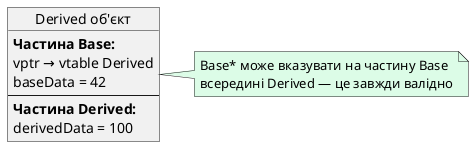

## Коли базового класу недостатньо

У попередніх статтях ми опанували поліморфізм — механізм виклику правильного методу похідного класу через покажчик або посилання на базовий клас. Це працює елегантно, коли всі операції визначені у базовому інтерфейсі. Але що робити, якщо метод існує лише у похідному класі?

```cpp [DowncastProblem.cpp]
#include <iostream>
#include <string>

class Animal
{
protected:
    std::string name;

public:
    Animal(std::string n) : name(n) {}
    
    virtual std::string speak() const
    {
        return name + " видає звук";
    }
    
    virtual ~Animal() = default;
};

class Bird : public Animal
{
public:
    Bird(std::string n) : Animal(n) {}
    
    std::string speak() const override
    {
        return name + " співає: Чвірінь-чвірінь!";
    }
    
    // Метод, специфічний для Bird
    void fly() const
    {
        std::cout << name << " літає!\n";
    }
};

class Dog : public Animal
{
public:
    Dog(std::string n) : Animal(n) {}
    
    std::string speak() const override
    {
        return name + " гавкає: Гав-гав!";
    }
};

// Функція отримує Animal*, але нам потрібен доступ до Bird::fly()
void interactWithAnimal(Animal* animal)
{
    std::cout << animal->speak() << "\n";
    
    // ❓ Як викликати fly(), якщо animal насправді вказує на Bird?
    // animal->fly();  // ❌ Помилка компіляції: Animal не має методу fly()
}

int main()
{
    Bird sparrow("Горобець");
    Dog dog("Рекс");
    
    interactWithAnimal(&sparrow);
    interactWithAnimal(&dog);
    
    return 0;
}
```

**Проблема**: функція `interactWithAnimal()` отримує `Animal*`, але метод `fly()` існує лише у `Bird`. Компілятор не дозволить викликати `animal->fly()`, бо статичний тип покажчика — `Animal*`.

**Можливі розв'язання:**

1. **Додати `fly()` у `Animal`** — але це засмітить базовий клас методами, що не мають сенсу для всіх тварин (риби не літають)
2. **Створити окремі функції** для кожного типу — втрачається переваги поліморфізму
3. **Використати динамічне приведення типів** — безпечно «спуститися» від `Animal*` до `Bird*`

Третій підхід використовує **RTTI** (*Run-Time Type Information*) — механізм отримання інформації про фактичний тип об'єкта під час виконання програми. У цій статті ми опануємо `dynamic_cast` та `typeid` — інструменти RTTI, що дозволяють безпечно працювати з поліморфними ієрархіями, коли статичної інформації про типи недостатньо.

::card-group

::card{title="🎯 Мета статті" icon="i-lucide-target"}

- Опанувати оператор `dynamic_cast` для безпечного downcasting (спуску вниз по ієрархії)
- Зрозуміти різницю між upcasting (завжди безпечний) та downcasting (потребує перевірки)
- Дослідити поведінку `dynamic_cast` для покажчиків (повертає `nullptr`) та посилань (генерує `std::bad_cast`)
- Вивчити оператор `typeid` та клас `std::type_info` для визначення фактичного типу об'єкта
- Критично оцінити межі використання RTTI: коли downcasting виправданий, а коли є «Code Smell»

::

::card{title="🔑 Ключові терміни" icon="i-lucide-key"}

- **RTTI** (*Run-Time Type Information*): механізм отримання інформації про типи під час виконання програми
- **Upcasting** (*підвищуюче приведення*): безпечна конвертація від похідного класу до базового (`Dog*` → `Animal*`)
- **Downcasting** (*понижуюче приведення*): небезпечна конвертація від базового класу до похідного (`Animal*` → `Dog*`)
- **`dynamic_cast`**: оператор динамічного приведення з перевіркою типу під час виконання
- **`typeid`**: оператор отримання інформації про тип об'єкта, повертає `std::type_info`
- **Code Smell** (*запах коду*): патерн, що часто вказує на архітектурні проблеми

::

::

## Upcasting vs Downcasting: напрямки приведення типів

### Підвищуюче приведення (Upcasting)

**Upcasting** — це неявна конвертація покажчика або посилання **від похідного класу до базового**. Це завжди безпечна операція, оскільки кожен похідний об'єкт **містить** повний базовий під-об'єкт.

```cpp [Upcasting.cpp]
#include <iostream>

class Base
{
public:
    virtual void print() const { std::cout << "Base\n"; }
    virtual ~Base() = default;
};

class Derived : public Base
{
public:
    void print() const override { std::cout << "Derived\n"; }
};

int main()
{
    Derived derived;
    
    // ✅ Upcasting: неявна конвертація Derived* → Base*
    Base* basePtr = &derived;
    
    // ✅ Upcasting: неявна конвертація Derived& → Base&
    Base& baseRef = derived;
    
    // Поліморфізм працює
    basePtr->print();  // Виведе "Derived"
    baseRef.print();   // Виведе "Derived"
    
    return 0;
}
```

::terminal-preview{title="./Upcasting"}
<div class="line">Derived</div>
<div class="line">Derived</div>
::

**Чому це безпечно?**

Кожен об'єкт `Derived` **фізично містить** повний об'єкт `Base` (у пам'яті `Derived` складається з частини `Base` + власних полів). Тому покажчик `Derived*` завжди можна інтерпретувати як `Base*` — він вказуватиме на валідну частину `Base` всередині `Derived`.

::plant-uml{alt="Upcasting: завжди безпечний"}



::

### Понижуюче приведення (Downcasting)

**Downcasting** — це конвертація покажчика або посилання **від базового класу до похідного**. Це потенційно небезпечна операція, оскільки `Base*` може вказувати:

1. На справжній об'єкт `Derived` — downcasting успішний
2. На об'єкт `Base` або іншого похідного класу — downcasting невалідний

```cpp [DowncastingDanger.cpp]
#include <iostream>

class Base
{
public:
    virtual void print() const { std::cout << "Base\n"; }
    virtual ~Base() = default;
};

class Derived : public Base
{
public:
    void print() const override { std::cout << "Derived\n"; }
    void derivedMethod() { std::cout << "Специфічний метод Derived\n"; }
};

int main()
{
    Base base;
    Derived derived;
    
    Base* ptr1 = &derived;  // Вказує на Derived
    Base* ptr2 = &base;     // Вказує на Base
    
    // ❌ НЕБЕЗПЕЧНО: примусове приведення без перевірки
    Derived* downcast1 = (Derived*)ptr1;  // ✅ Працює: ptr1 насправді вказує на Derived
    downcast1->derivedMethod();
    
    Derived* downcast2 = (Derived*)ptr2;  // ❌ НЕБЕЗПЕЧНО: ptr2 вказує на Base!
    // downcast2->derivedMethod();  // Undefined Behavior: невалідний доступ до пам'яті
    
    return 0;
}
```

::warning
**C-style cast та `static_cast` НЕ перевіряють валідність downcasting**. Вони завжди «успішні», навіть якщо приведення логічно некоректне. Це призводить до Undefined Behavior при спробі доступу до членів класу.

::

Саме для **безпечного downcasting** існує `dynamic_cast`.

## Оператор `dynamic_cast`: безпечний спуск по ієрархії

### Синтаксис та семантика

**`dynamic_cast`** — це оператор приведення типів, що виконує **перевірку типу під час виконання програми**. Синтаксис:

```cpp
Derived* derivedPtr = dynamic_cast<Derived*>(basePtr);
```

**Механізм роботи:**

1. Компілятор перевіряє vptr об'єкта, на який вказує `basePtr`
2. Проходить по віртуальній таблиці (vtable) та метаданих типу
3. Визначає, чи `basePtr` фактично вказує на об'єкт типу `Derived` (або його нащадка)
4. **Якщо так** — повертає валідний покажчик `Derived*`
5. **Якщо ні** — повертає `nullptr`

```cpp [DynamicCastSafe.cpp]
#include <iostream>
#include <string>

class Animal
{
protected:
    std::string name;

public:
    Animal(std::string n) : name(n) {}
    virtual ~Animal() = default;
};

class Bird : public Animal
{
public:
    Bird(std::string n) : Animal(n) {}
    
    void fly() const
    {
        std::cout << name << " літає!\n";
    }
};

class Dog : public Animal
{
public:
    Dog(std::string n) : Animal(n) {}
};

void interactWithAnimal(Animal* animal)
{
    // Спроба безпечного downcasting до Bird
    Bird* bird = dynamic_cast<Bird*>(animal);
    
    if (bird) {
        // ✅ animal насправді вказував на Bird
        bird->fly();
    } else {
        // ❌ animal НЕ є Bird
        std::cout << "Ця тварина не літає\n";
    }
}

int main()
{
    Bird sparrow("Горобець");
    Dog dog("Рекс");
    
    std::cout << "Взаємодія з горобцем:\n";
    interactWithAnimal(&sparrow);
    
    std::cout << "\nВзаємодія з собакою:\n";
    interactWithAnimal(&dog);
    
    return 0;
}
```

::terminal-preview{title="./DynamicCastSafe"}
<div class="line">Взаємодія з горобцем:</div>
<div class="line">Горобець літає!</div>
<div class="line"></div>
<div class="line">Взаємодія з собакою:</div>
<div class="line">Ця тварина не літає</div>
::

**Ключовий момент**: перевірка `if (bird)` — це **обов'язкова** практика при використанні `dynamic_cast` з покажчиками. Ніколи не розіменовуйте результат без перевірки на `nullptr`.

::tip
**Золоте правило `dynamic_cast`**: завжди перевіряйте результат на `nullptr` перед використанням. Пропуск перевірки призводить до розіменування нульового покажчика і краху програми.

::

### `dynamic_cast` з посиланнями

`dynamic_cast` також працює з посиланнями, але семантика відрізняється: **не існує «нульового посилання»**, тому при невдалій конвертації генерується **виняток** `std::bad_cast`:

```cpp [DynamicCastReference.cpp]
#include <iostream>
#include <typeinfo>  // для std::bad_cast

class Base
{
public:
    virtual ~Base() = default;
};

class Derived : public Base
{
public:
    void derivedMethod() { std::cout << "Метод Derived\n"; }
};

int main()
{
    Derived derivedObj;
    Base& baseRef = derivedObj;
    
    try {
        // ✅ Успішна конвертація
        Derived& derivedRef = dynamic_cast<Derived&>(baseRef);
        derivedRef.derivedMethod();
    }
    catch (const std::bad_cast& e) {
        std::cout << "Помилка приведення: " << e.what() << "\n";
    }
    
    Base baseObj;
    Base& baseRef2 = baseObj;
    
    try {
        // ❌ Невдала конвертація — генерується виняток
        Derived& derivedRef2 = dynamic_cast<Derived&>(baseRef2);
        derivedRef2.derivedMethod();
    }
    catch (const std::bad_cast& e) {
        std::cout << "Помилка приведення: " << e.what() << "\n";
    }
    
    return 0;
}
```

::terminal-preview{title="./DynamicCastReference"}
<div class="line">Метод Derived</div>
<div class="line">Помилка приведення: std::bad_cast</div>
::

::note
**Вибір між покажчиками та посиланнями**: якщо ви хочете м'яко обробити невдале приведення (продовжити виконання програми), використовуйте покажчики з перевіркою на `nullptr`. Якщо невдале приведення — це критична помилка, використовуйте посилання та винятки.

::


### Вимоги до використання `dynamic_cast`

`dynamic_cast` **працює лише з поліморфними класами** — тими, що містять хоча б одну віртуальну функцію (зазвичай це віртуальний деструктор). Чому?

Під капотом `dynamic_cast` використовує **vptr** (вказівник на віртуальну таблицю) для доступу до RTTI-метаданих типу. Якщо клас не має віртуальних функцій, він не має vptr, отже немає RTTI-інформації.

```cpp [DynamicCastRequirements.cpp]
#include <iostream>

// ❌ Не поліморфний клас (немає віртуальних функцій)
class NonPolymorphic
{
public:
    int value;
};

class DerivedNonPoly : public NonPolymorphic
{
public:
    int extra;
};

// ✅ Поліморфний клас (є віртуальний деструктор)
class Polymorphic
{
public:
    int value;
    virtual ~Polymorphic() = default;  // Віртуальний деструктор
};

class DerivedPoly : public Polymorphic
{
public:
    int extra;
};

int main()
{
    // ❌ Помилка компіляції: NonPolymorphic не є поліморфним
    // NonPolymorphic* np = new DerivedNonPoly();
    // DerivedNonPoly* dnp = dynamic_cast<DerivedNonPoly*>(np);
    
    // ✅ Працює: Polymorphic є поліморфним
    Polymorphic* p = new DerivedPoly();
    DerivedPoly* dp = dynamic_cast<DerivedPoly*>(p);
    
    if (dp) {
        std::cout << "✅ Успішний dynamic_cast\n";
    }
    
    delete p;
    return 0;
}
```

Спроба використати `dynamic_cast` з не поліморфним класом призведе до помилки компіляції:

```
error: 'NonPolymorphic' is not polymorphic
```

::warning
**Не працюють також**:
- Закрите (`private`) або захищене (`protected`) наслідування — зовнішній код не має доступу до інформації про ієрархію
- Віртуальні базові класи у складних сценаріях множинного наслідування (детальніше у документації компілятора)

::

## `dynamic_cast` vs `static_cast`: що обрати?

Порівняємо два оператори приведення типів для downcasting:

| Характеристика | `static_cast` | `dynamic_cast` |
|:--------------|:-------------|:--------------|
| **Перевірка типу** | ❌ Немає | ✅ Під час виконання |
| **Швидкість** | Швидший (compile-time) | Повільніший (runtime overhead) |
| **Безпека** | Небезпечний (Undefined Behavior при помилці) | Безпечний (повертає `nullptr` або генерує виняток) |
| **Вимоги** | Не потребує віртуальних функцій | Вимагає поліморфних класів |
| **Використання** | Коли ви **абсолютно впевнені** у типі | Коли тип **невідомий** або **може бути різним** |

### Коли використовувати `static_cast`

Якщо ви **гарантуєте** коректність приведення через попередню перевірку (наприклад, через віртуальний метод `getType()`), `static_cast` буде швидшим:

```cpp [StaticCastWithGuarantee.cpp]
#include <iostream>

enum class AnimalType { DOG, BIRD };

class Animal
{
public:
    virtual AnimalType getType() const = 0;
    virtual ~Animal() = default;
};

class Dog : public Animal
{
public:
    AnimalType getType() const override { return AnimalType::DOG; }
    void bark() { std::cout << "Гав-гав!\n"; }
};

class Bird : public Animal
{
public:
    AnimalType getType() const override { return AnimalType::BIRD; }
    void fly() { std::cout << "Літаю!\n"; }
};

void interact(Animal* animal)
{
    // Спочатку перевіряємо тип через віртуальний метод
    if (animal->getType() == AnimalType::DOG) {
        // ✅ Ми вже довели, що це Dog — static_cast безпечний
        Dog* dog = static_cast<Dog*>(animal);
        dog->bark();
    }
    else if (animal->getType() == AnimalType::BIRD) {
        Bird* bird = static_cast<Bird*>(animal);
        bird->fly();
    }
}

int main()
{
    Dog dog;
    Bird bird;
    
    interact(&dog);
    interact(&bird);
    
    return 0;
}
```

::terminal-preview{title="./StaticCastWithGuarantee"}
<div class="line">Гав-гав!</div>
<div class="line">Літаю!</div>
::

**Переваги цього підходу:**

- Швидше за `dynamic_cast` (немає накладних витрат на RTTI)
- Явний контроль над логікою визначення типу
- Можливість розширювати функціональність через `getType()` без зміни базового інтерфейсу

**Недоліки:**

- Потрібно вручну підтримувати систему типів (`enum AnimalType`)
- Легко забути додати новий тип у `enum` при розширенні ієрархії

### Коли використовувати `dynamic_cast`

Використовуйте `dynamic_cast`, коли:

1. **Тип об'єкта невідомий** і немає простого способу його визначити
2. **Ієрархія класів складна** з множинним наслідуванням
3. **Ви не контролюєте базовий клас** (наприклад, це клас із стандартної бібліотеки)

```cpp [DynamicCastUseCase.cpp]
#include <iostream>
#include <vector>

class Shape
{
public:
    virtual double getArea() const = 0;
    virtual ~Shape() = default;
};

class Circle : public Shape
{
private:
    double radius;

public:
    Circle(double r) : radius(r) {}
    
    double getArea() const override { return 3.14159 * radius * radius; }
    double getRadius() const { return radius; }
};

class Rectangle : public Shape
{
private:
    double width, height;

public:
    Rectangle(double w, double h) : width(w), height(h) {}
    
    double getArea() const override { return width * height; }
    double getWidth() const { return width; }
    double getHeight() const { return height; }
};

void analyzeShapes(const std::vector<Shape*>& shapes)
{
    for (Shape* shape : shapes) {
        std::cout << "Площа: " << shape->getArea() << " | ";
        
        // Спроба визначити, чи це коло
        if (Circle* circle = dynamic_cast<Circle*>(shape)) {
            std::cout << "Коло з радіусом " << circle->getRadius();
        }
        // Спроба визначити, чи це прямокутник
        else if (Rectangle* rect = dynamic_cast<Rectangle*>(shape)) {
            std::cout << "Прямокутник " << rect->getWidth() 
                      << "×" << rect->getHeight();
        }
        
        std::cout << "\n";
    }
}

int main()
{
    std::vector<Shape*> shapes = {
        new Circle(5.0),
        new Rectangle(4.0, 6.0),
        new Circle(3.0)
    };
    
    analyzeShapes(shapes);
    
    // Очищення
    for (Shape* shape : shapes) {
        delete shape;
    }
    
    return 0;
}
```

::terminal-preview{title="./DynamicCastUseCase"}
<div class="line">Площа: 78.5398 | Коло з радіусом 5</div>
<div class="line">Площа: 24 | Прямокутник 4×6</div>
<div class="line">Площа: 28.2743 | Коло з радіусом 3</div>
::

## Оператор `typeid` та клас `std::type_info`

### Отримання інформації про тип

**`typeid`** — це оператор, що повертає об'єкт типу `std::type_info`, який містить метадані про тип. На відміну від `dynamic_cast`, `typeid` **не виконує приведення**, а лише **повідомляє тип**.

```cpp [TypeidBasics.cpp]
#include <iostream>
#include <typeinfo>

class Base
{
public:
    virtual ~Base() = default;
};

class Derived : public Base {};

int main()
{
    int i = 42;
    double d = 3.14;
    Base base;
    Derived derived;
    
    Base* ptrToBase = &base;
    Base* ptrToDerived = &derived;
    
    std::cout << "Тип i: " << typeid(i).name() << "\n";
    std::cout << "Тип d: " << typeid(d).name() << "\n";
    std::cout << "Тип base: " << typeid(base).name() << "\n";
    std::cout << "Тип derived: " << typeid(derived).name() << "\n";
    
    std::cout << "\nЧерез покажчики (поліморфні):\n";
    std::cout << "Тип *ptrToBase: " << typeid(*ptrToBase).name() << "\n";
    std::cout << "Тип *ptrToDerived: " << typeid(*ptrToDerived).name() << "\n";
    
    return 0;
}
```

Можливий вивід (залежить від компілятора):

::terminal-preview{title="./TypeidBasics"}
<div class="line">Тип i: i</div>
<div class="line">Тип d: d</div>
<div class="line">Тип base: 4Base</div>
<div class="line">Тип derived: 7Derived</div>
<div class="line"></div>
<div class="line">Через покажчики (поліморфні):</div>
<div class="line">Тип *ptrToBase: 4Base</div>
<div class="line">Тип *ptrToDerived: 7Derived</div>
::

::note
**Імена типів не стандартизовані**: метод `name()` повертає рядок, формат якого залежить від компілятора. У GCC/Clang це «mangled names» (наприклад, `4Base`, `7Derived`). У MSVC — більш читабельні імена (`class Base`, `class Derived`). Не покладайтеся на конкретний формат імені.

::

### Порівняння типів

Основне застосування `typeid` — **перевірка точного збігу типів**:

```cpp [TypeidComparison.cpp]
#include <iostream>
#include <typeinfo>

class Animal
{
public:
    virtual ~Animal() = default;
};

class Dog : public Animal {};
class Cat : public Animal {};

void identifyAnimal(Animal* animal)
{
    if (typeid(*animal) == typeid(Dog)) {
        std::cout << "Це точно собака!\n";
    }
    else if (typeid(*animal) == typeid(Cat)) {
        std::cout << "Це точно кіт!\n";
    }
    else {
        std::cout << "Невідома тварина\n";
    }
}

int main()
{
    Dog dog;
    Cat cat;
    Animal animal;
    
    identifyAnimal(&dog);
    identifyAnimal(&cat);
    identifyAnimal(&animal);
    
    return 0;
}
```

::terminal-preview{title="./TypeidComparison"}
<div class="line">Це точно собака!</div>
<div class="line">Це точно кіт!</div>
<div class="line">Невідома тварина</div>
::

**Важлива відмінність від `dynamic_cast`**:

- `typeid` перевіряє **точний тип** — якщо `animal` вказує на `DogBreed : public Dog`, то `typeid(*animal) == typeid(Dog)` поверне `false`
- `dynamic_cast<Dog*>(animal)` **успішний для нащадків** — `DogBreed` успішно приводиться до `Dog*`

::tip
**Коли що використовувати:**
- `dynamic_cast` — коли потрібен **доступ до специфічних методів** похідного класу
- `typeid` — коли потрібна **перевірка точного типу** без приведення

::

### `std::type_info` та його методи

Клас `std::type_info` має обмежений інтерфейс:

| Метод | Опис |
|:------|:-----|
| `name()` | Повертає ім'я типу (залежить від компілятора) |
| `operator==` | Перевіряє точний збіг типів |
| `operator!=` | Перевіряє відмінність типів |
| `before()` | Лексикографічне порівняння імен (для сортування) |
| `hash_code()` | Хеш-код типу (C++11) |

**Обмеження:**

- Не можна створювати об'єкти `std::type_info` напряму — лише через `typeid`
- Не можна копіювати об'єкти `std::type_info`
- Імена типів не стандартизовані — не використовуйте їх для логіки програми

```cpp [TypeInfoMethods.cpp]
#include <iostream>
#include <typeinfo>

class A { public: virtual ~A() = default; };
class B { public: virtual ~B() = default; };

int main()
{
    const std::type_info& ti1 = typeid(int);
    const std::type_info& ti2 = typeid(double);
    const std::type_info& ti3 = typeid(int);
    
    std::cout << "int == double: " << (ti1 == ti2) << "\n";
    std::cout << "int == int: " << (ti1 == ti3) << "\n";
    
    std::cout << "Hash int: " << ti1.hash_code() << "\n";
    std::cout << "Hash double: " << ti2.hash_code() << "\n";
    
    return 0;
}
```

::terminal-preview{title="./TypeInfoMethods"}
<div class="line">int == double: 0</div>
<div class="line">int == int: 1</div>
<div class="line">Hash int: 1534084053</div>
<div class="line">Hash double: 1680433025</div>
::


## Архітектурний аналіз: коли RTTI є «Code Smell»

### Downcasting як симптом поганого проєктування

Частий `dynamic_cast` та `typeid` у коді — це часто **ознака архітектурних проблем**. Якщо вам постійно потрібно дізнаватися фактичний тип об'єкта, можливо, базовий інтерфейс **неповний** або **некоректно спроєктований**.

**Антипатерн: тип-залежна логіка**

```cpp [BadDesign.cpp]
void processShape(Shape* shape)
{
    if (Circle* circle = dynamic_cast<Circle*>(shape)) {
        // Спеціальна логіка для кола
        double area = 3.14159 * circle->getRadius() * circle->getRadius();
        std::cout << "Коло, площа: " << area << "\n";
    }
    else if (Rectangle* rect = dynamic_cast<Rectangle*>(shape)) {
        // Спеціальна логіка для прямокутника
        double area = rect->getWidth() * rect->getHeight();
        std::cout << "Прямокутник, площа: " << area << "\n";
    }
    else if (Triangle* tri = dynamic_cast<Triangle*>(shape)) {
        // Спеціальна логіка для трикутника
        double area = 0.5 * tri->getBase() * tri->getHeight();
        std::cout << "Трикутник, площа: " << area << "\n";
    }
}
```

**Проблеми цього підходу:**

1. **Порушення принципу відкритості/закритості** (*Open/Closed Principle*): додавання нової фігури вимагає зміни функції `processShape()`
2. **Дублювання логіки**: обчислення площі має бути відповідальністю самої фігури
3. **Складність підтримки**: що, якщо додати 20 нових фігур? Функція стане величезною
4. **Втрата переваг поліморфізму**: ми знову повертаємося до процедурного стилю

**Правильне проєктування: віртуальні методи**

```cpp [GoodDesign.cpp]
class Shape
{
public:
    virtual double getArea() const = 0;
    virtual void print() const = 0;
    virtual ~Shape() = default;
};

class Circle : public Shape
{
private:
    double radius;

public:
    Circle(double r) : radius(r) {}
    
    double getArea() const override
    {
        return 3.14159 * radius * radius;
    }
    
    void print() const override
    {
        std::cout << "Коло, площа: " << getArea() << "\n";
    }
};

// Аналогічно для Rectangle, Triangle...

void processShape(Shape* shape)
{
    shape->print();  // ✅ Поліморфізм — кожна фігура сама знає, як себе виводити
}
```

Тепер додавання нової фігури **не вимагає змін** у `processShape()` — новий клас просто реалізує `print()`.

### Коли downcasting виправданий

Існують легітимні випадки використання `dynamic_cast`:

**1. Робота з чужими бібліотеками**

Якщо ви працюєте з базовим класом, що ви не контролюєте (стандартна бібліотека, сторонній фреймворк), і вам потрібен доступ до специфічної функціональності похідного класу:

```cpp
// Не можемо змінити std::exception — це стандартна бібліотека
void logException(const std::exception& e)
{
    // Базова обробка
    std::cerr << "Помилка: " << e.what() << "\n";
    
    // Додаткова інформація для std::system_error
    if (const std::system_error* se = dynamic_cast<const std::system_error*>(&e)) {
        std::cerr << "Код помилки: " << se->code() << "\n";
    }
}
```

**2. Оптимізація критичних шляхів**

Якщо певний тип об'єкта дозволяє швидшу реалізацію алгоритму:

```cpp
void processCollection(Container* container)
{
    // Загальна повільна реалізація через ітератори
    for (auto it = container->begin(); it != container->end(); ++it) {
        process(*it);
    }
    
    // Оптимізація для масивів: пряме звернення до пам'яті
    if (Array* arr = dynamic_cast<Array*>(container)) {
        processArrayFast(arr->data(), arr->size());  // Швидше на 30%
    }
}
```

**3. Діагностика та налагодження**

Виведення детальної інформації про об'єкт для логування чи дебагу:

```cpp
void debugObject(Base* obj)
{
    std::cout << "Тип: " << typeid(*obj).name() << "\n";
    
    if (Dog* dog = dynamic_cast<Dog*>(obj)) {
        std::cout << "Порода: " << dog->getBreed() << "\n";
    }
}
```

**4. Патерн Visitor (альтернатива)**

Якщо ви не можете змінити базовий клас, але потрібна тип-залежна логіка, розгляньте **патерн Visitor** замість `dynamic_cast`:

```cpp
class ShapeVisitor
{
public:
    virtual void visit(Circle& c) = 0;
    virtual void visit(Rectangle& r) = 0;
    virtual void visit(Triangle& t) = 0;
};

class Shape
{
public:
    virtual void accept(ShapeVisitor& visitor) = 0;
    virtual ~Shape() = default;
};

class Circle : public Shape
{
public:
    void accept(ShapeVisitor& visitor) override
    {
        visitor.visit(*this);  // Двійне диспетчерування
    }
};

// Тепер тип-залежна логіка інкапсульована у Visitor
class AreaCalculator : public ShapeVisitor
{
public:
    void visit(Circle& c) override { /* ... */ }
    void visit(Rectangle& r) override { /* ... */ }
    void visit(Triangle& t) override { /* ... */ }
};
```

::note
**Патерн Visitor** складніший за `dynamic_cast`, але надає кращу розширюваність: додавання нової операції (Visitor) не вимагає зміни класів фігур.

::

### Накладні витрати RTTI

RTTI не є безкоштовним:

**Витрати пам'яті:**
- Кожен поліморфний клас зберігає метадані типу у vtable
- Додаткові 8–16 байт на клас (залежно від компілятора)

**Витрати продуктивності:**
- `dynamic_cast` виконує обхід метаданих типу під час виконання
- Приблизно 10–50 CPU циклів на виклик (залежить від складності ієрархії)
- У критичних циклах це може бути значущим

**Вимикання RTTI:**

У деяких доменах (embedded, gamedev) RTTI вимикають через прапорець компілятора:

```bash
# GCC/Clang
g++ -fno-rtti program.cpp

# MSVC
cl /GR- program.cpp
```

При вимкненому RTTI `dynamic_cast` та `typeid` **не працюють**. Доведеться використовувати власні механізми визначення типів.

::warning
**Якщо вимкнути RTTI:**
- `dynamic_cast` призведе до помилки компіляції
- `typeid` поверне статичну інформацію про тип (не фактичну)
- Стандартні винятки (`std::exception`) можуть не працювати коректно

::

## Практичні завдання

::::accordion

:::accordion-item{label="📋 Завдання 1: Безпечний downcasting" icon="i-lucide-clipboard-list"}

Реалізуйте систему обробки різних типів документів:

1. Базовий клас `Document`:
   - Поле: `title` (назва документа)
   - Віртуальний метод: `print()` — виводить базову інформацію

2. Похідні класи:
   - `TextDocument` — має метод `getWordCount()` — кількість слів
   - `ImageDocument` — має метод `getResolution()` — роздільна здатність
   - `VideoDocument` — має метод `getDuration()` — тривалість у секундах

3. Функція `analyzeDocument(Document* doc)`:
   - Виводить базову інформацію через `print()`
   - Використовує `dynamic_cast` для виведення специфічної інформації залежно від типу

**Вимоги:**
- Завжди перевіряйте результат `dynamic_cast` на `nullptr`
- Забезпечте коректну роботу для всіх типів документів
- Додайте віртуальний деструктор

:::

:::accordion-item{label="✅ Розв'язок завдання 1" icon="i-lucide-check-circle"}

```cpp
#include <iostream>
#include <string>

class Document
{
protected:
    std::string title;

public:
    Document(std::string t) : title(t) {}
    
    virtual void print() const
    {
        std::cout << "Документ: " << title << "\n";
    }
    
    virtual ~Document() = default;
};

class TextDocument : public Document
{
private:
    int wordCount;

public:
    TextDocument(std::string t, int words)
        : Document(t), wordCount(words) {}
    
    void print() const override
    {
        std::cout << "Текстовий документ: " << title << "\n";
    }
    
    int getWordCount() const { return wordCount; }
};

class ImageDocument : public Document
{
private:
    int width, height;

public:
    ImageDocument(std::string t, int w, int h)
        : Document(t), width(w), height(h) {}
    
    void print() const override
    {
        std::cout << "Зображення: " << title << "\n";
    }
    
    std::string getResolution() const
    {
        return std::to_string(width) + "×" + std::to_string(height);
    }
};

class VideoDocument : public Document
{
private:
    int durationSeconds;

public:
    VideoDocument(std::string t, int duration)
        : Document(t), durationSeconds(duration) {}
    
    void print() const override
    {
        std::cout << "Відео: " << title << "\n";
    }
    
    int getDuration() const { return durationSeconds; }
};

void analyzeDocument(Document* doc)
{
    // Базова інформація через поліморфізм
    doc->print();
    
    // Специфічна інформація через dynamic_cast
    if (TextDocument* textDoc = dynamic_cast<TextDocument*>(doc)) {
        std::cout << "  Кількість слів: " << textDoc->getWordCount() << "\n";
    }
    else if (ImageDocument* imgDoc = dynamic_cast<ImageDocument*>(doc)) {
        std::cout << "  Роздільна здатність: " << imgDoc->getResolution() << "\n";
    }
    else if (VideoDocument* videoDoc = dynamic_cast<VideoDocument*>(doc)) {
        std::cout << "  Тривалість: " << videoDoc->getDuration() << " секунд\n";
    }
    
    std::cout << "\n";
}

int main()
{
    TextDocument text("Звіт_2024.docx", 1500);
    ImageDocument image("Logo.png", 1920, 1080);
    VideoDocument video("Tutorial.mp4", 320);
    
    analyzeDocument(&text);
    analyzeDocument(&image);
    analyzeDocument(&video);
    
    return 0;
}
```

::terminal-preview{title="./DocumentAnalysis"}
<div class="line">Текстовий документ: Звіт_2024.docx</div>
<div class="line">  Кількість слів: 1500</div>
<div class="line"></div>
<div class="line">Зображення: Logo.png</div>
<div class="line">  Роздільна здатність: 1920×1080</div>
<div class="line"></div>
<div class="line">Відео: Tutorial.mp4</div>
<div class="line">  Тривалість: 320 секунд</div>
::

:::

:::accordion-item{label="📋 Завдання 2: Порівняння typeid" icon="i-lucide-clipboard-list"}

Реалізуйте функцію `compareTypes()`, що приймає два покажчики на `Base*` і:

1. Порівнює типи об'єктів через `typeid`
2. Виводить, чи обидва об'єкти мають однаковий тип
3. Виводить імена типів обох об'єктів

Створіть ієрархію:
- `Vehicle` (базовий клас)
- `Car : public Vehicle`
- `Truck : public Vehicle`

Протестуйте функцію на різних комбінаціях об'єктів.

:::

:::accordion-item{label="✅ Розв'язок завдання 2" icon="i-lucide-check-circle"}

```cpp
#include <iostream>
#include <typeinfo>

class Vehicle
{
public:
    virtual ~Vehicle() = default;
};

class Car : public Vehicle {};
class Truck : public Vehicle {};

void compareTypes(Vehicle* v1, Vehicle* v2)
{
    const std::type_info& type1 = typeid(*v1);
    const std::type_info& type2 = typeid(*v2);
    
    std::cout << "Об'єкт 1: " << type1.name() << "\n";
    std::cout << "Об'єкт 2: " << type2.name() << "\n";
    
    if (type1 == type2) {
        std::cout << "✅ Обидва об'єкти мають однаковий тип\n";
    } else {
        std::cout << "❌ Об'єкти мають різні типи\n";
    }
    
    std::cout << "\n";
}

int main()
{
    Car car1, car2;
    Truck truck;
    Vehicle vehicle;
    
    std::cout << "=== Порівняння Car з Car ===\n";
    compareTypes(&car1, &car2);
    
    std::cout << "=== Порівняння Car з Truck ===\n";
    compareTypes(&car1, &truck);
    
    std::cout << "=== Порівняння Car з Vehicle ===\n";
    compareTypes(&car1, &vehicle);
    
    return 0;
}
```

::terminal-preview{title="./TypeComparison"}
<div class="line">=== Порівняння Car з Car ===</div>
<div class="line">Об'єкт 1: 3Car</div>
<div class="line">Об'єкт 2: 3Car</div>
<div class="line">✅ Обидва об'єкти мають однаковий тип</div>
<div class="line"></div>
<div class="line">=== Порівняння Car з Truck ===</div>
<div class="line">Об'єкт 1: 3Car</div>
<div class="line">Об'єкт 2: 5Truck</div>
<div class="line">❌ Об'єкти мають різні типи</div>
<div class="line"></div>
<div class="line">=== Порівняння Car з Vehicle ===</div>
<div class="line">Об'єкт 1: 3Car</div>
<div class="line">Об'єкт 2: 7Vehicle</div>
<div class="line">❌ Об'єкти мають різні типи</div>
::

:::

:::accordion-item{label="❓ Питання для самоперевірки" icon="i-lucide-help-circle"}

1. **У чому різниця між upcasting та downcasting?**

   ::collapsible{title="Показати відповідь"}
   **Upcasting** — приведення від похідного до базового класу (`Derived*` → `Base*`). Завжди безпечний і неявний, оскільки кожен похідний об'єкт містить повний базовий під-об'єкт. **Downcasting** — приведення від базового до похідного класу (`Base*` → `Derived*`). Потенційно небезпечний, оскільки `Base*` може вказувати на об'єкт іншого типу. Вимагає явного приведення через `dynamic_cast` з перевіркою результату.
   ::

2. **Що повертає `dynamic_cast`, якщо приведення неможливе?**

   ::collapsible{title="Показати відповідь"}
   Для **покажчиків** `dynamic_cast` повертає `nullptr`. Для **посилань** генерується виняток `std::bad_cast`, оскільки не існує «нульового посилання». Завжди перевіряйте результат перед використанням.
   ::

3. **Чому `dynamic_cast` вимагає віртуальних функцій?**

   ::collapsible{title="Показати відповідь"}
   `dynamic_cast` використовує RTTI-метадані, що зберігаються у віртуальній таблиці (vtable). Для доступу до vtable потрібен вказівник vptr, який існує лише у поліморфних класах (тих, що мають хоча б одну віртуальну функцію). Без віртуальних функцій немає vptr → немає RTTI → `dynamic_cast` не працює.
   ::

4. **Чим відрізняється `typeid` від `dynamic_cast`?**

   ::collapsible{title="Показати відповідь"}
   `typeid` **повідомляє** фактичний тип об'єкта (повертає `std::type_info`), але **не виконує приведення**. Використовується для перевірки точного збігу типів. `dynamic_cast` **виконує приведення** і повертає покажчик або посилання на похідний тип. Використовується для доступу до специфічних методів похідного класу.
   ::

5. **Коли частий `dynamic_cast` є «Code Smell»?**

   ::collapsible{title="Показати відповідь"}
   Якщо ваш код постійно перевіряє тип об'єкта через `dynamic_cast` або `typeid` і виконує різну логіку залежно від типу, це часто означає, що базовий інтерфейс **неповний**. Правильне рішення — додати віртуальний метод у базовий клас, щоб кожен похідний клас міг реалізувати специфічну поведінку через поліморфізм. Виняток: робота з бібліотеками, які ви не контролюєте.
   ::

:::

::::

## Резюме

У цій статті ми опанували механізм RTTI (Run-Time Type Information) — інструменти динамічного визначення типів під час виконання програми. Ми дізналися, коли ці інструменти корисні, а коли їх використання сигналізує про архітектурні проблеми.

::card-group

::card{title="✅ dynamic_cast" icon="i-lucide-arrow-down-to-line"}

**Призначення**: безпечний downcasting (спуск від базового до похідного класу)

**Поведінка**:
- Покажчики: повертає `nullptr` при невдачі
- Посилання: генерує `std::bad_cast` при невдачі
- Вимагає поліморфних класів (віртуальні функції)

**Використання**: коли потрібен доступ до методів похідного класу, що не визначені в базовому інтерфейсі

::

::card{title="✅ typeid та type_info" icon="i-lucide-info"}

**Призначення**: отримання інформації про фактичний тип об'єкта

**Можливості**:
- Повертає `const std::type_info&`
- Метод `name()` — ім'я типу (не стандартизоване)
- Оператори `==` / `!=` — порівняння типів
- Метод `hash_code()` — хеш типу (C++11)

**Використання**: перевірка точного збігу типів без приведення

::

::card{title="⚠️ Архітектурні застереження" icon="i-lucide-alert-triangle"}

**Code Smell**: частий `dynamic_cast` часто означає погане проєктування

**Кращі альтернативи**:
- Віртуальні методи для тип-залежної логіки
- Патерн Visitor для складних операцій
- Енумерація типів (`enum`) + `static_cast`

**Виправдані випадки**:
- Робота з чужими бібліотеками
- Оптимізація критичних шляхів
- Діагностика та налагодження

::

::

::tip
**Правило вибору інструменту**:
1. **Першочергово**: проєктуйте систему через віртуальні методи
2. **Якщо неможливо**: використовуйте `dynamic_cast` з перевіркою результату
3. **Для перевірки типів**: використовуйте `typeid` замість приведення
4. **Для швидкості**: якщо тип гарантований, використовуйте `static_cast`

::

У наступній статті ми почнемо вивчення **узагальненого програмування** (*generic programming*) через шаблони функцій. Ми дізнаємося, як писати алгоритми, що працюють з будь-якими типами даних, та опануємо механізм інстанціювання шаблонів компілятором.
