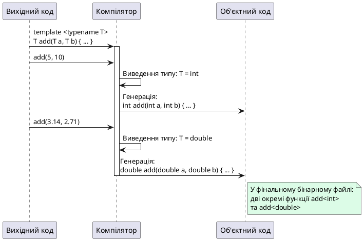

## Коли перевантаження стає проблемою

У попередніх статтях ми опанували перевантаження функцій — механізм, що дозволяє мати кілька функцій з однаковою назвою, але різними типами параметрів. Це зручно, коли потрібна однакова логіка для різних типів. Але що, якщо нам потрібна функція для **десятків** типів?

```cpp [OverloadingProblem.cpp]
#include <iostream>

// Функція max() для int
int max(int a, int b)
{
    return (a > b) ? a : b;
}

// Функція max() для double
double max(double a, double b)
{
    return (a > b) ? a : b;
}

// Функція max() для char
char max(char a, char b)
{
    return (a > b) ? a : b;
}

// А якщо потрібно для long, float, std::string, наших власних класів?
// Доведеться писати десятки однакових функцій...

int main()
{
    std::cout << max(5, 10) << "\n";        // Викликає max(int, int)
    std::cout << max(3.14, 2.71) << "\n";   // Викликає max(double, double)
    std::cout << max('a', 'z') << "\n";     // Викликає max(char, char)
    
    return 0;
}
```

**Проблеми цього підходу:**

1. **Дублювання коду**: логіка ідентична, але доводиться писати 3+ версії
2. **Складність підтримки**: якщо виявиться баг, потрібно виправляти в усіх версіях
3. **Обмеженість**: що, якщо користувач хоче використати `max()` з власним класом `Fraction`? Доведеться додавати ще одну версію
4. **Порушення DRY** (*Don't Repeat Yourself*): один з фундаментальних принципів програмування

Що, якби ми могли написати **одну** функцію, яка працює з **будь-яким** типом даних, що підтримує оператор `>`? Саме це дозволяють **шаблони функцій** (*function templates*) — основа **узагальненого програмування** (*generic programming*) у C++.

::card-group

::card{title="🎯 Мета статті" icon="i-lucide-target"}

- Опанувати синтаксис шаблонів функцій: `template <typename T>`
- Зрозуміти механізм інстанціювання шаблонів компілятором під час компіляції
- Навчитися використовувати автоматичне виведення типів (*template argument deduction*)
- Опанувати явну специфікацію типів для розв'язання неоднозначностей
- Дослідити шаблони з кількома параметрами (`template <typename T, typename U>`)
- З'ясувати правила перевантаження та пріоритет виклику нешаблонних версій

::

::card{title="🔑 Ключові терміни" icon="i-lucide-key"}

- **Узагальнене програмування** (*generic programming*): парадигма написання алгоритмів, незалежних від конкретних типів даних
- **Шаблон функції** (*function template*): «трафарет» для автоматичної генерації функцій під різні типи
- **Параметр типу шаблону** (*template type parameter*): замінник конкретного типу, позначається `T`, `U` тощо
- **Інстанціювання шаблону** (*template instantiation*): процес генерації компілятором конкретної функції з шаблону
- **Виведення типів** (*template argument deduction*): автоматичне визначення компілятором типу `T` з переданих аргументів
- **Явна специфікація** (*explicit specialization*): ручне вказання типу `func<int>(...)` для розв'язання неоднозначностей

::

::

## Синтаксис шаблонів функцій: `template <typename T>`

### Базовий синтаксис

**Шаблон функції** — це «рецепт» або «трафарет», за яким компілятор автоматично генерує конкретні функції для різних типів. Замість того, щоб писати `max(int, int)`, `max(double, double)` тощо, ми пишемо **один** шаблон `max(T, T)`, де `T` — це **параметр типу шаблону**.

```cpp [FunctionTemplateSyntax.cpp]
#include <iostream>

// Шаблон функції: T — параметр типу шаблону
template <typename T>
T max(T a, T b)
{
    return (a > b) ? a : b;
}

int main()
{
    // Компілятор автоматично створює max<int>
    std::cout << max(5, 10) << "\n";
    
    // Компілятор автоматично створює max<double>
    std::cout << max(3.14, 2.71) << "\n";
    
    // Компілятор автоматично створює max<char>
    std::cout << max('a', 'z') << "\n";
    
    return 0;
}
```

::terminal-preview{title="./FunctionTemplateSyntax"}
<div class="line">10</div>
<div class="line">3.14</div>
<div class="line">z</div>
::

**Розбір синтаксису:**

```cpp
template <typename T>  // Оголошення параметра типу шаблону
T max(T a, T b)        // T використовується як тип повернення і параметрів
{
    return (a > b) ? a : b;
}
```

1. **`template`** — ключове слово, що повідомляє компілятору: «далі йде оголошення шаблону»
2. **`<typename T>`** — список параметрів типу шаблону у кутових дужках
   - `typename` — ключове слово, що вказує: `T` є **типом**, а не значенням
   - `T` — ім'я параметра типу (за конвенцією велика літера)
3. **`T max(T a, T b)`** — сигнатура функції, де `T` використовується як звичайний тип

::note
**`typename` vs `class`**: у базових шаблонах функцій `template <typename T>` та `template <class T>` **абсолютно еквівалентні**. Історично спочатку існувало лише `class`, але воно вводило в оману — `T` не обов'язково має бути класом. Сучасна конвенція — використовувати `typename`, щоб підкреслити: це **будь-який тип** (примітивний, клас, покажчик тощо).

::

### Конвенції іменування параметрів типу

| Конвенція | Використання | Приклад |
|:----------|:------------|:--------|
| `T` | Єдиний параметр типу | `template <typename T>` |
| `T`, `U`, `V` | Кілька параметрів | `template <typename T, typename U>` |
| `T1`, `T2` | Альтернативне іменування | `template <typename T1, typename T2>` |
| `Key`, `Value` | Семантичні імена (складні шаблони) | `template <typename Key, typename Value>` |

**Рекомендація**: для простих шаблонів використовуйте `T`. Для складних (наприклад, контейнерів) — семантичні імена (`Key`, `Value`).

### Посилання та `const` у шаблонах

Оскільки `T` може бути **класом**, а класи рекомендується передавати за посиланням, кращою практикою є використання `const T&`:

```cpp [TemplateWithReferences.cpp]
#include <iostream>
#include <string>

// ✅ Краща практика: const посилання
template <typename T>
const T& max(const T& a, const T& b)
{
    return (a > b) ? a : b;
}

int main()
{
    int x = 5, y = 10;
    std::cout << max(x, y) << "\n";  // max<int>
    
    std::string s1 = "apple", s2 = "banana";
    std::cout << max(s1, s2) << "\n";  // max<std::string> — ефективно
    
    return 0;
}
```

::terminal-preview{title="./TemplateWithReferences"}
<div class="line">10</div>
<div class="line">banana</div>
::

**Переваги `const T&`:**

- **Уникнення копіювання** для великих об'єктів (наприклад, `std::string`)
- **Робота з некопійованими типами** (класи з `= delete` конструктором копіювання)
- **Ефективність**: для примітивних типів (`int`, `double`) компілятор оптимізує посилання до звичайних значень

## Інстанціювання шаблонів: як компілятор генерує функції

### Механізм кодогенерації

Коли компілятор зустрічає виклик шаблонної функції, він виконує **інстанціювання шаблону** (*template instantiation*) — процес автоматичної генерації конкретної функції з шаблону.

```cpp [TemplateInstantiation.cpp]
template <typename T>
T add(T a, T b)
{
    return a + b;
}

int main()
{
    int result1 = add(5, 10);         // Інстанціювання add<int>
    double result2 = add(3.14, 2.71); // Інстанціювання add<double>
    
    return 0;
}
```

Що робить компілятор:

**Крок 1**: Аналізує виклик `add(5, 10)` → тип аргументів: `int` → виводить `T = int`

**Крок 2**: Генерує конкретну функцію, замінюючи `T` на `int`:

```cpp
// Згенерована компілятором функція add<int>
int add(int a, int b)
{
    return a + b;
}
```

**Крок 3**: Аналізує виклик `add(3.14, 2.71)` → тип: `double` → виводить `T = double`

**Крок 4**: Генерує ще одну функцію:

```cpp
// Згенерована компілятором функція add<double>
double add(double a, double b)
{
    return a + b;
}
```

::plant-uml{alt="Процес інстанціювання шаблону"}



::

**Важливі наслідки:**

1. **Інстанціювання відбувається під час компіляції** — жодних runtime-витрат
2. **Кожен унікальний тип генерує окрему функцію** — `add<int>`, `add<double>`, `add<std::string>` існують як **три різні функції**
3. **Збільшення розміру коду** (*code bloat*): 10 викликів з 10 різними типами створюють 10 функцій у бінарному файлі

::warning
**Code Bloat**: якщо шаблон використовується з 50 різними типами, компілятор створить 50 копій функції. Це може збільшити розмір виконуваного файлу. У більшості випадків це прийнятна ціна за гнучкість, але у embedded-системах з обмеженою пам'яттю варто бути обережним.

::

### Вимоги до типу `T`

Шаблон `max(T, T)` працює **лише з типами, що підтримують оператор `>`**. Якщо тип не має `operator>`, компіляція провалиться:

```cpp
class Person
{
public:
    std::string name;
    Person(std::string n) : name(n) {}
    // Немає operator>
};

int main()
{
    Person p1("Alice"), p2("Bob");
    
    // ❌ Помилка компіляції: Person не має operator>
    // Person result = max(p1, p2);
    
    return 0;
}
```

Помилка компілятора:

```
error: no match for 'operator>' (operand types are 'const Person' and 'const Person')
```

**Розв'язання**: перевантажити `operator>` для `Person`:

```cpp
class Person
{
public:
    std::string name;
    int age;
    
    Person(std::string n, int a) : name(n), age(a) {}
    
    // ✅ Перевантаження operator>
    bool operator>(const Person& other) const
    {
        return age > other.age;  // Порівняння за віком
    }
};

int main()
{
    Person p1("Alice", 25), p2("Bob", 30);
    
    // ✅ Тепер працює
    Person oldest = max(p1, p2);
    std::cout << "Старший: " << oldest.name << " (" << oldest.age << ")\n";
    
    return 0;
}
```

::tip
**Концепція утиної типізації** (*duck typing*) у C++: «Якщо щось виглядає як качка, плаває як качка і крякає як качка, то це качка». Шаблон `max(T, T)` працює з будь-яким типом, що «виглядає як щось порівнюване» (має `operator>`). Це дозволяє писати код, що працює з типами, про які ми навіть не знали при написанні шаблону.

::

