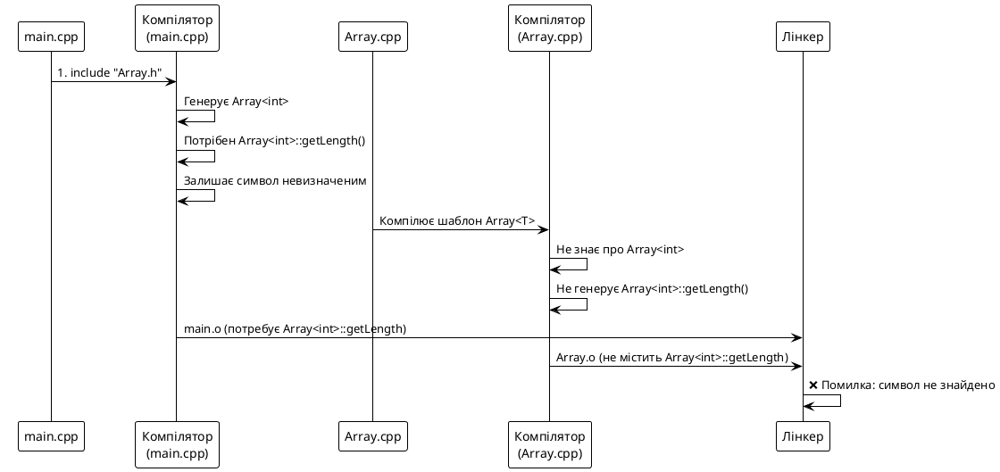
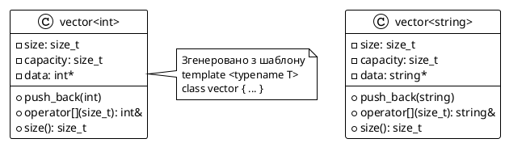
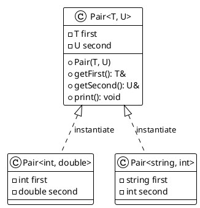

## Вступ: від дублювання до узагальнення

На попередній лекції ми дослідили шаблони функцій — механізм, що дозволяє писати один алгоритм для багатьох типів даних. Але узагальнене програмування — це не лише функції. **Класи** також потребують універсальності.

Уявіть: ви створили контейнерний клас `ArrayInt` для зберігання масиву цілих чисел. Завтра вам потрібен `ArrayDouble` для дійсних чисел. Післязавтра — `ArrayString` для рядків. Кожен новий тип вимагає повного копіювання коду класу та зміни лише типу даних.

**Шаблони класів** (*class templates*) розв'язують цю проблему: один шаблон класу генерує багато конкретних класів на етапі компіляції. У цій лекції ми:

1. Побудуємо власний шаблонний контейнер `Array<T>`.
2. Дослідимо **параметри non-type** (*NTTP — Non-Type Template Parameter*) для компіляційних констант.
3. Розберемося з особливостями компіляції шаблонів (проблема роздільної компіляції).
4. Зрозуміємо устрій `std::vector<T>` та `std::array<T, N>` «зсередини».

---

## Мотивація: контейнерний клас без шаблонів

### Проблема дублювання коду

На лекції про контейнерні класи ми створювали `IntArray` — клас, що інкапсулює динамічний масив цілих чисел:

```cpp
class IntArray {
private:
    int length;
    int* data;

public:
    IntArray(int len) {
        data = new int[len];
        length = len;
    }

    ~IntArray() {
        delete[] data;
    }

    int& operator[](int index) {
        return data[index];
    }

    int getLength() const { return length; }
};
```

Тепер потрібен аналогічний клас для `double`:

```cpp
class DoubleArray {
private:
    int length;
    double* data;  // ← єдина зміна!

public:
    DoubleArray(int len) {
        data = new double[len];  // ← і тут
        length = len;
    }

    ~DoubleArray() {
        delete[] data;
    }

    double& operator[](int index) {  // ← і тут
        return data[index];
    }

    int getLength() const { return length; }
};
```

::warning{icon="lucide:alert-triangle"}
**Дублювання коду — архітектурна вада.** Якщо знайдеться помилка в логіці роботи з пам'яттю, її доведеться виправляти в десятках копій. Якщо додасться нова функція (наприклад, `resize()`), її знову треба дублювати скрізь.
::

### Ідея шаблону класу

Якщо відмінність між класами — **лише тип даних**, то логічно параметризувати клас типом:

```cpp
template <typename T>
class Array {
private:
    int length;
    T* data;  // T — параметр типу, замінюється компілятором

public:
    Array(int len);
    ~Array();
    T& operator[](int index);
    int getLength() const;
};
```

Тепер **один шаблон** породжує багато класів:

- `Array<int>` → клас для цілих чисел
- `Array<double>` → клас для дійсних чисел
- `Array<std::string>` → клас для рядків

---

## Синтаксис шаблону класу

### Базова структура

::::code-group
:::code-block{label="Оголошення шаблону класу" active}
```cpp
template <typename T>
class Array {
private:
    int length;
    T* data;

public:
    Array(int len) {
        data = new T[len];
        length = len;
    }

    ~Array() {
        delete[] data;
    }

    T& operator[](int index) {
        return data[index];
    }

    int getLength() const { return length; }
};
```
:::

:::code-block{label="Використання" }
```cpp
int main() {
    Array<int> intArray(5);
    intArray[0] = 42;
    intArray[1] = 17;

    Array<double> doubleArray(3);
    doubleArray[0] = 3.14;
    doubleArray[1] = 2.71;

    std::cout << "intArray[0] = " << intArray[0] << '\n';
    std::cout << "doubleArray[1] = " << doubleArray[1] << '\n';

    return 0;
}
```
:::
::::

::terminal-preview
---
command: "g++ -std=c++17 main.cpp -o app && ./app"
output: |
  intArray[0] = 42
  doubleArray[1] = 2.71
---
::

### Розбір синтаксису

1. **Оголошення шаблону**: `template <typename T>`  
   - `typename T` — параметр типу (можна використовувати `class T` — ідентична семантика).
   - `T` — ім'я типу-параметра, що використовується в тілі класу.

2. **Інстанціювання** (*instantiation*): `Array<int> intArray(5);`  
   - Компілятор генерує окрему версію класу `Array`, де `T` замінено на `int`.
   - Процес називається **інстанціюванням шаблону** — компілятор створює конкретний клас з шаблону.

3. **Використання `T` всередині класу**:
   - `T* data;` — покажчик на тип `T`
   - `T& operator[]` — повернення посилання на `T`
   - `new T[length]` — виділення масиву елементів типу `T`

::note{icon="lucide:lightbulb"}
Ключові слова `typename` і `class` у контексті параметрів шаблону **семантично ідентичні**. Історично використовувалося `class`, але сучасний стандарт віддає перевагу `typename` для ясності: параметром може бути **будь-який** тип (не обов'язково клас).
::

---

## Визначення методів поза тілом класу

### Inline-визначення

Якщо метод короткий, його зручно визначати прямо в тілі класу:

```cpp
template <typename T>
class Array {
public:
    int getLength() const { return length; }  // inline
};
```

### Визначення поза тілом

Якщо метод об'ємний, його виносять за межі класу. **Кожен метод шаблону потребує власного оголошення `template`**:

::::code-group
:::code-block{label="Правильний синтаксис" active}
```cpp
template <typename T>
class Array {
private:
    int length;
    T* data;

public:
    Array(int len);  // оголошення
    ~Array();
    T& operator[](int index);
    int getLength() const;  // оголошення
};

// Визначення методу поза класом
template <typename T>
int Array<T>::getLength() const {
    return length;
}

// Визначення конструктора
template <typename T>
Array<T>::Array(int len) {
    data = new T[len];
    length = len;
}

// Визначення деструктора
template <typename T>
Array<T>::~Array() {
    delete[] data;
}

// Визначення оператора[]
template <typename T>
T& Array<T>::operator[](int index) {
    return data[index];
}
```
:::

:::code-block{label="Помилковий синтаксис" }
```cpp
// ❌ ПОМИЛКА: відсутнє оголошення шаблону
int Array<T>::getLength() const {
    return length;
}
```
:::
::::

### Важливі моменти

1. **Оголошення шаблону перед кожним методом**:  
   ```cpp
   template <typename T>
   T& Array<T>::operator[](int index) { ... }
   ```

2. **Ім'я класу з параметром типу**: `Array<T>::`, а не `Array::`.  
   - `Array::` позначило б невідомий невшаблонний клас.
   - `Array<T>::` позначає шаблон класу з параметром `T`.

3. **Повторення параметрів**: якщо клас має кілька параметрів, усі повторюються:
   ```cpp
   template <typename T, typename Allocator>
   void MyVector<T, Allocator>::resize(int newSize) { ... }
   ```

---

## Модель компіляції шаблонів: проблема роздільної компіляції

### Стандартна модель роздільної компіляції

Для звичайних класів ми дотримуємося правила:

- **Заголовковий файл (`.h`)**: оголошення класу
- **Файл реалізації (`.cpp`)**: визначення методів

Компілятор окремо компілює кожен `.cpp`-файл у об'єктний файл, а лінкер потім їх з'єднує.

### Чому це не працює з шаблонами?

Шаблон — це **не клас**, а **трафарет** для генерації класів. Компілятору потрібно **бачити повне визначення шаблону** в момент інстанціювання.

#### Приклад проблеми

::::code-group
:::code-block{label="Array.h (оголошення)" active}
```cpp
#ifndef ARRAY_H
#define ARRAY_H

template <typename T>
class Array {
private:
    int length;
    T* data;

public:
    Array(int len);
    ~Array();
    int getLength() const;  // оголошення
};

#endif
```
:::

:::code-block{label="Array.cpp (визначення)" }
```cpp
#include "Array.h"

template <typename T>
int Array<T>::getLength() const {
    return length;
}

template <typename T>
Array<T>::Array(int len) {
    data = new T[len];
    length = len;
}

template <typename T>
Array<T>::~Array() {
    delete[] data;
}
```
:::

:::code-block{label="main.cpp (використання)" }
```cpp
#include "Array.h"

int main() {
    Array<int> intArray(10);
    int len = intArray.getLength();  // ❌ ПОМИЛКА ЛІНКЕРА
    return 0;
}
```
:::
::::

#### Що відбувається?

1. **Компіляція `main.cpp`**:
   - Компілятор бачить `Array<int>` і генерує клас `Array<int>`.
   - Бачить виклик `getLength()`, але **не бачить його визначення** (воно в `Array.cpp`).
   - Компілятор залишає символ `Array<int>::getLength()` невизначеним, сподіваючись, що лінкер знайде його пізніше.

2. **Компіляція `Array.cpp`**:
   - Компілятор бачить шаблон `Array<T>` та визначення методів.
   - Але **не знає**, що потрібен екземпляр `Array<int>` (це інформація з `main.cpp`).
   - Не генерує `Array<int>::getLength()`.

3. **Лінкування**:
   - Лінкер шукає `Array<int>::getLength()` — не знаходить.
   - **Помилка**: `unresolved external symbol`.

::plant-uml

::

### Розв'язання проблеми

#### Метод 1: Все в заголовку (`.hpp`)

**Найпоширеніше рішення**: розміщення визначень методів у заголовковому файлі.

```cpp
// Array.hpp
#ifndef ARRAY_HPP
#define ARRAY_HPP

template <typename T>
class Array {
private:
    int length;
    T* data;

public:
    Array(int len) {
        data = new T[len];
        length = len;
    }

    ~Array() {
        delete[] data;
    }

    int getLength() const { return length; }
};

#endif
```

**Переваги**:
- ✅ Працює завжди: компілятор бачить повне визначення.
- ✅ Простота: один файл.

**Недоліки**:
- ⚠️ Збільшує час компіляції: кожен файл, що включає `.hpp`, перекомпілює весь шаблон.
- ⚠️ Роздуває розмір заголовків.

::tip{icon="lucide:check-circle"}
Це **стандартна практика** для шаблонних бібліотек. STL (Standard Template Library) організована саме так: `<vector>`, `<map>`, `<algorithm>` — усе це заголовки з повними визначеннями.
::

#### Метод 2: Розділення на `.h` і `.inl`

Якщо визначення об'ємні, їх можна винести в окремий файл `.inl` (*inline*), а включити в кінець `.h`:

::::code-group
:::code-block{label="Array.h (оголошення)" active}
```cpp
#ifndef ARRAY_H
#define ARRAY_H

template <typename T>
class Array {
private:
    int m_length;
    T* m_data;

public:
    Array(int length);
    ~Array();
    int getLength() const;
};

#include "Array.inl"  // ← включення визначень

#endif
```
:::

:::code-block{label="Array.inl (визначення)" }
```cpp
// Array.inl
template <typename T>
Array<T>::Array(int length) {
    m_data = new T[length];
    m_length = length;
}

template <typename T>
Array<T>::~Array() {
    delete[] m_data;
}

template <typename T>
int Array<T>::getLength() const {
    return m_length;
}
```
:::
::::

**Переваги**:
- ✅ Чистіше структурований код.
- ✅ Читабельність: оголошення відділене від визначень.

**Недоліки**:
- ⚠️ Додатковий файл у проєкті.

#### Метод 3: Явне інстанціювання (`template class`)

Якщо **відомий обмежений набір типів**, можна явно згенерувати екземпляри в `.cpp`-файлі:

::::code-group
:::code-block{label="Array.h (оголошення)" active}
```cpp
#ifndef ARRAY_H
#define ARRAY_H

template <typename T>
class Array {
public:
    Array(int length);
    int getLength() const;
    // ... решта методів
};

#endif
```
:::

:::code-block{label="Array.cpp (визначення + явне інстанціювання)" }
```cpp
#include "Array.h"

template <typename T>
Array<T>::Array(int len) { /* ... */ }

template <typename T>
int Array<T>::getLength() const { return length; }

// Явне інстанціювання
template class Array<int>;
template class Array<double>;
template class Array<std::string>;
```
:::

:::code-block{label="main.cpp (використання)" }
```cpp
#include "Array.h"

int main() {
    Array<int> intArray(10);  // ✅ Працює
    Array<double> doubleArray(5);  // ✅ Працює

    // Array<char> charArray(3);  ❌ Не працює: не інстанційовано

    return 0;
}
```
:::
::::

**Переваги**:
- ✅ Роздільна компіляція працює.
- ✅ Швидша компіляція (шаблон компілюється один раз).

**Недоліки**:
- ⚠️ Обмежена гнучкість: потрібно заздалегідь знати всі типи.
- ⚠️ Якщо користувач спробує `Array<char>`, отримає помилку лінкера.

::note{icon="lucide:info"}
Цей підхід використовується в **великих бібліотеках**, де набір підтримуваних типів фіксований (наприклад, бібліотека лінійної алгебри для `float` і `double`).
::

---

## Параметри non-type (NTTP)

### Що таке NTTP?

**Non-Type Template Parameter (NTTP)** — це параметр шаблону, що приймає **значення** (а не тип). Це значення повинно бути **відоме на етапі компіляції** (compile-time constant).

**Допустимі типи NTTP** (C++17/20):
- Цілочисельні типи (`int`, `size_t`, `long`, ...)
- Перерахування (`enum`)
- Покажчики та посилання на об'єкти з зовнішнім зв'язуванням
- Покажчики на функції або методи
- `std::nullptr_t`
- C++20: числа з плаваючою крапкою, літеральні класи

### Мотивація: статичний масив фіксованого розміру

Розглянемо контейнер, розмір якого відомий **на етапі компіляції**:

```cpp
template <typename T, int Size>
class StaticArray {
private:
    T data[Size];  // ← Size — компіляційна константа

public:
    T& operator[](int index) {
        return data[index];
    }

    int getSize() const { return Size; }
};
```

**Використання**:

```cpp
int main() {
    StaticArray<int, 10> intArray;
    intArray[0] = 42;
    intArray[9] = 17;

    StaticArray<double, 5> doubleArray;
    doubleArray[0] = 3.14;

    std::cout << "intArray size: " << intArray.getSize() << '\n';
    std::cout << "doubleArray size: " << doubleArray.getSize() << '\n';

    return 0;
}
```

::terminal-preview
---
command: "g++ -std=c++17 main.cpp -o app && ./app"
output: |
  intArray size: 10
  doubleArray size: 5
---
::

### Переваги NTTP

1. **Виділення на стеку**:  
   - Немає `new` / `delete` — немає витоків пам'яті.
   - Швидший доступ (кеш-локальність).

2. **Компіляційна перевірка розміру**:
   - `StaticArray<int, 10>` та `StaticArray<int, 20>` — **різні типи**.
   - Неможливо випадково передати масив неправильного розміру.

3. **Оптимізація**:
   - Компілятор знає розмір наперед — може розгорнути цикли, прибрати перевірки меж.

::note{icon="lucide:zap"}
Саме так влаштований `std::array<T, N>` зі Стандартної бібліотеки!
::

### Обмеження NTTP

1. **Значення повинно бути відоме на етапі компіляції**:
   ```cpp
   int n;
   std::cin >> n;
   StaticArray<int, n> arr;  // ❌ ПОМИЛКА: n не є compile-time константою
   ```

2. **Неможливість змінювати розмір**:
   - Після інстанціювання `StaticArray<int, 10>` розмір назавжди 10.

3. **Окремий клас для кожного розміру**:
   - `StaticArray<int, 5>` і `StaticArray<int, 10>` — різні типи (не взаємозамінні).

---

## Зв'язок зі Стандартною бібліотекою

### `std::vector<T>` — динамічний шаблонний контейнер

**`std::vector<T>`** — це шаблон класу з STL:

```cpp
template <typename T, typename Allocator = std::allocator<T>>
class vector {
    // ... внутрішня реалізація
};
```

- **`T`** — тип елементів.
- **`Allocator`** — стратегія виділення пам'яті (за замовчуванням — стандартний алокатор).

**Приклад**:

```cpp
#include <vector>
#include <string>

int main() {
    std::vector<int> numbers = {1, 2, 3, 4, 5};
    std::vector<std::string> words = {"hello", "world"};

    numbers.push_back(6);
    words.push_back("!");

    return 0;
}
```

::plant-uml

::

### `std::array<T, N>` — статичний шаблонний контейнер з NTTP

**`std::array<T, N>`** — це шаблон класу з **параметром non-type**:

```cpp
template <typename T, std::size_t N>
struct array {
    T elements[N];  // статичний масив

    T& operator[](std::size_t index) { return elements[index]; }
    constexpr std::size_t size() const { return N; }
};
```

**Приклад**:

```cpp
#include <array>

int main() {
    std::array<int, 5> arr = {1, 2, 3, 4, 5};
    arr[0] = 42;

    std::cout << "Size: " << arr.size() << '\n';  // 5

    return 0;
}
```

**Порівняння**:

| Характеристика | `std::vector<T>` | `std::array<T, N>` |
|---|---|---|
| Розмір | Динамічний (змінюється) | Фіксований (compile-time) |
| Пам'ять | Купа (`new`) | Стек (або глобальна пам'ять) |
| Параметри шаблону | `<typename T>` | `<typename T, size_t N>` |
| Приклад | `std::vector<int>` | `std::array<int, 10>` |

---

## Повний приклад: шаблонний клас `Pair<T, U>`

Створимо шаблон класу для пари значень (аналог `std::pair`):

::::code-group
:::code-block{label="Pair.hpp" active}
```cpp
#ifndef PAIR_HPP
#define PAIR_HPP

#include <iostream>

template <typename T, typename U>
class Pair {
private:
    T first;
    U second;

public:
    Pair(const T& f, const U& s)
        : first(f), second(s) {}

    T& getFirst() { return first; }
    const T& getFirst() const { return first; }

    U& getSecond() { return second; }
    const U& getSecond() const { return second; }

    void print() const {
        std::cout << "(" << first << ", " << second << ")\n";
    }
};

#endif
```
:::

:::code-block{label="main.cpp" }
```cpp
#include "Pair.hpp"
#include <string>

int main() {
    Pair<int, double> p1(42, 3.14);
    p1.print();  // (42, 3.14)

    Pair<std::string, int> p2("Answer", 42);
    p2.print();  // (Answer, 42)

    Pair<double, double> point(1.5, 2.5);
    point.print();  // (1.5, 2.5)

    return 0;
}
```
:::
::::

::terminal-preview
---
command: "g++ -std=c++17 main.cpp -o app && ./app"
output: |
  (42, 3.14)
  (Answer, 42)
  (1.5, 2.5)
---
::

::plant-uml

::

---

## Практика: шаблонний клас `Stack<T>`

::::accordion
:::accordion-item{label="Завдання"}
Реалізуйте шаблонний клас `Stack<T>` — стек (LIFO-структура) на основі динамічного масиву.

**Вимоги**:
1. Метод `push(T value)` — додати елемент на вершину стеку.
2. Метод `pop()` — видалити елемент з вершини (не повертає значення).
3. Метод `top()` — отримати посилання на верхній елемент (без видалення).
4. Метод `isEmpty()` — перевірка, чи стек порожній.
5. Метод `getSize()` — отримати кількість елементів.

**Приклад використання**:

```cpp
int main() {
    Stack<int> intStack;
    intStack.push(10);
    intStack.push(20);
    intStack.push(30);

    std::cout << "Top: " << intStack.top() << '\n';  // 30
    intStack.pop();
    std::cout << "Top after pop: " << intStack.top() << '\n';  // 20

    Stack<std::string> stringStack;
    stringStack.push("hello");
    stringStack.push("world");
    std::cout << "String stack top: " << stringStack.top() << '\n';  // world

    return 0;
}
```
:::

:::accordion-item{label="Розв'язок"}
```cpp
// Stack.hpp
#ifndef STACK_HPP
#define STACK_HPP

#include <cassert>

template <typename T>
class Stack {
private:
    T* data;
    int capacity;
    int size;

    void resize(int newCapacity) {
        T* newData = new T[newCapacity];
        for (int i = 0; i < size; ++i) {
            newData[i] = data[i];
        }
        delete[] data;
        data = newData;
        capacity = newCapacity;
    }

public:
    Stack()
        : data(nullptr), capacity(0), size(0) {}

    ~Stack() {
        delete[] data;
    }

    void push(const T& value) {
        if (size == capacity) {
            int newCapacity = (capacity == 0) ? 1 : capacity * 2;
            resize(newCapacity);
        }
        data[size] = value;
        ++size;
    }

    void pop() {
        assert(size > 0 && "Stack is empty!");
        --size;
    }

    T& top() {
        assert(size > 0 && "Stack is empty!");
        return data[size - 1];
    }

    const T& top() const {
        assert(size > 0 && "Stack is empty!");
        return data[size - 1];
    }

    bool isEmpty() const {
        return size == 0;
    }

    int getSize() const {
        return size;
    }
};

#endif
```

**Тестування**:

```cpp
#include "Stack.hpp"
#include <iostream>
#include <string>

int main() {
    Stack<int> intStack;
    intStack.push(10);
    intStack.push(20);
    intStack.push(30);

    std::cout << "Top: " << intStack.top() << '\n';  // 30
    intStack.pop();
    std::cout << "Top after pop: " << intStack.top() << '\n';  // 20
    std::cout << "Size: " << intStack.getSize() << '\n';  // 2

    Stack<std::string> stringStack;
    stringStack.push("hello");
    stringStack.push("world");
    std::cout << "String stack top: " << stringStack.top() << '\n';  // world
    stringStack.pop();
    std::cout << "After pop: " << stringStack.top() << '\n';  // hello

    return 0;
}
```

::terminal-preview
---
command: "g++ -std=c++17 main.cpp -o app && ./app"
output: |
  Top: 30
  Top after pop: 20
  Size: 2
  String stack top: world
  After pop: hello
---
::
:::
::::

---

## Питання для самоперевірки

1. Чим шаблон класу відрізняється від звичайного класу?
2. Чому визначення методів шаблону класу зазвичай розміщують у заголовковому файлі (`.hpp`)?
3. Що таке NTTP-параметр? Наведіть приклад його використання.
4. Чому `StaticArray<int, 5>` та `StaticArray<int, 10>` — це різні типи?
5. Яка різниця між `std::vector<T>` і `std::array<T, N>` з погляду параметрів шаблону?

---

## Резюме

У цій лекції ми:

1. **Створили шаблон класу `Array<T>`**, що замінює дублювання коду для різних типів.
2. **Вивчили синтаксис шаблону класу**: `template <typename T>`, використання `T` всередині класу, визначення методів поза класом.
3. **Розібралися з моделлю компіляції шаблонів**: чому визначення зазвичай розміщують у заголовках (`.hpp` або `.inl`).
4. **Дослідили параметри non-type (NTTP)**: компіляційні константи як параметри шаблону, приклад `StaticArray<T, Size>`.
5. **Зрозуміли устрій STL**: `std::vector<T>` (динамічний контейнер), `std::array<T, N>` (статичний контейнер з NTTP).
6. **Реалізували власні шаблони**: `Pair<T, U>` та `Stack<T>`.

**Ключові висновки**:

::card-group
:::card
---
icon: lucide:box
title: Узагальнення коду
---
Шаблони класів дозволяють писати **один контейнер для багатьох типів**, усуваючи дублювання.
:::

:::card
---
icon: lucide:file-code
title: Модель компіляції
---
Шаблони потребують **повного визначення в заголовках**, бо компілятор генерує класи на етапі компіляції.
:::

:::card
---
icon: lucide:hash
title: NTTP-параметри
---
Параметри non-type дозволяють передавати **константи часу компіляції** (розміри масивів, конфігурацію).
:::
::

**Наступний крок**: вивчення спеціалізації шаблонів (повної та часткової) для налаштування поведінки під конкретні типи.
