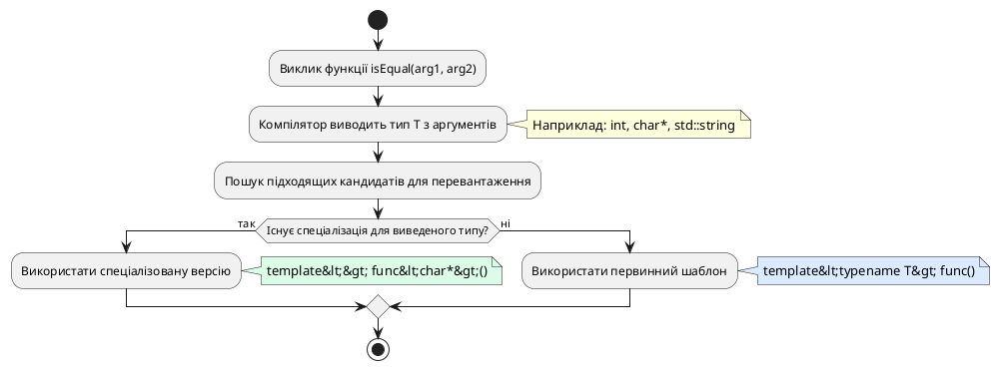
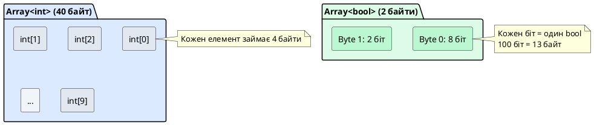
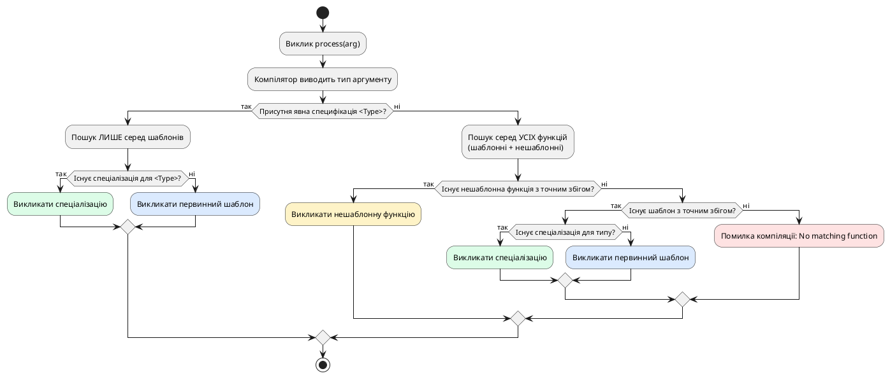
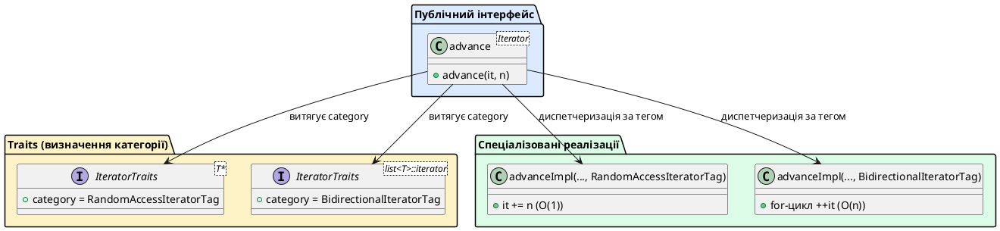

## Від узагальнення до винятків: чому одного шаблону недостатньо

На попередніх лекціях ми опанували шаблони функцій та класів — механізм написання єдиного коду, що працює з будь-якими типами. Шаблон `max<T>(T a, T b)` однаково обробляє цілі числа, рядки та власні класи, доки ці типи підтримують необхідні операції (порівняння через `operator>`).

Проте реальність складніша за ідеальні узагальнення. Іноді певний тип вимагає **радикально іншої логіки**, не обмежуючись лише оператором порівняння. Уявіть шаблон функції для порівняння рядків:

```cpp [StringComparisonProblem.cpp]
#include <iostream>
#include <cstring>

template <typename T>
bool isEqual(T a, T b)
{
    return a == b;  // Працює для int, double, std::string
}

int main()
{
    std::cout << std::boolalpha;
    
    // ✅ Працює для примітивних типів
    std::cout << isEqual(42, 42) << "\n";        // true
    std::cout << isEqual(3.14, 2.71) << "\n";    // false
    
    // ⚠️ Проблема: C-стилі рядки (char*)
    const char* str1 = "hello";
    const char* str2 = "hello";
    
    // ❌ Порівнює АДРЕСИ покажчиків, а не вміст рядків
    std::cout << isEqual(str1, str2) << "\n";    // false (хоча рядки ідентичні)
    
    return 0;
}
```

::terminal-preview{title="./StringComparisonProblem"}

<div class="line">true</div>
<div class="line">false</div>
<div class="line">false</div>

::

**Коріння проблеми:** Для типу `char*` компілятор генерує `isEqual<char*>`, де `a == b` порівнює **адреси покажчиків**, а не вміст рядків у пам'яті. Два різних літерали `"hello"` зберігаються у різних адресах, тому результат `false`.

**Наївне рішення** — перевантажити функцію:

```cpp
bool isEqual(const char* a, const char* b)
{
    return std::strcmp(a, b) == 0;
}
```

Це працює, але руйнує узагальненість: тепер ми маємо **дві функції** — шаблонну для більшості типів і спеціалізовану для рядків. Якби таких винятків було 10, ми б отримали 10 окремих перевантажень, що суперечить ідеї шаблонів.

**Повна (явна) спеціалізація шаблонів** (*full/explicit template specialization*) розв'язує цю дилему: вона дозволяє визначити **окрему реалізацію шаблону для конкретного типу**, залишаючись у єдиній архітектурній системі узагальненого коду.

::card-group

::card{title="🎯 Мета лекції" icon="i-lucide-target"}

- Опанувати синтаксис повної спеціалізації: `template<> ReturnType func<Type>(...)`
- Зрозуміти механізм вибору компілятора: коли викликається спеціалізація, коли загальний шаблон
- Навчитися створювати спеціалізовані версії функцій та класів для конкретних типів
- Дослідити пріоритети розв'язання імен: спеціалізація → базовий шаблон → звичайні функції
- Розібрати типові архітектурні патерни: оптимізація за типом, типобезпечні контейнери, метапрограмування

::

::card{title="🔑 Ключові терміни" icon="i-lucide-key"}

- **Повна (явна) спеціалізація** (*full/explicit specialization*): визначення спеціальної версії шаблону функції або класу для конкретного типу чи набору типів
- **Первинний (базовий) шаблон** (*primary template*): оригінальне узагальнене визначення `template <typename T>`
- **Спеціалізована версія** (*specialized version*): альтернативна реалізація для конкретного типу `template<> func<char*>`
- **Пріоритет розв'язання імен** (*name resolution priority*): порядок, у якому компілятор обирає між спеціалізацією, базовим шаблоном та перевантаженнями
- **Синтаксис порожнього списку параметрів** (*empty template parameter list*): запис `template<>`, що сигналізує про спеціалізацію

::

::

## Синтаксис повної спеціалізації функцій

### Базова структура: первинний шаблон та спеціалізація

Повна спеціалізація шаблону функції складається з двох компонентів:

1. **Первинний (базовий) шаблон** — узагальнене визначення для будь-якого типу `T`
2. **Спеціалізована версія** — окрема реалізація для конкретного типу, наприклад `char*`

```cpp [TemplateSpecializationSyntax.cpp]
#include <iostream>
#include <cstring>

// ═════════════════════════════════════════════════════════════
// 1. ПЕРВИННИЙ ШАБЛОН (Primary Template)
// ═════════════════════════════════════════════════════════════
template <typename T>
bool isEqual(T a, T b)
{
    std::cout << "[Загальний шаблон викликаний]\n";
    return a == b;
}

// ═════════════════════════════════════════════════════════════
// 2. ПОВНА СПЕЦІАЛІЗАЦІЯ для char* (Full Specialization)
// ═════════════════════════════════════════════════════════════
template <>
bool isEqual<char*>(char* a, char* b)
{
    std::cout << "[Спеціалізація для char* викликана]\n";
    return std::strcmp(a, b) == 0;
}

int main()
{
    std::cout << std::boolalpha;
    
    // Виклик загального шаблону для int
    std::cout << "isEqual(10, 10): " << isEqual(10, 10) << "\n\n";
    
    // Виклик спеціалізації для char*
    char str1[] = "hello";
    char str2[] = "hello";
    std::cout << "isEqual(str1, str2): " << isEqual(str1, str2) << "\n";
    
    return 0;
}
```

::terminal-preview{title="./TemplateSpecializationSyntax"}

<div class="line">[Загальний шаблон викликаний]</div>
<div class="line">isEqual(10, 10): true</div>
<div class="line"></div>
<div class="line">[Спеціалізація для char* викликана]</div>
<div class="line">isEqual(str1, str2): true</div>

::

**Розбір синтаксису спеціалізації:**

```cpp
template <>                     // Порожній список параметрів шаблону
bool isEqual<char*>(char* a, char* b)
//           ^^^^^^^ Явна вказівка типу
{
    // Реалізація, специфічна для char*
}
```

1. **`template <>`** — порожній список кутових дужок сигналізує компілятору: «це спеціалізація, а не новий шаблон»
2. **`isEqual<char*>`** — явна вказівка типу, для якого створюється спеціалізація
3. **Параметри** — мають відповідати сигнатурі первинного шаблону, але з підставленим конкретним типом (`char*` замість `T`)

::note
**Історична нота:** Синтаксис `template <>` введено у стандарті C++98 для розмежування спеціалізації від часткової спеціалізації (*partial specialization*), яка використовує непорожній список параметрів типу `template <typename U>`.

::


### Автоматичне виведення типу у спеціалізації

У прикладі вище ми явно вказали `<char*>` у визначенні спеціалізації. Однак компілятор C++ може автоматично вивести тип із сигнатури параметрів, дозволяючи опустити явну специфікацію:

::::code-group

:::code-block{label="Явна специфікація типу (verbose)" active}
```cpp
template <>
bool isEqual<char*>(char* a, char* b)
{
    return std::strcmp(a, b) == 0;
}
```
:::

:::code-block{label="Автоматичне виведення (concise)"}
```cpp
template <>
bool isEqual(char* a, char* b)
{
    return std::strcmp(a, b) == 0;
}
```
:::

::::

Обидва варіанти семантично ідентичні. Сучасна практика віддає перевагу **автоматичному виведенню** (без `<char*>`), оскільки воно:

- Зменшує дублювання інформації
- Підтримує рефакторинг (зміна типу параметра автоматично оновлює спеціалізацію)
- Відповідає конвенціям Стандартної бібліотеки C++

::tip{icon="lucide:lightbulb"}
**Стилістична рекомендація:** Використовуйте явну специфікацію `<Type>` лише у випадках, коли тип **не може** бути виведений автоматично — наприклад, коли функція не має параметрів або повертає `void`. У всіх інших ситуаціях віддавайте перевагу компактнішому синтаксису без `<>`.

::

### Обмеження та правила спеціалізації функцій

Повна спеціалізація накладає кілька фундаментальних обмежень, пов'язаних із моделлю інстанціювання шаблонів у C++:

::warning{icon="lucide:alert-triangle"}
**КРИТИЧНЕ ПРАВИЛО:** Спеціалізація функції **не є перевантаженням** (*overload*). Це альтернативне визначення **існуючого шаблону** для конкретного набору аргументів. Компілятор спочатку обирає шаблон на етапі розв'язання перевантаження (*overload resolution*), а потім перевіряє, чи існує спеціалізація для виведеного типу.

::

**Наслідки:**

1. **Первинний шаблон має існувати** — спеціалізація без базового шаблону спричинює помилку компіляції:

```cpp
// ❌ ПОМИЛКА: немає базового шаблону для спеціалізації
template <>
void process<int>(int x) { }
```

2. **Сигнатура параметрів має збігатися** — спеціалізація не може змінювати кількість або порядок параметрів:

```cpp
template <typename T>
void func(T a, T b) { }

// ❌ ПОМИЛКА: сигнатура не збігається (три параметри)
template <>
void func<int>(int a, int b, int c) { }
```

3. **Тип повернення має відповідати** — спеціалізація успадковує тип повернення первинного шаблону:

```cpp
template <typename T>
T getValue() { return T{}; }

// ❌ ПОМИЛКА: первинний шаблон повертає T (double), а спеціалізація — int
template <>
int getValue<double>() { return 42; }
```

::plant-uml{alt="Процес розв'язання імен при спеціалізації"}



::

### Спеціалізація для const та покажчиків

Спеціалізація розрізняє кваліфікатори типу (`const`, `volatile`) та рівні посередності покажчиків (`*`, `**`). Це дозволяє створювати окремі версії для `int`, `const int`, `int*`, `const int*` тощо.

```cpp [ConstPointerSpecialization.cpp]
#include <iostream>

// Первинний шаблон
template <typename T>
void printType(T value)
{
    std::cout << "Загальний тип T\n";
}

// Спеціалізація для int*
template <>
void printType(int* value)
{
    std::cout << "Покажчик int*\n";
}

// Спеціалізація для const int*
template <>
void printType(const int* value)
{
    std::cout << "Константний покажчик const int*\n";
}

// Спеціалізація для int**
template <>
void printType(int** value)
{
    std::cout << "Покажчик на покажчик int**\n";
}

int main()
{
    int x = 42;
    int* px = &x;
    const int* pcx = &x;
    int** ppx = &px;
    
    printType(x);      // Загальний шаблон
    printType(px);     // Спеціалізація int*
    printType(pcx);    // Спеціалізація const int*
    printType(ppx);    // Спеціалізація int**
    
    return 0;
}
```

::terminal-preview{title="./ConstPointerSpecialization"}

<div class="line">Загальний тип T</div>
<div class="line">Покажчик int*</div>
<div class="line">Константний покажчик const int*</div>
<div class="line">Покажчик на покажчик int**</div>

::

**Важливе спостереження:** Компілятор трактує `int*`, `const int*`, `int**` як **окремі типи**, для кожного з яких може існувати власна спеціалізація. Це дозволяє реалізовувати оптимізації для конкретних рівнів посередності — наприклад, прискорена обробка одновимірних масивів (`T*`) проти багатовимірних (`T**`).

::debugger-view{title="Розташування типів у системі типів"}
::debugger-var{name="int x" type="int" value="42"}
::debugger-var{name="int* px" type="int*" value="0x7fff5fbff8ac"}
::debugger-var{name="const int* pcx" type="const int*" value="0x7fff5fbff8ac"}
::debugger-var{name="int** ppx" type="int**" value="0x7fff5fbff8a0"}
::


## Повна спеціалізація шаблонів класів

Якщо функціональні шаблони дозволяють адаптувати **алгоритми** під конкретні типи, то спеціалізація шаблонів класів відкриває можливість налаштовувати **структури даних та інваріанти** для певних типів. Це критично важливо для високопродуктивних бібліотек (STL, Boost), де один контейнер може мати радикально різну внутрішню реалізацію залежно від типу даних.

### Мотивація: оптимізація контейнера для `bool`

Розглянемо шаблонний клас динамічного масиву `Array<T>`, який зберігає елементи довільного типу:

```cpp [ArrayTemplate.cpp]
#include <iostream>

// Первинний шаблон класу
template <typename T>
class Array
{
private:
    T* m_data;
    int m_size;

public:
    Array(int size) : m_size(size)
    {
        m_data = new T[size];
        std::cout << "Масив типу T: виділено " << size * sizeof(T) << " байт\n";
    }

    ~Array()
    {
        delete[] m_data;
    }

    T& operator[](int index)
    {
        return m_data[index];
    }

    int getSize() const { return m_size; }
};

int main()
{
    Array<int> intArray(10);       // 10 * 4 = 40 байт
    Array<double> doubleArray(10); // 10 * 8 = 80 байт
    Array<bool> boolArray(10);     // 10 * 1 = 10 байт
    
    return 0;
}
```

::terminal-preview{title="./ArrayTemplate"}

<div class="line">Масив типу T: виділено 40 байт</div>
<div class="line">Масив типу T: виділено 80 байт</div>
<div class="line">Масив типу T: виділено 10 байт</div>

::

Для `Array<int>` компілятор генерує версію, де кожен елемент займає 4 байти. Для `Array<double>` — 8 байтів. Але для `Array<bool>` він виділяє **10 байтів** (по одному байту на елемент), хоча кожне булеве значення потребує лише **1 біт** (0 або 1).

Ця неефективність спонукає до створення спеціалізованої версії `Array<bool>`, яка зберігає булеві значення як **бітові прапори** у байтових комірках, зменшуючи споживання пам'яті в 8 разів:

```cpp
10 елементів bool:
  Звичайний Array<bool>: 10 байт (80 біт)
  Оптимізований Array<bool>: 2 байти (16 біт, із яких 10 використано)
```

::note
**Реальний приклад зі Стандартної бібліотеки:** Саме так влаштований `std::vector<bool>` у C++ STL. Це єдина спеціалізація серед усіх контейнерів STL, яка зберігає дані як бітові маски замість звичайного масиву. Такий підхід економить пам'ять, але вносить нюанси в роботу з ітераторами (неможливість отримати `bool&`, лише проксі-об'єкт).

::

### Синтаксис повної спеціалізації класу

Спеціалізація шаблону класу оголошується аналогічно до спеціалізації функції: через порожній список параметрів `template <>` з явною вказівкою типу у назві класу.

```cpp [ArrayBoolSpecialization.cpp]
#include <iostream>
#include <cstring>

// ═════════════════════════════════════════════════════════════
// ПЕРВИННИЙ ШАБЛОН (для всіх типів)
// ═════════════════════════════════════════════════════════════
template <typename T>
class Array
{
private:
    T* m_data;
    int m_size;

public:
    Array(int size) : m_size(size)
    {
        m_data = new T[size];
        std::cout << "[Array<T>] Виділено " << size * sizeof(T) << " байт\n";
    }

    ~Array()
    {
        delete[] m_data;
    }

    T& operator[](int index)
    {
        return m_data[index];
    }

    int getSize() const { return m_size; }
};

// ═════════════════════════════════════════════════════════════
// ПОВНА СПЕЦІАЛІЗАЦІЯ для bool
// ═════════════════════════════════════════════════════════════
template <>
class Array<bool>
{
private:
    unsigned char* m_data;  // Зберігаємо біти у байтах
    int m_size;

public:
    Array(int size) : m_size(size)
    {
        // Кількість байтів = (кількість біт + 7) / 8 (округлення вгору)
        int byteCount = (size + 7) / 8;
        m_data = new unsigned char[byteCount];
        std::memset(m_data, 0, byteCount);  // Ініціалізуємо нулями
        std::cout << "[Array<bool>] Виділено " << byteCount << " байт (бітова упаковка)\n";
    }

    ~Array()
    {
        delete[] m_data;
    }

    // Повертаємо значення біта
    bool get(int index) const
    {
        int byteIndex = index / 8;
        int bitIndex = index % 8;
        return (m_data[byteIndex] >> bitIndex) & 1;
    }

    // Встановлюємо значення біта
    void set(int index, bool value)
    {
        int byteIndex = index / 8;
        int bitIndex = index % 8;

        if (value)
            m_data[byteIndex] |= (1 << bitIndex);  // Встановити біт у 1
        else
            m_data[byteIndex] &= ~(1 << bitIndex); // Встановити біт у 0
    }

    int getSize() const { return m_size; }
};

int main()
{
    Array<int> intArray(10);
    Array<bool> boolArray(100);  // 100 біт = 13 байтів (замість 100 байт)

    // Демонстрація бітової упаковки
    boolArray.set(0, true);
    boolArray.set(50, true);
    boolArray.set(99, true);

    std::cout << "\nСтан бітів:\n";
    std::cout << "boolArray[0] = " << boolArray.get(0) << "\n";
    std::cout << "boolArray[1] = " << boolArray.get(1) << "\n";
    std::cout << "boolArray[50] = " << boolArray.get(50) << "\n";
    std::cout << "boolArray[99] = " << boolArray.get(99) << "\n";

    return 0;
}
```

::terminal-preview{title="./ArrayBoolSpecialization"}

<div class="line">[Array&lt;T&gt;] Виділено 40 байт</div>
<div class="line">[Array&lt;bool&gt;] Виділено 13 байт (бітова упаковка)</div>
<div class="line"></div>
<div class="line">Стан бітів:</div>
<div class="line">boolArray[0] = 1</div>
<div class="line">boolArray[1] = 0</div>
<div class="line">boolArray[50] = 1</div>
<div class="line">boolArray[99] = 1</div>

::

**Архітектурні відмінності спеціалізації:**

| Характеристика | Первинний `Array<T>` | Спеціалізований `Array<bool>` |
|:--------------|:---------------------|:------------------------------|
| Зберігання даних | `T* m_data` | `unsigned char* m_data` |
| Пам'ять на елемент | `sizeof(T)` байт | 1/8 байта (1 біт) |
| Доступ до елемента | `operator[]` повертає `T&` | `get()/set()` для бітових операцій |
| Складність доступу | O(1) — прямий дереференс | O(1) — побітова маска + зсув |

::plant-uml{alt="Архітектура пам'яті: Array<int> vs Array<bool>"}



::

::warning{icon="lucide:alert-triangle"}
**Втрачена можливість використання посилань:** На відміну від первинного шаблону, спеціалізація `Array<bool>` **не може** повернути `bool&` через `operator[]`, оскільки C++ не дозволяє створювати посилання на окремі біти. Натомість STL використовує проксі-об'єкт `std::vector<bool>::reference`, який емулює поведінку посилання через перевантаження операторів.

::


### Спеціалізація класу для покажчикових типів

Окрім оптимізації пам'яті, спеціалізація дозволяє впроваджувати **семантично відмінну поведінку** для певних категорій типів. Розглянемо шаблон класу `Storage<T>`, який зберігає одне значення типу `T`:

```cpp [StoragePointerSpecialization.cpp]
#include <iostream>
#include <cstring>

// ═════════════════════════════════════════════════════════════
// ПЕРВИННИЙ ШАБЛОН (для звичайних типів)
// ═════════════════════════════════════════════════════════════
template <typename T>
class Storage
{
private:
    T m_value;

public:
    Storage(const T& value) : m_value(value)
    {
        std::cout << "[Storage<T>] Збережено значення за значенням\n";
    }

    T getValue() const { return m_value; }
};

// ═════════════════════════════════════════════════════════════
// ПОВНА СПЕЦІАЛІЗАЦІЯ для char*
// ═════════════════════════════════════════════════════════════
template <>
class Storage<char*>
{
private:
    char* m_value;

public:
    // Глибоке копіювання: створюємо власну копію рядка
    Storage(const char* value)
    {
        std::cout << "[Storage<char*>] Глибоке копіювання рядка\n";
        m_value = new char[std::strlen(value) + 1];
        std::strcpy(m_value, value);
    }

    ~Storage()
    {
        std::cout << "[Storage<char*>] Звільнення пам'яті рядка\n";
        delete[] m_value;
    }

    // Заборона копіювання (для спрощення прикладу)
    Storage(const Storage&) = delete;
    Storage& operator=(const Storage&) = delete;

    const char* getValue() const { return m_value; }
};

int main()
{
    // Первинний шаблон: int зберігається за значенням
    Storage<int> intStorage(42);
    std::cout << "Значення int: " << intStorage.getValue() << "\n\n";

    // Спеціалізація: char* копіюється глибоко
    const char* originalStr = "Hello, World!";
    Storage<char*> strStorage(originalStr);
    std::cout << "Значення рядка: " << strStorage.getValue() << "\n";

    return 0;
}
```

::terminal-preview{title="./StoragePointerSpecialization"}

<div class="line">[Storage&lt;T&gt;] Збережено значення за значенням</div>
<div class="line">Значення int: 42</div>
<div class="line"></div>
<div class="line">[Storage&lt;char*&gt;] Глибоке копіювання рядка</div>
<div class="line">Значення рядка: Hello, World!</div>
<div class="line">[Storage&lt;char*&gt;] Звільнення пам'яті рядка</div>

::

**Ключові відмінності спеціалізації:**

1. **Володіння пам'яттю:** Первинний шаблон зберігає `T` за значенням (немає виділення пам'яті), тоді як спеціалізація `char*` виділяє динамічну пам'ять через `new[]` для глибокого копіювання рядка
2. **Деструктор:** Спеціалізація потребує нетривіального деструктора для звільнення `delete[]`, первинний шаблон — ні
3. **Семантика:** Для `int` зберігається значення, для `char*` — незалежна копія, що запобігає проблемам висячих покажчиків (*dangling pointers*)

::debugger-view{title="Порівняння володіння пам'яттю"}
::debugger-var{name="intStorage.m_value" type="int" value="42"}
::debugger-var{name="strStorage.m_value" type="char*" value="0x000055a2e9f5c2a0"}
::debugger-var{name="рядок Hello, World!" type="char[14]" value="copied data"}
::

### Спеціалізація методів класу: визначення поза тілом

Якщо методи первинного шаблону класу визначено поза тілом класу (у `.cpp`-файлі або після оголошення), спеціалізовані версії цих методів також мають використовувати синтаксис `template <>`:

```cpp [MethodSpecializationOutsideClass.cpp]
#include <iostream>

// ═════════════════════════════════════════════════════════════
// ПЕРВИННИЙ ШАБЛОН: оголошення класу
// ═════════════════════════════════════════════════════════════
template <typename T>
class Printer
{
public:
    void print(const T& value);  // Оголошення методу
};

// Визначення методу первинного шаблону поза класом
template <typename T>
void Printer<T>::print(const T& value)
{
    std::cout << "[Printer<T>] Значення: " << value << "\n";
}

// ═════════════════════════════════════════════════════════════
// ПОВНА СПЕЦІАЛІЗАЦІЯ для bool
// ═════════════════════════════════════════════════════════════
template <>
class Printer<bool>
{
public:
    void print(const bool& value);
};

// Визначення методу спеціалізації
template <>
void Printer<bool>::print(const bool& value)
{
    std::cout << "[Printer<bool>] Булеве значення: "
              << (value ? "true" : "false") << "\n";
}

int main()
{
    Printer<int> intPrinter;
    intPrinter.print(42);

    Printer<bool> boolPrinter;
    boolPrinter.print(true);

    return 0;
}
```

::terminal-preview{title="./MethodSpecializationOutsideClass"}

<div class="line">[Printer&lt;T&gt;] Значення: 42</div>
<div class="line">[Printer&lt;bool&gt;] Булеве значення: true</div>

::

**Важливий нюанс:** На відміну від первинного шаблону, у якого визначення методів поза класом потребує повторення `template <typename T>`, спеціалізація використовує порожній список `template <>` для підкреслення, що це **конкретна реалізація**, а не узагальнення.

::tip{icon="lucide:zap"}
**Рекомендація щодо організації коду:** Для шаблонних класів зі спеціалізаціями дотримуйтесь наступної структури у заголовковому файлі (`.hpp`):

1. Оголошення первинного шаблону
2. Визначення методів первинного шаблону
3. Оголошення спеціалізацій (одразу всіх)
4. Визначення методів спеціалізацій

Це дозволяє компілятору бачити повну картину типів до інстанціювання, запобігаючи помилкам лінкування.

::


## Пріоритети розв'язання імен: спеціалізація vs перевантаження

Одне з найтонших питань у роботі зі спеціалізацією — зрозуміти, яку версію функції обере компілятор, коли існують одночасно:

- Первинний шаблон
- Спеціалізації шаблону
- Перевантажені нешаблонні функції

Розглянемо складний випадок, де всі три сценарії присутні одночасно:

```cpp [OverloadResolutionPriority.cpp]
#include <iostream>

// ═════════════════════════════════════════════════════════════
// 1. ПЕРВИННИЙ ШАБЛОН
// ═════════════════════════════════════════════════════════════
template <typename T>
void process(T value)
{
    std::cout << "[1] Первинний шаблон: T\n";
}

// ═════════════════════════════════════════════════════════════
// 2. СПЕЦІАЛІЗАЦІЯ для int
// ═════════════════════════════════════════════════════════════
template <>
void process<int>(int value)
{
    std::cout << "[2] Спеціалізація шаблону: int\n";
}

// ═════════════════════════════════════════════════════════════
// 3. ПЕРЕВАНТАЖЕНА НЕШАБЛОННА ФУНКЦІЯ для int
// ═════════════════════════════════════════════════════════════
void process(int value)
{
    std::cout << "[3] Нешаблонна перевантажена функція: int\n";
}

int main()
{
    process(3.14);    // Випадок A: double
    process(42);      // Випадок B: int
    process<int>(42); // Випадок C: явна специфікація шаблону

    return 0;
}
```

::terminal-preview{title="./OverloadResolutionPriority"}

<div class="line">[1] Первинний шаблон: T</div>
<div class="line">[3] Нешаблонна перевантажена функція: int</div>
<div class="line">[2] Спеціалізація шаблону: int</div>

::

### Детальний розбір кожного випадку

**Випадок A: `process(3.14)` — аргумент `double`**

1. Компілятор шукає всі кандидати для виклику `process(double)`
2. Нешаблонна функція `void process(int)` **не підходить** (потрібна конвертація `double → int`)
3. Первинний шаблон `template <typename T>` **підходить** (T виводиться як `double`)
4. Спеціалізація `template <> process<int>` не розглядається (працює лише для `int`)

**Результат:** первинний шаблон `process<double>`

---

**Випадок B: `process(42)` — аргумент `int`**

1. Компілятор знаходить дві функції-кандидати:
   - Нешаблонна `void process(int)` — точний збіг (*exact match*)
   - Первинний шаблон `template <typename T>` з T=int — точний збіг після інстанціювання
2. За правилами C++, **нешаблонні функції мають пріоритет** над шаблонними при однаковій якості збігу
3. Спеціалізація `template <> process<int>` **не бере участі в розв'язанні перевантаження** — вона виступає як альтернатива первинному шаблону, але перевантаження вибирається раніше

**Результат:** нешаблонна функція

::note
**Контрінтуїтивна поведінка:** Багато розробників очікують, що спеціалізація `template <> process<int>` буде викликана для `process(42)`, але це не так. Спеціалізація розглядається **лише після** того, як розв'язання перевантаження обрало базовий шаблон. Оскільки нешаблонна версія виграла на етапі overload resolution, спеціалізація взагалі не бере участі у виборі.

::

---

**Випадок C: `process<int>(42)` — явна специфікація шаблону**

1. Запис `<int>` **явно вказує компілятору** використовувати шаблонну версію, ігноруючи нешаблонні функції
2. Компілятор шукає серед шаблонів: первинний `template <typename T>` та спеціалізація `template <> <int>`
3. Спеціалізація має абсолютний пріоритет над первинним шаблоном для конкретного типу

**Результат:** спеціалізація шаблону `process<int>`

---

### Ієрархія пріоритетів розв'язання імен

::plant-uml{alt="Дерево рішень компілятора при виборі перевантаження"}



::

**Узагальнені правила:**

1. **Явна специфікація `func<Type>()` завжди перемагає** — обходить нешаблонні перевантаження
2. **Нешаблонні функції мають пріоритет над шаблонами** при однаковій якості збігу
3. **Спеціалізація обирається замість первинного шаблону** лише якщо на етапі overload resolution переміг саме шаблон
4. **Спеціалізація НЕ бере участі в overload resolution** — це не окрема функція, а альтернативна реалізація шаблону

::warning{icon="lucide:alert-triangle"}
**Типова пастка:** Якщо ви створили спеціалізацію `template <> func<int>()`, але також маєте нешаблонну `func(int)`, остання завжди викликається для `func(42)`. Щоб форсувати спеціалізацію, використовуйте `func<int>(42)` або видаліть нешаблонну версію.

::

### Практичний висновок: коли використовувати спеціалізацію, а коли перевантаження

Вибір між спеціалізацією та перевантаженням залежить від архітектурного контексту:

::::code-group

:::code-block{label="Використовуйте СПЕЦІАЛІЗАЦІЮ" active}
```cpp
// ✅ Коли логіка функції семантично ідентична,
//    але реалізація відрізняється для конкретного типу

template <typename T>
void serialize(const T& obj, std::ostream& out) {
    // Загальна серіалізація через operator<<
    out << obj;
}

template <>
void serialize<std::vector<int>>(const std::vector<int>& vec, std::ostream& out) {
    // Спеціалізована серіалізація для вектора
    out << "[";
    for (size_t i = 0; i < vec.size(); ++i) {
        out << vec[i];
        if (i < vec.size() - 1) out << ", ";
    }
    out << "]";
}
```
:::

:::code-block{label="Використовуйте ПЕРЕВАНТАЖЕННЯ"}
```cpp
// ✅ Коли функція має РІЗНУ семантику для різних типів

// Обчислення площі кола
double area(double radius) {
    return 3.14159 * radius * radius;
}

// Обчислення площі прямокутника
double area(double width, double height) {
    return width * height;
}

// Це НЕ шаблон — різні алгоритми, різні параметри
```
:::

::::

**Золоте правило:** Якщо ваша функція виконує **одну й ту ж задачу** (порівняння, сортування, серіалізацію), але потребує оптимізації чи адаптації для окремих типів — використовуйте спеціалізацію. Якщо функції мають **різне призначення** або різні параметри — використовуйте перевантаження.


## Архітектурні патерни повної спеціалізації

Повна спеціалізація шаблонів — це не лише технічний інструмент для оптимізацій, а й фундамент для створення типобезпечних, розширюваних архітектур. Розглянемо три найпоширеніші патерни, що використовуються в промисловому C++.

### Патерн 1: Type Traits (метапрограмування на рівні типів)

**Type Traits** — це техніка використання спеціалізації для витягування інформації про типи на етапі компіляції. Стандартна бібліотека `<type_traits>` побудована на цій ідеї.

Створимо власний trait для визначення, чи є тип примітивним (*fundamental type*):

```cpp [TypeTraitsPattern.cpp]
#include <iostream>

// ═════════════════════════════════════════════════════════════
// ПЕРВИННИЙ ШАБЛОН: за замовчуванням всі типи НЕ примітивні
// ═════════════════════════════════════════════════════════════
template <typename T>
struct IsFundamental
{
    static constexpr bool value = false;
};

// ═════════════════════════════════════════════════════════════
// СПЕЦІАЛІЗАЦІЇ для примітивних типів
// ═════════════════════════════════════════════════════════════
template <>
struct IsFundamental<int>
{
    static constexpr bool value = true;
};

template <>
struct IsFundamental<double>
{
    static constexpr bool value = true;
};

template <>
struct IsFundamental<char>
{
    static constexpr bool value = true;
};

template <>
struct IsFundamental<bool>
{
    static constexpr bool value = true;
};

// Допоміжна функція для зручного виведення
template <typename T>
void checkType()
{
    if constexpr (IsFundamental<T>::value)
        std::cout << "Тип є примітивним\n";
    else
        std::cout << "Тип НЕ є примітивним\n";
}

// Власний клас для тестування
class MyClass {};

int main()
{
    std::cout << "int: ";
    checkType<int>();  // Примітивний

    std::cout << "double: ";
    checkType<double>();  // Примітивний

    std::cout << "MyClass: ";
    checkType<MyClass>();  // Не примітивний

    std::cout << "int*: ";
    checkType<int*>();  // Не примітивний (покажчик)

    return 0;
}
```

::terminal-preview{title="./TypeTraitsPattern"}

<div class="line">int: Тип є примітивним</div>
<div class="line">double: Тип є примітивним</div>
<div class="line">MyClass: Тип НЕ є примітивним</div>
<div class="line">int*: Тип НЕ є примітивним</div>

::

**Як це працює:**

1. **Первинний шаблон** встановлює `value = false` для всіх типів
2. **Спеціалізації** перевизначають `value = true` для кожного примітивного типу
3. Під час компіляції компілятор обирає спеціалізацію (якщо існує) або первинний шаблон

**Реальне застосування у STL:**

```cpp
#include <type_traits>

static_assert(std::is_fundamental<int>::value == true);
static_assert(std::is_fundamental<std::string>::value == false);

// Умовна компіляція на основі типу
template <typename T>
void process(T value)
{
    if constexpr (std::is_pointer<T>::value)
        std::cout << "Обробка покажчика\n";
    else
        std::cout << "Обробка значення\n";
}
```

::tip{icon="lucide:cpu"}
**Потужність метапрограмування:** Type traits дозволяють створювати **узагальнені алгоритми**, що адаптуються до властивостей типів під час компіляції. Це нульові витрати часу виконання (*zero-overhead*) — всі рішення приймаються компілятором, породжуючи оптимальний машинний код.

::

### Патерн 2: Policy-Based Design (стратегії через спеціалізацію)

**Policy-Based Design** — архітектурний підхід, де поведінка класу налаштовується через параметри-типи, які визначають «політику» (стратегію) обробки даних. Спеціалізація дозволяє створювати різні стратегії для різних типів.

Створимо клас `SmartPointer<T>`, що автоматично звільняє пам'ять, але має різні стратегії для масивів та одиночних об'єктів:

```cpp [PolicyBasedDesign.cpp]
#include <iostream>

// ═════════════════════════════════════════════════════════════
// FIRST POLICY: звільнення одиночного об'єкта
// ═════════════════════════════════════════════════════════════
template <typename T>
struct SingleObjectPolicy
{
    static void destroy(T* ptr)
    {
        std::cout << "[SingleObjectPolicy] delete ptr\n";
        delete ptr;
    }
};

// ═════════════════════════════════════════════════════════════
// SECOND POLICY: звільнення масиву
// ═════════════════════════════════════════════════════════════
template <typename T>
struct ArrayPolicy
{
    static void destroy(T* ptr)
    {
        std::cout << "[ArrayPolicy] delete[] ptr\n";
        delete[] ptr;
    }
};

// ═════════════════════════════════════════════════════════════
// Клас SmartPointer із налаштовуваною політикою
// ═════════════════════════════════════════════════════════════
template <typename T, typename Policy = SingleObjectPolicy<T>>
class SmartPointer
{
private:
    T* m_ptr;

public:
    explicit SmartPointer(T* ptr = nullptr) : m_ptr(ptr) {}

    ~SmartPointer()
    {
        Policy::destroy(m_ptr);
    }

    T& operator*() { return *m_ptr; }
    T* operator->() { return m_ptr; }

    // Заборона копіювання (для спрощення прикладу)
    SmartPointer(const SmartPointer&) = delete;
    SmartPointer& operator=(const SmartPointer&) = delete;
};

int main()
{
    // Одиночний об'єкт: використовуємо SingleObjectPolicy (за замовчуванням)
    SmartPointer<int> ptr1(new int(42));

    // Масив: явно вказуємо ArrayPolicy
    SmartPointer<int, ArrayPolicy<int>> ptr2(new int[10]);

    // Деструктори викличуться автоматично при виході зі scope

    return 0;
}
```

::terminal-preview{title="./PolicyBasedDesign"}

<div class="line">[ArrayPolicy] delete[] ptr</div>
<div class="line">[SingleObjectPolicy] delete ptr</div>

::

**Переваги Policy-Based Design:**

- **Гнучкість:** одна кодова база підтримує різні стратегії без дублювання логіки
- **Ефективність:** компілятор генерує оптимальний код для кожної політики (немає віртуальних викликів)
- **Розширюваність:** легко додати нову політику, не змінюючи клас `SmartPointer`

::note
**Зв'язок із стандартною бібліотекою:** Розумні покажчики `std::unique_ptr<T>` та `std::unique_ptr<T[]>` реалізовані аналогічним чином — спеціалізація `std::unique_ptr<T[]>` використовує `delete[]` замість `delete`.

::

### Патерн 3: Tag Dispatching (виклик на основі типу-тегу)

**Tag Dispatching** — техніка, де спеціалізовані порожні структури (*tag types*) використовуються для вибору реалізації алгоритму на етапі компіляції. Це дозволяє уникати `if constexpr` або SFINAE у складних випадках.

Створимо функцію `advance()`, що пересуває ітератор на N позицій, але з різною реалізацією для різних категорій ітераторів:

```cpp [TagDispatching.cpp]
#include <iostream>
#include <vector>
#include <list>

// ═════════════════════════════════════════════════════════════
// ТЕГИ ДЛЯ КАТЕГОРІЙ ІТЕРАТОРІВ
// ═════════════════════════════════════════════════════════════
struct RandomAccessIteratorTag {};
struct BidirectionalIteratorTag {};

// ═════════════════════════════════════════════════════════════
// TRAIT: визначення категорії ітератора
// ═════════════════════════════════════════════════════════════
template <typename Iterator>
struct IteratorTraits;

// Спеціалізація для покажчиків (random access)
template <typename T>
struct IteratorTraits<T*>
{
    using category = RandomAccessIteratorTag;
};

// Спеціалізація для std::list::iterator (bidirectional)
template <typename T>
struct IteratorTraits<typename std::list<T>::iterator>
{
    using category = BidirectionalIteratorTag;
};

// ═════════════════════════════════════════════════════════════
// РЕАЛІЗАЦІЇ для різних категорій
// ═════════════════════════════════════════════════════════════

// Random Access: O(1) — пряме додавання
template <typename Iterator>
void advanceImpl(Iterator& it, int n, RandomAccessIteratorTag)
{
    std::cout << "[Random Access] it += n (O(1))\n";
    it += n;
}

// Bidirectional: O(n) — послідовна інкрементація
template <typename Iterator>
void advanceImpl(Iterator& it, int n, BidirectionalIteratorTag)
{
    std::cout << "[Bidirectional] Цикл ++it (O(n))\n";
    for (int i = 0; i < n; ++i)
        ++it;
}

// ═════════════════════════════════════════════════════════════
// ПУБЛІЧНИЙ ІНТЕРФЕЙС: автоматичний вибір реалізації
// ═════════════════════════════════════════════════════════════
template <typename Iterator>
void advance(Iterator& it, int n)
{
    using Category = typename IteratorTraits<Iterator>::category;
    advanceImpl(it, n, Category{});  // Створюємо тимчасовий об'єкт-тег
}

int main()
{
    // Random Access ітератор (покажчик)
    int arr[] = {1, 2, 3, 4, 5};
    int* ptr = arr;
    advance(ptr, 3);
    std::cout << "Значення після advance: " << *ptr << "\n\n";

    // Bidirectional ітератор (std::list)
    std::list<int> lst = {10, 20, 30, 40, 50};
    auto it = lst.begin();
    advance(it, 2);
    std::cout << "Значення після advance: " << *it << "\n";

    return 0;
}
```

::terminal-preview{title="./TagDispatching"}

<div class="line">[Random Access] it += n (O(1))</div>
<div class="line">Значення після advance: 4</div>
<div class="line"></div>
<div class="line">[Bidirectional] Цикл ++it (O(n))</div>
<div class="line">Значення після advance: 30</div>

::

**Як це працює:**

1. **Trait визначає категорію** ітератора через спеціалізацію: `RandomAccessIteratorTag` або `BidirectionalIteratorTag`
2. **Публічна функція `advance()`** створює об'єкт-тег на основі категорії: `Category{}`
3. **Компілятор обирає правильну реалізацію** `advanceImpl()` на основі типу тегу (розв'язання перевантаження)
4. **Нульові витрати:** порожній об'єкт-тег не займає пам'яті, оптимізатор його видаляє

::plant-uml{alt="Архітектура Tag Dispatching"}



::

**Реальне застосування у STL:**

Функції `std::advance()`, `std::distance()`, `std::next()` у заголовку `<iterator>` використовують саме цей підхід для оптимізації під різні категорії ітераторів (Input, Forward, Bidirectional, Random Access, Contiguous).

::tip{icon="lucide:workflow"}
**Переваги перед `if constexpr`:** Tag Dispatching зберігає чистоту інтерфейсу (одна публічна функція без розгалужень) та дозволяє користувачам легко додавати власні категорії, перевантажуючи `advanceImpl()` для нових тегів.

::


## Обмеження та підводні камені повної спеціалізації

Незважаючи на потужність механізму, повна спеціалізація шаблонів має кілька фундаментальних обмежень та непередбачуваних ситуацій, про які критично важливо знати при проєктуванні архітектури.

### Проблема 1: спеціалізація не бере участі в overload resolution

Як ми розглянули раніше, спеціалізація функції **не є перевантаженням** — це альтернативна реалізація існуючого шаблону. Це призводить до контрінтуїтивної поведінки, коли спеціалізація ігнорується на користь перевантаженої версії:

```cpp [OverloadVsSpecialization.cpp]
#include <iostream>

// Первинний шаблон
template <typename T>
void func(T value)
{
    std::cout << "[1] Шаблон T\n";
}

// Спеціалізація для int*
template <>
void func<int*>(int* value)
{
    std::cout << "[2] Спеціалізація int*\n";
}

// Перевантажена шаблонна функція для всіх покажчиків
template <typename T>
void func(T* value)
{
    std::cout << "[3] Шаблон T* (перевантаження)\n";
}

int main()
{
    int x = 42;
    int* px = &x;

    func(px);  // Що викличеться: [2] чи [3]?

    return 0;
}
```

::terminal-preview{title="./OverloadVsSpecialization"}

<div class="line">[3] Шаблон T* (перевантаження)</div>

::

**Що сталося:**

1. Компілятор знаходить **дві шаблонні функції**: `func(T)` та `func(T*)`
2. Для аргументу `int*` краще підходить `func(T*)` (більш специфічний шаблон)
3. Обравши `func(T*)`, компілятор шукає його спеціалізації — але спеціалізація `template <> func<int*>` прив'язана до `func(T)`, а не до `func(T*)`
4. Викликається перевантаження `func(T*)` без будь-яких спеціалізацій

::warning{icon="lucide:alert-triangle"}
**Рекомендація:** Якщо потрібна особлива поведінка для покажчиків, створюйте **перевантаження**, а не спеціалізацію первинного шаблону. Спеціалізація повинна використовуватися лише коли ви **точно знаєте**, що буде обрано саме первинний шаблон.

::

### Проблема 2: неможливість часткової спеціалізації функцій

C++ **не підтримує** часткову спеціалізацію (*partial specialization*) для функцій — лише для класів. Це означає, що ви не можете написати щось на кшталт:

```cpp
// ❌ ПОМИЛКА КОМПІЛЯЦІЇ: часткова спеціалізація функцій заборонена
template <typename T>
void process(T value) { /* ... */ }

template <typename T>
void process<T*>(T* value) { /* Намагаємося спеціалізувати для всіх покажчиків */ }
```

**Обхідний шлях:** Використовуйте **перевантаження** або **tag dispatching**:

::::code-group

:::code-block{label="Перевантаження (рекомендовано)" active}
```cpp
// Первинний шаблон для значень
template <typename T>
void process(T value) {
    std::cout << "Обробка значення\n";
}

// Перевантаження для покажчиків
template <typename T>
void process(T* value) {
    std::cout << "Обробка покажчика\n";
}
```
:::

:::code-block{label="Tag Dispatching (складніше)"}
```cpp
template <typename T>
void processImpl(T value, std::false_type /* not pointer */) {
    std::cout << "Обробка значення\n";
}

template <typename T>
void processImpl(T value, std::true_type /* is pointer */) {
    std::cout << "Обробка покажчика\n";
}

template <typename T>
void process(T value) {
    processImpl(value, std::is_pointer<T>{});
}
```
:::

::::

### Проблема 3: порядок оголошень має значення

Якщо компілятор побачить виклик шаблону **до** того, як побачить спеціалізацію, він заінстанціює первинний шаблон, і спеціалізація вже не застосується:

```cpp [DeclarationOrderMatter.cpp]
#include <iostream>

// Первинний шаблон
template <typename T>
void print(T value)
{
    std::cout << "[Primary] " << value << "\n";
}

// ═════════════════════════════════════════════════════════════
// ТОЧКА ІНСТАНЦІЮВАННЯ 1: компілятор бачить лише первинний шаблон
// ═════════════════════════════════════════════════════════════
void earlyCall()
{
    print(42);  // Інстанціює print<int> із первинного шаблону
}

// ═════════════════════════════════════════════════════════════
// Спеціалізація оголошена ПІСЛЯ першого виклику
// ═════════════════════════════════════════════════════════════
template <>
void print<int>(int value)
{
    std::cout << "[Specialization] " << value << "\n";
}

// ═════════════════════════════════════════════════════════════
// ТОЧКА ІНСТАНЦІЮВАННЯ 2: тепер спеціалізація видима
// ═════════════════════════════════════════════════════════════
void lateCall()
{
    print(42);  // Використовує спеціалізацію
}

int main()
{
    std::cout << "Ранній виклик:\n";
    earlyCall();

    std::cout << "\nПізній виклик:\n";
    lateCall();

    return 0;
}
```

::terminal-preview{title="./DeclarationOrderMatter"}

<div class="line">Ранній виклик:</div>
<div class="line">[Primary] 42</div>
<div class="line"></div>
<div class="line">Пізній виклик:</div>
<div class="line">[Specialization] 42</div>

::

::caution{icon="lucide:shield-alert"}
**Критичне правило організації коду:** Завжди розміщуйте **всі спеціалізації** безпосередньо після оголошення первинного шаблону у заголовковому файлі, до будь-яких викликів. Інакше різні частини програми можуть побачити різні версії функції, що призведе до порушення **One Definition Rule (ODR)** та невизначеної поведінки.

::

**Рекомендована структура заголовка:**

```cpp
// MyTemplate.hpp

// 1. Первинний шаблон
template <typename T>
void func(T value) { /* ... */ }

// 2. ВСІ спеціалізації одразу після первинного шаблону
template <> void func<int>(int value) { /* ... */ }
template <> void func<char*>(char* value) { /* ... */ }
template <> void func<bool>(bool value) { /* ... */ }

// 3. Решта коду, що викликає func()
```

### Проблема 4: розмір бінарного файлу (code bloat)

Кожна спеціалізація генерує **окрему функцію** в об'єктному файлі. Якщо ви створили спеціалізації для 20 типів, ви отримаєте 20 копій практично ідентичного машинного коду:

```cpp
template <typename T> void func(T) { /* ... */ }

template <> void func<int>(int) { /* ... */ }       // +50 байт у бінарнику
template <> void func<double>(double) { /* ... */ } // +50 байт
template <> void func<char>(char) { /* ... */ }     // +50 байт
// ... (ще 17 типів)
// Підсумок: +1000 байт лише на одну функцію
```

::tip{icon="lucide:hard-drive"}
**Оптимізація:** Якщо спеціалізації відрізняються лише одним блоком коду, винесіть спільну логіку у **нешаблонну допоміжну функцію**, а у спеціалізаціях залишіть лише унікальні частини. Це дозволить лінкеру об'єднати повторювані фрагменти через ідентичний machine code (Link-Time Optimization / ICF).

::


## Практичне завдання: система серіалізації з типоспецифічними форматами

::::accordion

:::accordion-item{label="📋 Завдання: розробка гнучкої системи серіалізації" icon="i-lucide-clipboard-list"}

Реалізуйте шаблонну систему серіалізації `Serializer<T>`, яка перетворює об'єкти у текстовий формат для збереження у файлах або передачі по мережі. Система має підтримувати:

1. **Первинний шаблон**: для довільних типів використовує `operator<<` для запису у `std::ostream`
2. **Спеціалізація для `bool`**: виводить `"true"` або `"false"` (замість `1` / `0`)
3. **Спеціалізація для C-стилю рядків `char*`**: виводить у лапках `"..."` та екранує спеціальні символи (`\n` → `\\n`)
4. **Спеціалізація для масивів `int[N]`**: виводить у форматі JSON-масиву `[1, 2, 3]`

**Приклад використання:**

```cpp
int main()
{
    Serializer<int> intSerializer;
    intSerializer.serialize(std::cout, 42);
    std::cout << "\n";

    Serializer<bool> boolSerializer;
    boolSerializer.serialize(std::cout, true);
    std::cout << "\n";

    Serializer<char*> strSerializer;
    const char* text = "Hello\nWorld";
    strSerializer.serialize(std::cout, text);
    std::cout << "\n";

    Serializer<int[5]> arraySerializer;
    int arr[] = {10, 20, 30, 40, 50};
    arraySerializer.serialize(std::cout, arr);
    std::cout << "\n";

    return 0;
}
```

**Очікуваний вивід:**

```
42
true
"Hello\\nWorld"
[10, 20, 30, 40, 50]
```

:::

:::accordion-item{label="✅ Розв'язок" icon="i-lucide-check-circle"}

```cpp
#include <iostream>
#include <cstring>

// ═════════════════════════════════════════════════════════════
// ПЕРВИННИЙ ШАБЛОН: стандартна серіалізація через operator<<
// ═════════════════════════════════════════════════════════════
template <typename T>
class Serializer
{
public:
    void serialize(std::ostream& out, const T& value) const
    {
        out << value;
    }
};

// ═════════════════════════════════════════════════════════════
// СПЕЦІАЛІЗАЦІЯ для bool: "true" / "false"
// ═════════════════════════════════════════════════════════════
template <>
class Serializer<bool>
{
public:
    void serialize(std::ostream& out, const bool& value) const
    {
        out << (value ? "true" : "false");
    }
};

// ═════════════════════════════════════════════════════════════
// СПЕЦІАЛІЗАЦІЯ для char*: рядок у лапках з екрануванням
// ═════════════════════════════════════════════════════════════
template <>
class Serializer<char*>
{
public:
    void serialize(std::ostream& out, const char* value) const
    {
        out << '"';
        for (const char* p = value; *p != '\0'; ++p)
        {
            switch (*p)
            {
                case '\n': out << "\\n"; break;
                case '\t': out << "\\t"; break;
                case '\\': out << "\\\\"; break;
                case '"':  out << "\\\""; break;
                default:   out << *p;
            }
        }
        out << '"';
    }
};

// ═════════════════════════════════════════════════════════════
// СПЕЦІАЛІЗАЦІЯ для масивів int[N]: JSON-формат [1, 2, 3]
// ═════════════════════════════════════════════════════════════
template <int N>
class Serializer<int[N]>
{
public:
    void serialize(std::ostream& out, const int (&arr)[N]) const
    {
        out << "[";
        for (int i = 0; i < N; ++i)
        {
            out << arr[i];
            if (i < N - 1)
                out << ", ";
        }
        out << "]";
    }
};

int main()
{
    std::cout << "Серіалізація примітивних типів:\n";

    Serializer<int> intSerializer;
    intSerializer.serialize(std::cout, 42);
    std::cout << "\n";

    Serializer<double> doubleSerializer;
    doubleSerializer.serialize(std::cout, 3.14159);
    std::cout << "\n\n";

    std::cout << "Спеціалізація для bool:\n";
    Serializer<bool> boolSerializer;
    boolSerializer.serialize(std::cout, true);
    std::cout << " | ";
    boolSerializer.serialize(std::cout, false);
    std::cout << "\n\n";

    std::cout << "Спеціалізація для char* (із екрануванням):\n";
    Serializer<char*> strSerializer;
    const char* text = "Hello\nWorld\t!";
    strSerializer.serialize(std::cout, text);
    std::cout << "\n\n";

    std::cout << "Спеціалізація для масиву int[N]:\n";
    Serializer<int[5]> arraySerializer;
    int arr[] = {10, 20, 30, 40, 50};
    arraySerializer.serialize(std::cout, arr);
    std::cout << "\n";

    return 0;
}
```

::terminal-preview{title="./SerializerSystem"}

<div class="line">Серіалізація примітивних типів:</div>
<div class="line">42</div>
<div class="line">3.14159</div>
<div class="line"></div>
<div class="line">Спеціалізація для bool:</div>
<div class="line">true | false</div>
<div class="line"></div>
<div class="line">Спеціалізація для char* (із екрануванням):</div>
<div class="line">"Hello\nWorld\t!"</div>
<div class="line"></div>
<div class="line">Спеціалізація для масиву int[N]:</div>
<div class="line">[10, 20, 30, 40, 50]</div>

::

**Архітектурні деталі розв'язку:**

1. **Первинний шаблон** покладається на `operator<<`, що вже перевантажено для більшості стандартних типів (`int`, `double`, `std::string` тощо)
2. **Спеціалізація `bool`** забезпечує читабельний вивід замість числових `1` / `0`, що критично для конфігураційних файлів
3. **Спеціалізація `char*`** реалізує екранування спеціальних символів через `switch`, забезпечуючи коректну десеріалізацію
4. **Спеціалізація масивів** демонструює **NTTP-параметр `int N`** для автоматичного виведення розміру масиву на етапі компіляції

::note
**Розширення системи:** Для підтримки `const char*` можна додати ще одну спеціалізацію або використати `std::remove_const` у trait для зведення `const char*` до `char*`. Для складних контейнерів (`std::vector`, `std::map`) знадобиться **рекурсивна серіалізація** через спеціалізації із викликами `serialize()` для вкладених елементів.

::

:::

::::

## Питання для самоперевірки

::::accordion

:::accordion-item{label="❓ Чим повна спеціалізація відрізняється від перевантаження функції?" icon="i-lucide-help-circle"}

**Ключова відмінність:** Перевантаження (*overload*) створює **нову функцію** з іншою сигнатурою (різна кількість параметрів, різні типи), тоді як спеціалізація (*specialization*) створює **альтернативну реалізацію існуючого шаблону** для конкретного типу.

**Участь у розв'язанні імен:**
- Перевантаження беруть участь у *overload resolution* — компілятор обирає найкращий збіг серед усіх функцій
- Спеціалізація **не бере участі** в overload resolution — компілятор спочатку обирає шаблон, а потім перевіряє, чи існує спеціалізація для виведеного типу

**Приклад:**

```cpp
template <typename T>
void func(T value) { /* шаблон */ }

template <>
void func<int>(int value) { /* спеціалізація */ }

void func(int value) { /* перевантаження */ }

func(42);  // Викличе перевантаження, а не спеціалізацію!
```

:::

:::accordion-item{label="❓ Чому спеціалізація `template <> func<int*>` може не викликатися для `int*`?" icon="i-lucide-help-circle"}

Якщо існує **перевантажений шаблон** `template <typename T> func(T*)`, компілятор на етапі overload resolution обере його як більш специфічний, ніж первинний шаблон `func(T)`. Оскільки спеціалізація `func<int*>` прив'язана до `func(T)`, а не до `func(T*)`, вона **не застосується**.

**Розв'язання:**
- Створити спеціалізацію для `func(T*)`: `template <> func<int>(int*)`
- Або видалити перевантаження `func(T*)`, залишивши лише первинний шаблон

:::

:::accordion-item{label="❓ Що станеться, якщо оголосити спеціалізацію після виклику шаблону?" icon="i-lucide-help-circle"}

Компілятор заінстанціює **первинний шаблон** у точці виклику, і спеціалізація, оголошена пізніше, вже не застосується до цього виклику. Це може призвести до:

1. **Неконсистентної поведінки:** різні частини програми бачать різні версії функції
2. **Порушення ODR (One Definition Rule):** якщо один файл використовує первинний шаблон, а інший — спеціалізацію для того ж типу
3. **Невизначеної поведінки (*undefined behavior*)** у складних випадках

**Рішення:** Завжди розміщувати спеціалізації безпосередньо після первинного шаблону у заголовковому файлі.

:::

:::accordion-item{label="❓ Чому для `std::vector<bool>` не можна отримати `bool&` через `operator[]`?" icon="i-lucide-help-circle"}

`std::vector<bool>` — це **спеціалізація** стандартного `std::vector<T>`, яка зберігає булеві значення як **біти** у байтових комірках (оптимізація пам'яті в 8 разів). Оскільки C++ не дозволяє створювати **посилання на біти** (`bool&` потребує адреси, а біт не має адреси), спеціалізація повертає **проксі-об'єкт** `std::vector<bool>::reference`, який емулює поведінку посилання через перевантажені оператори.

**Наслідки:**

```cpp
std::vector<bool> flags = {true, false, true};

// ❌ НЕ std::vector<T>::reference&, а проксі-клас
auto& ref = flags[0];  // Помилка компіляції або неправильний тип

// ✅ Правильний спосіб
flags[0] = !flags[0];  // Проксі підтримує присвоєння
```

:::

::::


## Зв'язок зі Стандартною бібліотекою: приклади спеціалізації у STL

Механізм повної спеціалізації — не академічна абстракція, а фундаментальний інструмент, на якому побудовано критично важливі компоненти Стандартної бібліотеки C++. Розглянемо чотири найвпливовіші приклади.

### Приклад 1: `std::vector<bool>` — бітова упаковка

Найвідоміша (і найсуперечливіша) спеціалізація у STL. Замість масиву байтів, де кожен `bool` займає 1 байт, `std::vector<bool>` зберігає **8 булевих значень у кожному байті**, економлячи 87.5% пам'яті:

```cpp
#include <vector>
#include <iostream>

int main()
{
    std::vector<int> ints(1000);
    std::vector<bool> bools(1000);

    std::cout << "std::vector<int>: " << sizeof(int) * 1000 << " байт\n";
    std::cout << "std::vector<bool>: приблизно " << 1000 / 8 << " байт\n";

    // Недолік: неможливість отримати bool&
    // bool& ref = bools[0];  // ❌ Помилка компіляції
    auto proxy = bools[0];    // ✅ Повертає std::vector<bool>::reference

    return 0;
}
```

**Наслідки спеціалізації:**

- **Плюси:** радикальна економія пам'яті для великих масивів прапорів
- **Мінуси:** втрата сумісності з `vector<T>` (не можна використовувати `bool*`, алгоритми на основі ітераторів вимагають адаптації)

::note
**Історична суперечка:** Багато експертів C++ вважають `std::vector<bool>` **помилкою дизайну**, оскільки він порушує очікувану поведінку контейнера. Комітет стандарту C++ визнав це, але через зворотну сумісність спеціалізація залишилася. У C++11 додано `std::bitset` як альтернативу.

::

### Приклад 2: `std::hash<T>` — хеш-функції для асоціативних контейнерів

Контейнери `std::unordered_map` та `std::unordered_set` використовують шаблон `std::hash<T>` для обчислення хешу ключів. Первинний шаблон **неспеціалізований** (не має реалізації), а для кожного стандартного типу існує спеціалізація:

```cpp
#include <unordered_map>
#include <string>
#include <iostream>

int main()
{
    std::hash<int> intHasher;
    std::hash<std::string> strHasher;

    std::cout << "Хеш для 42: " << intHasher(42) << "\n";
    std::cout << "Хеш для \"hello\": " << strHasher("hello") << "\n";

    // Для власних класів потрібна спеціалізація std::hash
    struct Point { int x, y; };

    // ❌ Без спеціалізації не компілюється:
    // std::unordered_map<Point, std::string> map;

    return 0;
}
```

**Спеціалізації у стандарті:**

```cpp
template <> struct std::hash<bool> { /* ... */ };
template <> struct std::hash<int> { /* ... */ };
template <> struct std::hash<double> { /* ... */ };
template <> struct std::hash<std::string> { /* ... */ };
template <> struct std::hash<void*> { /* ... */ };
// ... понад 30 спеціалізацій для стандартних типів
```

**Створення спеціалізації для власного типу:**

```cpp
struct Point
{
    int x, y;

    bool operator==(const Point& other) const
    {
        return x == other.x && y == other.y;
    }
};

// Спеціалізація std::hash<Point>
template <>
struct std::hash<Point>
{
    std::size_t operator()(const Point& p) const noexcept
    {
        std::size_t h1 = std::hash<int>{}(p.x);
        std::size_t h2 = std::hash<int>{}(p.y);
        return h1 ^ (h2 << 1);  // Комбінування хешів
    }
};

int main()
{
    std::unordered_map<Point, std::string> locations;
    locations[{10, 20}] = "Будинок";
    locations[{-5, 15}] = "Парк";

    return 0;
}
```

### Приклад 3: `std::unique_ptr<T[]>` — масиви проти одиночних об'єктів

Розумний покажчик `std::unique_ptr<T>` має спеціалізацію для масивів `std::unique_ptr<T[]>`, яка автоматично використовує `delete[]` замість `delete`:

```cpp
#include <memory>
#include <iostream>

int main()
{
    // Одиночний об'єкт: використовує delete
    std::unique_ptr<int> singlePtr(new int(42));

    // Масив: використовує delete[] (спеціалізація)
    std::unique_ptr<int[]> arrayPtr(new int[10]);

    arrayPtr[0] = 100;
    arrayPtr[5] = 200;

    std::cout << "arrayPtr[0] = " << arrayPtr[0] << "\n";
    std::cout << "arrayPtr[5] = " << arrayPtr[5] << "\n";

    // Автоматичне звільнення через delete[] при виході зі scope

    return 0;
}
```

**Ключові відмінності спеціалізації:**

| Характеристика | `unique_ptr<T>` | `unique_ptr<T[]>` |
|:--------------|:----------------|:------------------|
| Деструктор | `delete ptr;` | `delete[] ptr;` |
| `operator*` | ✅ Повертає `T&` | ❌ Не підтримується |
| `operator->` | ✅ Повертає `T*` | ❌ Не підтримується |
| `operator[]` | ❌ Не підтримується | ✅ Повертає `T&` |

### Приклад 4: `std::numeric_limits<T>` — метадані про числові типи

Шаблон `std::numeric_limits<T>` надає константи для мінімальних/максимальних значень, точності та інших характеристик числових типів. Первинний шаблон не ініціалізований, а для кожного числового типу існує повна спеціалізація:

```cpp
#include <limits>
#include <iostream>

int main()
{
    std::cout << "int:\n";
    std::cout << "  Мін: " << std::numeric_limits<int>::min() << "\n";
    std::cout << "  Макс: " << std::numeric_limits<int>::max() << "\n";
    std::cout << "  Розрядів: " << std::numeric_limits<int>::digits << "\n\n";

    std::cout << "double:\n";
    std::cout << "  Мін: " << std::numeric_limits<double>::min() << "\n";
    std::cout << "  Макс: " << std::numeric_limits<double>::max() << "\n";
    std::cout << "  Точність: " << std::numeric_limits<double>::digits10 << " десяткових цифр\n";
    std::cout << "  Нескінченність: " << std::numeric_limits<double>::infinity() << "\n";

    return 0;
}
```

::terminal-preview{title="./NumericLimits"}

<div class="line">int:</div>
<div class="line">  Мін: -2147483648</div>
<div class="line">  Макс: 2147483647</div>
<div class="line">  Розрядів: 31</div>
<div class="line"></div>
<div class="line">double:</div>
<div class="line">  Мін: 2.22507e-308</div>
<div class="line">  Макс: 1.79769e+308</div>
<div class="line">  Точність: 15 десяткових цифр</div>
<div class="line">  Нескінченність: inf</div>

::

**Архітектура спеціалізацій:**

```cpp
// Первинний шаблон (неініціалізований)
template <typename T>
class numeric_limits
{
public:
    static constexpr bool is_specialized = false;
};

// Спеціалізація для int
template <>
class numeric_limits<int>
{
public:
    static constexpr bool is_specialized = true;
    static constexpr int min() noexcept { return -2147483648; }
    static constexpr int max() noexcept { return 2147483647; }
    static constexpr int digits = 31;  // Біт без знаку
    // ... ще 20+ констант
};

// Аналогічні спеціалізації для float, double, long, unsigned, char...
```

::tip{icon="lucide:database"}
**Практичне застосування:** `numeric_limits` критично важливий для обчислювальних алгоритмів (обробка переповнень, ініціалізація мінімальних/максимальних значень, перевірка NaN/Infinity) та серіалізації (визначення розміру буфера для числа у текстовому форматі).

::


## Резюме та перспективи подальшого вивчення

У цій лекції ми дослідили повну (явну) спеціалізацію шаблонів — механізм налаштування узагальненого коду під конкретні типи без втрати архітектурної цілісності. Ми розібрали:

::card-group

::card{icon="lucide:code-2" title="Синтаксис та механізм"}

- Порожній список параметрів `template<>` для позначення спеціалізації
- Автоматичне виведення типу у спеціалізаціях функцій
- Структура спеціалізації класів: повна заміна реалізації
- Визначення методів спеціалізованих класів поза тілом

::

::card{icon="lucide:git-compare" title="Пріоритети розв'язання імен"}

- Спеціалізація не бере участі в overload resolution
- Нешаблонні функції перемагають шаблони при однаковій якості збігу
- Явна специфікація `func<Type>()` обходить нешаблонні версії
- Критичність порядку оголошення спеціалізацій

::

::card{icon="lucide:layers" title="Архітектурні патерни"}

- Type Traits: витягування властивостей типів на етапі компіляції
- Policy-Based Design: налаштування поведінки через типи-стратегії
- Tag Dispatching: виклик реалізації через порожні класи-теги
- Оптимізація пам'яті та продуктивності для спеціальних типів

::

::card{icon="lucide:alert-triangle" title="Обмеження та підводні камені"}

- Неможливість часткової спеціалізації функцій (лише класів)
- Конфлікт із перевантаженням через непередбачуваний overload resolution
- Code bloat через генерацію окремих функцій для кожного типу
- Проблеми з порядком оголошень та One Definition Rule

::

::

### Порівняння: повна vs часткова спеціалізація

| Характеристика | Повна спеціалізація | Часткова спеціалізація |
|:--------------|:--------------------|:-----------------------|
| **Синтаксис** | `template<>` (порожній) | `template<typename U>` (непорожній) |
| **Застосування** | Функції та класи | **Лише класи** (функції заборонені) |
| **Конкретність** | Всі параметри фіксовані | Частина параметрів залишається узагальненою |
| **Приклад функції** | `template<> func<int>()` | ❌ Не підтримується |
| **Приклад класу** | `Array<bool>` | `Array<T*>` (для всіх покажчиків) |

::note
**Анонс наступної лекції:** На наступному етапі ми вивчимо **часткову спеціалізацію шаблонів класів** (*partial specialization*), яка дозволяє спеціалізувати шаблон не для конкретного типу (`int`), а для **категорій типів** (`T*`, `T&`, `const T`, `std::vector<T>` тощо). Це відкриває двері до метапрограмування — побудови складних систем типів на рівні компіляції.

::

### Коли використовувати повну спеціалізацію

::::code-group

:::code-block{label="✅ Ідеальні сценарії" active}
```cpp
// 1. Оптимізація під конкретний тип
template <typename T> class Array { /* загальна */ };
template <> class Array<bool> { /* бітова упаковка */ };

// 2. Специфічна поведінка для примітивів
template <typename T> void serialize(T);
template <> void serialize<const char*>(const char*);

// 3. Type Traits та метапрограмування
template <typename T> struct IsPrimitive { static constexpr bool value = false; };
template <> struct IsPrimitive<int> { static constexpr bool value = true; };

// 4. Адаптація зовнішніх типів під ваш інтерфейс
template <typename T> struct Hasher;
template <> struct Hasher<std::string> { /* SHA-256 */ };
```
:::

:::code-block{label="❌ Неправильне використання"}
```cpp
// 1. Коли потрібне перевантаження
template <typename T> void process(T);
template <> void process<int>(int);  // ❌ Краще: void process(int)

// 2. Коли логіка радикально відрізняється
template <typename T> double calculate(T);
template <> double calculate<Circle>(Circle);  // ❌ Різні алгоритми — різні імена

// 3. Коли потрібна часткова спеціалізація
template <typename T> void handle(T);
// template <> void handle<T*>(T*);  // ❌ Помилка: часткова спеціалізація функцій

// 4. Множинна спеціалізація без первинного шаблону
template <> void mystery<int>(int);  // ❌ Немає базового шаблону
```
:::

::::

### Практичні рекомендації для промислового коду

1. **Завжди розміщуйте спеціалізації безпосередньо після первинного шаблону** у заголовковому файлі — це запобігає ODR-порушенням
2. **Документуйте причину спеціалізації** у коментарях: оптимізація, семантичні особливості типу, обхід обмежень API
3. **Уникайте змішування спеціалізації та перевантаження** для одного імені функції — це джерело тонких багів
4. **Використовуйте type traits замість прямих спеціалізацій**, коли потрібна умовна компіляція (`if constexpr`)
5. **Віддавайте перевагу Policy-Based Design** над множинними спеціалізаціями для налаштовуваної поведінки

::warning{icon="lucide:shield-x"}
**Золоте правило безпеки:** Якщо ви не впевнені, чи потрібна спеціалізація, спочатку спробуйте **перевантаження** (для функцій) або **Policy-Based Design** (для класів). Спеціалізація — потужний, але складний інструмент, який легко використати неправильно.

::

### Зв'язок із наступними темами

Повна спеціалізація є фундаментом для більш просунутих технік:

- **Стаття 84 — Часткова спеціалізація класів:** `Array<T*>`, `Array<const T>`, `Pair<T, T>` — узагальнення для категорій типів
- **Стаття 85 — Variadic Templates:** шаблони зі змінною кількістю аргументів `template <typename... Args>`
- **Move-семантика (статті 89–92):** спеціалізація конструкторів для rvalue-посилань
- **Метапрограмування на основі типів (STL traits):** `std::enable_if`, `std::conditional`, SFINAE

---

**Ключовий висновок:** Повна спеціалізація шаблонів дозволяє створювати універсальні бібліотеки, що автоматично адаптуються до десятків типів даних, зберігаючи максимальну продуктивність через типоспецифічні оптимізації, визначені на етапі компіляції. Це фундамент сучасного C++ — від Стандартної бібліотеки до високопродуктивних фреймворків на кшталт Boost та Eigen.

