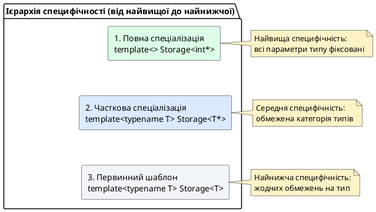
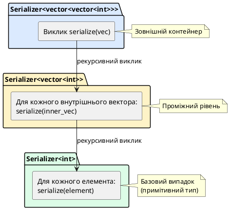

## Від конкретних типів до категорій: еволюція узагальнення

На попередній лекції ми опанували повну (явну) спеціалізацію шаблонів — механізм створення окремої реалізації для **конкретного типу**, наприклад `Array<bool>` або `isEqual<char*>`. Це дозволило оптимізувати роботу з булевими значеннями через бітову упаковку та коректно порівнювати C-стилі рядки через `strcmp`.

Проте реальність часто вимагає не спеціалізації під один тип, а під **цілу категорію типів**. Уявіть, що ви розробляєте шаблонний клас розумного покажчика `SmartPtr<T>`, який автоматично звільняє пам'ять у деструкторі. Для одиночних об'єктів потрібен `delete`, а для масивів — `delete[]`. Якщо використати повну спеціалізацію, доведеться писати окремі версії для кожного типу масиву:

```cpp
template <> class SmartPtr<int[]> { ~SmartPtr() { delete[] ptr; } };
template <> class SmartPtr<double[]> { ~SmartPtr() { delete[] ptr; } };
template <> class SmartPtr<char[]> { ~SmartPtr() { delete[] ptr; } };
// ... і так для кожного типу масиву окремо
```

Це повертає нас до проблеми дублювання коду, яку шаблони мали розв'язати! **Часткова спеціалізація шаблонів** (*partial template specialization*) розв'язує цю дилему: вона дозволяє створити **одну спеціалізацію для всіх масивів** `T[]`, **всіх покажчиків** `T*`, **всіх константних типів** `const T` тощо — не фіксуючи конкретний `T`.

```cpp
// Одна спеціалізація для ВСІХ масивів
template <typename T>
class SmartPtr<T[]>
{
    ~SmartPtr() { delete[] m_ptr; }  // Працює для int[], double[], char[]...
};
```

::card-group

::card{title="🎯 Мета лекції" icon="i-lucide-target"}

- Опанувати синтаксис часткової спеціалізації: `template <typename U> class Name<U*>`
- Зрозуміти різницю між повною та частковою спеціалізацією: конкретний тип vs категорія типів
- Навчитися створювати спеціалізації для покажчиків, посилань, константних типів, вкладених шаблонів
- Дослідити пріоритети вибору компілятора: найспецифічніша спеціалізація завжди перемагає
- Розібрати метапрограмування: рекурсивні спеціалізації, обчислення на рівні типів, compile-time обчислення

::

::card{title="🔑 Ключові терміни" icon="i-lucide-key"}

- **Часткова спеціалізація** (*partial specialization*): спеціалізація шаблону для підмножини типів, де частина параметрів залишається узагальненою
- **Категорія типів** (*type category*): група типів із спільною структурою — покажчики `T*`, посилання `T&`, масиви `T[]`, вкладені шаблони `Container<T>`
- **Специфічність спеціалізації** (*specialization specificity*): міра деталізації обмежень типу — чим більше обмежень, тим вища специфічність
- **Пріоритет розв'язання спеціалізацій** (*specialization resolution priority*): алгоритм вибору компілятором найбільш специфічної спеціалізації серед кандидатів
- **Метапрограмування на рівні типів** (*compile-time type metaprogramming*): обчислення, виконувані компілятором через рекурсивні спеціалізації та type traits

::

::

## Синтаксис часткової спеціалізації: непорожній список параметрів

### Базова структура: первинний шаблон та часткова спеціалізація

Часткова спеціалізація класу складається з трьох компонентів:

1. **Первинний (базовий) шаблон** — найзагальніша версія для будь-якого типу `T`
2. **Часткова спеціалізація** — версія для категорії типів (наприклад, усіх покажчиків `T*`)
3. **Повна спеціалізація** (опціонально) — версія для конкретного типу (наприклад, `int*`)

```cpp [PartialSpecializationSyntax.cpp]
#include <iostream>

// ═════════════════════════════════════════════════════════════
// 1. ПЕРВИННИЙ ШАБЛОН (для всіх типів)
// ═════════════════════════════════════════════════════════════
template <typename T>
class Storage
{
public:
    Storage() { std::cout << "[Primary] Storage<T>\n"; }
};

// ═════════════════════════════════════════════════════════════
// 2. ЧАСТКОВА СПЕЦІАЛІЗАЦІЯ (для всіх покажчиків T*)
// ═════════════════════════════════════════════════════════════
template <typename T>
class Storage<T*>
{
public:
    Storage() { std::cout << "[Partial] Storage<T*> — для покажчиків\n"; }
};

// ═════════════════════════════════════════════════════════════
// 3. ПОВНА СПЕЦІАЛІЗАЦІЯ (для конкретного типу int*)
// ═════════════════════════════════════════════════════════════
template <>
class Storage<int*>
{
public:
    Storage() { std::cout << "[Full] Storage<int*> — конкретно для int*\n"; }
};

int main()
{
    Storage<int> s1;        // Первинний шаблон
    Storage<double> s2;     // Первинний шаблон
    Storage<char*> s3;      // Часткова спеціалізація T*
    Storage<double*> s4;    // Часткова спеціалізація T*
    Storage<int*> s5;       // Повна спеціалізація int*
    
    return 0;
}
```

::terminal-preview{title="./PartialSpecializationSyntax"}

<div class="line">[Primary] Storage&lt;T&gt;</div>
<div class="line">[Primary] Storage&lt;T&gt;</div>
<div class="line">[Partial] Storage&lt;T*&gt; — для покажчиків</div>
<div class="line">[Partial] Storage&lt;T*&gt; — для покажчиків</div>
<div class="line">[Full] Storage&lt;int*&gt; — конкретно для int*</div>

::

**Розбір синтаксису часткової спеціалізації:**

```cpp
template <typename T>       // Непорожній список — T залишається параметром
class Storage<T*>           // Спеціалізуємо для всіх T*
{
    // Реалізація для покажчиків
};
```

**Ключові відмінності від повної спеціалізації:**

| Характеристика | Повна спеціалізація | Часткова спеціалізація |
|:--------------|:-------------------|:-----------------------|
| **Синтаксис оголошення** | `template <>` (порожній) | `template <typename U>` (непорожній) |
| **Параметри типу** | Всі фіксовані (`int*`) | Частина узагальнена (`T*`) |
| **Застосування** | Один конкретний тип | Категорія типів |
| **Приклад** | `Storage<int*>` | `Storage<T*>` для всіх покажчиків |
| **Функції** | ✅ Підтримуються | ❌ **Заборонені** в C++ |

::warning{icon="lucide:alert-triangle"}
**КРИТИЧНЕ ОБМЕЖЕННЯ:** C++ **не підтримує часткову спеціалізацію шаблонів функцій** — лише класів. Для функцій потрібно використовувати перевантаження або tag dispatching (як ми розглядали у статті 83). Це історичне обмеження, пов'язане зі складністю overload resolution.

::

### Ієрархія специфічності: алгоритм вибору компілятора

Коли компілятор інстанціює шаблон, він обирає **найспецифічнішу** версію серед усіх доступних кандидатів:

::plant-uml{alt="Ієрархія пріоритетів спеціалізацій"}



::

**Приклад множинних спеціалізацій:**

```cpp [MultipleSpecializations.cpp]
#include <iostream>

// Первинний шаблон
template <typename T>
class Container
{
public:
    void info() { std::cout << "Первинний шаблон: Container<T>\n"; }
};

// Часткова спеціалізація #1: покажчики
template <typename T>
class Container<T*>
{
public:
    void info() { std::cout << "Часткова спеціалізація: Container<T*>\n"; }
};

// Часткова спеціалізація #2: константні покажчики
template <typename T>
class Container<const T*>
{
public:
    void info() { std::cout << "Часткова спеціалізація: Container<const T*>\n"; }
};

// Повна спеціалізація: конкретно для int*
template <>
class Container<int*>
{
public:
    void info() { std::cout << "Повна спеціалізація: Container<int*>\n"; }
};

int main()
{
    Container<int> c1;
    c1.info();  // Первинний шаблон

    Container<double*> c2;
    c2.info();  // Часткова: T*

    Container<const char*> c3;
    c3.info();  // Часткова: const T*

    Container<int*> c4;
    c4.info();  // Повна: int*

    return 0;
}
```

::terminal-preview{title="./MultipleSpecializations"}

<div class="line">Первинний шаблон: Container&lt;T&gt;</div>
<div class="line">Часткова спеціалізація: Container&lt;T*&gt;</div>
<div class="line">Часткова спеціалізація: Container&lt;const T*&gt;</div>
<div class="line">Повна спеціалізація: Container&lt;int*&gt;</div>

::

**Алгоритм вибору компілятора:**

1. **Збір кандидатів**: компілятор знаходить первинний шаблон та всі спеціалізації, що підходять для типу
2. **Ранжування за специфічністю**: більше обмежень = вища специфічність
   - `Container<int*>` (повна) — 2 обмеження: "це покажчик" + "тип int"
   - `Container<const T*>` (часткова) — 2 обмеження: "це покажчик" + "константний"
   - `Container<T*>` (часткова) — 1 обмеження: "це покажчик"
   - `Container<T>` (первинний) — 0 обмежень
3. **Вибір найспецифічнішої**: якщо кілька спеціалізацій мають однакову специфічність, компіляція провалюється через неоднозначність

::note
**Відмінність від overload resolution функцій:** На відміну від перевантаження функцій, де нешаблонні версії мають пріоритет, у спеціалізації класів компілятор завжди обирає **найспецифічнішу спеціалізацію**, незалежно від того, чи це повна, чи часткова версія.

::


## Спеціалізація для категорій типів: покажчики, посилання, масиви

### Спеціалізація для покажчиків: `T*`

Найпоширеніший випадок часткової спеціалізації — створення окремої поведінки для всіх покажчикових типів. Це дозволяє реалізувати семантику глибокого копіювання, автоматичне звільнення пам'яті через `delete`, або спеціальну обробку `nullptr`.

```cpp [PointerSpecialization.cpp]
#include <iostream>

// ═════════════════════════════════════════════════════════════
// Первинний шаблон: зберігає значення за значенням
// ═════════════════════════════════════════════════════════════
template <typename T>
class Wrapper
{
private:
    T m_value;

public:
    Wrapper(const T& value) : m_value(value)
    {
        std::cout << "[Primary] Збережено значення типу T\n";
    }

    void print() const
    {
        std::cout << "Значення: " << m_value << "\n";
    }
};

// ═════════════════════════════════════════════════════════════
// Часткова спеціалізація для покажчиків T*
// ═════════════════════════════════════════════════════════════
template <typename T>
class Wrapper<T*>
{
private:
    T* m_ptr;

public:
    Wrapper(T* ptr) : m_ptr(ptr)
    {
        std::cout << "[Pointer] Збережено покажчик типу T*\n";
    }

    void print() const
    {
        if (m_ptr != nullptr)
            std::cout << "Покажчик вказує на: " << *m_ptr << "\n";
        else
            std::cout << "Покажчик є nullptr\n";
    }

    // Специфічні для покажчиків методи
    bool isNull() const { return m_ptr == nullptr; }
    T& dereference() { return *m_ptr; }
};

int main()
{
    // Використання первинного шаблону
    Wrapper<int> w1(42);
    w1.print();

    // Використання спеціалізації для покажчиків
    int x = 100;
    Wrapper<int*> w2(&x);
    w2.print();
    std::cout << "Покажчик нульовий? " << std::boolalpha << w2.isNull() << "\n";

    Wrapper<int*> w3(nullptr);
    w3.print();

    return 0;
}
```

::terminal-preview{title="./PointerSpecialization"}

<div class="line">[Primary] Збережено значення типу T</div>
<div class="line">Значення: 42</div>
<div class="line">[Pointer] Збережено покажчик типу T*</div>
<div class="line">Покажчик вказує на: 100</div>
<div class="line">Покажчик нульовий? false</div>
<div class="line">[Pointer] Збережено покажчик типу T*</div>
<div class="line">Покажчик є nullptr</div>

::

**Ключова перевага:** Спеціалізація `Wrapper<T*>` має доступ до типу `T`, тому може додати методи на кшталт `dereference()`, `isNull()`, що семантично не мають сенсу для непокажчикових типів.

### Спеціалізація для посилань: `T&`

Посилання у C++ — це **аліаси існуючих об'єктів**, а не самостійні сутності з адресою (на відміну від покажчиків). Спеціалізація для посилань дозволяє уникнути зайвого копіювання або реалізувати поведінку «обгортки над об'єктом».

```cpp [ReferenceSpecialization.cpp]
#include <iostream>

// Первинний шаблон
template <typename T>
class RefWrapper
{
private:
    T m_value;

public:
    RefWrapper(const T& value) : m_value(value)
    {
        std::cout << "[Primary] Створено копію об'єкта\n";
    }

    T& get() { return m_value; }
};

// Часткова спеціалізація для посилань T&
template <typename T>
class RefWrapper<T&>
{
private:
    T& m_ref;  // Зберігаємо посилання, а не копію

public:
    RefWrapper(T& ref) : m_ref(ref)
    {
        std::cout << "[Reference] Створено обгортку над існуючим об'єктом\n";
    }

    T& get() { return m_ref; }
};

int main()
{
    int x = 42;

    // Первинний шаблон: створює копію
    RefWrapper<int> w1(x);
    w1.get() = 100;  // Змінює копію, а не оригінал
    std::cout << "x після зміни через w1: " << x << "\n\n";

    // Спеціалізація: працює з оригіналом через посилання
    RefWrapper<int&> w2(x);
    w2.get() = 200;  // Змінює оригінал!
    std::cout << "x після зміни через w2: " << x << "\n";

    return 0;
}
```

::terminal-preview{title="./ReferenceSpecialization"}

<div class="line">[Primary] Створено копію об'єкта</div>
<div class="line">x після зміни через w1: 42</div>
<div class="line"></div>
<div class="line">[Reference] Створено обгортку над існуючим об'єктом</div>
<div class="line">x після зміни через w2: 200</div>

::

::note
**Зв'язок зі стандартною бібліотекою:** Клас `std::reference_wrapper<T>` у заголовку `<functional>` працює саме так — він зберігає посилання на об'єкт, дозволяючи передавати посилання через контейнери, які зазвичай зберігають копії (`std::vector<std::reference_wrapper<int>>`).

::

### Спеціалізація для константних типів: `const T`

Спеціалізація для константних типів дозволяє компілятору гарантувати незмінність даних на рівні системи типів, блокуючи мутуючі методи.

```cpp [ConstSpecialization.cpp]
#include <iostream>

// Первинний шаблон: дозволяє модифікацію
template <typename T>
class Box
{
private:
    T m_data;

public:
    Box(const T& data) : m_data(data) {}

    T& get() { return m_data; }
    void set(const T& value) { m_data = value; }
};

// Часткова спеціалізація для константних типів
template <typename T>
class Box<const T>
{
private:
    T m_data;  // Зберігаємо як неконстантне, але зовні не даємо змінювати

public:
    Box(const T& data) : m_data(data) {}

    const T& get() const { return m_data; }
    // set() не існує — константний Box не може бути змінений
};

int main()
{
    Box<int> mutableBox(42);
    mutableBox.set(100);
    std::cout << "Mutable box: " << mutableBox.get() << "\n";

    Box<const int> constBox(42);
    std::cout << "Const box: " << constBox.get() << "\n";
    // constBox.set(100);  // ❌ Помилка компіляції: метод не існує

    return 0;
}
```

::terminal-preview{title="./ConstSpecialization"}

<div class="line">Mutable box: 100</div>
<div class="line">Const box: 42</div>

::

### Спеціалізація для масивів: `T[]` та `T[N]`

C++ розрізняє **невизначені масиви** `T[]` (коли розмір невідомий на етапі компіляції) та **масиви фіксованого розміру** `T[N]` (де `N` — NTTP-параметр). Для кожного можна створити окрему спеціалізацію.

```cpp [ArraySpecialization.cpp]
#include <iostream>

// Первинний шаблон
template <typename T>
class ArrayWrapper
{
public:
    ArrayWrapper() { std::cout << "[Primary] Не масив\n"; }
};

// Часткова спеціалізація для невизначених масивів T[]
template <typename T>
class ArrayWrapper<T[]>
{
public:
    ArrayWrapper() { std::cout << "[Array] Невизначений масив T[]\n"; }
};

// Часткова спеціалізація для масивів фіксованого розміру T[N]
template <typename T, int N>
class ArrayWrapper<T[N]>
{
private:
    T m_data[N];

public:
    ArrayWrapper()
    {
        std::cout << "[Array] Масив фіксованого розміру T[" << N << "]\n";
        for (int i = 0; i < N; ++i)
            m_data[i] = T{};
    }

    int size() const { return N; }
    T& operator[](int index) { return m_data[index]; }
};

int main()
{
    ArrayWrapper<int> w1;
    ArrayWrapper<int[]> w2;
    ArrayWrapper<int[5]> w3;

    std::cout << "Розмір w3: " << w3.size() << "\n";

    return 0;
}
```

::terminal-preview{title="./ArraySpecialization"}

<div class="line">[Primary] Не масив</div>
<div class="line">[Array] Невизначений масив T[]</div>
<div class="line">[Array] Масив фіксованого розміру T[5]</div>
<div class="line">Розмір w3: 5</div>

::

::memory-view{title="Розташування спеціалізацій для масивів" :variables='[{"name": "ArrayWrapper<int>", "type": "primary", "value": "не містить даних"}, {"name": "ArrayWrapper<int[]>", "type": "partial (unbounded)", "value": "має покажчик на зовнішній масив"}, {"name": "ArrayWrapper<int[5]>", "type": "partial (bounded)", "value": "m_data: int[5] — стек"}]'}

::

**Практичне застосування:** Стандартний `std::array<T, N>` реалізований через подібний механізм — це обгортка над С-стилем масивом `T data[N]` із методами STL-контейнера.


## Спеціалізація для вкладених шаблонів: контейнери та пари

### Спеціалізація для шаблонних типів: `Container<T>`

Часткова спеціалізація дозволяє розпізнавати типи, які самі є шаблонами — наприклад, `std::vector<T>`, `std::pair<T, U>`, або власні контейнерні класи. Це критично важливо для написання універсальних алгоритмів, що працюють з будь-якими контейнерами.

```cpp [NestedTemplateSpecialization.cpp]
#include <iostream>
#include <vector>
#include <list>

// ═════════════════════════════════════════════════════════════
// Первинний шаблон: загальна серіалізація
// ═════════════════════════════════════════════════════════════
template <typename T>
class Serializer
{
public:
    static void serialize(const T& value)
    {
        std::cout << value;
    }
};

// ═════════════════════════════════════════════════════════════
// Часткова спеціалізація для std::vector<T>
// ═════════════════════════════════════════════════════════════
template <typename T>
class Serializer<std::vector<T>>
{
public:
    static void serialize(const std::vector<T>& vec)
    {
        std::cout << "[";
        for (size_t i = 0; i < vec.size(); ++i)
        {
            Serializer<T>::serialize(vec[i]);  // Рекурсивний виклик для елементів
            if (i < vec.size() - 1)
                std::cout << ", ";
        }
        std::cout << "]";
    }
};

// ═════════════════════════════════════════════════════════════
// Часткова спеціалізація для std::list<T>
// ═════════════════════════════════════════════════════════════
template <typename T>
class Serializer<std::list<T>>
{
public:
    static void serialize(const std::list<T>& lst)
    {
        std::cout << "{";
        bool first = true;
        for (const auto& elem : lst)
        {
            if (!first) std::cout << ", ";
            Serializer<T>::serialize(elem);
            first = false;
        }
        std::cout << "}";
    }
};

int main()
{
    // Первинний шаблон для int
    std::cout << "int: ";
    Serializer<int>::serialize(42);
    std::cout << "\n";

    // Спеціалізація для std::vector<int>
    std::vector<int> vec = {1, 2, 3, 4, 5};
    std::cout << "vector<int>: ";
    Serializer<std::vector<int>>::serialize(vec);
    std::cout << "\n";

    // Спеціалізація для std::list<double>
    std::list<double> lst = {3.14, 2.71, 1.41};
    std::cout << "list<double>: ";
    Serializer<std::list<double>>::serialize(lst);
    std::cout << "\n";

    // Вкладені контейнери: vector<vector<int>>
    std::vector<std::vector<int>> matrix = {{1, 2}, {3, 4}, {5, 6}};
    std::cout << "vector<vector<int>>: ";
    Serializer<std::vector<std::vector<int>>>::serialize(matrix);
    std::cout << "\n";

    return 0;
}
```

::terminal-preview{title="./NestedTemplateSpecialization"}

<div class="line">int: 42</div>
<div class="line">vector&lt;int&gt;: [1, 2, 3, 4, 5]</div>
<div class="line">list&lt;double&gt;: {3.14, 2.71, 1.41}</div>
<div class="line">vector&lt;vector&lt;int&gt;&gt;: [[1, 2], [3, 4], [5, 6]]</div>

::

**Архітектурна краса рішення:**

1. **Рекурсивна серіалізація:** `Serializer<std::vector<T>>` викликає `Serializer<T>` для елементів, дозволяючи обробляти вкладені контейнери (`vector<vector<int>>`)
2. **Автоматична адаптація:** додавання нового типу контейнера не вимагає зміни існуючих спеціалізацій
3. **Compile-time розв'язання:** всі виклики `Serializer<T>::serialize()` розв'язуються на етапі компіляції — жодних runtime-витрат

::plant-uml{alt="Рекурсивна структура спеціалізацій"}



::

### Спеціалізація для пар: `std::pair<T, U>`

Для шаблонів із кількома параметрами можна спеціалізувати лише частину параметрів, залишаючи інші узагальненими.

```cpp [PairSpecialization.cpp]
#include <iostream>
#include <utility>

// Первинний шаблон
template <typename T>
class Printer
{
public:
    static void print(const T& value)
    {
        std::cout << "[Primary] " << value << "\n";
    }
};

// Часткова спеціалізація для std::pair<T, U> — обидва параметри узагальнені
template <typename T, typename U>
class Printer<std::pair<T, U>>
{
public:
    static void print(const std::pair<T, U>& p)
    {
        std::cout << "[Pair] (" << p.first << ", " << p.second << ")\n";
    }
};

// Часткова спеціалізація для пар однакового типу std::pair<T, T>
template <typename T>
class Printer<std::pair<T, T>>
{
public:
    static void print(const std::pair<T, T>& p)
    {
        std::cout << "[Pair<T, T>] Однотипна пара: (" << p.first << ", " << p.second << ")\n";
    }
};

int main()
{
    Printer<int>::print(42);

    std::pair<int, double> p1(10, 3.14);
    Printer<std::pair<int, double>>::print(p1);

    std::pair<int, int> p2(5, 5);
    Printer<std::pair<int, int>>::print(p2);  // Більш специфічна: pair<T, T>

    return 0;
}
```

::terminal-preview{title="./PairSpecialization"}

<div class="line">[Primary] 42</div>
<div class="line">[Pair] (10, 3.14)</div>
<div class="line">[Pair&lt;T, T&gt;] Однотипна пара: (5, 5)</div>

::

**Пріоритет вибору для `std::pair<int, int>`:**

1. Компілятор знаходить дві часткові спеціалізації: `Pair<T, U>` та `Pair<T, T>`
2. `Pair<T, T>` є **більш специфічною** (накладає обмеження: обидва типи однакові)
3. Обирається `Pair<T, T>`

::tip{icon="lucide:binary"}
**Архітектурний патерн:** Така спеціалізація дозволяє оптимізувати структури даних для симетричних операцій — наприклад, матриця `Matrix<T, T>` (квадратна) може зберігати лише половину елементів для симетричних матриць, тоді як `Matrix<T, U>` (прямокутна) зберігає всі елементи.

::

### Спеціалізація для множинних покажчиків: `T**`, `T***`

Спеціалізація дозволяє розрізняти рівні посередності покажчиків, створюючи окремі реалізації для одновимірних, двовимірних і багатовимірних структур.

```cpp [MultiLevelPointers.cpp]
#include <iostream>

// Первинний шаблон
template <typename T>
class DeepCopy
{
public:
    static T copy(const T& value)
    {
        std::cout << "[Primary] Копіювання значення\n";
        return value;
    }
};

// Часткова спеціалізація для T* (одновимірний покажчик)
template <typename T>
class DeepCopy<T*>
{
public:
    static T* copy(const T* ptr)
    {
        std::cout << "[T*] Глибоке копіювання одного об'єкта\n";
        if (ptr == nullptr) return nullptr;
        return new T(*ptr);
    }
};

// Часткова спеціалізація для T** (покажчик на покажчик)
template <typename T>
class DeepCopy<T**>
{
public:
    static T** copy(const T** ptr, int size)
    {
        std::cout << "[T**] Глибоке копіювання масиву покажчиків\n";
        if (ptr == nullptr) return nullptr;

        T** newPtr = new T*[size];
        for (int i = 0; i < size; ++i)
        {
            if (ptr[i] != nullptr)
                newPtr[i] = DeepCopy<T*>::copy(ptr[i]);  // Рекурсивний виклик
            else
                newPtr[i] = nullptr;
        }
        return newPtr;
    }
};

int main()
{
    // Первинний шаблон
    int x = 42;
    int copyX = DeepCopy<int>::copy(x);
    std::cout << "Копія x: " << copyX << "\n\n";

    // Спеціалізація для T*
    int* px = new int(100);
    int* copyPx = DeepCopy<int*>::copy(px);
    std::cout << "Оригінал: " << *px << ", Копія: " << *copyPx << "\n";
    std::cout << "Адреси різні? " << std::boolalpha << (px != copyPx) << "\n\n";

    delete px;
    delete copyPx;

    // Спеціалізація для T** (масив покажчиків)
    int** matrix = new int*[3];
    matrix[0] = new int(1);
    matrix[1] = new int(2);
    matrix[2] = new int(3);

    int** copyMatrix = DeepCopy<int**>::copy(matrix, 3);
    std::cout << "Копія матриці: ";
    for (int i = 0; i < 3; ++i)
        std::cout << *copyMatrix[i] << " ";
    std::cout << "\n";

    // Звільнення пам'яті
    for (int i = 0; i < 3; ++i)
    {
        delete matrix[i];
        delete copyMatrix[i];
    }
    delete[] matrix;
    delete[] copyMatrix;

    return 0;
}
```

::terminal-preview{title="./MultiLevelPointers"}

<div class="line">[Primary] Копіювання значення</div>
<div class="line">Копія x: 42</div>
<div class="line"></div>
<div class="line">[T*] Глибоке копіювання одного об'єкта</div>
<div class="line">Оригінал: 100, Копія: 100</div>
<div class="line">Адреси різні? true</div>
<div class="line"></div>
<div class="line">[T**] Глибоке копіювання масиву покажчиків</div>
<div class="line">[T*] Глибоке копіювання одного об'єкта</div>
<div class="line">[T*] Глибоке копіювання одного об'єкта</div>
<div class="line">[T*] Глибоке копіювання одного об'єкта</div>
<div class="line">Копія матриці: 1 2 3</div>

::

**Рекурсивна природа спеціалізацій:** `DeepCopy<T**>` викликає `DeepCopy<T*>` для кожного елемента, демонструючи потужність композиції спеціалізацій.


## Метапрограмування: compile-time обчислення через спеціалізації

Часткова спеціалізація відкриває двері до **метапрограмування на рівні типів** (*template metaprogramming*) — техніки виконання обчислень під час компіляції через рекурсивні спеціалізації шаблонів. Компілятор перетворюється на інтерпретатор функціональної мови, де типи є даними, а спеціалізації — правилами обчислень.

### Обчислення факторіала на етапі компіляції

Класичний приклад метапрограмування — обчислення математичних функцій через шаблони. Розглянемо факторіал `N! = N × (N-1) × ... × 1`:

```cpp [CompileTimeFactorial.cpp]
#include <iostream>

// ═════════════════════════════════════════════════════════════
// ПЕРВИННИЙ ШАБЛОН: рекурсивний випадок N! = N × (N-1)!
// ═════════════════════════════════════════════════════════════
template <int N>
struct Factorial
{
    static constexpr int value = N * Factorial<N - 1>::value;
};

// ═════════════════════════════════════════════════════════════
// ПОВНА СПЕЦІАЛІЗАЦІЯ: базовий випадок 0! = 1
// ═════════════════════════════════════════════════════════════
template <>
struct Factorial<0>
{
    static constexpr int value = 1;
};

int main()
{
    // Компілятор обчислює значення під час компіляції
    constexpr int fact5 = Factorial<5>::value;  // 5! = 120
    constexpr int fact10 = Factorial<10>::value;  // 10! = 3628800

    std::cout << "5! = " << fact5 << "\n";
    std::cout << "10! = " << fact10 << "\n";

    // Значення можна використовувати як розміри масивів (compile-time константи)
    int array[Factorial<4>::value];  // int array[24];
    std::cout << "Розмір масиву: " << sizeof(array) / sizeof(int) << "\n";

    return 0;
}
```

::terminal-preview{title="./CompileTimeFactorial"}

<div class="line">5! = 120</div>
<div class="line">10! = 3628800</div>
<div class="line">Розмір масиву: 24</div>

::

**Як це працює:**

1. **Компілятор інстанціює `Factorial<5>`**: бачить `value = 5 * Factorial<4>::value`
2. **Інстанціює `Factorial<4>`**: бачить `value = 4 * Factorial<3>::value`
3. **Продовжує рекурсію** до `Factorial<0>`
4. **Досягає базового випадку**: `Factorial<0>::value = 1`
5. **Розгортає рекурсію назад**: `1 → 1×1 → 2×1 → 3×2 → 4×6 → 5×24 = 120`
6. **Результат стає compile-time константою**: `constexpr int fact5 = 120;`

::plant-uml{alt="Розгортання рекурсії під час компіляції"}

```plantuml
@startuml
skinparam style plain
skinparam backgroundColor #FFFFFF

rectangle "Factorial<5>" as F5 #DBEAFE
rectangle "Factorial<4>" as F4 #FEF3C7
rectangle "Factorial<3>" as F3 #DCFCE7
rectangle "Factorial<2>" as F2 #DBEAFE
rectangle "Factorial<1>" as F1 #FEF3C7
rectangle "Factorial<0> = 1" as F0 #FEE2E2

F5 -down-> F4 : 5 × ?
F4 -down-> F3 : 4 × ?
F3 -down-> F2 : 3 × ?
F2 -down-> F1 : 2 × ?
F1 -down-> F0 : 1 × ?

note right of F0 #DCFCE7
  Базовий випадок:
  value = 1
end note

F0 -up-> F1 : повертає 1
F1 -up-> F2 : повертає 1
F2 -up-> F3 : повертає 2
F3 -up-> F4 : повертає 6
F4 -up-> F5 : повертає 24
F5 -up-> [*] : повертає 120

@enduml
```

::

::tip{icon="lucide:cpu"}
**Нульові витрати часу виконання:** Всі обчислення виконані компілятором. У фінальному бінарному файлі `Factorial<5>::value` замінено на літеральну константу `120`. Жодних викликів функцій, жодних обчислень під час виконання програми.

::

### Type Traits: визначення властивостей типів

Type traits — це набір шаблонних структур, що дозволяють витягувати інформацію про типи на етапі компіляції. Створимо trait для визначення, чи є тип покажчиком:

```cpp [TypeTraitsIsPointer.cpp]
#include <iostream>

// ═════════════════════════════════════════════════════════════
// ПЕРВИННИЙ ШАБЛОН: за замовчуванням тип НЕ є покажчиком
// ═════════════════════════════════════════════════════════════
template <typename T>
struct IsPointer
{
    static constexpr bool value = false;
};

// ═════════════════════════════════════════════════════════════
// ЧАСТКОВА СПЕЦІАЛІЗАЦІЯ: всі T* є покажчиками
// ═════════════════════════════════════════════════════════════
template <typename T>
struct IsPointer<T*>
{
    static constexpr bool value = true;
};

// ═════════════════════════════════════════════════════════════
// ЧАСТКОВА СПЕЦІАЛІЗАЦІЯ: const T* теж покажчики
// ═════════════════════════════════════════════════════════════
template <typename T>
struct IsPointer<const T*>
{
    static constexpr bool value = true;
};

// Допоміжна функція для виведення
template <typename T>
void checkPointer()
{
    if constexpr (IsPointer<T>::value)
        std::cout << "Тип є покажчиком\n";
    else
        std::cout << "Тип НЕ є покажчиком\n";
}

int main()
{
    std::cout << "int: ";
    checkPointer<int>();

    std::cout << "int*: ";
    checkPointer<int*>();

    std::cout << "const double*: ";
    checkPointer<const double*>();

    std::cout << "int**: ";
    checkPointer<int**>();

    std::cout << "char: ";
    checkPointer<char>();

    return 0;
}
```

::terminal-preview{title="./TypeTraitsIsPointer"}

<div class="line">int: Тип НЕ є покажчиком</div>
<div class="line">int*: Тип є покажчиком</div>
<div class="line">const double*: Тип є покажчиком</div>
<div class="line">int**: Тип є покажчиком</div>
<div class="line">char: Тип НЕ є покажчиком</div>

::

**Архітектура рішення:**

- `IsPointer<int>` → первинний шаблон → `value = false`
- `IsPointer<int*>` → спеціалізація `T*` → `value = true`
- `IsPointer<const double*>` → спеціалізація `const T*` → `value = true`
- `IsPointer<int**>` → спеціалізація `T*` де `T = int*` → `value = true`

### Видалення кваліфікаторів типу: `RemoveConst`, `RemovePointer`

Метапрограмування дозволяє **трансформувати типи** на етапі компіляції. Розглянемо traits, що видаляють `const` та `*` з типу:

```cpp [TypeTransformations.cpp]
#include <iostream>
#include <typeinfo>

// ═════════════════════════════════════════════════════════════
// RemoveConst: видаляє const-кваліфікатор
// ═════════════════════════════════════════════════════════════
template <typename T>
struct RemoveConst
{
    using type = T;  // За замовчуванням тип не змінюється
};

template <typename T>
struct RemoveConst<const T>
{
    using type = T;  // Видаляємо const
};

// ═════════════════════════════════════════════════════════════
// RemovePointer: видаляє один рівень посередності *
// ═════════════════════════════════════════════════════════════
template <typename T>
struct RemovePointer
{
    using type = T;  // За замовчуванням тип не змінюється
};

template <typename T>
struct RemovePointer<T*>
{
    using type = T;  // Видаляємо *
};

// Допоміжний alias для зручності (C++11)
template <typename T>
using RemoveConst_t = typename RemoveConst<T>::type;

template <typename T>
using RemovePointer_t = typename RemovePointer<T>::type;

int main()
{
    // Тестування RemoveConst
    std::cout << "int: " << typeid(int).name() << "\n";
    std::cout << "RemoveConst<const int>: " << typeid(RemoveConst_t<const int>).name() << "\n\n";

    // Тестування RemovePointer
    std::cout << "int*: " << typeid(int*).name() << "\n";
    std::cout << "RemovePointer<int*>: " << typeid(RemovePointer_t<int*>).name() << "\n\n";

    // Комбінування трансформацій
    using ComplexType = const int***;
    using Step1 = RemovePointer_t<ComplexType>;       // const int**
    using Step2 = RemovePointer_t<Step1>;             // const int*
    using Step3 = RemovePointer_t<Step2>;             // const int
    using Step4 = RemoveConst_t<Step3>;               // int

    std::cout << "const int***: " << typeid(ComplexType).name() << "\n";
    std::cout << "Після видалення всього: " << typeid(Step4).name() << "\n";

    return 0;
}
```

::terminal-preview{title="./TypeTransformations"}

<div class="line">int: i</div>
<div class="line">RemoveConst&lt;const int&gt;: i</div>
<div class="line"></div>
<div class="line">int*: Pi</div>
<div class="line">RemovePointer&lt;int*&gt;: i</div>
<div class="line"></div>
<div class="line">const int***: PKKKi</div>
<div class="line">Після видалення всього: i</div>

::

::note
**Зв'язок зі стандартною бібліотекою:** У заголовку `<type_traits>` існують стандартні версії цих traits: `std::remove_const`, `std::remove_pointer`, `std::remove_cv`, `std::remove_reference` тощо. Вони реалізовані саме через часткову спеціалізацію.

::

### Умовні типи: `Conditional<bool, T, U>`

Шаблон `Conditional` вибирає один із двох типів на основі булевої константи — аналог тернарного оператора `condition ? T : U`, але на рівні типів:

```cpp [ConditionalTypes.cpp]
#include <iostream>
#include <string>

// ═════════════════════════════════════════════════════════════
// Первинний шаблон: якщо true, обираємо тип T
// ═════════════════════════════════════════════════════════════
template <bool Condition, typename T, typename U>
struct Conditional
{
    using type = T;
};

// ═════════════════════════════════════════════════════════════
// Часткова спеціалізація: якщо false, обираємо тип U
// ═════════════════════════════════════════════════════════════
template <typename T, typename U>
struct Conditional<false, T, U>
{
    using type = U;
};

// Допоміжний alias
template <bool Cond, typename T, typename U>
using Conditional_t = typename Conditional<Cond, T, U>::type;

// Приклад застосування: SmartStorage<T, IsLarge>
template <typename T, bool IsLarge>
class SmartStorage
{
private:
    // Якщо тип великий, зберігаємо покажчик; інакше — за значенням
    using StorageType = Conditional_t<IsLarge, T*, T>;
    StorageType m_data;

public:
    SmartStorage(const T& value)
    {
        if constexpr (IsLarge)
        {
            m_data = new T(value);
            std::cout << "[SmartStorage] Великий тип: збережено через покажчик\n";
        }
        else
        {
            m_data = value;
            std::cout << "[SmartStorage] Малий тип: збережено за значенням\n";
        }
    }

    ~SmartStorage()
    {
        if constexpr (IsLarge)
            delete m_data;
    }
};

int main()
{
    // Малий тип: зберігаємо за значенням
    SmartStorage<int, false> smallStorage(42);

    // Великий тип: зберігаємо через покажчик
    SmartStorage<std::string, true> largeStorage("Hello, World!");

    return 0;
}
```

::terminal-preview{title="./ConditionalTypes"}

<div class="line">[SmartStorage] Малий тип: збережено за значенням</div>
<div class="line">[SmartStorage] Великий тип: збережено через покажчик</div>

::

**Практичне застосування:** Стандартний `std::conditional<bool B, typename T, typename U>` використовується в реалізації контейнерів STL для вибору стратегій зберігання на основі розміру типу (`sizeof(T)`).


## Пріоритети розв'язання: коли компілятор обирає спеціалізацію

Коли існує кілька часткових спеціалізацій, компілятор застосовує алгоритм **вибору найбільш специфічної** (*most specialized*) версії. Це складніше, ніж просте порівняння кількості обмежень — існують тонкі правила специфічності.

### Правила специфічності: більше обмежень = вища специфічність

Розглянемо ситуацію з множинними частковими спеціалізаціями:

```cpp [SpecializationPriority.cpp]
#include <iostream>

// ═════════════════════════════════════════════════════════════
// Первинний шаблон (0 обмежень)
// ═════════════════════════════════════════════════════════════
template <typename T>
class Container
{
public:
    void identify() { std::cout << "[1] Primary: Container<T>\n"; }
};

// ═════════════════════════════════════════════════════════════
// Часткова спеціалізація #1: покажчики (1 обмеження)
// ═════════════════════════════════════════════════════════════
template <typename T>
class Container<T*>
{
public:
    void identify() { std::cout << "[2] Partial: Container<T*>\n"; }
};

// ═════════════════════════════════════════════════════════════
// Часткова спеціалізація #2: константні покажчики (2 обмеження)
// ═════════════════════════════════════════════════════════════
template <typename T>
class Container<const T*>
{
public:
    void identify() { std::cout << "[3] Partial: Container<const T*>\n"; }
};

// ═════════════════════════════════════════════════════════════
// Часткова спеціалізація #3: покажчики на покажчики (2 обмеження)
// ═════════════════════════════════════════════════════════════
template <typename T>
class Container<T**>
{
public:
    void identify() { std::cout << "[4] Partial: Container<T**>\n"; }
};

// ═════════════════════════════════════════════════════════════
// Повна спеціалізація: конкретно int* (3 обмеження: тип + покажчик + int)
// ═════════════════════════════════════════════════════════════
template <>
class Container<int*>
{
public:
    void identify() { std::cout << "[5] Full: Container<int*>\n"; }
};

int main()
{
    Container<int> c1;
    c1.identify();  // [1] Primary

    Container<double*> c2;
    c2.identify();  // [2] Partial T*

    Container<const char*> c3;
    c3.identify();  // [3] Partial const T* (більш специфічна за T*)

    Container<int**> c4;
    c4.identify();  // [4] Partial T**

    Container<int*> c5;
    c5.identify();  // [5] Full int* (найспецифічніша)

    return 0;
}
```

::terminal-preview{title="./SpecializationPriority"}

<div class="line">[1] Primary: Container&lt;T&gt;</div>
<div class="line">[2] Partial: Container&lt;T*&gt;</div>
<div class="line">[3] Partial: Container&lt;const T*&gt;</div>
<div class="line">[4] Partial: Container&lt;T**&gt;</div>
<div class="line">[5] Full: Container&lt;int*&gt;</div>

::

**Таблиця специфічності:**

| Інстанціювання | Кандидати | Обрана версія | Обґрунтування |
|:--------------|:----------|:-------------|:-------------|
| `Container<int>` | Primary | [1] Primary | Жодна спеціалізація не підходить |
| `Container<double*>` | Primary, `T*` | [2] `T*` | 1 обмеження > 0 обмежень |
| `Container<const char*>` | Primary, `T*`, `const T*` | [3] `const T*` | 2 обмеження > 1 обмеження |
| `Container<int**>` | Primary, `T*`, `T**` | [4] `T**` | `T**` специфічніша за `T*` для `int**` |
| `Container<int*>` | Primary, `T*`, `const T*`, `int*` | [5] `int*` | Повна спеціалізація найспецифічніша |

::plant-uml{alt="Дерево рішень вибору спеціалізації"}

```plantuml
@startuml
skinparam style plain
skinparam backgroundColor #FFFFFF

start

:Інстанціювання Container<Type>;

if (Існує повна спеціалізація для Type?) then (так)
  :Використати повну спеціалізацію;
  #DCFCE7
  stop
endif

:Знайти всі часткові спеціалізації,\nщо підходять для Type;

if (Знайдено кілька часткових спеціалізацій?) then (так)
  :Обрати найспецифічнішу\n(за алгоритмом специфічності);
  if (Неоднозначність?) then (так)
    :Помилка компіляції: ambiguous;
    #FEE2E2
    stop
  else (ні)
    :Використати обрану спеціалізацію;
    #DBEAFE
    stop
  endif
else (ні або одна)
  if (Знайдено одну часткову?) then (так)
    :Використати цю спеціалізацію;
    #DBEAFE
    stop
  else (ні)
    :Використати первинний шаблон;
    #F1F5F9
    stop
  endif
endif

@enduml
```

::

### Неоднозначність: коли компілятор не може обрати

Якщо дві часткові спеціалізації мають **однакову специфічність**, компіляція провалюється через неоднозначність:

```cpp [AmbiguousSpecialization.cpp]
#include <iostream>

// Первинний шаблон з двома параметрами
template <typename T, typename U>
class Pair
{
public:
    void identify() { std::cout << "Primary: Pair<T, U>\n"; }
};

// Часткова спеціалізація #1: другий параметр є покажчиком
template <typename T, typename U>
class Pair<T, U*>
{
public:
    void identify() { std::cout << "Partial 1: Pair<T, U*>\n"; }
};

// Часткова спеціалізація #2: перший параметр є покажчиком
template <typename T, typename U>
class Pair<T*, U>
{
public:
    void identify() { std::cout << "Partial 2: Pair<T*, U>\n"; }
};

int main()
{
    Pair<int, int> p1;
    p1.identify();  // ✅ Primary (жодна спеціалізація не підходить)

    Pair<int, char*> p2;
    p2.identify();  // ✅ Partial 1: T, U*

    Pair<double*, int> p3;
    p3.identify();  // ✅ Partial 2: T*, U

    // ❌ ПОМИЛКА КОМПІЛЯЦІЇ: неоднозначність
    // Pair<int*, char*> p4;
    // Обидві спеціалізації підходять: Pair<T, U*> і Pair<T*, U>
    // Компілятор не знає, яку обрати

    return 0;
}
```

**Помилка компілятора:**

```
error: ambiguous partial specializations of 'Pair<int*, char*>'
note: partial specialization matches [Pair<T, U*>]
note: partial specialization matches [Pair<T*, U>]
```

**Розв'язання неоднозначності:** додати **третю спеціалізацію**, більш специфічну за обидві:

```cpp
// Додаткова спеціалізація для Pair<T*, U*> — обидва покажчики
template <typename T, typename U>
class Pair<T*, U*>
{
public:
    void identify() { std::cout << "Partial 3: Pair<T*, U*>\n"; }
};

int main()
{
    Pair<int*, char*> p4;
    p4.identify();  // ✅ Partial 3: Pair<T*, U*> (найспецифічніша)

    return 0;
}
```

::warning{icon="lucide:alert-triangle"}
**Типова пастка:** При розробці бібліотек із множинними частковими спеціалізаціями критично важливо **передбачати перетин обмежень** і додавати додаткові спеціалізації для розв'язання неоднозначностей. Інакше користувачі бібліотеки зіткнуться з несподіваними помилками компіляції.

::

### Специфічність для вкладених шаблонів

Для вкладених шаблонів специфічність визначається **глибиною обмежень**:

```cpp [NestedSpecificity.cpp]
#include <iostream>
#include <vector>
#include <list>

// Первинний шаблон
template <typename T>
class Processor
{
public:
    void process() { std::cout << "Primary: T\n"; }
};

// Часткова спеціалізація #1: всі std::vector<U>
template <typename U>
class Processor<std::vector<U>>
{
public:
    void process() { std::cout << "Partial: vector<U>\n"; }
};

// Часткова спеціалізація #2: std::vector<U*> — вектор покажчиків
template <typename U>
class Processor<std::vector<U*>>
{
public:
    void process() { std::cout << "Partial: vector<U*> — вектор покажчиків\n"; }
};

int main()
{
    Processor<int> p1;
    p1.process();  // Primary

    Processor<std::vector<int>> p2;
    p2.process();  // Partial: vector<U>

    Processor<std::vector<double*>> p3;
    p3.process();  // Partial: vector<U*> (більш специфічна)

    Processor<std::list<int>> p4;
    p4.process();  // Primary (std::list не підпадає під vector)

    return 0;
}
```

::terminal-preview{title="./NestedSpecificity"}

<div class="line">Primary: T</div>
<div class="line">Partial: vector&lt;U&gt;</div>
<div class="line">Partial: vector&lt;U*&gt; — вектор покажчиків</div>
<div class="line">Primary: T</div>

::

**Алгоритм вибору для `std::vector<double*>`:**

1. Компілятор перевіряє `Processor<std::vector<U>>`: підходить (U = `double*`)
2. Перевіряє `Processor<std::vector<U*>>`: підходить (U = `double`)
3. Порівнює специфічність: `vector<U*>` накладає більше обмежень (вектор **покажчиків**) → обирає її

::tip{icon="lucide:layers"}
**Проєктування бібліотек:** При створенні ієрархії спеціалізацій варто починати від найзагальнішої (первинний шаблон), потім додавати «проміжні» спеціалізації (наприклад, для всіх контейнерів), і завершувати найспецифічнішими (для конкретних контейнерів із обмеженнями на елементи).

::


## Практичне завдання: універсальна система друку з адаптацією під типи

::::accordion

:::accordion-item{label="📋 Завдання: розробка узагальненої системи форматованого виводу" icon="i-lucide-clipboard-list"}

Реалізуйте шаблонний клас `Formatter<T>`, що форматує об'єкти для виводу у `std::ostream` із підтримкою різних категорій типів:

1. **Первинний шаблон**: для довільних типів використовує `operator<<`
2. **Часткова спеціалізація для `T*`**: виводить адресу покажчика та значення (через дереференс), перевіряє `nullptr`
3. **Часткова спеціалізація для `T[N]`**: виводить масив у форматі `[elem1, elem2, ..., elemN]`
4. **Часткова спеціалізація для `std::vector<T>`**: виводить вектор у форматі `<elem1, elem2, ...>`
5. **Повна спеціалізація для `bool`**: виводить `"TRUE"` / `"FALSE"` великими літерами

**Додаткова вимога:** Кожна спеціалізація має виводити **префікс типу** у квадратних дужках, наприклад `[int*]`, `[vector<double>]`, `[bool]`.

**Приклад використання:**

```cpp
int main()
{
    Formatter<int> f1;
    f1.format(std::cout, 42);
    std::cout << "\n";

    int x = 100;
    Formatter<int*> f2;
    f2.format(std::cout, &x);
    std::cout << "\n";

    int arr[] = {1, 2, 3, 4, 5};
    Formatter<int[5]> f3;
    f3.format(std::cout, arr);
    std::cout << "\n";

    std::vector<double> vec = {3.14, 2.71, 1.41};
    Formatter<std::vector<double>> f4;
    f4.format(std::cout, vec);
    std::cout << "\n";

    Formatter<bool> f5;
    f5.format(std::cout, true);
    std::cout << "\n";

    return 0;
}
```

**Очікуваний вивід:**

```
[int] 42
[int*] 0x7ffeeb3c5a8c -> 100
[int[5]] [1, 2, 3, 4, 5]
[vector<double>] <3.14, 2.71, 1.41>
[bool] TRUE
```

:::

:::accordion-item{label="✅ Розв'язок" icon="i-lucide-check-circle"}

```cpp
#include <iostream>
#include <vector>

// ═════════════════════════════════════════════════════════════
// ПЕРВИННИЙ ШАБЛОН: стандартний вивід через operator<<
// ═════════════════════════════════════════════════════════════
template <typename T>
class Formatter
{
public:
    void format(std::ostream& out, const T& value) const
    {
        out << "[" << typeid(T).name() << "] " << value;
    }
};

// ═════════════════════════════════════════════════════════════
// ПОВНА СПЕЦІАЛІЗАЦІЯ для bool: виведення TRUE/FALSE
// ═════════════════════════════════════════════════════════════
template <>
class Formatter<bool>
{
public:
    void format(std::ostream& out, const bool& value) const
    {
        out << "[bool] " << (value ? "TRUE" : "FALSE");
    }
};

// ═════════════════════════════════════════════════════════════
// ЧАСТКОВА СПЕЦІАЛІЗАЦІЯ для T*: адреса + значення
// ═════════════════════════════════════════════════════════════
template <typename T>
class Formatter<T*>
{
public:
    void format(std::ostream& out, T* const& ptr) const
    {
        out << "[" << typeid(T).name() << "*] ";
        if (ptr != nullptr)
            out << ptr << " -> " << *ptr;
        else
            out << "nullptr";
    }
};

// ═════════════════════════════════════════════════════════════
// ЧАСТКОВА СПЕЦІАЛІЗАЦІЯ для масивів T[N]
// ═════════════════════════════════════════════════════════════
template <typename T, int N>
class Formatter<T[N]>
{
public:
    void format(std::ostream& out, const T (&arr)[N]) const
    {
        out << "[" << typeid(T).name() << "[" << N << "]] [";
        for (int i = 0; i < N; ++i)
        {
            Formatter<T> elemFormatter;
            elemFormatter.format(out, arr[i]);
            if (i < N - 1)
                out << ", ";
        }
        out << "]";
    }
};

// ═════════════════════════════════════════════════════════════
// ЧАСТКОВА СПЕЦІАЛІЗАЦІЯ для std::vector<T>
// ═════════════════════════════════════════════════════════════
template <typename T>
class Formatter<std::vector<T>>
{
public:
    void format(std::ostream& out, const std::vector<T>& vec) const
    {
        out << "[vector<" << typeid(T).name() << ">] <";
        for (size_t i = 0; i < vec.size(); ++i)
        {
            Formatter<T> elemFormatter;
            elemFormatter.format(out, vec[i]);
            if (i < vec.size() - 1)
                out << ", ";
        }
        out << ">";
    }
};

int main()
{
    std::cout << "Первинний шаблон для int:\n";
    Formatter<int> f1;
    f1.format(std::cout, 42);
    std::cout << "\n\n";

    std::cout << "Повна спеціалізація для bool:\n";
    Formatter<bool> f2;
    f2.format(std::cout, true);
    std::cout << " | ";
    f2.format(std::cout, false);
    std::cout << "\n\n";

    std::cout << "Часткова спеціалізація для int*:\n";
    int x = 100;
    Formatter<int*> f3;
    f3.format(std::cout, &x);
    std::cout << "\n";
    f3.format(std::cout, nullptr);
    std::cout << "\n\n";

    std::cout << "Часткова спеціалізація для масиву int[5]:\n";
    int arr[] = {10, 20, 30, 40, 50};
    Formatter<int[5]> f4;
    f4.format(std::cout, arr);
    std::cout << "\n\n";

    std::cout << "Часткова спеціалізація для std::vector<double>:\n";
    std::vector<double> vec = {3.14, 2.71, 1.41};
    Formatter<std::vector<double>> f5;
    f5.format(std::cout, vec);
    std::cout << "\n\n";

    std::cout << "Вкладені контейнери: vector<vector<int>>:\n";
    std::vector<std::vector<int>> matrix = {{1, 2}, {3, 4}, {5, 6}};
    Formatter<std::vector<std::vector<int>>> f6;
    f6.format(std::cout, matrix);
    std::cout << "\n";

    return 0;
}
```

::terminal-preview{title="./FormatterSystem"}

<div class="line">Первинний шаблон для int:</div>
<div class="line">[i] 42</div>
<div class="line"></div>
<div class="line">Повна спеціалізація для bool:</div>
<div class="line">[bool] TRUE | [bool] FALSE</div>
<div class="line"></div>
<div class="line">Часткова спеціалізація для int*:</div>
<div class="line">[i*] 0x7ffeecf4ba8c -> 100</div>
<div class="line">[i*] nullptr</div>
<div class="line"></div>
<div class="line">Часткова спеціалізація для масиву int[5]:</div>
<div class="line">[i[5]] [[i] 10, [i] 20, [i] 30, [i] 40, [i] 50]</div>
<div class="line"></div>
<div class="line">Часткова спеціалізація для std::vector&lt;double&gt;:</div>
<div class="line">[vector&lt;d&gt;] &lt;[d] 3.14, [d] 2.71, [d] 1.41&gt;</div>
<div class="line"></div>
<div class="line">Вкладені контейнери: vector&lt;vector&lt;int&gt;&gt;:</div>
<div class="line">[vector&lt;St6vectorIiSaIiEE&gt;] &lt;[vector&lt;i&gt;] &lt;[i] 1, [i] 2&gt;, [vector&lt;i&gt;] &lt;[i] 3, [i] 4&gt;, [vector&lt;i&gt;] &lt;[i] 5, [i] 6&gt;&gt;</div>

::

**Архітектурні деталі розв'язку:**

1. **Рекурсивна композиція:** `Formatter<T[N]>` викликає `Formatter<T>` для кожного елемента, забезпечуючи підтримку масивів будь-яких типів (у тому числі вкладених контейнерів)
2. **Пріоритет спеціалізацій:**
   - `bool` → повна спеціалізація (найвища)
   - `int*` → часткова для покажчиків (середня)
   - `int[5]` → часткова для масивів (середня)
   - `vector<T>` → часткова для вкладених шаблонів (середня)
   - `int` → первинний шаблон (найнижча)
3. **Type-safe вивід:** Використання `typeid(T).name()` для відображення типу допомагає діагностувати, яка спеціалізація була обрана
4. **Підтримка nullptr:** Спеціалізація для покажчиків безпечно обробляє нульові покажчики без дереференсу

::note
**Розширення системи:** Для підтримки інших контейнерів (`std::list`, `std::set`, `std::map`) достатньо додати відповідні часткові спеціалізації. Для `std::pair<T, U>` можна створити спеціалізацію, що виводить `(first, second)`.

::

:::

::::

## Питання для самоперевірки

::::accordion

:::accordion-item{label="❓ Чим часткова спеціалізація відрізняється від повної?" icon="i-lucide-help-circle"}

**Ключова відмінність:** Повна спеціалізація фіксує **всі параметри типу** (`template <> class Array<int>`), тоді як часткова залишає **частину параметрів узагальненими** (`template <typename T> class Array<T*>`).

**Порівняльна таблиця:**

| Характеристика | Повна спеціалізація | Часткова спеціалізація |
|:--------------|:-------------------|:-----------------------|
| Синтаксис | `template <>` (порожній) | `template <typename U>` (непорожній) |
| Застосування | Один конкретний тип | Категорія типів |
| Приклад класу | `Storage<int*>` | `Storage<T*>` для всіх покажчиків |
| Приклад функції | ✅ Підтримується | ❌ **Заборонено** в C++ |

**Практичне правило:** Якщо потрібна спеціалізація для всіх покажчиків, усіх константних типів, усіх масивів — використовуйте **часткову**. Якщо лише для `int*` — **повну**.

:::

:::accordion-item{label="❓ Чому C++ не підтримує часткову спеціалізацію функцій?" icon="i-lucide-help-circle"}

Це історичне обмеження, пов'язане зі складністю **розв'язання перевантаження** (*overload resolution*) для функцій. Якби часткова спеціалізація функцій була дозволена, компілятору довелося б вирішувати конфлікти між:

- Перевантаженими функціями
- Частковими спеціалізаціями
- Повними спеціалізаціями

Це призвело б до **надмірної складності** та неочевидної поведінки. Натомість C++ пропонує альтернативи:

1. **Перевантаження функцій**: `template <typename T> void func(T*);`
2. **Tag dispatching**: використання порожніх класів-тегів для диспетчеризації
3. **SFINAE та `enable_if`**: умовне увімкнення/вимкнення функцій на основі властивостей типу
4. **`if constexpr` (C++17)**: умовна компіляція всередині функції

:::

:::accordion-item{label="❓ Що станеться, якщо дві часткові спеціалізації мають однакову специфічність?" icon="i-lucide-help-circle"}

Компілятор видасть помилку **неоднозначності** (*ambiguous partial specialization*):

```cpp
template <typename T, typename U> class Pair<T*, U> { };  // Спеціалізація 1
template <typename T, typename U> class Pair<T, U*> { };  // Спеціалізація 2

Pair<int*, double*> p;  // ❌ ПОМИЛКА: обидві спеціалізації підходять
```

**Розв'язання:** Додати **третю спеціалізацію**, більш специфічну:

```cpp
template <typename T, typename U>
class Pair<T*, U*> { };  // Обидва покажчики — найспецифічніша

Pair<int*, double*> p;  // ✅ Використовує Pair<T*, U*>
```

:::

:::accordion-item{label="❓ Чи можна часткову спеціалізацію класу використовувати для non-type параметрів?" icon="i-lucide-help-circle"}

Так! Часткова спеціалізація працює і з NTTP (*non-type template parameters*):

```cpp
// Первинний шаблон
template <typename T, int Size>
class Buffer { };

// Часткова спеціалізація для Size == 0
template <typename T>
class Buffer<T, 0>
{
    // Спеціальна реалізація для порожнього буфера
};

// Часткова спеціалізація для покажчиків із будь-яким розміром
template <typename T, int Size>
class Buffer<T*, Size>
{
    // Спеціальна реалізація для буферів покажчиків
};
```

**Застосування:** Оптимізація контейнерів для граничних випадків (порожній контейнер, одноелементний контейнер) або створення compile-time обчислень на основі числових параметрів.

:::

::::


## Резюме та зв'язок із майбутніми темами

У цій лекції ми дослідили часткову спеціалізацію шаблонів класів — механізм створення окремих реалізацій не для конкретних типів, а для **категорій типів**: покажчиків, посилань, константних типів, масивів, вкладених контейнерів. Ми розібрали:

::card-group

::card{icon="lucide:layers-2" title="Синтаксис та структура"}

- Непорожній список параметрів `template <typename U>` для позначення часткової спеціалізації
- Різниця між повною (`template <>`) та частковою спеціалізацією
- Категорії типів: `T*`, `T&`, `const T`, `T[]`, `T[N]`, `Container<T>`
- Заборона часткової спеціалізації для функцій (лише для класів)

::

::card{icon="lucide:git-compare-arrows" title="Пріоритети та специфічність"}

- Алгоритм вибору найспецифічнішої спеціалізації компілятором
- Ієрархія: повна > часткова > первинний шаблон
- Правила специфічності: більше обмежень = вища специфічність
- Неоднозначність та способи її розв'язання

::

::card{icon="lucide:cpu" title="Метапрограмування"}

- Compile-time обчислення через рекурсивні спеціалізації (`Factorial<N>`)
- Type traits для витягування властивостей типів (`IsPointer<T>`)
- Трансформації типів (`RemoveConst`, `RemovePointer`)
- Умовні типи (`Conditional<bool, T, U>`)

::

::card{icon="lucide:box" title="Архітектурні патерни"}

- Спеціалізація для контейнерів (`vector<T>`, `pair<T, U>`)
- Рекурсивна композиція спеціалізацій для вкладених структур
- Множинні рівні посередності (`T*`, `T**`, `T***`)
- Оптимізація на основі категорій типів

::

::

### Порівняння повної та часткової спеціалізації

| Аспект | Повна спеціалізація | Часткова спеціалізація |
|:-------|:-------------------|:-----------------------|
| **Фіксація параметрів** | Всі параметри фіксовані | Частина залишається узагальненою |
| **Застосування** | Один конкретний тип | Категорія типів |
| **Синтаксис оголошення** | `template <>` | `template <typename U>` |
| **Підтримка функцій** | ✅ Підтримується | ❌ Заборонена |
| **Підтримка класів** | ✅ Підтримується | ✅ Підтримується |
| **Приклад** | `Storage<int*>` | `Storage<T*>` для всіх покажчиків |
| **Кількість версій** | По одній на кожен тип | Одна для всієї категорії |

### Коли використовувати часткову спеціалізацію

::::code-group

:::code-block{label="✅ Ідеальні сценарії" active}
```cpp
// 1. Оптимізація для категорій типів
template <typename T> class SmartPtr { /* для значень */ };
template <typename T> class SmartPtr<T[]> { /* для масивів: delete[] */ };

// 2. Адаптація під структурні властивості типу
template <typename T> class Wrapper { /* для значень */ };
template <typename T> class Wrapper<T*> { /* для покажчиків */ };
template <typename T> class Wrapper<const T*> { /* для const покажчиків */ };

// 3. Метапрограмування та type traits
template <typename T> struct IsPointer { static constexpr bool value = false; };
template <typename T> struct IsPointer<T*> { static constexpr bool value = true; };

// 4. Рекурсивні структури даних
template <typename T> class Serializer { /* базовий */ };
template <typename T> class Serializer<std::vector<T>> { /* для векторів */ };
```
:::

:::code-block{label="❌ Неправильне використання"}
```cpp
// 1. Замість перевантаження функцій
template <typename T> void func(T);
// template <typename T> void func<T*>(T*);  // ❌ Заборонено для функцій

// 2. Коли потрібна повна спеціалізація
template <typename T> class Container<T*> { };  // Часткова
template <> class Container<int*> { };          // ✅ Краще: повна для int*

// 3. Надмірне ускладнення простих випадків
template <typename T> class Box<T, T, T> { };   // ❌ Надто специфічно
```
:::

::::

### Зв'язок із майбутніми темами

Часткова спеціалізація є фундаментом для більш просунутих технік C++:

1. **SFINAE та `enable_if` (майбутня тема):** умовне увімкнення/вимкнення шаблонів на основі властивостей типу
2. **Variadic Templates (майбутня тема):** шаблони зі змінною кількістю параметрів `template <typename... Args>`
3. **Concepts (C++20):** семантичні обмеження на типи, що замінюють складні спеціалізації та SFINAE
4. **Move-семантика (статті 89–92):** спеціалізація для rvalue-посилань `T&&` та perfect forwarding
5. **Constexpr метапрограмування (C++11/14/17/20):** заміна TMP на `constexpr`-функції

::note
**Еволюція метапрограмування:** Історично template metaprogramming (TMP) був **єдиним способом** виконання compile-time обчислень у C++. З C++11 та C++17 з'явилися `constexpr`-функції та `if constexpr`, які зробили багато випадків TMP простішими. Проте часткова спеціалізація залишається **незамінною** для трансформацій типів та складних type traits.

::

### Практичні рекомендації

1. **Завжди надавайте первинний шаблон**, навіть якщо він порожній — це базовий випадок для всіх спеціалізацій
2. **Документуйте ієрархію специфічності** у коментарях, особливо для складних бібліотек із множинними спеціалізаціями
3. **Тестуйте граничні випадки**: `nullptr` для покажчиків, порожні контейнери, вкладені шаблони
4. **Використовуйте type traits із STL** (`<type_traits>`) замість власних, коли можливо — вони стандартизовані та оптимізовані
5. **Уникайте надмірного метапрограмування** — `constexpr`-функції часто простіші та читабельніші за TMP

::warning{icon="lucide:zap"}
**Складність компіляції:** Часткова спеціалізація збільшує час компіляції, оскільки компілятору доводиться аналізувати всі спеціалізації для кожного інстанціювання. У великих проєктах це може призвести до значного сповільнення. Використовуйте спеціалізації виважено, лише коли вони дійсно необхідні.

::

---

**Ключовий висновок:** Часткова спеціалізація шаблонів класів дозволяє створювати **адаптивні, типобезпечні бібліотеки**, що автоматично підлаштовуються під структурні властивості типів даних. Це фундамент сучасних C++-фреймворків — від Стандартної бібліотеки (STL) до високопродуктивних обчислювальних систем (Eigen, Boost). Розуміння часткової спеціалізації відкриває двері до глибокого метапрограмування та створення універсальних API, що не втрачають ефективності завдяки compile-time оптимізаціям.

