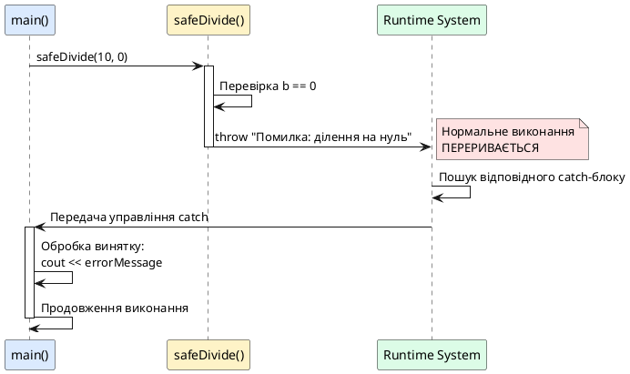
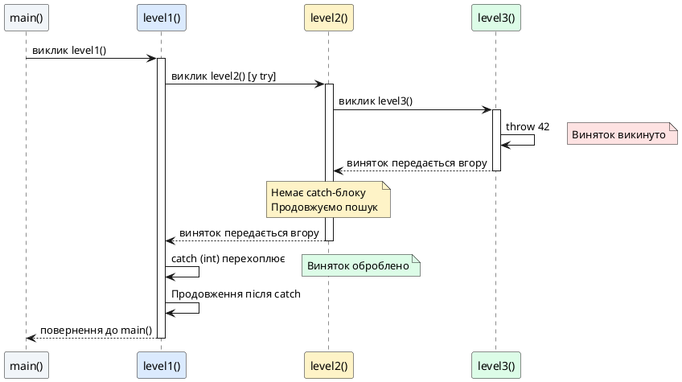
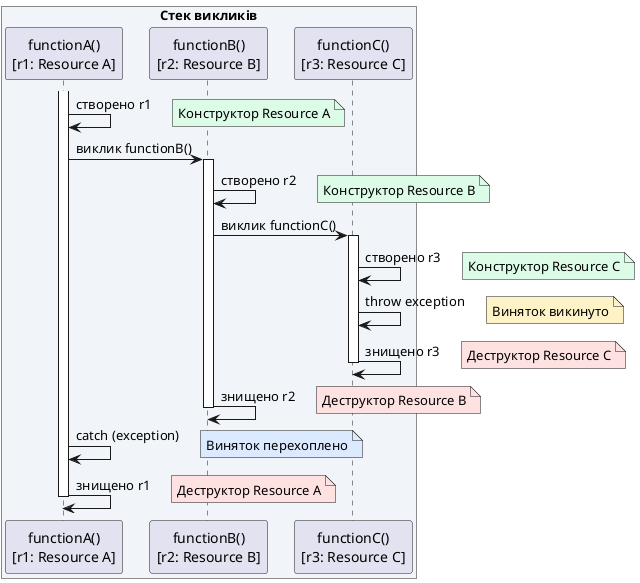

## Від кодів помилок до винятків: еволюція обробки помилок

У попередніх лекціях ми працювали з функціями, що повертають значення або модифікують об'єкти. Проте реальні програми стикаються з **виняткими ситуаціями** (*exceptional situations*) — помилками, що не є частиною нормального потоку виконання: відсутність файлу, переповнення буфера, ділення на нуль, недостатньо пам'яті. Традиційний підхід до обробки помилок у мові C базується на **кодах повернення**:

```cpp [ErrorCodesApproach.cpp]
#include <iostream>
#include <cmath>

// Традиційний C-стилевий підхід: код помилки через повернення
int safeDivide(int a, int b, double& result)
{
    if (b == 0)
        return -1;  // Код помилки: ділення на нуль
    
    result = static_cast<double>(a) / b;
    return 0;  // Успіх
}

int safeSquareRoot(double value, double& result)
{
    if (value < 0)
        return -1;  // Код помилки: від'ємне значення
    
    result = std::sqrt(value);
    return 0;  // Успіх
}

int main()
{
    double result;
    
    // Потрібно перевіряти кожен виклик
    if (safeDivide(10, 0, result) != 0)
    {
        std::cout << "Помилка: ділення на нуль\n";
        return 1;
    }
    
    if (safeSquareRoot(-5, result) != 0)
    {
        std::cout << "Помилка: від'ємне значення під коренем\n";
        return 1;
    }
    
    std::cout << "Результат: " << result << "\n";
    return 0;
}
```

::terminal-preview{title="./ErrorCodesApproach"}

<div class="line">Помилка: ділення на нуль</div>

::

**Проблеми підходу через коди помилок:**

1. **Примусова перевірка**: потрібно вручну перевіряти кожен виклик функції — забуте `if` призведе до ігнорування помилки
2. **Захаращений код**: логіка обробки помилок змішана з бізнес-логікою, знижуючи читабельність
3. **Обмежений тип повернення**: функція не може одночасно повертати результат і код помилки (потрібні out-параметри)
4. **Відсутність контексту**: код `-1` не містить опису помилки — потрібна додаткова документація
5. **Неможливість пропуску рівнів**: якщо функція `A()` викликає `B()`, а `B()` — `C()`, помилка з `C()` має пройти через `B()`, навіть якщо `B()` не може її обробити

**Механізм винятків** (*exception handling*) у C++ розв'язує ці проблеми, дозволяючи **відокремити код обробки помилок від основної логіки** та автоматично передавати помилки вгору по стеку викликів до того місця, де вони можуть бути оброблені.

::card-group

::card{title="🎯 Мета лекції" icon="i-lucide-target"}

- Опанувати тріаду `try`-`catch`-`throw`: синтаксис викидання та перехоплення винятків
- Зрозуміти механізм розкручування стеку (*stack unwinding*) та його зв'язок із деструкторами
- Навчитися створювати та використовувати множинні catch-блоки для різних типів винятків
- Дослідити порядок перехоплення: від найспецифічніших до загальних типів
- Розібрати типові помилки: проковтування винятків, витоки ресурсів, невизначена поведінка

::

::card{title="🔑 Ключові терміни" icon="i-lucide-key"}

- **Виняток** (*exception*): об'єкт, що сигналізує про виняткову ситуацію та автоматично передається вгору по стеку викликів
- **Викидання винятку** (*throwing an exception*): оператор `throw`, що створює виняток і перериває нормальний потік виконання
- **Перехоплення винятку** (*catching an exception*): блок `catch`, що обробляє виняток конкретного типу
- **Розкручування стеку** (*stack unwinding*): процес автоматичного виклику деструкторів локальних об'єктів при пошуку відповідного catch-блоку
- **Блок захисту** (*try block*): область коду, у якій відстежуються винятки, що можуть бути викинуті
- **Необроблений виняток** (*unhandled exception*): виняток, для якого не знайдено відповідного catch-блоку, призводить до виклику `std::terminate()`

::

::

## Синтаксис `try`, `catch`, `throw`: базова структура

### Викидання винятку: оператор `throw`

Оператор `throw` створює об'єкт-виняток та перериває виконання поточної функції, передаючи управління найближчому відповідному `catch`-блоку:

```cpp [BasicThrowSyntax.cpp]
#include <iostream>

double safeDivide(int a, int b)
{
    if (b == 0)
        throw "Помилка: ділення на нуль";  // Викидаємо виняток типу const char*
    
    return static_cast<double>(a) / b;
}

int main()
{
    try
    {
        double result = safeDivide(10, 0);
        std::cout << "Результат: " << result << "\n";  // Не виконається
    }
    catch (const char* errorMessage)
    {
        std::cout << "Перехоплено виняток: " << errorMessage << "\n";
    }
    
    std::cout << "Програма продовжує виконання\n";
    return 0;
}
```

::terminal-preview{title="./BasicThrowSyntax"}

<div class="line">Перехоплено виняток: Помилка: ділення на нуль</div>
<div class="line">Програма продовжує виконання</div>

::

**Як це працює:**

1. **Виклик `safeDivide(10, 0)`**: функція перевіряє умову `b == 0` → істина
2. **Оператор `throw`**: створює об'єкт `const char*` з повідомленням та перериває виконання функції
3. **Пошук catch-блоку**: runtime шукає найближчий `catch`, що може прийняти `const char*`
4. **Перехоплення**: блок `catch (const char* errorMessage)` отримує управління
5. **Обробка**: виводить повідомлення про помилку
6. **Продовження**: виконання продовжується після блоку `catch`

::plant-uml{alt="Потік виконання при викиданні винятку"}



::

### Блок захисту: `try` та перехоплення `catch`

Блок `try` позначає область коду, у якій можуть виникнути винятки. Одразу після нього має йти один або кілька блоків `catch`:

```cpp
try
{
    // Код, що може викинути виняток
}
catch (тип_винятку параметр)
{
    // Обробка винятку цього типу
}
```

**Важливі правила:**

- `catch`-блок **обов'язковий** — `try` без `catch` є синтаксичною помилкою
- `catch` перехоплює винятки **конкретного типу** або **базового класу**
- Якщо тип викинутого винятку не збігається з жодним `catch`, виняток **передається вгору** по стеку викликів


### Типи винятків: від примітивів до об'єктів

C++ дозволяє викидати **будь-який тип** як виняток: примітивні типи (`int`, `double`), рядки (`const char*`, `std::string`), власні класи. Проте найкраща практика — використовувати **об'єкти класів** для передачі детальної інформації:

```cpp [ExceptionTypes.cpp]
#include <iostream>
#include <string>

// Власний клас винятку
class DivisionByZeroError
{
private:
    int m_numerator;

public:
    DivisionByZeroError(int numerator) : m_numerator(numerator) {}

    std::string getMessage() const
    {
        return "Ділення " + std::to_string(m_numerator) + " на нуль неможливе";
    }
};

double safeDivide(int a, int b)
{
    if (b == 0)
        throw DivisionByZeroError(a);  // Викидаємо об'єкт класу
    
    return static_cast<double>(a) / b;
}

int main()
{
    try
    {
        std::cout << "Результат: " << safeDivide(10, 2) << "\n";
        std::cout << "Результат: " << safeDivide(15, 0) << "\n";  // Викине виняток
        std::cout << "Ця строка не виконається\n";
    }
    catch (const DivisionByZeroError& ex)
    {
        std::cout << "Перехоплено виняток: " << ex.getMessage() << "\n";
    }

    std::cout << "Програма продовжує роботу\n";
    return 0;
}
```

::terminal-preview{title="./ExceptionTypes"}

<div class="line">Результат: 5</div>
<div class="line">Перехоплено виняток: Ділення 15 на нуль неможливе</div>
<div class="line">Програма продовжує роботу</div>

::

**Переваги використання класів для винятків:**

1. **Деталізована інформація**: можна зберігати контекст помилки (значення змінних, час, місце виникнення)
2. **Ієрархія винятків**: можна створювати спадкові класи для категоризації помилок
3. **Типобезпека**: компілятор перевіряє відповідність типів у `catch`
4. **Методи для обробки**: виняток може мати методи для діагностики або відновлення

::note
**Стандартна практика:** У промисловому C++ винятки завжди є об'єктами класів, часто похідними від `std::exception` (розглянемо у наступній лекції). Викидання примітивних типів (`throw 42;`, `throw "error";`) вважається поганою практикою через втрату контексту.

::

### Множинні catch-блоки: обробка різних типів помилок

Один `try`-блок може мати кілька `catch`-блоків для обробки різних типів винятків:

```cpp [MultipleCatchBlocks.cpp]
#include <iostream>
#include <string>

class DivisionByZeroError {};
class NegativeValueError {};

double complexCalculation(int a, int b)
{
    if (b == 0)
        throw DivisionByZeroError();
    
    double result = static_cast<double>(a) / b;
    
    if (result < 0)
        throw NegativeValueError();
    
    return result;
}

int main()
{
    try
    {
        double result = complexCalculation(-10, 2);  // Викине NegativeValueError
        std::cout << "Результат: " << result << "\n";
    }
    catch (const DivisionByZeroError&)
    {
        std::cout << "Помилка: спроба ділення на нуль\n";
    }
    catch (const NegativeValueError&)
    {
        std::cout << "Помилка: результат від'ємний\n";
    }
    catch (...)  // Універсальний catch для всіх інших типів
    {
        std::cout << "Невідома помилка\n";
    }

    return 0;
}
```

::terminal-preview{title="./MultipleCatchBlocks"}

<div class="line">Помилка: результат від'ємний</div>

::

**Порядок catch-блоків:**

- Компілятор перевіряє `catch`-блоки **зверху вниз** у порядку оголошення
- Виконується **перший** підходящий `catch`
- Блок `catch (...)` (три крапки) перехоплює **будь-який тип** винятку — має бути **останнім**

::warning{icon="lucide:alert-triangle"}
**КРИТИЧНА ПОМИЛКА:** Якщо розмістити універсальний `catch (...)` перед специфічними блоками, він перехопить всі винятки, і решта блоків стануть недосяжними:

```cpp
try { /* ... */ }
catch (...)                      // ❌ ПОГАНО: перехопить ВСЕ
{
    std::cout << "Невідома помилка\n";
}
catch (const DivisionByZeroError&)  // ⚠️ Ніколи не виконається!
{
    std::cout << "Ділення на нуль\n";
}
```

Компілятор **не завжди** попереджає про це, тому важливо дотримуватися порядку: специфічні → загальні.

::

### Передавання винятків вгору по стеку викликів

Якщо функція не має відповідного `catch`-блоку, виняток автоматично передається **викликачеві**:

```cpp [ExceptionPropagation.cpp]
#include <iostream>

void level3()
{
    std::cout << "level3(): викидаємо виняток\n";
    throw 42;  // Немає try-catch — виняток йде до level2()
}

void level2()
{
    std::cout << "level2(): викликаємо level3()\n";
    level3();  // Немає try-catch — виняток йде до level1()
    std::cout << "level2(): ця строка не виконається\n";
}

void level1()
{
    std::cout << "level1(): викликаємо level2()\n";
    try
    {
        level2();
    }
    catch (int error)
    {
        std::cout << "level1(): перехоплено виняток з кодом " << error << "\n";
    }
    std::cout << "level1(): продовжуємо роботу\n";
}

int main()
{
    level1();
    std::cout << "main(): програма завершена\n";
    return 0;
}
```

::terminal-preview{title="./ExceptionPropagation"}

<div class="line">level1(): викликаємо level2()</div>
<div class="line">level2(): викликаємо level3()</div>
<div class="line">level3(): викидаємо виняток</div>
<div class="line">level1(): перехоплено виняток з кодом 42</div>
<div class="line">level1(): продовжуємо роботу</div>
<div class="line">main(): програма завершена</div>

::

**Візуалізація стеку викликів:**

```
main()
  → level1()
      → try { level2() }
            → level3()
                → throw 42  ← Виняток викинуто тут
            ← Повернення до level2() пропущено
        ← Повернення до level1() пропущено
      ← catch (int) перехоплює виняток
```

::plant-uml{alt="Передавання винятку по стеку викликів"}



::

**Ключове спостереження:** Функції `level2()` та `level3()` **не потребують знати** про обробку помилок. Вони просто викидають виняток, і він автоматично доходить до того рівня, де є відповідний `catch`. Це дозволяє **відокремити логіку від обробки помилок**.


## Розкручування стеку: автоматичне звільнення ресурсів

Одна з найпотужніших властивостей механізму винятків — **розкручування стеку** (*stack unwinding*). Коли виняток передається вгору по стеку викликів, C++ runtime автоматично викликає **деструктори всіх локальних об'єктів** у зворотному порядку їхнього створення.

### Механізм розкручування: від винятку до catch

Розглянемо докладний приклад з об'єктами, що виводять повідомлення у конструкторі та деструкторі:

```cpp [StackUnwinding.cpp]
#include <iostream>

class Resource
{
private:
    std::string m_name;

public:
    Resource(const std::string& name) : m_name(name)
    {
        std::cout << "  [Конструктор] " << m_name << " створено\n";
    }

    ~Resource()
    {
        std::cout << "  [Деструктор] " << m_name << " знищено\n";
    }
};

void functionC()
{
    Resource r3("Resource C");
    std::cout << "functionC(): викидаємо виняток\n";
    throw std::runtime_error("Помилка у functionC");
    std::cout << "functionC(): ця строка не виконається\n";
}

void functionB()
{
    Resource r2("Resource B");
    std::cout << "functionB(): викликаємо functionC()\n";
    functionC();
    std::cout << "functionB(): ця строка не виконається\n";
}

void functionA()
{
    Resource r1("Resource A");
    std::cout << "functionA(): викликаємо functionB()\n";
    
    try
    {
        functionB();
    }
    catch (const std::exception& ex)
    {
        std::cout << "functionA(): перехоплено виняток: " << ex.what() << "\n";
    }
    
    std::cout << "functionA(): продовжуємо роботу\n";
}

int main()
{
    std::cout << "=== Початок виконання ===\n";
    functionA();
    std::cout << "=== Завершення виконання ===\n";
    return 0;
}
```

::terminal-preview{title="./StackUnwinding"}

<div class="line">=== Початок виконання ===</div>
<div class="line">  [Конструктор] Resource A створено</div>
<div class="line">functionA(): викликаємо functionB()</div>
<div class="line">  [Конструктор] Resource B створено</div>
<div class="line">functionB(): викликаємо functionC()</div>
<div class="line">  [Конструктор] Resource C створено</div>
<div class="line">functionC(): викидаємо виняток</div>
<div class="line">  [Деструктор] Resource C знищено</div>
<div class="line">  [Деструктор] Resource B знищено</div>
<div class="line">functionA(): перехоплено виняток: Помилка у functionC</div>
<div class="line">functionA(): продовжуємо роботу</div>
<div class="line">  [Деструктор] Resource A знищено</div>
<div class="line">=== Завершення виконання ===</div>

::

**Покроковий аналіз розкручування:**

1. **`functionC()` викидає виняток** → runtime перериває виконання функції
2. **Автоматичний виклик `~Resource()` для `r3`** → ресурс C коректно звільнено
3. **Повернення до `functionB()`** → немає catch-блоку, продовжуємо розкручування
4. **Автоматичний виклик `~Resource()` для `r2`** → ресурс B коректно звільнено
5. **Повернення до `functionA()`** → знайдено `catch (const std::exception&)`
6. **Виняток перехоплено** → розкручування зупинено, виконання продовжується після catch
7. **Нормальне завершення `functionA()`** → виклик `~Resource()` для `r1`

::plant-uml{alt="Процес розкручування стеку"}



::

::tip{icon="lucide:shield-check"}
**RAII та винятки — ідеальна комбінація:** Ідіома RAII (*Resource Acquisition Is Initialization*), яку ми вивчали у статті 54, гарантує автоматичне звільнення ресурсів навіть при виникненні винятків. Розкручування стеку викликає деструктори, а деструктори звільняють пам'ять, закривають файли, звільняють м'ютекси — все автоматично.

::

### Порівняння: RAII vs ручне управління ресурсами

Розглянемо, як механізм винятків взаємодіє з різними підходами до управління ресурсами:

::::code-group

:::code-block{label="❌ Без RAII: витік ресурсів" active}
```cpp
void processFile()
{
    int* data = new int[1000];  // Виділення пам'яті
    
    // Якщо тут виникне виняток, delete не виконається
    riskyOperation();  // Може викинути виняток
    
    delete[] data;  // ❌ Ця строка може не виконатись
}
```
:::

:::code-block{label="✅ З RAII: автоматичне звільнення"}
```cpp
#include <memory>

void processFile()
{
    std::unique_ptr<int[]> data(new int[1000]);  // RAII-обгортка
    
    // Навіть якщо виникне виняток, деструктор unique_ptr
    // автоматично викличе delete[] під час розкручування стеку
    riskyOperation();
    
    // delete[] не потрібен — виконається автоматично
}
```
:::

::::

**Правило безпеки:** Ніколи не викликайте `new` без відповідного RAII-класу (`std::unique_ptr`, `std::shared_ptr`, власний клас із деструктором). Інакше виняток призведе до **витоку пам'яті**.

### Обмеження: що НЕ очищається під час розкручування

Розкручування стеку викликає деструктори **лише для локальних об'єктів**. Наступні ресурси **не звільняються автоматично**:

1. **Пам'ять, виділена через `new`** (без RAII-обгортки) → потрібен `delete` у `catch`
2. **Відкриті файли через C-стилі `FILE*`** → потрібен `fclose()` у `catch`
3. **Глобальні або статичні ресурси** → деструктори не викликаються до завершення програми
4. **Ресурси, отримані через C API** (сокети, дескриптори) → потрібне ручне звільнення

```cpp [ManualCleanupInCatch.cpp]
#include <iostream>

void unsafeFunction()
{
    int* data = new int[1000];  // ❌ Небезпечно без RAII
    
    try
    {
        riskyOperation();  // Може викинути виняток
        delete[] data;  // Виконається лише якщо немає винятку
    }
    catch (...)
    {
        delete[] data;  // ⚠️ Потрібно дублювати звільнення
        throw;  // Перекидаємо виняток далі
    }
}
```

::warning{icon="lucide:shield-alert"}
**Антипатерн:** Ручне звільнення ресурсів у `catch` дублює код та схильне до помилок. Завжди використовуйте RAII-обгортки (`std::unique_ptr`, `std::fstream`, `std::lock_guard`) для автоматичного управління ресурсами.

::


## Перекидання винятків: `throw;` без аргументів

Іноді `catch`-блок потребує **частково обробити** виняток (наприклад, залогувати помилку), але не може повністю його вирішити. У таких випадках виняток можна **перекинути далі** вгору по стеку за допомогою `throw;` без аргументів:

```cpp [Rethrowing.cpp]
#include <iostream>

void lowLevelFunction()
{
    std::cout << "lowLevelFunction(): викидаємо виняток\n";
    throw std::runtime_error("Критична помилка на низькому рівні");
}

void middleLevelFunction()
{
    try
    {
        lowLevelFunction();
    }
    catch (const std::exception& ex)
    {
        std::cout << "middleLevelFunction(): частково обробляємо виняток\n";
        std::cout << "  Логування: " << ex.what() << "\n";
        
        // Перекидаємо той самий виняток далі
        throw;  // ← Без аргументів: перекидається оригінальний виняток
    }
}

void highLevelFunction()
{
    try
    {
        middleLevelFunction();
    }
    catch (const std::exception& ex)
    {
        std::cout << "highLevelFunction(): остаточна обробка\n";
        std::cout << "  Повідомлення користувачеві: операція не вдалася\n";
    }
}

int main()
{
    highLevelFunction();
    return 0;
}
```

::terminal-preview{title="./Rethrowing"}

<div class="line">lowLevelFunction(): викидаємо виняток</div>
<div class="line">middleLevelFunction(): частково обробляємо виняток</div>
<div class="line">  Логування: Критична помилка на низькому рівні</div>
<div class="line">highLevelFunction(): остаточна обробка</div>
<div class="line">  Повідомлення користувачеві: операція не вдалася</div>

::

**Різниця між `throw;` та `throw ex;`:**

| Оператор | Поведінка | Використання |
|:---------|:----------|:-------------|
| `throw;` | Перекидає **оригінальний виняток** зі збереженням типу | ✅ Рекомендовано: зберігає повну інформацію |
| `throw ex;` | Створює **копію** об'єкта `ex` (може зрізати тип) | ⚠️ Небезпечно: може втратити інформацію |

**Проблема зрізки об'єкта при `throw ex;`:**

```cpp [SlicingProblem.cpp]
#include <iostream>

class BaseException
{
public:
    virtual void printType() const { std::cout << "BaseException\n"; }
};

class DerivedException : public BaseException
{
public:
    void printType() const override { std::cout << "DerivedException\n"; }
};

void demonstrateSlicing()
{
    try
    {
        throw DerivedException();  // Викидаємо похідний тип
    }
    catch (const BaseException& ex)
    {
        ex.printType();  // Виведе "DerivedException" (правильно)
        
        // ❌ ПОГАНО: throw ex створить копію BaseException (зрізка!)
        // throw ex;
        
        // ✅ ДОБРЕ: throw без аргументів зберігає оригінальний тип
        throw;
    }
}

int main()
{
    try
    {
        demonstrateSlicing();
    }
    catch (const DerivedException&)
    {
        std::cout << "Перехоплено DerivedException\n";
    }
    catch (const BaseException&)
    {
        std::cout << "Перехоплено BaseException (зрізка сталась!)\n";
    }

    return 0;
}
```

::terminal-preview{title="./SlicingProblem (з throw;)"}

<div class="line">DerivedException</div>
<div class="line">Перехоплено DerivedException</div>

::

::note
**Золоте правило перекидання:** Завжди використовуйте `throw;` без аргументів для перекидання винятків. Це гарантує збереження оригінального типу, vtable, та всієї інформації про виняток.

::

## Необроблені винятки: `std::terminate()` та аварійне завершення

Якщо виняток не перехоплено жодним `catch`-блоком, C++ runtime викликає функцію `std::terminate()`, яка за замовчуванням викликає `std::abort()` — аварійне завершення програми **без виклику деструкторів**.

```cpp [UnhandledException.cpp]
#include <iostream>

class Resource
{
public:
    Resource() { std::cout << "[Конструктор] Resource створено\n"; }
    ~Resource() { std::cout << "[Деструктор] Resource знищено\n"; }
};

void throwUnhandledException()
{
    Resource res;
    throw std::runtime_error("Необроблений виняток");
}

int main()
{
    std::cout << "=== Початок програми ===\n";
    
    // ❌ Немає try-catch для перехоплення
    throwUnhandledException();
    
    std::cout << "=== Ця строка не виконається ===\n";
    return 0;
}
```

::terminal-preview{title="./UnhandledException"}

<div class="line">=== Початок програми ===</div>
<div class="line">[Конструктор] Resource створено</div>
<div class="line">terminate called after throwing an instance of 'std::runtime_error'</div>
<div class="line">  what():  Необроблений виняток</div>
<div class="line">Aborted (core dumped)</div>

::

**Що відбувається:**

1. `throwUnhandledException()` викидає виняток
2. Runtime шукає відповідний `catch` → не знаходить
3. Досягнуто `main()` → немає `catch` у `main()`
4. Досягнуто кореня стеку → викликається `std::terminate()`
5. `std::terminate()` викликає `std::abort()` → **аварійне завершення**
6. **Деструктори НЕ викликаються** → ресурси не звільнено

::caution{icon="lucide:skull"}
**КРИТИЧНА НЕБЕЗПЕКА:** Необроблений виняток призводить до аварійного завершення без виклику деструкторів. Це може призвести до:

- **Витоку пам'яті** (незвільнені `new`)
- **Незакритих файлів** (дані залишаються у буфері)
- **Незахищених критичних секцій** (м'ютекси залишаються захопленими)
- **Втрати даних** (незбережені зміни у БД)

Завжди майте кореневий `try-catch` у `main()` для перехоплення неочікуваних винятків.

::

### Захист від необроблених винятків: кореневий catch

Безпечна практика — обгорнути весь код `main()` у `try-catch` із універсальним перехопленням:

```cpp [SafeMain.cpp]
#include <iostream>
#include <exception>

void riskyOperation()
{
    throw std::runtime_error("Несподівана помилка");
}

int main()
{
    try
    {
        std::cout << "=== Початок програми ===\n";
        
        riskyOperation();
        
        std::cout << "=== Завершення програми ===\n";
    }
    catch (const std::exception& ex)
    {
        std::cerr << "ФАТАЛЬНА ПОМИЛКА: " << ex.what() << "\n";
        return 1;  // Код помилки для ОС
    }
    catch (...)
    {
        std::cerr << "НЕВІДОМА ФАТАЛЬНА ПОМИЛКА\n";
        return 2;
    }

    return 0;  // Успішне завершення
}
```

::terminal-preview{title="./SafeMain"}

<div class="line">=== Початок програми ===</div>
<div class="line">ФАТАЛЬНА ПОМИЛКА: Несподівана помилка</div>

::

**Переваги кореневого catch:**

- ✅ Програма завершується **контрольовано** з кодом помилки
- ✅ Деструктори локальних об'єктів у `main()` викликаються
- ✅ Можна залогувати помилку перед завершенням
- ✅ Можна спробувати зберегти критичні дані


## Типові помилки та антипатерни при роботі з винятками

### Помилка 1: Проковтування винятків (Silent Failure)

Найнебезпечніша практика — перехоплювати виняток і нічого не робити:

::::code-group

:::code-block{label="❌ Антипатерн: мовчазне ігнорування" active}
```cpp
try
{
    riskyOperation();
}
catch (...)
{
    // Порожній catch — виняток проковтнуто
    // Програма продовжує роботу так, ніби нічого не сталось
}
```
:::

:::code-block{label="✅ Правильно: логування або перекидання"}
```cpp
try
{
    riskyOperation();
}
catch (const std::exception& ex)
{
    // Мінімум — залогувати помилку
    std::cerr << "ПОПЕРЕДЖЕННЯ: " << ex.what() << "\n";
    
    // Або перекинути далі, якщо не можемо обробити
    throw;
}
```
:::

::::

**Чому це небезпечно:** Програма продовжує виконання у невизначеному стані. Наприклад, якщо `riskyOperation()` мала записати дані у файл, але викинула виняток, програма може думати, що дані збережено, хоча насправді файл порожній.

### Помилка 2: Перехоплення за значенням замість за посиланням

Перехоплення винятку **за значенням** призводить до зайвого копіювання та можливої зрізки об'єкта:

::::code-group

:::code-block{label="❌ Погано: копіювання та зрізка" active}
```cpp
try
{
    throw DerivedException();
}
catch (BaseException ex)  // ❌ За значенням — копіювання!
{
    // ex — це копія, можлива зрізка типу
}
```
:::

:::code-block{label="✅ Добре: посилання на const"}
```cpp
try
{
    throw DerivedException();
}
catch (const BaseException& ex)  // ✅ За const-посиланням
{
    // Ефективно, без копіювання, зберігає оригінальний тип
}
```
:::

::::

**Правило:** Завжди перехоплюйте винятки **за const-посиланням** (`const T&`), крім випадків, коли потрібна модифікація об'єкта винятку.

### Помилка 3: Викидання винятків у деструкторах

Викидання винятку з деструктора — одна з найнебезпечніших помилок у C++:

```cpp [ExceptionInDestructor.cpp]
#include <iostream>

class DangerousResource
{
public:
    ~DangerousResource()
    {
        std::cout << "Деструктор: викидаємо виняток\n";
        throw std::runtime_error("Помилка у деструкторі");  // ❌ НЕБЕЗПЕЧНО!
    }
};

int main()
{
    try
    {
        DangerousResource res;
        throw std::runtime_error("Перший виняток");
    }
    catch (const std::exception& ex)
    {
        std::cout << "Перехоплено: " << ex.what() << "\n";
    }

    return 0;
}
```

**Що станеться:**

1. Викидається `"Перший виняток"` у `try`-блоці
2. Розкручування стеку викликає `~DangerousResource()`
3. Деструктор викидає `"Помилка у деструкторі"` → **два активні винятки одночасно**
4. C++ **не може обробити два винятки одночасно** → викликається `std::terminate()`
5. Програма **аварійно завершується** без перехоплення жодного винятку

::terminal-preview{title="./ExceptionInDestructor"}

<div class="line">Деструктор: викидаємо виняток</div>
<div class="line">terminate called after throwing an instance of 'std::runtime_error'</div>
<div class="line">  what():  Помилка у деструкторі</div>
<div class="line">Aborted (core dumped)</div>

::

::warning{icon="lucide:shield-x"}
**АБСОЛЮТНА ЗАБОРОНА:** Ніколи не дозволяйте винятку вийти з деструктора. Якщо операція у деструкторі може провалитись, обгорніть її у `try-catch` і залогуйте помилку, але не перекидайте далі:

```cpp
~SafeResource()
{
    try
    {
        riskyCleanup();
    }
    catch (const std::exception& ex)
    {
        std::cerr << "Помилка звільнення ресурсу: " << ex.what() << "\n";
        // НЕ throw; — проковтуємо виняток
    }
}
```

У наступних лекціях розглянемо специфікатор `noexcept`, що гарантує відсутність винятків на рівні компілятора.

::

### Помилка 4: Забуті ресурси через ранній вихід

Викидання винятку **до** виділення ресурсу призводить до того, що ресурс ніколи не буде звільнений:

```cpp [ForgottenResource.cpp]
void processData()
{
    int* data = new int[1000];
    
    validateInput();  // ❌ Якщо викине виняток, delete не виконається
    
    // Обробка data...
    
    delete[] data;  // Ця строка може не виконатись
}
```

**Розв'язання через RAII:**

```cpp
void processData()
{
    std::unique_ptr<int[]> data(new int[1000]);  // ✅ RAII-обгортка
    
    validateInput();  // Навіть при винятку деструктор звільнить пам'ять
    
    // Обробка data...
    
    // delete не потрібен
}
```

## Практичне завдання: система валідації з винятками

::::accordion

:::accordion-item{label="📋 Завдання: розробка класу валідатора з ієрархією винятків" icon="i-lucide-clipboard-list"}

Реалізуйте клас `Validator`, що перевіряє введені дані та викидає спеціалізовані винятки при порушенні обмежень:

1. **Базовий клас винятку** `ValidationError` з полем `message`
2. **Похідні класи**:
   - `EmptyValueError` — порожнє значення
   - `OutOfRangeError` — значення поза діапазоном (зберігає `min`, `max`, `actual`)
   - `InvalidFormatError` — невалідний формат

3. **Клас `Validator`** з методами:
   - `validateNotEmpty(const std::string& value)` — перевіряє, що рядок не порожній
   - `validateRange(int value, int min, int max)` — перевіряє діапазон
   - `validateEmail(const std::string& email)` — перевіряє наявність `@`

**Приклад використання:**

```cpp
int main()
{
    Validator validator;

    try
    {
        validator.validateNotEmpty("");  // Викине EmptyValueError
    }
    catch (const ValidationError& ex)
    {
        std::cout << "Помилка: " << ex.getMessage() << "\n";
    }

    try
    {
        validator.validateRange(150, 0, 100);  // Викине OutOfRangeError
    }
    catch (const OutOfRangeError& ex)
    {
        std::cout << "Діапазон: [" << ex.getMin() << ", " << ex.getMax() 
                  << "], отримано: " << ex.getActual() << "\n";
    }

    return 0;
}
```

**Очікуваний вивід:**

```
Помилка: Значення не може бути порожнім
Діапазон: [0, 100], отримано: 150
```

:::

:::accordion-item{label="✅ Розв'язок" icon="i-lucide-check-circle"}

```cpp
#include <iostream>
#include <string>

// ═════════════════════════════════════════════════════════════
// БАЗОВИЙ КЛАС ВИНЯТКУ
// ═════════════════════════════════════════════════════════════
class ValidationError
{
protected:
    std::string m_message;

public:
    ValidationError(const std::string& message) : m_message(message) {}
    virtual ~ValidationError() = default;

    virtual std::string getMessage() const { return m_message; }
};

// ═════════════════════════════════════════════════════════════
// ПОХІДНІ КЛАСИ ВИНЯТКІВ
// ═════════════════════════════════════════════════════════════

class EmptyValueError : public ValidationError
{
public:
    EmptyValueError() 
        : ValidationError("Значення не може бути порожнім") {}
};

class OutOfRangeError : public ValidationError
{
private:
    int m_min;
    int m_max;
    int m_actual;

public:
    OutOfRangeError(int min, int max, int actual)
        : ValidationError("Значення поза діапазоном"),
          m_min(min), m_max(max), m_actual(actual) {}

    int getMin() const { return m_min; }
    int getMax() const { return m_max; }
    int getActual() const { return m_actual; }

    std::string getMessage() const override
    {
        return "Значення " + std::to_string(m_actual) + 
               " поза діапазоном [" + std::to_string(m_min) + 
               ", " + std::to_string(m_max) + "]";
    }
};

class InvalidFormatError : public ValidationError
{
private:
    std::string m_field;

public:
    InvalidFormatError(const std::string& field)
        : ValidationError("Невалідний формат поля: " + field),
          m_field(field) {}

    std::string getField() const { return m_field; }
};

// ═════════════════════════════════════════════════════════════
// КЛАС ВАЛІДАТОРА
// ═════════════════════════════════════════════════════════════
class Validator
{
public:
    void validateNotEmpty(const std::string& value) const
    {
        if (value.empty())
            throw EmptyValueError();
    }

    void validateRange(int value, int min, int max) const
    {
        if (value < min || value > max)
            throw OutOfRangeError(min, max, value);
    }

    void validateEmail(const std::string& email) const
    {
        if (email.find('@') == std::string::npos)
            throw InvalidFormatError("email");
    }
};

// ═════════════════════════════════════════════════════════════
// ДЕМОНСТРАЦІЯ РОБОТИ
// ═════════════════════════════════════════════════════════════
int main()
{
    Validator validator;

    std::cout << "=== Тест 1: Порожнє значення ===\n";
    try
    {
        validator.validateNotEmpty("");
        std::cout << "Валідація пройшла успішно\n";
    }
    catch (const ValidationError& ex)
    {
        std::cout << "Помилка: " << ex.getMessage() << "\n";
    }

    std::cout << "\n=== Тест 2: Значення поза діапазоном ===\n";
    try
    {
        validator.validateRange(150, 0, 100);
        std::cout << "Валідація пройшла успішно\n";
    }
    catch (const OutOfRangeError& ex)
    {
        std::cout << "Діапазон: [" << ex.getMin() << ", " << ex.getMax() 
                  << "], отримано: " << ex.getActual() << "\n";
    }
    catch (const ValidationError& ex)
    {
        std::cout << "Помилка: " << ex.getMessage() << "\n";
    }

    std::cout << "\n=== Тест 3: Невалідний email ===\n";
    try
    {
        validator.validateEmail("invalid.email.com");
        std::cout << "Валідація пройшла успішно\n";
    }
    catch (const InvalidFormatError& ex)
    {
        std::cout << "Поле '" << ex.getField() << "': " << ex.getMessage() << "\n";
    }
    catch (const ValidationError& ex)
    {
        std::cout << "Помилка: " << ex.getMessage() << "\n";
    }

    std::cout << "\n=== Тест 4: Валідні дані ===\n";
    try
    {
        validator.validateNotEmpty("Hello");
        validator.validateRange(50, 0, 100);
        validator.validateEmail("user@example.com");
        std::cout << "Всі перевірки пройшли успішно!\n";
    }
    catch (const ValidationError& ex)
    {
        std::cout << "Помилка: " << ex.getMessage() << "\n";
    }

    return 0;
}
```

::terminal-preview{title="./ValidatorSystem"}

<div class="line">=== Тест 1: Порожнє значення ===</div>
<div class="line">Помилка: Значення не може бути порожнім</div>
<div class="line"></div>
<div class="line">=== Тест 2: Значення поза діапазоном ===</div>
<div class="line">Діапазон: [0, 100], отримано: 150</div>
<div class="line"></div>
<div class="line">=== Тест 3: Невалідний email ===</div>
<div class="line">Поле 'email': Невалідний формат поля: email</div>
<div class="line"></div>
<div class="line">=== Тест 4: Валідні дані ===</div>
<div class="line">Всі перевірки пройшли успішно!</div>

::

**Архітектурні особливості розв'язку:**

1. **Ієрархія винятків**: базовий `ValidationError` дозволяє перехоплювати всі помилки валідації одним `catch`
2. **Віртуальний `getMessage()`**: похідні класи можуть перевизначати формат повідомлення
3. **Додаткові дані у винятках**: `OutOfRangeError` зберігає `min`, `max`, `actual` для детальної діагностики
4. **Порядок catch-блоків**: спочатку специфічні (`OutOfRangeError`), потім загальні (`ValidationError`)
5. **Віртуальний деструктор**: базовий клас має `virtual ~ValidationError()` для коректного видалення похідних об'єктів

:::

::::


## Питання для самоперевірки

::::accordion

:::accordion-item{label="❓ Чому коди помилок через повернення гірші за винятки?" icon="i-lucide-help-circle"}

**Основні недоліки кодів повернення:**

1. **Примусова перевірка**: розробник може забути перевірити код помилки → помилка ігнорується мовчки
2. **Захаращений код**: перевірки `if (error)` змішуються з бізнес-логікою, знижуючи читабельність
3. **Обмеження типу повернення**: функція не може одночасно повертати результат і код помилки (потрібні out-параметри або структури)
4. **Відсутність контексту**: код `-1` не містить опису помилки
5. **Неможливість пропуску рівнів**: помилка має проходити через всі проміжні функції, навіть якщо вони не можуть її обробити

**Переваги винятків:**

- Відокремлення логіки обробки помилок від основного коду
- Автоматичне передавання вгору по стеку до місця, де помилка може бути оброблена
- Багата інформація про помилку через об'єкти класів
- Автоматичне звільнення ресурсів через розкручування стеку та RAII

:::

:::accordion-item{label="❓ Що таке розкручування стеку та чому воно критично важливе?" icon="i-lucide-help-circle"}

**Розкручування стеку** (*stack unwinding*) — це процес автоматичного виклику деструкторів локальних об'єктів при передаванні винятку вгору по стеку викликів.

**Алгоритм:**

1. Виняток викидається у функції `C()`
2. Runtime шукає відповідний `catch` у `C()` → не знаходить
3. **Викликає деструктори всіх локальних об'єктів у `C()`** у зворотному порядку створення
4. Повертається до функції `B()` → шукає `catch` → не знаходить
5. **Викликає деструктори всіх локальних об'єктів у `B()`**
6. Продовжує до тих пір, поки не знайде `catch` або не досягне `main()`

**Критична важливість:**

- Гарантує **автоматичне звільнення ресурсів** через деструктори (пам'ять, файли, м'ютекси)
- Забезпечує **безпеку винятків** (*exception safety*) у поєднанні з RAII
- Дозволяє писати **чистий код** без дублювання логіки звільнення у кожному catch-блоці

:::

:::accordion-item{label="❓ У чому різниця між throw; та throw ex;?" icon="i-lucide-help-circle"}

**`throw;` (без аргументів):**
- Перекидає **оригінальний виняток** зі збереженням повного типу
- Зберігає vtable для віртуальних методів
- Не створює копію об'єкта

**`throw ex;` (з аргументом):**
- Створює **копію** об'єкта `ex`
- Може призвести до **зрізки об'єкта** (*object slicing*), якщо `ex` має базовий тип, а оригінальний виняток був похідним
- Втрачається інформація про реальний тип винятку

**Приклад зрізки:**

```cpp
try {
    throw DerivedException();  // Оригінальний тип: DerivedException
}
catch (const BaseException& ex) {
    ex.printType();  // Виведе "DerivedException"
    throw ex;        // ❌ Створює копію BaseException (зрізка!)
    // throw;        // ✅ Перекидає DerivedException (правильно)
}
```

**Золоте правило:** Завжди використовуйте `throw;` для перекидання винятків.

:::

:::accordion-item{label="❓ Чому викидання винятку з деструктора призводить до std::terminate()?" icon="i-lucide-help-circle"}

**Проблема двох активних винятків:**

Якщо виняток викидається з деструктора **під час розкручування стеку** (коли вже існує активний виняток), C++ опиняється у ситуації **двох одночасно активних винятків**. Стандарт C++ не дозволяє це — runtime викликає `std::terminate()`.

**Сценарій:**

1. Функція викидає виняток A
2. Розкручування стеку викликає деструктор об'єкта
3. Деструктор викидає виняток B
4. **Два винятки одночасно:** A (який ще не перехоплено) + B (щойно викинутий)
5. Runtime викликає `std::terminate()` → аварійне завершення

**Рішення:**

```cpp
~SafeResource()
{
    try {
        riskyCleanup();
    }
    catch (...) {
        // Логування помилки, але НЕ throw
        std::cerr << "Помилка у деструкторі\n";
    }
}
```

**Правило:** Деструктор **ніколи** не повинен дозволяти винятку вийти назовні. У наступних лекціях розглянемо специфікатор `noexcept`, що гарантує це на рівні компілятора.

:::

::::

## Резюме та перспективи подальшого вивчення

У цій лекції ми опанували фундаментальні механізми обробки винятків у C++ — інструменти, що дозволяють відокремити логіку обробки помилок від основного коду та забезпечити автоматичне звільнення ресурсів. Ми розібрали:

::card-group

::card{icon="lucide:zap" title="Синтаксис та механізми"}

- Тріада `try`-`catch`-`throw` для викидання та перехоплення винятків
- Типи винятків: від примітивів до об'єктів класів
- Множинні catch-блоки для різних типів помилок
- Порядок перехоплення: специфічні → загальні

::

::card{icon="lucide:layers" title="Розкручування стеку"}

- Автоматичний виклик деструкторів локальних об'єктів
- Взаємодія з ідіомою RAII для безпеки винятків
- Передавання винятків вгору по стеку викликів
- Обмеження: що не звільняється автоматично

::

::card{icon="lucide:repeat" title="Перекидання винятків"}

- `throw;` без аргументів — зберігає оригінальний тип
- `throw ex;` — створює копію та може призвести до зрізки
- Часткова обробка з передаванням далі (логування)

::

::card{icon="lucide:alert-octagon" title="Небезпеки та антипатерни"}

- Необроблені винятки та `std::terminate()`
- Проковтування винятків (silent failure)
- Перехоплення за значенням замість за посиланням
- Викидання винятків з деструкторів

::

::

### Порівняння підходів до обробки помилок

| Характеристика | Коди повернення | Винятки |
|:--------------|:---------------|:--------|
| **Відокремлення логіки** | ❌ Змішано з бізнес-логікою | ✅ Відокремлено у catch-блоках |
| **Примусова перевірка** | ❌ Можна забути перевірити | ✅ Неможливо ігнорувати (terminate) |
| **Контекст помилки** | ❌ Обмежений (лише код) | ✅ Багатий (об'єкти класів) |
| **Пропуск рівнів** | ❌ Має проходити через всі функції | ✅ Автоматично до відповідного catch |
| **Звільнення ресурсів** | ❌ Ручне у кожній функції | ✅ Автоматичне через розкручування |
| **Продуктивність** | ✅ Жодних витрат | ⚠️ Витрати при викиданні винятку |

::note
**Коли використовувати коди помилок:** У критичних за продуктивністю ділянках коду, де помилки є **очікуваними** (наприклад, парсинг вхідних даних, валідація), коди повернення можуть бути кращим вибором. Для **виняткових ситуацій** (відмова диска, відсутність пам'яті) винятки — стандартний підхід.

::

### Зв'язок із майбутніми темами

Базові механізми винятків є фундаментом для більш просунутих тем:

1. **Стаття 86 — Ієрархія std::exception:** стандартні класи винятків, `what()`, власні похідні класи
2. **Стаття 87 — Гарантії безпеки винятків:** базова, строга, no-throw гарантії, `noexcept`-специфікатор
3. **Стаття 88 — Функціональний try-блок:** обробка винятків у конструкторах та списках ініціалізації
4. **Move-семантика (статті 89–92):** взаємодія `noexcept` із переміщенням, сильні гарантії безпеки
5. **STL та винятки:** контейнери та алгоритми, що надають гарантії безпеки винятків

### Практичні рекомендації

1. **Завжди перехоплюйте за const-посиланням** (`const T&`), крім випадків модифікації
2. **Викидайте об'єкти класів**, а не примітивні типи — для багатого контексту
3. **Використовуйте RAII** для всіх ресурсів — гарантія звільнення при винятках
4. **Ніколи не викидайте з деструкторів** — призводить до `std::terminate()`
5. **Майте кореневий try-catch у main()** — запобігання необробленим винятком
6. **Не проковтуйте винятки** — як мінімум логуйте або перекидайте далі
7. **Порядок catch: специфічні → загальні** — уникайте недосяжних блоків

::warning{icon="lucide:cpu"}
**Продуктивність винятків:** Викидання та перехоплення винятку коштує значно дорожче за звичайний виклик функції (tablesearch для пошуку catch, розкручування стеку). Тому винятки слід використовувати **лише для виняткових ситуацій**, а не для контролю нормального потоку виконання (наприклад, не використовуйте виняток для виходу з циклу).

::

---

**Ключовий висновок:** Механізм винятків C++ дозволяє будувати **відмовостійкі** (*fault-tolerant*) системи, що коректно обробляють помилки без захаращування основної логіки. Поєднання винятків із RAII гарантує автоматичне звільнення ресурсів навіть при найскладніших сценаріях розгалуженого потоку виконання. Розуміння розкручування стеку та правил перехоплення — фундамент для написання безпечного та підтримуваного коду у сучасному C++.

