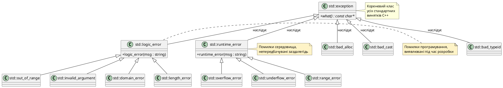
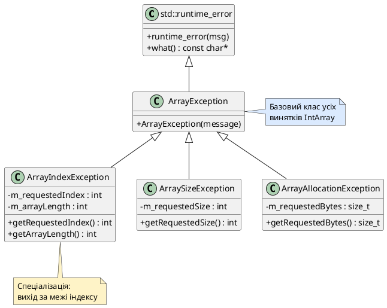

# Ієрархія `std::exception` та власні класи винятків

::card-group

::card{title="🎯 Мета лекції" icon="i-lucide-target"}

- Ознайомитися зі стандартною ієрархією класів винятків C++ (`std::exception`, `std::runtime_error`, `std::logic_error`, `std::out_of_range`).
- Опанувати роботу з віртуальним методом `const char* what() const noexcept`.
- Навчитися проєктувати та реалізовувати власні класи винятків предметної області шляхом наслідування від `std::runtime_error`.
- Засвоїти правила черговості блоків `catch`: розміщення обробників від найбільш похідного класу до базового (уникнення маскування).
- Використовувати універсальний перехоплювач `catch (...)` (*catch-all*) та зрозуміти його ризики.
- З'ясувати поведінку програми у випадку неспійманого винятку: `std::terminate` та встановлення власного обробника `std::set_terminate`.

::

::card{title="🔑 Ключові терміни" icon="i-lucide-key"}

- **std::exception:** базовий клас стандартної ієрархії винятків C++, що надає віртуальний метод `what()`.
- **logic_error vs runtime_error:** логічні помилки програміста проти помилок оточення виконання.
- **catch-all handler:** універсальний обробник `catch (...)`, що перехоплює винятки будь-якого типу.
- **std::terminate:** функція аварійного завершення програми при неспійманому винятку.
- **noexcept:** специфікатор, що гарантує відсутність генерації винятків із методу.

::

::

---

## 1. Hook: чому викидання примітивних типів є антипатерном

На попередньому етапі ми навчилися генерувати винятки за допомогою оператора `throw` та організовувати блоки захищеного коду через `try`-`catch`. Ми використовували прості типи даних для демонстрації механізму:

```cpp
throw 404;                           // викидання int
throw "File not found";              // викидання const char*
throw 3.14159;                       // викидання double
```

Однак такий підхід категорично заборонений у **професійному інженерному C++** з кількох критичних причин:

**По-перше**, примітивні типи даних є семантично невизначеними (*semantically meaningless*). Коли ваш обробник ловить `int`, неможливо відрізнити код помилки HTTP від індексу масиву чи від лічильника ітерацій циклу. Виняток типу `const char*` також не дає структурованого контексту — лише сирий текстовий рядок без метаінформації.

**По-друге**, примітивні винятки унеможливлюють побудову ієрархічних систем обробки помилок (*hierarchical error handling*). У реальних промислових системах критично важливо мати можливість обробляти групи споріднених помилок єдиним обробником (наприклад, усі мережеві збої чи всі помилки доступу до файлової системи). З примітивами це неможливо — кожен тип вимагає окремого блоку `catch`.

**По-третє**, сирі рядки та числа не несуть структурованої діагностичної інформації. При збої в промисловій системі інженеру потрібен контекст: яка операція зазнала невдачі, з якими параметрами, яке очікування було порушено, в якому модулі сталася аномалія. Об'єкт класу-винятку може зберігати всі ці метадані у полях даних і надавати структуровані методи доступу до них.

**По-четверте**, викидання примітивів створює неоднозначності у складних блоках коду. Розгляньте приклад:

```cpp
try {
    int* buffer = new int[computeSize()];     // може викинути std::bad_alloc
    array[index] = value;                     // може викинути int (код помилки)
    processData(buffer);                      // може викинути int (статус)
} catch (int errorCode) {
    // Що саме сталося? Який компонент згенерував цей int?
    // Як інтерпретувати значення errorCode? Це HTTP-код? POSIX errno? Індекс?
}
```

Ця фундаментальна неоднозначність робить код нестабільним і немасштабованим. Саме тому Стандартна бібліотека C++ побудувала систему класів-винятків із чіткою семантикою та ієрархічною організацією. У цій лекції ми докладно розберемо архітектуру цієї системи та навчимося інтегрувати власні класи винятків предметної області у стандартну ієрархію.

---

## 2. Стандартна ієрархія `<stdexcept>`: архітектурний огляд

Стандартна бібліотека C++ надає розгалужену ієрархію класів-винятків, кореневим вузлом якої є абстракція `std::exception` (заголовок `<exception>`). Цей базовий клас визначає мінімальний контракт для всіх стандартних винятків через єдиний віртуальний метод:

```cpp
class exception {
public:
    virtual const char* what() const noexcept;
    // ... конструктори, деструктор
};
```

Метод **`what()`** повертає текстовий опис помилки у вигляді константного C-style рядка (*null-terminated string*). Ключовий специфікатор `noexcept` (введений у C++11) гарантує, що сам метод діагностики помилки не спричинить додаткового винятку — це критично важливо для стабільності системи в аварійних ситуаціях.

::note
Метод `what()` оголошено як **віртуальний**, що дозволяє кожному похідному класу-винятку перевизначити (*override*) повідомлення, надаючи специфічні діагностичні деталі для конкретного типу збою.
::

Стандарт C++ організовує винятки у дві великі категорії, кожна з яких є похідною від `std::exception`:

### 2.1. Логічні помилки (`std::logic_error`)

**`std::logic_error`** (заголовок `<stdexcept>`) представляє помилки **логіки програміста** — порушення передумов, недотримання контрактів функцій, невалідні аргументи, виходи за межі припустимих значень. Це помилки, які **теоретично можна виявити на етапі статичного аналізу або тестування** до запуску програми у продакшені. Ідеологічно програма ніколи не повинна генерувати `logic_error` у production-оточенні — їхня наявність свідчить про баг у коді.

Основні похідні класи `std::logic_error`:

- **`std::invalid_argument`** — функція отримала семантично неприпустимий аргумент (наприклад, від'ємна довжина масиву, порожній рядок замість обов'язкового імені).
- **`std::domain_error`** — аргумент виходить за межі математичної області визначення функції (наприклад, обчислення квадратного кореня від'ємного числа у функції, що працює тільки з дійсними числами).
- **`std::length_error`** — спроба створення контейнера або рядка з довжиною, що перевищує технологічну межу типу (`std::string::max_size()`).
- **`std::out_of_range`** — звернення до індексу або ключа, що виходить за межі допустимого діапазону (класичний приклад: `std::vector::at(1000)` для вектора з 10 елементів).

### 2.2. Помилки виконання (`std::runtime_error`)

**`std::runtime_error`** (також у `<stdexcept>`) представляє помилки, спричинені зовнішніми факторами **оточення виконання** (*runtime environment*) — недостатність ресурсів системи, мережеві збої, недоступність файлів, відмова апаратури. Ці помилки **принципово неможливо передбачити на етапі компіляції** — вони залежать від динамічного стану операційної системи, доступності зовнішніх сервісів та ресурсів.

Основні похідні класи `std::runtime_error`:

- **`std::range_error`** — результат обчислення виходить за допустимий діапазон представлення типу (наприклад, цілочисельне переповнення при конвертації `double` у `int`).
- **`std::overflow_error`** — арифметичне переповнення (*arithmetic overflow*) при обчисленні виразу.
- **`std::underflow_error`** — арифметичне антипереповнення (*underflow*) — результат надто малий для представлення у типі з плаваючою крапкою.

::tip
У реальних проєктах розробники частіше використовують базовий клас **`std::runtime_error`** безпосередньо, передаючи у конструктор текстовий опис конкретної проблеми, замість вибору між `range_error`, `overflow_error` тощо. Це спрощує код і зберігає гнучкість.
::

### 2.3. Системні винятки та винятки стандартної бібліотеки

Окрім класів з `<stdexcept>`, стандартна бібліотека C++ надає спеціалізовані класи-винятки для критичних системних подій:

- **`std::bad_alloc`** (заголовок `<new>`) — оператор `new` не зміг виділити запитаний обсяг динамічної пам'яті. Це найкритичніша категорія збоїв, що часто призводить до аварійного завершення процесу.
- **`std::bad_cast`** (заголовок `<typeinfo>`) — невдале динамічне приведення типу через `dynamic_cast<Derived&>(base)` (працює лише з посиланнями; для покажчиків повертається `nullptr`).
- **`std::bad_typeid`** — спроба використання `typeid` для нульового покажчика.
- **`std::bad_exception`** — генерується системою при порушенні специфікацій винятків (застарілий механізм, видалений у C++17).

::warning
Усі ці спеціалізовані класи є **прямими нащадками `std::exception`**, а не `logic_error` чи `runtime_error`. Це означає, що обробник `catch (std::runtime_error&)` **не спіймає** виняток `std::bad_alloc`!
::

### 2.4. Діаграма повної ієрархії

Візуалізуємо архітектуру стандартних винятків через UML-діаграму класів:

::plant-uml{alt="Ієрархія стандартних класів-винятків C++"}



::


---

## 3. Робота зі стандартними винятками: метод `what()` та базові сценарії перехоплення

Розглянемо практичну взаємодію з винятками Стандартної бібліотеки. Основний механізм діагностики — це віртуальний метод `what()`, що повертає людиночитабельний опис проблеми. Кожен клас-виняток зберігає текст повідомлення у внутрішньому полі та повертає його через `what()`.

### 3.1. Практичний приклад: обробка помилки виділення пам'яті

Спровокуємо штучний виняток `std::bad_alloc`, спробувавши виділити непомірно великий масив:

```cpp
#include <iostream>
#include <exception>  // для std::exception
#include <new>        // для std::bad_alloc
#include <limits>     // для std::numeric_limits

int main() {
    try {
        // Спроба виділити гігантський масив (розмір близький до максимуму size_t)
        std::size_t hugeSize = std::numeric_limits<std::size_t>::max() / 2;
        int* ptr = new int[hugeSize];
        
        // Цей код ніколи не виконається
        delete[] ptr;
    }
    catch (const std::bad_alloc& e) {
        std::cerr << "Критична помилка виділення пам'яті!\n";
        std::cerr << "Технічна деталь: " << e.what() << '\n';
        return 1;
    }
    
    return 0;
}
```

::terminal-preview
```
Критична помилка виділення пам'яті!
Технічна деталь: std::bad_alloc
```
::

::note
Зверніть увагу на синтаксис перехоплення: `catch (const std::bad_alloc& e)`. Ми приймаємо виняток **за константним посиланням** (`const &`). Це фундаментальна інженерна практика з трьома критичними перевагами:

1. **Уникнення копіювання** — об'єкти-винятки можуть містити великі діагностичні дані (стек викликів, змінні середовища тощо). Передача за посиланням запобігає дорогому копіюванню.
2. **Збереження поліморфізму** — при передачі за значенням відбувається зрізка об'єкта (*object slicing*), і похідний клас деградує до базового.
3. **Неможливість модифікації** — `const` гарантує, що обробник не може випадково змінити стан об'єкта-винятку.
::

### 3.2. Перехоплення базовим класом: універсальний обробник `std::exception`

Фундаментальна перевага ієрархічної організації винятків полягає в можливості перехоплення цілих сімейств помилок одним обробником. Оскільки всі стандартні винятки є нащадками `std::exception`, ми можемо створити єдиний обробник для будь-яких аномалій Стандартної бібліотеки:

```cpp
#include <iostream>
#include <exception>
#include <string>
#include <stdexcept>

void riskyOperation(int mode) {
    if (mode == 1) {
        throw std::runtime_error("Мережевий сервіс недоступний");
    } else if (mode == 2) {
        throw std::out_of_range("Індекс виходить за межі масиву");
    } else if (mode == 3) {
        std::string s;
        s.resize(-1);  // генерує std::length_error
    }
}

int main() {
    for (int testCase = 1; testCase <= 3; ++testCase) {
        try {
            std::cout << "Виконання тест-кейсу #" << testCase << "...\n";
            riskyOperation(testCase);
            std::cout << "Успіх!\n";
        }
        catch (const std::exception& e) {
            // Цей універсальний обробник ловить ВСІ стандартні винятки
            std::cerr << "  [ERROR] Збій операції: " << e.what() << '\n';
        }
    }
    
    return 0;
}
```

::terminal-preview
```
Виконання тест-кейсу #1...
  [ERROR] Збій операції: Мережевий сервіс недоступний
Виконання тест-кейсу #2...
  [ERROR] Збій операції: Індекс виходить за межі масиву
Виконання тест-кейсу #3...
  [ERROR] Збій операції: string too long
```
::

У цьому прикладі єдиний блок `catch (const std::exception&)` успішно обробив три різних типи винятків: `std::runtime_error`, `std::out_of_range` та `std::length_error`. Це стало можливим завдяки **поліморфізму** — базовий покажчик/посилання може адресувати об'єкти похідних класів.

::tip
Такий підхід дозволяє побудувати **багаторівневу систему обробки помилок**: специфічні обробники для критичних винятків на нижніх рівнях архітектури, універсальний обробник `std::exception` на верхньому рівні (часто у функції `main`) для гарантованого перехоплення будь-яких непередбачених збоїв.
::

### 3.3. Пастка поліморфізму: порядок розміщення обробників

Розгляньте наступний фрагмент коду. Чи помітили ви фундаментальну архітектурну помилку?

```cpp
try {
    throw std::out_of_range("Індекс 42 за межами діапазону [0, 10)");
}
catch (const std::exception& e) {
    std::cerr << "Спіймано std::exception: " << e.what() << '\n';
}
catch (const std::logic_error& e) {
    std::cerr << "Спіймано logic_error: " << e.what() << '\n';
}
catch (const std::out_of_range& e) {
    std::cerr << "Спіймано out_of_range: " << e.what() << '\n';
}
```

::terminal-preview
```
Спіймано std::exception: Індекс 42 за межами діапазону [0, 10)
```
::

**Проблема:** Виняток `std::out_of_range` був спійманий **першим обробником** для `std::exception`, хоча існують два більш специфічні обробники нижче. Другий та третій блоки `catch` ніколи не виконаються!

Це відбувається через алгоритм пошуку обробника в C++: компілятор перевіряє блоки `catch` **послідовно зверху вниз** і зупиняється на першому підходящому обробнику. Оскільки `std::out_of_range` «є» (*is-a*) `std::exception` завдяки наслідуванню, перевірка `e instanceof std::exception` повертає `true`, і виконання передається першому блоку.

**Фундаментальне правило черговості обробників:**

::caution{title="Золоте правило послідовності catch-блоків"}
Обробники винятків похідних класів **завжди повинні розміщуватися перед** обробниками базових класів у ланцюжку `catch`. Порушення цього правила призводить до **маскування специфічних обробників** (*handler shadowing*) — компілятор видасть попередження, але код залишиться синтаксично коректним.
::

Виправлена версія:

```cpp
try {
    throw std::out_of_range("Індекс 42 за межами діапазону [0, 10)");
}
catch (const std::out_of_range& e) {
    // Найбільш специфічний обробник — перший
    std::cerr << "Спіймано out_of_range: " << e.what() << '\n';
    std::cerr << "  → Рекомендація: перевірте граничні умови циклу\n";
}
catch (const std::logic_error& e) {
    // Менш специфічний (батьківський клас out_of_range)
    std::cerr << "Спіймано logic_error: " << e.what() << '\n';
}
catch (const std::exception& e) {
    // Найменш специфічний (кореневий клас) — останній
    std::cerr << "Спіймано std::exception: " << e.what() << '\n';
}
```

::terminal-preview
```
Спіймано out_of_range: Індекс 42 за межами діапазону [0, 10)
  → Рекомендація: перевірте граничні умови циклу
```
::

Тепер найспеціалізованіший обробник спрацював коректно, надавши контекстну діагностичну інформацію.

---

## 4. Проєктування власних класів-винятків предметної області

Стандартні класи-винятки C++ покривають загальні категорії помилок (невалідні аргументи, вихід за межі, збої виділення пам'яті), але вони **семантично нейтральні** — не несуть специфіки конкретної бізнес-логіки або предметної області (*domain*) вашої системи. Наприклад, виняток `std::runtime_error("Database connection failed")` технічно працює, але не дозволяє структуровано зберігати код помилки бази даних, SQL-запит, що спричинив збій, чи таймстамп інциденту.

Професійна інженерна практика полягає в створенні **власних класів-винятків**, що наслідують стандартну ієрархію і збагачують її семантикою вашого додатку.

### 4.1. Базовий приклад: клас `DivisionByZeroException`

Спроєктуємо клас для обробки критичної математичної помилки — ділення на нуль. Цей виняток має зберігати не лише текстовий опис, а й значення діленого (*dividend*) та дільника (*divisor*), щоб діагностичні логи містили точний контекст збою.

```cpp
#include <stdexcept>
#include <string>
#include <sstream>

class DivisionByZeroException : public std::runtime_error {
private:
    double m_dividend;  // ділене
    double m_divisor;   // дільник (завжди 0.0 для цього винятку)

public:
    DivisionByZeroException(double dividend, double divisor)
        : std::runtime_error(buildMessage(dividend, divisor)),
          m_dividend(dividend),
          m_divisor(divisor)
    {
    }

    // Геттери для доступу до контексту помилки
    double getDividend() const { return m_dividend; }
    double getDivisor() const { return m_divisor; }

private:
    // Допоміжна статична функція побудови повідомлення
    static std::string buildMessage(double dividend, double divisor) {
        std::ostringstream oss;
        oss << "Математична помилка: спроба ділення " 
            << dividend << " на " << divisor;
        return oss.str();
    }
};
```

::note
Ми наслідуємо **`std::runtime_error`**, а не базовий `std::exception`, оскільки ділення на нуль у контексті обчислень є помилкою виконання (залежить від динамічних вхідних даних користувача), а не логічною помилкою програміста. Конструктор `std::runtime_error` приймає `std::string` та автоматично реалізує метод `what()`, повертаючи збережений текст.
::

Використання у коді:

```cpp
#include <iostream>

double safeDivide(double a, double b) {
    if (b == 0.0) {
        throw DivisionByZeroException(a, b);
    }
    return a / b;
}

int main() {
    try {
        double x = 10.0, y = 0.0;
        double result = safeDivide(x, y);
        std::cout << "Результат: " << result << '\n';
    }
    catch (const DivisionByZeroException& e) {
        std::cerr << "КРИТИЧНА ПОМИЛКА: " << e.what() << '\n';
        std::cerr << "Контекст: ділене = " << e.getDividend() 
                  << ", дільник = " << e.getDivisor() << '\n';
        std::cerr << "Дія: перевірте вхідні дані користувача\n";
        return 1;
    }
    
    return 0;
}
```

::terminal-preview
```
КРИТИЧНА ПОМИЛКА: Математична помилка: спроба ділення 10 на 0
Контекст: ділене = 10, дільник = 0
Дія: перевірте вхідні дані користувача
```
::

Переваги такого підходу:

1. **Семантична чіткість** — тип винятку `DivisionByZeroException` самодокументується, на відміну від загального `std::runtime_error`.
2. **Структурований контекст** — поля `m_dividend` і `m_divisor` дозволяють логувати точні значення, що спричинили збій.
3. **Сумісність зі стандартною ієрархією** — клас автоматично інтегрується у систему обробки через наслідування `std::runtime_error`.


### 4.2. Розширений приклад: ієрархія винятків для системи управління масивами

Спроєктуємо сімейство спеціалізованих винятків для класу `IntArray` — безпечного динамічного масиву цілих чисел. Різні операції масиву можуть генерувати різні категорії помилок: неприпустимі індекси, неприпустимі розміри, помилки виділення пам'яті. Створимо ієрархію для структурованої обробки:

```cpp
#include <stdexcept>
#include <string>
#include <sstream>

// Базовий клас для всіх винятків IntArray
class ArrayException : public std::runtime_error {
public:
    explicit ArrayException(const std::string& message)
        : std::runtime_error(message)
    {
    }
};

// Виняток неприпустимого індексу (виходить за межі)
class ArrayIndexException : public ArrayException {
private:
    int m_requestedIndex;
    int m_arrayLength;

public:
    ArrayIndexException(int requestedIndex, int arrayLength)
        : ArrayException(buildMessage(requestedIndex, arrayLength)),
          m_requestedIndex(requestedIndex),
          m_arrayLength(arrayLength)
    {
    }

    int getRequestedIndex() const { return m_requestedIndex; }
    int getArrayLength() const { return m_arrayLength; }

private:
    static std::string buildMessage(int index, int length) {
        std::ostringstream oss;
        oss << "Індекс " << index << " виходить за межі масиву [0, " 
            << length << ")";
        return oss.str();
    }
};

// Виняток неприпустимого розміру масиву
class ArraySizeException : public ArrayException {
private:
    int m_requestedSize;

public:
    explicit ArraySizeException(int requestedSize)
        : ArrayException(buildMessage(requestedSize)),
          m_requestedSize(requestedSize)
    {
    }

    int getRequestedSize() const { return m_requestedSize; }

private:
    static std::string buildMessage(int size) {
        std::ostringstream oss;
        oss << "Неприпустимий розмір масиву: " << size 
            << " (має бути додатнім числом)";
        return oss.str();
    }
};

// Виняток збою виділення пам'яті для масиву
class ArrayAllocationException : public ArrayException {
private:
    std::size_t m_requestedBytes;

public:
    explicit ArrayAllocationException(std::size_t requestedBytes)
        : ArrayException(buildMessage(requestedBytes)),
          m_requestedBytes(requestedBytes)
    {
    }

    std::size_t getRequestedBytes() const { return m_requestedBytes; }

private:
    static std::string buildMessage(std::size_t bytes) {
        std::ostringstream oss;
        oss << "Не вдалося виділити " << bytes 
            << " байтів пам'яті для масиву";
        return oss.str();
    }
};
```

Тепер реалізуємо клас `IntArray`, що використовує цю ієрархію:

```cpp
#include <iostream>

class IntArray {
private:
    int* m_data;
    int m_length;

public:
    explicit IntArray(int length) : m_data(nullptr), m_length(0) {
        if (length <= 0) {
            throw ArraySizeException(length);
        }

        try {
            m_data = new int[length];
            m_length = length;
        }
        catch (const std::bad_alloc&) {
            // Перехоплюємо стандартний виняток і перетворюємо на наш
            throw ArrayAllocationException(length * sizeof(int));
        }
    }

    ~IntArray() {
        delete[] m_data;
    }

    int& operator[](int index) {
        if (index < 0 || index >= m_length) {
            throw ArrayIndexException(index, m_length);
        }
        return m_data[index];
    }

    int getLength() const { return m_length; }
};
```

::plant-uml{alt="Ієрархія власних класів-винятків IntArray"}



::

Практичне використання багаторівневої обробки:

```cpp
int main() {
    try {
        IntArray arr(-5);  // Спроба створити масив від'ємної довжини
        arr[100] = 42;     // Цей код не виконається
    }
    catch (const ArrayIndexException& e) {
        std::cerr << "Помилка індексації: " << e.what() << '\n';
        std::cerr << "  Запитаний індекс: " << e.getRequestedIndex() << '\n';
        std::cerr << "  Фактична довжина: " << e.getArrayLength() << '\n';
    }
    catch (const ArraySizeException& e) {
        std::cerr << "Помилка розміру: " << e.what() << '\n';
        std::cerr << "  Некоректний розмір: " << e.getRequestedSize() << '\n';
    }
    catch (const ArrayAllocationException& e) {
        std::cerr << "Критична помилка пам'яті: " << e.what() << '\n';
        std::cerr << "  Запитаний обсяг: " << e.getRequestedBytes() << " байт\n";
    }
    catch (const ArrayException& e) {
        // Універсальний обробник для всіх інших помилок IntArray
        std::cerr << "Загальна помилка масиву: " << e.what() << '\n';
    }
    catch (const std::exception& e) {
        // Фінальний страхувальний обробник
        std::cerr << "Непередбачена помилка: " << e.what() << '\n';
    }
    
    return 0;
}
```

::terminal-preview
```
Помилка розміру: Неприпустимий розмір масиву: -5 (має бути додатнім числом)
  Некоректний розмір: -5
```
::

::tip{title="Архітектурна перевага ієрархічних винятків"}
Завдяки проміжному базовому класу `ArrayException` ви можете додати обробник `catch (const ArrayException&)`, який спіймає **всі** типи помилок вашого масиву, залишаючи специфічні обробники лише для критичних випадків, що потребують особливої логіки відновлення.
::

---

## 5. Універсальний перехоплювач `catch (...)` та його ризики

Стандарт C++ надає спеціальний синтаксис для перехоплення **винятків будь-якого типу**, включно з примітивами, покажчиками та об'єктами класів, що не наслідують `std::exception`. Це так званий **catch-all handler** (*обробник-перехоплювач усього*), що використовує еліпсис (`...`) як тип параметра:

```cpp
catch (...) {
    // Цей блок спіймає будь-який виняток
}
```

### 5.1. Синтаксис та поведінка

Обробник `catch (...)` працює за тим самим принципом, що й звичайні блоки `catch`, але не має доступу до об'єкта винятку — ви не можете викликати `what()`, дізнатися тип винятку чи прочитати його дані. Це «чорна скринька», що просто сигналізує: «щось пішло не так».

Приклад використання:

```cpp
#include <iostream>

void unpredictableFunction(int mode) {
    if (mode == 1) throw 42;                         // int
    if (mode == 2) throw "Текстова помилка";         // const char*
    if (mode == 3) throw std::runtime_error("Збій"); // std::exception
    if (mode == 4) throw 3.14159;                    // double
}

int main() {
    for (int i = 1; i <= 4; ++i) {
        try {
            unpredictableFunction(i);
        }
        catch (const std::exception& e) {
            std::cerr << "Стандартний виняток: " << e.what() << '\n';
        }
        catch (...) {
            std::cerr << "Невідомий виняток невизначеного типу!\n";
        }
    }
    
    return 0;
}
```

::terminal-preview
```
Невідомий виняток невизначеного типу!
Невідомий виняток невизначеного типу!
Стандартний виняток: Збій
Невідомий виняток невизначеного типу!
```
::

::caution
Обробник `catch (...)` **завжди повинен розміщуватися останнім** у ланцюжку блоків `catch`. Якщо поставити його першим, усі наступні обробники стануть недосяжними, оскільки еліпсис перехоплює абсолютно все.
::

### 5.2. Типові сценарії застосування

**Сценарій 1: Страхувальний обробник у функції `main`**

Найпоширеніше використання `catch (...)` — це фінальний страхувальний механізм на найвищому рівні програми, що запобігає неконтрольованому аварійному завершенню:

```cpp
int main() {
    try {
        runApplication();  // Основна логіка програми
    }
    catch (const std::exception& e) {
        std::cerr << "Критична помилка: " << e.what() << '\n';
        logErrorToFile(e.what());
        return 1;
    }
    catch (...) {
        std::cerr << "Фатальна помилка невідомого типу!\n";
        std::cerr << "Програму буде завершено аварійно.\n";
        return 2;
    }
    
    return 0;
}
```

Цей патерн гарантує, що навіть якщо хтось із залежних бібліотек викине примітивний тип або власний виняток без зв'язку зі `std::exception`, програма зможе зберегти стан користувача та завершитися контрольовано.

**Сценарій 2: Логування критичних точок у відлагоджуваному коді**

Під час розробки та тестування catch-all допомагає виявляти місця, де генеруються непередбачені винятки:

```cpp
void experimentalAlgorithm() {
    try {
        // Код, що тестується
        complexCalculation();
    }
    catch (const std::exception& e) {
        std::cerr << "[DEBUG] Стандартний виняток: " << e.what() << '\n';
        throw;  // Повторно генеруємо для подальшого аналізу
    }
    catch (...) {
        std::cerr << "[DEBUG] Невідомий виняток! Точка збою зафіксована.\n";
        throw;  // Критично важливо: не ковтаємо виняток!
    }
}
```

::warning{title="Заборона мовчазного поглинання винятків"}
Порожній блок `catch (...) {}` — це найнебезпечніший антипатерн у C++. Він приховує будь-які помилки, створюючи **мовчазні збої** (*silent failures*), коли система працює некоректно, але не надає жодної діагностичної інформації. Завжди логуйте факт перехоплення або повторно генеруйте виняток через `throw;`.
::

### 5.3. Обмеження та компроміси

Головний недолік `catch (...)` — **відсутність діагностичного контексту**. Ви знаєте, що щось пішло не так, але не знаєте:

- Який тип винятку було згенеровано.
- Яке повідомлення або код помилки він ніс.
- В якому місці стеку викликів відбувся збій (без додаткових інструментів).

Через це catch-all використовують дуже обмежено — лише як останній рубіж захисту (*last resort*), а не як основний механізм обробки помилок.


---

## 6. Неспіймані винятки: `std::terminate` та налаштування обробника завершення

Що відбувається з програмою, якщо згенерований виняток жодного разу не був перехоплений жодним блоком `catch` у всьому ланцюжку розкручування стеку? Стандарт C++ визначає чітку поведінку для цього критичного сценарію: викликається спеціальна функція **`std::terminate`**, що аварійно завершує процес.

### 6.1. Механізм стандартного завершення

Коли виняток досягає функції `main()` і не спіймався жодним обробником, середовище виконання C++ автоматично викликає:

```cpp
std::terminate();  // Визначена у заголовку <exception>
```

За замовчуванням `std::terminate()` робить наступне:

1. Викликає попередньо встановлену функцію-обробник завершення (*terminate handler*).
2. Якщо обробник не встановлений, викликає стандартну функцію `std::abort()`.
3. `std::abort()` негайно припиняє виконання процесу **без виклику деструкторів** для глобальних та локальних об'єктів.

::caution{title="Критична небезпека std::abort"}
Функція `std::abort()` завершує процес миттєво, обходячи механізм розкручування стеку. Це означає:

- **Деструктори не викликаються** — ресурси не звільняються (RAII не спрацьовує).
- **Файли не закриваються** — дані можуть залишитися у буферах без запису на диск.
- **Мережеві з'єднання не розриваються коректно** — віддалені сервіси можуть чекати на підтвердження.
- **Блокування (mutex) не звільняються** — інші процеси можуть зависнути назавжди.

Саме тому **дозвіл винятку вийти за межі `main()` є грубим порушенням** інженерної культури C++.
::

Демонстрація стандартної поведінки:

```cpp
#include <iostream>
#include <exception>

class Resource {
public:
    Resource() { 
        std::cout << "Ресурс створено\n"; 
    }
    
    ~Resource() { 
        std::cout << "Ресурс знищено (деструктор викликано)\n"; 
    }
};

void riskyFunction() {
    Resource res;
    throw std::runtime_error("Критична помилка!");
    // Деструктор res викличеться під час stack unwinding
}

int main() {
    riskyFunction();  // Виняток не перехоплюється!
    // std::terminate() буде викликано автоматично
    return 0;
}
```

::terminal-preview
```
Ресурс створено
terminate called after throwing an instance of 'std::runtime_error'
  what():  Критична помилка!
Aborted (core dumped)
```
::

Зверніть увагу: повідомлення «Ресурс знищено» **не з'явилося**. Об'єкт `res` не був коректно знищений через аварійне завершення процесу.

### 6.2. Встановлення власного обробника завершення

C++ дозволяє налаштувати власну поведінку перед аварійним завершенням програми через функцію **`std::set_terminate`** (заголовок `<exception>`). Ця функція приймає покажчик на функцію з сигнатурою `void handler()`, яка буде викликана замість стандартної перед `std::abort()`.

Типові сценарії використання власного обробника:

1. **Логування критичного інциденту** у файл або віддалену систему моніторингу.
2. **Збереження аварійного стану** програми для подальшого аналізу.
3. **Відправлення email-сповіщень** адміністраторам про катастрофічний збій.
4. **Дамп пам'яті** (*core dump*) для налагодження у production.

Приклад налаштування власного обробника:

```cpp
#include <iostream>
#include <exception>
#include <ctime>
#include <fstream>

// Власний обробник аварійного завершення
void customTerminateHandler() {
    std::cerr << "\n========== КРИТИЧНА ПОМИЛКА ==========\n";
    std::cerr << "Програму буде завершено через необроблений виняток.\n";
    
    // Логування у файл
    std::ofstream logFile("crash_report.txt", std::ios::app);
    if (logFile.is_open()) {
        std::time_t now = std::time(nullptr);
        logFile << "Аварія зафіксована: " << std::ctime(&now);
        logFile << "Необроблений виняток досяг std::terminate\n";
        logFile << "========================================\n\n";
        logFile.close();
        std::cerr << "Звіт збережено у crash_report.txt\n";
    }
    
    std::cerr << "======================================\n\n";
    
    // Викликаємо стандартний abort для припинення процесу
    std::abort();
}

void faultyFunction() {
    throw std::runtime_error("Необроблена помилка!");
}

int main() {
    // Встановлюємо власний обробник на початку програми
    std::set_terminate(customTerminateHandler);
    
    std::cout << "Програма запущена...\n";
    faultyFunction();  // Виняток не буде спійманий
    
    return 0;
}
```

::terminal-preview
```
Програма запущена...

========== КРИТИЧНА ПОМИЛКА ==========
Програму буде завершено через необроблений виняток.
Звіт збережено у crash_report.txt
======================================

Aborted (core dumped)
```
::

::note
Функція `std::set_terminate` повертає покажчик на попередній обробник. Це дозволяє зберегти його та викликати у ланцюжку обробки, якщо ви хочете розширити, а не повністю замінити стандартну поведінку.
::

### 6.3. Отримання інформації про поточний виняток через `std::current_exception`

Усередині власного обробника завершення ви можете спробувати отримати доступ до об'єкта винятку, що спричинив аварію, через механізм `std::current_exception()` (C++11, заголовок `<exception>`). Це дозволяє зберегти діагностичну інформацію навіть після виходу за межі всіх блоків `catch`.

```cpp
#include <iostream>
#include <exception>
#include <stdexcept>
#include <fstream>

void advancedTerminateHandler() {
    std::cerr << "\n[TERMINATE HANDLER] Спроба отримати інформацію про виняток...\n";
    
    std::exception_ptr currentException = std::current_exception();
    
    if (currentException) {
        try {
            std::rethrow_exception(currentException);
        }
        catch (const std::exception& e) {
            std::cerr << "[EXCEPTION] Тип: std::exception\n";
            std::cerr << "[EXCEPTION] Повідомлення: " << e.what() << '\n';
            
            // Логування у файл
            std::ofstream log("exception_dump.txt");
            log << "Uncaught exception: " << e.what() << '\n';
            log.close();
        }
        catch (...) {
            std::cerr << "[EXCEPTION] Невідомий тип винятку\n";
        }
    } else {
        std::cerr << "[TERMINATE HANDLER] Не вдалося отримати інформацію про виняток\n";
    }
    
    std::abort();
}

int main() {
    std::set_terminate(advancedTerminateHandler);
    
    throw std::runtime_error("Неспіймана критична помилка конфігурації!");
    
    return 0;
}
```

::terminal-preview
```
[TERMINATE HANDLER] Спроба отримати інформацію про виняток...
[EXCEPTION] Тип: std::exception
[EXCEPTION] Повідомлення: Неспіймана критична помилка конфігурації!
Aborted
```
::

::tip{title="Інженерна рекомендація"}
Власний обробник завершення — це **останній рубіж оборони**, а не основний механізм обробки помилок. У добре спроєктованій системі він спрацьовує виключно в аномальних ситуаціях (збій у третій стороні бібліотеці, критичний баг, що пройшов через усі рівні тестування). Основна обробка помилок повинна відбуватися через структуровані `try`-`catch` блоки на відповідних архітектурних рівнях.
::

---

## 7. Прикладні патерни обробки винятків у промислових системах

### 7.1. Багаторівневий підхід: розділення відповідальності за рівнями архітектури

У професійних кодових базах обробка винятків організовується за принципом **розділення відповідальності** (*separation of concerns*): різні шари архітектури відповідають за різні аспекти обробки помилок.

**Нижній рівень (Data Access Layer / Repository):**

```cpp
class DatabaseRepository {
public:
    User findUserById(int userId) {
        if (userId <= 0) {
            throw std::invalid_argument("ID користувача має бути додатнім");
        }
        
        try {
            // Виконання SQL-запиту через бібліотеку БД
            return executeQuery(userId);
        }
        catch (const DatabaseConnectionError& e) {
            // Логуємо технічні деталі
            logError("DB connection failed", e.getConnectionString());
            
            // Перетворюємо технічний виняток на бізнес-виняток
            throw UserNotFoundException(userId, "База даних недоступна");
        }
    }
};
```

**Середній рівень (Business Logic / Service Layer):**

```cpp
class UserService {
private:
    DatabaseRepository m_repo;

public:
    void displayUserProfile(int userId) {
        try {
            User user = m_repo.findUserById(userId);
            std::cout << "Користувач: " << user.getName() << '\n';
        }
        catch (const UserNotFoundException& e) {
            // Бізнес-логіка обробки: повідомлення користувачу
            std::cerr << "Профіль не знайдено: " << e.what() << '\n';
            std::cerr << "Спробуйте інший ID або зверніться до підтримки.\n";
        }
        catch (const std::invalid_argument& e) {
            // Обробка логічної помилки програміста
            std::cerr << "Помилка валідації вхідних даних: " << e.what() << '\n';
        }
    }
};
```

**Верхній рівень (Presentation Layer / main):**

```cpp
int main() {
    try {
        UserService service;
        service.displayUserProfile(getUserInputId());
    }
    catch (const std::exception& e) {
        // Універсальний обробник для необроблених винятків
        std::cerr << "Системна помилка: " << e.what() << '\n';
        std::cerr << "Програма буде завершена.\n";
        return 1;
    }
    catch (...) {
        // Страхувальний catch-all
        std::cerr << "Критична невідома помилка!\n";
        return 2;
    }
    
    return 0;
}
```

Цей підхід забезпечує:

1. **Ізольованість** — кожен шар обробляє винятки своєї зони відповідальності.
2. **Трансформацію винятків** — технічні помилки нижнього рівня перетворюються на семантично багаті бізнес-винятки.
3. **Гарантований захист** — навіть якщо проміжний рівень пропустить виняток, верхній рівень його спіймає.

### 7.2. Патерн RAII для автоматичного відновлення ресурсів

Комбінація механізму винятків та ідіоми RAII (*Resource Acquisition Is Initialization*) створює надійну систему автоматичного очищення ресурсів навіть при збоях. Розглянемо клас-обгортку для роботи з файлами:

```cpp
#include <fstream>
#include <stdexcept>
#include <string>

class SafeFileWriter {
private:
    std::ofstream m_file;
    std::string m_filename;
    bool m_committed;  // Прапорець успішного завершення запису

public:
    explicit SafeFileWriter(const std::string& filename)
        : m_filename(filename), m_committed(false)
    {
        m_file.open(filename);
        if (!m_file.is_open()) {
            throw std::runtime_error("Не вдалося відкрити файл: " + filename);
        }
    }

    void write(const std::string& data) {
        if (!m_file.good()) {
            throw std::runtime_error("Файл у неробочому стані");
        }
        m_file << data;
        if (m_file.fail()) {
            throw std::runtime_error("Помилка запису у файл");
        }
    }

    void commit() {
        m_file.flush();
        m_committed = true;
    }

    ~SafeFileWriter() {
        if (m_file.is_open()) {
            m_file.close();
        }
        
        // Якщо виняток перервав операцію до commit(), видаляємо частковий файл
        if (!m_committed) {
            std::remove(m_filename.c_str());
        }
    }
};
```

Використання:

```cpp
void processData() {
    SafeFileWriter writer("output.txt");
    
    writer.write("Перший рядок\n");
    writer.write("Другий рядок\n");
    
    // Якщо тут станеться виняток, деструктор видалить частковий файл
    riskyOperation();
    
    writer.write("Третій рядок\n");
    writer.commit();  // Підтвердження успішного завершення
}
```

Якщо `riskyOperation()` згенерує виняток, файл автоматично закриється та видалиться, не залишаючи некоректних даних на диску.


---

## 8. Практичне завдання: система винятків для бібліотечного каталогу

::::accordion

:::accordion-item{title="Завдання: Проєктування ієрархії винятків для системи управління бібліотекою"}

Розробіть систему класів-винятків для програми управління бібліотечним каталогом. Система повинна обробляти різноманітні сценарії помилок: неіснуючі книги, зайняті примірники, прострочені повернення, неіснуючі читачі тощо.

**Вимоги:**

1. Створіть базовий клас `LibraryException`, похідний від `std::runtime_error`.

2. Створіть спеціалізовані класи-винятки:
   - `BookNotFoundException` — книгу не знайдено за ISBN або назвою.
   - `BookUnavailableException` — усі примірники книги зайняті.
   - `UserNotFoundException` — читача не знайдено в системі.
   - `OverdueException` — книга прострочена, повернення неможливе без сплати штрафу.

3. Кожен клас має зберігати релевантний контекст:
   - `BookNotFoundException`: ISBN або назва книги.
   - `BookUnavailableException`: ISBN, кількість усіх примірників, дата найближчого очікуваного повернення.
   - `UserNotFoundException`: ID користувача.
   - `OverdueException`: ISBN, дата видачі, дата граничного повернення, розмір штрафу.

4. Реалізуйте спрощений клас `Library` з методами:
   - `borrowBook(userID, isbn)` — видача книги користувачу.
   - `returnBook(userID, isbn)` — повернення книги.
   - `findBook(isbn)` — пошук книги в каталозі.

5. Продемонструйте багаторівневу обробку винятків з різними обробниками для кожного типу помилки та універсальним обробником `LibraryException`.

**Очікуваний результат:**

- Ієрархія з 5 класів винятків.
- Детальні діагностичні повідомлення у методі `what()`.
- Геттери для всіх контекстних полів.
- Демонстрація правильної черговості блоків `catch`.

:::

:::accordion-item{title="Зразок рішення"}

```cpp
#include <iostream>
#include <stdexcept>
#include <string>
#include <sstream>

// ============== Ієрархія винятків ==============

class LibraryException : public std::runtime_error {
public:
    explicit LibraryException(const std::string& message)
        : std::runtime_error(message)
    {
    }
};

class BookNotFoundException : public LibraryException {
private:
    std::string m_identifier;  // ISBN або назва

public:
    explicit BookNotFoundException(const std::string& identifier)
        : LibraryException("Книгу не знайдено: " + identifier),
          m_identifier(identifier)
    {
    }

    std::string getIdentifier() const { return m_identifier; }
};

class BookUnavailableException : public LibraryException {
private:
    std::string m_isbn;
    int m_totalCopies;
    std::string m_nextReturnDate;

public:
    BookUnavailableException(const std::string& isbn, int totalCopies, 
                              const std::string& nextReturnDate)
        : LibraryException(buildMessage(isbn, totalCopies, nextReturnDate)),
          m_isbn(isbn),
          m_totalCopies(totalCopies),
          m_nextReturnDate(nextReturnDate)
    {
    }

    std::string getISBN() const { return m_isbn; }
    int getTotalCopies() const { return m_totalCopies; }
    std::string getNextReturnDate() const { return m_nextReturnDate; }

private:
    static std::string buildMessage(const std::string& isbn, int copies, 
                                      const std::string& returnDate) {
        std::ostringstream oss;
        oss << "Книга (ISBN: " << isbn << ") недоступна. "
            << "Усі " << copies << " примірників зайняті. "
            << "Найближче повернення: " << returnDate;
        return oss.str();
    }
};

class UserNotFoundException : public LibraryException {
private:
    int m_userID;

public:
    explicit UserNotFoundException(int userID)
        : LibraryException("Користувача не знайдено: ID=" + std::to_string(userID)),
          m_userID(userID)
    {
    }

    int getUserID() const { return m_userID; }
};

class OverdueException : public LibraryException {
private:
    std::string m_isbn;
    std::string m_borrowDate;
    std::string m_dueDate;
    double m_fineAmount;

public:
    OverdueException(const std::string& isbn, const std::string& borrowDate,
                     const std::string& dueDate, double fineAmount)
        : LibraryException(buildMessage(isbn, borrowDate, dueDate, fineAmount)),
          m_isbn(isbn),
          m_borrowDate(borrowDate),
          m_dueDate(dueDate),
          m_fineAmount(fineAmount)
    {
    }

    std::string getISBN() const { return m_isbn; }
    std::string getBorrowDate() const { return m_borrowDate; }
    std::string getDueDate() const { return m_dueDate; }
    double getFineAmount() const { return m_fineAmount; }

private:
    static std::string buildMessage(const std::string& isbn, 
                                      const std::string& borrowDate,
                                      const std::string& dueDate, 
                                      double fine) {
        std::ostringstream oss;
        oss << "Книга (ISBN: " << isbn << ") прострочена! "
            << "Видано: " << borrowDate << ", "
            << "граничний термін: " << dueDate << ". "
            << "Штраф: " << fine << " грн.";
        return oss.str();
    }
};

// ============== Спрощений клас Library ==============

class Library {
public:
    void borrowBook(int userID, const std::string& isbn) {
        // Симуляція різних помилок
        if (userID == 0) {
            throw UserNotFoundException(userID);
        }
        if (isbn == "978-0-000-00000-0") {
            throw BookNotFoundException(isbn);
        }
        if (isbn == "978-1-111-11111-1") {
            throw BookUnavailableException(isbn, 3, "2026-10-15");
        }
        
        std::cout << "✓ Книга " << isbn << " успішно видана користувачу " 
                  << userID << '\n';
    }

    void returnBook(int userID, const std::string& isbn) {
        if (isbn == "978-2-222-22222-2") {
            throw OverdueException(isbn, "2026-09-01", "2026-09-15", 150.0);
        }
        
        std::cout << "✓ Книга " << isbn << " успішно повернута користувачем " 
                  << userID << '\n';
    }
};

// ============== Демонстрація ==============

int main() {
    Library library;

    // Тест 1: Успішна видача книги
    std::cout << "=== Тест 1: Успішна видача ===\n";
    try {
        library.borrowBook(12345, "978-3-333-33333-3");
    }
    catch (const LibraryException& e) {
        std::cerr << "Помилка: " << e.what() << '\n';
    }

    // Тест 2: Користувача не знайдено
    std::cout << "\n=== Тест 2: Неіснуючий користувач ===\n";
    try {
        library.borrowBook(0, "978-3-333-33333-3");
    }
    catch (const UserNotFoundException& e) {
        std::cerr << "[USER ERROR] " << e.what() << '\n';
        std::cerr << "  → ID користувача: " << e.getUserID() << '\n';
    }
    catch (const LibraryException& e) {
        std::cerr << "[LIBRARY ERROR] " << e.what() << '\n';
    }

    // Тест 3: Книгу не знайдено
    std::cout << "\n=== Тест 3: Неіснуюча книга ===\n";
    try {
        library.borrowBook(12345, "978-0-000-00000-0");
    }
    catch (const BookNotFoundException& e) {
        std::cerr << "[BOOK ERROR] " << e.what() << '\n';
        std::cerr << "  → ISBN/Назва: " << e.getIdentifier() << '\n';
    }
    catch (const LibraryException& e) {
        std::cerr << "[LIBRARY ERROR] " << e.what() << '\n';
    }

    // Тест 4: Усі примірники зайняті
    std::cout << "\n=== Тест 4: Книга недоступна ===\n";
    try {
        library.borrowBook(12345, "978-1-111-11111-1");
    }
    catch (const BookUnavailableException& e) {
        std::cerr << "[AVAILABILITY ERROR] " << e.what() << '\n';
        std::cerr << "  → Загальна кількість примірників: " 
                  << e.getTotalCopies() << '\n';
        std::cerr << "  → Очікуване повернення: " 
                  << e.getNextReturnDate() << '\n';
    }
    catch (const LibraryException& e) {
        std::cerr << "[LIBRARY ERROR] " << e.what() << '\n';
    }

    // Тест 5: Прострочена книга
    std::cout << "\n=== Тест 5: Прострочене повернення ===\n";
    try {
        library.returnBook(12345, "978-2-222-22222-2");
    }
    catch (const OverdueException& e) {
        std::cerr << "[OVERDUE ERROR] " << e.what() << '\n';
        std::cerr << "  → Дата видачі: " << e.getBorrowDate() << '\n';
        std::cerr << "  → Граничний термін: " << e.getDueDate() << '\n';
        std::cerr << "  → Розмір штрафу: " << e.getFineAmount() << " грн\n";
    }
    catch (const LibraryException& e) {
        std::cerr << "[LIBRARY ERROR] " << e.what() << '\n';
    }

    // Універсальний обробник на рівні main
    std::cout << "\n=== Програма завершена ===\n";
    return 0;
}
```

::terminal-preview
```
=== Тест 1: Успішна видача ===
✓ Книга 978-3-333-33333-3 успішно видана користувачу 12345

=== Тест 2: Неіснуючий користувач ===
[USER ERROR] Користувача не знайдено: ID=0
  → ID користувача: 0

=== Тест 3: Неіснуюча книга ===
[BOOK ERROR] Книгу не знайдено: 978-0-000-00000-0
  → ISBN/Назва: 978-0-000-00000-0

=== Тест 4: Книга недоступна ===
[AVAILABILITY ERROR] Книга (ISBN: 978-1-111-11111-1) недоступна. Усі 3 примірників зайняті. Найближче повернення: 2026-10-15
  → Загальна кількість примірників: 3
  → Очікуване повернення: 2026-10-15

=== Тест 5: Прострочене повернення ===
[OVERDUE ERROR] Книга (ISBN: 978-2-222-22222-2) прострочена! Видано: 2026-09-01, граничний термін: 2026-09-15. Штраф: 150 грн.
  → Дата видачі: 2026-09-01
  → Граничний термін: 2026-09-15
  → Розмір штрафу: 150 грн

=== Програма завершена ===
```
::

**Ключові архітектурні рішення:**

1. **Структурований контекст** — кожен виняток зберігає специфічні дані (ISBN, дати, штрафи), дозволяючи обробникам приймати рішення на основі повної інформації.

2. **Правильна черговість** — найспеціалізованіші обробники (`OverdueException`, `BookUnavailableException`) розміщені першими, універсальний `LibraryException` — останнім.

3. **Розділення відповідальності** — клас `Library` генерує винятки, функція `main` обробляє їх та виводить користувачеві зрозумілі повідомлення.

4. **Масштабованість** — додавання нових типів винятків (наприклад, `MembershipExpiredException`) не вимагає зміни існуючого коду обробки завдяки поліморфізму.

:::

::::

---

## 9. Резюме та ключові висновки

::card-group

::card{title="📚 Що ми опанували" icon="i-lucide-book-open"}

1. **Стандартну ієрархію винятків C++** із розділенням на `std::logic_error` (помилки програміста) та `std::runtime_error` (помилки оточення).

2. **Віртуальний метод `what()`** як стандартний механізм отримання текстового опису помилки.

3. **Проєктування власних класів-винятків** предметної області з інкапсуляцією контекстних даних (індекси, розміри, коди помилок).

4. **Правило черговості обробників** — від найспеціалізованішого до найзагальнішого, запобігання маскуванню (*handler shadowing*).

5. **Універсальний перехоплювач `catch (...)`** та його обмежене застосування як фінального рубежу захисту.

6. **Механізм `std::terminate`** при неспійманих винятках та налаштування власного обробника завершення через `std::set_terminate`.

::

::card{title="⚠️ Критичні правила безпеки" icon="i-lucide-alert-triangle"}

- **Ніколи не викидайте примітивні типи** (`int`, `const char*`, `double`) у промисловому коді — лише об'єкти класів-винятків.

- **Завжди перехоплюйте за `const&`** — `catch (const std::exception& e)` — для запобігання копіювання та зрізки об'єктів.

- **Розміщуйте обробники від похідних до базових** — порушення призводить до маскування специфічних обробників.

- **Не залишайте порожні `catch (...) {}`** — мовчазне поглинання винятків унеможливлює діагностику.

- **Не допускайте виходу винятків за межі `main()`** — гарантуйте фінальний обробник або catch-all на верхньому рівні.

::

::card{title="🚀 Наступний крок" icon="i-lucide-rocket"}

У наступній статті **«Стаття 87 — Повторне генерування винятків та функціональний try-блок»** ми дослідимо:

- Оператор `throw;` без операндів для повторного генерування поточного винятку.
- Критичну різницю між `throw;` та `throw e;` (проблема зрізки об'єкта).
- Функціональний try-блок (*function-level try block*) для конструкторів.
- Неявне повторне генерування у catch-блоках конструкторів.
- Вкладені винятки (`std::throw_with_nested`) для побудови ланцюжків помилок.

::

::

---

**Додаткові матеріали для самостійного вивчення:**

- [cppreference: Standard library header `<stdexcept>`](https://en.cppreference.com/w/cpp/header/stdexcept)
- [cppreference: `std::exception`](https://en.cppreference.com/w/cpp/error/exception)
- [cppreference: `std::terminate`](https://en.cppreference.com/w/cpp/error/terminate)
- ISO C++ Core Guidelines: [E.14: Use purpose-designed user-defined types as exceptions](https://isocpp.github.io/CppCoreGuidelines/CppCoreGuidelines#e14-use-purpose-designed-user-defined-types-as-exceptions-not-built-in-types)
