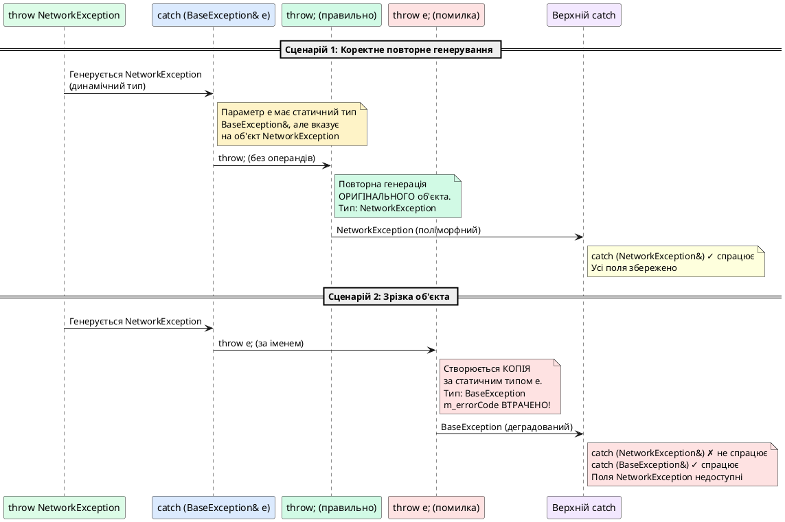

# Повторне генерування винятків та функціональний try-блок

::card-group

::card{title="🎯 Мета лекції" icon="i-lucide-target"}

- Опанувати техніку повторного генерування винятку (*rethrowing*) через оператор `throw;` без операндів.
- Зрозуміти критичну різницю між `throw;` (збереження первинного поліморфного типу) та `throw e;` (небезпечна зрізка об'єкта винятку до статичного типу обробника).
- Опанувати функціональний `try-блок` (*function-level try block*) для звичайних функцій та конструкторів.
- **Засвоїти специфіку функціонального try у конструкторах**: чому вихід з `catch`-блоку конструктора ЗАВЖДИ неявно повторно генерує виняток.
- Зрозуміти обмеження функціонального try: заборону звернення до полів об'єкта в catch-блоці конструктора.

::

::card{title="🔑 Ключові терміни" icon="i-lucide-key"}

- **Rethrowing (повторне генерування):** передача спійманого винятку далі по стеку викликів без його зміни.
- **`throw;` без операндів:** оператор повторного генерування поточного активного винятку зі збереженням його динамічного типу.
- **Object slicing при `throw e;`:** деградація похідного об'єкта винятку до базового типу при повторному генеруванні за іменем.
- **Function-level try block:** спеціальний синтаксис блоку try, що охоплює все тіло функції, включно зі списком ініціалізації конструктора.
- **Implicit rethrow:** автоматичне повторне генерування винятку при виході з catch-блоку конструктора.

::

::

---

## 1. Hook: проблема проміжної обробки винятків

У попередній лекції ми навчилися перехоплювати винятки через блоки `try`-`catch` та організовувати багаторівневу систему обробки помилок. Однак на практиці часто виникає ситуація, коли проміжний компонент системи повинен **зафіксувати факт помилки** (записати у лог, надіслати сповіщення, оновити метрики), але **не може самостійно вирішити проблему** — остаточне рішення має прийняти компонент вищого рівня.

Розглянемо типовий сценарій багаторівневої веб-архітектури:

```cpp
// Нижній рівень: Repository (доступ до бази даних)
User DatabaseRepository::findUserById(int userId) {
    try {
        return executeQuery(userId);  // SQL-запит може згенерувати виняток
    }
    catch (const DatabaseException& e) {
        // Логуємо технічну інформацію про збій БД
        logger.error("Database query failed", e.getSqlCode(), e.getQuery());
        
        // ❓ Як повідомити верхній рівень про помилку?
        // Ми не можемо просто "проковтнути" виняток — це приховає проблему
        // Ми не можемо повернути User — об'єкт не існує
    }
}

// Середній рівень: Service (бізнес-логіка)
void UserService::displayProfile(int userId) {
    try {
        User user = repository.findUserById(userId);
        console.print(user.getName());
    }
    catch (const DatabaseException& e) {
        // Тут ми хочемо відобразити користувачеві повідомлення:
        // "Сервіс тимчасово недоступний, спробуйте пізніше"
    }
}
```

**Проблема:** нижній рівень (`DatabaseRepository`) зафіксував помилку в логах, але як передати інформацію про збій на верхній рівень (`UserService`), не втрачаючи при цьому контекст оригінального винятку?

**Наївне рішення #1: генерація нового винятку**

```cpp
catch (const DatabaseException& e) {
    logger.error("Database query failed");
    throw std::runtime_error("Query failed");  // Втрачено всю діагностичну інформацію!
}
```

Цей підхід руйнує ланцюжок діагностики — верхній рівень отримує загальний виняток без SQL-коду, імені таблиці, часу збою тощо.

**Наївне рішення #2: копіювання винятку через `throw e;`**

```cpp
catch (const DatabaseException& e) {
    logger.error("Database query failed");
    throw e;  // ⚠️ НЕБЕЗПЕКА: відбудеться зрізка об'єкта!
}
```

Це здається коректним, але приховує смертельну пастку, яку ми докладно розберемо у наступному розділі.

**Професійне рішення: повторне генерування через `throw;`**

```cpp
catch (const DatabaseException& e) {
    logger.error("Database query failed", e.getSqlCode());
    throw;  // ✅ Повторна генерація ОРИГІНАЛЬНОГО винятку без змін
}
```

Оператор `throw;` **без операндів** — це спеціальна конструкція мови C++, що повторно генерує поточний активний виняток у його первинному, незміненому вигляді, зберігаючи динамічний тип об'єкта та всі його дані. Це фундаментальний механізм побудови ланцюжків обробки помилок у професійних системах.

::note
Повторне генерування працює **лише всередині блоку `catch`**. Спроба виконати `throw;` поза межами обробника винятків призведе до виклику `std::terminate` та аварійного завершення процесу.
::

---

## 2. Критична різниця: `throw;` проти `throw e;`

На перший погляд конструкції `throw;` та `throw e;` здаються еквівалентними — обидві «генерують виняток назад». Однак вони мають **фундаментально різну семантику**, і плутанина між ними є однією з найпоширеніших підступних помилок у C++.

### 2.1. Механізм повторного генерування `throw;`

Оператор `throw;` (без операндів) повторно генерує **точно той самий об'єкт винятку**, що був спійманий поточним блоком `catch`, зі збереженням:

- **Динамічного типу** — якщо згенеровано `DerivedException`, верхній рівень отримає саме `DerivedException`, навіть якщо обробник оголошений як `catch (BaseException&)`.
- **Усіх полів даних** — жодного копіювання об'єкта не відбувається, передається покажчик на оригінальний виняток.
- **Поліморфної поведінки** — віртуальні методи працюють коректно.

```cpp
class BaseException : public std::runtime_error {
public:
    explicit BaseException(const std::string& msg) 
        : std::runtime_error(msg) {}
    
    virtual std::string getCategory() const { return "Base"; }
};

class NetworkException : public BaseException {
private:
    int m_errorCode;

public:
    NetworkException(const std::string& msg, int code)
        : BaseException(msg), m_errorCode(code) {}
    
    std::string getCategory() const override { return "Network"; }
    int getErrorCode() const { return m_errorCode; }
};

void intermediateFunction() {
    try {
        throw NetworkException("Connection timeout", 504);
    }
    catch (const BaseException& e) {
        std::cerr << "[INTERMEDIATE] Категорія: " << e.getCategory() << '\n';
        throw;  // ✅ Повторна генерація ОРИГІНАЛЬНОГО NetworkException
    }
}

int main() {
    try {
        intermediateFunction();
    }
    catch (const NetworkException& e) {
        // ✅ Цей обробник СПІЙМАЄ виняток!
        std::cerr << "[MAIN] Спіймано NetworkException\n";
        std::cerr << "  Категорія: " << e.getCategory() << '\n';
        std::cerr << "  Код помилки: " << e.getErrorCode() << '\n';
    }
    catch (const BaseException& e) {
        std::cerr << "[MAIN] Спіймано BaseException\n";
    }
    
    return 0;
}
```

::terminal-preview
```
[INTERMEDIATE] Категорія: Network
[MAIN] Спіймано NetworkException
  Категорія: Network
  Код помилки: 504
```
::

Ключовий момент: проміжна функція перехопила виняток як `BaseException&`, але повторно згенерований виняток **зберіг тип `NetworkException`**, тому верхній обробник для `NetworkException` спрацював коректно.

### 2.2. Небезпека зрізки об'єкта при `throw e;`

Тепер замінимо `throw;` на `throw e;` і подивимося, що станеться:

```cpp
void intermediateFunction() {
    try {
        throw NetworkException("Connection timeout", 504);
    }
    catch (const BaseException& e) {
        std::cerr << "[INTERMEDIATE] Категорія: " << e.getCategory() << '\n';
        throw e;  // ❌ НЕБЕЗПЕКА: генерується КОПІЯ як BaseException!
    }
}

int main() {
    try {
        intermediateFunction();
    }
    catch (const NetworkException& e) {
        // ❌ Цей обробник НІКОЛИ не спрацює!
        std::cerr << "[MAIN] Спіймано NetworkException\n";
    }
    catch (const BaseException& e) {
        // ✅ Спрацює цей обробник
        std::cerr << "[MAIN] Спіймано BaseException\n";
        std::cerr << "  Категорія: " << e.getCategory() << '\n';
        
        // ❌ Не можемо викликати getErrorCode() — метод не існує в BaseException
    }
    
    return 0;
}
```

::terminal-preview
```
[INTERMEDIATE] Категорія: Network
[MAIN] Спіймано BaseException
  Категорія: Base
```
::

**Що пішло не так?**

1. **Статична типізація:** У блоці `catch (const BaseException& e)` змінна `e` має **статичний тип `BaseException&`**, хоча вказує на об'єкт `NetworkException`.

2. **Копіювання за статичним типом:** Оператор `throw e;` створює **копію об'єкта за його статичним типом** — `BaseException`, а не динамічним `NetworkException`.

3. **Зрізка об'єкта (*object slicing*):** Під час копіювання всі поля та методи, специфічні для `NetworkException` (наприклад, `m_errorCode`), **втрачаються назавжди**. Виняток деградує до базового типу.

4. **Порушення поліморфізму:** Метод `getCategory()` викликається для копії `BaseException`, тому повертає `"Base"` замість `"Network"`.

::caution{title="Зрізка винятків — критична помилка архітектури"}
Використання `throw e;` замість `throw;` є однією з найпідступніших помилок у C++, оскільки:

- Код компілюється без попереджень.
- Програма працює без аварійних збоїв.
- Помилка виявляється лише у production, коли система втрачає критичну діагностичну інформацію (наприклад, SQL-код помилки бази даних або HTTP-статус API).
- Відлагодження ускладнюється, оскільки верхні рівні обробки отримують «знеособлені» винятки без контексту.
::


### 2.3. Діаграма порівняння механізмів

Візуалізуємо фундаментальну різницю між двома підходами:

::plant-uml{alt="Порівняння throw; та throw e; при повторному генеруванні"}



::

### 2.4. Правило інженерної практики

::tip{title="Золоте правило повторного генерування"}
**При повторному генеруванні винятку ЗАВЖДИ використовуйте `throw;` без операндів.**

Виняток: якщо ви свідомо хочете **трансформувати** виняток у інший тип (наприклад, обгорнути технічну помилку БД у бізнес-виняток), тоді генеруйте новий об'єкт явно:

```cpp
catch (const DatabaseException& e) {
    logger.error("Database failure", e.getSqlCode());
    throw BusinessException("User profile unavailable", e.what());
}
```

Але якщо мета — просто «пропустити» виняток далі після логування або проміжної обробки, використовуйте виключно `throw;`.
::

---

## 3. Практичні сценарії повторного генерування

### 3.1. Логування з повторною генерацією

Найпоширеніший патерн — фіксація помилки в системі моніторингу без зупинки розкручування стеку:

```cpp
#include <iostream>
#include <stdexcept>
#include <fstream>
#include <ctime>

class ErrorLogger {
public:
    void logException(const std::exception& e) {
        std::ofstream log("errors.log", std::ios::app);
        std::time_t now = std::time(nullptr);
        log << std::ctime(&now) << "  ERROR: " << e.what() << '\n';
        log.close();
    }
};

ErrorLogger g_logger;

void riskyDatabaseOperation() {
    // Симуляція помилки БД
    throw std::runtime_error("SQL syntax error in SELECT query");
}

void dataAccessLayer() {
    try {
        riskyDatabaseOperation();
    }
    catch (const std::exception& e) {
        // Логуємо помилку для системи моніторингу
        g_logger.logException(e);
        std::cerr << "[DATA LAYER] Помилка зафіксована в логах\n";
        
        // Повторно генеруємо для обробки верхнім рівнем
        throw;
    }
}

void businessLogicLayer() {
    try {
        dataAccessLayer();
    }
    catch (const std::exception& e) {
        std::cerr << "[BUSINESS LAYER] Обробка помилки: " << e.what() << '\n';
        std::cerr << "  → Повернення користувачеві повідомлення про тимчасову недоступність\n";
    }
}

int main() {
    businessLogicLayer();
    return 0;
}
```

::terminal-preview
```
[DATA LAYER] Помилка зафіксована в логах
[BUSINESS LAYER] Обробка помилки: SQL syntax error in SELECT query
  → Повернення користувачеві повідомлення про тимчасову недоступність
```
::

Файл `errors.log`:
```
Fri Oct  9 14:23:11 2026
  ERROR: SQL syntax error in SELECT query
```

### 3.2. Умовне повторне генерування

Іноді проміжний рівень може вирішити, чи обробляти помилку локально, чи передавати далі:

```cpp
void smartMiddleware(bool canRecover) {
    try {
        riskyOperation();
    }
    catch (const RecoverableException& e) {
        if (canRecover) {
            std::cerr << "Спроба автоматичного відновлення...\n";
            attemptRecovery();
            // Виняток оброблено, не генеруємо далі
        } else {
            std::cerr << "Автоматичне відновлення неможливе\n";
            throw;  // Передаємо на верхній рівень
        }
    }
    catch (const CriticalException& e) {
        // Критичні помилки завжди передаємо вище
        std::cerr << "Критична помилка: " << e.what() << '\n';
        throw;
    }
}
```

### 3.3. Обгортання винятків з додаванням контексту

У складних системах корисно «обгортати» винятки нижнього рівня в винятки вищого рівня, зберігаючи при цьому оригінальну інформацію:

```cpp
class ContextualException : public std::runtime_error {
private:
    std::string m_operationName;
    std::string m_originalError;

public:
    ContextualException(const std::string& operation, 
                         const std::exception& original)
        : std::runtime_error(buildMessage(operation, original)),
          m_operationName(operation),
          m_originalError(original.what())
    {
    }

    std::string getOperation() const { return m_operationName; }
    std::string getOriginalError() const { return m_originalError; }

private:
    static std::string buildMessage(const std::string& op, 
                                      const std::exception& orig) {
        return "Операція '" + op + "' зазнала невдачі: " + orig.what();
    }
};

void processUserData(int userId) {
    try {
        fetchDataFromDatabase(userId);
    }
    catch (const DatabaseException& e) {
        // Обгортаємо технічний виняток у бізнес-контекст
        throw ContextualException("ProcessUserData", e);
    }
}

int main() {
    try {
        processUserData(12345);
    }
    catch (const ContextualException& e) {
        std::cerr << "Контекстна помилка:\n";
        std::cerr << "  Операція: " << e.getOperation() << '\n';
        std::cerr << "  Оригінальна помилка: " << e.getOriginalError() << '\n';
    }
    
    return 0;
}
```

::note
У C++11 та новіших версіях існує стандартний механізм вкладених винятків (*nested exceptions*) через `std::throw_with_nested` та `std::rethrow_if_nested`, що дозволяє зберігати ланцюжок винятків без ручного обгортання. Однак базове повторне генерування через `throw;` залишається фундаментальним інструментом, що використовується у 90% випадків.
::

---

## 4. Функціональний try-блок: синтаксис та призначення

Стандартні блоки `try`-`catch` охоплюють блок коду всередині тіла функції. Однак існує особливий сценарій, де їх можливостей недостатньо: **перехоплення винятків, згенерованих у списку ініціалізації членів (*Member Initializer List*) конструктора класу**.

### 4.1. Проблема: недосяжність MIL для стандартного try

Розглянемо класичну ситуацію з ієрархією наслідування:

```cpp
class DatabaseConnection {
public:
    explicit DatabaseConnection(const std::string& connectionString) {
        if (connectionString.empty()) {
            throw std::invalid_argument("Connection string cannot be empty");
        }
        // Підключення до БД...
    }
};

class UserRepository {
private:
    DatabaseConnection m_connection;

public:
    UserRepository(const std::string& connStr)
        : m_connection(connStr)  // ❓ Що, якщо тут згенерується виняток?
    {
        // Тіло конструктора виконується ПІСЛЯ ініціалізації m_connection
        // Стандартний try тут не допоможе!
    }
};
```

**Проблема:** Якщо конструктор `DatabaseConnection` згенерує виняток під час виконання списку ініціалізації (`m_connection(connStr)`), цей виняток виникає **до початку виконання тіла конструктора** `UserRepository`. Стандартний блок `try` всередині тіла конструктора не може перехопити цей виняток.

::warning
Винятки зі списку ініціалізації членів класу розкручують стек без можливості локальної обробки через звичайні `try`-`catch` блоки всередині тіла конструктора.
::

### 4.2. Рішення: функціональний try-блок

**Функціональний try-блок** (*function-level try block* або *function try block*) — це спеціальний синтаксис, що дозволяє охопити обробником винятків **всю функцію цілком**, включно зі списком ініціалізації членів.

Синтаксис для конструкторів:

```cpp
ClassName::ClassName(параметри)
try
    : memberInitializerList
{
    // Тіло конструктора
}
catch (ExceptionType& e) {
    // Обробка винятків зі списку ініціалізації та тіла конструктора
}
```

Ключові елементи:

1. Ключове слово **`try`** розміщується **після сигнатури конструктора**, але **перед двокрапкою** списку ініціалізації.
2. Блок `catch` знаходиться на **тому самому рівні відступу**, що й увесь конструктор (не всередині фігурних дужок).
3. Блок `catch` обробляє винятки з **усього конструктора**: і зі списку ініціалізації, і з тіла.


### 4.3. Практичний приклад: обробка помилок ініціалізації

```cpp
#include <iostream>
#include <stdexcept>
#include <string>

class DatabaseConnection {
public:
    explicit DatabaseConnection(const std::string& connectionString) {
        if (connectionString.empty()) {
            throw std::invalid_argument("Connection string cannot be empty");
        }
        std::cout << "✓ DatabaseConnection успішно створено\n";
    }
};

class UserRepository {
private:
    DatabaseConnection m_connection;
    int m_cacheSize;

public:
    UserRepository(const std::string& connStr, int cacheSize)
    try
        : m_connection(connStr),  // Може згенерувати std::invalid_argument
          m_cacheSize(cacheSize)
    {
        std::cout << "✓ UserRepository тіло конструктора виконано\n";
        
        if (cacheSize <= 0) {
            throw std::logic_error("Cache size must be positive");
        }
    }
    catch (const std::invalid_argument& e) {
        std::cerr << "[UserRepository CONSTRUCTOR] Помилка ініціалізації:\n";
        std::cerr << "  " << e.what() << '\n';
        std::cerr << "  → Неможливо створити репозиторій без підключення до БД\n";
        
        // Явно не генеруємо виняток, тому відбудеться неявна повторна генерація
    }
    catch (const std::logic_error& e) {
        std::cerr << "[UserRepository CONSTRUCTOR] Логічна помилка:\n";
        std::cerr << "  " << e.what() << '\n';
        
        // Явно не генеруємо виняток, тому відбудеться неявна повторна генерація
    }
    catch (...) {
        std::cerr << "[UserRepository CONSTRUCTOR] Непередбачена помилка!\n";
        throw;  // Явне повторне генерування (еквівалентно неявному)
    }
};

int main() {
    std::cout << "=== Тест 1: Порожній рядок підключення ===\n";
    try {
        UserRepository repo1("", 100);
    }
    catch (const std::exception& e) {
        std::cerr << "[MAIN] Спійманий виняток: " << e.what() << "\n\n";
    }

    std::cout << "=== Тест 2: Некоректний розмір кешу ===\n";
    try {
        UserRepository repo2("Server=localhost;", -5);
    }
    catch (const std::exception& e) {
        std::cerr << "[MAIN] Спійманий виняток: " << e.what() << "\n\n";
    }

    std::cout << "=== Тест 3: Коректні параметри ===\n";
    try {
        UserRepository repo3("Server=localhost;", 100);
        std::cout << "✓ UserRepository успішно створено\n";
    }
    catch (const std::exception& e) {
        std::cerr << "[MAIN] Спійманий виняток: " << e.what() << '\n';
    }

    return 0;
}
```

::terminal-preview
```
=== Тест 1: Порожній рядок підключення ===
[UserRepository CONSTRUCTOR] Помилка ініціалізації:
  Connection string cannot be empty
  → Неможливо створити репозиторій без підключення до БД
[MAIN] Спійманий виняток: Connection string cannot be empty

=== Тест 2: Некоректний розмір кешу ===
✓ DatabaseConnection успішно створено
✓ UserRepository тіло конструктора виконано
[UserRepository CONSTRUCTOR] Логічна помилка:
  Cache size must be positive
[MAIN] Спійманий виняток: Cache size must be positive

=== Тест 3: Коректні параметри ===
✓ DatabaseConnection успішно створено
✓ UserRepository тіло конструктора виконано
✓ UserRepository успішно створено
```
::

**Ключові спостереження:**

1. У **Тесті 1** виняток згенеровано під час ініціалізації `m_connection` — ще до початку виконання тіла конструктора. Функціональний try-блок успішно перехопив його.

2. У **Тесті 2** виняток згенеровано всередині тіла конструктора. Функціональний try-блок також перехопив його.

3. У **Тесті 3** жодних винятків не виникло, конструктор виконався успішно.

---

## 5. Критична особливість: неявне повторне генерування у конструкторах

Функціональний try-блок у конструкторах має **фундаментальну семантичну особливість**, що відрізняє його від звичайних блоків `catch`:

::caution{title="Залізне правило конструкторів"}
**Якщо catch-блок функціонального try у конструкторі не генерує явно новий виняток через `throw <expression>;`, поточний спійманий виняток АВТОМАТИЧНО повторно генерується після виходу з блоку `catch`.**

Іншими словами, вихід із catch-блоку конструктора **завжди** означає повторне генерування — або явне (через `throw;` чи `throw newException;`), або неявне (якщо ви нічого не написали).
::

### 5.1. Чому це так? Фундаментальна логіка C++

Коли конструктор генерує виняток (або пропускає його далі), це сигналізує системі: **«Об'єкт не було створено успішно, він неіснуючий»**. Стандарт C++ визначає, що для об'єкта у такому стані:

1. **Деструктор не викликається** — об'єкт ніколи не існував повністю, тому немає чого руйнувати.
2. **Пам'ять, виділена під об'єкт, звільняється**, але **поля об'єкта недоступні**.
3. **Виняток ОБОВ'ЯЗКОВО має продовжити розкручування стеку** — інакше caller отримає покажчик на неіснуючий об'єкт, що призведе до Undefined Behavior.

Саме тому компілятор примусово вставляє неявний `throw;` наприкінці кожного catch-блоку функціонального try у конструкторі — щоб гарантувати, що caller **ніколи** не зможе отримати доступ до напівініціалізованого об'єкта.

### 5.2. Демонстрація неявного повторного генерування

```cpp
#include <iostream>
#include <stdexcept>

class Component {
public:
    Component() {
        throw std::runtime_error("Component initialization failed");
    }
};

class System {
private:
    Component m_component;

public:
    System()
    try
        : m_component()  // Тут згенерується виняток
    {
        std::cout << "Це повідомлення ніколи не з'явиться\n";
    }
    catch (const std::exception& e) {
        std::cerr << "[System CATCH] Перехоплено: " << e.what() << '\n';
        std::cerr << "[System CATCH] Логуємо помилку...\n";
        
        // НЕ пишемо тут throw; — але виняток все одно повторно згенерується!
    }
    // Неявний throw; додається компілятором тут
};

int main() {
    try {
        System sys;
        std::cout << "System створено — це повідомлення не з'явиться\n";
    }
    catch (const std::exception& e) {
        std::cerr << "[MAIN] Спійманий виняток: " << e.what() << '\n';
    }
    
    return 0;
}
```

::terminal-preview
```
[System CATCH] Перехоплено: Component initialization failed
[System CATCH] Логуємо помилку...
[MAIN] Спійманий виняток: Component initialization failed
```
::

Бачимо, що навіть без явного `throw;` у catch-блоці конструктора `System`, виняток потрапив у `main()`. Це доводить неявне повторне генерування.

### 5.3. Заміна винятку на інший тип

Єдиний спосіб запобігти повторній генерації оригінального винятку — це **явно згенерувати інший виняток**:

```cpp
System()
try
    : m_component()
{
}
catch (const std::exception& e) {
    std::cerr << "[System] Оригінальна помилка: " << e.what() << '\n';
    
    // Генеруємо НОВИЙ виняток замість оригінального
    throw std::runtime_error("System initialization failed due to Component error");
}
// Компілятор НЕ додає throw; тут, оскільки ми вже явно згенерували виняток
```

Тепер caller отримає виняток `std::runtime_error` з новим повідомленням, а оригінальний виняток `Component` буде втрачено.

::tip
Якщо ви хочете **трансформувати** виняток (наприклад, обгорнути технічну помилку в бізнес-виняток), генеруйте новий об'єкт явно. Якщо ж мета — просто **зафіксувати факт помилки** (логування, метрики), не генеруйте нічого — неявне повторне генерування зробить свою справу.
::

---

## 6. Обмеження функціонального try: заборона доступу до полів об'єкта

Фундаментальне правило C++: якщо конструктор згенерував виняток, об'єкт вважається **неіснуючим**. Це накладає критичне обмеження на catch-блоки функціонального try у конструкторах:

::caution{title="Заборона звернення до членів класу"}
**У catch-блоці функціонального try конструктора категорично ЗАБОРОНЕНО звертатися до полів об'єкта (`m_member`) або викликати методи класу.**

Навіть якщо синтаксично це дозволено (код компілюється), така дія призводить до **Undefined Behavior** — об'єкт вже «мертвий», його поля знищені або знаходяться у невизначеному стані.
::

### 6.1. Приклад небезпечного коду (Undefined Behavior)

```cpp
class DangerousClass {
private:
    int* m_data;
    std::string m_name;

public:
    DangerousClass(int size)
    try
        : m_data(new int[size]),
          m_name("DangerousObject")
    {
        if (size <= 0) {
            throw std::invalid_argument("Size must be positive");
        }
    }
    catch (const std::exception& e) {
        std::cerr << "Помилка: " << e.what() << '\n';
        
        // ❌ НЕБЕЗПЕЧНО: Спроба звернутися до m_data
        // delete[] m_data;  // UB! Об'єкт не існує, m_data у невизначеному стані
        
        // ❌ НЕБЕЗПЕЧНО: Спроба прочитати m_name
        // std::cerr << "Ім'я: " << m_name << '\n';  // UB!
        
        throw;
    }
};
```

**Чому це небезпечно?**

1. Коли виняток згенеровано під час ініціалізації, **не всі поля могли бути ініціалізовані**.
2. Компілятор може **вже почати знищення частково створених полів** до входу в catch-блок.
3. Стандарт C++ явно визначає, що звернення до полів напівініціалізованого об'єкта — це Undefined Behavior.

### 6.2. Правильний підхід: RAII для автоматичного очищення

Замість спроби ручного очищення у catch-блоці, використовуйте ідіому **RAII** (*Resource Acquisition Is Initialization*) — обгорніть ресурси у класи з автоматичним керуванням:

```cpp
#include <memory>
#include <vector>
#include <string>

class SafeClass {
private:
    std::unique_ptr<int[]> m_data;  // ✅ Автоматичне звільнення через RAII
    std::string m_name;              // ✅ std::string сам керує пам'яттю

public:
    SafeClass(int size)
    try
        : m_data(std::make_unique<int[]>(size)),
          m_name("SafeObject")
    {
        if (size <= 0) {
            throw std::invalid_argument("Size must be positive");
        }
    }
    catch (const std::exception& e) {
        std::cerr << "Помилка ініціалізації: " << e.what() << '\n';
        
        // ✅ БЕЗПЕЧНО: Нічого не робимо — деструктори полів викличуться автоматично
        // m_data автоматично звільнить пам'ять через ~unique_ptr
        // m_name автоматично звільнить рядок через ~string
        
        throw;  // Повторно генеруємо виняток
    }
};
```

::note
Коли конструктор генерує виняток, C++ гарантує виклик деструкторів для **вже повністю ініціалізованих** полів-об'єктів у зворотному порядку їх створення. Саме тому RAII-обгортки (`std::unique_ptr`, `std::string`, `std::vector`) забезпечують автоматичне безпечне очищення без необхідності ручного втручання у catch-блоці.
::


---

## 7. Функціональний try для звичайних функцій (рідкісний випадок)

Хоча функціональний try найчастіше використовується з конструкторами, синтаксично він також допустимий для звичайних функцій:

```cpp
void regularFunction()
try {
    // Тіло функції
    riskyOperation();
}
catch (const std::exception& e) {
    std::cerr << "Помилка: " << e.what() << '\n';
    // Тут повторне генерування НЕ є обов'язковим (на відміну від конструкторів)
}
```

Однак це **надзвичайно рідкісна практика**, оскільки еквівалентний звичайний `try`-`catch` всередині тіла функції є семантично ідентичним, більш читабельним та зрозумілим:

```cpp
void regularFunction() {
    try {
        riskyOperation();
    }
    catch (const std::exception& e) {
        std::cerr << "Помилка: " << e.what() << '\n';
    }
}
```

::tip{title="Коли використовувати функціональний try"}
**Практично завжди — лише для конструкторів**, коли потрібно обробити винятки зі списку ініціалізації членів класу.

Для звичайних функцій надавайте перевагу стандартним блокам `try`-`catch` всередині тіла — це покращує читабельність коду та уникає плутанини з незвичним синтаксисом.
::

---

## 8. Практичне завдання: система логування з повторною генерацією

::::accordion

:::accordion-item{title="Завдання: Реалізація багаторівневої системи з логуванням винятків"}

Спроєктуйте систему обробки замовлень в інтернет-магазині з трьома архітектурними рівнями:

1. **Repository Layer** — доступ до бази даних (може генерувати `DatabaseException`).
2. **Service Layer** — бізнес-логіка (обробляє виняток Repository, логує його, повторно генерує).
3. **Controller Layer** — взаємодія з користувачем (остаточна обробка та відображення повідомлень).

**Вимоги:**

1. Створіть клас `OrderRepository` з методом `Order getOrderById(int orderId)`.
   - Метод генерує `DatabaseException`, якщо `orderId <= 0`.
   - Використовуйте функціональний try-блок у конструкторі `OrderRepository` для ініціалізації підключення до БД.

2. Створіть клас `OrderService` з методом `void processOrder(int orderId)`.
   - Викликає `repository.getOrderById(orderId)`.
   - Перехоплює `DatabaseException`, логує помилку у файл `service.log`.
   - Повторно генерує виняток через `throw;`.

3. Створіть функцію `main()`, що симулює Controller Layer.
   - Викликає `orderService.processOrder(orderId)`.
   - Обробляє виняток і виводить користувачеві зрозуміле повідомлення.

4. Продемонструйте:
   - Коректну роботу з валідним `orderId`.
   - Обробку помилки при `orderId = -1`.
   - Логування проміжних винятків у `service.log`.

:::

:::accordion-item{title="Зразок рішення"}

```cpp
#include <iostream>
#include <fstream>
#include <stdexcept>
#include <string>
#include <ctime>

// ============== Винятки ==============

class DatabaseException : public std::runtime_error {
private:
    int m_errorCode;

public:
    DatabaseException(const std::string& message, int code)
        : std::runtime_error(message), m_errorCode(code) {}

    int getErrorCode() const { return m_errorCode; }
};

// ============== Модель даних ==============

struct Order {
    int id;
    std::string customerName;
    double totalAmount;
};

// ============== Repository Layer ==============

class DatabaseConnection {
public:
    explicit DatabaseConnection(const std::string& connStr) {
        if (connStr.empty()) {
            throw std::invalid_argument("Connection string is empty");
        }
        std::cout << "[DB] З'єднання встановлено: " << connStr << '\n';
    }
};

class OrderRepository {
private:
    DatabaseConnection m_connection;

public:
    explicit OrderRepository(const std::string& connStr)
    try
        : m_connection(connStr)
    {
        std::cout << "[REPOSITORY] OrderRepository ініціалізовано\n";
    }
    catch (const std::invalid_argument& e) {
        std::cerr << "[REPOSITORY INIT ERROR] " << e.what() << '\n';
        throw;  // Повторно генеруємо
    }

    Order getOrderById(int orderId) {
        if (orderId <= 0) {
            throw DatabaseException("Invalid order ID: " + std::to_string(orderId), 1001);
        }

        // Симуляція успішного запиту
        return Order{orderId, "John Doe", 299.99};
    }
};

// ============== Service Layer з логуванням ==============

class Logger {
public:
    void logError(const std::string& layer, const std::string& message) {
        std::ofstream log("service.log", std::ios::app);
        std::time_t now = std::time(nullptr);
        log << "[" << layer << "] " << std::ctime(&now);
        log << "  ERROR: " << message << "\n\n";
        log.close();
    }
};

class OrderService {
private:
    OrderRepository m_repository;
    Logger m_logger;

public:
    explicit OrderService(const std::string& connStr)
        : m_repository(connStr) {}

    void processOrder(int orderId) {
        try {
            Order order = m_repository.getOrderById(orderId);
            std::cout << "[SERVICE] Замовлення #" << order.id 
                      << " успішно оброблено\n";
            std::cout << "  Клієнт: " << order.customerName << '\n';
            std::cout << "  Сума: $" << order.totalAmount << '\n';
        }
        catch (const DatabaseException& e) {
            // Логуємо помилку
            std::cerr << "[SERVICE] Перехоплено DatabaseException: " 
                      << e.what() << '\n';
            std::cerr << "  Код помилки: " << e.getErrorCode() << '\n';
            
            m_logger.logError("OrderService::processOrder", 
                              std::string(e.what()) + " (code: " + 
                              std::to_string(e.getErrorCode()) + ")");
            
            // Повторно генеруємо для верхнього рівня
            throw;
        }
    }
};

// ============== Controller Layer (main) ==============

int main() {
    try {
        OrderService orderService("Server=localhost;Database=shop;");
        
        std::cout << "\n=== Тест 1: Валідне замовлення ===\n";
        orderService.processOrder(12345);
        
        std::cout << "\n=== Тест 2: Неіснуюче замовлення ===\n";
        orderService.processOrder(-1);
    }
    catch (const DatabaseException& e) {
        std::cerr << "\n[CONTROLLER] Системна помилка:\n";
        std::cerr << "  " << e.what() << '\n';
        std::cerr << "  → Повідомлення користувачеві: "
                  << "Не вдалося завантажити дані замовлення. "
                  << "Спробуйте пізніше.\n";
        return 1;
    }
    catch (const std::exception& e) {
        std::cerr << "\n[CONTROLLER] Непередбачена помилка: " 
                  << e.what() << '\n';
        return 2;
    }
    
    std::cout << "\n[CONTROLLER] Програму завершено успішно\n";
    return 0;
}
```

::terminal-preview
```
[DB] З'єднання встановлено: Server=localhost;Database=shop;
[REPOSITORY] OrderRepository ініціалізовано

=== Тест 1: Валідне замовлення ===
[SERVICE] Замовлення #12345 успішно оброблено
  Клієнт: John Doe
  Сума: $299.99

=== Тест 2: Неіснуюче замовлення ===
[SERVICE] Перехоплено DatabaseException: Invalid order ID: -1
  Код помилки: 1001

[CONTROLLER] Системна помилка:
  Invalid order ID: -1
  → Повідомлення користувачеві: Не вдалося завантажити дані замовлення. Спробуйте пізніше.
```
::

Файл `service.log`:
```
[OrderService::processOrder] Fri Oct  9 15:42:33 2026
  ERROR: Invalid order ID: -1 (code: 1001)

```

**Архітектурні переваги рішення:**

1. **Розділення відповідальності** — Repository генерує технічний виняток, Service логує, Controller відображає користувачеві.

2. **Збереження контексту** — завдяки `throw;` верхній рівень отримує оригінальний `DatabaseException` з усіма полями (`m_errorCode`).

3. **RAII-безпека** — використання функціонального try у конструкторі `OrderRepository` для безпечної ініціалізації `DatabaseConnection`.

4. **Ланцюжок аудиту** — кожен рівень залишає слід у логах, що спрощує відлагодження.

:::

::::

---

## 9. Резюме та ключові висновки

::card-group

::card{title="📚 Що ми опанували" icon="i-lucide-book-open"}

1. **Повторне генерування через `throw;`** — передача спійманого винятку далі зі збереженням динамічного типу та всіх полів.

2. **Критичну різницю `throw;` vs `throw e;`** — оператор `throw e;` створює копію винятку за статичним типом, що призводить до зрізки об'єкта (*object slicing*) та втрати специфічних полів похідних класів.

3. **Функціональний try-блок** — спеціальний синтаксис для перехоплення винятків зі списку ініціалізації членів класу в конструкторах.

4. **Неявне повторне генерування** — у catch-блоках конструкторів виняток автоматично повторно генерується після виходу, якщо не було явної генерації нового винятку.

5. **Заборону доступу до полів** — у catch-блоці функціонального try конструктора звернення до `m_member` призводить до Undefined Behavior.

::

::card{title="⚠️ Критичні правила безпеки" icon="i-lucide-alert-triangle"}

- **Завжди використовуйте `throw;` для повторного генерування** — ніколи `throw e;`, якщо не хочете свідомої трансформації типу винятку.

- **Функціональний try — ТІЛЬКИ для конструкторів** — для звичайних функцій це антипатерн, використовуйте стандартні `try`-`catch` всередині тіла.

- **Ніколи не звертайтеся до полів класу у catch-блоці конструктора** — об'єкт не існує, це Undefined Behavior.

- **Використовуйте RAII для очищення ресурсів** — не покладайтеся на ручне очищення у catch-блоках, дозвольте деструкторам зробити свою роботу.

- **Логування не замінює обробку** — повторне генерування після логування дозволяє верхнім рівням прийняти остаточне рішення.

::

::card{title="🚀 Наступний крок" icon="i-lucide-rocket"}

У наступній статті **«Стаття 88 — Безпека винятків, `noexcept` та деструктори»** ми дослідимо:

- Чотири рівні гарантій безпеки винятків (No guarantee, Basic, Strong, No-throw).
- Ідіому Copy-and-Swap для забезпечення сильної гарантії.
- Смертельну небезпеку генерації винятків із деструкторів.
- Специфікатор та оператор `noexcept` (C++11).
- Вплив `noexcept` на move-операції у стандартних контейнерах.

::

::

---

**Додаткові матеріали для самостійного вивчення:**

- [cppreference: Throw expression](https://en.cppreference.com/w/cpp/language/throw)
- [cppreference: Function-try-block](https://en.cppreference.com/w/cpp/language/function-try-block)
- ISO C++ Core Guidelines: [E.16: Destructors, deallocation, and swap must never fail](https://isocpp.github.io/CppCoreGuidelines/CppCoreGuidelines#e16-destructors-deallocation-and-swap-must-never-fail)
- [Stack Overflow: Difference between "throw" and "throw ex" in C++](https://stackoverflow.com/questions/2909106/rethrow-exception-in-c)
