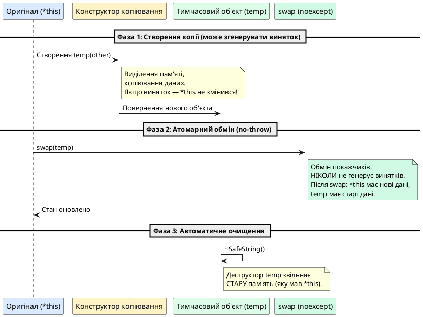

# Безпека винятків, `noexcept` та деструктори

::card-group

::card{title="🎯 Мета лекції" icon="i-lucide-target"}

- Опанувати чотири класичні рівні гарантій безпеки винятків (Exception Safety Guarantees): No guarantee, Basic, Strong (транзакційна), No-throw.
- Засвоїти ідіому Copy-and-Swap як інструмент забезпечення сильної гарантії в операторах присвоювання.
- **Усвідомити категоричну заборону генерації винятків із деструкторів** — два активних винятки гарантують негайний виклик `std::terminate`.
- Опанувати специфікатор та оператор `noexcept` (C++11): семантику, оптимізацію генерації коду, умовний `noexcept(noexcept(...))`.
- Дослідити вплив `noexcept` на move-операції в стандартних контейнерах (`std::vector` реаллокація).

::

::card{title="🔑 Ключові терміни" icon="i-lucide-key"}

- **Exception Safety Guarantees:** рівні гарантій коректності об'єктів після генерації винятку.
- **Strong Exception Guarantee:** транзакційна семантика — або операція завершується успішно, або стан не змінюється.
- **Copy-and-Swap:** ідіома реалізації оператора присвоювання через тимчасову копію та swap.
- **noexcept:** специфікатор (C++11), що гарантує відсутність генерації винятків із функції.
- **std::terminate:** аварійне завершення процесу при двох активних винятках одночасно.

::

::

---

## 1. Hook: коли система втрачає цілісність — мовчазна катастрофа

Уявіть банківську систему, де функція переказу коштів переводить гроші з одного рахунку на інший:

```cpp
void transferMoney(Account& from, Account& to, double amount) {
    from.withdraw(amount);  // Списуємо з рахунку from
    to.deposit(amount);     // ❌ ЩО, ЯКЩО ТУТ ЗГЕНЕРУЄТЬСЯ ВИНЯТОК?
}
```

Якщо метод `to.deposit(amount)` згенерує виняток (наприклад, через помилку запису в базу даних), гроші **зникнуть назавжди** — вони вже списані з рахунку `from`, але не зараховані на рахунок `to`. Система опинилася у **неконсистентному стані** (*inconsistent state*), порушено фундаментальний інваріант: загальна сума грошей у системі має бути постійною.

Це не баг окремої функції — це **архітектурна катастрофа**. У системі відсутня гарантія **безпеки винятків** (*exception safety*) — властивості коду зберігати коректність стану об'єктів навіть при виникненні помилок під час виконання операцій.

::caution{title="Реальні наслідки відсутності безпеки винятків"}
У промислових системах втрата безпеки винятків призводить до:

- **Витоків пам'яті** — ресурси виділені, але покажчик на них втрачено через виняток.
- **Дедлоків (Deadlock)** — м'ютекс захоплено, але не звільнено через виняток у критичній секції.
- **Пошкодження структур даних** — об'єкт залишився у напівмодифікованому стані (частина полів оновлена, частина — ні).
- **Невідповідності бізнес-логіки реальності** — база даних містить неузгоджені дані (замовлення створено, але оплата не зарахована).

У 2012 році NYSE (Нью-Йоркська фондова біржа) зупиняла торги на 90 хвилин через баг, пов'язаний з некоректною обробкою винятків, що призвело до втрати $440 мільйонів.
::

У цій лекції ми опануємо фундаментальну інженерну дисципліну проєктування коду, що залишається коректним навіть у присутності винятків — систему **гарантій безпеки винятків** (*Exception Safety Guarantees*), формалізовану Девідом Абрагамсом (David Abrahams) у 1990-х роках для C++ STL.

---

## 2. Чотири рівні гарантій безпеки винятків

Індустрія C++ класифікує функції та методи за чотирма рівнями гарантій безпеки винятків, від найслабшого до найсильнішого:

### 2.1. Рівень 0: Відсутність гарантій (*No Exception Safety Guarantee*)

**Визначення:** Якщо під час виконання функції згенерується виняток, стан об'єктів та ресурсів системи стає **непередбачуваним** (*undefined state*). Можливі витоки пам'яті, зависання блокувань, пошкодження інваріантів класів.

**Характеристика:** Функція **не дає жодних обіцянок** щодо коректності стану після винятку. Це найгірший рівень безпеки — фактично, його відсутність.

**Приклад небезпечного коду:**

```cpp
class UnsafeArray {
private:
    int* m_data;
    int m_size;

public:
    void resize(int newSize) {
        // ❌ НЕБЕЗПЕЧНО: якщо new викине std::bad_alloc, 
        // старі дані вже знищені, але нові не виділені
        delete[] m_data;
        m_data = new int[newSize];  // Може згенерувати виняток!
        m_size = newSize;
    }
};
```

Якщо `new int[newSize]` згенерує виняток `std::bad_alloc`, об'єкт `UnsafeArray` залишиться з висячим покажчиком `m_data` (вказує на звільнену пам'ять) та некоректним `m_size`. Будь-яка спроба використання цього об'єкта призведе до Undefined Behavior.

::warning
Код з рівнем "No guarantee" **категорично неприпустимий** у промисловому C++. Навіть якщо виняток виникає рідко, одноразова поява проблеми може зруйнувати всю систему.
::

### 2.2. Рівень 1: Базова гарантія (*Basic Exception Safety Guarantee*)

**Визначення:** Якщо під час виконання функції згенерується виняток, жодних витоків ресурсів не відбудеться, і всі об'єкти залишаться у **валідному, але непередбачуваному** стані (*valid but unspecified state*).

**Характеристика:**

- **Гарантується:** Ресурси коректно звільнені (RAII спрацював), інваріанти класів збережені (об'єкт можна безпечно знищити або присвоїти нове значення).
- **НЕ гарантується:** Конкретний стан об'єкта після винятку. Наприклад, контейнер може залишитися порожнім, або містити довільну кількість елементів.

**Приклад коду з базовою гарантією:**

```cpp
class BasicSafeArray {
private:
    int* m_data;
    int m_size;

public:
    void resize(int newSize) {
        int* newData = new int[newSize];  // Виділяємо НОВУ пам'ять спочатку
        
        // Копіюємо стару пам'ять у нову (може згенерувати виняток, якщо int має нетривіальний конструктор)
        int copySize = (newSize < m_size) ? newSize : m_size;
        for (int i = 0; i < copySize; ++i) {
            newData[i] = m_data[i];
        }
        
        // Тільки ПІСЛЯ успішного виділення та копіювання звільняємо стару пам'ять
        delete[] m_data;
        m_data = newData;
        m_size = newSize;
    }
};
```

Якщо `new int[newSize]` згенерує виняток, старі дані `m_data` залишаться недоторканими. Якщо виняток виникне під час копіювання, нова пам'ять `newData` автоматично звільниться при розкручуванні стеку (локальна змінна). Об'єкт залишається у коректному стані (старий розмір та дані).

**Обмеження:** Після винятку ми не знаємо, скільки елементів було скопійовано — контейнер може містити довільну суміш старих та нових даних. Для багатьох алгоритмів цього недостатньо.

### 2.3. Рівень 2: Сильна гарантія (*Strong Exception Safety Guarantee / Commit-or-Rollback*)

**Визначення:** Якщо під час виконання функції згенерується виняток, стан усіх об'єктів залишається **точно таким, яким він був до виклику функції** (*commit-or-rollback semantics*). Операція або виконується повністю, або не має жодного побічного ефекту.

**Характеристика:**

- **Гарантується:** Транзакційна семантика — атомарність на рівні операції.
- **Перевага:** Після винятку можна продовжити роботу з об'єктом у його попередньому стані без необхідності відновлення.

**Приклад коду із сильною гарантією:**

```cpp
class StrongSafeArray {
private:
    int* m_data;
    int m_size;

public:
    void resize(int newSize) {
        // Створюємо ТИМЧАСОВИЙ об'єкт з новим розміром
        StrongSafeArray temp(newSize);
        
        // Копіюємо дані у тимчасовий об'єкт
        int copySize = (newSize < m_size) ? newSize : m_size;
        for (int i = 0; i < copySize; ++i) {
            temp.m_data[i] = m_data[i];  // Якщо тут виняток — наш об'єкт не змінився!
        }
        
        // ТІЛЬКИ якщо ВСЕ успішно — обмінюємо стани через swap (no-throw)
        swap(temp);  // Не генерує винятків
        
        // temp знищується, звільняючи СТАРУ пам'ять через деструктор
    }
    
private:
    void swap(StrongSafeArray& other) noexcept {
        std::swap(m_data, other.m_data);
        std::swap(m_size, other.m_size);
    }
};
```

Ключова ідея: всі небезпечні операції (виділення пам'яті, копіювання) виконуються на **тимчасовому об'єкті**. Якщо виникне виняток, тимчасовий об'єкт знищується, а оригінальний об'єкт залишається недоторканим. Фінальна операція `swap` — це проста обміна покажчиків, що **ніколи не генерує винятків**.

::tip{title="Ідіома Copy-and-Swap"}
Патерн "створення копії → модифікація копії → обмін станів" називається **ідіомою Copy-and-Swap** і є стандартним способом реалізації сильної гарантії у C++. Ми детально розберемо його у розділі 3.
::

### 2.4. Рівень 3: Гарантія відсутності винятків (*No-throw Guarantee / Never-fail*)

**Визначення:** Функція **ніколи не генерує винятків** і завжди виконується успішно. Це найсильніша гарантія.

**Характеристика:**

- **Гарантується:** Операція завжди коректно завершується без можливості збою.
- **Застосування:** Деструктори, операції `swap`, move-конструктори, move-оператори присвоювання, функції низького рівня (обмін двох цілих чисел).

**Приклад коду з гарантією no-throw:**

```cpp
class NoThrowSwappable {
private:
    int* m_data;
    int m_size;

public:
    // Обмін станів НІКОЛИ не генерує винятків
    void swap(NoThrowSwappable& other) noexcept {
        std::swap(m_data, other.m_data);  // Обмін покажчиків — тривіальна операція
        std::swap(m_size, other.m_size);  // Обмін int — тривіальна операція
    }
    
    // Move-конструктор не генерує винятків
    NoThrowSwappable(NoThrowSwappable&& other) noexcept
        : m_data(other.m_data), m_size(other.m_size)
    {
        other.m_data = nullptr;
        other.m_size = 0;
    }
};
```

Ключовий специфікатор `noexcept` (C++11) явно повідомляє компілятору та користувачам коду: «Ця функція гарантовано не згенерує винятків». Якщо виняток все ж виникне всередині функції, позначеної `noexcept`, програма негайно завершиться через `std::terminate`.

::note
Рівень no-throw **не означає, що функція не може викликати код, що генерує винятки**. Це означає, що всі винятки **обробляються всередині функції** і не виходять назовні. Наприклад, можна перехопити всі винятки через `catch (...)` та записати у лог замість повторного генерування.
::


### 2.5. Порівняльна таблиця рівнів гарантій

::card-group

::card{title="❌ No Guarantee" icon="i-lucide-x-circle"}

**Гарантії:** Жодних

**Стан після винятку:** Непередбачуваний (UB можливий)

**Застосування:** Неприпустимо у production

**Приклад:** Видалення ресурсів до виділення нових

::

::card{title="🟡 Basic Guarantee" icon="i-lucide-alert-circle"}

**Гарантії:** Без витоків, валідний стан

**Стан після винятку:** Коректний, але непередбачуваний

**Застосування:** Мінімальний прийнятний рівень

**Приклад:** `std::vector::push_back` (контейнер може змінити розмір)

::

::card{title="🟢 Strong Guarantee" icon="i-lucide-check-circle"}

**Гарантії:** Стан не змінюється або повністю оновлюється

**Стан після винятку:** Як до виклику функції

**Застосування:** Критичні операції, транзакції

**Приклад:** Copy-and-swap оператор присвоювання

::

::card{title="✅ No-throw Guarantee" icon="i-lucide-shield-check"}

**Гарантії:** Ніколи не генерує винятків

**Стан після винятку:** Не застосовується (винятків немає)

**Застосування:** Деструктори, swap, move-операції

**Приклад:** `std::swap`, деструктори, move-конструктори

::

::

---

## 3. Ідіома Copy-and-Swap: реалізація сильної гарантії

Розглянемо класичну проблему: як реалізувати оператор присвоювання `operator=` для класу з динамічною пам'яттю так, щоб він надавав **сильну гарантію** безпеки винятків?

### 3.1. Наївна реалізація (порушує сильну гарантію)

```cpp
class NaiveString {
private:
    char* m_data;
    std::size_t m_length;

public:
    // ❌ ПРОБЛЕМАТИЧНА реалізація operator=
    NaiveString& operator=(const NaiveString& other) {
        if (this == &other) return *this;  // Перевірка самоприсвоювання
        
        // Видаляємо стару пам'ять
        delete[] m_data;
        
        // Виділяємо нову пам'ять
        m_length = other.m_length;
        m_data = new char[m_length + 1];  // ❌ ЩО, ЯКЩО ТУТ ЗГЕНЕРУЄТЬСЯ std::bad_alloc?
        
        // Копіюємо дані
        std::strcpy(m_data, other.m_data);
        
        return *this;
    }
};
```

**Проблема:** Якщо `new char[m_length + 1]` згенерує виняток `std::bad_alloc` (недостатньо пам'яті), об'єкт залишиться з покажчиком `m_data`, що вказує на **вже звільнену пам'ять**. Це порушує навіть базову гарантію — стан об'єкта став невалідним.

### 3.2. Покращена реалізація (базова гарантія)

```cpp
NaiveString& operator=(const NaiveString& other) {
    if (this == &other) return *this;
    
    // Виділяємо НОВУ пам'ять ПЕРЕД видаленням старої
    char* newData = new char[other.m_length + 1];  // Може згенерувати виняток
    std::strcpy(newData, other.m_data);
    
    // Тільки після успішного виділення видаляємо стару пам'ять
    delete[] m_data;
    m_data = newData;
    m_length = other.m_length;
    
    return *this;
}
```

Це краще — якщо `new` згенерує виняток, старі дані залишаються недоторканими (базова гарантія). Але чи можна досягти **сильної** гарантії?

### 3.3. Ідіома Copy-and-Swap (сильна гарантія)

Ключова ідея: виконати всі небезпечні операції (виділення пам'яті, копіювання) на **тимчасовій копії**, а потім атомарно обміняти стани через `swap`, що ніколи не генерує винятків.

```cpp
class SafeString {
private:
    char* m_data;
    std::size_t m_length;

public:
    // Конструктор копіювання (може згенерувати виняток)
    SafeString(const SafeString& other)
        : m_length(other.m_length),
          m_data(new char[m_length + 1])
    {
        std::strcpy(m_data, other.m_data);
    }
    
    // No-throw swap
    void swap(SafeString& other) noexcept {
        std::swap(m_data, other.m_data);
        std::swap(m_length, other.m_length);
    }
    
    // Оператор присвоювання через Copy-and-Swap (СИЛЬНА ГАРАНТІЯ)
    SafeString& operator=(const SafeString& other) {
        // Створюємо ТИМЧАСОВУ копію через конструктор копіювання
        // Якщо тут згенерується виняток — наш об'єкт (*this) не змінився!
        SafeString temp(other);
        
        // Обмінюємо стан з тимчасовою копією (НІКОЛИ не генерує винятків)
        swap(temp);
        
        // temp знищується, звільняючи СТАРУ пам'ять через деструктор
        return *this;
    }
    
    // Альтернативний елегантний синтаксис (передача за значенням)
    SafeString& operator=(SafeString other) {  // other — вже копія!
        swap(other);  // Обмінюємо з копією
        return *this;
    }
    
    ~SafeString() {
        delete[] m_data;
    }
};
```

::plant-uml{alt="Ідіома Copy-and-Swap: покрокова діаграма"}



::

**Чому це працює:**

1. **Конструктор копіювання** виконує всі небезпечні операції (виділення пам'яті, копіювання). Якщо тут згенерується виняток, об'єкт `*this` залишається недоторканим — ми ще нічого не змінювали.

2. **Метод `swap`** виконує лише обмін покажчиків — тривіальна операція, що ніколи не генерує винятків. Після `swap`:
   - `*this` отримує дані з `temp` (нові дані з `other`).
   - `temp` отримує старі дані з `*this`.

3. **Деструктор `temp`** автоматично звільняє старі дані при виході зі scope.

::tip{title="Елегантна версія: передача за значенням"}
Сучасний C++ дозволяє ще простіше записати оператор присвоювання:

```cpp
SafeString& operator=(SafeString other) {  // Копія створюється ПАРАМЕТРОМ
    swap(other);
    return *this;
}
```

Компілятор автоматично створює копію `other` через конструктор копіювання ще до входу в тіло функції. Якщо тут виникне виняток, функція взагалі не викличеться. Всередині функції залишається лише безпечний `swap`.
::

---

## 4. Смертельна небезпека: винятки у деструкторах

Одне з найжорсткіших правил C++ щодо винятків:

::caution{title="КАТЕГОРИЧНА ЗАБОРОНА генерації винятків із деструкторів"}
**Деструктори НІКОЛИ не повинні дозволяти винятку вийти за їхні межі.**

Порушення цього правила призводить до **негайного виклику `std::terminate`** та аварійного завершення процесу без можливості відновлення.
::

### 4.1. Чому це так критично? Подвійний виняток

Розглянемо сценарій:

```cpp
class Resource {
public:
    ~Resource() {
        // Припустимо, тут генерується виняток
        throw std::runtime_error("Cleanup failed");
    }
};

void dangerousFunction() {
    Resource res1;
    Resource res2;
    
    throw std::logic_error("Operation failed");  // Перший виняток
    
    // При розкручуванні стеку деструктори ~Resource() викличуться автоматично
}
```

**Що відбудеться:**

1. Функція генерує `std::logic_error` — починається розкручування стеку.
2. Система викликає деструктор `~Resource()` для `res2`.
3. Деструктор `res2` генерує **другий виняток** — `std::runtime_error("Cleanup failed")`.

**Проблема:** C++ runtime опинився у стані, де **два винятки активні одночасно**:

- Перший виняток (`std::logic_error`) ще не оброблено — стек розкручується.
- Другий виняток (`std::runtime_error`) щойно згенеровано з деструктора.

Стандарт C++ визначає: якщо під час розкручування стеку від одного винятку генерується другий виняток, **система не може визначити, який виняток обробляти**, і єдиний варіант — негайно завершити програму через `std::terminate`.

::terminal-preview
```
terminate called after throwing an instance of 'std::runtime_error'
  what():  Cleanup failed
Aborted (core dumped)
```
::

**Програма аварійно завершена без виклику решти деструкторів, без збереження стану, без graceful shutdown.**

### 4.2. Правильна обробка помилок у деструкторах

Якщо під час очищення ресурсів у деструкторі може виникнути помилка (наприклад, закриття файлу, звільнення мережевого з'єднання), винятки потрібно **обробляти локально** всередині деструктора:

```cpp
#include <iostream>
#include <fstream>
#include <exception>

class SafeFileHandle {
private:
    std::ofstream m_file;
    std::string m_filename;

public:
    explicit SafeFileHandle(const std::string& filename)
        : m_filename(filename)
    {
        m_file.open(filename);
        if (!m_file.is_open()) {
            throw std::runtime_error("Failed to open file: " + filename);
        }
    }
    
    ~SafeFileHandle() noexcept {  // Явно позначаємо noexcept
        try {
            if (m_file.is_open()) {
                m_file.close();
                
                // Перевіряємо, чи закриття пройшло успішно
                if (m_file.fail()) {
                    // ❌ НЕ генеруємо виняток! Логуємо помилку
                    std::cerr << "[ERROR] Failed to close file: " 
                              << m_filename << '\n';
                }
            }
        }
        catch (const std::exception& e) {
            // Ловимо будь-які винятки та логуємо
            std::cerr << "[ERROR] Exception in destructor: " 
                      << e.what() << '\n';
            // НЕ повторно генеруємо виняток!
        }
        catch (...) {
            std::cerr << "[ERROR] Unknown exception in destructor\n";
        }
    }
    
    void write(const std::string& data) {
        m_file << data;
        if (m_file.fail()) {
            throw std::runtime_error("Failed to write to file");
        }
    }
};
```

Ключові принципи:

1. **Деструктор позначено `noexcept`** — це явна декларація: «Я обіцяю не генерувати винятків».

2. **Усі винятки перехоплюються локально** через `try`-`catch` всередині деструктора.

3. **Помилки логуються** замість генерації винятків — інформація зберігається, але процес не падає.

4. **Виняток НЕ повторно генерується** — жодних `throw;` або `throw newException;` у деструкторі.


### 4.3. Альтернатива: явний метод очищення з можливістю обробки помилок

Якщо процес закриття ресурсу критично важливий і помилку не можна ігнорувати, винесіть очищення у окремий метод, що дозволяє генерувати винятки:

```cpp
class ExplicitCleanupFile {
private:
    std::ofstream m_file;
    bool m_closed;

public:
    explicit ExplicitCleanupFile(const std::string& filename)
        : m_closed(false)
    {
        m_file.open(filename);
        if (!m_file.is_open()) {
            throw std::runtime_error("Failed to open file");
        }
    }
    
    // Явний метод закриття (МОЖЕ генерувати винятки)
    void close() {
        if (m_closed) return;
        
        m_file.close();
        m_closed = true;
        
        if (m_file.fail()) {
            throw std::runtime_error("Failed to close file properly");
        }
    }
    
    // Деструктор робить "best effort" без винятків
    ~ExplicitCleanupFile() noexcept {
        if (!m_closed) {
            try {
                m_file.close();
            }
            catch (...) {
                // Мовчазно ігноруємо помилки у деструкторі
            }
        }
    }
};

// Використання:
void processFile() {
    ExplicitCleanupFile file("data.txt");
    
    file.write("some data");
    
    // Явно закриваємо файл і обробляємо можливий виняток
    try {
        file.close();
    }
    catch (const std::exception& e) {
        std::cerr << "Failed to properly close file: " << e.what() << '\n';
        // Тут можна прийняти рішення: повторити, відкинути дані тощо
    }
    
    // Якщо забули викликати close(), деструктор спробує закрити файл без винятків
}
```

Це дозволяє обробити критичні помилки закриття (наприклад, збій запису буферів на диск), залишаючи деструктор як "безпечну мережу" (*safety net*), що не генерує винятків.

---

## 5. Специфікатор `noexcept` (C++11): семантика та оптимізації

C++11 ввів ключове слово **`noexcept`** — потужний інструмент документування та оптимізації коду, що гарантує відсутність винятків.

### 5.1. Синтаксис та базове використання

```cpp
// Специфікатор noexcept після сигнатури функції
void safeFunction() noexcept {
    // Ця функція обіцяє не генерувати винятків
}

// Еквівалентно (C++17 і новіші):
void safeFunction() noexcept(true) {
    // true = не генерує винятків
}

// Явне позначення, що функція МОЖЕ генерувати винятки (за замовчуванням):
void riskyFunction() noexcept(false) {
    // false = може генерувати винятки (зайве, бо це дефолт)
}
```

**Семантика:**

- `noexcept` — функція **гарантовано не дозволить винятку вийти** за свої межі.
- Якщо всередині функції, позначеної `noexcept`, все ж згенерується виняток, що не буде перехоплений, **система викличе `std::terminate`**.

::warning
`noexcept` — це **гарантія компілятору та користувачам**, а не просто підказка. Порушення цієї гарантії призводить до аварійного завершення програми, а не до помилки компіляції.
::

### 5.2. Переваги використання `noexcept`

**Перевага 1: Оптимізація генерації коду**

Коли компілятор знає, що функція не генерує винятків, він може:

- **Не генерувати код розкручування стеку** для цієї функції.
- **Не зберігати метаінформацію** про деструктори локальних змінних для обробки винятків.
- **Застосувати агресивнішу оптимізацію** (інлайнінг, векторизацію).

Це зменшує розмір бінарного файлу та збільшує швидкість виконання.

**Перевага 2: Вплив на move-семантику стандартних контейнерів**

Найважливіша причина позначати move-конструктори та move-оператори присвоювання як `noexcept` — це взаємодія з контейнерами STL, зокрема `std::vector`.

Розглянемо ситуацію: `std::vector` досяг максимальної ємності (*capacity*) і потребує реалокації (виділення більшого буфера):

```cpp
std::vector<MyClass> vec;
vec.reserve(10);

for (int i = 0; i < 15; ++i) {
    vec.push_back(MyClass(i));  // На 11-му елементі потрібна реаллокація
}
```

**Питання:** Як `std::vector` переміщує елементи зі старого буфера у новий?

- **Якщо move-конструктор позначений `noexcept`:** використовується **переміщення** (швидко, $O(1)$ на елемент).
- **Якщо move-конструктор НЕ позначений `noexcept`:** використовується **копіювання** (повільно, але безпечно для сильної гарантії).

**Чому так?**

Якщо під час переміщення елементів з'явиться виняток (наприклад, після переміщення 5 з 10 елементів), вектор не може відновити попередній стан — елементи вже переміщені (*moved-from state*). Це порушує сильну гарантію безпеки винятків.

Але якщо move-конструктор гарантує `noexcept`, вектор **знає**, що переміщення не згенерує виняток, і може безпечно використовувати швидку операцію.

### 5.3. Демонстрація впливу `noexcept` на `std::vector`

```cpp
#include <iostream>
#include <vector>

class WithoutNoexcept {
public:
    WithoutNoexcept() { std::cout << "  Конструктор\n"; }
    
    // Move-конструктор БЕЗ noexcept
    WithoutNoexcept(WithoutNoexcept&& other) {
        std::cout << "  Move-конструктор (НЕ noexcept)\n";
    }
    
    // Конструктор копіювання
    WithoutNoexcept(const WithoutNoexcept& other) {
        std::cout << "  Конструктор копіювання\n";
    }
};

class WithNoexcept {
public:
    WithNoexcept() { std::cout << "  Конструктор\n"; }
    
    // Move-конструктор З noexcept
    WithNoexcept(WithNoexcept&& other) noexcept {
        std::cout << "  Move-конструктор (noexcept)\n";
    }
    
    // Конструктор копіювання
    WithNoexcept(const WithNoexcept& other) {
        std::cout << "  Конструктор копіювання\n";
    }
};

int main() {
    std::cout << "=== Без noexcept ===\n";
    {
        std::vector<WithoutNoexcept> vec;
        vec.reserve(2);
        vec.push_back(WithoutNoexcept());
        vec.push_back(WithoutNoexcept());
        std::cout << "Реалокація:\n";
        vec.push_back(WithoutNoexcept());  // Тригерить реалокацію
    }
    
    std::cout << "\n=== З noexcept ===\n";
    {
        std::vector<WithNoexcept> vec;
        vec.reserve(2);
        vec.push_back(WithNoexcept());
        vec.push_back(WithNoexcept());
        std::cout << "Реалокація:\n";
        vec.push_back(WithNoexcept());  // Тригерить реалокацію
    }
    
    return 0;
}
```

::terminal-preview
```
=== Без noexcept ===
  Конструктор
  Конструктор
Реалокація:
  Конструктор
  Конструктор копіювання    ← Вектор КОПІЮЄ елементи!
  Конструктор копіювання

=== З noexcept ===
  Конструктор
  Конструктор
Реалокація:
  Конструктор
  Move-конструктор (noexcept)    ← Вектор ПЕРЕМІЩУЄ елементи!
  Move-конструктор (noexcept)
```
::

**Висновок:** Відсутність `noexcept` на move-конструкторі змушує `std::vector` використовувати повільне копіювання замість швидкого переміщення!

::tip{title="Інженерна рекомендація"}
**Завжди позначайте move-конструктори та move-оператори присвоювання як `noexcept`**, якщо вони дійсно не генерують винятків (що майже завжди так для класів з простими полями).

Це критично для продуктивності при роботі зі стандартними контейнерами.
::

### 5.4. Умовний `noexcept`: `noexcept(noexcept(...))`

Для шаблонних функцій часто потрібно, щоб `noexcept`-специфікатор **залежав від типу параметра**. C++11 надає синтаксис умовного `noexcept`:

```cpp
template <typename T>
void smartSwap(T& a, T& b) noexcept(noexcept(std::swap(a, b))) {
    //                      ^^^^^^^ оператор noexcept (перевіряє, чи виклик не генерує винятків)
    //      ^^^^^^^ специфікатор noexcept (позначає функцію)
    
    std::swap(a, b);
}
```

**Розбір синтаксису:**

- **Зовнішній `noexcept`** — це специфікатор функції.
- **Внутрішній `noexcept(...)`** — це **оператор**, що повертає `true`, якщо вираз `std::swap(a, b)` не генерує винятків для типу `T`.

**Результат:**

- Якщо `std::swap` для типу `T` позначено `noexcept`, то і `smartSwap<T>` буде `noexcept`.
- Якщо `std::swap` для типу `T` може генерувати винятки, то і `smartSwap<T>` може генерувати винятки.

Це дозволяє шаблонним функціям **успадковувати** гарантії no-throw від типів, з якими вони працюють.

### 5.5. Перевірка `noexcept` у compile-time

Оператор `noexcept` також використовується для compile-time перевірки:

```cpp
#include <type_traits>

void noThrowFunc() noexcept {}
void throwFunc() {}

static_assert(noexcept(noThrowFunc()), 
              "noThrowFunc must be noexcept");

static_assert(!noexcept(throwFunc()), 
              "throwFunc may throw");

// Для типів:
static_assert(std::is_nothrow_move_constructible<std::string>::value,
              "std::string should have noexcept move constructor");
```

Це дозволяє писати compile-time перевірки коректності вашого коду щодо гарантій no-throw.

---

## 6. Практичні рекомендації з безпеки винятків

::card-group

::card{title="✅ Обов'язково noexcept" icon="i-lucide-shield-check"}

- **Деструктори** — завжди `noexcept` (за замовчуванням у C++11).
- **Move-конструктори** — критично для контейнерів STL.
- **Move-оператори присвоювання** — аналогічно.
- **Функції `swap`** — базовий будівельний блок no-throw операцій.

::

::card{title="🎯 Прагніть до Strong Guarantee" icon="i-lucide-target"}

- **Оператори присвоювання** — через Copy-and-Swap.
- **Транзакційні операції** — особливо у багатопотоковому середовищі.
- **Критичні бізнес-операції** — фінансові транзакції, оновлення стану системи.

::

::card{title="🟡 Basic Guarantee мінімум" icon="i-lucide-alert-circle"}

- **Усі інші функції** — принаймні базова гарантія (без витоків).
- **Конструктори** — якщо не можна забезпечити сильну гарантію.
- **Складні алгоритми** — де сильна гарантія занадто витратна.

::

::card{title="❌ Уникайте винятків" icon="i-lucide-x-circle"}

- **Деструктори** — категорична заборона.
- **Callback-функції у C API** — вони не знають про винятки C++.
- **`noexcept` функції** — порушення = `std::terminate`.

::

::


---

## 7. Практичне завдання: exception-safe клас динамічного масиву

::::accordion

:::accordion-item{title="Завдання: Реалізація exception-safe контейнера IntVector"}

Спроєктуйте та реалізуйте клас `IntVector` — спрощений аналог `std::vector<int>` з повною безпекою винятків.

**Вимоги:**

1. **Поля:**
   - `int* m_data` — покажчик на динамічний масив.
   - `std::size_t m_size` — поточна кількість елементів.
   - `std::size_t m_capacity` — виділена ємність.

2. **Конструктори та деструктор:**
   - Конструктор за замовчуванням (no-throw).
   - Конструктор із початковою ємністю (може генерувати `std::bad_alloc`).
   - Конструктор копіювання (базова гарантія).
   - Move-конструктор (`noexcept`).
   - Деструктор (`noexcept`).

3. **Оператори присвоювання:**
   - Copy assignment через Copy-and-Swap (сильна гарантія).
   - Move assignment (`noexcept`).

4. **Методи:**
   - `void push_back(int value)` — додавання елемента (базова гарантія).
   - `void reserve(std::size_t newCapacity)` — зміна ємності (сильна гарантія).
   - `void swap(IntVector& other) noexcept` — обмін станів.
   - `int& operator[](std::size_t index)` — доступ до елемента (no-throw для валідних індексів).

5. **Специфікації `noexcept`:**
   - Усі no-throw операції мають бути позначені `noexcept`.
   - Продемонструвати вплив `noexcept` на роботу з `std::vector<IntVector>`.

:::

:::accordion-item{title="Зразок рішення"}

```cpp
#include <iostream>
#include <algorithm>
#include <stdexcept>
#include <utility>

class IntVector {
private:
    int* m_data;
    std::size_t m_size;
    std::size_t m_capacity;

public:
    // ============== Конструктори ==============
    
    // Конструктор за замовчуванням (no-throw)
    IntVector() noexcept
        : m_data(nullptr), m_size(0), m_capacity(0)
    {
        std::cout << "  [CTOR] Default constructor\n";
    }
    
    // Конструктор з початковою ємністю
    explicit IntVector(std::size_t capacity)
        : m_data(nullptr), m_size(0), m_capacity(0)
    {
        std::cout << "  [CTOR] Capacity constructor (" << capacity << ")\n";
        
        if (capacity > 0) {
            m_data = new int[capacity];  // Може згенерувати std::bad_alloc
            m_capacity = capacity;
        }
    }
    
    // Конструктор копіювання (базова гарантія)
    IntVector(const IntVector& other)
        : m_data(nullptr), m_size(0), m_capacity(0)
    {
        std::cout << "  [CTOR] Copy constructor\n";
        
        if (other.m_capacity > 0) {
            m_data = new int[other.m_capacity];  // Може згенерувати виняток
            m_capacity = other.m_capacity;
        }
        
        // Копіюємо дані (для int це тривіально, винятків немає)
        std::copy(other.m_data, other.m_data + other.m_size, m_data);
        m_size = other.m_size;
    }
    
    // Move-конструктор (no-throw гарантія)
    IntVector(IntVector&& other) noexcept
        : m_data(other.m_data),
          m_size(other.m_size),
          m_capacity(other.m_capacity)
    {
        std::cout << "  [CTOR] Move constructor (noexcept)\n";
        
        // Зануляємо оригінал
        other.m_data = nullptr;
        other.m_size = 0;
        other.m_capacity = 0;
    }
    
    // Деструктор (no-throw гарантія)
    ~IntVector() noexcept {
        std::cout << "  [DTOR] Destructor\n";
        delete[] m_data;
    }
    
    // ============== Оператори присвоювання ==============
    
    // Copy assignment через Copy-and-Swap (сильна гарантія)
    IntVector& operator=(IntVector other) {  // Передача за значенням = копія
        std::cout << "  [OP=] Copy assignment (Copy-and-Swap)\n";
        swap(other);  // No-throw обмін
        return *this;
        // other знищується, звільняючи старі дані
    }
    
    // Move assignment (no-throw гарантія)
    IntVector& operator=(IntVector&& other) noexcept {
        std::cout << "  [OP=] Move assignment (noexcept)\n";
        
        if (this != &other) {
            delete[] m_data;  // Звільняємо наші дані
            
            // Перехоплюємо дані з other
            m_data = other.m_data;
            m_size = other.m_size;
            m_capacity = other.m_capacity;
            
            // Зануляємо other
            other.m_data = nullptr;
            other.m_size = 0;
            other.m_capacity = 0;
        }
        
        return *this;
    }
    
    // ============== Методи ==============
    
    // Обмін станів (no-throw гарантія)
    void swap(IntVector& other) noexcept {
        std::swap(m_data, other.m_data);
        std::swap(m_size, other.m_size);
        std::swap(m_capacity, other.m_capacity);
    }
    
    // Додавання елемента (базова гарантія)
    void push_back(int value) {
        if (m_size >= m_capacity) {
            std::size_t newCapacity = (m_capacity == 0) ? 1 : m_capacity * 2;
            reserve(newCapacity);  // Сильна гарантія
        }
        
        m_data[m_size++] = value;
    }
    
    // Зміна ємності (сильна гарантія через тимчасовий об'єкт)
    void reserve(std::size_t newCapacity) {
        if (newCapacity <= m_capacity) return;
        
        // Виділяємо НОВИЙ буфер
        int* newData = new int[newCapacity];  // Може згенерувати виняток
        
        // Копіюємо дані
        std::copy(m_data, m_data + m_size, newData);
        
        // ТІЛЬКИ після успіху звільняємо старий буфер
        delete[] m_data;
        m_data = newData;
        m_capacity = newCapacity;
    }
    
    // Доступ до елемента (no-throw для валідних індексів)
    int& operator[](std::size_t index) noexcept {
        return m_data[index];
    }
    
    const int& operator[](std::size_t index) const noexcept {
        return m_data[index];
    }
    
    // Геттери (no-throw)
    std::size_t size() const noexcept { return m_size; }
    std::size_t capacity() const noexcept { return m_capacity; }
};

// ============== Демонстрація ==============

int main() {
    std::cout << "=== Тест 1: Базові операції ===\n";
    {
        IntVector vec(5);
        vec.push_back(10);
        vec.push_back(20);
        vec.push_back(30);
        std::cout << "  Розмір: " << vec.size() 
                  << ", Ємність: " << vec.capacity() << '\n';
    }
    
    std::cout << "\n=== Тест 2: Copy-and-Swap ===\n";
    {
        IntVector vec1(3);
        vec1.push_back(1);
        vec1.push_back(2);
        
        IntVector vec2(2);
        vec2.push_back(99);
        
        std::cout << "Присвоювання:\n";
        vec2 = vec1;  // Copy-and-Swap
    }
    
    std::cout << "\n=== Тест 3: Move-семантика ===\n";
    {
        IntVector vec1(5);
        vec1.push_back(100);
        
        std::cout << "Move-конструктор:\n";
        IntVector vec2(std::move(vec1));
        
        std::cout << "Move-присвоювання:\n";
        IntVector vec3;
        vec3 = std::move(vec2);
    }
    
    std::cout << "\n=== Тест 4: Вплив noexcept на std::vector ===\n";
    {
        std::vector<IntVector> container;
        container.reserve(2);
        
        container.push_back(IntVector(1));
        container.push_back(IntVector(1));
        
        std::cout << "Реалокація std::vector:\n";
        container.push_back(IntVector(1));  // Тригерить move (завдяки noexcept)
    }
    
    std::cout << "\n=== Усі об'єкти знищено ===\n";
    return 0;
}
```

::terminal-preview
```
=== Тест 1: Базові операції ===
  [CTOR] Capacity constructor (5)
  Розмір: 3, Ємність: 5
  [DTOR] Destructor

=== Тест 2: Copy-and-Swap ===
  [CTOR] Capacity constructor (3)
  [CTOR] Capacity constructor (2)
Присвоювання:
  [CTOR] Copy constructor
  [OP=] Copy assignment (Copy-and-Swap)
  [DTOR] Destructor
  [DTOR] Destructor
  [DTOR] Destructor

=== Тест 3: Move-семантика ===
  [CTOR] Capacity constructor (5)
Move-конструктор:
  [CTOR] Move constructor (noexcept)
Move-присвоювання:
  [CTOR] Default constructor
  [OP=] Move assignment (noexcept)
  [DTOR] Destructor
  [DTOR] Destructor

=== Тест 4: Вплив noexcept на std::vector ===
  [CTOR] Capacity constructor (1)
  [CTOR] Move constructor (noexcept)
  [DTOR] Destructor
  [CTOR] Capacity constructor (1)
  [CTOR] Move constructor (noexcept)
  [DTOR] Destructor
Реалокація std::vector:
  [CTOR] Capacity constructor (1)
  [CTOR] Move constructor (noexcept)    ← std::vector використовує MOVE!
  [CTOR] Move constructor (noexcept)
  [DTOR] Destructor
  [DTOR] Destructor
  [DTOR] Destructor
  [DTOR] Destructor
  [DTOR] Destructor

=== Усі об'єкти знищено ===
```
::

**Ключові архітектурні рішення:**

1. **Copy-and-Swap для `operator=`** — забезпечує сильну гарантію без дублювання коду конструктора копіювання.

2. **`noexcept` на move-операціях** — дозволяє `std::vector<IntVector>` використовувати швидке переміщення замість копіювання.

3. **Сильна гарантія у `reserve()`** — нова пам'ять виділяється ДО звільнення старої.

4. **`noexcept` на деструкторі та `swap`** — фундаментальні no-throw операції.

:::

::::

---

## 8. Резюме та ключові висновки

::card-group

::card{title="📚 Що ми опанували" icon="i-lucide-book-open"}

1. **Чотири рівні гарантій безпеки винятків:** No guarantee, Basic, Strong, No-throw.

2. **Ідіому Copy-and-Swap** для реалізації сильної гарантії у операторах присвоювання.

3. **Категоричну заборону генерації винятків із деструкторів** та механізм подвійного винятку, що призводить до `std::terminate`.

4. **Специфікатор `noexcept`** та його вплив на оптимізацію коду компілятором.

5. **Критичну важливість `noexcept` для move-операцій** при роботі зі стандартними контейнерами.

6. **Умовний `noexcept(noexcept(...))`** для шаблонних функцій.

::

::card{title="⚠️ Критичні правила безпеки" icon="i-lucide-alert-triangle"}

- **Деструктори НІКОЛИ не повинні генерувати винятків** — це призводить до `std::terminate` при подвійному винятку.

- **Завжди позначайте move-конструктори та move-присвоювання як `noexcept`** — інакше контейнери STL використовуватимуть повільне копіювання.

- **Прагніть до сильної гарантії для критичних операцій** — через Copy-and-Swap або тимчасові об'єкти.

- **Мінімум — базова гарантія** — жодних витоків ресурсів, валідний стан об'єктів.

- **Використовуйте RAII для автоматичного керування ресурсами** — деструктори спрацюють навіть при винятках.

::

::card{title="🚀 Наступний крок" icon="i-lucide-rocket"}

У наступній статті **«Стаття 89 — R-value посилання та move-семантика»** ми дослідимо:

- Фундаментальну проблему продуктивності глибокого копіювання тимчасових об'єктів (до C++11).
- Систему категорій значень у C++: L-value vs R-value.
- R-value посилання (`Type&&`) як новий тип (C++11).
- Точне призначення `std::move`: розвінчання міфу про "фізичне переміщення".
- Концепцію передачі володіння ресурсом (*resource theft*).

::

::

---

**Додаткові матеріали для самостійного вивчення:**

- [cppreference: noexcept specifier](https://en.cppreference.com/w/cpp/language/noexcept_spec)
- [cppreference: noexcept operator](https://en.cppreference.com/w/cpp/language/noexcept)
- [Herb Sutter: GotW #102 – Exception-Safe Function Calls](https://herbsutter.com/gotw/_102/)
- ISO C++ Core Guidelines: [C.66: Make move operations noexcept](https://isocpp.github.io/CppCoreGuidelines/CppCoreGuidelines#c66-make-move-operations-noexcept)
- Dave Abrahams: [Exception-Safety in Generic Components](http://www.boost.org/community/exception_safety.html)
