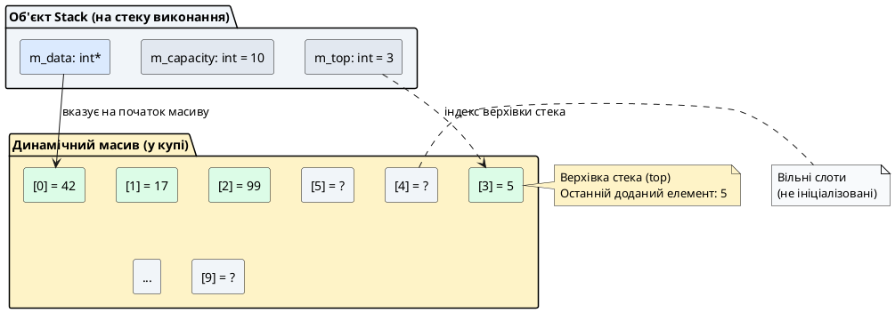
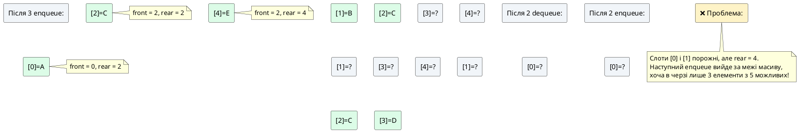
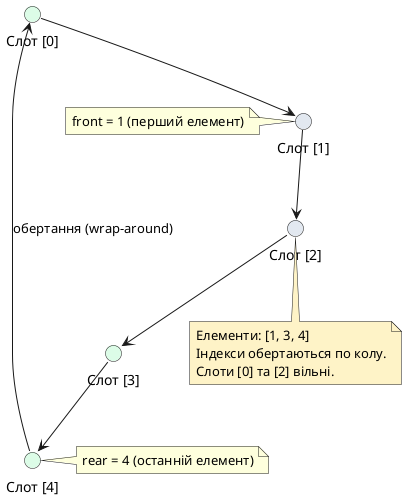

# Стаття 89 — Власні структури даних: стек та черга

::card-group

::card{title="🎯 Мета лекції" icon="i-lucide-target"}

- Опанувати концепцію **абстрактного типу даних** (*Abstract Data Type, ADT*) як інтерфейсу з чітко визначеною семантикою операцій, незалежного від конкретної реалізації.
- Спроєктувати та реалізувати повнофункціональний клас **Stack** (стек): дисципліна LIFO (*Last-In, First-Out*), операції `push`, `pop`, `top`, `isEmpty`, обробка переповнення та спустошення.
- Спроєктувати та реалізувати повнофункціональний клас **Queue** (черга): дисципліна FIFO (*First-In, First-Out*), операції `enqueue`, `dequeue`, `front`, кільцева буферизація (*circular buffer*).
- Застосувати винятки для сигналізації про порушення передумов операцій (витягання з порожнього контейнера).
- Дослідити практичні застосування стеків та черг у реальних алгоритмах: балансування дужок, симуляція друку, рекурсія.

::

::card{title="🔑 Ключові терміни" icon="i-lucide-key"}

- **Abstract Data Type (ADT):** математична модель контейнера з визначеними операціями та їхньою семантикою, незалежна від реалізації.
- **Stack (Стек):** лінійна структура даних з дисципліною LIFO — останній доданий елемент витягується першим.
- **Queue (Черга):** лінійна структура даних з дисципліною FIFO — перший доданий елемент витягується першим.
- **Circular Buffer (Кільцевий буфер):** техніка реалізації черги з фіксованою ємністю, де індекси обертаються по модулю розміру масиву.
- **Underflow / Overflow:** виняткові ситуації витягання з порожнього контейнера або додавання до переповненого контейнера.

::

::

---

## Hook: від програм до даних — коли контейнер диктує поведінку

Уявіть редактор тексту з функцією **Undo** (скасування останньої дії). Користувач послідовно виконує 5 операцій:

1. Видаляє слово "hello"
2. Вставляє речення "Goodbye world"
3. Змінює шрифт на жирний
4. Видаляє абзац
5. Вставляє зображення

Тепер він натискає `Ctrl+Z` (Undo). **Яку операцію має скасувати система?** Очевидно, останню — вставку зображення (операція №5). Натискає ще раз — скасовується видалення абзацу (№4). Ще раз — зміна шрифту (№3). Це не випадковість — це **фундаментальна властивість стеку** (*stack*): останній доданий елемент витягується першим (*Last-In, First-Out, LIFO*).

Тепер розглянемо **чергу друку** (*print queue*) в офісному принтері. Троє співробітників надсилають документи одночасно:

1. Олександр: звіт на 3 сторінки
2. Марія: презентація на 10 сторінок
3. Дмитро: договір на 2 сторінки

**У якому порядку принтер обробить завдання?** У порядку надходження: спершу звіт Олександра (перший у черзі), потім презентацію Марії, нарешті договір Дмитра. Це **фундаментальна властивість черги** (*queue*): перший доданий елемент витягується першим (*First-In, First-Out, FIFO*).

::note
Ці два приклади демонструють ключову ідею **абстрактних типів даних** (*Abstract Data Types, ADT*): контейнер — це не просто «коробка для зберігання елементів». Це **дисципліна доступу** до елементів, що визначає семантику роботи з даними. Стек не дозволяє дістатися до середнього елемента — лише до верхнього. Черга не дозволяє витягнути останній доданий елемент — лише перший. Ці обмеження не є недоліком — вони є **силою абстракції**, яка робить алгоритми зрозумілішими та безпечнішими.
::

До цього моменту курсу ми багато працювали з масивами (`int[]`, `std::vector`) — це **універсальні** контейнери з довільним доступом: можна читати і писати будь-який елемент за індексом. Але універсальність має ціну: коли ми моделюємо стек операцій Undo за допомогою звичайного масиву, **нічого не заважає програмісту випадково звернутися до середини масиву**, порушивши логіку LIFO. Коли ми моделюємо чергу друку через масив, **немає механізму, що запобігає витяганню елементів не з того кінця**.

**Власні структури даних** (*custom data structures*) розв'язують цю проблему: ми **інкапсулюємо** низькорівневий контейнер (масив) всередині класу та надаємо лише ті операції, які відповідають семантиці ADT. Стек надає лише `push` (додати зверху) та `pop` (витягнути зверху). Черга надає лише `enqueue` (додати в кінець) та `dequeue` (витягнути з початку). **Архітектура класу гарантує коректність використання** — помилкове звернення до середини стека стає синтаксично неможливим.

У цій лекції ми опануємо проєктування та реалізацію двох найфундаментальніших ADT комп'ютерних наук — стеку та черги — з нуля, застосовуючи всі інструменти ООП, що ми вивчили: інкапсуляцію, конструктори, деструктори, винятки та RAII.

---

## Абстрактні типи даних: від інтерфейсу до реалізації

### Що таке абстрактний тип даних?

**Абстрактний тип даних** (*Abstract Data Type, ADT*) — це математична модель структури даних, що визначає:

1. **Множину значень**, які може зберігати структура (наприклад, послідовність цілих чисел).
2. **Множину операцій** над цими значеннями (наприклад, `push`, `pop`, `top`).
3. **Семантику (поведінку)** кожної операції — що саме вона робить, які має передумови (*preconditions*) та постумови (*postconditions*).

Ключова властивість ADT — **незалежність від реалізації**. ADT описує **що** робить структура, а не **як** вона це робить на рівні пам'яті та процесора. Наприклад, стек можна реалізувати через:

- Динамічний масив (як ми зробимо у цій лекції).
- Зв'язаний список (*linked list*) — кожен елемент зберігає покажчик на наступний.
- Рекурсивну структуру на основі вкладених об'єктів.

Усі ці реалізації є **коректними**, якщо вони задовольняють семантику ADT: після `push(x)` виклик `top()` має повернути `x`, після `pop()` верхівка стека має змінитися на попередній елемент тощо.

::tip{title="Переваги абстракції ADT"}
**Чому ADT є фундаментом індустрії програмного забезпечення:**

- **Модульність:** Клієнтський код (той, що використовує стек) не залежить від деталей реалізації. Можна змінити масив на зв'язаний список без модифікації коду клієнта.
- **Безпека:** Інкапсуляція гарантує, що внутрішні інваріанти структури (наприклад, «індекс верхівки стека завжди вказує на останній доданий елемент») не можуть бути порушені клієнтом.
- **Зрозумілість:** Інтерфейс ADT документує контракт використання. Метод `pop()` чітко сигналізує: «ця операція витягує елемент», на відміну від універсального `remove(index)`, де індекс може бути будь-яким.
- **Продуктивність:** Різні реалізації одного ADT мають різні характеристики продуктивності. Масив дає O(1) доступ до верхівки, але дорогу реалокацію при зростанні. Зв'язаний список дає O(1) вставку, але дорогий пошук. Абстракція дозволяє обрати оптимальну реалізацію під конкретну задачу.
::

### Стек як ADT: інтерфейс та семантика

**Стек** (*stack*) — це лінійна структура даних, що дотримується дисципліни **LIFO** (*Last-In, First-Out*): останній доданий елемент завжди витягується першим. Уявіть стос тарілок: ви можете покласти нову тарілку лише зверху, і взяти тарілку — лише зверху. Доступ до середини чи дна стека **неможливий** без витягання всіх елементів зверху.

**Обов'язкові операції стека:**

| Операція | Опис | Передумови | Постумови |
|:---------|:-----|:-----------|:----------|
| `push(x)` | Додати елемент `x` на верхівку стека | Стек не переповнений | Розмір стека збільшився на 1, `top()` тепер повертає `x` |
| `pop()` | Видалити елемент з верхівки стека | Стек не порожній | Розмір стека зменшився на 1, `top()` тепер повертає попередній елемент |
| `top()` | Отримати значення верхнього елемента (без видалення) | Стек не порожній | Стан стека не змінився |
| `isEmpty()` | Перевірити, чи стек порожній | — | Повертає `true`, якщо стек не містить елементів |
| `size()` | Отримати кількість елементів у стеку | — | Повертає невід'ємне ціле число |

::warning{title="Передумови операцій — критична деталь"}
Зверніть увагу: операції `pop()` та `top()` мають **передумову**: стек не повинен бути порожнім. Спроба витягти елемент з порожнього стека є **логічною помилкою** (*logic error*), аналогічно виходу за межі масиву. У нашій реалізації ми будемо **генерувати виняток** `std::out_of_range` при порушенні цієї передумови, використовуючи знання зі статей 85–88.
::

### Черга як ADT: інтерфейс та семантика

**Черга** (*queue*) — це лінійна структура даних, що дотримується дисципліни **FIFO** (*First-In, First-Out*): перший доданий елемент завжди витягується першим. Уявіть чергу людей у касі: хто прийшов раніше, той обслуговується раніше. Нові люди стають в кінець черги (*rear* / *back*), обслуговування відбувається з початку черги (*front*).

**Обов'язкові операції черги:**

| Операція | Опис | Передумови | Постумови |
|:---------|:-----|:-----------|:----------|
| `enqueue(x)` | Додати елемент `x` в кінець черги | Черга не переповнена | Розмір черги збільшився на 1, `x` тепер останній у черзі |
| `dequeue()` | Видалити елемент з початку черги | Черга не порожня | Розмір черги зменшився на 1, наступний елемент став першим |
| `front()` | Отримати значення першого елемента (без видалення) | Черга не порожня | Стан черги не змінився |
| `isEmpty()` | Перевірити, чи черга порожня | — | Повертає `true`, якщо черга не містить елементів |
| `size()` | Отримати кількість елементів у черзі | — | Повертає невід'ємне ціле число |

Основна відмінність від стека: у стеку ми додаємо і витягаємо з **одного кінця** (верхівки), у черзі — додаємо з **одного кінця** (rear), а витягаємо з **іншого** (front). Це фундаментально змінює семантику: стек «забуває старі елементи останніми», черга «обробляє старі елементи першими».

---

## Проєктування класу Stack: архітектура та інваріанти

### Вибір внутрішнього контейнера

Для реалізації стека нам потрібен **лінійний контейнер**, що дозволяє ефективно додавати та видаляти елементи з одного кінця. Найпростіший вибір — **динамічний масив** (`int* m_data`), де ми підтримуємо:

- `m_capacity` — поточна ємність масиву (кількість виділених слотів пам'яті).
- `m_top` — **індекс верхівки стека** (індекс останнього доданого елемента).

**Інваріант стека** (умова, що завжди має бути істинною):

- Якщо стек порожній, `m_top == -1`.
- Якщо стек містить `n` елементів, `m_top == n - 1` (індекс останнього елемента).
- Завжди `m_top < m_capacity`.


::plant-uml{alt="Структура пам'яті стека"}



::

### Оголошення класу Stack

```cpp
// Stack.h
#ifndef STACK_H
#define STACK_H

#include <stdexcept>  // std::out_of_range, std::overflow_error

class Stack {
private:
    int* m_data;        // Динамічний масив для зберігання елементів
    int m_capacity;     // Максимальна ємність стека
    int m_top;          // Індекс верхнього елемента (-1, якщо стек порожній)

public:
    // Конструктор: створює стек заданої ємності
    explicit Stack(int capacity = 10);
    
    // Деструктор: звільняє динамічну пам'ять
    ~Stack();
    
    // Заборона копіювання (правило трьох — статті 59, 66)
    Stack(const Stack&) = delete;
    Stack& operator=(const Stack&) = delete;
    
    // Додати елемент на верхівку стека
    void push(int value);
    
    // Видалити елемент з верхівки стека
    void pop();
    
    // Отримати значення верхнього елемента
    int top() const;
    
    // Перевірити, чи стек порожній
    bool isEmpty() const;
    
    // Перевірити, чи стек повний
    bool isFull() const;
    
    // Отримати поточну кількість елементів
    int size() const;
    
    // Отримати ємність стека
    int capacity() const;
};

#endif
```

::note
Зверніть увагу: ми **заборонили копіювання** через `= delete` (стаття 65). Це свідоме архітектурне рішення: копіювання стека з динамічним масивом потребує глибокого копіювання (стаття 66), що може бути затратним. Якщо копіювання необхідне, його потрібно реалізувати явно з усвідомленням витрат продуктивності. Для простоти цієї лекції ми забороняємо копіювання взагалі.
::

### Реалізація конструктора та деструктора

```cpp
// Stack.cpp
#include "Stack.h"

// Конструктор: виділяє пам'ять та ініціалізує стек порожнім
Stack::Stack(int capacity)
    : m_data(new int[capacity])  // Виділяємо масив у купі
    , m_capacity(capacity)
    , m_top(-1)                   // -1 означає «стек порожній»
{
    if (capacity <= 0) {
        throw std::invalid_argument("Stack capacity must be positive");
    }
}

// Деструктор: звільняє динамічну пам'ять (ідіома RAII)
Stack::~Stack() {
    delete[] m_data;
    // m_data, m_capacity, m_top автоматично знищені (це не покажчики)
}
```

Конструктор отримує бажану ємність стека (за замовчуванням 10 елементів) та виділяє масив у купі. Початкове значення `m_top = -1` сигналізує, що стек порожній — це **спеціальне сигнальне значення** (*sentinel value*), яке робить перевірку `isEmpty()` тривіальною.

Деструктор реалізує ідіому **RAII** (*Resource Acquisition Is Initialization*, стаття 54): ресурс (динамічна пам'ять) виділяється в конструкторі та **гарантовано** звільняється в деструкторі. Це запобігає витокам пам'яті навіть при генерації винятків.

### Допоміжні методи: перевірка стану

```cpp
// Перевірити, чи стек порожній
bool Stack::isEmpty() const {
    return m_top == -1;
}

// Перевірити, чи стек повний
bool Stack::isFull() const {
    return m_top == m_capacity - 1;
}

// Отримати поточну кількість елементів
int Stack::size() const {
    return m_top + 1;  // Якщо m_top == 3, у стеку 4 елементи (індекси 0, 1, 2, 3)
}

// Отримати ємність стека
int Stack::capacity() const {
    return m_capacity;
}
```

Ці методи є **запитами** (*queries*) — вони не змінюють стан об'єкта, тому позначені як `const` (стаття 57). Метод `size()` повертає `m_top + 1`, оскільки індекси починаються з 0: якщо верхівка на індексі 3, у стеку 4 елементи (на позиціях 0, 1, 2, 3).

---

## Реалізація операцій стека: push, pop, top

### Операція push: додавання елемента

```cpp
void Stack::push(int value) {
    // Передумова: стек не повинен бути повним
    if (isFull()) {
        throw std::overflow_error("Stack overflow: cannot push to full stack");
    }
    
    // Збільшуємо індекс верхівки та додаємо елемент
    ++m_top;
    m_data[m_top] = value;
    
    // Постумова: size() збільшився на 1, top() тепер повертає value
}
```

Логіка `push` проста:

1. **Перевірка передумови:** Якщо стек вже повний (`m_top == m_capacity - 1`), подальше додавання призведе до запису за межі масиву — це **переповнення стека** (*stack overflow*). Ми генеруємо виняток `std::overflow_error` (стаття 86) для сигналізації про порушення контракту.

2. **Оновлення верхівки:** Збільшуємо `m_top` на 1 — тепер він вказує на наступний вільний слот.

3. **Запис значення:** Зберігаємо `value` у слот `m_data[m_top]`.

::tip
У промисловому коді стеки часто реалізуються з **автоматичним зростанням** (*automatic resizing*): коли стек переповнюється, ємність подвоюється через реалокацію (як у `std::vector`, стаття 93). Ми не робимо цього у цій лекції для простоти, але ви можете реалізувати це як розширення, використовуючи техніки зі статті 69 (контейнерні класи).
::

### Операція pop: видалення елемента

```cpp
void Stack::pop() {
    // Передумова: стек не повинен бути порожнім
    if (isEmpty()) {
        throw std::out_of_range("Stack underflow: cannot pop from empty stack");
    }
    
    // Зменшуємо індекс верхівки — елемент логічно видалено
    --m_top;
    
    // Примітка: фізично елемент залишається в масиві, але стає недоступним
    // Постумова: size() зменшився на 1
}
```

Операція `pop()` **не повертає** видалений елемент — вона лише видаляє його. Якщо потрібно отримати значення **перед** видаленням, спершу викликають `top()`, потім `pop()`. Це розділення відповідальності є **стандартом** у дизайні ADT: операція `pop` виконує лише одну дію — видалення.

**Чому ми не очищаємо фізично елемент?** Після `--m_top` елемент на позиції `m_top + 1` залишається в масиві, але стає **логічно недоступним** — наступний виклик `push` перезапише цей слот. Фізичне очищення (`m_data[m_top + 1] = 0`) не дає жодних переваг для типів `int`, але ускладнює код. Для класів зі складними деструкторами (наприклад, `std::string`) очищення було б необхідним, але це тема лекцій про шаблони класів (стаття 82).

::warning{title="Stack underflow — критична помилка"}
Спроба витягти елемент з порожнього стека називається **underflow** (недоповнення, протилежність overflow). Це **логічна помилка програміста** — еквівалент виходу за межі масиву. Ми генеруємо виняток `std::out_of_range`, що сигналізує про порушення передумови операції.
::

### Операція top: отримання верхнього елемента

```cpp
int Stack::top() const {
    // Передумова: стек не повинен бути порожнім
    if (isEmpty()) {
        throw std::out_of_range("Stack is empty: no top element");
    }
    
    // Повертаємо копію верхнього елемента (не посилання!)
    return m_data[m_top];
}
```

Метод `top()` надає **доступ для читання** до верхнього елемента без його видалення. Це `const`-метод (стаття 57), що гарантує незмінність стану стека. Повертаємо **копію** значення, а не посилання, щоб запобігти зовнішній модифікації внутрішнього масиву.

---

## Використання стека: практичні приклади

### Приклад 1: Балансування дужок

Одне з класичних застосувань стека — **перевірка балансування дужок** у виразах. Вираз коректний, якщо:

- Кожна відкриваюча дужка `(`, `[`, `{` має відповідну закриваючу.
- Закриваючі дужки з'являються у правильному порядку (не можна закрити `]`, якщо остання відкрита `(`).

Приклади:
- `"((()))"` — коректно
- `"([{}])"` — коректно
- `"(()"` — **некоректно** (не вистачає закриваючої)
- `"())"` — **некоректно** (зайва закриваюча)
- `"([)]"` — **некоректно** (неправильний порядок)

```cpp
#include "Stack.h"
#include <string>
#include <iostream>

bool isBalanced(const std::string& expression) {
    Stack stack(expression.length());  // Максимум length() дужок
    
    for (char ch : expression) {
        // Якщо відкриваюча дужка — додаємо в стек
        if (ch == '(' || ch == '[' || ch == '{') {
            stack.push(ch);
        }
        // Якщо закриваюча — перевіряємо відповідність з верхівкою
        else if (ch == ')' || ch == ']' || ch == '}') {
            if (stack.isEmpty()) {
                return false;  // Зайва закриваюча дужка
            }
            
            char topChar = stack.top();
            stack.pop();
            
            // Перевіряємо, чи відкриваюча відповідає закриваючій
            if ((ch == ')' && topChar != '(') ||
                (ch == ']' && topChar != '[') ||
                (ch == '}' && topChar != '{')) {
                return false;  // Неправильний тип дужки
            }
        }
        // Інші символи (букви, цифри) ігноруємо
    }
    
    // Вираз коректний, якщо стек порожній (всі дужки закриті)
    return stack.isEmpty();
}

int main() {
    std::cout << std::boolalpha;  // Друкувати true/false замість 1/0
    std::cout << "\"(())\" balanced: " << isBalanced("(())") << '\n';
    std::cout << "\"([{}])\" balanced: " << isBalanced("([{}])") << '\n';
    std::cout << "\"(()\" balanced: " << isBalanced("(()") << '\n';
    std::cout << "\"([)]\" balanced: " << isBalanced("([)]") << '\n';
    
    return 0;
}
```

::terminal-preview{title="g++ -std=c++17 main.cpp Stack.cpp -o balanced && ./balanced"}
<div class="line"><span class="opacity-40">$</span> <strong class="font-bold">./balanced</strong></div>
<div class="line"><span class="text-blue-400">"(())"</span> balanced: <span class="text-green-400 font-bold">true</span></div>
<div class="line"><span class="text-blue-400">"([{}])"</span> balanced: <span class="text-green-400 font-bold">true</span></div>
<div class="line"><span class="text-blue-400">"(()"</span> balanced: <span class="text-rose-400 font-bold">false</span></div>
<div class="line"><span class="text-blue-400">"([)]"</span> balanced: <span class="text-rose-400 font-bold">false</span></div>
::

**Чому стек ідеально підходить для цієї задачі?** Коли ми зустрічаємо закриваючу дужку, нам потрібно перевірити відповідність з **останньою незакритою** відкриваючою дужкою — це саме семантика LIFO стека.


### Приклад 2: Обернення рядка

Стек природним чином **обертає порядок** елементів: що додано першим, витягується останнім. Це властивість корисна для обернення послідовностей.

```cpp
#include "Stack.h"
#include <string>
#include <iostream>

std::string reverseString(const std::string& str) {
    Stack stack(str.length());
    
    // Додаємо всі символи в стек
    for (char ch : str) {
        stack.push(ch);
    }
    
    // Витягаємо символи у зворотному порядку
    std::string reversed;
    while (!stack.isEmpty()) {
        reversed += static_cast<char>(stack.top());
        stack.pop();
    }
    
    return reversed;
}

int main() {
    std::string original = "Hello, Stack!";
    std::string reversed = reverseString(original);
    
    std::cout << "Original: " << original << '\n';
    std::cout << "Reversed: " << reversed << '\n';
    
    return 0;
}
```

::terminal-preview{title="./reverse"}
<div class="line"><span class="opacity-40">$</span> <strong class="font-bold">./reverse</strong></div>
<div class="line">Original: <span class="text-blue-400">Hello, Stack!</span></div>
<div class="line">Reversed: <span class="text-green-400">!kcatS ,olleH</span></div>
::

::note{title="Стек та рекурсія"}
Стек є фундаментальною структурою даних для реалізації рекурсії. Коли функція викликає саму себе, операційна система використовує **стек викликів** (*call stack*) для збереження локальних змінних та адреси повернення кожного виклику. Коли рекурсія завершується, виклики розгортаються у зворотному порядку — саме за принципом LIFO. У лекціях про STL (стаття 93) ми побачимо, як `std::stack` використовується для перетворення рекурсивних алгоритмів у ітеративні (наприклад, обхід дерева в глибину).
::

---

## Проєктування класу Queue: кільцевий буфер

### Наївна реалізація черги: проблема зсуву

Найпростіший спосіб реалізувати чергу — використати масив з двома індексами:

- `m_front` — індекс першого елемента (який буде витягнуто першим).
- `m_rear` — індекс останнього елемента (куди додано останній елемент).

При додаванні елемента (`enqueue`) збільшуємо `m_rear`. При видаленні (`dequeue`) збільшуємо `m_front`. Проблема: після кількох операцій `m_front` та `m_rear` зміщуються до кінця масиву, навіть якщо початок масиву порожній.

::plant-uml{alt="Проблема лінійної черги"}



::

Наївне рішення — **зсувати всі елементи** після кожного `dequeue`, щоб `m_front` завжди був 0. Але це катастрофічно неефективно: кожне видалення потребує O(n) копіювань.

### Кільцевий буфер: елегантне рішення

**Кільцевий буфер** (*circular buffer* / *ring buffer*) розв'язує проблему зсуву: коли індекс досягає кінця масиву, він **обертається** на початок. Ми розглядаємо масив як кільце, де після останнього слота йде перший.

**Ключова ідея:** Індекси `m_front` та `m_rear` обчислюються **за модулем** розміру масиву:

```cpp
m_rear = (m_rear + 1) % m_capacity;
m_front = (m_front + 1) % m_capacity;
```

Якщо `m_capacity = 5`, послідовність індексів: 0 → 1 → 2 → 3 → 4 → 0 → 1 → ... (кільце).

::plant-uml{alt="Кільцевий буфер черги"}



::

### Оголошення класу Queue

```cpp
// Queue.h
#ifndef QUEUE_H
#define QUEUE_H

#include <stdexcept>

class Queue {
private:
    int* m_data;        // Динамічний масив (кільцевий буфер)
    int m_capacity;     // Максимальна ємність черги
    int m_front;        // Індекс першого елемента
    int m_rear;         // Індекс останнього елемента
    int m_size;         // Поточна кількість елементів

public:
    // Конструктор: створює чергу заданої ємності
    explicit Queue(int capacity = 10);
    
    // Деструктор: звільняє динамічну пам'ять
    ~Queue();
    
    // Заборона копіювання
    Queue(const Queue&) = delete;
    Queue& operator=(const Queue&) = delete;
    
    // Додати елемент в кінець черги
    void enqueue(int value);
    
    // Видалити елемент з початку черги
    void dequeue();
    
    // Отримати значення першого елемента
    int front() const;
    
    // Перевірити, чи черга порожня
    bool isEmpty() const;
    
    // Перевірити, чи черга повна
    bool isFull() const;
    
    // Отримати поточну кількість елементів
    int size() const;
    
    // Отримати ємність черги
    int capacity() const;
};

#endif
```

**Важлива відмінність від стека:** У черзі ми зберігаємо **окреме поле `m_size`** (кількість елементів), оскільки індекси `m_front` та `m_rear` **не дають прямої інформації** про кількість елементів у кільцевому буфері. Наприклад, якщо `m_front == m_rear`, це може означати як порожню чергу, так і повну (всі слоти зайняті, індекси збіглися після обертання).

### Реалізація конструктора та допоміжних методів

```cpp
// Queue.cpp
#include "Queue.h"

Queue::Queue(int capacity)
    : m_data(new int[capacity])
    , m_capacity(capacity)
    , m_front(0)     // Перший елемент на індексі 0
    , m_rear(-1)     // -1 означає "черга порожня"
    , m_size(0)
{
    if (capacity <= 0) {
        throw std::invalid_argument("Queue capacity must be positive");
    }
}

Queue::~Queue() {
    delete[] m_data;
}

bool Queue::isEmpty() const {
    return m_size == 0;
}

bool Queue::isFull() const {
    return m_size == m_capacity;
}

int Queue::size() const {
    return m_size;
}

int Queue::capacity() const {
    return m_capacity;
}
```

Початкові значення: `m_front = 0`, `m_rear = -1`, `m_size = 0` сигналізують про порожню чергу. Після першого `enqueue` індекс `m_rear` стане 0 (через `(m_rear + 1) % m_capacity`), і перший елемент буде на позиції 0.

---

## Реалізація операцій черги: enqueue, dequeue, front

### Операція enqueue: додавання елемента

```cpp
void Queue::enqueue(int value) {
    // Передумова: черга не повинна бути повною
    if (isFull()) {
        throw std::overflow_error("Queue overflow: cannot enqueue to full queue");
    }
    
    // Обертаємо rear на наступну позицію (з урахуванням кільця)
    m_rear = (m_rear + 1) % m_capacity;
    
    // Додаємо елемент на нову позицію rear
    m_data[m_rear] = value;
    
    // Збільшуємо лічильник розміру
    ++m_size;
    
    // Постумова: size() збільшився на 1, елемент доданий в кінець
}
```

**Ключовий момент:** Оператор `%` (модуль) забезпечує обертання індекса. Якщо `m_rear == 4` і `m_capacity == 5`, то `(4 + 1) % 5 == 0` — індекс повертається на початок масиву. Якщо `m_rear == 2`, то `(2 + 1) % 5 == 3` — звичайне збільшення.

### Операція dequeue: видалення елемента

```cpp
void Queue::dequeue() {
    // Передумова: черга не повинна бути порожньою
    if (isEmpty()) {
        throw std::out_of_range("Queue underflow: cannot dequeue from empty queue");
    }
    
    // Обертаємо front на наступну позицію (видаляємо перший елемент логічно)
    m_front = (m_front + 1) % m_capacity;
    
    // Зменшуємо лічильник розміру
    --m_size;
    
    // Постумова: size() зменшився на 1, наступний елемент став першим
}
```

Аналогічно `enqueue`, ми обертаємо `m_front` через модуль. Фізично елемент залишається в масиві, але стає недоступним.

### Операція front: отримання першого елемента

```cpp
int Queue::front() const {
    // Передумова: черга не повинна бути порожньою
    if (isEmpty()) {
        throw std::out_of_range("Queue is empty: no front element");
    }
    
    // Повертаємо копію першого елемента
    return m_data[m_front];
}
```

---

## Використання черги: практичні приклади

### Приклад 1: Симуляція друку

Черга ідеально моделює **системи обслуговування** (*queuing systems*): принтер, каса в магазині, процесор комп'ютера.

```cpp
#include "Queue.h"
#include <iostream>
#include <string>

struct PrintJob {
    std::string documentName;
    int pages;
};

void simulatePrintQueue() {
    Queue jobIds(5);  // Черга ID завдань (для простоти — int)
    
    std::cout << "=== Симуляція черги друку ===\n\n";
    
    // Додаємо завдання в чергу
    std::cout << "Надсилання завдань на друк:\n";
    try {
        jobIds.enqueue(101);  // Завдання №101
        std::cout << "  Додано завдання #101 (звіт, 3 стор.)\n";
        
        jobIds.enqueue(102);  // Завдання №102
        std::cout << "  Додано завдання #102 (презентація, 10 стор.)\n";
        
        jobIds.enqueue(103);  // Завдання №103
        std::cout << "  Додано завдання #103 (договір, 2 стор.)\n";
    } catch (const std::exception& e) {
        std::cerr << "Помилка: " << e.what() << '\n';
    }
    
    std::cout << "\nОбробка черги друку (FIFO):\n";
    
    // Обробляємо завдання в порядку надходження
    while (!jobIds.isEmpty()) {
        int currentJob = jobIds.front();
        std::cout << "  Друкується завдання #" << currentJob << "...\n";
        jobIds.dequeue();
    }
    
    std::cout << "\nЧерга порожня. Всі завдання оброблені.\n";
}

int main() {
    simulatePrintQueue();
    return 0;
}
```

::terminal-preview{title="./print_queue"}
<div class="line"><span class="opacity-40">$</span> <strong class="font-bold">./print_queue</strong></div>
<div class="line"><span class="text-blue-400 font-bold">=== Симуляція черги друку ===</span></div>
<div class="line"></div>
<div class="line">Надсилання завдань на друк:</div>
<div class="line">  Додано завдання <span class="text-green-400">#101</span> (звіт, 3 стор.)</div>
<div class="line">  Додано завдання <span class="text-green-400">#102</span> (презентація, 10 стор.)</div>
<div class="line">  Додано завдання <span class="text-green-400">#103</span> (договір, 2 стор.)</div>
<div class="line"></div>
<div class="line">Обробка черги друку (FIFO):</div>
<div class="line">  Друкується завдання <span class="text-blue-400">#101</span>...</div>
<div class="line">  Друкується завдання <span class="text-blue-400">#102</span>...</div>
<div class="line">  Друкується завдання <span class="text-blue-400">#103</span>...</div>
<div class="line"></div>
<div class="line"><span class="text-green-400 font-bold">Черга порожня. Всі завдання оброблені.</span></div>
::

**Чому черга ідеально підходить?** Завдання обробляються у порядку надходження — **справедливе обслуговування** (*fair scheduling*). Перший, хто надіслав документ, отримує результат першим.


### Приклад 2: Обхід дерева в ширину (BFS)

Черга є фундаментальною структурою для алгоритму **обходу графа в ширину** (*Breadth-First Search, BFS*). Хоча ми ще не вивчали дерева та графи детально, концептуально BFS працює так:

1. Починаємо з кореневого вузла, додаємо його в чергу.
2. Витягаємо вузол з початку черги, обробляємо його.
3. Додаємо всіх його дітей (сусідів) в кінець черги.
4. Повторюємо, поки черга не стане порожньою.

```cpp
#include "Queue.h"
#include <iostream>

// Спрощена структура бінарного дерева (для демонстрації концепції)
struct TreeNode {
    int value;
    TreeNode* left;
    TreeNode* right;
    
    TreeNode(int val) : value(val), left(nullptr), right(nullptr) {}
};

void breadthFirstTraversal(TreeNode* root) {
    if (root == nullptr) return;
    
    Queue queue(100);  // Черга покажчиків (для простоти зберігаємо як int — адреси)
    
    // Додаємо корінь в чергу
    queue.enqueue(reinterpret_cast<int>(root));
    
    std::cout << "BFS traversal: ";
    
    while (!queue.isEmpty()) {
        // Витягаємо вузол з початку черги
        TreeNode* current = reinterpret_cast<TreeNode*>(queue.front());
        queue.dequeue();
        
        // Обробляємо поточний вузол
        std::cout << current->value << " ";
        
        // Додаємо дітей в чергу (якщо вони існують)
        if (current->left != nullptr) {
            queue.enqueue(reinterpret_cast<int>(current->left));
        }
        if (current->right != nullptr) {
            queue.enqueue(reinterpret_cast<int>(current->right));
        }
    }
    
    std::cout << '\n';
}

int main() {
    // Створюємо просте дерево:
    //       1
    //      / \
    //     2   3
    //    / \
    //   4   5
    TreeNode* root = new TreeNode(1);
    root->left = new TreeNode(2);
    root->right = new TreeNode(3);
    root->left->left = new TreeNode(4);
    root->left->right = new TreeNode(5);
    
    breadthFirstTraversal(root);  // Виведе: 1 2 3 4 5 (по рівнях)
    
    // Звільнення пам'яті (спрощено)
    delete root->left->right;
    delete root->left->left;
    delete root->left;
    delete root->right;
    delete root;
    
    return 0;
}
```

::terminal-preview{title="./bfs_tree"}
<div class="line"><span class="opacity-40">$</span> <strong class="font-bold">./bfs_tree</strong></div>
<div class="line">BFS traversal: <span class="text-green-400">1 2 3 4 5</span></div>
::

::note
У реальному коді ми б використовували шаблони (`Queue<TreeNode*>`), щоб черга могла зберігати покажчики безпосередньо, без небезпечного `reinterpret_cast`. Шаблони класів будуть темою статті 82. Наразі цей приклад демонструє **концептуальну потужність черги**: вона природним чином моделює обхід «рівень за рівнем», оскільки вузли обробляються у порядку додавання.
::

---

## Порівняння Stack та Queue: коли використовувати що?

::card-group

::card{title="Stack (LIFO)" icon="i-lucide-layers"}

**Коли використовувати:**

- **Відміна операцій** (Undo/Redo): останню операцію скасовуємо першою.
- **Рекурсія:** імітація стека викликів для перетворення рекурсивних алгоритмів у ітеративні.
- **Балансування парних елементів:** дужки, теги HTML/XML, лапки.
- **Обхід графів у глибину (DFS):** дослідження гілки до кінця перед поверненням.
- **Парсинг виразів:** обчислення постфіксних виразів (Reverse Polish Notation).

**Приклади з реального світу:**

- Історія браузера (кнопка "Назад").
- Call stack в дебагері.
- Функція `std::stack` в STL (стаття 95).

::

::card{title="Queue (FIFO)" icon="i-lucide-arrow-right-left"}

**Коли використовувати:**

- **Системи обслуговування:** черги друку, обробка запитів на сервері.
- **Планування завдань:** процесор комп'ютера обробляє процеси у порядку пріоритету/надходження.
- **Буферизація потоків даних:** відео/аудіо стримінг, мережеві пакети.
- **Обхід графів у ширину (BFS):** дослідження всіх сусідів перед переходом на наступний рівень.
- **Симуляція реальних процесів:** черга в супермаркеті, диспетчеризація літаків.

**Приклади з реального світу:**

- Черга повідомлень (Message Queue) у мікросервісах.
- Буфер клавіатури (keystrokes).
- Функція `std::queue` в STL (стаття 95).

::

::

::tip{title="Вибір структури даних — питання семантики"}
Багато задач можна розв'язати і стеком, і чергою, але **правильна структура робить код самодокументованим**. Якщо ваша задача природно моделюється як "останній прийшов — перший пішов", використовуйте стек. Якщо як "перший прийшов — перший пішов", використовуйте чергу. Неправильний вибір призведе до складного, заплутаного коду з маніпуляціями індексами.
::

---

## Обмеження поточної реалізації та шляхи розвитку

Наші класи `Stack` та `Queue` є **навчальними реалізаціями** — вони демонструють фундаментальні концепції ADT, але мають обмеження порівняно з промисловими контейнерами (`std::stack`, `std::queue`, стаття 95). Розглянемо ключові напрямки вдосконалення:

### 1. Фіксована ємність vs автоматичне зростання

**Поточна реалізація:** Ємність задається в конструкторі та не змінюється. Якщо стек/черга переповнюється, генерується виняток.

**Промислове рішення:** `std::stack` автоматично збільшує ємність при переповненні (подвоює розмір буфера). Це усуває обмеження на кількість елементів, але має ціну: реалокація — затратна операція O(n).

**Як реалізувати:** Додайте метод `resize()` (аналогічно статті 69), який виділяє новий масив подвоєного розміру, копіює елементи та звільняє старий буфер.

### 2. Підтримка довільних типів через шаблони

**Поточна реалізація:** Зберігаємо лише `int`. Для `std::string`, `double` чи користувацьких класів потрібна окрема реалізація.

**Промислове рішення:** `std::stack<T>` та `std::queue<T>` — це **шаблони класів** (стаття 82), що працюють з будь-яким типом `T`.

**Як реалізувати:** Перепишіть клас як шаблон:

```cpp
template<typename T>
class Stack {
private:
    T* m_data;  // Замість int* m_data
    // ... решта без змін
};
```

Шаблони будуть детально розглянуті у статтях 81–84.

### 3. Ітератори для зручного обходу

**Поточна реалізація:** Щоб обійти всі елементи стека, потрібно витягувати їх через `pop()`, знищуючи стек.

**Промислове рішення:** STL-контейнери надають **ітератори** (стаття 87) — об'єкти, що дозволяють обходити елементи без модифікації контейнера:

```cpp
for (auto it = stack.begin(); it != stack.end(); ++it) {
    std::cout << *it << '\n';  // Читання без видалення
}
```

### 4. Move-семантика для ефективного переміщення

**Поточна реалізація:** Ми заборонили копіювання через `= delete`. Якщо потрібно передати стек у функцію, доводиться передавати покажчик або посилання.

**Промислове рішення:** C++11 надає **move-семантику** (статті 96–99): об'єкт можна **перемістити** без копіювання даних — просто передається покажчик на буфер. Це дозволяє повертати контейнери з функцій ефективно.

```cpp
Stack createFilledStack() {
    Stack s(100);
    s.push(1);
    s.push(2);
    return s;  // Move, а не копіювання!
}
```

::note
Всі ці вдосконалення будуть природно вивчені у наступних лекціях: шаблони (81–84), STL-контейнери (93–95), ітератори (87), move-семантика (96–99). Поточна реалізація є **фундаментом**, що дозволяє зрозуміти суть абстрактних типів даних перед переходом до складніших механізмів мови.
::

---

## Резюме: від контейнерів до дисципліни доступу

У цій лекції ми зробили фундаментальний крок від «коробки для зберігання даних» (масиву) до **абстрактних типів даних** — структур, що визначають не лише зберігання, а й **правила доступу** до елементів. Стек та черга демонструють потужність інкапсуляції: обмежуючи інтерфейс лише необхідними операціями, ми робимо код безпечнішим, зрозумілішим та стійкішим до помилок.

**Ключові концепції:**

- **ADT (Abstract Data Type):** математична модель контейнера з визначеними операціями та семантикою, незалежна від реалізації.
- **Stack (LIFO):** останній доданий елемент витягується першим. Операції: `push`, `pop`, `top`. Застосування: Undo/Redo, рекурсія, балансування дужок, DFS.
- **Queue (FIFO):** перший доданий елемент витягується першим. Операції: `enqueue`, `dequeue`, `front`. Застосування: системи обслуговування, BFS, буферизація.
- **Кільцевий буфер:** техніка реалізації черги з фіксованою ємністю через обертання індексів за модулем розміру.
- **Обробка винятків:** порушення передумов операцій (витягання з порожнього контейнера, додавання до повного) сигналізується через винятки `std::out_of_range` та `std::overflow_error`.

::card-group

::card{title="🎓 Що ми опанували" icon="i-lucide-graduation-cap"}

- Проєктували класи зі складними інваріантами (`m_top`, `m_front`, `m_rear`, `m_size`).
- Застосували RAII для керування динамічною пам'яттю.
- Використали винятки для забезпечення коректності передумов операцій.
- Реалізували кільцевий буфер з обертанням індексів через модуль.
- Дослідили практичні застосування ADT у реальних алгоритмах.

::

::card{title="🚀 Наступні кроки" icon="i-lucide-rocket"}

**Стаття 90 — Однозв'язаний список:**
Реалізуємо динамічну структуру даних без фіксованої ємності: вузли, покажчики, вставка/видалення за O(1).

**Стаття 91 — Двозв'язаний список:**
Розширимо однозв'язаний список для ефективного обходу в обох напрямках.

**Стаття 92 — Бінарне дерево пошуку:**
Дослідимо ієрархічні структури даних з логарифмічною складністю пошуку.

**Статті 93–95 — STL-контейнери:**
Вивчимо професійні реалізації стеків, черг, векторів, списків, множин та словників у стандартній бібліотеці C++.

::

::

---

## Практичні завдання

::::accordion

:::accordion-item{label="📋 Завдання 1: Перевірка паліндрома через стек" icon="i-lucide-clipboard-list"}

**Завдання:** Напишіть функцію `bool isPalindrome(const std::string& str)`, яка перевіряє, чи є рядок паліндромом (читається однаково зліва направо і справа наліво), використовуючи стек.

**Алгоритм:**

1. Додайте всі символи рядка в стек (ігноруючи пробіли та розділові знаки).
2. Пройдіть по рядку ще раз, витягаючи символи зі стека та порівнюючи.
3. Якщо всі символи збігаються, рядок є паліндромом.

**Приклади:**

- `"racecar"` → `true`
- `"A man a plan a canal Panama"` → `true` (ігноруючи пробіли та регістр)
- `"hello"` → `false`

:::

:::accordion-item{label="✅ Розв'язок завдання 1" icon="i-lucide-check-circle"}

```cpp
#include "Stack.h"
#include <string>
#include <cctype>  // std::tolower, std::isalpha
#include <iostream>

bool isPalindrome(const std::string& str) {
    // Створюємо стек достатньої ємності
    Stack stack(str.length());
    
    // Фаза 1: Додаємо лише літери (малі) в стек
    std::string cleaned;
    for (char ch : str) {
        if (std::isalpha(ch)) {
            char lower = std::tolower(ch);
            stack.push(lower);
            cleaned += lower;
        }
    }
    
    // Фаза 2: Порівнюємо cleaned з порядком зі стека
    for (char ch : cleaned) {
        if (ch != stack.top()) {
            return false;
        }
        stack.pop();
    }
    
    return true;
}

int main() {
    std::cout << std::boolalpha;
    std::cout << "\"racecar\": " << isPalindrome("racecar") << '\n';
    std::cout << "\"A man a plan a canal Panama\": " 
              << isPalindrome("A man a plan a canal Panama") << '\n';
    std::cout << "\"hello\": " << isPalindrome("hello") << '\n';
    
    return 0;
}
```

::terminal-preview{title="./palindrome"}
<div class="line"><span class="opacity-40">$</span> <strong class="font-bold">./palindrome</strong></div>
<div class="line"><span class="text-blue-400">"racecar"</span>: <span class="text-green-400 font-bold">true</span></div>
<div class="line"><span class="text-blue-400">"A man a plan a canal Panama"</span>: <span class="text-green-400 font-bold">true</span></div>
<div class="line"><span class="text-blue-400">"hello"</span>: <span class="text-rose-400 font-bold">false</span></div>
::

:::

:::accordion-item{label="📋 Завдання 2: Генератор бінарних чисел через чергу" icon="i-lucide-clipboard-list"}

**Завдання:** Напишіть функцію `void generateBinaryNumbers(int n)`, яка генерує перші `n` бінарних чисел (1, 10, 11, 100, 101, 110, 111, ...) використовуючи чергу.

**Алгоритм:**

1. Додайте "1" в чергу (як рядок).
2. Поки не згенеровано `n` чисел:
   - Витягніть рядок з черги, надрукуйте його.
   - Додайте в чергу `рядок + "0"` та `рядок + "1"`.

**Приклад виводу для `n = 5`:**

```
1
10
11
100
101
```

:::

:::accordion-item{label="✅ Розв'язок завдання 2" icon="i-lucide-check-circle"}

```cpp
#include "Queue.h"
#include <iostream>
#include <string>

// Для простоти зберігаємо рядки як числові коди символів (хак)
// У реальному коді використовували б Queue<std::string> через шаблони

void generateBinaryNumbers(int n) {
    if (n <= 0) return;
    
    // Початок: додаємо "1" (кодуємо рядок через суму ASCII-кодів — хак)
    Queue queue(n * 2);  // Ємність достатня для всіх проміжних значень
    
    std::string current = "1";
    std::cout << current << '\n';
    
    queue.enqueue(1);  // Код "1" — просто символ '1'
    int count = 1;
    
    while (count < n) {
        // Витягаємо поточне бінарне число (як код)
        int code = queue.front();
        queue.dequeue();
        
        // Генеруємо наступні два числа: додаємо "0" та "1"
        std::string s = (code == 1) ? "1" : std::to_string(code);
        
        std::string next0 = s + "0";
        std::string next1 = s + "1";
        
        std::cout << next0 << '\n';
        ++count;
        if (count < n) {
            std::cout << next1 << '\n';
            ++count;
        }
        
        // Додаємо в чергу для наступних генерацій (хак: числові коди)
        queue.enqueue(std::stoi(next0));
        if (count < n) {
            queue.enqueue(std::stoi(next1));
        }
    }
}

int main() {
    std::cout << "Перші 10 бінарних чисел:\n";
    generateBinaryNumbers(10);
    
    return 0;
}
```

::terminal-preview{title="./binary_gen"}
<div class="line"><span class="opacity-40">$</span> <strong class="font-bold">./binary_gen</strong></div>
<div class="line">Перші 10 бінарних чисел:</div>
<div class="line"><span class="text-green-400">1</span></div>
<div class="line"><span class="text-green-400">10</span></div>
<div class="line"><span class="text-green-400">11</span></div>
<div class="line"><span class="text-green-400">100</span></div>
<div class="line"><span class="text-green-400">101</span></div>
<div class="line"><span class="text-green-400">110</span></div>
<div class="line"><span class="text-green-400">111</span></div>
<div class="line"><span class="text-green-400">1000</span></div>
<div class="line"><span class="text-green-400">1001</span></div>
<div class="line"><span class="text-green-400">1010</span></div>
::

::note
У реальному коді ми б використовували `Queue<std::string>` через шаблони (стаття 82), що усуває потребу у хаках з числовими кодами. Цей приклад демонструє **концептуальну силу черги**: вона природно генерує послідовність рівень за рівнем (1 → 10, 11 → 100, 101, 110, 111 → ...).
::

:::

::::

---

Ця стаття завершує серію з фундаментальних принципів ООП та відкриває двері до світу **складних структур даних**: зв'язаних списків, дерев, хеш-таблиць та графів. У наступних лекціях ми продовжимо будувати власні контейнери, а потім вивчимо, як стандартна бібліотека C++ реалізує ці концепції професійно та ефективно.
