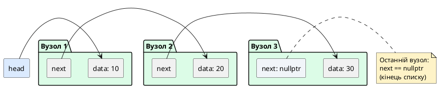
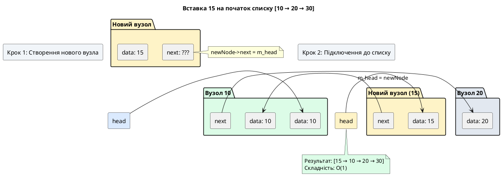
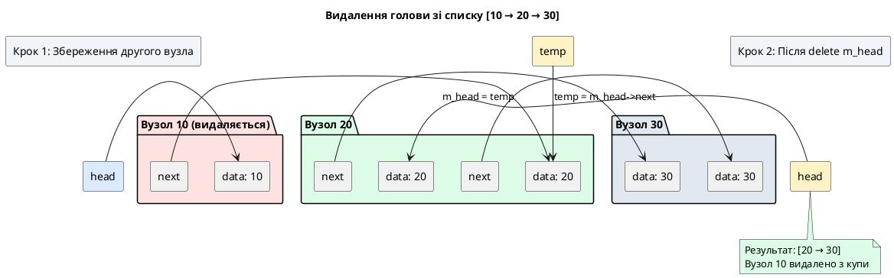
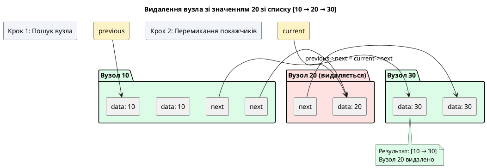
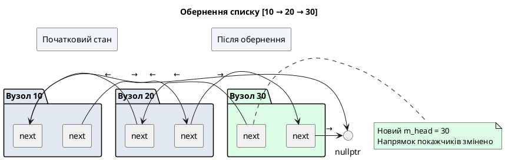

# Стаття 90 — Власні структури даних: однозв'язаний список

::card-group

::card{title="🎯 Мета лекції" icon="i-lucide-target"}

- Опанувати концепцію **вузлової структури даних** (*node-based data structure*): об'єкти, з'єднані покажчиками, на відміну від масивів з суцільним блоком пам'яті.
- Спроєктувати та реалізувати **однозв'язаний список** (*Singly Linked List*): лінійна структура, де кожен вузол містить дані та покажчик на наступний вузол.
- Дослідити асимптотичну складність операцій: вставка на початок — O(1), пошук елемента — O(n), видалення за значенням — O(n).
- Реалізувати ключові операції: `insertFront`, `insertBack`, `deleteValue`, `search`, `display`, `reverse`.
- Зрозуміти компроміси між масивами та зв'язаними списками: довільний доступ vs динамічна вставка, локальність кешу vs гнучкість пам'яті.

::

::card{title="🔑 Ключові терміни" icon="i-lucide-key"}

- **Node (Вузол):** базовий будівельний блок зв'язаного списку — структура, що зберігає дані та покажчик(и) на інші вузли.
- **Head (Голова списку):** покажчик на перший вузол у списку; якщо список порожній, `head == nullptr`.
- **Tail (Хвіст списку):** покажчик на останній вузол; у однозв'язаному списку часто не зберігається (обчислюється за потреби).
- **Traversal (Обхід):** процес послідовного проходження по всіх вузлах списку від голови до кінця.
- **Dynamic Allocation (Динамічне виділення):** кожен вузол створюється окремим викликом `new`, на відміну від масиву з одним суцільним блоком.

::

::

---

## Hook: коли масив стає кайданами — проблема вставки

Уявіть додаток для управління списком контактів у телефоні. Користувач зберігає 1000 контактів у масиві, відсортованому за алфавітом. Раптом він додає новий контакт з ім'ям "Андрій" — перше за алфавітом. **Що має зробити програма?**

У масиві це **катастрофічна** операція:

1. Виділити новий масив на 1001 елемент (старий переповнений).
2. Скопіювати перший елемент на позицію `[1]`.
3. Скопіювати другий елемент на позицію `[2]`.
4. ...
5. Скопіювати 1000-й елемент на позицію `[1000]`.
6. Вставити "Андрій" на позицію `[0]`.
7. Звільнити старий масив.

**Складність:** O(n) копіювань + реалокація. Для 1000 елементів — мінімум 1000 операцій присвоєння. Для 1 мільйона — 1 мільйон. **Це неприйнятно** для інтерактивних додатків, де вставка має відбуватися миттєво.

Тепер розглянемо альтернативний підхід — **однозв'язаний список** (*Singly Linked List*). Контакти зберігаються у вузлах (*nodes*), кожен з яких містить:

- **Дані:** ім'я контакту, телефон.
- **Покажчик `next`:** адреса наступного контакту в ланцюжку.

Щоб вставити "Андрій" на початок:

1. Створити новий вузол з даними "Андрій".
2. Встановити його `next` на поточну голову списку.
3. Оновити голову списку на новий вузол.

**Складність:** O(1) — **три операції**, незалежно від розміру списку. 1000 елементів чи 1 мільйон — різниці немає. Це фундаментальна перевага зв'язаних списків над масивами: **вставка та видалення на початку завжди миттєві**.

::note
Звичайно, зв'язані списки не є універсальним рішенням — вони мають свої недоліки (про це у розділі "Порівняння з масивами"). Але вони демонструють ключовий принцип проєктування структур даних: **немає єдиної найкращої структури** — є компроміси (*trade-offs*), і завдання інженера — обрати структуру, оптимальну для конкретної задачі.
::

У попередній лекції (стаття 89) ми реалізували стек та чергу на основі масивів — структур з **фіксованою (або переалокованою) ємністю**. У цій лекції ми опануємо зв'язані списки — структури з **динамічною ємністю**, де пам'ять виділяється для кожного елемента окремо, а елементи з'єднуються покажчиками. Це відкриє шлях до дерев, графів та інших складних ієрархічних структур.

---

## Концепція вузлової структури даних

### Від масивів до покажчиків: зміна парадигми

**Масив** (*array*) — це **суцільний блок пам'яті**, де елементи розташовані послідовно за адресами. Індекс `i` перетворюється на адресу через арифметику: `address = base + i * sizeof(element)`. Це дає **довільний доступ** (*random access*) за O(1): щоб дістатися до 1000-го елемента, не потрібно проходити через перші 999.

```cpp
int arr[5] = {10, 20, 30, 40, 50};
int value = arr[2];  // O(1): пряме обчислення адреси
```

::memory-view{title="Масив у пам'яті" startAddress="0x00401000" :data="[10, 0, 0, 0, 20, 0, 0, 0, 30, 0, 0, 0, 40, 0, 0, 0, 50, 0, 0, 0]" :highlight="[8, 9, 10, 11]" rowSize="20"}
::

**Зв'язаний список** (*linked list*) — це **розпорошена структура**: елементи розкидані по купі (*heap*), кожен елемент зберігає **покажчик** на місце розташування наступного. Немає індексів — щоб дістатися до 1000-го елемента, потрібно пройти через перші 999 вузлів (*traversal*). Доступ — O(n).

```cpp
struct Node {
    int data;
    Node* next;  // Покажчик на наступний вузол
};

Node* head = new Node{10, nullptr};
head->next = new Node{20, nullptr};
head->next->next = new Node{30, nullptr};
```

::plant-uml{alt="Структура однозв'язаного списку"}



::

**Ключові відмінності:**

| Властивість | Масив | Однозв'язаний список |
|:------------|:------|:---------------------|
| **Пам'ять** | Суцільний блок | Розпорошені вузли в купі |
| **Доступ за індексом** | O(1) — пряме обчислення | O(n) — обхід від голови |
| **Вставка на початок** | O(n) — зсув всіх елементів | **O(1)** — зміна голови |
| **Вставка в кінець** | O(1) якщо є місце, O(n) при реалокації | O(n) без tail-покажчика, O(1) з tail |
| **Видалення за значенням** | O(n) — пошук + зсув | O(n) — пошук + зміна `next` |
| **Використання пам'яті** | Компактне: лише дані | Overhead: дані + покажчик(и) на кожен елемент |
| **Локальність кешу** | Відмінна (послідовні адреси) | Погана (випадкові адреси в купі) |

::tip{title="Коли обирати зв'язаний список?"}
Зв'язані списки оптимальні, коли:

- **Часті вставки/видалення на початку чи в середині** (зміна покажчиків замість копіювання).
- **Невідомий заздалегідь розмір** (не потрібна реалокація, як у `std::vector`).
- **Порядок елементів критичний**, а довільний доступ — рідкісний.

Масиви оптимальні, коли:

- **Читання за індексом — основна операція** (ігрове поле, пікселі зображення).
- **Розмір фіксований чи рідко змінюється**.
- **Локальність кешу критична** (числові обчислення, графіка).
::

### Анатомія вузла: структура Node

**Вузол** (*node*) — це мінімальна одиниця зв'язаного списку. У найпростішому варіанті (однозв'язаний список для цілих чисел) він містить два поля:

```cpp
struct Node {
    int data;      // Корисне навантаження (payload)
    Node* next;    // Адреса наступного вузла (або nullptr)
};
```

**Чому `struct`, а не `class`?** У C++ різниця між `struct` і `class` — лише доступ за замовчуванням (`public` vs `private`, стаття 51). Для простих вузлів без методів та інваріантів прийнято використовувати `struct` з публічними полями. Для складніших вузлів (з конструкторами, валідацією) використовується `class`.

**Покажчик `next`:** Зберігає адресу наступного вузла в ланцюжку. Якщо вузол останній, `next == nullptr` — це **сигнальне значення** (*sentinel*), що позначає кінець списку.

::debugger-view{title="Стан трьох вузлів у пам'яті"}
| Name | Type | Value |
| :--- | :--- | :---- |
| node1 | Node | {...} |
|   data | int | 42 |
|   next | Node* | 0x00007F8A2C004020 |
| node2 | Node | {...} |
|   data | int | 17 |
|   next | Node* | 0x00007F8A2C004040 |
| node3 | Node | {...} |
|   data | int | 99 |
|   next | Node* | 0x0000000000000000 (nullptr) |
::

### Створення вузлів: динамічне виділення пам'яті

Кожен вузол існує у купі (*heap*) та створюється оператором `new` (стаття 19). Це відрізняється від масиву, де весь блок виділяється одним викликом `new[]`.

```cpp
// Створення окремого вузла
Node* firstNode = new Node;
firstNode->data = 10;
firstNode->next = nullptr;

// Або через uniform initialization (C++11)
Node* secondNode = new Node{20, nullptr};

// Або через designated initializers (C++20)
Node* thirdNode = new Node{.data = 30, .next = nullptr};
```

**Важливий момент:** Кожен `new` повертає **унікальну адресу** в купі. Вузли не розташовані послідовно — між ними можуть бути інші об'єкти. Саме тому потрібен покажчик `next` — щоб знайти наступний вузол, потрібно прочитати адресу з поточного.

::warning{title="Відповідальність за пам'ять"}
Програміст **вручну** відповідає за звільнення кожного вузла через `delete`. Забутий `delete` — це **витік пам'яті** (*memory leak*). У класі `LinkedList` (який ми реалізуємо далі) деструктор має обійти весь список та видалити кожен вузол. Це фундаментальна відмінність від масиву, де достатньо одного `delete[]`.
::

---

## Проєктування класу LinkedList: інтерфейс та інваріанти

### Інваріанти однозв'язаного списку

**Інваріант** (*invariant*) — умова, що завжди має бути істинною для коректного стану об'єкта. Для однозв'язаного списку:

1. **Якщо список порожній:** `m_head == nullptr`.
2. **Якщо список не порожній:** `m_head` вказує на перший вузол, а останній вузол має `next == nullptr`.
3. **Ланцюжок покажчиків неперервний:** можна дістатися від `m_head` до будь-якого вузла, слідуючи за `next`.
4. **Немає циклів** (для базового списку): жоден вузол не вказує на попередній (інакше обхід зависне).

### Оголошення класу LinkedList

```cpp
// LinkedList.h
#ifndef LINKEDLIST_H
#define LINKEDLIST_H

#include <iostream>

// Структура вузла (вкладена в клас для інкапсуляції)
struct Node {
    int data;
    Node* next;
    
    // Конструктор для зручності
    Node(int value, Node* nextNode = nullptr)
        : data(value), next(nextNode) {}
};

class LinkedList {
private:
    Node* m_head;  // Покажчик на перший вузол (nullptr для порожнього списку)

public:
    // Конструктор: створює порожній список
    LinkedList();
    
    // Деструктор: видаляє всі вузли (RAII)
    ~LinkedList();
    
    // Заборона копіювання (для простоти)
    LinkedList(const LinkedList&) = delete;
    LinkedList& operator=(const LinkedList&) = delete;
    
    // Перевірити, чи список порожній
    bool isEmpty() const;
    
    // Отримати кількість елементів (O(n) — потребує обходу)
    int size() const;
    
    // Вставити елемент на початок (O(1))
    void insertFront(int value);
    
    // Вставити елемент в кінець (O(n) без tail-покажчика)
    void insertBack(int value);
    
    // Видалити перший вузол (O(1))
    void deleteFront();
    
    // Видалити перше входження значення (O(n))
    void deleteValue(int value);
    
    // Пошук елемента (O(n))
    bool search(int value) const;
    
    // Вивести всі елементи
    void display() const;
    
    // Обернути список (змінити напрямок покажчиків)
    void reverse();
    
    // Очистити список (видалити всі вузли)
    void clear();
};

#endif
```

::note
Структура `Node` оголошена **всередині файлу** (можна навіть зробити її приватною вкладеною структурою в `LinkedList`), оскільки це **деталь реалізації** — клієнтський код не повинен безпосередньо створювати вузли. Вся робота з вузлами інкапсульована в методах `LinkedList`.
::

### Реалізація конструктора, деструктора та допоміжних методів

```cpp
// LinkedList.cpp
#include "LinkedList.h"

// Конструктор: ініціалізує порожній список
LinkedList::LinkedList()
    : m_head(nullptr)  // Голова вказує на nullptr — список порожній
{
}

// Деструктор: видаляє всі вузли (ідіома RAII)
LinkedList::~LinkedList() {
    clear();  // Делегуємо логіку очищення методу clear()
}

// Перевірити, чи список порожній
bool LinkedList::isEmpty() const {
    return m_head == nullptr;
}

// Отримати кількість елементів
int LinkedList::size() const {
    int count = 0;
    Node* current = m_head;
    
    // Обходимо список, рахуючи вузли
    while (current != nullptr) {
        ++count;
        current = current->next;
    }
    
    return count;
}

// Очистити список (видалити всі вузли)
void LinkedList::clear() {
    Node* current = m_head;
    
    while (current != nullptr) {
        Node* nextNode = current->next;  // Зберігаємо адресу наступного
        delete current;                   // Видаляємо поточний
        current = nextNode;               // Переходимо до наступного
    }
    
    m_head = nullptr;  // Список тепер порожній
}
```

**Ключовий момент у деструкторі:** Не можна просто викликати `delete m_head` — це видалить лише перший вузол, решта залишаться у пам'яті (витік). Потрібно **обійти весь список**, зберігаючи `next` перед видаленням поточного вузла (інакше після `delete current` доступ до `current->next` — Undefined Behavior).


---

## Реалізація операцій вставки: insertFront та insertBack

### Операція insertFront: вставка на початок (O(1))

Вставка на початок — **найефективніша** операція зв'язаного списку. Алгоритм:

1. Створити новий вузол з даними `value`.
2. Встановити `новийВузол->next = m_head` (новий вузол тепер вказує на старий перший).
3. Оновити `m_head = новийВузол` (новий вузол стає головою).

```cpp
void LinkedList::insertFront(int value) {
    // Створюємо новий вузол, його next вказує на поточну голову
    Node* newNode = new Node(value, m_head);
    
    // Оновлюємо голову — тепер це новий вузол
    m_head = newNode;
    
    // Складність: O(1) — три операції, незалежно від розміру списку
}
```

::plant-uml{alt="Вставка на початок списку"}



::

**Чому O(1)?** Не потрібно обходити список — працюємо лише з головою. Навіть якщо у списку мільйон елементів, операція вимагає однакову кількість дій.

### Операція insertBack: вставка в кінець (O(n))

Вставка в кінець **без окремого `tail`-покажчика** потребує обходу всього списку для знаходження останнього вузла.

```cpp
void LinkedList::insertBack(int value) {
    Node* newNode = new Node(value, nullptr);
    
    // Якщо список порожній — новий вузол стає головою
    if (m_head == nullptr) {
        m_head = newNode;
        return;
    }
    
    // Інакше — знаходимо останній вузол (той, чий next == nullptr)
    Node* current = m_head;
    while (current->next != nullptr) {
        current = current->next;
    }
    
    // current тепер вказує на останній вузол
    current->next = newNode;
    
    // Складність: O(n) — обхід від голови до кінця
}
```

**Оптимізація через tail-покажчик:** Якщо додати до класу поле `Node* m_tail`, що завжди вказує на останній вузол, вставка в кінець стає O(1). Але це ускладнює підтримку інваріантів — кожна операція (видалення, очищення) має оновлювати `m_tail`. Для простоти базової реалізації ми не використовуємо `tail`.

::tip{title="Коли tail-покажчик корисний?"}
Якщо **більшість операцій** — це вставка в кінець (наприклад, черга на основі зв'язаного списку), додавання `m_tail` виправдане. Для загальних випадків, де вставка рівномірно розподілена, overhead підтримки `tail` може не окупитися.
::

---

## Реалізація операцій видалення: deleteFront та deleteValue

### Операція deleteFront: видалення першого вузла (O(1))

Видалення голови списку — проста операція:

1. Перевірити, чи список не порожній.
2. Зберегти адресу другого вузла (`m_head->next`).
3. Видалити перший вузол (`delete m_head`).
4. Оновити голову на другий вузол.

```cpp
void LinkedList::deleteFront() {
    // Передумова: список не повинен бути порожнім
    if (isEmpty()) {
        std::cerr << "Помилка: спроба видалення з порожнього списку\n";
        return;  // Або throw std::out_of_range
    }
    
    // Зберігаємо адресу другого вузла
    Node* temp = m_head->next;
    
    // Видаляємо перший вузол
    delete m_head;
    
    // Оновлюємо голову
    m_head = temp;
    
    // Складність: O(1)
}
```

::plant-uml{alt="Видалення першого вузла"}



::

**Важливе попередження:** Якщо не зберегти `m_head->next` перед `delete m_head`, доступ до нього після видалення — це **використання вже звільненої пам'яті** (*use-after-free*), яке призводить до Undefined Behavior.

### Операція deleteValue: видалення за значенням (O(n))

Видалення вузла з конкретним значенням потребує:

1. Пошук вузла з цим значенням (обхід списку).
2. Зміна покажчика **попереднього** вузла, щоб він пропустив видаляємий.
3. Видалення знайденого вузла.

**Особливий випадок:** Якщо видаляється голова, алгоритм спрощується (аналогічно `deleteFront`).

```cpp
void LinkedList::deleteValue(int value) {
    // Особливий випадок: видаляється голова
    if (m_head != nullptr && m_head->data == value) {
        Node* temp = m_head;
        m_head = m_head->next;
        delete temp;
        return;
    }
    
    // Загальний випадок: шукаємо вузол з value, зберігаючи попередній
    Node* current = m_head;
    Node* previous = nullptr;
    
    while (current != nullptr && current->data != value) {
        previous = current;
        current = current->next;
    }
    
    // Якщо current == nullptr — значення не знайдено
    if (current == nullptr) {
        std::cerr << "Значення " << value << " не знайдено у списку\n";
        return;
    }
    
    // Знайдено: previous -> current -> current->next
    // Перемикаємо: previous -> current->next
    previous->next = current->next;
    delete current;
    
    // Складність: O(n) — у гіршому випадку обходимо весь список
}
```

::plant-uml{alt="Видалення вузла зі значенням 20"}



::

**Складність O(n):** У гіршому випадку (елемент останній або відсутній) потрібно обійти весь список. Це контрастує з `std::vector`, де видалення за індексом — O(1) на доступ, але O(n) на зсув елементів після видаленого.

---

## Операція пошуку та відображення списку

### Операція search: пошук елемента (O(n))

```cpp
bool LinkedList::search(int value) const {
    Node* current = m_head;
    
    // Обходимо список до знаходження value або кінця
    while (current != nullptr) {
        if (current->data == value) {
            return true;  // Знайдено
        }
        current = current->next;
    }
    
    return false;  // Не знайдено
}
```

**Лінійний пошук:** На відміну від відсортованого масиву (де можливий бінарний пошук за O(log n)), у зв'язаному списку немає довільного доступу — потрібен послідовний обхід. Це фундаментальне обмеження структури.

### Операція display: вивід всіх елементів

```cpp
void LinkedList::display() const {
    if (isEmpty()) {
        std::cout << "Список порожній\n";
        return;
    }
    
    Node* current = m_head;
    std::cout << "Список: ";
    
    while (current != nullptr) {
        std::cout << current->data;
        if (current->next != nullptr) {
            std::cout << " → ";  // Стрілка для візуалізації зв'язків
        }
        current = current->next;
    }
    
    std::cout << " → nullptr\n";
}
```

**Патерн обходу** (*traversal pattern*): Змінна `current` починається з голови, на кожній ітерації зміщується на `current->next`, цикл завершується, коли `current == nullptr`. Це стандартний ідіоматичний спосіб обходу однозв'язаного списку.

---

## Операція reverse: обернення списку

Обернення списку — це зміна напрямку всіх покажчиків `next`. Список `[10 → 20 → 30 → nullptr]` має перетворитися на `[30 → 20 → 10 → nullptr]`.

**Алгоритм (ітеративний):**

1. Ініціалізувати три покажчики: `previous = nullptr`, `current = m_head`, `next = nullptr`.
2. Обходити список, на кожному кроці:
   - Зберегти `next = current->next` (щоб не втратити решту списку).
   - Перенаправити `current->next = previous` (обернути зв'язок).
   - Змістити `previous = current` та `current = next`.
3. Після завершення циклу `previous` вказує на новий перший вузол (колишній останній).
4. Оновити `m_head = previous`.

```cpp
void LinkedList::reverse() {
    Node* previous = nullptr;
    Node* current = m_head;
    Node* next = nullptr;
    
    while (current != nullptr) {
        // Зберігаємо наступний вузол
        next = current->next;
        
        // Обертаємо зв'язок поточного вузла
        current->next = previous;
        
        // Зміщуємо покажчики на наступну ітерацію
        previous = current;
        current = next;
    }
    
    // previous тепер вказує на новий перший вузол (колишній останній)
    m_head = previous;
    
    // Складність: O(n) — один прохід по списку
}
```

::plant-uml{alt="Обернення списку [10 → 20 → 30]"}



::

::note{title="Рекурсивний варіант reverse"}
Існує елегантний рекурсивний алгоритм обернення списку:

```cpp
Node* reverseRecursive(Node* head) {
    if (head == nullptr || head->next == nullptr) {
        return head;  // Базовий випадок: порожній або з одним вузлом
    }
    
    Node* newHead = reverseRecursive(head->next);
    head->next->next = head;  // Обертаємо зв'язок
    head->next = nullptr;
    return newHead;
}
```

Однак він має недолік: глибина рекурсії дорівнює довжині списку. Для списку з 10 000 елементів стек викликів може переповнитися (*stack overflow*). Ітеративний варіант завжди використовує O(1) пам'яті.
::


---

## Практичне використання: приклад програми

```cpp
#include "LinkedList.h"
#include <iostream>

int main() {
    LinkedList list;
    
    std::cout << "=== Демонстрація однозв'язаного списку ===\n\n";
    
    // Вставка елементів
    std::cout << "Вставка елементів: 10, 20, 30 на початок\n";
    list.insertFront(30);
    list.insertFront(20);
    list.insertFront(10);
    list.display();  // Виведе: 10 → 20 → 30 → nullptr
    
    std::cout << "\nВставка 40 в кінець\n";
    list.insertBack(40);
    list.display();  // Виведе: 10 → 20 → 30 → 40 → nullptr
    
    // Пошук
    std::cout << "\nПошук елемента 20: " 
              << (list.search(20) ? "знайдено" : "не знайдено") << '\n';
    std::cout << "Пошук елемента 99: " 
              << (list.search(99) ? "знайдено" : "не знайдено") << '\n';
    
    // Розмір
    std::cout << "\nРозмір списку: " << list.size() << '\n';
    
    // Видалення
    std::cout << "\nВидалення першого елемента\n";
    list.deleteFront();
    list.display();  // Виведе: 20 → 30 → 40 → nullptr
    
    std::cout << "\nВидалення елемента зі значенням 30\n";
    list.deleteValue(30);
    list.display();  // Виведе: 20 → 40 → nullptr
    
    // Обернення
    std::cout << "\nОбернення списку\n";
    list.reverse();
    list.display();  // Виведе: 40 → 20 → nullptr
    
    // Очищення
    std::cout << "\nОчищення списку\n";
    list.clear();
    list.display();  // Виведе: Список порожній
    
    return 0;
}
```

::terminal-preview{title="g++ -std=c++17 main.cpp LinkedList.cpp -o linked_list && ./linked_list"}
<div class="line"><span class="opacity-40">$</span> <strong class="font-bold">./linked_list</strong></div>
<div class="line"><span class="text-blue-400 font-bold">=== Демонстрація однозв'язаного списку ===</span></div>
<div class="line"></div>
<div class="line">Вставка елементів: 10, 20, 30 на початок</div>
<div class="line">Список: <span class="text-green-400">10 → 20 → 30 → nullptr</span></div>
<div class="line"></div>
<div class="line">Вставка 40 в кінець</div>
<div class="line">Список: <span class="text-green-400">10 → 20 → 30 → 40 → nullptr</span></div>
<div class="line"></div>
<div class="line">Пошук елемента 20: <span class="text-green-400 font-bold">знайдено</span></div>
<div class="line">Пошук елемента 99: <span class="text-rose-400 font-bold">не знайдено</span></div>
<div class="line"></div>
<div class="line">Розмір списку: <span class="text-blue-400">4</span></div>
<div class="line"></div>
<div class="line">Видалення першого елемента</div>
<div class="line">Список: <span class="text-green-400">20 → 30 → 40 → nullptr</span></div>
<div class="line"></div>
<div class="line">Видалення елемента зі значенням 30</div>
<div class="line">Список: <span class="text-green-400">20 → 40 → nullptr</span></div>
<div class="line"></div>
<div class="line">Обернення списку</div>
<div class="line">Список: <span class="text-green-400">40 → 20 → nullptr</span></div>
<div class="line"></div>
<div class="line">Очищення списку</div>
<div class="line">Список порожній</div>
::

---

## Порівняння з масивами: компроміси та вибір структури

::card-group

::card{title="Масив (Array / std::vector)" icon="i-lucide-grid-3x3"}

**Переваги:**

- **Довільний доступ O(1):** `arr[1000]` — миттєво.
- **Локальність кешу:** послідовні елементи в пам'яті — швидкий доступ CPU.
- **Менше overhead пам'яті:** лише дані, без додаткових покажчиків.
- **Простота реалізації:** не потрібно керувати окремими вузлами.

**Недоліки:**

- **Вставка на початок/в середину O(n):** потребує зсуву всіх наступних елементів.
- **Реалокація при зростанні:** може бути затратною (копіювання всього масиву).
- **Фіксований (або заздалегідь виділений) розмір:** втрата пам'яті при резервуванні надлишкової ємності.

::

::card{title="Однозв'язаний список (Linked List)" icon="i-lucide-arrow-right-circle"}

**Переваги:**

- **Вставка/видалення на початку O(1):** миттєва зміна покажчиків.
- **Динамічний розмір:** пам'ять виділяється лише для фактичних елементів.
- **Немає реалокації:** кожен елемент — окремий блок у купі.
- **Гнучкість структури:** легко реорганізувати (обернути, розділити, об'єднати списки).

**Недоліки:**

- **Доступ за індексом O(n):** потрібен обхід від голови.
- **Погана локальність кешу:** вузли розкидані по купі — багато cache misses.
- **Overhead пам'яті:** кожен елемент потребує додатковий покажчик (4-8 байт).
- **Складніше керування пам'яттю:** ручне видалення кожного вузла.

::

::

::tip{title="Правило вибору структури даних"}
**Використовуйте масив (`std::vector`), якщо:**

- Основна операція — читання за індексом.
- Розмір відомий заздалегідь або змінюється рідко.
- Локальність кешу критична (числові обчислення, графіка).

**Використовуйте зв'язаний список (`std::list`), якщо:**

- Основні операції — вставка/видалення на початку або в середині.
- Розмір непередбачуваний та часто змінюється.
- Потрібна стабільність ітераторів (ітератор на елемент залишається валідним після вставки інших).

**У більшості випадків масив (`std::vector`) — кращий вибір** через локальність кешу та простоту, навіть якщо асимптотична складність гірша.
::

---

## Обмеження поточної реалізації та шляхи розвитку

Наша базова реалізація `LinkedList` є навчальною — вона демонструє фундаментальні концепції, але має обмеження порівняно з промисловим `std::list` (C++ STL, стаття 93).

### 1. Відсутність шаблонів — лише int

**Поточна реалізація:** Зберігаємо лише `int`. Для `std::string`, `double`, користувацьких класів потрібна окрема реалізація.

**Промислове рішення:** `std::list<T>` — це шаблон класу (стаття 82), що працює з будь-яким типом `T`.

```cpp
template<typename T>
struct Node {
    T data;          // Замість int data
    Node<T>* next;
};
```

### 2. Відсутність ітераторів

**Поточна реалізація:** Щоб обійти список, використовуємо метод `display()` або ручний обхід через `Node* current`.

**Промислове рішення:** STL-контейнери надають **ітератори** (стаття 87) для універсального обходу:

```cpp
for (auto it = list.begin(); it != list.end(); ++it) {
    std::cout << *it << '\n';
}

// Або range-based for (стаття 23)
for (int value : list) {
    std::cout << value << '\n';
}
```

### 3. Обмежений функціонал

**Додаткові методи промислового `std::list`:**

- `insertAfter(position, value)` — вставка після заданого вузла.
- `sort()` — сортування списку (merge sort для зв'язаних списків).
- `merge(otherList)` — об'єднання двох відсортованих списків.
- `unique()` — видалення дублікатів.
- `splice()` — перенесення елементів з одного списку в інший без копіювання.

### 4. Відсутність двоспрямованого зв'язку

**Однозв'язаний список:** Можна рухатися лише вперед (від голови до кінця). Обернення списку — O(n).

**Двозв'язаний список** (стаття 91): Кожен вузол містить два покажчики — `next` та `prev`. Це дозволяє ефективно рухатися у обох напрямках та видаляти вузол за O(1), якщо є покажчик на нього.

```cpp
struct DoublyNode {
    int data;
    DoublyNode* next;
    DoublyNode* prev;  // Покажчик на попередній вузол
};
```

::note
Двозв'язаний список (`std::list` у C++) більш універсальний, але має подвійний overhead пам'яті на покажчики. Однозв'язаний список (`std::forward_list`) економніший, але обмеженіший у функціоналі.
::

---

## Типові помилки та підводні камені

### 1. Втрата покажчика на решту списку

**❌ Неправильно:**

```cpp
void deleteFront() {
    delete m_head;         // Видалили перший вузол
    m_head = m_head->next; // ❌ UB: доступ до звільненої пам'яті!
}
```

**✅ Правильно:**

```cpp
void deleteFront() {
    Node* temp = m_head->next;  // Спершу зберігаємо next
    delete m_head;
    m_head = temp;              // Тепер безпечно оновлюємо m_head
}
```

### 2. Забутий nullptr в кінці списку

**❌ Неправильно:**

```cpp
Node* newNode = new Node{42};  // next не ініціалізовано!
lastNode->next = newNode;       // Висячий покажчик у newNode->next
```

**✅ Правильно:**

```cpp
Node* newNode = new Node{42, nullptr};  // Явно встановлюємо nullptr
```

### 3. Витік пам'яті в деструкторі

**❌ Неправильно:**

```cpp
~LinkedList() {
    delete m_head;  // Видаляє лише перший вузол, решта — витік!
}
```

**✅ Правильно:**

```cpp
~LinkedList() {
    Node* current = m_head;
    while (current != nullptr) {
        Node* next = current->next;
        delete current;
        current = next;
    }
}
```

### 4. Зміна m_head всередині циклу обходу

**❌ Неправильно:**

```cpp
void display() {
    while (m_head != nullptr) {
        std::cout << m_head->data << " ";
        m_head = m_head->next;  // ❌ Втрачаємо голову назавжди!
    }
}
```

**✅ Правильно:**

```cpp
void display() {
    Node* current = m_head;  // Тимчасова змінна для обходу
    while (current != nullptr) {
        std::cout << current->data << " ";
        current = current->next;
    }
}
```

::warning{title="Ніколи не модифікуйте m_head під час читання"}
Голова списку (`m_head`) — це **єдиний вхідний пункт** до структури. Втрата покажчика на голову означає втрату **всього списку** — жоден вузол більше не досяжний, але всі залишаються в купі (витік пам'яті).
::

---

## Резюме: від суцільних блоків до ланцюжків вузлів

У цій лекції ми опанували **парадигму вузлових структур даних** — фундаментальну альтернативу масивам. Однозв'язаний список демонструє потужність **динамічного виділення пам'яті** та **гнучкості покажчиків**: замість перерозподілу величезних блоків ми оперуємо окремими вузлами, з'єднаними логічними зв'язками.

**Ключові концепції:**

- **Node (Вузол):** базовий будівельний блок — структура з даними та покажчиком `next`.
- **Head (Голова):** єдина точка входу до списку; втрата голови — втрата всього списку.
- **Traversal (Обхід):** послідовний прохід по вузлах через `current = current->next`.
- **O(1) вставка на початку:** фундаментальна перевага над масивами.
- **O(n) доступ за індексом:** фундаментальне обмеження через відсутність довільного доступу.

::card-group

::card{title="🎓 Що ми опанували" icon="i-lucide-graduation-cap"}

- Спроєктували вузлову структуру даних з динамічним виділенням пам'яті.
- Реалізували ключові операції: вставка, видалення, пошук, обернення.
- Дослідили компроміси між масивами та зв'язаними списками.
- Навчилися коректно керувати пам'яттю через RAII та `clear()`.
- Зрозуміли асимптотичну складність операцій та їхній вплив на вибір структури.

::

::card{title="🚀 Наступні кроки" icon="i-lucide-rocket"}

**Стаття 91 — Двозв'язаний список:**
Розширимо однозв'язаний список покажчиком `prev` для ефективного обходу в обох напрямках та O(1) видалення вузла за покажчиком.

**Стаття 92 — Бінарне дерево пошуку:**
Перейдемо від лінійних структур до ієрархічних: дерева з логарифмічною складністю пошуку.

**Стаття 93 — Контейнери STL (std::vector, std::list):**
Вивчимо професійні реалізації динамічних масивів та зв'язаних списків у стандартній бібліотеці C++.

::

::

---

## Практичні завдання

::::accordion

:::accordion-item{label="📋 Завдання 1: Видалення дублікатів" icon="i-lucide-clipboard-list"}

**Завдання:** Додайте метод `void removeDuplicates()` до класу `LinkedList`, який видаляє всі повторювані значення, залишаючи лише перше входження кожного.

**Приклад:**

- Вхід: `[10 → 20 → 10 → 30 → 20 → 40]`
- Вихід: `[10 → 20 → 30 → 40]`

**Підказка:** Використовуйте вкладені цикли або допоміжну структуру (наприклад, `std::set` зі статті 93) для відстеження унікальних значень.

:::

:::accordion-item{label="✅ Розв'язок завдання 1" icon="i-lucide-check-circle"}

```cpp
void LinkedList::removeDuplicates() {
    if (m_head == nullptr) return;
    
    Node* current = m_head;
    
    while (current != nullptr) {
        // Для кожного вузла шукаємо дублікати далі по списку
        Node* runner = current;
        
        while (runner->next != nullptr) {
            if (runner->next->data == current->data) {
                // Знайдено дублікат — видаляємо його
                Node* duplicate = runner->next;
                runner->next = runner->next->next;
                delete duplicate;
            } else {
                runner = runner->next;
            }
        }
        
        current = current->next;
    }
    
    // Складність: O(n²) — для кожного вузла обходимо решту списку
}
```

**Тестування:**

```cpp
int main() {
    LinkedList list;
    list.insertBack(10);
    list.insertBack(20);
    list.insertBack(10);
    list.insertBack(30);
    list.insertBack(20);
    list.insertBack(40);
    
    std::cout << "До видалення дублікатів:\n";
    list.display();  // 10 → 20 → 10 → 30 → 20 → 40
    
    list.removeDuplicates();
    
    std::cout << "Після видалення дублікатів:\n";
    list.display();  // 10 → 20 → 30 → 40
    
    return 0;
}
```

::terminal-preview{title="./remove_duplicates"}
<div class="line">До видалення дублікатів:</div>
<div class="line">Список: <span class="text-blue-400">10 → 20 → 10 → 30 → 20 → 40 → nullptr</span></div>
<div class="line">Після видалення дублікатів:</div>
<div class="line">Список: <span class="text-green-400">10 → 20 → 30 → 40 → nullptr</span></div>
::

:::

:::accordion-item{label="📋 Завдання 2: Знаходження середнього елемента" icon="i-lucide-clipboard-list"}

**Завдання:** Напишіть метод `int findMiddle()`, який повертає значення середнього елемента списку **за один прохід** (без обчислення розміру заздалегідь).

**Алгоритм "двох вказівників" (Tortoise and Hare):**

1. Використовуйте два покажчики: `slow` та `fast`.
2. `slow` зміщується на 1 вузол за ітерацію, `fast` — на 2 вузли.
3. Коли `fast` досягає кінця, `slow` знаходиться на середині.

**Приклад:**

- Список: `[10 → 20 → 30 → 40 → 50]`
- Середній елемент: `30`

:::

:::accordion-item{label="✅ Розв'язок завдання 2" icon="i-lucide-check-circle"}

```cpp
int LinkedList::findMiddle() const {
    if (isEmpty()) {
        throw std::out_of_range("Список порожній");
    }
    
    Node* slow = m_head;
    Node* fast = m_head;
    
    // slow зміщується на 1, fast — на 2
    while (fast != nullptr && fast->next != nullptr) {
        slow = slow->next;
        fast = fast->next->next;
    }
    
    // slow тепер на середині
    return slow->data;
}
```

**Тестування:**

```cpp
int main() {
    LinkedList list;
    list.insertBack(10);
    list.insertBack(20);
    list.insertBack(30);
    list.insertBack(40);
    list.insertBack(50);
    
    list.display();
    std::cout << "Середній елемент: " << list.findMiddle() << '\n';
    // Виведе: 30
    
    return 0;
}
```

::terminal-preview{title="./find_middle"}
<div class="line">Список: <span class="text-blue-400">10 → 20 → 30 → 40 → 50 → nullptr</span></div>
<div class="line">Середній елемент: <span class="text-green-400 font-bold">30</span></div>
::

:::

:::accordion-item{label="📋 Завдання 3: Перевірка циклу (Floyd's Cycle Detection)" icon="i-lucide-clipboard-list"}

**Завдання:** Напишіть метод `bool hasCycle()`, який перевіряє, чи містить список цикл (ситуація, коли `next` якогось вузла вказує на попередній вузол, утворюючи нескінченний ланцюжок).

**Алгоритм Floyd (Tortoise and Hare):**

1. Використовуйте два покажчики: `slow` (зміщується на 1) та `fast` (зміщується на 2).
2. Якщо у списку є цикл, `fast` в кінці "наздожене" `slow`.
3. Якщо `fast` досягає `nullptr`, циклу немає.

:::

:::accordion-item{label="✅ Розв'язок завдання 3" icon="i-lucide-check-circle"}

```cpp
bool LinkedList::hasCycle() const {
    if (m_head == nullptr) return false;
    
    Node* slow = m_head;
    Node* fast = m_head;
    
    while (fast != nullptr && fast->next != nullptr) {
        slow = slow->next;
        fast = fast->next->next;
        
        if (slow == fast) {
            return true;  // Покажчики зустрілися — цикл знайдено
        }
    }
    
    return false;  // fast досяг nullptr — циклу немає
}
```

**Примітка:** У нашій базовій реалізації `LinkedList` цикл не може виникнути природним шляхом (ми завжди встановлюємо `next = nullptr` для останнього вузла). Цей метод корисний для перевірки списків, створених іншим кодом, або для захисту від помилок.

:::

::::

---

Ця стаття завершує знайомство з однозв'язаними списками — першою структурою даних, де ми **покинули світ суцільних масивів** та вступили у світ **динамічно зв'язаних вузлів**. У наступній лекції ми розширимо цю концепцію до двозв'язаних списків, а потім перейдемо до ієрархічних структур — дерев та графів.
