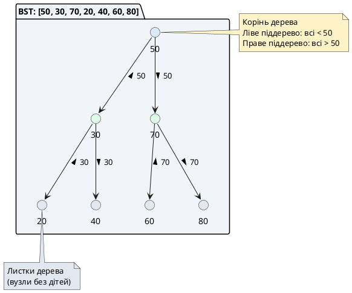
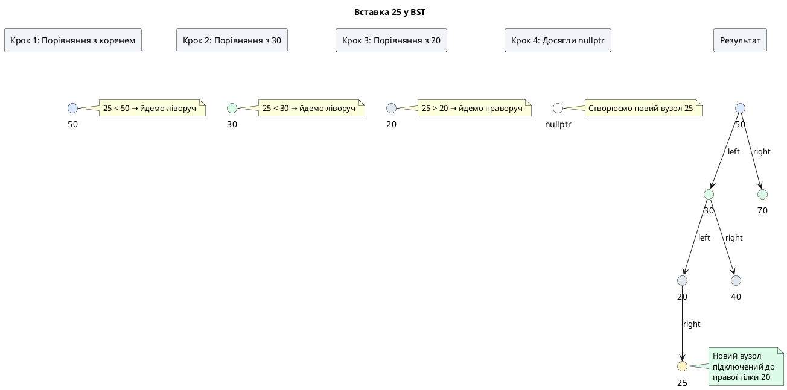
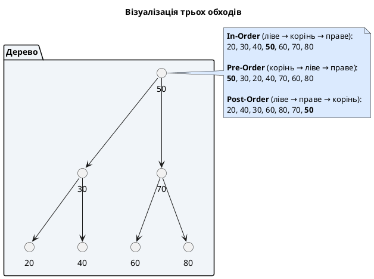

# Стаття 91 — Власні структури даних: бінарне дерево пошуку

::card-group

::card{title="🎯 Мета лекції" icon="i-lucide-target"}

- Перейти від **лінійних структур** (масиви, списки) до **ієрархічних** (дерева): вузли організовані у багаторівневу структуру з відношенням батько-діти.
- Опанувати концепцію **бінарного дерева пошуку** (*Binary Search Tree, BST*): кожен вузол має не більше двох дітей, ліве піддерево містить менші значення, праве — більші.
- Реалізувати ключові операції: **вставка** (*insert*), **пошук** (*search*), **видалення** (*delete*) — всі з очікуваною складністю **O(log n)** для збалансованого дерева.
- Дослідити **обходи дерева** (*tree traversals*): in-order (впорядкований), pre-order (префіксний), post-order (постфіксний) — рекурсивні та ітеративні варіанти.
- Зрозуміти проблему **виродження** (*degeneration*): у гіршому випадку BST перетворюється на однозв'язаний список з O(n) операціями.

::

::card{title="🔑 Ключові терміни" icon="i-lucide-key"}

- **Tree (Дерево):** нелінійна ієрархічна структура з кореневим вузлом (*root*) та нащадками (*children*), без циклів.
- **Binary Search Tree (BST):** бінарне дерево з властивістю впорядкування: для кожного вузла всі значення лівого піддерева менші за значення вузла, всі значення правого піддерева більші.
- **Height (Висота дерева):** найбільша відстань від кореня до листа; збалансоване дерево має висоту O(log n).
- **Traversal (Обхід):** процес відвідування всіх вузлів дерева у певному порядку (in-order, pre-order, post-order).
- **Degenerate Tree (Вироджене дерево):** дерево, що вироджується у лінійний ланцюжок (кожен вузол має лише одну дитину) — складність операцій деградує до O(n).

::

::

---

## Hook: коли лінійність стає вузьким місцем

Уявіть словник з 1 мільйоном слів, збережений у **відсортованому масиві**. Щоб знайти слово "algorithm", ви використовуєте **бінарний пошук** (*binary search*):

1. Перевірити середній елемент масиву (500 000-й).
2. Якщо "algorithm" менше за нього — шукати в лівій половині (елементи 0–499 999).
3. Інакше — у правій половині (елементи 500 001–999 999).
4. Повторити для половини, що залишилася.

**Складність:** O(log n) — для 1 мільйона елементів достатньо **~20 порівнянь** (log₂(1 000 000) ≈ 20). Це фантастично швидко порівняно з лінійним пошуком (O(n) — до 1 мільйона порівнянь у гіршому випадку).

**Проблема:** Тепер уявімо, що користувач хоче **додати нове слово** "abstraction" на позицію 5000 (за алфавітом). У масиві це катастрофа:

1. Знайти позицію вставки — O(log n) через бінарний пошук.
2. **Зсунути 995 000 елементів** на одну позицію праворуч — O(n).
3. Вставити елемент.

Загальна складність: **O(n)** через зсув. Для динамічного словника з частими вставками це неприйнятно.

::note
У попередній лекції (стаття 90) ми бачили, що **однозв'язаний список** дозволяє вставку на початок за O(1), але пошук — O(n). Бінарний пошук у списку неможливий (немає довільного доступу). Чи існує структура, що поєднує **швидкий пошук** (O(log n)) і **швидку вставку** (O(log n))?
::

Відповідь — **бінарне дерево пошуку** (*Binary Search Tree, BST*). Це ієрархічна структура, де:

- **Кожен вузол** має не більше двох дітей: ліву (*left*) та праву (*right*).
- **Властивість впорядкування BST:** для будь-якого вузла всі значення у лівому піддереві **менші** за значення цього вузла, всі значення у правому піддереві — **більші**.

Ця властивість дозволяє виконувати **бінарний пошук безпосередньо у структурі дерева**: на кожному кроці ми вибираємо ліву або праву гілку, відкидаючи половину можливостей. Вставка та видалення також виконуються за O(log n) у **збалансованому** дереві, оскільки ми рухаємося вниз по одній гілці, не зсуваючи інші елементи.

::plant-uml{alt="Приклад бінарного дерева пошуку"}



::

У цій лекції ми спроєктуємо та реалізуємо повнофункціональне бінарне дерево пошуку з нуля, дослідимо його переваги та обмеження, та підготуємо грунт для вивчення збалансованих дерев (AVL, Red-Black) та стандартних контейнерів STL (`std::set`, `std::map`).

---

## Фундаментальні концепції дерев

### Термінологія ієрархічних структур

**Дерево** (*tree*) у комп'ютерних науках — це **нелінійна структура даних**, що моделює ієрархічні відношення. На відміну від масивів та списків (лінійні: A → B → C), дерево має **розгалужену структуру** (A → B, C; B → D, E).

**Основні терміни:**

| Термін | Визначення | Приклад |
|:-------|:-----------|:--------|
| **Root (Корінь)** | Верхній вузол дерева, єдиний вузол без батька | `50` на діаграмі вище |
| **Node (Вузол)** | Базовий елемент дерева, містить дані та покажчики на дітей | Кожен круг на діаграмі |
| **Child (Дитина)** | Вузол, що безпосередньо походить від іншого вузла | `30` і `70` — діти вузла `50` |
| **Parent (Батько)** | Вузол, що має нащадків | `50` — батько `30` і `70` |
| **Leaf (Лист)** | Вузол без дітей (кінцевий вузол) | `20`, `40`, `60`, `80` |
| **Subtree (Піддерево)** | Дерево, що складається з вузла та всіх його нащадків | Ліве піддерево `50` — це `[30, 20, 40]` |
| **Height (Висота)** | Найбільша відстань від кореня до листа (кількість ребер) | Висота дерева вище — 2 |
| **Depth (Глибина вузла)** | Відстань від кореня до вузла | Глибина `20` — 2 |
| **Level (Рівень)** | Множина вузлів на однаковій глибині | Рівень 1: `[30, 70]` |

::tip{title="Дерево як рекурсивна структура"}
Ключова властивість дерев: **кожне піддерево само є деревом**. Ліве піддерево вузла `50` — це окреме дерево з коренем `30`. Це робить **рекурсію** природною парадигмою для роботи з деревами: операція на дереві зводиться до операції на кореневому вузлі та рекурсивних викликів на лівому та правому піддеревах.
::

### Бінарне дерево vs бінарне дерево пошуку

**Бінарне дерево** (*binary tree*) — це дерево, де **кожен вузол має не більше двох дітей**: ліву (*left*) та праву (*right*). Це структурне обмеження, без додаткових вимог до значень.

**Бінарне дерево пошуку** (*Binary Search Tree, BST*) — це бінарне дерево з додатковою **властивістю впорядкування**:

> **BST-інваріант:** Для будь-якого вузла `N` з значенням `value`:
> - Всі значення у лівому піддереві `N` **< value**.
> - Всі значення у правому піддереві `N` **> value**.
> - Обидва піддерева також є BST (рекурсивна властивість).

**Приклад валідного BST:**

```
       50
      /  \
    30    70
   / \   / \
  20 40 60 80
```

- Ліве піддерево `50`: [30, 20, 40] — всі < 50 ✅
- Праве піддерево `50`: [70, 60, 80] — всі > 50 ✅
- Рекурсивно: піддерево `30` — [20] < 30 < [40] ✅

**Приклад невалідного BST:**

```
       50
      /  \
    30    70
   / \
  20 60  ❌ 60 має бути у правому піддереві 50, а не в лівому!
```

Хоча `60 > 30`, властивість порушена на рівні кореня: `60` знаходиться у лівому піддереві `50`, але `60 > 50`.

::warning{title="Глобальна властивість, а не локальна"}
BST-інваріант — це **глобальна** умова: потрібно порівнювати не лише з безпосереднім батьком, а з **усіма предками**. Вузол `60` має бути меншим за всіх предків справа від нього у шляху до кореня. Саме це робить BST складним для підтримки при вставці та видаленні.
::

### Чому O(log n)? Висота збалансованого дерева

**Інтуїція:** У збалансованому BST кожен рівень має **удвічі більше вузлів**, ніж попередній:

- Рівень 0 (корінь): 1 вузол
- Рівень 1: 2 вузли
- Рівень 2: 4 вузли
- Рівень 3: 8 вузлів
- Рівень h: 2ʰ вузлів

Загальна кількість вузлів: `n = 1 + 2 + 4 + ... + 2ʰ = 2^(h+1) - 1`. Звідси висота: `h = log₂(n+1) - 1 ≈ log₂(n)`.

**Складність операцій:** Пошук, вставка, видалення у BST зводяться до **руху вниз від кореня до листа** по одній гілці. Кількість кроків = висота дерева = O(log n).

**Для 1 мільйона вузлів:** log₂(1 000 000) ≈ 20 — максимум 20 порівнянь для будь-якої операції. Порівняйте з O(n) = 1 000 000 у списку.

::caution{title="Гірший випадок: вироджене дерево"}
Якщо вставляти елементи у **відсортованому порядку** (10, 20, 30, 40, 50), BST вироджується у **однозв'язаний список**:

```
10
  \
   20
     \
      30
        \
         40
           \
            50
```

Висота = n - 1, складність операцій = **O(n)**. Збалансовані дерева (AVL, Red-Black) розв'язують цю проблему через автоматичне перебалансування після кожної вставки/видалення, гарантуючи висоту O(log n). Вони будуть темою окремих лекцій або статті 93 (STL-контейнери).
::

---

## Проєктування класу BST: вузол та інтерфейс

### Структура вузла TreeNode

На відміну від однозв'язаного списку (один покажчик `next`), вузол дерева має **два** покажчики: на ліву та праву дитину.

```cpp
struct TreeNode {
    int data;           // Значення вузла
    TreeNode* left;     // Покажчик на ліве піддерево (менші значення)
    TreeNode* right;    // Покажчик на праве піддерево (більші значення)
    
    // Конструктор для зручності
    TreeNode(int value)
        : data(value), left(nullptr), right(nullptr) {}
};
```

**Інваріанти листкового вузла:** Якщо `left == nullptr && right == nullptr`, вузол є листом.

**Інваріанти внутрішнього вузла:** Має принаймні одну ненульову дитину.

### Оголошення класу BinarySearchTree

```cpp
// BinarySearchTree.h
#ifndef BINARY_SEARCH_TREE_H
#define BINARY_SEARCH_TREE_H

#include <iostream>

struct TreeNode {
    int data;
    TreeNode* left;
    TreeNode* right;
    
    TreeNode(int value) : data(value), left(nullptr), right(nullptr) {}
};

class BinarySearchTree {
private:
    TreeNode* m_root;  // Покажчик на корінь дерева
    
    // Приватні рекурсивні допоміжні методи
    TreeNode* insertRecursive(TreeNode* node, int value);
    TreeNode* deleteRecursive(TreeNode* node, int value);
    TreeNode* findMin(TreeNode* node) const;
    bool searchRecursive(TreeNode* node, int value) const;
    void inOrderRecursive(TreeNode* node) const;
    void preOrderRecursive(TreeNode* node) const;
    void postOrderRecursive(TreeNode* node) const;
    void destroyTree(TreeNode* node);
    int heightRecursive(TreeNode* node) const;

public:
    // Конструктор: створює порожнє дерево
    BinarySearchTree();
    
    // Деструктор: видаляє всі вузли (RAII)
    ~BinarySearchTree();
    
    // Заборона копіювання (для простоти)
    BinarySearchTree(const BinarySearchTree&) = delete;
    BinarySearchTree& operator=(const BinarySearchTree&) = delete;
    
    // Вставити значення в дерево
    void insert(int value);
    
    // Видалити значення з дерева
    void remove(int value);
    
    // Пошук значення в дереві
    bool search(int value) const;
    
    // Перевірити, чи дерево порожнє
    bool isEmpty() const;
    
    // Отримати висоту дерева
    int height() const;
    
    // Обходи дерева
    void inOrder() const;    // Впорядкований: ліве → корінь → праве
    void preOrder() const;   // Префіксний: корінь → ліве → праве
    void postOrder() const;  // Постфіксний: ліве → праве → корінь
};

#endif
```

**Ключова особливість:** Більшість операцій реалізовані як **рекурсивні** приватні методи, що приймають вказівник на вузол. Публічні методи делегують роботу цим допоміжним функціям, передаючи `m_root`.

::note{title="Чому приватні рекурсивні помічники?"}
Публічний інтерфейс приховує деталі реалізації (користувач не має доступу до `TreeNode*`). Приватні методи дозволяють працювати безпосередньо з покажчиками для рекурсії. Це патерн **обгортки** (*wrapper*): публічний метод `insert(value)` викликає приватний `insertRecursive(m_root, value)`.
::

### Реалізація конструктора та деструктора

```cpp
// BinarySearchTree.cpp
#include "BinarySearchTree.h"

// Конструктор: ініціалізує порожнє дерево
BinarySearchTree::BinarySearchTree()
    : m_root(nullptr)
{
}

// Деструктор: видаляє всі вузли (post-order обхід)
BinarySearchTree::~BinarySearchTree() {
    destroyTree(m_root);
}

// Рекурсивне видалення всього дерева
void BinarySearchTree::destroyTree(TreeNode* node) {
    if (node == nullptr) {
        return;  // Базовий випадок: порожнє дерево
    }
    
    // Рекурсивно видаляємо ліве та праве піддерева
    destroyTree(node->left);
    destroyTree(node->right);
    
    // Тепер можна видалити поточний вузол
    delete node;
}
```

**Порядок видалення (post-order):** Спершу видаляємо дітей, потім батька. Якщо видалити батька раніше, втратимо доступ до дітей (покажчики `left` та `right` зникнуть). Це відрізняється від однозв'язаного списку, де достатньо було ітеративного циклу.


---

## Операція вставки: рекурсивна логіка

Вставка у BST — це **рекурсивний спуск** від кореня до місця, де новий вузол має стати листом.

**Алгоритм:**

1. Якщо дерево порожнє (`node == nullptr`), створити новий вузол — він стає коренем (або листом).
2. Інакше порівняти `value` з `node->data`:
   - Якщо `value < node->data` — вставити у ліве піддерево (рекурсивно).
   - Якщо `value > node->data` — вставити у праве піддерево (рекурсивно).
   - Якщо `value == node->data` — дублікати зазвичай **не вставляються** (або обробляються залежно від вимог).
3. Повернути вказівник на (можливо оновлений) вузол.

```cpp
// Публічний метод (обгортка)
void BinarySearchTree::insert(int value) {
    m_root = insertRecursive(m_root, value);
}

// Приватний рекурсивний метод
TreeNode* BinarySearchTree::insertRecursive(TreeNode* node, int value) {
    // Базовий випадок: дійшли до nullptr — створюємо новий вузол
    if (node == nullptr) {
        return new TreeNode(value);
    }
    
    // Рекурсивний випадок: вибираємо напрямок
    if (value < node->data) {
        // Значення менше — йдемо ліворуч
        node->left = insertRecursive(node->left, value);
    } else if (value > node->data) {
        // Значення більше — йдемо праворуч
        node->right = insertRecursive(node->right, value);
    } else {
        // value == node->data — дублікат, не вставляємо
        std::cerr << "Значення " << value << " вже існує в дереві\n";
    }
    
    // Повертаємо вказівник на поточний вузол (незмінний для рекурсивного виклику)
    return node;
}
```

**Чому повертаємо `TreeNode*`?** Це дозволяє **реконструювати зв'язки** під час розгортання рекурсії. Коли ми досягаємо базового випадку (`nullptr`), створюємо новий вузол та повертаємо його адресу. Батьківський рекурсивний виклик отримує цю адресу та присвоює її `left` або `right`, тим самим **підключаючи** новий вузол до дерева.

::plant-uml{alt="Вставка 25 у дерево [50, 30, 70, 20, 40]"}



::

**Складність:** O(h), де h — висота дерева. Для збалансованого дерева h = O(log n), отже вставка — O(log n). Для виродженого дерева h = O(n), вставка — O(n).

---

## Операція пошуку: рекурсивний та ітеративний варіанти

Пошук у BST — це **бінарний пошук** безпосередньо у структурі дерева.

### Рекурсивна версія

```cpp
// Публічний метод
bool BinarySearchTree::search(int value) const {
    return searchRecursive(m_root, value);
}

// Приватний рекурсивний метод
bool BinarySearchTree::searchRecursive(TreeNode* node, int value) const {
    // Базовий випадок 1: дійшли до nullptr — значення не знайдено
    if (node == nullptr) {
        return false;
    }
    
    // Базовий випадок 2: знайшли значення
    if (value == node->data) {
        return true;
    }
    
    // Рекурсивний випадок: вибираємо напрямок
    if (value < node->data) {
        return searchRecursive(node->left, value);   // Шукаємо ліворуч
    } else {
        return searchRecursive(node->right, value);  // Шукаємо праворуч
    }
}
```

### Ітеративна версія (ефективніша за пам'яттю)

Рекурсія використовує стек викликів — для глибоких дерев це може призвести до переповнення стека. Ітеративна версія використовує лише O(1) пам'яті.

```cpp
bool BinarySearchTree::search(int value) const {
    TreeNode* current = m_root;
    
    while (current != nullptr) {
        if (value == current->data) {
            return true;  // Знайдено
        } else if (value < current->data) {
            current = current->left;   // Йдемо ліворуч
        } else {
            current = current->right;  // Йдемо праворуч
        }
    }
    
    return false;  // Дійшли до nullptr — не знайдено
}
```

**Складність:** O(h) = O(log n) для збалансованого дерева. На кожному кроці ми відкидаємо половину дерева (або ліве піддерево, або праве).

::tip{title="Коли використовувати рекурсію vs ітерацію?"}
- **Рекурсія:** Природна для дерев, код чистіший та коротший. Підходить для вставки, видалення, обходів.
- **Ітерація:** Ефективніша за пам'яттю для пошуку (найпростіша операція). Для складних операцій (видалення, балансування) рекурсія зазвичай зручніша.
::

---

## Операція видалення: найскладніший випадок

Видалення з BST — найскладніша операція, оскільки потрібно **зберегти BST-інваріант** після видалення вузла. Існує **три випадки**:

### Випадок 1: Вузол-лист (без дітей)

Просто видаляємо вузол — батьківський покажчик стає `nullptr`.

```
Видалити 20:
       50
      /  \
    30    70
   /  \
  20  40   →  Просто delete 20, встановити left = nullptr
```

### Випадок 2: Вузол з однією дитиною

Замінюємо вузол його єдиною дитиною — «перемикаємо» покажчик батька на дитину видаляємого вузла.

```
Видалити 30 (має лише праву дитину 40):
       50                    50
      /  \                  /  \
    30    70    →         40    70
      \
      40
```

### Випадок 3: Вузол з двома дітьми (найскладніший)

Не можна просто видалити вузол — втратимо обидва піддерева. **Алгоритм:**

1. Знайти **in-order наступника** (*inorder successor*) — найменший вузол у правому піддереві (найлівіший вузол правої гілки).
2. Скопіювати значення наступника у видаляємий вузол.
3. Рекурсивно видалити наступника (який тепер стає дублікатом).

**Чому це працює?** In-order наступник — це найменше значення, що більше за видаляємий вузол. Він гарантовано **більший за все ліве піддерево** та **менший за решту правого піддерева**, тому зберігає BST-інваріант.

```
Видалити 50 (має двох дітей):
       50                    60  ← Копіюємо 60 сюди
      /  \                  /  \
    30    70    →         30    70
         / \                     \
        60  80                   80
        
Потім рекурсивно видаляємо 60 з правого піддерева (випадок 2 або 1)
```

### Реалізація видалення

```cpp
// Публічний метод
void BinarySearchTree::remove(int value) {
    m_root = deleteRecursive(m_root, value);
}

// Приватний рекурсивний метод
TreeNode* BinarySearchTree::deleteRecursive(TreeNode* node, int value) {
    // Базовий випадок: дійшли до nullptr — значення не знайдено
    if (node == nullptr) {
        return nullptr;
    }
    
    // Рекурсивний пошук вузла для видалення
    if (value < node->data) {
        node->left = deleteRecursive(node->left, value);
    } else if (value > node->data) {
        node->right = deleteRecursive(node->right, value);
    } else {
        // Знайшли вузол для видалення
        
        // Випадок 1: Вузол-лист (без дітей)
        if (node->left == nullptr && node->right == nullptr) {
            delete node;
            return nullptr;
        }
        
        // Випадок 2a: Вузол має лише праву дитину
        if (node->left == nullptr) {
            TreeNode* temp = node->right;
            delete node;
            return temp;
        }
        
        // Випадок 2b: Вузол має лише ліву дитину
        if (node->right == nullptr) {
            TreeNode* temp = node->left;
            delete node;
            return temp;
        }
        
        // Випадок 3: Вузол має двох дітей
        // Знаходимо in-order наступника (мінімум у правому піддереві)
        TreeNode* successor = findMin(node->right);
        
        // Копіюємо значення наступника у поточний вузол
        node->data = successor->data;
        
        // Рекурсивно видаляємо наступника з правого піддерева
        node->right = deleteRecursive(node->right, successor->data);
    }
    
    return node;
}

// Допоміжний метод: знайти мінімальний вузол у піддереві
TreeNode* BinarySearchTree::findMin(TreeNode* node) const {
    while (node->left != nullptr) {
        node = node->left;  // Йдемо максимально ліворуч
    }
    return node;
}
```

::note{title="Альтернатива: in-order попередник"}
Замість наступника можна використати **in-order попередника** (*inorder predecessor*) — найбільший вузол у лівому піддереві (найправіший вузол лівої гілки). Це теж зберігає BST-інваріант. Вибір між наступником та попередником довільний, деякі реалізації чергують їх для кращого балансування.
::

**Складність:** O(h) = O(log n) для збалансованого дерева. У випадку 3 потрібно знайти мінімум (O(h)) та виконати рекурсивне видалення (ще O(h)), але це все ще O(h).

---

## Обходи дерева: in-order, pre-order, post-order

**Обхід дерева** (*tree traversal*) — це процес відвідування всіх вузлів дерева у певному порядку. Існує три основні стратегії для бінарних дерев:

### 1. In-Order (впорядкований обхід): ліве → корінь → праве

**Властивість:** Для BST in-order обхід **виводить елементи у відсортованому порядку** (зростання).

```cpp
void BinarySearchTree::inOrder() const {
    inOrderRecursive(m_root);
    std::cout << '\n';
}

void BinarySearchTree::inOrderRecursive(TreeNode* node) const {
    if (node == nullptr) {
        return;  // Базовий випадок
    }
    
    inOrderRecursive(node->left);        // 1. Обійти ліве піддерево
    std::cout << node->data << " ";      // 2. Відвідати корінь
    inOrderRecursive(node->right);       // 3. Обійти праве піддерево
}
```

**Для дерева `[50, 30, 70, 20, 40, 60, 80]`:**

```
In-Order: 20 30 40 50 60 70 80  ← Відсортовано!
```

### 2. Pre-Order (префіксний обхід): корінь → ліве → праве

**Використання:** Копіювання дерева, серіалізація структури.

```cpp
void BinarySearchTree::preOrder() const {
    preOrderRecursive(m_root);
    std::cout << '\n';
}

void BinarySearchTree::preOrderRecursive(TreeNode* node) const {
    if (node == nullptr) {
        return;
    }
    
    std::cout << node->data << " ";      // 1. Відвідати корінь
    preOrderRecursive(node->left);       // 2. Обійти ліве піддерево
    preOrderRecursive(node->right);      // 3. Обійти праве піддерево
}
```

**Для того ж дерева:**

```
Pre-Order: 50 30 20 40 70 60 80
```

### 3. Post-Order (постфіксний обхід): ліве → праве → корінь

**Використання:** Видалення дерева (як у деструкторі), обчислення виразів у синтаксичних деревах.

```cpp
void BinarySearchTree::postOrder() const {
    postOrderRecursive(m_root);
    std::cout << '\n';
}

void BinarySearchTree::postOrderRecursive(TreeNode* node) const {
    if (node == nullptr) {
        return;
    }
    
    postOrderRecursive(node->left);       // 1. Обійти ліве піддерево
    postOrderRecursive(node->right);      // 2. Обійти праве піддерево
    std::cout << node->data << " ";       // 3. Відвідати корінь
}
```

**Для того ж дерева:**

```
Post-Order: 20 40 30 60 80 70 50
```

::plant-uml{alt="Порядок обходів дерева"}



::

**Складність:** Всі обходи — O(n), оскільки відвідуємо кожен вузол рівно один раз.


---

## Обчислення висоти дерева

**Висота дерева** (*height*) — найбільша відстань від кореня до листа. Порожнє дерево має висоту -1, дерево з одним вузлом — висоту 0.

```cpp
// Публічний метод
int BinarySearchTree::height() const {
    return heightRecursive(m_root);
}

// Приватний рекурсивний метод
int BinarySearchTree::heightRecursive(TreeNode* node) const {
    // Базовий випадок: порожнє дерево
    if (node == nullptr) {
        return -1;
    }
    
    // Рекурсивно обчислюємо висоту лівого та правого піддерев
    int leftHeight = heightRecursive(node->left);
    int rightHeight = heightRecursive(node->right);
    
    // Висота поточного вузла = максимум висот дітей + 1
    return std::max(leftHeight, rightHeight) + 1;
}
```

**Для дерева `[50, 30, 70, 20, 40, 60, 80]`:** Висота = 2 (рівні: 0, 1, 2).

**Складність:** O(n) — потрібно відвідати всі вузли для обчислення максимальної глибини.

---

## Практичне використання: приклад програми

```cpp
#include "BinarySearchTree.h"
#include <iostream>

int main() {
    BinarySearchTree bst;
    
    std::cout << "=== Демонстрація бінарного дерева пошуку ===\n\n";
    
    // Вставка елементів
    std::cout << "Вставка елементів: 50, 30, 70, 20, 40, 60, 80\n";
    bst.insert(50);
    bst.insert(30);
    bst.insert(70);
    bst.insert(20);
    bst.insert(40);
    bst.insert(60);
    bst.insert(80);
    
    // Обходи дерева
    std::cout << "\nОбходи дерева:\n";
    std::cout << "In-Order (відсортовано):   ";
    bst.inOrder();   // 20 30 40 50 60 70 80
    
    std::cout << "Pre-Order (корінь спершу): ";
    bst.preOrder();  // 50 30 20 40 70 60 80
    
    std::cout << "Post-Order (корінь останнім): ";
    bst.postOrder(); // 20 40 30 60 80 70 50
    
    // Висота дерева
    std::cout << "\nВисота дерева: " << bst.height() << '\n';
    
    // Пошук елементів
    std::cout << "\nПошук елемента 40: " 
              << (bst.search(40) ? "знайдено ✓" : "не знайдено ✗") << '\n';
    std::cout << "Пошук елемента 99: " 
              << (bst.search(99) ? "знайдено ✓" : "не знайдено ✗") << '\n';
    
    // Видалення елементів
    std::cout << "\nВидалення елемента 20 (лист)\n";
    bst.remove(20);
    std::cout << "In-Order після видалення: ";
    bst.inOrder();   // 30 40 50 60 70 80
    
    std::cout << "\nВидалення елемента 30 (одна дитина)\n";
    bst.remove(30);
    std::cout << "In-Order після видалення: ";
    bst.inOrder();   // 40 50 60 70 80
    
    std::cout << "\nВидалення елемента 50 (дві дитини, корінь)\n";
    bst.remove(50);
    std::cout << "In-Order після видалення: ";
    bst.inOrder();   // 40 60 70 80
    
    return 0;
}
```

::terminal-preview{title="g++ -std=c++17 main.cpp BinarySearchTree.cpp -o bst && ./bst"}
<div class="line"><span class="opacity-40">$</span> <strong class="font-bold">./bst</strong></div>
<div class="line"><span class="text-blue-400 font-bold">=== Демонстрація бінарного дерева пошуку ===</span></div>
<div class="line"></div>
<div class="line">Вставка елементів: 50, 30, 70, 20, 40, 60, 80</div>
<div class="line"></div>
<div class="line">Обходи дерева:</div>
<div class="line">In-Order (відсортовано):   <span class="text-green-400">20 30 40 50 60 70 80</span></div>
<div class="line">Pre-Order (корінь спершу): <span class="text-blue-400">50 30 20 40 70 60 80</span></div>
<div class="line">Post-Order (корінь останнім): <span class="text-yellow-400">20 40 30 60 80 70 50</span></div>
<div class="line"></div>
<div class="line">Висота дерева: <span class="text-blue-400 font-bold">2</span></div>
<div class="line"></div>
<div class="line">Пошук елемента 40: <span class="text-green-400 font-bold">знайдено ✓</span></div>
<div class="line">Пошук елемента 99: <span class="text-rose-400 font-bold">не знайдено ✗</span></div>
<div class="line"></div>
<div class="line">Видалення елемента 20 (лист)</div>
<div class="line">In-Order після видалення: <span class="text-green-400">30 40 50 60 70 80</span></div>
<div class="line"></div>
<div class="line">Видалення елемента 30 (одна дитина)</div>
<div class="line">In-Order після видалення: <span class="text-green-400">40 50 60 70 80</span></div>
<div class="line"></div>
<div class="line">Видалення елемента 50 (дві дитини, корінь)</div>
<div class="line">In-Order після видалення: <span class="text-green-400">40 60 70 80</span></div>
::

---

## Проблема виродження та шляхи балансування

### Сценарій виродження: відсортоване вставлення

Якщо вставляти елементи у **відсортованому порядку** (10, 20, 30, 40, 50), BST вироджується у **лінійний ланцюжок**:

```cpp
BinarySearchTree bst;
bst.insert(10);
bst.insert(20);
bst.insert(30);
bst.insert(40);
bst.insert(50);
```

**Результуюча структура:**

```
10
  \
   20
     \
      30
        \
         40
           \
            50
```

**Наслідки:** Висота дерева = n - 1 = 4. Пошук елемента 50 потребує 5 кроків (O(n)), замість очікуваних ~log₂(5) ≈ 2 кроків.

::warning{title="Гірший випадок BST дорівнює однозв'язаному списку"}
У виродженому дереві:

- **Пошук:** O(n) замість O(log n)
- **Вставка:** O(n) замість O(log n)
- **Видалення:** O(n) замість O(log n)

Всі переваги дерева зникають. Це критична вада базового BST.
::

### Рішення: самобалансувальні дерева

Промислові реалізації (`std::set`, `std::map`) використовують **самобалансувальні дерева**, що гарантують висоту O(log n) через автоматичне перебалансування після кожної вставки/видалення.

**Основні типи:**

1. **AVL-дерево:** Жорстко збалансоване — різниця висот лівого та правого піддерев не перевищує 1. Після кожної операції виконуються **ротації** (*rotations*) для відновлення балансу.

2. **Red-Black дерево:** М'якше збалансоване — гарантує висоту ≤ 2·log₂(n). Кожен вузол має колір (червоний/чорний), балансування через зміну кольорів та ротації. Використовується у `std::map`, `std::set`.

3. **B-дерево:** Узагальнення бінарного дерева — кожен вузол може мати багато дітей (не лише 2). Використовується у базах даних та файлових системах.

::tip{title="Чому не реалізовувати балансування у цій лекції?"}
AVL та Red-Black дерева — складні алгоритми, що потребують окремої лекції. Базове BST демонструє фундаментальні концепції дерев та рекурсії. Розуміння BST — передумова для вивчення збалансованих варіантів.

У промисловому коді **завжди використовуйте `std::set` / `std::map`** (стаття 93), які реалізують Red-Black дерева. Власне BST корисне лише для освітніх цілей або дуже специфічних сценаріїв з гарантовано випадковим порядком вставки.
::

---

## Порівняння BST з іншими структурами

::card-group

::card{title="Масив (Array)" icon="i-lucide-grid-3x3"}

**Переваги:**

- Довільний доступ O(1)
- Локальність кешу

**Недоліки:**

- Вставка/видалення O(n)
- Фіксована/реалокована ємність

::

::card{title="Однозв'язаний список (Linked List)" icon="i-lucide-arrow-right-circle"}

**Переваги:**

- Вставка на початок O(1)
- Динамічний розмір

**Недоліки:**

- Пошук O(n)
- Немає довільного доступу

::

::card{title="Бінарне дерево пошуку (BST)" icon="i-lucide-git-branch"}

**Переваги:**

- Пошук **O(log n)** (збалансоване)
- Вставка **O(log n)** (збалансоване)
- Видалення **O(log n)** (збалансоване)
- In-order обхід дає відсортовану послідовність

**Недоліки:**

- Немає довільного доступу
- Може вироджуватися до O(n) (без балансування)
- Більший overhead пам'яті (два покажчики на вузол)
- Складніше у реалізації

::

::

**Висновок:** BST оптимальне для **динамічних множин**, де переважають операції **пошуку, вставки, видалення** над довільним доступом. Для статичних відсортованих даних краще масив + бінарний пошук. Для частих вставок на початок — список.

---

## Резюме: від лінійності до ієрархії

У цій лекції ми зробили фундаментальний стрибок від **лінійних структур** (масиви, списки, стеки, черги) до **ієрархічних** (дерева). Бінарне дерево пошуку демонструє потужність рекурсії та логарифмічну ефективність для упорядкованих даних.

**Ключові концепції:**

- **BST-інваріант:** Ліве піддерево < корінь < праве піддерево (рекурсивно).
- **Рекурсивна природа дерев:** Більшість операцій природно виражаються через рекурсію.
- **Обходи:** In-order (відсортовано), pre-order (корінь спершу), post-order (корінь останнім).
- **Логарифмічна складність:** O(log n) для збалансованих дерев, O(n) для вироджених.
- **Видалення з двома дітьми:** Найскладніший випадок — заміна на in-order наступника.

::card-group

::card{title="🎓 Що ми опанували" icon="i-lucide-graduation-cap"}

- Спроєктували ієрархічну структуру даних з рекурсивними операціями.
- Реалізували BST з вставкою, пошуком, видаленням за O(log n).
- Вивчили три типи обходів дерева та їхнє застосування.
- Зрозуміли проблему виродження та необхідність балансування.
- Порівняли компроміси між масивами, списками та деревами.

::

::card{title="🚀 Наступні кроки" icon="i-lucide-rocket"}

**Стаття 92 — Хеш-таблиця:**
Вивчимо структуру даних з **O(1) пошуком** у середньому — хеш-функції, колізії, метод ланцюжків.

**Стаття 93 — Контейнери STL (std::vector, std::list, std::set, std::map):**
Професійні реалізації всіх вивчених структур у стандартній бібліотеці C++.

**Стаття 94 — Ітератори STL:**
Універсальний механізм обходу контейнерів, алгоритми `<algorithm>`.

::

::

---

## Практичні завдання

::::accordion

:::accordion-item{label="📋 Завдання 1: Валідація BST" icon="i-lucide-clipboard-list"}

**Завдання:** Напишіть метод `bool isValidBST()`, який перевіряє, чи дійсно дерево задовольняє BST-інваріант (не лише локально, а глобально).

**Підказка:** Використовуйте рекурсивний допоміжний метод з параметрами `min` та `max` — кожен вузол має знаходитися у діапазоні `(min, max)`.

**Приклад невалідного дерева:**

```
    50
   /  \
  30   70
 /
60  ← Помилка: 60 > 50, але знаходиться в лівому піддереві
```

:::

:::accordion-item{label="✅ Розв'язок завдання 1" icon="i-lucide-check-circle"}

```cpp
class BinarySearchTree {
private:
    bool isValidBSTRecursive(TreeNode* node, int min, int max) const {
        // Базовий випадок: порожнє дерево валідне
        if (node == nullptr) {
            return true;
        }
        
        // Перевірка поточного вузла: має бути у діапазоні (min, max)
        if (node->data <= min || node->data >= max) {
            return false;
        }
        
        // Рекурсивна перевірка піддерев з оновленими межами
        return isValidBSTRecursive(node->left, min, node->data) &&
               isValidBSTRecursive(node->right, node->data, max);
    }

public:
    bool isValidBST() const {
        // Початкові межі: (-∞, +∞)
        return isValidBSTRecursive(m_root, INT_MIN, INT_MAX);
    }
};
```

**Тестування:**

```cpp
int main() {
    BinarySearchTree bst;
    bst.insert(50);
    bst.insert(30);
    bst.insert(70);
    bst.insert(20);
    bst.insert(40);
    
    std::cout << "Дерево валідне: " << std::boolalpha << bst.isValidBST() << '\n';
    // Виведе: true
    
    return 0;
}
```

:::

:::accordion-item{label="📋 Завдання 2: Знаходження k-го найменшого елемента" icon="i-lucide-clipboard-list"}

**Завдання:** Напишіть метод `int kthSmallest(int k)`, який повертає k-й найменший елемент у BST (1-indexed: k=1 — найменший).

**Підказка:** In-order обхід дає елементи у відсортованому порядку. Використовуйте лічильник та зупиняйтесь на k-му елементі.

**Приклад:** Для дерева `[50, 30, 70, 20, 40, 60, 80]`:

- `kthSmallest(1)` → 20
- `kthSmallest(4)` → 50
- `kthSmallest(7)` → 80

:::

:::accordion-item{label="✅ Розв'язок завдання 2" icon="i-lucide-check-circle"}

```cpp
class BinarySearchTree {
private:
    void kthSmallestRecursive(TreeNode* node, int k, int& count, int& result) const {
        if (node == nullptr || count >= k) {
            return;  // Базовий випадок або вже знайшли
        }
        
        // In-order обхід: ліве → корінь → праве
        kthSmallestRecursive(node->left, k, count, result);
        
        // Відвідуємо поточний вузол
        ++count;
        if (count == k) {
            result = node->data;
            return;  // Знайшли k-й елемент
        }
        
        kthSmallestRecursive(node->right, k, count, result);
    }

public:
    int kthSmallest(int k) const {
        int count = 0;
        int result = -1;
        kthSmallestRecursive(m_root, k, count, result);
        
        if (count < k) {
            throw std::out_of_range("k перевищує кількість елементів у дереві");
        }
        
        return result;
    }
};
```

**Тестування:**

```cpp
int main() {
    BinarySearchTree bst;
    bst.insert(50);
    bst.insert(30);
    bst.insert(70);
    bst.insert(20);
    bst.insert(40);
    bst.insert(60);
    bst.insert(80);
    
    std::cout << "1-й найменший: " << bst.kthSmallest(1) << '\n';  // 20
    std::cout << "4-й найменший: " << bst.kthSmallest(4) << '\n';  // 50
    std::cout << "7-й найменший: " << bst.kthSmallest(7) << '\n';  // 80
    
    return 0;
}
```

::terminal-preview{title="./kth_smallest"}
<div class="line">1-й найменший: <span class="text-green-400">20</span></div>
<div class="line">4-й найменший: <span class="text-green-400">50</span></div>
<div class="line">7-й найменший: <span class="text-green-400">80</span></div>
::

:::

:::accordion-item{label="📋 Завдання 3: Пошук діапазону значень" icon="i-lucide-clipboard-list"}

**Завдання:** Напишіть метод `void printRange(int min, int max)`, який виводить усі елементи BST у діапазоні `[min, max]` (включно).

**Підказка:** Модифікуйте in-order обхід — пропускайте ліве піддерево, якщо `node->data < min`, та праве, якщо `node->data > max`.

**Приклад:** Для дерева `[50, 30, 70, 20, 40, 60, 80]` та діапазону `[35, 65]`:

```
Виведе: 40 50 60
```

:::

:::accordion-item{label="✅ Розв'язок завдання 3" icon="i-lucide-check-circle"}

```cpp
class BinarySearchTree {
private:
    void printRangeRecursive(TreeNode* node, int min, int max) const {
        if (node == nullptr) {
            return;
        }
        
        // Якщо поточне значення > min — може бути щось корисне ліворуч
        if (node->data > min) {
            printRangeRecursive(node->left, min, max);
        }
        
        // Якщо поточне значення в діапазоні — виводимо
        if (node->data >= min && node->data <= max) {
            std::cout << node->data << " ";
        }
        
        // Якщо поточне значення < max — може бути щось корисне праворуч
        if (node->data < max) {
            printRangeRecursive(node->right, min, max);
        }
    }

public:
    void printRange(int min, int max) const {
        std::cout << "Елементи у діапазоні [" << min << ", " << max << "]: ";
        printRangeRecursive(m_root, min, max);
        std::cout << '\n';
    }
};
```

**Тестування:**

```cpp
int main() {
    BinarySearchTree bst;
    bst.insert(50);
    bst.insert(30);
    bst.insert(70);
    bst.insert(20);
    bst.insert(40);
    bst.insert(60);
    bst.insert(80);
    
    bst.printRange(35, 65);  // Виведе: 40 50 60
    bst.printRange(10, 90);  // Виведе: 20 30 40 50 60 70 80
    bst.printRange(55, 75);  // Виведе: 60 70
    
    return 0;
}
```

::terminal-preview{title="./print_range"}
<div class="line">Елементи у діапазоні [35, 65]: <span class="text-green-400">40 50 60</span></div>
<div class="line">Елементи у діапазоні [10, 90]: <span class="text-green-400">20 30 40 50 60 70 80</span></div>
<div class="line">Елементи у діапазоні [55, 75]: <span class="text-green-400">60 70</span></div>
::

:::

::::

---

Ця стаття завершує серію власних структур даних перед переходом до **стандартної бібліотеки C++ (STL)**. Ми опанували лінійні (масиви, списки, стеки, черги) та ієрархічні (дерева) структури. У наступних лекціях вивчимо професійні реалізації цих концепцій у `std::vector`, `std::list`, `std::set`, `std::map` та алгоритми `<algorithm>`.
