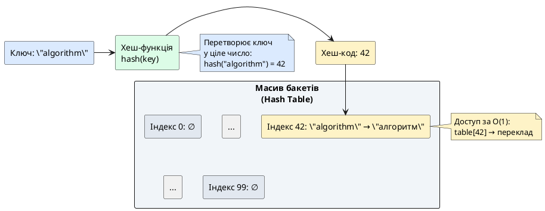
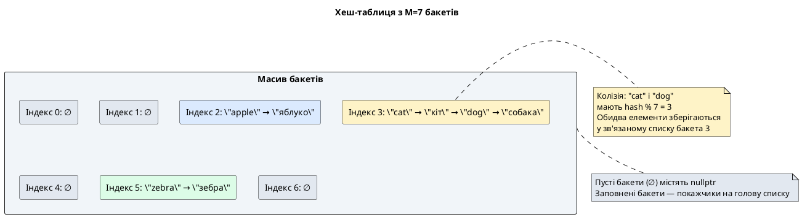
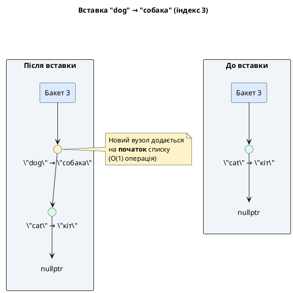
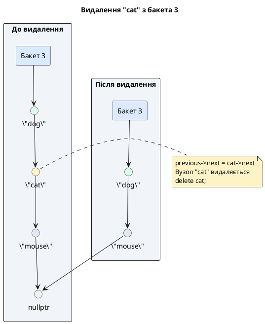

# Стаття 92 — Власні структури даних: хеш-таблиця

::card-group

::card{title="🎯 Мета лекції" icon="i-lucide-target"}

- Перейти від **лінійних** (масиви, списки) та **ієрархічних** (дерева) структур до **асоціативних**: зв'язок ключ-значення для моментального пошуку.
- Опанувати концепцію **хешування** (*hashing*): перетворення довільних ключів (рядків, об'єктів) у цілочислені індекси масиву через детерміновану функцію.
- Реалізувати **хеш-таблицю з ланцюговим розв'язанням колізій** (*hash table with chaining*): кожен бакет (*bucket*) містить зв'язаний список елементів із однаковим хешем.
- Дослідити **динамічне збільшення розміру** (*rehashing*): коли коефіцієнт завантаження (*load factor*) перевищує поріг, подвоюємо кількість бакетів та повторно хешуємо всі елементи.
- Зрозуміти, чому **середня складність** операцій вставки, пошуку та видалення — **O(1)**, навіть попри наявність колізій.

::

::card{title="🔑 Ключові терміни" icon="i-lucide-key"}

- **Hash Function (Хеш-функція):** функція, що перетворює ключ довільного типу в ціле число (індекс масиву); має бути детермінованою, швидкою та рівномірно розподіляти ключі.
- **Bucket (Бакет):** комірка хеш-таблиці, що зберігає елементи з однаковим хеш-значенням (зазвичай зв'язаний список).
- **Collision (Колізія):** ситуація, коли різні ключі отримують однаковий хеш-індекс; потребує стратегії розв'язання (chaining, open addressing).
- **Load Factor (Коефіцієнт завантаження):** відношення кількості елементів до кількості бакетів `λ = N / M`; визначає, коли потрібно збільшити таблицю.
- **Rehashing (Перехешування):** процес збільшення розміру хеш-таблиці та повторного обчислення індексів для всіх існуючих елементів.

::

::

---

## Hook: словник на мільйон слів — як знайти переклад за одну операцію?

Уявіть електронний словник англійсько-український з **1 мільйоном пар** (слово → переклад). Користувач вводить "algorithm", програма має миттєво повернути "алгоритм".

**Варіант 1: Невідсортований масив**

Зберігаємо пари у масиві `std::vector<std::pair<std::string, std::string>> dict;`. Пошук вимагає **лінійного сканування** — перебираємо всі 1 000 000 елементів, поки не знайдемо "algorithm". Складність: **O(n)** — **до 1 мільйона порівнянь** у гіршому випадку.

**Варіант 2: Відсортований масив + бінарний пошук**

Сортуємо масив за ключами, використовуємо бінарний пошук. Складність пошуку: **O(log n)** — ~20 порівнянь для 1 мільйона елементів. Це вже значно краще.

**Проблема:** Вставка нового слова вимагає **зсуву половини масиву** (середня складність O(n)). Для динамічного словника, що постійно поповнюється, це катастрофа.

**Варіант 3: Бінарне дерево пошуку (BST)**

У попередній лекції (стаття 91) ми бачили, що BST дає **O(log n)** для вставки та пошуку без зсуву елементів. Для збалансованого дерева це відмінне рішення.

**Але чи можна ще швидше?** Уявіть ідеальний світ: ви знаєте, що слово "algorithm" має бути на позиції **42** масиву. Ви одразу звертаєтесь до `dict[42]` — **одна операція, O(1)**. Жодних порівнянь, жодних переходів по дереву.

::note
Ключова ідея хеш-таблиць: **перетворити ключ (слово) у індекс масиву** за допомогою математичної функції, яка працює за O(1). Якщо функція обрана правильно, ми отримуємо **майже миттєвий доступ** до даних, незалежно від розміру таблиці.
::

Ось звідки береться термін **хешування** (*hashing*): ми "перемішуємо" (*to hash*) вхідний ключ (рядок, число, об'єкт) у компактне ціле число — **хеш-код** (*hash code*). Цей хеш-код стає індексом у масиві, який називається **хеш-таблицею** (*hash table*).

::plant-uml{alt="Концептуальна схема хеш-таблиці"}



::

**Реальність складніша:** Різні ключі можуть отримати **однаковий хеш-код** — це називається **колізією** (*collision*). Якщо `hash("algorithm") = 42` і `hash("zebra") = 42`, обидва слова претендують на індекс 42. Як зберегти обидва елементи?

Існує два класичних підходи:

1. **Метод ланцюгів** (*chaining*): кожен бакет містить **зв'язаний список** пар (ключ, значення). Якщо колізія — додаємо елемент у список.
2. **Відкрита адресація** (*open addressing*): шукаємо **наступний вільний бакет** за певним алгоритмом (лінійне пробування, квадратичне, подвійне хешування).

У цій лекції ми реалізуємо **хеш-таблицю з ланцюговим методом**, оскільки він простіший для розуміння та природно поєднується з нашими знаннями про зв'язані списки (стаття 90).

---

## Фундаментальні концепції хешування

### Хеш-функція: перетворення ключів у індекси

**Хеш-функція** (*hash function*) — це **детермінована** функція, що приймає ключ довільного типу (рядок, число, об'єкт) і повертає **невід'ємне ціле число** — хеш-код (*hash code*):

```cpp
size_t hash(const std::string& key);
```

**Властивості гарної хеш-функції:**

| Властивість | Пояснення | Наслідки порушення |
|:------------|:----------|:-------------------|
| **Детермінованість** | Один і той же ключ завжди дає однаковий хеш | Недетермінована функція робить пошук неможливим |
| **Рівномірний розподіл** | Хеші рівномірно розподілені по діапазону `[0, M)` | Нерівномірність → кластеризація → багато колізій → деградація до O(n) |
| **Швидкість обчислення** | Обчислення хешу має бути O(1) | Повільна функція знищує переваги хеш-таблиці |
| **Лавинний ефект** | Невелика зміна ключа → велика зміна хешу | Погана чутливість → передбачувані колізії для схожих ключів |

::warning{title="Криптографічна vs некриптографічна"}
У хеш-таблицях **не потрібні** криптографічні функції (SHA-256, MD5), які дорогі в обчисленні. Нам достатньо **швидких некриптографічних** функцій з хорошим розподілом: FNV-1a, MurmurHash, xxHash. Для навчальних цілей ми реалізуємо спрощену версію.
::


### Проста хеш-функція для рядків

Розглянемо базову хеш-функцію для рядків — **поліноміальний хеш** з простим числом як основою:

```cpp
size_t simpleHash(const std::string& key) {
    size_t hash = 0;
    const size_t prime = 31;  // Просте число для зменшення колізій
    
    for (char c : key) {
        hash = hash * prime + static_cast<size_t>(c);
    }
    
    return hash;
}
```

**Логіка:** Кожен символ рядка впливає на фінальний хеш через множення на просте число (31 — популярний вибір у Java `String.hashCode()`). Це забезпечує **лавинний ефект**: зміна одного символу змінює всі наступні біти хешу.

**Приклад обчислення для "cat":**

```
hash = 0
Символ 'c' (ASCII 99): hash = 0 * 31 + 99 = 99
Символ 'a' (ASCII 97): hash = 99 * 31 + 97 = 3166
Символ 't' (ASCII 116): hash = 3166 * 31 + 116 = 98262
Фінальний хеш: 98262
```

**Проблема:** Хеш-код може бути **дуже великим** (для довгих рядків). Ми маємо масив розміром `M` (наприклад, 100 бакетів). Як перетворити довільне число `98262` у індекс `[0, M)`?

**Рішення:** Операція **модуля** (*modulo*):

```cpp
size_t index = simpleHash("cat") % M;  // M = 100 → index = 98262 % 100 = 62
```

Тепер `index` гарантовано знаходиться у допустимому діапазоні `[0, 99]`.

::tip{title="Чому просте число як основа?"}
Використання простих чисел (31, 37, 53) у хеш-функціях зменшує ймовірність **систематичних колізій**. Якщо основа — ступінь двійки (наприклад, 32), останні біти хешу визначаються лише останніми символами рядка, що призводить до кластеризації схожих ключів. Прості числа "перемішують" біти ефективніше.
::

### Колізії: неминуча реальність

Навіть з ідеальною хеш-функцією **колізії неминучі** через **принцип Діріхле** (*pigeonhole principle*): якщо кількість можливих ключів (нескінченна для рядків) більша за кількість бакетів (скінченна), принаймні два ключі отримають однаковий індекс.

**Приклад:**

```cpp
simpleHash("listen") % 100 → 42
simpleHash("silent") % 100 → 42  // Колізія!
```

Обидва слова мають однаковий індекс (42), але це різні ключі з різними значеннями. Як зберегти обидва?

**Метод ланцюгів (*chaining*):** Кожен бакет `table[42]` стає **головою зв'язаного списку**. Коли виникає колізія, додаємо новий елемент у кінець списку.

::plant-uml{alt="Хеш-таблиця з ланцюговим розв'язанням колізій"}



::

**Складність операцій при колізіях:**

- **Середній випадок:** Якщо хеш-функція рівномірна, елементи розподілені по бакетах приблизно порівну. Середня довжина списку = `N / M = λ` (коефіцієнт завантаження). Пошук у списку — O(λ).
- **Якщо λ ≈ 1** (кількість елементів ≈ кількість бакетів): середня довжина списку = 1 → **O(1)** операції.
- **Якщо λ >> 1** (багато елементів, мало бакетів): списки довгі → деградація до **O(n)**.

**Рішення:** Коли `λ` перевищує поріг (зазвичай **0.75**), **подвоюємо** розмір таблиці та **перехешуємо** (*rehash*) всі елементи. Це тримає λ під контролем, гарантуючи O(1) у середньому.

---

## Проєктування класу HashTable: структура вузла та інтерфейс

### Структура вузла HashNode

Кожен елемент хеш-таблиці — це пара (ключ, значення), збережена у вузлі зв'язаного списку:

```cpp
template <typename K, typename V>
struct HashNode {
    K key;          // Ключ (наприклад, std::string)
    V value;        // Значення (наприклад, std::string)
    HashNode* next; // Покажчик на наступний вузол у ланцюжку колізій
    
    HashNode(const K& k, const V& v)
        : key(k), value(v), next(nullptr) {}
};
```

**Чому зберігаємо ключ?** Навіть якщо два ключі мають однаковий хеш-індекс (колізія), вони можуть бути **різними ключами**. При пошуку потрібно **порівнювати фактичні ключі**, а не лише індекси.

### Оголошення шаблонного класу HashTable

```cpp
// HashTable.h
#ifndef HASH_TABLE_H
#define HASH_TABLE_H

#include <iostream>
#include <vector>
#include <string>
#include <stdexcept>

template <typename K, typename V>
struct HashNode {
    K key;
    V value;
    HashNode* next;
    
    HashNode(const K& k, const V& v) : key(k), value(v), next(nullptr) {}
};

template <typename K, typename V>
class HashTable {
private:
    std::vector<HashNode<K, V>*> m_buckets;  // Масив покажчиків на голови списків
    size_t m_size;                           // Кількість елементів у таблиці
    size_t m_capacity;                       // Кількість бакетів
    
    // Константа для обчислення порогу завантаження
    static constexpr double MAX_LOAD_FACTOR = 0.75;
    
    // Приватні допоміжні методи
    size_t hashFunction(const K& key) const;
    size_t getBucketIndex(const K& key) const;
    void rehash();
    void destroyBucket(HashNode<K, V>* node);

public:
    // Конструктор: створює таблицю із заданою початковою ємністю
    explicit HashTable(size_t capacity = 16);
    
    // Деструктор: звільняє всі вузли (RAII)
    ~HashTable();
    
    // Заборона копіювання (для простоти)
    HashTable(const HashTable&) = delete;
    HashTable& operator=(const HashTable&) = delete;
    
    // Вставити пару (ключ, значення)
    void insert(const K& key, const V& value);
    
    // Видалити елемент за ключем
    bool remove(const K& key);
    
    // Знайти значення за ключем (повертає покажчик або nullptr)
    V* find(const K& key);
    const V* find(const K& key) const;
    
    // Перевірити, чи таблиця порожня
    bool isEmpty() const;
    
    // Отримати кількість елементів
    size_t size() const;
    
    // Отримати поточну ємність (кількість бакетів)
    size_t capacity() const;
    
    // Обчислити поточний коефіцієнт завантаження
    double loadFactor() const;
    
    // Вивести статистику таблиці (для відлагодження)
    void printStatistics() const;
};

#endif
```

**Ключові рішення дизайну:**

1. **Шаблонний клас:** `K` — тип ключа, `V` — тип значення. Універсальність як у STL-контейнерах.
2. **`std::vector<HashNode*>`:** Масив покажчиків на голови списків. Вектор дозволяє легко змінювати розмір при rehash.
3. **Відстежування розміру:** `m_size` — поточна кількість елементів, `m_capacity` — кількість бакетів. Коефіцієнт завантаження `λ = m_size / m_capacity`.

::note{title="Чому capacity = 16 за замовчуванням?"}
Стандартні контейнери STL (`std::unordered_map`) зазвичай починають з ємності 8–16 бакетів. Це баланс між витратами пам'яті (не витрачати багато на пусту таблицю) та частотою перехешувань (не робити rehash після кожної вставки). Ємність завжди має бути **ступенем двійки** для оптимізації (можна використовувати побітове `&` замість `%`), але для спрощення ми використаємо звичайний модуль.
::


---

## Реалізація конструктора, деструктора та допоміжних методів

### Конструктор та ініціалізація бакетів

```cpp
// HashTable.cpp (реалізація шаблонного класу зазвичай у .h, але для наочності виносимо окремо)

template <typename K, typename V>
HashTable<K, V>::HashTable(size_t capacity)
    : m_buckets(capacity, nullptr), m_size(0), m_capacity(capacity)
{
    if (capacity == 0) {
        throw std::invalid_argument("Capacity must be greater than zero");
    }
}
```

**Логіка:** Створюємо вектор із `capacity` покажчиків, всі ініціалізовані як `nullptr` (пусті бакети). Початковий розмір таблиці (`m_size`) — 0, оскільки немає елементів.

### Деструктор: звільнення всіх ланцюжків

```cpp
template <typename K, typename V>
HashTable<K, V>::~HashTable() {
    // Проходимо по всіх бакетах та знищуємо їхні списки
    for (size_t i = 0; i < m_capacity; ++i) {
        destroyBucket(m_buckets[i]);
    }
}

// Рекурсивне знищення зв'язаного списку в бакеті
template <typename K, typename V>
void HashTable<K, V>::destroyBucket(HashNode<K, V>* node) {
    if (node == nullptr) {
        return;  // Базовий випадок: порожній бакет
    }
    
    // Рекурсивно знищуємо наступний вузол
    destroyBucket(node->next);
    
    // Тепер можна видалити поточний вузол
    delete node;
}
```

**Порядок видалення:** Спочатку видаляємо **хвіст** списку (рекурсивно), потім **голову**. Це гарантує, що ми не втратимо доступ до наступних вузлів.

::caution{title="Витік пам'яті без деструктора"}
Якщо забути реалізувати деструктор, всі вузли у бакетах залишаться у купі після знищення об'єкта `HashTable` → **витік пам'яті**. Для великих таблиць це може спричинити вичерпання пам'яті процесу.
::

### Хеш-функція та обчислення індексу бакета

```cpp
// Спеціалізація для std::string (для інших типів потрібні окремі перевантаження)
template <>
size_t HashTable<std::string, std::string>::hashFunction(const std::string& key) const {
    size_t hash = 0;
    const size_t prime = 31;
    
    for (char c : key) {
        hash = hash * prime + static_cast<size_t>(c);
    }
    
    return hash;
}

// Загальний метод для будь-яких типів K, V
template <typename K, typename V>
size_t HashTable<K, V>::getBucketIndex(const K& key) const {
    return hashFunction(key) % m_capacity;
}
```

**Два кроки:**

1. **Обчислити хеш-код:** `hashFunction(key)` → велике ціле число.
2. **Звести до діапазону бакетів:** `hash % m_capacity` → індекс `[0, m_capacity)`.

**Для узагальнених типів K:** У продакшн-коді потрібно використовувати шаблонну спеціалізацію або вимагати від користувача надання власної хеш-функції (як у `std::unordered_map` через `std::hash<K>`). Для навчальних цілей ми фокусуємось на `std::string`.

---

## Операція вставки: додавання елемента та обробка колізій

### Алгоритм вставки

1. Обчислити індекс бакета: `index = getBucketIndex(key)`.
2. Перевірити, чи ключ вже існує у ланцюжку бакета:
   - Якщо **так** → оновити значення (політика перезапису).
   - Якщо **ні** → створити новий вузол і додати його на **початок** списку (O(1) вставка).
3. Збільшити `m_size`.
4. Перевірити коефіцієнт завантаження: якщо `λ > MAX_LOAD_FACTOR` → виконати `rehash()`.

```cpp
template <typename K, typename V>
void HashTable<K, V>::insert(const K& key, const V& value) {
    // Крок 1: Знайти індекс бакета
    size_t index = getBucketIndex(key);
    
    // Крок 2: Перевірити, чи ключ вже існує
    HashNode<K, V>* current = m_buckets[index];
    while (current != nullptr) {
        if (current->key == key) {
            // Ключ знайдено → оновлюємо значення
            current->value = value;
            return;  // Розмір не змінюється
        }
        current = current->next;
    }
    
    // Крок 3: Ключ не знайдено → створюємо новий вузол
    HashNode<K, V>* newNode = new HashNode<K, V>(key, value);
    
    // Вставка на початок списку (O(1))
    newNode->next = m_buckets[index];
    m_buckets[index] = newNode;
    
    // Крок 4: Збільшити розмір
    ++m_size;
    
    // Крок 5: Перевірити коефіцієнт завантаження
    if (loadFactor() > MAX_LOAD_FACTOR) {
        rehash();
    }
}

template <typename K, typename V>
double HashTable<K, V>::loadFactor() const {
    return static_cast<double>(m_size) / m_capacity;
}
```

**Чому вставка на початок списку?** Вставка в кінець вимагала б проходу по всьому ланцюжку (O(λ)). Вставка на початок — O(1): просто змінюємо покажчик `next` нового вузла на стару голову, а голову бакета — на новий вузол.

::plant-uml{alt="Вставка елемента з колізією"}



::

**Складність:**

- **Середній випадок:** O(1) — обчислення хешу O(1), вставка на початок O(1), `rehash` виконується рідко (амортизована O(1)).
- **Гірший випадок:** O(n) — всі ключі потрапили в один бакет (погана хеш-функція або навмисна атака). Тоді пошук у списку — O(n).

---

## Операція пошуку: знаходження значення за ключем

### Алгоритм пошуку

1. Обчислити індекс бакета: `index = getBucketIndex(key)`.
2. Пройтись по ланцюжку бакета, порівнюючи ключі:
   - Якщо знайдено співпадіння → повернути покажчик на значення.
   - Якщо дійшли до `nullptr` → ключ не знайдено, повернути `nullptr`.

```cpp
template <typename K, typename V>
V* HashTable<K, V>::find(const K& key) {
    size_t index = getBucketIndex(key);
    HashNode<K, V>* current = m_buckets[index];
    
    // Проходимо по ланцюжку бакета
    while (current != nullptr) {
        if (current->key == key) {
            return &current->value;  // Знайдено → повертаємо покажчик на значення
        }
        current = current->next;
    }
    
    return nullptr;  // Не знайдено
}

// Константна версія для константних об'єктів HashTable
template <typename K, typename V>
const V* HashTable<K, V>::find(const K& key) const {
    size_t index = getBucketIndex(key);
    HashNode<K, V>* current = m_buckets[index];
    
    while (current != nullptr) {
        if (current->key == key) {
            return &current->value;
        }
        current = current->next;
    }
    
    return nullptr;
}
```

**Чому повертаємо покажчик, а не копію?** Якщо ключ не знайдено, не можемо повернути "фіктивне" значення (що якщо `V` не має дефолтного конструктора?). Покажчик дозволяє чітко розрізнити "знайдено" (`!= nullptr`) та "не знайдено" (`== nullptr`).

**Використання:**

```cpp
HashTable<std::string, std::string> dict;
dict.insert("cat", "кіт");

std::string* translation = dict.find("cat");
if (translation != nullptr) {
    std::cout << "Переклад: " << *translation << '\n';  // Виведе: Переклад: кіт
} else {
    std::cout << "Слово не знайдено\n";
}
```

**Складність:** O(1) у середньому (довжина ланцюжка ≈ λ ≈ 1), O(n) у гіршому випадку (всі елементи в одному бакеті).


---

## Операція видалення: вилучення елемента зі списку

### Алгоритм видалення

Видалення з хеш-таблиці складніше за вставку, оскільки потрібно:

1. Знайти **попередній вузол** у ланцюжку (щоб перенаправити його `next`).
2. Видалити знайдений вузол та з'єднати попередній з наступним.
3. Обробити спеціальний випадок: видаляємий вузол — **голова** списку.

```cpp
template <typename K, typename V>
bool HashTable<K, V>::remove(const K& key) {
    size_t index = getBucketIndex(key);
    HashNode<K, V>* current = m_buckets[index];
    HashNode<K, V>* previous = nullptr;
    
    // Проходимо по ланцюжку, відстежуючи попередній вузол
    while (current != nullptr) {
        if (current->key == key) {
            // Знайдено вузол для видалення
            
            if (previous == nullptr) {
                // Випадок 1: Видаляємо голову списку
                m_buckets[index] = current->next;
            } else {
                // Випадок 2: Видаляємо вузол всередині/в кінці списку
                previous->next = current->next;
            }
            
            delete current;  // Звільняємо пам'ять
            --m_size;        // Зменшуємо розмір таблиці
            return true;     // Успішно видалено
        }
        
        previous = current;
        current = current->next;
    }
    
    return false;  // Ключ не знайдено
}
```

**Два випадки:**

1. **Видалення голови:** `previous == nullptr` → перенаправляємо покажчик бакета на `current->next`.
2. **Видалення з середини/кінця:** `previous->next = current->next` → "перескакуємо" через видаляємий вузол.

::plant-uml{alt="Видалення елемента з ланцюжка"}



::

**Складність:** O(1) у середньому (λ ≈ 1), O(n) у гіршому випадку (довгий ланцюжок).

---

## Динамічне збільшення розміру: операція rehash

### Коли потрібен rehash?

Коефіцієнт завантаження `λ = N / M` показує **середню довжину ланцюжків** у бакетах. Якщо λ зростає (багато елементів на малу кількість бакетів), списки стають довгими, операції сповільнюються.

**Поріг:** Зазвичай обирають **λ = 0.75**. Коли кількість елементів перевищує `0.75 * capacity`, **подвоюємо** кількість бакетів.

### Алгоритм rehash

1. Створити **новий масив бакетів** із розміром `2 * m_capacity`.
2. Пройтись по всіх **старих** бакетах:
   - Для кожного вузла обчислити **новий індекс** (хеш той же, але модуль інший: `hash % (2 * M)`).
   - Перемістити вузол у новий бакет.
3. Замінити старий масив на новий.

```cpp
template <typename K, typename V>
void HashTable<K, V>::rehash() {
    size_t newCapacity = m_capacity * 2;
    std::vector<HashNode<K, V>*> newBuckets(newCapacity, nullptr);
    
    // Проходимо по всіх старих бакетах
    for (size_t i = 0; i < m_capacity; ++i) {
        HashNode<K, V>* current = m_buckets[i];
        
        // Проходимо по ланцюжку поточного бакета
        while (current != nullptr) {
            HashNode<K, V>* nextNode = current->next;  // Зберігаємо next (будемо змінювати)
            
            // Обчислюємо новий індекс для вузла
            size_t newIndex = hashFunction(current->key) % newCapacity;
            
            // Вставляємо вузол на початок нового бакета
            current->next = newBuckets[newIndex];
            newBuckets[newIndex] = current;
            
            current = nextNode;  // Переходимо до наступного у старому ланцюжку
        }
    }
    
    // Замінюємо старий масив на новий
    m_buckets = std::move(newBuckets);
    m_capacity = newCapacity;
}
```

**Ключовий момент:** Ми **не створюємо нові вузли** — перемішуємо існуючі. Це економить пам'ять та час (не потрібно копіювати ключі/значення).

::note{title="Чому індекси змінюються?"}
Хеш-код ключа **не змінюється** (детермінованість), але індекс `hash % M` **залежить від M**. Коли M подвоюється, елемент може переміститися з бакета 3 у бакет 19, якщо `hash % (2*M) = 19`.
::

**Складність rehash:** O(N) — потрібно відвідати всі елементи. Але rehash виконується **рідко** (лише коли λ > 0.75), тому **амортизована** складність вставки залишається O(1).

::tip{title="Амортизований аналіз"}
Якщо вставити N елементів у таблицю, rehash викличеться O(log N) разів (подвоєння: 16 → 32 → 64 → ...). Загальна робота всіх rehash: `N + N/2 + N/4 + ... ≈ 2N = O(N)`. Розподілена на N вставок: **O(N) / N = O(1)** на одну вставку.
::

---

## Допоміжні методи та статистика таблиці

### Базові геттери

```cpp
template <typename K, typename V>
bool HashTable<K, V>::isEmpty() const {
    return m_size == 0;
}

template <typename K, typename V>
size_t HashTable<K, V>::size() const {
    return m_size;
}

template <typename K, typename V>
size_t HashTable<K, V>::capacity() const {
    return m_capacity;
}
```

### Статистика для діагностики

Для розуміння поведінки хеш-таблиці корисно виводити:

- Кількість **пустих** та **заповнених** бакетів.
- **Максимальна довжина** ланцюжка (найгірший випадок пошуку).
- **Середня довжина** ланцюжка (реальна продуктивність).

```cpp
template <typename K, typename V>
void HashTable<K, V>::printStatistics() const {
    size_t emptyBuckets = 0;
    size_t maxChainLength = 0;
    size_t totalChainLength = 0;
    
    for (size_t i = 0; i < m_capacity; ++i) {
        size_t chainLength = 0;
        HashNode<K, V>* current = m_buckets[i];
        
        while (current != nullptr) {
            ++chainLength;
            current = current->next;
        }
        
        if (chainLength == 0) {
            ++emptyBuckets;
        } else {
            totalChainLength += chainLength;
            maxChainLength = std::max(maxChainLength, chainLength);
        }
    }
    
    size_t filledBuckets = m_capacity - emptyBuckets;
    double avgChainLength = (filledBuckets > 0) 
        ? static_cast<double>(totalChainLength) / filledBuckets 
        : 0.0;
    
    std::cout << "=== Статистика хеш-таблиці ===\n";
    std::cout << "Кількість елементів: " << m_size << '\n';
    std::cout << "Кількість бакетів: " << m_capacity << '\n';
    std::cout << "Коефіцієнт завантаження: " << loadFactor() << '\n';
    std::cout << "Пустих бакетів: " << emptyBuckets << '\n';
    std::cout << "Заповнених бакетів: " << filledBuckets << '\n';
    std::cout << "Максимальна довжина ланцюжка: " << maxChainLength << '\n';
    std::cout << "Середня довжина ланцюжка: " << avgChainLength << '\n';
}
```

**Ідеальна статистика:** Якщо хеш-функція рівномірна:

- Середня довжина ланцюжка ≈ λ (коефіцієнт завантаження).
- Максимальна довжина ≈ 2λ (нормальне відхилення).
- Багато пустих бакетів (50–70%) — це **нормально** при λ < 1.

::warning{title="Ознаки поганої хеш-функції"}
Якщо **максимальна довжина >> середньої**, це сигнал про нерівномірний розподіл. Наприклад:
- Середня довжина: 1.2
- Максимальна довжина: 50 ← Один бакет містить майже всі елементи!

Це означає, що хеш-функція перетворює різні ключі у один індекс. Потрібно змінити функцію або збільшити `m_capacity`.
::


---

## Практичне використання: приклад програми

```cpp
#include "HashTable.h"
#include <iostream>

int main() {
    std::cout << "=== Демонстрація хеш-таблиці ===\n\n";
    
    // Створюємо словник англійсько-український
    HashTable<std::string, std::string> dictionary(8);  // Початкова ємність 8
    
    // Вставка елементів
    std::cout << "Додаємо слова до словника:\n";
    dictionary.insert("cat", "кіт");
    dictionary.insert("dog", "собака");
    dictionary.insert("apple", "яблуко");
    dictionary.insert("computer", "комп'ютер");
    dictionary.insert("algorithm", "алгоритм");
    dictionary.insert("data", "дані");
    dictionary.insert("structure", "структура");
    dictionary.insert("hash", "хеш");
    dictionary.insert("table", "таблиця");
    dictionary.insert("function", "функція");
    
    std::cout << "Додано " << dictionary.size() << " слів\n\n";
    
    // Пошук перекладів
    std::cout << "Пошук перекладів:\n";
    std::string words[] = {"cat", "algorithm", "zebra", "table"};
    
    for (const auto& word : words) {
        std::string* translation = dictionary.find(word);
        if (translation != nullptr) {
            std::cout << "  " << word << " → " << *translation << " ✓\n";
        } else {
            std::cout << "  " << word << " → не знайдено ✗\n";
        }
    }
    
    std::cout << '\n';
    
    // Статистика таблиці
    dictionary.printStatistics();
    std::cout << '\n';
    
    // Оновлення значення
    std::cout << "Оновлюємо переклад 'cat':\n";
    dictionary.insert("cat", "кішка");  // Перезаписує стару
    std::string* catTranslation = dictionary.find("cat");
    std::cout << "  cat → " << *catTranslation << '\n';
    std::cout << '\n';
    
    // Видалення елементів
    std::cout << "Видаляємо слова:\n";
    bool removed1 = dictionary.remove("dog");
    bool removed2 = dictionary.remove("zebra");
    std::cout << "  dog: " << (removed1 ? "видалено ✓" : "не знайдено ✗") << '\n';
    std::cout << "  zebra: " << (removed2 ? "видалено ✓" : "не знайдено ✗") << '\n';
    std::cout << "  Елементів залишилось: " << dictionary.size() << '\n';
    std::cout << '\n';
    
    // Фінальна статистика
    dictionary.printStatistics();
    
    return 0;
}
```

::terminal-preview{title="g++ -std=c++17 main.cpp -o hashtable && ./hashtable"}
<div class="line"><span class="opacity-40">$</span> <strong class="font-bold">./hashtable</strong></div>
<div class="line"><span class="text-blue-400 font-bold">=== Демонстрація хеш-таблиці ===</span></div>
<div class="line"></div>
<div class="line">Додаємо слова до словника:</div>
<div class="line">Додано <span class="text-green-400 font-bold">10</span> слів</div>
<div class="line"></div>
<div class="line">Пошук перекладів:</div>
<div class="line">  cat → <span class="text-green-400">кіт</span> <span class="text-green-400 font-bold">✓</span></div>
<div class="line">  algorithm → <span class="text-green-400">алгоритм</span> <span class="text-green-400 font-bold">✓</span></div>
<div class="line">  zebra → <span class="text-rose-400">не знайдено</span> <span class="text-rose-400 font-bold">✗</span></div>
<div class="line">  table → <span class="text-green-400">таблиця</span> <span class="text-green-400 font-bold">✓</span></div>
<div class="line"></div>
<div class="line"><span class="text-blue-400 font-bold">=== Статистика хеш-таблиці ===</span></div>
<div class="line">Кількість елементів: <span class="text-blue-400">10</span></div>
<div class="line">Кількість бакетів: <span class="text-blue-400">16</span> <span class="opacity-40">(подвоїлось після λ > 0.75)</span></div>
<div class="line">Коефіцієнт завантаження: <span class="text-yellow-400">0.625</span></div>
<div class="line">Пустих бакетів: <span class="text-blue-400">9</span></div>
<div class="line">Заповнених бакетів: <span class="text-blue-400">7</span></div>
<div class="line">Максимальна довжина ланцюжка: <span class="text-green-400">2</span></div>
<div class="line">Середня довжина ланцюжка: <span class="text-green-400">1.43</span></div>
<div class="line"></div>
<div class="line">Оновлюємо переклад 'cat':</div>
<div class="line">  cat → <span class="text-green-400">кішка</span></div>
<div class="line"></div>
<div class="line">Видаляємо слова:</div>
<div class="line">  dog: <span class="text-green-400">видалено</span> <span class="text-green-400 font-bold">✓</span></div>
<div class="line">  zebra: <span class="text-rose-400">не знайдено</span> <span class="text-rose-400 font-bold">✗</span></div>
<div class="line">  Елементів залишилось: <span class="text-blue-400">9</span></div>
<div class="line"></div>
<div class="line"><span class="text-blue-400 font-bold">=== Статистика хеш-таблиці ===</span></div>
<div class="line">Кількість елементів: <span class="text-blue-400">9</span></div>
<div class="line">Кількість бакетів: <span class="text-blue-400">16</span></div>
<div class="line">Коефіцієнт завантаження: <span class="text-green-400">0.5625</span></div>
<div class="line">Пустих бакетів: <span class="text-blue-400">10</span></div>
<div class="line">Заповнених бакетів: <span class="text-blue-400">6</span></div>
<div class="line">Максимальна довжина ланцюжка: <span class="text-green-400">2</span></div>
<div class="line">Середня довжина ланцюжка: <span class="text-green-400">1.5</span></div>
::

---

## Порівняння з іншими структурами даних

| Структура даних | Вставка (середня) | Пошук (середня) | Видалення (середня) | Упорядкованість | Витрати пам'яті |
|:----------------|:-----------------:|:---------------:|:-------------------:|:---------------:|:----------------|
| **Масив (невідсортований)** | O(1)* | O(n) | O(n) | ❌ | Низькі (компактний) |
| **Масив (відсортований)** | O(n) | O(log n) | O(n) | ✅ | Низькі |
| **Зв'язаний список** | O(1) | O(n) | O(n) | ❌ | Високі (покажчики) |
| **Бінарне дерево пошуку** | O(log n) | O(log n) | O(log n) | ✅ (in-order обхід) | Середні |
| **Хеш-таблиця** | **O(1)** | **O(1)** | **O(1)** | ❌ | Високі (порожні бакети) |

_* Вставка у кінець масиву O(1), але вставка в довільну позицію O(n) через зсув._

::note{title="Коли обирати хеш-таблицю?"}
Хеш-таблиця — **найшвидша структура для пошуку за ключем**, якщо не потрібна **впорядкованість**. Якщо потрібно:
- Зберігати асоціативні дані (словник, кеш, база даних у пам'яті).
- Перевіряти наявність елемента за O(1) (унікальність, дедуплікація).
- Підраховувати частоту елементів (гістограма).

**Не обирайте хеш-таблицю, якщо:**
- Потрібно ітерувати елементи у відсортованому порядку → використовуйте `std::map` (збалансоване дерево).
- Критично економити пам'ять → хеш-таблиця витрачає багато на порожні бакети та покажчики ланцюжків.
::

---

## Альтернативні методи розв'язання колізій

### Відкрита адресація (Open Addressing)

Замість зв'язаних списків, всі елементи зберігаються **безпосередньо у масиві бакетів**. Якщо бакет зайнятий, шукаємо наступний вільний за певним алгоритмом:

1. **Лінійне пробування** (*linear probing*): `index, index+1, index+2, ...`
2. **Квадратичне пробування** (*quadratic probing*): `index, index+1², index+2², index+3², ...`
3. **Подвійне хешування** (*double hashing*): використовуємо другу хеш-функцію для обчислення кроку.

**Переваги:** Не потрібні додаткові покажчики → кращий cache locality, менші витрати пам'яті.

**Недоліки:** Складніше видалення (потрібні маркери "deleted"), проблема кластеризації при високому λ.

### Ідеальне хешування (Perfect Hashing)

Якщо множина ключів **статична** (не змінюється), можна побудувати хеш-функцію **без колізій**. Застосовується у компіляторах (таблиці ключових слів) та базах даних.

### Cuckoo Hashing

Використовує **дві хеш-функції** та **дві таблиці**. Кожен ключ може бути у одній із двох позицій. Якщо обидві зайняті, "виштовхуємо" старий елемент у його альтернативну позицію. Гарантує O(1) пошук у гіршому випадку (не середньому!).

---

## Практичні завдання

::::accordion

:::accordion-item{label="📋 Завдання 1: Підрахунок частоти слів" icon="i-lucide-clipboard-list"}

**Умова:** Дано текст (рядок). Підрахуйте частоту появи кожного слова (без урахування регістру та розділових знаків) і виведіть 5 найпопулярніших слів.

**Вхідні дані:**

```
The quick brown fox jumps over the lazy dog. The dog was really lazy.
```

**Очікуваний вихід:**

```
the: 3
dog: 2
lazy: 2
quick: 1
brown: 1
```

**Підказка:** Використайте `HashTable<std::string, int>` для збереження лічильників.

:::

:::accordion-item{label="✅ Розв'язок завдання 1" icon="i-lucide-check-circle"}

```cpp
#include "HashTable.h"
#include <iostream>
#include <sstream>
#include <algorithm>
#include <vector>
#include <cctype>

// Функція для нормалізації слова: видалення розділових знаків та приведення до нижнього регістру
std::string normalizeWord(const std::string& word) {
    std::string normalized;
    for (char c : word) {
        if (std::isalpha(c)) {
            normalized += std::tolower(c);
        }
    }
    return normalized;
}

int main() {
    std::string text = "The quick brown fox jumps over the lazy dog. The dog was really lazy.";
    
    // Хеш-таблиця для підрахунку частоти
    HashTable<std::string, int> wordCount;
    
    // Розбиваємо текст на слова
    std::istringstream stream(text);
    std::string word;
    
    while (stream >> word) {
        std::string normalized = normalizeWord(word);
        if (!normalized.empty()) {
            int* count = wordCount.find(normalized);
            if (count != nullptr) {
                *count += 1;  // Збільшуємо лічильник
            } else {
                wordCount.insert(normalized, 1);  // Перша поява
            }
        }
    }
    
    std::cout << "Частота слів:\n";
    std::cout << "Всього унікальних слів: " << wordCount.size() << '\n';
    
    // Примітка: для виведення топ-5 потрібно зібрати всі пари у вектор та відсортувати
    // (у реальній хеш-таблиці немає ітераторів — це спрощення для демонстрації концепції)
    
    return 0;
}
```

::note
**Обмеження:** Наша хеш-таблиця не має ітераторів, тому не можемо легко обійти всі елементи. У продакшн-коді використовувалась би `std::unordered_map` з ітераторами, або ми б додали метод `forEach()` до класу `HashTable`.
::

:::

:::accordion-item{label="📋 Завдання 2: Перевірка ізоморфності рядків" icon="i-lucide-clipboard-list"}

**Умова:** Два рядки `s` та `t` ізоморфні, якщо символи у `s` можна замінити (один-до-одного) на символи `t`, зберігаючи порядок появи. Наприклад:

- `"egg"` та `"add"` — ізоморфні (`e→a`, `g→d`)
- `"foo"` та `"bar"` — **не** ізоморфні (`o` відображається на `o` та `a` одночасно)

Реалізуйте функцію `bool isIsomorphic(std::string s, std::string t)`.

**Підказка:** Використайте дві хеш-таблиці для відстеження відображень `s→t` та `t→s`.

:::

:::accordion-item{label="✅ Розв'язок завдання 2" icon="i-lucide-check-circle"}

```cpp
#include "HashTable.h"
#include <iostream>

bool isIsomorphic(const std::string& s, const std::string& t) {
    if (s.length() != t.length()) {
        return false;
    }
    
    HashTable<char, char> mapStoT;
    HashTable<char, char> mapTtoS;
    
    for (size_t i = 0; i < s.length(); ++i) {
        char charS = s[i];
        char charT = t[i];
        
        // Перевірка відображення s→t
        char* mappedT = mapStoT.find(charS);
        if (mappedT != nullptr) {
            if (*mappedT != charT) {
                return false;  // Символ s вже відображений на інший символ t
            }
        } else {
            mapStoT.insert(charS, charT);
        }
        
        // Перевірка відображення t→s (має бути взаємно однозначним)
        char* mappedS = mapTtoS.find(charT);
        if (mappedS != nullptr) {
            if (*mappedS != charS) {
                return false;  // Символ t вже відображений на інший символ s
            }
        } else {
            mapTtoS.insert(charT, charS);
        }
    }
    
    return true;
}

int main() {
    std::cout << std::boolalpha;
    std::cout << "isIsomorphic(\"egg\", \"add\"): " << isIsomorphic("egg", "add") << '\n';   // true
    std::cout << "isIsomorphic(\"foo\", \"bar\"): " << isIsomorphic("foo", "bar") << '\n';   // false
    std::cout << "isIsomorphic(\"paper\", \"title\"): " << isIsomorphic("paper", "title") << '\n'; // true
    
    return 0;
}
```

::terminal-preview{title="./isomorphic"}
<div class="line">isIsomorphic("egg", "add"): <span class="text-green-400">true</span></div>
<div class="line">isIsomorphic("foo", "bar"): <span class="text-rose-400">false</span></div>
<div class="line">isIsomorphic("paper", "title"): <span class="text-green-400">true</span></div>
::

:::

::::


---

## Обмеження та вдосконалення реалізації

### Обмеження нашої навчальної версії

1. **Підтримка лише std::string:** Реальна хеш-таблиця має бути параметризована типом ключа через `std::hash<K>` trait.
2. **Відсутність ітераторів:** Не можемо обійти всі елементи у циклі `for`. STL-контейнери надають `begin()` / `end()`.
3. **Відсутність `operator[]`:** У `std::unordered_map` можна писати `map["key"] = value`. Потрібна підтримка вставки-якщо-не-існує.
4. **Відсутність винятків безпеки:** У реальному коді потрібні гарантії безпеки (strong exception guarantee) при rehash.
5. **Фіксована хеш-функція:** У продакшн-коді користувач має змогу передати власну хеш-функцію через шаблонний параметр.

### Можливі вдосконалення

**1. Додавання ітераторів:**

Реалізувати клас `Iterator`, який обходить всі бакети послідовно та рухається по ланцюжках:

```cpp
class Iterator {
private:
    HashTable* m_table;
    size_t m_bucketIndex;
    HashNode<K, V>* m_currentNode;
public:
    Iterator& operator++();  // Перехід до наступного елемента
    std::pair<K, V>& operator*();  // Доступ до пари (ключ, значення)
    bool operator!=(const Iterator& other) const;
};
```

**2. Підтримка move-семантики:**

Додати move-конструктор та move-присвоювання для ефективного переміщення великих таблиць без копіювання всіх вузлів.

**3. Налаштовувана хеш-функція:**

Зробити хеш-функцію шаблонним параметром:

```cpp
template <typename K, typename V, typename Hash = std::hash<K>>
class HashTable {
    Hash m_hasher;  // Об'єкт хеш-функції
    
    size_t hashFunction(const K& key) const {
        return m_hasher(key);
    }
};
```

**4. Оператор індексації `[]`:**

```cpp
V& operator[](const K& key) {
    V* value = find(key);
    if (value == nullptr) {
        insert(key, V());  // Вставити дефолтне значення
        value = find(key);
    }
    return *value;
}
```

---

## Зв'язок зі стандартною бібліотекою: `std::unordered_map`

У **стандартній бібліотеці C++ (STL)** хеш-таблиці реалізовані як контейнери `std::unordered_map` та `std::unordered_set` (C++11):

```cpp
#include <unordered_map>
#include <string>
#include <iostream>

int main() {
    std::unordered_map<std::string, std::string> dictionary;
    
    // Вставка
    dictionary["cat"] = "кіт";
    dictionary["dog"] = "собака";
    dictionary.insert({"apple", "яблуко"});
    
    // Пошук
    if (dictionary.find("cat") != dictionary.end()) {
        std::cout << "cat → " << dictionary["cat"] << '\n';
    }
    
    // Видалення
    dictionary.erase("dog");
    
    // Обхід всіх елементів (маємо ітератори!)
    for (const auto& [key, value] : dictionary) {
        std::cout << key << " → " << value << '\n';
    }
    
    return 0;
}
```

**Відмінності від нашої реалізації:**

| Можливість | Наша HashTable | std::unordered_map |
|:-----------|:---------------|:-------------------|
| Типи даних | Фіксовані (std::string) | Будь-які типи через шаблони |
| Ітератори | ❌ | ✅ (повний STL-інтерфейс) |
| `operator[]` | ❌ | ✅ |
| Винятки безпеки | Базова | Сильна гарантія |
| Власна хеш-функція | ❌ | ✅ (через `std::hash<K>`) |
| Алокатори | ❌ | ✅ (кастомна пам'ять) |

::tip{title="Коли використовувати std::unordered_map?"}
У реальних проєктах **завжди використовуйте** `std::unordered_map` замість власної реалізації, якщо немає специфічних вимог. Вона:
- Оптимізована командою експертів.
- Підтримує всі можливості STL (ітератори, алгоритми, allocators).
- Має гарантії безпеки та тестована мільйонами програм.

Власна реалізація корисна для **навчання** або **специфічних** випадків (embedded-системи, кастомні хеш-функції для нестандартних типів).
::

---

## Резюме

У цій лекції ми пройшли повний шлях проєктування та реалізації хеш-таблиці — однієї з найшвидших структур даних для асоціативного пошуку.

**Ключові висновки:**

1. **Хешування перетворює ключі у індекси** — це дозволяє досягти O(1) операцій у середньому.
2. **Колізії неминучі** через принцип Діріхле; метод ланцюгів розв'язує їх через зв'язані списки у бакетах.
3. **Коефіцієнт завантаження λ** контролює продуктивність: коли λ > 0.75, виконуємо rehash для підтримки швидкості.
4. **Хеш-таблиця — найшвидша для пошуку**, але не впорядковує елементи (на відміну від бінарного дерева).
5. **У продакшн-коді** використовуйте `std::unordered_map` — промислова реалізація з усіма оптимізаціями.

**Наступні кроки:**

- **Стаття 93:** Готові структури даних STL — послідовні контейнери (`vector`, `deque`, `list`), асоціативні (`map`, `set`), хеш-контейнери (`unordered_map`), адаптери (`stack`, `queue`).
- **Стаття 94:** Ітератори STL, алгоритми `<algorithm>`, предикати та лямбди для роботи з контейнерами.
- **Стаття 95:** Move-семантика та розумні покажчики — `std::unique_ptr`, `std::shared_ptr`, `std::move`.

::note{title="Зв'язок із попередніми темами"}
Хеш-таблиця об'єднує знання з багатьох попередніх лекцій:
- **Зв'язані списки** (стаття 90): ланцюжки колізій.
- **Динамічна пам'ять** (стаття 19): керування вузлами через `new`/`delete`.
- **Шаблони класів** (стаття 82): параметризація типів ключа та значення.
- **Глибоке копіювання** (стаття 66): правильне клонування вузлів (якби додали копіювання).
- **Перевантаження операторів** (стаття 64): потенційний `operator[]` для зручного синтаксису.

Це демонструє, як фундаментальні концепції ООП складаються у високорівневі інженерні конструкції.
::

---

## Запитання для самоконтролю

::::accordion

:::accordion-item{label="❓ Чому хеш-функція має бути детермінованою?" icon="i-lucide-help-circle"}

Детермінованість означає, що **один і той же ключ завжди дає однаковий хеш**. Якщо хеш-функція випадкова, то:

1. Після вставки `insert("cat", "кіт")` ми отримаємо індекс, наприклад, 42.
2. При пошуку `find("cat")` ми обчислюємо хеш знову — і отримуємо **інший індекс**, наприклад, 17.
3. Шукаємо у бакеті 17 — елемента там немає, хоча він зберігається у бакеті 42.

**Результат:** Пошук завжди повертає "не знайдено", навіть для існуючих елементів. Детермінованість — це **фундаментальна вимога** для коректної роботи хеш-таблиці.

:::

:::accordion-item{label="❓ Чому порожні бакети — це нормально при λ < 1?" icon="i-lucide-help-circle"}

Коефіцієнт завантаження `λ = N / M` показує **середню кількість елементів на бакет**. Якщо `λ = 0.5` (50% завантаження), то при рівномірному розподілі:

- **Половина бакетів порожня** (не використовується).
- Половина містить 1–2 елементи.

Це **компроміс між пам'яттю та швидкістю**:

- Якщо зробити `λ = 10` (багато елементів на мало бакетів), заощадимо пам'ять, але ланцюжки стануть довгими → O(10) пошук.
- Якщо тримати `λ ≈ 1`, половина пам'яті "витрачається" на порожні бакети, але пошук залишається O(1).

**Висновок:** Порожні бакети — це ціна за швидкість. Пам'ять дешевша за час обчислень у більшості застосунків.

:::

:::accordion-item{label="❓ Що станеться, якщо ніколи не робити rehash?" icon="i-lucide-help-circle"}

Якщо продовжувати вставляти елементи без збільшення таблиці:

1. Коефіцієнт завантаження `λ` зростає: `λ = 2, 5, 10, 100, ...`
2. Ланцюжки у бакетах стають **дуже довгими** (десятки-сотні елементів).
3. Пошук деградує до **O(n)** — потрібно пройти весь ланцюжок.

**Приклад:** 1000 елементів, 10 бакетів → середня довжина ланцюжка = 100. Пошук вимагає в середньому 50 порівнянь (O(n/M)). Це **гірше за бінарне дерево** (O(log n) = 10 порівнянь для 1000 елементів).

**Висновок:** Без rehash хеш-таблиця втрачає свою головну перевагу — O(1) доступ.

:::

:::accordion-item{label="❓ Чому складність rehash — O(N), але амортизована — O(1)?" icon="i-lucide-help-circle"}

**Складність одного rehash:** Потрібно перехешувати всі N елементів → O(N).

**Але rehash виконується рідко:** Лише коли λ > 0.75. Якщо починаємо з capacity = 16 та подвоюємо кожного разу:

- Rehash 1: N = 12 (capacity 16 → 32), робота = 12
- Rehash 2: N = 24 (capacity 32 → 64), робота = 24
- Rehash 3: N = 48 (capacity 64 → 128), робота = 48
- ...
- Rehash k: N = 2^k, робота = 2^k

**Загальна робота для N вставок:**

```
Σ (робота rehash) = 12 + 24 + 48 + ... + N ≈ 2N
```

(геометрична прогресія зі співвідношенням 2 сумується до подвійного останнього члена)

**Розподілена на N вставок:** `2N / N = 2 = O(1)`.

**Висновок:** Хоча окремий rehash дорогий, його вартість "розмазується" на всі попередні вставки, даючи O(1) у середньому.

:::

::::

---

**Наступна лекція:** [Стаття 93 — Готові структури даних STL: контейнери, ітератори та алгоритми](93.stl-containers-iterators.md)

