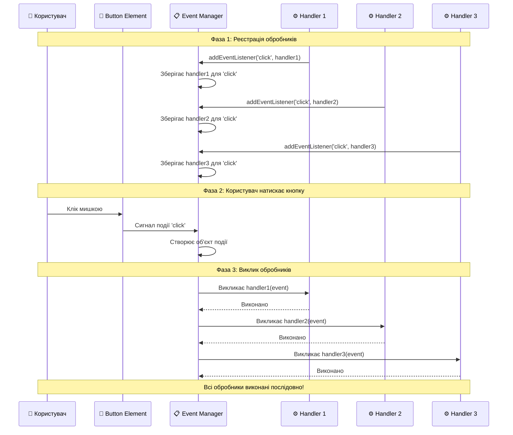
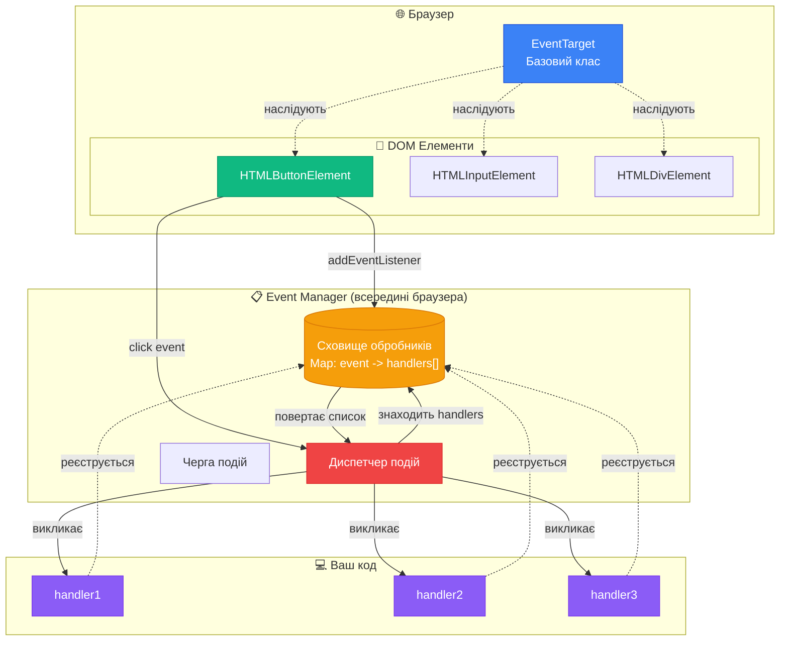
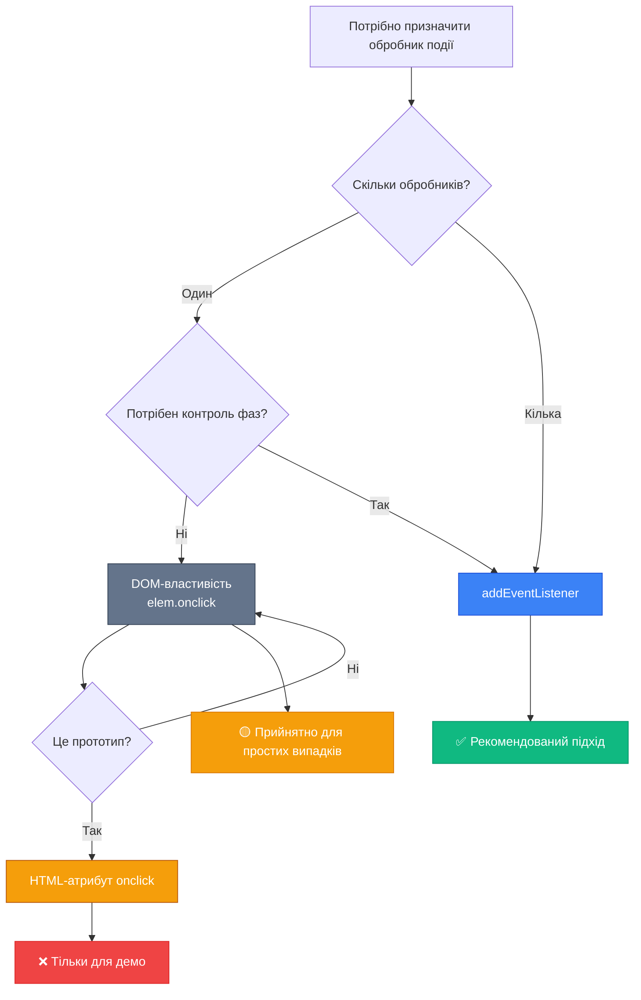
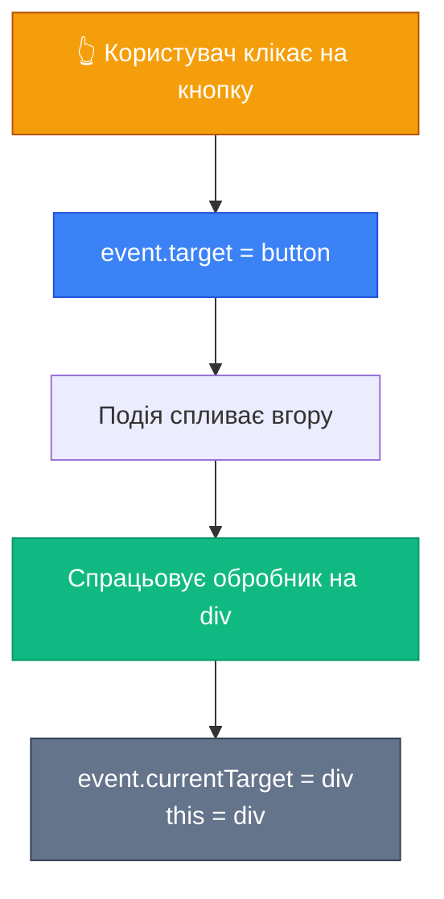
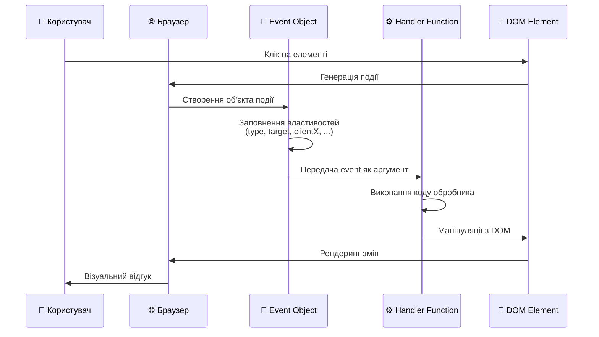

# Вступ до подій браузера

## Навіщо нам потрібні події?

Уявіть веб-сторінку без можливості взаємодії — це просто статичний документ, як роздрукована сторінка в книзі. Користувач не може натиснути кнопку, заповнити форму або навіть прокрутити контент. Саме **події (events)** перетворюють статичний HTML у живий, інтерактивний додаток.

Події — це **сигнали від браузера**, що повідомляють: "Щось сталося!". Кожна дія користувача (клік мишкою, натискання клавіші, рух курсора) або зміна стану браузера (завантаження сторінки, зміна розміру вікна) генерує відповідну подію. JavaScript дозволяє нам "слухати" ці сигнали та реагувати на них через **обробники подій (event handlers)**.

::tip
**Аналогія з реального світу**: Події схожі на дзвінок дверей. Коли хтось натискає кнопку дзвінка (подія `click`), ви чуєте звук (браузер надсилає сигнал) і вирішуєте, що робити — відкрити двері, подивитися у вічко або проігнорувати (обробник події).
::

## Екосистема подій: які вони бувають?

Браузерні події можна класифікувати за джерелом їх походження. Розуміння цієї класифікації допоможе вам швидше орієнтуватися в документації та писати більш структурований код.

### Події миші (Mouse Events)

Найпоширеніша категорія подій, пов'язана з маніпулятором-мишею:

| Подія                       | Опис                                                             | Коли використовувати                                             |
| :-------------------------- | :--------------------------------------------------------------- | :--------------------------------------------------------------- |
| `click`                     | Натискання лівої кнопки миші (або торкання на сенсорних екранах) | Основна взаємодія з кнопками та посиланнями                      |
| `dblclick`                  | Подвійне натискання лівої кнопки                                 | Рідко використовується в веб-інтерфейсах (зазвичай у редакторах) |
| `contextmenu`               | Натискання правої кнопки миші                                    | Створення власних контекстних меню                               |
| `mousedown` / `mouseup`     | Натискання / відпускання кнопки миші                             | Drag & Drop, малювання на canvas                                 |
| `mousemove`                 | Рух миші над елементом                                           | Відстеження позиції курсора, інтерактивні ефекти                 |
| `mouseover` / `mouseout`    | Курсор заходить на елемент / покидає елемент                     | Підказки (tooltips), підсвічування                               |
| `mouseenter` / `mouseleave` | Схожі на попередні, але не спливають                             | Краще для делегування подій                                      |

### Події клавіатури (Keyboard Events)

Всі події, пов'язані з натисканнями клавіш:

-   `keydown` — клавіша натиснута (спрацьовує постійно при утриманні)
-   `keyup` — клавіша відпущена
-   `keypress` — застаріла, не використовуйте (замість неї `keydown`)

### Події форм (Form Events)

Критичні для обробки користувацького введення:

-   `submit` — надсилання форми `<form>`
-   `focus` / `blur` — елемент отримав / втратив фокус
-   `change` — зміна значення (після втрати фокуса для `<input>`)
-   `input` — зміна значення (в реальному часі)

### Події документа (Document Events)

Пов'язані з життєвим циклом сторінки:

-   `DOMContentLoaded` — DOM повністю побудований і готовий до маніпуляцій
-   `load` — всі ресурси (зображення, стилі) завантажені
-   `beforeunload` — користувач збирається покинути сторінку
-   `unload` — сторінка вивантажується

### CSS події (CSS Events)

Реагують на завершення CSS-анімацій та переходів:

-   `transitionend` — CSS-перехід завершено
-   `animationend` — CSS-анімація завершена

::note
**Важливо**: Це лише найуживаніші події. Повний список містить понад 100 різних типів подій, включаючи події сенсорного екрана (`touch*`), перетягування (`drag*`), медіа (`play`, `pause`), та багато інших.
::

## Як події працюють під капотом?

Перш ніж вивчати способи роботи з подіями, важливо зрозуміти **архітектуру системи подій**. Це допоможе вам не лише використовувати існуючі події, а й створювати власні, розуміючи фундаментальні принципи.

### Патерн "Видавець-Підписник" (Publisher-Subscriber)

Система подій браузера базується на архітектурному патерні **Observer** (також відомий як **Pub/Sub** — Publisher-Subscriber). Суть проста:

::card-group
::card{title="📢 Видавець (Publisher)" icon="i-heroicons-megaphone"}
Об'єкт, який **генерує події** коли щось відбувається. Наприклад, кнопка генерує подію `click` при натисканні.
::

::card{title="👂 Підписник (Subscriber)" icon="i-heroicons-user-group"}
Код, який **слухає події** і реагує на них через обробники. Ваша функція-обробник — це підписник.
::

::card{title="📋 Диспетчер подій (Event Manager)" icon="i-heroicons-queue-list"}
Внутрішній механізм, який **зберігає список підписників** для кожного типу події та викликає їх коли подія відбувається.
::
::

**Чому це важливо?** Видавець не знає, хто і скільки підписників слухає його події. Підписники не знають про інших підписників. Це забезпечує **слабке зчеплення (loose coupling)** — компоненти незалежні один від одного.

### Візуальна схема роботи

::mermaid



::

### Спрощена реалізація системи подій

Давайте створимо **власну мініатюрну систему подій**, щоб зрозуміти, як це працює всередині браузера:

```javascript
// Міксин (mixin) — об'єкт з методами, які можна додати до будь-якого класу
const EventEmitter = {
    /**
     * Підписатися на подію
     * @param {string} eventName - назва події
     * @param {function} handler - функція-обробник
     */
    on(eventName, handler) {
        // Створюємо сховище для обробників, якщо його ще немає
        if (!this._eventHandlers) {
            this._eventHandlers = {}
        }

        // Створюємо масив для цієї події, якщо його ще немає
        if (!this._eventHandlers[eventName]) {
            this._eventHandlers[eventName] = []
        }

        // Додаємо обробник до списку
        this._eventHandlers[eventName].push(handler)
    },

    /**
     * Відписатися від події
     * @param {string} eventName - назва події
     * @param {function} handler - функція-обробник для видалення
     */
    off(eventName, handler) {
        const handlers = this._eventHandlers?.[eventName]
        if (!handlers) return // Немає обробників для цієї події

        // Знаходимо та видаляємо обробник зі списку
        for (let i = 0; i < handlers.length; i++) {
            if (handlers[i] === handler) {
                handlers.splice(i, 1)
                i-- // Корекція індексу після видалення
            }
        }
    },

    /**
     * Викликати подію (emit/trigger/dispatch)
     * @param {string} eventName - назва події
     * @param {...any} args - дані для передачі обробникам
     */
    emit(eventName, ...args) {
        // Якщо немає обробників для цієї події — нічого не робимо
        if (!this._eventHandlers?.[eventName]) {
            return
        }

        // Викликаємо кожен обробник з переданими аргументами
        this._eventHandlers[eventName].forEach((handler) => {
            handler.apply(this, args)
        })
    },
}
```

**Розбір коду:**

1. **`on(eventName, handler)`** — реєструє новий обробник

    - Створює об'єкт `_eventHandlers` для зберігання всіх обробників
    - Для кожної події (`eventName`) зберігає масив обробників
    - Додає переданий `handler` до цього масиву

2. **`off(eventName, handler)`** — видаляє обробник

    - Шукає обробник у масиві за **посиланням** (тому анонімні функції видалити неможливо!)
    - Видаляє знайдений обробник через `splice()`

3. **`emit(eventName, ...args)`** — генерує подію
    - Знаходить всі обробники для цієї події
    - Викликає кожен обробник послідовно, передаючи їм аргументи

### Практичний приклад: Створення меню з подіями

Тепер використаємо наш `EventEmitter` для створення інтерактивного меню:

```javascript
// Клас меню
class Menu {
    constructor(items) {
        this.items = items
        this.selectedIndex = -1
    }

    select(index) {
        if (index < 0 || index >= this.items.length) {
            console.error('Невірний індекс!')
            return
        }

        this.selectedIndex = index
        const selectedItem = this.items[index]

        // Генеруємо подію "select" з даними про вибраний елемент
        this.emit('select', {
            item: selectedItem,
            index: index,
            timestamp: Date.now(),
        })
    }

    open() {
        console.log('Меню відкрито')
        // Генеруємо подію "open"
        this.emit('open')
    }

    close() {
        console.log('Меню закрито')
        // Генеруємо подію "close"
        this.emit('close')
    }
}

// Додаємо можливості роботи з подіями до класу Menu
Object.assign(Menu.prototype, EventEmitter)

// Використання
const menu = new Menu(['Головна', 'Про нас', 'Контакти', 'Налаштування'])

// Підписник 1: Аналітика
menu.on('select', (data) => {
    console.log(`📊 [Аналітика] Вибрано: "${data.item}" (індекс ${data.index})`)
    // Тут можна відправити дані на сервер
})

// Підписник 2: Оновлення UI
menu.on('select', (data) => {
    console.log(`🎨 [UI] Оновлюємо інтерфейс для пункту "${data.item}"`)
    // Тут можна змінити активний клас, показати контент тощо
})

// Підписник 3: Навігація
menu.on('select', (data) => {
    console.log(`🧭 [Навігація] Перехід до розділу "${data.item}"`)
    // Тут можна змінити URL або завантажити контент
})

// Додаємо обробник для відкриття меню
menu.on('open', () => {
    console.log('✅ Меню готове до використання')
})

// Тестуємо
menu.open()
// Виведе: Меню відкрито
//         ✅ Меню готове до використання

menu.select(1)
// Виведе: 📊 [Аналітика] Вибрано: "Про нас" (індекс 1)
//         🎨 [UI] Оновлюємо інтерфейс для пункту "Про нас"
//         🧭 [Навігація] Перехід до розділу "Про нас"

menu.select(3)
// Виведе: 📊 [Аналітика] Вибрано: "Налаштування" (індекс 3)
//         🎨 [UI] Оновлюємо інтерфейс для пункту "Налаштування"
//         🧭 [Навігація] Перехід до розділу "Налаштування"
```

### Переваги патерну Observer

::tip

### 🎯 Чому цей патерн такий потужний?

**1. Розділення відповідальності (Separation of Concerns)**

-   Клас `Menu` не знає, як саме обробляються його події
-   Обробники не знають про внутрішню реалізацію меню
-   Легко додавати нові обробники без зміни коду меню

**2. Можливість множинних підписників**

```javascript
// 10 різних частин програми можуть слухати одну подію
menu.on('select', analyticsHandler)
menu.on('select', uiHandler)
menu.on('select', navigationHandler)
menu.on('select', loggingHandler)
// ... і так далі
```

**3. Динамічна підписка/відписка**

```javascript
function tempHandler(data) {
    console.log('Тимчасовий обробник:', data)
}

menu.on('select', tempHandler) // Підписуємося
menu.select(0) // Обробник спрацює

menu.off('select', tempHandler) // Відписуємося
menu.select(1) // Обробник НЕ спрацює
```

**4. Слабке зчеплення (Loose Coupling)**

-   Можна замінити клас `Menu` на інший, головне — зберегти події
-   Обробники працюватимуть без змін

::

### Як це працює в браузері?

Браузер використовує подібний механізм, але з додатковими можливостями:

::field-group
::field{name="Система подій браузера" type="Architecture"}
**Додаткові особливості:**

1. **Фази події**: Занурення (capturing) → Ціль (target) → Спливання (bubbling)
2. **Об'єкт події**: Браузер автоматично створює об'єкт з повною інформацією
3. **Типові дії**: Деякі події мають вбудовану поведінку (перехід за посиланням)
4. **Оптимізації**: Браузер оптимізує виклик тисяч обробників
5. **Асинхронність**: Події можуть бути поставлені в чергу

::

::field{name="Внутрішня структура" type="Implementation"}

```javascript
// Спрощено, як це виглядає всередині браузера:
class EventTarget {
    constructor() {
        this._listeners = new Map() // event -> [handlers]
    }

    addEventListener(type, listener, options) {
        if (!this._listeners.has(type)) {
            this._listeners.set(type, [])
        }
        this._listeners.get(type).push({ listener, options })
    }

    dispatchEvent(event) {
        const listeners = this._listeners.get(event.type) || []

        for (const { listener, options } of listeners) {
            listener.call(this, event)

            if (options?.once) {
                this.removeEventListener(event.type, listener)
            }
        }
    }
}
```

::
::

### Порівняння: наша реалізація vs браузер

| Особливість      | Наш EventEmitter       | Браузер (EventTarget)                       |
| :--------------- | :--------------------- | :------------------------------------------ |
| **Підписка**     | `on(event, handler)`   | `addEventListener(event, handler, options)` |
| **Відписка**     | `off(event, handler)`  | `removeEventListener(event, handler)`       |
| **Генерація**    | `emit(event, ...args)` | `dispatchEvent(new Event(type))`            |
| **Фази подій**   | ❌ Немає               | ✅ Capturing, Target, Bubbling              |
| **Об'єкт події** | Довільні аргументи     | Повноцінний об'єкт `Event`                  |
| **Опції**        | ❌ Немає               | ✅ `once`, `passive`, `capture`             |
| **Типові дії**   | ❌ Немає               | ✅ `preventDefault()`, `stopPropagation()`  |

### Інтерактивна діаграма: внутрішня структура

::mermaid



::

::note
**Ключове розуміння**: Коли ви викликаєте `button.addEventListener('click', handler)`, браузер:

1. Зберігає посилання на `handler` у внутрішній структурі даних
2. При кліку на кнопку створює об'єкт `Event`
3. Шукає всі зареєстровані обробники для події `'click'`
4. Викликає їх послідовно, передаючи об'єкт події

Це **той самий патерн Observer**, який ми реалізували вище, тільки з додатковими можливостями!
::

### Практичне застосування: створення власних подій

Тепер, розуміючи архітектуру, ви можете створювати власні компоненти з подіями:

```javascript
class FileUploader {
    constructor() {
        this.files = []
    }

    upload(file) {
        // Емітуємо подію "started"
        this.emit('uploadStarted', { fileName: file.name, size: file.size })

        // Симуляція завантаження
        setTimeout(() => {
            this.files.push(file)

            // Емітуємо подію "completed"
            this.emit('uploadCompleted', {
                fileName: file.name,
                totalFiles: this.files.length,
            })
        }, 2000)
    }
}

// Додаємо можливості подій
Object.assign(FileUploader.prototype, EventEmitter)

// Використання
const uploader = new FileUploader()

uploader.on('uploadStarted', (data) => {
    console.log(`⏳ Завантаження "${data.fileName}" (${data.size} bytes)...`)
})

uploader.on('uploadCompleted', (data) => {
    console.log(`✅ Файл "${data.fileName}" завантажено! Всього: ${data.totalFiles}`)
})

uploader.upload({ name: 'photo.jpg', size: 2048576 })
```

::tip
**Коли створювати власні події?**

-   Розробка переповикористовуваних компонентів (модальні вікна, слайдери, форми)
-   Розділення логіки в складних додатках
-   Створення плагінів та розширень
-   Реалізація архітектури на основі подій (Event-Driven Architecture)

::

## Три способи призначення обробників подій

JavaScript пропонує три підходи до призначення обробників. Кожен має свої переваги та обмеження — важливо розуміти, **коли** і **навіщо** використовувати кожен з них.

### 1. HTML-атрибути: `on<event>`

**Найпростіший**, але найменш рекомендований спосіб — вказати код безпосередньо в HTML:

```html
<button onclick="alert('Привіт!')">Натисни мене</button>
```

Для більших шматків коду краще винести логіку у функцію:

```html
<script>
    function handleClick() {
        console.log('Кнопку натиснуто!')
    }
</script>

<button onclick="handleClick()">Натисни мене</button>
```

**Чому це працює?** Браузер автоматично створює функцію-обробник з вмісту атрибута:

```javascript
// Браузер перетворює onclick="handleClick()" на:
button.onclick = function (event) {
    handleClick() // ваш код із атрибута
}
```

::warning
**Недоліки HTML-атрибутів:**

-   Змішування HTML та JavaScript (порушення принципу розділення відповідальностей)
-   Складно підтримувати великі блоки коду в атрибутах
-   Неможливість призначити кілька обробників на одну подію
-   Атрибути не чутливі до регістру (`ONCLICK` = `onClick` = `onclick`), що може заплутати

**Коли використовувати**: Тільки для швидких прототипів або демонстраційних прикладів.
::

### 2. DOM-властивості: `elem.on<event>`

Другий спосіб — використовувати властивості DOM-елемента:

```html
<button id="myButton">Натисни мене</button>

<script>
    const button = document.getElementById('myButton')

    button.onclick = function () {
        alert('Обробник через властивість!')
    }
</script>
```

Ви також можете використовувати іменовані функції:

```javascript
function showMessage() {
    alert('Дякую за клік!')
}

button.onclick = showMessage // Без дужок!
```

::caution
**Критична помилка**: Передавайте посилання на функцію, а не результат її виклику!

```javascript
// ❌ НЕПРАВИЛЬНО — функція виконується одразу, результат (undefined) присвоюється
button.onclick = showMessage()

// ✅ ПРАВИЛЬНО — передається посилання на функцію
button.onclick = showMessage
```

В HTML-атрибутах ситуація **протилежна** — там потрібні дужки, бо браузер автоматично обгортає код у функцію.
::

**Обмеження**: Можна призначити лише **один** обробник на подію. Новий обробник перезапише попередній:

```javascript
button.onclick = function () {
    alert('Перший')
}
button.onclick = function () {
    alert('Другий')
} // Перезаписує перший!

// При кліку побачимо лише "Другий"
```

Щоб видалити обробник:

```javascript
button.onclick = null
```

::tip
**Коли використовувати**: Для простих сценаріїв, де потрібен лише один обробник на подію. Наприклад, для невеликих віджетів або внутрішньої логіки компонентів.
::

### 3. Метод `addEventListener` (Рекомендований)

**Найсучасніший та найгнучкіший** спосіб призначення обробників, який усуває обмеження попередніх підходів:

```javascript
element.addEventListener(event, handler, [options])
```

**Параметри:**

-   `event` (string) — назва події без префікса `on` (наприклад, `"click"`, `"keydown"`)
-   `handler` (function) — функція-обробник
-   `options` (object | boolean) — додаткові налаштування:
    -   `once: true` — обробник виконається один раз і автоматично видалиться
    -   `capture: true` (або просто `true`) — обробник спрацює на фазі занурення замість спливання
    -   `passive: true` — обробник не викличе `preventDefault()` (для оптимізації на мобільних пристроях)

**Приклад використання:**

```javascript
const button = document.getElementById('myButton')

function handleClick(event) {
    console.log('Кнопку натиснуто!', event)
}

// Додаємо обробник
button.addEventListener('click', handleClick)

// Можемо додати ще один — обидва виконаються!
button.addEventListener('click', function () {
    console.log('Другий обробник!')
})
```

**Видалення обробника:**

```javascript
// Видалення вимагає передачі ТОЧНО тієї ж функції
button.removeEventListener('click', handleClick)
```

::warning
**Типова помилка**: Неможливість видалити анонімну функцію

```javascript
// ❌ Не працюватиме — це дві різні функції!
button.addEventListener('click', () => alert('Привіт'))
button.removeEventListener('click', () => alert('Привіт'))

// ✅ Правильно — зберігаємо посилання на функцію
const handler = () => alert('Привіт')
button.addEventListener('click', handler)
button.removeEventListener('click', handler) // Працює!
```

::

**Основна перевага** — можливість призначити **кілька обробників** на одну подію:

```html
<button id="btn">Багатофункціональна кнопка</button>

<script>
    const btn = document.getElementById('btn')

    // Перший обробник — аналітика
    btn.addEventListener('click', () => {
        console.log('Відправлено подію в аналітику')
    })

    // Другий обробник — зміна UI
    btn.addEventListener('click', () => {
        btn.textContent = 'Натиснуто!'
    })

    // Третій обробник — запит на сервер
    btn.addEventListener('click', () => {
        fetch('/api/button-clicked').then((res) => res.json())
    })

    // Всі три виконаються послідовно
</script>
```

::note
**Виключні події**: Деякі події можна призначити **тільки** через `addEventListener`, наприклад:

```javascript
// ❌ Не працює
document.onDOMContentLoaded = function () {
    console.log('DOM готовий')
}

// ✅ Працює
document.addEventListener('DOMContentLoaded', function () {
    console.log('DOM готовий')
})
```

::

## Порівняння способів призначення обробників

::tabs
::tabs-item{label="Порівняльна таблиця"}
| Критерій | HTML-атрибут | DOM-властивість | addEventListener |
|:---------|:-------------|:----------------|:-----------------|
| **Читабельність** | Низька | Середня | Висока |
| **Розділення HTML/JS** | ❌ Ні | ✅ Так | ✅ Так |
| **Кількість обробників** | 1 | 1 | Необмежено |
| **Видалення обробника** | Складно | `elem.onclick = null` | `removeEventListener()` |
| **Контроль фаз (capture/bubble)** | ❌ Ні | ❌ Ні | ✅ Так |
| **Додаткові опції** | ❌ Ні | ❌ Ні | ✅ Так (once, passive) |
| **Використання в сучасних проєктах** | ❌ Не рекомендується | 🟡 Іноді | ✅ Так |
::

::tabs-item{label="Візуальна діаграма"}
::mermaid



::
::
::

## Об'єкт події: деталі про те, що сталося

Коли відбувається подія, браузер створює **об'єкт події (event object)** і передає його першим параметром у функцію-обробник. Цей об'єкт містить всю інформацію про подію.

### Приклад отримання інформації про клік

```html
<button id="infoButton">Натисни мене</button>

<script>
    const button = document.getElementById('infoButton')

    button.addEventListener('click', function (event) {
        console.log('Тип події:', event.type) // "click"
        console.log('Елемент-ціль:', event.target) // <button id="infoButton">
        console.log('Елемент-обробник:', event.currentTarget) // <button id="infoButton">
        console.log('Координати кліка:', event.clientX, event.clientY)
        console.log('Натиснута Ctrl?', event.ctrlKey)
        console.log('Мітка часу:', event.timeStamp)
    })
</script>
```

### Ключові властивості об'єкта події

::field-group
::field{name="event.type" type="string"}
Тип події (наприклад, `"click"`, `"keydown"`)
::

::field{name="event.target" type="Element"}
Елемент, на якому **насправді відбулася** подія (найглибший елемент у дереві DOM)
::

::field{name="event.currentTarget" type="Element"}
Елемент, на якому **призначений обробник** (завжди дорівнює `this` у звичайних функціях)
::

::field{name="event.clientX / event.clientY" type="number"}
Координати курсора миші відносно вікна браузера (тільки для подій миші)
::

::field{name="event.pageX / event.pageY" type="number"}
Координати курсора відносно документа (враховують прокрутку)
::

::field{name="event.key / event.code" type="string"}
Натиснута клавіша (для подій клавіатури). `key` — символ, `code` — фізична клавіша
::

::field{name="event.ctrlKey / event.shiftKey / event.altKey / event.metaKey" type="boolean"}
Чи утримувалися модифікатори під час події
::

::field{name="event.timeStamp" type="number"}
Час у мілісекундах з моменту завантаження сторінки
::

::field{name="event.isTrusted" type="boolean"}
`true` — подія викликана користувачем, `false` — згенерована через JavaScript
::
::

### Різниця між `target` та `currentTarget`

Це одна з найбільш заплутаних концепцій для початківців. Розберемо на прикладі:

```html
<div id="outer" style="padding: 50px; background: lightblue;">
    Зовнішній div
    <button id="inner">Внутрішня кнопка</button>
</div>

<script>
    const outer = document.getElementById('outer')

    outer.addEventListener('click', function (event) {
        console.log('event.target:', event.target.id) // Елемент, на який клікнули
        console.log('event.currentTarget:', event.currentTarget.id) // Завжди "outer"
        console.log('this:', this.id) // Також "outer"
    })
</script>
```

**Що станеться:**

-   **Клік на кнопку**: `event.target` = `button#inner`, `event.currentTarget` = `div#outer`
-   **Клік на синю область div**: `event.target` = `div#outer`, `event.currentTarget` = `div#outer`

::mermaid



::

## Доступ до елемента через `this`

У звичайній функції-обробнику `this` завжди вказує на елемент, до якого **призначений обробник**:

```javascript
button.onclick = function () {
    console.log(this) // <button>
    this.style.backgroundColor = 'red' // Змінюємо фон кнопки
}
```

::warning
**Стрілкові функції не мають власного `this`!**

```javascript
// ❌ this === window (або undefined в strict mode)
button.onclick = () => {
    console.log(this) // НЕ button!
}

// ✅ Використовуйте event.currentTarget
button.onclick = (event) => {
    console.log(event.currentTarget) // <button>
}
```

::

## Об'єкт-обробник: `handleEvent`

Незвичний, але потужний паттерн — передача об'єкта з методом `handleEvent` замість функції:

```html
<button id="menu">Відкрити меню</button>

<script>
    class Menu {
        handleEvent(event) {
            // Автоматичний роутинг подій до методів класу
            const method = 'on' + event.type[0].toUpperCase() + event.type.slice(1)
            this[method](event)
        }

        onClick(event) {
            console.log('Меню відкрито!')
            this.showMenu()
        }

        onMouseover(event) {
            event.target.style.backgroundColor = '#f0f0f0'
        }

        onMouseout(event) {
            event.target.style.backgroundColor = ''
        }

        showMenu() {
            alert('Показуємо меню...')
        }
    }

    const menu = new Menu()
    const btn = document.getElementById('menu')

    // Передаємо об'єкт замість функції
    btn.addEventListener('click', menu)
    btn.addEventListener('mouseover', menu)
    btn.addEventListener('mouseout', menu)
</script>
```

**Переваги підходу:**

-   Відмінна організація коду для складних компонентів
-   Легке додавання нових типів подій без змін в коді реєстрації
-   `this` автоматично вказує на екземпляр класу

::tip
**Практичне застосування**: Цей паттерн ідеальний для створення переповикористовуваних UI-компонентів (модальні вікна, випадаючі меню, карусель).
::

## Інтерактивний приклад: рахівник кліків

Давайте створимо практичний приклад, який демонструє всі описані концепції:

```html
<!DOCTYPE html>
<html lang="uk">
    <head>
        <meta charset="UTF-8" />
        <title>Лічильник кліків</title>
        <style>
            .counter {
                font-family: Arial, sans-serif;
                max-width: 400px;
                margin: 50px auto;
                padding: 30px;
                border: 2px solid #3b82f6;
                border-radius: 10px;
                text-align: center;
            }

            .count {
                font-size: 48px;
                font-weight: bold;
                color: #3b82f6;
                margin: 20px 0;
            }

            button {
                font-size: 18px;
                padding: 10px 20px;
                margin: 5px;
                cursor: pointer;
                border: none;
                border-radius: 5px;
                background: #3b82f6;
                color: white;
                transition: background 0.3s;
            }

            button:hover {
                background: #2563eb;
            }

            button.reset {
                background: #ef4444;
            }

            button.reset:hover {
                background: #dc2626;
            }

            .info {
                margin-top: 20px;
                padding: 15px;
                background: #f1f5f9;
                border-radius: 5px;
                font-size: 14px;
                color: #475569;
            }
        </style>
    </head>
    <body>
        <div class="counter">
            <h1>Лічильник подій</h1>
            <div class="count" id="count">0</div>

            <button id="incrementBtn">➕ Збільшити</button>
            <button id="decrementBtn">➖ Зменшити</button>
            <button id="resetBtn" class="reset">🔄 Скинути</button>

            <div class="info" id="info">Натисніть кнопку для зміни лічильника</div>
        </div>

        <script>
            // Знаходимо елементи
            const countDisplay = document.getElementById('count')
            const incrementBtn = document.getElementById('incrementBtn')
            const decrementBtn = document.getElementById('decrementBtn')
            const resetBtn = document.getElementById('resetBtn')
            const info = document.getElementById('info')

            // Стан лічильника
            let count = 0

            // Функція оновлення відображення
            function updateDisplay() {
                countDisplay.textContent = count
            }

            // Функція показу інформації про подію
            function showEventInfo(event) {
                info.innerHTML = `
        <strong>Подія:</strong> ${event.type}<br>
        <strong>Елемент:</strong> ${event.target.textContent}<br>
        <strong>Час:</strong> ${new Date().toLocaleTimeString()}<br>
        <strong>Координати:</strong> (${event.clientX}, ${event.clientY})
      `
            }

            // Обробники подій
            incrementBtn.addEventListener('click', function (event) {
                count++
                updateDisplay()
                showEventInfo(event)
            })

            decrementBtn.addEventListener('click', function (event) {
                count--
                updateDisplay()
                showEventInfo(event)
            })

            // Приклад використання опції { once: true }
            resetBtn.addEventListener('click', function (event) {
                count = 0
                updateDisplay()
                showEventInfo(event)

                // Додаємо тимчасовий обробник, який спрацює один раз
                this.addEventListener(
                    'mouseover',
                    function tempHandler(e) {
                        info.innerHTML += '<br><em>Ефект скидання активний!</em>'
                    },
                    { once: true },
                )
            })

            // Додаємо ефект наведення для всіх кнопок
            const buttons = document.querySelectorAll('button')
            buttons.forEach((button) => {
                button.addEventListener('mouseenter', function () {
                    this.style.transform = 'scale(1.05)'
                })

                button.addEventListener('mouseleave', function () {
                    this.style.transform = 'scale(1)'
                })
            })
        </script>
    </body>
</html>
```

**Розбір коду:**

1. **Рядки 1-52**: HTML та CSS для візуального відображення лічильника
2. **Рядки 55-60**: Отримуємо посилання на DOM-елементи через `getElementById()`
3. **Рядок 63**: Створюємо змінну стану `count` для зберігання поточного значення
4. **Рядки 66-68**: Функція `updateDisplay()` оновлює текстовий вміст елемента
5. **Рядки 71-78**: Функція `showEventInfo()` демонструє властивості об'єкта події
6. **Рядки 81-97**: Три обробники для кнопок, кожен використовує `event`
7. **Рядок 94**: Демонстрація опції `{ once: true }` — обробник виконається один раз
8. **Рядки 101-110**: Ефекти наведення для всіх кнопок через перебір масиву

## Поширені помилки та як їх уникнути

::card-group
::card{title="❌ Помилка #1: Виклик функції замість передачі посилання"}

```javascript
// Неправильно
button.onclick = handleClick() // Викликає зараз!

// Правильно
button.onclick = handleClick // Передає посилання
```

::

::card{title="❌ Помилка #2: Використання setAttribute для подій"}

```javascript
// Не працює — функція перетворюється на рядок
element.setAttribute('onclick', function () {
    alert(1)
})

// Правильно
element.onclick = function () {
    alert(1)
}
```

::

::card{title="❌ Помилка #3: Чутливість до регістру"}

```javascript
element.ONCLICK = handler // Не працює!
element.onclick = handler // Працює ✅

// DOM-властивості чутливі до регістру!
```

::

::card{title="❌ Помилка #4: Неможливість видалити анонімну функція"}

```javascript
// Неможливо видалити пізніше
elem.addEventListener('click', () => alert('Hi'))

// Правильно — зберігаємо посилання
const handler = () => alert('Hi')
elem.addEventListener('click', handler)
elem.removeEventListener('click', handler)
```

::
::

## Потік обробки події: візуальна схема

::mermaid



::

## Підсумки

::steps

### Розуміння подій

Події — це **мова спілкування** між користувачем та вашим додатком. Кожна дія генерує сигнал, який можна обробити.

### Три способи призначення

-   **HTML-атрибути** — для прототипів (не рекомендовано)
-   **DOM-властивості** — для простих випадків
-   **addEventListener** — для професійного коду (рекомендовано)

### Об'єкт події

Кожен обробник отримує об'єкт `event` з повною інформацією про подію: тип, цільовий елемент, координати, мітка часу тощо.

### Ключові відмінності

-   `event.target` — елемент, де відбулася подія
-   `event.currentTarget` (або `this`) — елемент з обробником
-   `addEventListener` дозволяє кілька обробників, DOM-властивості — лише один

### Наступні кроки

Далі ви вивчите [механізм спливання (bubbling) та занурення (capturing)](./2-Бульбашковий-механізм.md), які розкривають повну міць системи подій браузера.
::

## Практичні завдання

::tip

### Завдання 1: Інтерактивна картка

Створіть картку товару, яка:

-   При наведенні миші (`mouseover`) показує кнопку "Купити"
-   При кліку на кнопку змінює текст на "Додано до кошика"
-   При подвійному кліку (`dblclick`) скидає стан

**Підказка**: Використовуйте `addEventListener` для всіх подій на одному елементі.
::

::tip

### Завдання 2: Клавіатурний шорткат

Реалізуйте обробник, який:

-   При натисканні `Ctrl+S` виводить alert "Збережено!" (замість стандартного збереження сторінки)
-   При `Escape` ховає модальне вікно

**Підказка**: Використовуйте `event.ctrlKey`, `event.key` та `event.preventDefault()`.
::

::tip

### Завдання 3: Делегування подій

Створіть список з 100 елементів, але призначте **лише один** обробник на батьківський `<ul>`, який:

-   Визначає, по якому `<li>` клікнули через `event.target`
-   Підсвічує обраний елемент
-   Виводить його порядковий номер

**Підказка**: Це підготовка до вивчення делегування подій у наступних розділах.
::

## Додаткові ресурси

::card-group
::card{title="📚 MDN Web Docs" icon="i-heroicons-book-open"}
[Introduction to events](https://developer.mozilla.org/en-US/docs/Learn/JavaScript/Building_blocks/Events) — детальний посібник від Mozilla

[EventTarget.addEventListener()](https://developer.mozilla.org/en-US/docs/Web/API/EventTarget/addEventListener) — повна специфікація методу
::

::card{title="🎓 Специфікація W3C" icon="i-heroicons-academic-cap"}
[DOM Events](https://www.w3.org/TR/DOM-Level-3-Events/) — офіційна специфікація подій DOM Level 3
::

::card{title="🛠️ JavaScript.info" icon="i-heroicons-code-bracket"}
[Вступ до браузерних подій](https://javascript.info/introduction-browser-events) — інтерактивний курс (англ.)
::
::

---

**Наступна стаття**: [Бульбашковий механізм (спливання та занурення)](./2-Бульбашковий-механізм.md)
