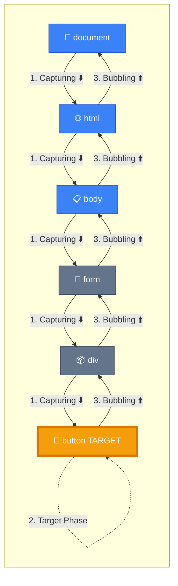
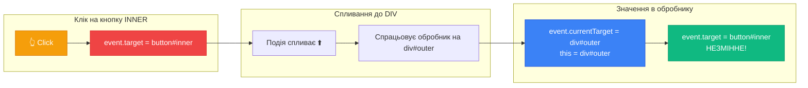
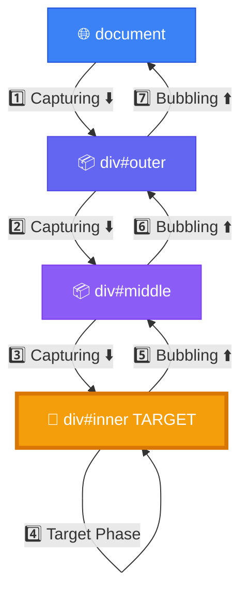

```mermaid
sequenceDiagram
    autonumber
    participant User as 👤 Користувач
    participant P as 📄 <p>
    participant DIV as 📦 <div>
    participant FORM as 📝 <form>
    participant DOC as 🌐 document

    User->>P: Клік мишкою

    Note over P,DOC: Фаза спливання (Bubbling) ⬆️

    P->>P: Виконує onclick
    Note right of P: alert("P")

    P->>DIV: Подія спливає вгору
    DIV->>DIV: Виконує onclick
    Note right of DIV: alert("DIV")

    DIV->>FORM: Подія спливає вгору
    FORM->>FORM: Виконує onclick
    Note right of FORM: alert("FORM")

    FORM->>DOC: Спливає до document
    Note right of DOC: Обробка завершена
```

# Бульбашковий механізм (Bubbling) та занурення (Capturing)

## Дивна поведінка: чому спрацьовує батьківський обробник?

Розгляньте цей приклад та спробуйте передбачити, що станеться:

```html
<div id="parent" onclick="alert('Клік на DIV!')">
    <em>Якщо клікнути на <code>цей код</code>, спрацює обробник на DIV</em>
</div>
```

**Питання:** Ви клікаєте на елемент `<code>`, але чому спрацьовує обробник на `<div>`? 🤔

**Відповідь:** Це не баг, а одна з найпотужніших особливостей DOM — **механізм спливання подій (event bubbling)**!

::tip

### 🎯 Ключова ідея

Коли відбувається подія на елементі, вона **не зупиняється** на ньому. Подія автоматично **"спливає"** (подорожує вгору) через всіх батьків до кореня документа, запускаючи обробники на своєму шляху.
::

## Навіщо потрібен механізм спливання?

Уявіть, що ви створюєте таблицю з 1000 рядків, і потрібно обробляти клік на кожній комірці:

**❌ Підхід без розуміння спливання:**

```javascript
// Призначаємо 1000+ обробників — неефективно!
const cells = document.querySelectorAll('td')
cells.forEach((cell) => {
    cell.addEventListener('click', function () {
        console.log('Клік на комірці:', this.textContent)
    })
})
```

**✅ Розумний підхід з використанням спливання:**

```javascript
// Один обробник замість тисячі!
document.querySelector('table').addEventListener('click', function (event) {
    if (event.target.tagName === 'TD') {
        console.log('Клік на комірці:', event.target.textContent)
    }
})
```

**Переваги:**

-   🚀 **Продуктивність**: Один обробник замість тисячі
-   💾 **Пам'ять**: Менше об'єктів-обробників
-   🔄 **Динамічність**: Працює навіть для елементів, доданих пізніше

Цей підхід називається **делегування подій** — ми детально розглянемо його в наступній статті.

## Три фази життя події

Згідно зі [специфікацією W3C DOM Events](https://www.w3.org/TR/DOM-Level-3-Events/), кожна подія проходить **три фази**:

::steps

### Фаза 1: Занурення (Capturing Phase)

Подія **спускається** від кореня документа до цільового елемента.  
Маршрут: `document` → `html` → `body` → ... → `target`

### Фаза 2: Ціль (Target Phase)

Подія **досягає** цільового елемента (`event.target`).  
Спрацьовують обробники, призначені безпосередньо на цей елемент.

### Фаза 3: Спливання (Bubbling Phase)

Подія **піднімається** від цільового елемента назад до кореня.  
Маршрут: `target` → ... → `body` → `html` → `document`
::

### Візуалізація трьох фаз

::mermaid



::

::note
**Важливо:** За замовчуванням обробники спрацьовують на **фазі спливання** (bubbling). Це поведінка методів `addEventListener()`, властивостей `onclick`, та HTML-атрібутів.
::

## Спливання в дії: практичний приклад

Давайте розглянемо вкладену структуру HTML:

```html
<style>
    .box {
        padding: 20px;
        margin: 10px;
        border: 2px solid;
        cursor: pointer;
    }
    .form {
        background: #dbeafe;
        border-color: #3b82f6;
    }
    .div {
        background: #fef3c7;
        border-color: #f59e0b;
    }
    .p {
        background: #fecaca;
        border-color: #ef4444;
    }
</style>

<form class="box form" onclick="alert('FORM')">
    FORM
    <div class="box div" onclick="alert('DIV')">
        DIV
        <p class="box p" onclick="alert('P')">P</p>
    </div>
</form>
```

**Структура вкладеності:**

```
FORM (синій)
  └─ DIV (жовтий)
      └─ P (червоний)
```

**Що станеться при кліку на `<p>`?**

1. **Спочатку** виконується обробник на `<p>` → alert("P")
2. **Потім** подія спливає до `<div>` → alert("DIV")
3. **Нарешті** подія спливає до `<form>` → alert("FORM")

**Результат:** Побачите три alert в порядку: `P` → `DIV` → `FORM`

::mermaid



::

### Аналогія зі світу реального

::tip
###💡 Аналогія з будинком
Уявіть багатоповерховий будинок:

-   **Підвал (P)** — найглибший рівень
-   **Перший поверх (DIV)** — середній рівень
-   **Дах (FORM)** — верхній рівень

Коли спрацьовує пожежна сигналізація в підвалі (клік на `<p>`):

1. Спочатку її чують люди в підвалі
2. Потім звук доходить до першого поверху
3. Нарешті, до даху

Точно так само подія **спливає** від місця виникнення до верхівки DOM-дерева! 🏢
::

## event.target vs event.currentTarget vs this

Одна з найбільш заплутаних концепцій для початківців. Розберемо детально:

::field-group
::field{name="event.target" type="Element"}
**Елемент, де подія НАСПРАВДІ відбулася** (цільовий елемент).  
Залишається **незмінним** під час всього процесу спливання.

```javascript
// Завжди показує елемент, на який ви клікнули
console.log(event.target)
```

::

::field{name="event.currentTarget" type="Element"}
**Елемент, на якому ЗАРАЗ виконується обробник** (поточний елемент).  
**Змінюється** під час спливання, відповідаючи поточному предку.

```javascript
// Показує елемент, чий обробник виконується зараз
console.log(event.currentTarget)
```

::

::field{name="this" type="Element"}
У звичайній функції-обробнику `this` **дорівнює `event.currentTarget`**.

```javascript
elem.addEventListener('click', function (event) {
    console.log(this === event.currentTarget) // true
})
```

⚠️ **Увага:** В стрілкових функціях `this` НЕ вказує на елемент!
::
::

### Інтерактивна демонстрація

```html
<div id="outer" style="padding: 50px; background: #dbeafe; border: 3px solid #3b82f6;">
    OUTER DIV
    <div id="middle" style="padding: 30px; background: #fef3c7; border: 3px solid #f59e0b;">
        MIDDLE DIV
        <button id="inner">INNER BUTTON</button>
    </div>
</div>

<script>
    const outer = document.getElementById('outer')

    outer.addEventListener('click', function (event) {
        console.log('━━━━━━━━━━━━━━━━━━━━━━')
        console.log('Обробник виконується на:', this.id)
        console.log('event.target (хто викликав):', event.target.id)
        console.log('event.currentTarget (де обробник):', event.currentTarget.id)
        console.log('this === event.currentTarget:', this === event.currentTarget)
        console.log('━━━━━━━━━━━━━━━━━━━━━━')
    })
</script>
```

**Що побачимо при кліку на кнопку:**

```
━━━━━━━━━━━━━━━━━━━━━━
Обробник виконується на: outer
event.target (хто викликав): inner
event.currentTarget (де обробник): outer
this === event.currentTarget: true
━━━━━━━━━━━━━━━━━━━━━━
```

::mermaid



::

## Практичний приклад: підсвічування цільового елемента

Створимо обробник, який показує різницю між `target` та `currentTarget`:

```html
<!DOCTYPE html>
<html>
    <head>
        <style>
            .container {
                padding: 40px;
                background: #f1f5f9;
                border: 3px solid #64748b;
                font-family: Arial, sans-serif;
            }
            .box {
                padding: 30px;
                margin: 20px;
                background: #e0e7ff;
                border: 3px solid #6366f1;
            }
            .highlight-target {
                background: #fef08a !important;
                border-color: #eab308 !important;
            }
            .info {
                position: fixed;
                top: 20px;
                right: 20px;
                padding: 20px;
                background: white;
                border: 2px solid #3b82f6;
                border-radius: 8px;
                max-width: 300px;
                font-size: 14px;
            }
        </style>
    </head>
    <body>
        <div class="info" id="info">
            <strong>Інформація про клік:</strong>
            <div id="infoContent">Клікніть на будь-який елемент</div>
        </div>

        <div class="container" id="container">
            <h2>КОНТЕЙНЕР (container)</h2>

            <div class="box" id="box1">
                <h3>BOX 1 (box1)</h3>
                <p>Клікніть на <strong>цей текст</strong> або на будь-який елемент</p>
            </div>

            <div class="box" id="box2">
                <h3>BOX 2 (box2)</h3>
                <button id="btn">Кнопка</button>
            </div>
        </div>

        <script>
            const container = document.getElementById('container')
            const infoContent = document.getElementById('infoContent')

            // Додаємо обробник на контейнер
            container.addEventListener('click', function (event) {
                // Підсвічуємо цільовий елемент
                document.querySelectorAll('.highlight-target').forEach((el) => {
                    el.classList.remove('highlight-target')
                })
                event.target.classList.add('highlight-target')

                // Показуємо інформацію
                infoContent.innerHTML = `
        <div style="margin-top: 10px;">
          <strong style="color: #f59e0b;">event.target:</strong><br/>
          &lt;${event.target.tagName.toLowerCase()}&gt;
          ${event.target.id ? '#' + event.target.id : ''}
          ${event.target.className ? '.' + event.target.className : ''}
          <br/><br/>
          
          <strong style="color: #3b82f6;">event.currentTarget:</strong><br/>
          &lt;${event.currentTarget.tagName.toLowerCase()}&gt;
          #${event.currentTarget.id}
          <br/><br/>
          
          <strong style="color: #10b981;">this:</strong><br/>
          &lt;${this.tagName.toLowerCase()}&gt; #${this.id}
          <br/><br/>
          
          <em>Подія спливла від ${event.target.tagName} до ${event.currentTarget.tagName}</em>
        </div>
      `

                // Знімаємо підсвічування через 2 секунди
                setTimeout(() => {
                    event.target.classList.remove('highlight-target')
                }, 2000)
            })
        </script>
    </body>
</html>
```

**Що відбувається:**

1. При кліку на будь-який елемент всередині контейнера
2. Подія спливає до `div.container`, де спрацьовує обробник
3. `event.target` — елемент, на який ви клікнули
4. `event.currentTarget` та `this` — завжди `div.container`
5. Цільовий елемент підсвічується жовтим на 2 секунди

## Які події НЕ спливають?

::warning

### ⚠️ Винятки з правила"

**Більшість** подій спливають, але не всі. Ось список подій, які **НЕ спливають**:

| Подія                       | Чому не спливає                                                          |
| :-------------------------- | :----------------------------------------------------------------------- |
| `focus` / `blur`            | Фокус — це стан конкретного елемента, не має сенсу спливати              |
| `mouseenter` / `mouseleave` | Спеціально розроблені як несплываючі альтернативи `mouseover`/`mouseout` |
| `load` / `unload`           | Застосовуються лише до конкретного ресурсу (зображення, сторінка)        |
| `scroll`                    | Прокрутка відбувається в конкретному контейнері                          |
| `resize`                    | Зміна розміру стосується конкретного елемента/вікна                      |
| Media події                 | `play`, `pause`, `ended` — стосуються конкретного медіа-елемента         |

**Перевірка, чи спливає подія:**

```javascript
// Всі події мають властивість bubbles
document.addEventListener(
    'focus',
    (e) => {
        console.log(e.bubbles) // false
    },
    true,
)

document.addEventListener('click', (e) => {
    console.log(e.bubbles) // true
})
```

**Альтернатива для несплываючих подій:**

```javascript
// Замість focus/blur використовуйте focusin/focusout
element.addEventListener('focusin', handler) // Спливає! ✅
element.addEventListener('focusout', handler) // Спливає! ✅
```

::

## Зупинка спливання: event.stopPropagation()

Іноді потрібно **зупинити** подію від подальшого спливання. Для цього використовується метод `event.stopPropagation()`:

```html
<div id="outer" onclick="alert('Не побачите цього')">
    ЗОВНІШНІЙ DIV
    <button id="inner" onclick="event.stopPropagation()">Натисни мене — подія зупиниться тут</button>
</div>
```

**Що станеться:**

-   При кліку на кнопку подія **не спливе** до зовнішнього `<div>`
-   Обробник на `<div>` **не виконається**

### event.stopPropagation() vs event.stopImmediatePropagation()

Якщо на елементі **кілька обробників**, є важлива різниця:

```javascript
const button = document.getElementById('btn')

// Обробник 1
button.addEventListener('click', (e) => {
    console.log('Обробник 1')
    e.stopPropagation() // Зупиняє спливання, але НЕ зупиняє інші обробники
})

// Обробник 2
button.addEventListener('click', (e) => {
    console.log('Обробник 2') // ВСЕ ОДНО виконається!
})

// При кліку побачимо:
// Обробник 1
// Обробник 2
```

**Для повної зупинки використовуйте `stopImmediatePropagation()`:**

```javascript
button.addEventListener('click', (e) => {
    console.log('Обробник 1')
    e.stopImmediatePropagation() // Зупиняє ВСЕ: і спливання, і інші обробники
})

button.addEventListener('click', (e) => {
    console.log('Обробник 2') // НЕ виконається!
})

// При кліку побачимо лише:
// Обробник 1
```

::field-group
::field{name="event.stopPropagation()" type="method"}
**Зупиняє спливання**, але дозволяє виконатися іншим обробникам на **поточному елементі**.

Використовуйте, коли:

-   Хочете запобігти обробці події батьківськими елементами
-   Але дозволити всім обробникам на поточному елементі виконатися
    ::

::field{name="event.stopImmediatePropagation()" type="method"}
**Повністю зупиняє** подію: ні спливання, ні інші обробники не виконаються.

Використовуйте, коли:

-   Потрібна повна зупинка обробки події
-   Інші обробники не повинні виконуватися взагалі
    ::
    ::

### Порівняльна таблиця

| Метод                        | Спливання вгору  | Інші обробники на елементі |
| :--------------------------- | :--------------- | :------------------------- |
| _(нічого не викликали)_      | ✅ Продовжується | ✅ Виконуються             |
| `stopPropagation()`          | ❌ Зупиняється   | ✅ Виконуються             |
| `stopImmediatePropagation()` | ❌ Зупиняється   | ❌ Не виконуються          |

## ⚠️ Небезпека stopPropagation(): приховані пастки

::caution

### Чому НЕ варто зупиняти спливання

Зупинка спливання може створити **важко виявлювані проблеми** в майбутньому. Розглянемо реальний сценарій:

**Проблема:**

1. **Сьогодні:** Ви створюєте вкладене меню, яке зупиняє спливання через `stopPropagation()`

    ```javascript
    menu.addEventListener('click', (e) => {
        handleMenuClick(e)
        e.stopPropagation() // Зупиняємо спливання
    })
    ```

2. **Через місяць:** Додаєте систему аналітики для відстеження всіх кліків

    ```javascript
    document.addEventListener('click', (e) => {
        sendAnalytics(e.target) // Не спрацює для меню! 😢
    })
    ```

3. **Результат:** У вас виникає **"мертва зона"** — аналітика не отримує дані про кліки в меню

**Наслідки:**

-   📊 Неповні дані аналітики
-   🐛 Важко знайти причину (код аналітики виглядає правильно!)
-   🔧 Потрібно переписувати стару логіку меню
    ::

### Альтернативи stopPropagation()

::tabs
::tabs-item{label="❌ Погано"}

```javascript
// Проблемний підхід
button.addEventListener('click', (e) => {
    e.stopPropagation() // Блокує спливання назавжди
    handleButtonClick()
})

document.addEventListener('click', () => {
    // Ніколи не виконається для цієї кнопки!
    trackClick()
})
```

::

::tabs-item{label="✅ Краще: event.defaultPrevented"}

```javascript
// Кнопка "повідомляє" про обробку через defaultPrevented
button.addEventListener('click', (e) => {
    e.preventDefault() // Позначаємо подію як оброблену
    handleButtonClick()
})

document.addEventListener('click', (e) => {
    // Перевіряємо, чи вже оброблена подія
    if (e.defaultPrevented) return

    trackClick() // Виконається для інших елементів
})
```

::

::tabs-item{label="✅ Найкраще: data-атрибути"}

```javascript
// Використовуємо спеціальний маркер
button.addEventListener('click', (e) => {
    e.target.dataset.handled = 'true'
    handleButtonClick()
})

document.addEventListener('click', (e) => {
    if (e.target.dataset.handled) return

    trackClick() // Виконається для необроблених елементів
})
```

::
::

## Фаза занурення (Capturing): рідкісна, але потужна

За замовчуванням обробники працюють на фазі **спливання**. Але можна перехопити подію **до того**, як вона досягне цільового елемента — на фазі **занурення**.

### Як активувати фазу занурення

```javascript
// Третій параметр true або { capture: true }
element.addEventListener('click', handler, true)

// Або з об'єктом опцій
element.addEventListener('click', handler, { capture: true })
```

### Порівняння фаз

::code-group

```javascript [Bubbling (типово)]
document.addEventListener('click', () => {
    console.log('document')
})

body.addEventListener('click', () => {
    console.log('body')
})

div.addEventListener('click', () => {
    console.log('div — ЦІЛЬ')
})

// Клік на div виведе:
// div — ЦІЛЬ
// body
// document
```

```javascript [Capturing]
document.addEventListener(
    'click',
    () => {
        console.log('document')
    },
    true,
) // capture: true

body.addEventListener(
    'click',
    () => {
        console.log('body')
    },
    true,
)

div.addEventListener('click', () => {
    console.log('div — ЦІЛЬ')
})

// Клік на div виведе:
// document
// body
// div — ЦІЛЬ
```

```javascript [Both phases]
document.addEventListener(
    'click',
    () => {
        console.log('document — capturing')
    },
    true,
)

document.addEventListener('click', () => {
    console.log('document — bubbling')
})

div.addEventListener('click', () => {
    console.log('div — ЦІЛЬ')
})

// Клік на div виведе:
// document — capturing    (⬇️ занурення)
// div — ЦІЛЬ              (🎯 ціль)
// document — bubbling     (⬆️ спливання)
```

::

### Повна послідовність фаз

```html
<div id="outer">
    <div id="middle">
        <div id="inner">КЛІКНИ СЮДИ</div>
    </div>
</div>

<script>
    const outer = document.getElementById('outer')
    const middle = document.getElementById('middle')
    const inner = document.getElementById('inner')

    // Capturing обробники
    outer.addEventListener('click', () => console.log('outer — capturing'), true)
    middle.addEventListener('click', () => console.log('middle — capturing'), true)
    inner.addEventListener('click', () => console.log('inner — capturing'), true)

    // Bubbling обробники
    outer.addEventListener('click', () => console.log('outer — bubbling'))
    middle.addEventListener('click', () => console.log('middle — bubbling'))
    inner.addEventListener('click', () => console.log('inner — bubbling'))
</script>
```

**Результат при кліку на inner:**

```
outer — capturing     ⬇️ Фаза 1: Занурення (document → inner)
middle — capturing    ⬇️
inner — capturing     ⬇️
inner — bubbling      ⬆️ Фаза 3: Спливання (inner → document)
middle — bubbling     ⬆️
outer — bubbling      ⬆️
```

::mermaid



::

### Коли використовувати фазу занурення?

::tip

### 🎯 Практичні випадки використання capturing

**1. Глобальне делегування подій**

```javascript
// Перехоплення ВСІХ кліків до їх обробки
document.addEventListener(
    'click',
    (e) => {
        console.log('Глобальний аудит кліка:', e.target)
        // Логування, валідація, перевірка дозволів
    },
    true,
)
```

**2. Запобігання спливанню для певної зони**

```javascript
const restrictedArea = document.getElementById('restrictedArea')

restrictedArea.addEventListener(
    'click',
    (e) => {
        if (!userHasPermission()) {
            e.stopPropagation() // Зупиняємо на фазі занурення!
            alert('Доступ заборонено')
        }
    },
    true,
)
```

**3. Пріоритетна обробка**

```javascript
// Батьківський елемент обробляє подію ПЕРШИМ
parent.addEventListener(
    'keydown',
    (e) => {
        if (e.key === 'Escape') {
            closeModal()
            e.stopPropagation() // Дочірні не отримають Escape
        }
    },
    true,
)
```

::

## event.eventPhase: визначення поточної фази

Кожна подія має властивість `eventPhase`, яка показує номер поточної фази:

```javascript
element.addEventListener(
    'click',
    (e) => {
        console.log(e.eventPhase)
        // 1 = Event.CAPTURING_PHASE
        // 2 = Event.AT_TARGET
        // 3 = Event.BUBBLING_PHASE
    },
    true,
)
```

**Константи:**

-   `Event.CAPTURING_PHASE` = `1` — фаза занурення
-   `Event.AT_TARGET` = `2` — подія на цільовому елементі
-   `Event.BUBBLING_PHASE` = `3` — фаза спливання

**Практичне використання:**

```javascript
function universalHandler(e) {
    const phases = ['none', 'capturing', 'target', 'bubbling']
    console.log(`Фаза: ${phases[e.eventPhase]}, Елемент: ${e.currentTarget.id}`)
}

outer.addEventListener('click', universalHandler, true) // capturing
middle.addEventListener('click', universalHandler) // bubbling
inner.addEventListener('click', universalHandler) // bubbling
```

## Важливі нюанси та підводні камені

::card-group
::card{title="⚠️ Видалення обробників" icon="i-heroicons-hand-raised"}
Для видалення capture-обробника потрібно вказати **ту саму фазу**:

```javascript
const handler = () => console.log('click')

// Додали з capturing
elem.addEventListener('click', handler, true)

// ❌ Не видалить — різні фази!
elem.removeEventListener('click', handler)

// ✅ Видалить — та сама фаза
elem.removeEventListener('click', handler, true)
```

::

::card{title="📋 Порядок обробників" icon="i-heroicons-queue-list"}
Обробники на **одній фазі** виконуються в порядку реєстрації:

```javascript
elem.addEventListener('click', () => console.log('1'))
elem.addEventListener('click', () => console.log('2'))
elem.addEventListener('click', () => console.log('3'))

// Завжди виведе: 1, 2, 3
```

::

::card{title="🎯 Фаза цілі" icon="i-heroicons-cursor-arrow-rays"}
На **цільовому елементі** обидві фази виконуються:

```javascript
target.addEventListener('click', () => console.log('capturing'), true)
target.addEventListener('click', () => console.log('bubbling'))

// При кліку на target виведе:
// capturing
// bubbling
```

::

::card{title="🚫 stopPropagation на capturing" icon="i-heroicons-hand-raised"}
`stopPropagation()` на фазі занурення зупиняє **ВСЕ**:

```javascript
parent.addEventListener(
    'click',
    (e) => {
        e.stopPropagation() // Зупинка на capturing
    },
    true,
)

child.addEventListener('click', () => {
    console.log('Не виконається!') // Подія не дійшла
})
```

::
::

## Реальний приклад: система контролю доступу

Створимо систему, де адміністратор може блокувати інтерфейс для звичайних користувачів:

```html
<!DOCTYPE html>
<html>
    <head>
        <style>
            .app {
                padding: 20px;
                font-family: Arial;
            }
            .admin-panel {
                position: fixed;
                top: 10px;
                right: 10px;
                padding: 15px;
                background: #fee;
                border: 2px solid #f00;
                border-radius: 8px;
            }
            .content {
                padding: 20px;
                background: #f0f0f0;
                border-radius: 8px;
            }
            button {
                padding: 10px 20px;
                margin: 5px;
                cursor: pointer;
            }
            .locked::after {
                content: '🔒';
                margin-left: 5px;
            }
        </style>
    </head>
    <body>
        <div class="app">
            <div class="admin-panel">
                <h3>Адмін-панель</h3>
                <label>
                    <input type="checkbox" id="lockToggle" checked />
                    Заблокувати інтерфейс
                </label>
            </div>

            <div class="content" id="content">
                <h1>Контент програми</h1>
                <button id="btn1">Кнопка 1</button>
                <button id="btn2">Кнопка 2</button>
                <input type="text" placeholder="Введіть текст" />
                <p>Клікніть на будь-який елемент</p>
            </div>
        </div>

        <script>
            const content = document.getElementById('content')
            const lockToggle = document.getElementById('lockToggle')
            let isLocked = true

            lockToggle.addEventListener('change', (e) => {
                isLocked = e.target.checked
                content.classList.toggle('locked', isLocked)
            })

            // Використовуємо CAPTURING для глобальної блокування
            content.addEventListener(
                'click',
                (e) => {
                    if (isLocked) {
                        e.stopPropagation()
                        e.preventDefault()
                        alert('⛔ Інтерфейс заблоковано адміністратором!')
                    }
                },
                true,
            ) // ВАЖЛИВО: capturing = true

            // Звичайні обробники на кнопках (не спрацюють при блокуванні)
            document.getElementById('btn1').addEventListener('click', () => {
                alert('Обробник кнопки 1')
            })

            document.getElementById('btn2').addEventListener('click', () => {
                alert('Обробник кнопки 2')
            })
        </script>
    </body>
</html>
```

**Як це працює:**

1. Обробник блокування на фазі **capturing** (перехоплює події першим)
2. Якщо `isLocked === true`, зупиняє подію через `stopPropagation()`
3. Обробники на кнопках **не виконуються**, бо подія не дійшла до них
4. При зняттві блокування події проходять нормально

## Підсумки

::steps

### Спливання (Bubbling) — основа системи подій

Коли подія відбувається, вона **спливає** від цільового елемента до кореня документа, викликаючи обробники на шляху.

**Порядок:** `target` → `parent` → `grandparent` → ... → `document`

### event.target vs event.currentTarget

-   `event.target` — **де подія насправді відбулася** (завжди незмінний)
-   `event.currentTarget` (= `this`) — **де виконується обробник** (змінюється при спливанні)

### Фази події: 3 етапи подорожі

1. **Capturing** (⬇️) — занурення від document до target
2. **Target** (🎯) — обробка на цільовому елементі
3. **Bubbling** (⬆️) — спливання від target до document

### За замовчуванням — bubbling

`addEventListener(event, handler)` — обробник на фазі **спливання**  
`addEventListener(event, handler, true)` — обробник на фазі **занурення**

### Зупинка спливання (використовуйте обережно!)

-   `stopPropagation()` — зупиняє спливання, інші обробники на елементі виконаються
-   `stopImmediatePropagation()` — повна зупинка (спливання + інші обробники)

⚠️ **Краще уникайте** — може створити "мертві зони" для майбутньої логіки

### Capturing — для спеціальних випадків

Використовуйте, коли потрібна **пріоритетна обробка** (валідація, логування, контроль доступу)
::

## Практичні завдання

::tip

### Завдання 1: Інтерактивна галерея

Створіть галерею зображень:

-   При кліку на мініатюру показуйте велике зображення в модальному вікні
-   Використайте **делегування подій** — один обробник на контейнер
-   При кліку поза зображенням закривайте модальне вікно
-   Використайте `event.target` для визначення, на що клікнули

**Підказка:** Весь код можна написати з одним обробником на батьківський `<div>`!
::

::tip

### Завдання 2: Система прав доступу

Реалізуйте систему, де:

-   Є кнопки з різними рівнями доступу (`data-access-level="admin"`)
-   При кліку перевіряйте рівень доступу користувача
-   Використайте **capturing** для глобальної перевірки
-   Якщо доступу немає — зупиняйте подію та показуйте повідомлення

**Підказка:** Один обробник на `document` з `{ capture: true }` може контролювати весь додаток!
::

::tip

### Завдання 3: Аналітика кліків

Додайте систему аналітики, яка:

-   Відстежує всі кліки на сторінці
-   Записує: елемент, час, координати
-   НЕ заважає роботі існуючого коду
-   Працює навіть якщо інші обробники викликають `preventDefault()`

**Підказка:** Використайте `document.addEventListener` БЕЗ `stopPropagation` в інших обробниках!
::

## Додаткові ресурси

::card-group
::card{title="📚 Специфікація W3C" icon="i-heroicons-document-text"}
[DOM Events Level 3](https://www.w3.org/TR/DOM-Level-3-Events/) — офіційна специфікація механізму подій

[Event interface](https://dom.spec.whatwg.org/#interface-event) — WHATWG Living Standard
::

::card{title="🎓 MDN Web Docs" icon="i-heroicons-academic-cap"}
[Event bubbling and capturing](https://developer.mozilla.org/en-US/docs/Learn/JavaScript/Building_blocks/Events#event_bubbling_and_capture)

[Event.stopPropagation()](https://developer.mozilla.org/en-US/docs/Web/API/Event/stopPropagation)
::

::card{title="🔗 Пов'язані статті" icon="i-heroicons-link"}
[Попередня: Вступ до подій браузера](./1-Вступ-до-подій-браузера.md)

[Наступна: Делегування подій](./3-Делегування-подій.md)
::
::

---

**Наступна стаття**: [Делегування подій](./3-Делегування-подій.md) — як один обробник може керувати тисячами елементів
