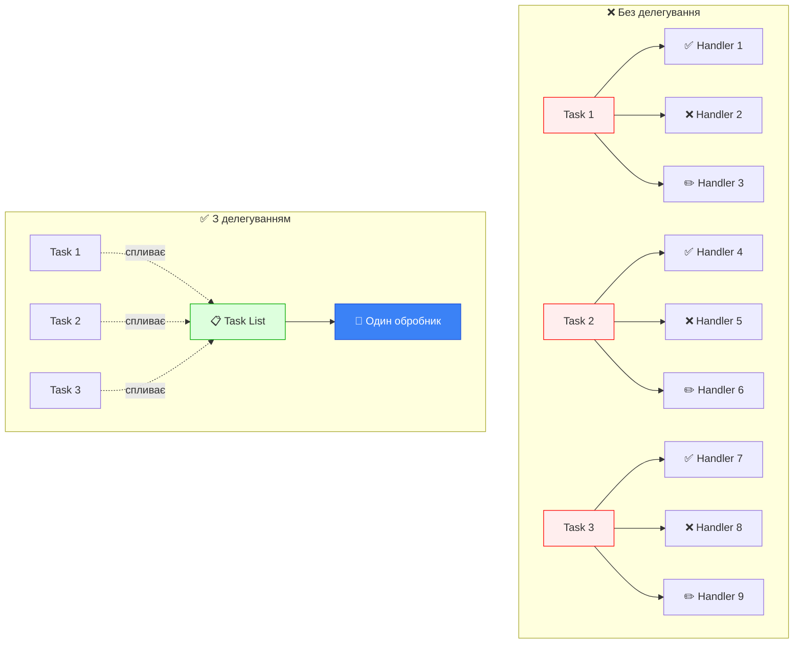

# Делегування подій (Event Delegation)

## Проблема: коли обробників занадто багато

Уявіть, що ви створюєте інтерактивну програму управління завданнями (TODO-list). У списку може бути **1000+ завдань**, і кожне має:

-   Кнопку "Виконано" ✅
-   Кнопку "Видалити" ❌
-   Кнопку "Редагувати" ✏️

**Наївний підхід** — призначити обробник кожній кнопці:

```javascript
// ⚠️ НЕЕФЕКТИВНИЙ КОД!
const tasks = document.querySelectorAll('.task')

tasks.forEach((task) => {
    const completeBtn = task.querySelector('.complete')
    const deleteBtn = task.querySelector('.delete')
    const editBtn = task.querySelector('.edit')

    completeBtn.addEventListener('click', handleComplete)
    deleteBtn.addEventListener('click', handleDelete)
    editBtn.addEventListener('click', handleEdit)
})

// Результат: 3000+ обробників подій в пам'яті! 😱
```

**Проблеми:**

-   💾 **Витік пам'яті** — тисячі функцій-обробників
-   🐌 **Повільна ініціалізація** — треба пройтися по всіх елементах
-   🔄 **Не працює для динамічних елементів** — нові завдання не матимуть обробників
-   🗑️ **Складна очистка** — треба видаляти обробники при видаленні завдань

::caution

### Критична проблема масштабування

Уявіть:

-   1000 завдань × 3 кнопки = **3000 обробників**
-   Кожен обробник займає ~100 байт = **300 КБ пам'яті**
-   При скролінгу списку з 10,000 елементів браузер **зависає**

Це класична проблема, яку вирішує делегування подій!
::

## Рятівне рішення: делегування подій

::tip

### 💡 Ключова ідея

Замість призначення обробника **кожному** елементу, призначте **один** обробник **батьківському** елементу. Він перехопить всі події від дочірніх елементів завдяки **механізму спливання**.

**Результат:** 3000 обробників → **1 обробник** = економія 99.97% пам'яті!
::

**Ефективний підхід:**

```javascript
// ✅ ОДИН обробник замість тисяч!
const taskList = document.querySelector('.task-list')

taskList.addEventListener('click', function (event) {
    const target = event.target

    // Перевіряємо, на яку кнопку клікнули
    if (target.classList.contains('complete')) {
        handleComplete(event)
    } else if (target.classList.contains('delete')) {
        handleDelete(event)
    } else if (target.classList.contains('edit')) {
        handleEdit(event)
    }
})
```

### Візуалізація делегування

::mermaid



::

## Навіщо використовувати делегування?

::card-group
::card{title="🚀 Продуктивність" icon="i-heroicons-rocket-launch"}
**Один обробник** замість тисяч.
Менше пам'яті, швидша ініціалізація.

```javascript
// 1 обробник vs 1000 обробників
// Економія: 99.9% пам'яті
```

::

::card{title="🔄 Динамічність" icon="i-heroicons-arrow-path"}
**Працює для майбутніх елементів**.
Додали новий елемент? Обробник вже працює!

```javascript
// Новий елемент автоматично обробляється
taskList.innerHTML += '<li>New task</li>'
```

::

::card{title="📝 Простота коду" icon="i-heroicons-code-bracket"}
**Менше коду для підтримки**.
Вся логіка в одному місці.

```javascript
// Одна функція керує всім
function handleClick(e) {
    // Вся логіка тут
}
```

::

::card{title="🗑️ Автоматична очистка" icon="i-heroicons-trash"}
**Не треба видаляти обробники**.
Видалили елемент? Обробник залишається на батьку.

```javascript
// Просто видаляємо елемент
element.remove() // Готово!
```

::
::

## Практичний приклад 1: Інтерактивна таблиця

Створимо таблицю, де можна виділяти комірки кліком. Це класичний приклад делегування.

### HTML структура

```html
<table id="data-table">
    <thead>
        <tr>
            <th>Ім'я</th>
            <th>Вік</th>
            <th>Місто</th>
        </tr>
    </thead>
    <tbody>
        <tr>
            <td>Олександр</td>
            <td>25</td>
            <td>Київ</td>
        </tr>
        <tr>
            <td>Марія</td>
            <td>30</td>
            <td>Львів</td>
        </tr>
        <tr>
            <td>Іван</td>
            <td>22</td>
            <td>Одеса</td>
        </tr>
    </tbody>
</table>
```

### Проблема: вкладені елементи

Якщо клік відбувається на тексті всередині `<td>`, `event.target` **не буде** `<td>`!

```html
<td>
    <strong>Олександр</strong>
    <!-- event.target буде <strong>! -->
</td>
```

**Рішення:** Використовуємо метод `closest()`:

```javascript
const table = document.getElementById('data-table')
let selectedCell = null

table.addEventListener('click', function (event) {
    // 1. Знаходимо найближчий <td> (навіть якщо клік на вкладеному елементі)
    const td = event.target.closest('td')

    // 2. Якщо клік не в <td> — ігноруємо
    if (!td) return

    // 3. Перевіряємо, чи <td> належить нашій таблиці (не вкладеній!)
    if (!table.contains(td)) return

    // 4. Виділяємо комірку
    highlight(td)
})

function highlight(td) {
    // Знімаємо попереднє виділення
    if (selectedCell) {
        selectedCell.classList.remove('highlighted')
    }

    // Додаємо нове виділення
    selectedCell = td
    selectedCell.classList.add('highlighted')
}
```

**Розбір коду:**

1. **`event.target.closest('td')`** — шукає найближчий елемент `<td>` вгору по дереву DOM

    - Якщо клік на тексті всередині `<td>`, метод знайде батьківський `<td>`
    - Якщо клік на `<th>` або поза таблицею, поверне `null`

2. **`if (!td) return`** — рання перевірка, якщо клік не на комірці

3. **`table.contains(td)`** — важлива перевірка для **вкладених таблиць**

    - Якщо всередині є ще одна таблиця, її комірки нас не цікавлять
    - Перевіряємо, чи `td` належить саме нашій таблиці

4. **`highlight(td)`** — виділяємо знайдену комірку

::mermaid

```mermaid
sequenceDiagram
    participant User as 👤 Користувач
    participant Strong as 📝 <strong>
    participant TD as 📦 <td>
    participant Table as 🗂️ <table>
    participant Handler as ⚙️ Обробник

    User->>Strong: Клік на текст
    Strong->>TD: Подія спливає
    TD->>Table: Подія спливає
    Table->>Handler: Виклик обробника

    Note over Handler: event.target = <strong>
    Handler->>Handler: closest('td') → знаходить <td>
    Handler->>Handler: contains(td) → перевіряє належність
    Handler->>TD: Додає клас .highlighted

    style Strong fill:#fef3c7,stroke:#f59e0b,color:#000
    style TD fill:#dbeafe,stroke:#3b82f6,color:#000
    style Table fill:#d1fae5,stroke:#10b981,color:#000
    style Handler fill:#ede9fe,stroke:#8b5cf6,color:#000
```

::

### Повний приклад з CSS

```html
<!DOCTYPE html>
<html lang="uk">
    <head>
        <meta charset="UTF-8" />
        <title>Делегування подій — Таблиця</title>
        <style>
            table {
                border-collapse: collapse;
                width: 100%;
                font-family: Arial, sans-serif;
            }

            th,
            td {
                border: 1px solid #ddd;
                padding: 12px;
                text-align: left;
            }

            th {
                background-color: #3b82f6;
                color: white;
                font-weight: bold;
            }

            tr:nth-child(even) {
                background-color: #f9fafb;
            }

            tr:hover {
                background-color: #f3f4f6;
            }

            .highlighted {
                background-color: #fef08a !important;
                border: 2px solid #eab308;
                font-weight: bold;
                transform: scale(1.05);
                transition: all 0.2s;
            }
        </style>
    </head>
    <body>
        <h1>Клікніть на комірку для виділення</h1>

        <table id="data-table">
            <thead>
                <tr>
                    <th>Ім'я</th>
                    <th>Вік</th>
                    <th>Місто</th>
                    <th>Професія</th>
                </tr>
            </thead>
            <tbody>
                <tr>
                    <td><strong>Олександр</strong></td>
                    <td>25</td>
                    <td><em>Київ</em></td>
                    <td>Розробник</td>
                </tr>
                <tr>
                    <td><strong>Марія</strong></td>
                    <td>30</td>
                    <td><em>Львів</em></td>
                    <td>Дизайнер</td>
                </tr>
                <tr>
                    <td><strong>Іван</strong></td>
                    <td>22</td>
                    <td><em>Одеса</em></td>
                    <td>Менеджер</td>
                </tr>
            </tbody>
        </table>

        <script>
            const table = document.getElementById('data-table')
            let selectedCell = null

            table.addEventListener('click', function (event) {
                const td = event.target.closest('td')

                if (!td) return
                if (!table.contains(td)) return

                highlight(td)
            })

            function highlight(td) {
                if (selectedCell) {
                    selectedCell.classList.remove('highlighted')
                }
                selectedCell = td
                selectedCell.classList.add('highlighted')
            }
        </script>
    </body>
</html>
```

## Практичний приклад 2: Меню з data-атрибутами

Делегування особливо потужне в поєднанні з **data-атрибутами**. Ви можете зберігати дії прямо в HTML!

### Патерн "Дії в розмітці"

```html
<div id="menu">
    <button data-action="save">💾 Зберегти</button>
    <button data-action="load">📂 Завантажити</button>
    <button data-action="print">🖨️ Друкувати</button>
    <button data-action="export">📤 Експортувати</button>
</div>

<script>
    class Menu {
        constructor(elem) {
            this._elem = elem
            // Прив'язуємо this, щоб методи працювали правильно
            elem.addEventListener('click', this.onClick.bind(this))
        }

        save() {
            alert('💾 Збереження даних...')
            console.log('Виклик API для збереження')
        }

        load() {
            alert('📂 Завантаження даних...')
            console.log('Виклик API для завантаження')
        }

        print() {
            alert('🖨️ Друк документа...')
            window.print()
        }

        export() {
            alert('📤 Експорт даних...')
            console.log('Генерація CSV файлу')
        }

        onClick(event) {
            // Отримуємо data-action з клікнутого елемента
            const action = event.target.dataset.action

            // Якщо action існує і є метод з такою назвою
            if (action && typeof this[action] === 'function') {
                this[action]() // Викликаємо метод
            }
        }
    }

    const menu = new Menu(document.getElementById('menu'))
</script>
```

**Переваги підходу:**

::tip

### 🎯 Чому data-атрибути + делегування — ідеальна пара?

**1. Декларативність** — дія описана прямо в HTML

```html
<button data-action="delete">Видалити</button>
<!-- Зразу зрозуміло, що робить кнопка! -->
```

**2. Гнучкість** — легко додавати нові кнопки

```html
<!-- Просто додаємо нову кнопку -->
<button data-action="newFeature">Нова функція</button>
```

**3. Розділення відповідальності**

-   HTML описує **що** (структура + наміри)
-   JavaScript реалізує **як** (логіка)

**4. Один обробник для всіх**

-   Не важливо, 3 кнопки чи 300
-   Працює для динамічно доданих кнопок
    ::

### Розширена версія з параметрами

```html
<div id="advanced-menu">
    <button data-action="notify" data-message="Успішно!" data-type="success">✅ Успіх</button>
    <button data-action="notify" data-message="Помилка!" data-type="error">❌ Помилка</button>
    <button data-action="notify" data-message="Попередження" data-type="warning">⚠️ Попередження</button>
</div>

<script>
    class AdvancedMenu {
        constructor(elem) {
            this._elem = elem
            elem.addEventListener('click', this.onClick.bind(this))
        }

        notify(params) {
            const { message, type } = params

            const colors = {
                success: '#10b981',
                error: '#ef4444',
                warning: '#f59e0b',
            }

            const notification = document.createElement('div')
            notification.textContent = message
            notification.style.cssText = `
        position: fixed;
        top: 20px;
        right: 20px;
        padding: 15px 25px;
        background: ${colors[type]};
        color: white;
        border-radius: 8px;
        font-weight: bold;
        animation: slideIn 0.3s;
      `

            document.body.appendChild(notification)

            setTimeout(() => {
                notification.remove()
            }, 3000)
        }

        onClick(event) {
            const action = event.target.dataset.action
            if (!action) return

            // Збираємо всі data-атрибути як параметри
            const params = { ...event.target.dataset }
            delete params.action // Видаляємо сам action

            if (typeof this[action] === 'function') {
                this[action](params)
            }
        }
    }

    const advMenu = new AdvancedMenu(document.getElementById('advanced-menu'))
</script>
```

## Патерн "Поведінки" (Behaviors)

Делегування дозволяє створювати **переповикористовувані поведінки** через атрибути.

### Приклад 1: Лічильник

```html
<style>
    [data-counter] {
        padding: 10px 20px;
        font-size: 24px;
        font-weight: bold;
        cursor: pointer;
        border: 2px solid #3b82f6;
        background: white;
        border-radius: 8px;
        transition: all 0.2s;
    }

    [data-counter]:hover {
        background: #3b82f6;
        color: white;
        transform: scale(1.1);
    }
</style>

<p>Лічильники (клікніть для збільшення):</p>
<button data-counter>0</button>
<button data-counter>0</button>
<button data-counter>0</button>

<script>
    // ОДИН обробник на весь документ!
    document.addEventListener('click', function (event) {
        // Перевіряємо наявність атрибута data-counter
        if (event.target.dataset.counter !== undefined) {
            // Збільшуємо значення
            const currentValue = parseInt(event.target.textContent) || 0
            event.target.textContent = currentValue + 1
        }
    })
</script>
```

**Магія:** Додайте `data-counter` до будь-якого елемента — він автоматично стає лічильником!

### Приклад 2: Перемикач видимості

```html
<button data-toggle-id="secret-content">🔓 Показати секретний вміст</button>

<div id="secret-content" hidden>
    <h3>🎉 Секретний вміст!</h3>
    <p>Ви відкрили приховану інформацію.</p>
</div>

<button data-toggle-id="bonus-info">📋 Додаткова інформація</button>

<div id="bonus-info" hidden>
    <p>Тут розміщена додаткова інформація.</p>
</div>

<script>
    document.addEventListener('click', function (event) {
        const toggleId = event.target.dataset.toggleId

        if (toggleId) {
            const elem = document.getElementById(toggleId)
            if (elem) {
                elem.hidden = !elem.hidden

                // Змінюємо текст кнопки
                event.target.textContent = elem.hidden ? '🔓 Показати' : '🔒 Сховати'
            }
        }
    })
</script>
```

### Приклад 3: Підтвердження дій

```html
<style>
    .danger-zone {
        padding: 20px;
        background: #fee;
        border: 2px solid #f00;
        border-radius: 8px;
    }

    [data-confirm] {
        background: #ef4444;
        color: white;
        padding: 10px 20px;
        border: none;
        border-radius: 5px;
        cursor: pointer;
        font-weight: bold;
    }

    [data-confirm]:hover {
        background: #dc2626;
    }
</style>

<div class="danger-zone">
    <h3>⚠️ Небезпечна зона</h3>
    <button data-confirm="Ви впевнені, що хочете видалити ВСІ дані?" data-action="deleteAll">
        🗑️ Видалити всі дані
    </button>

    <button data-confirm="Скинути налаштування до заводських?" data-action="reset">🔄 Скинути налаштування</button>
</div>

<script>
    document.addEventListener('click', function (event) {
        const confirmMessage = event.target.dataset.confirm

        if (confirmMessage) {
            // Показуємо діалог підтвердження
            if (confirm(confirmMessage)) {
                const action = event.target.dataset.action
                console.log(`Виконую дію: ${action}`)
                alert(`✅ Дія "${action}" виконана!`)
            } else {
                console.log('Дію скасовано користувачем')
            }
        }
    })
</script>
```

## Комбінування кількох поведінок

Один елемент може мати **кілька поведінок** одночасно:

```html
<button data-counter data-confirm="Збільшити лічильник?" data-sound="click">Лічильник з підтвердженням</button>

<script>
    document.addEventListener('click', function (event) {
        const target = event.target

        // Поведінка 1: Підтвердження
        if (target.dataset.confirm) {
            if (!confirm(target.dataset.confirm)) {
                return // Зупиняємо, якщо не підтвердили
            }
        }

        // Поведінка 2: Звук
        if (target.dataset.sound) {
            playSound(target.dataset.sound)
        }

        // Поведінка 3: Лічильник
        if (target.dataset.counter !== undefined) {
            const value = parseInt(target.textContent) || 0
            target.textContent = value + 1
        }
    })

    function playSound(soundName) {
        console.log(`🔊 Відтворення звуку: ${soundName}`)
        // new Audio(`/sounds/${soundName}.mp3`).play();
    }
</script>
```

## Складний приклад: TODO List з делегуванням

Створимо повноцінний додаток для управління завданнями з **мінімальним кодом**:

```html
<!DOCTYPE html>
<html lang="uk">
    <head>
        <meta charset="UTF-8" />
        <title>TODO List з делегуванням</title>
        <style>
            * {
                margin: 0;
                padding: 0;
                box-sizing: border-box;
            }

            body {
                font-family: 'Segoe UI', sans-serif;
                background: linear-gradient(135deg, #667eea 0%, #764ba2 100%);
                min-height: 100vh;
                padding: 40px 20px;
            }

            .container {
                max-width: 600px;
                margin: 0 auto;
                background: white;
                border-radius: 15px;
                box-shadow: 0 20px 60px rgba(0, 0, 0, 0.3);
                overflow: hidden;
            }

            .header {
                background: linear-gradient(135deg, #667eea 0%, #764ba2 100%);
                color: white;
                padding: 30px;
                text-align: center;
            }

            .header h1 {
                font-size: 32px;
                margin-bottom: 10px;
            }

            .add-task {
                padding: 20px;
                background: #f8f9fa;
                border-bottom: 2px solid #e9ecef;
            }

            .add-task input {
                width: 100%;
                padding: 15px;
                border: 2px solid #dee2e6;
                border-radius: 8px;
                font-size: 16px;
                outline: none;
                transition: border-color 0.3s;
            }

            .add-task input:focus {
                border-color: #667eea;
            }

            #task-list {
                list-style: none;
                padding: 0;
            }

            .task {
                padding: 20px;
                border-bottom: 1px solid #e9ecef;
                display: flex;
                align-items: center;
                gap: 15px;
                transition: background 0.2s;
            }

            .task:hover {
                background: #f8f9fa;
            }

            .task.completed {
                background: #d1fae5;
            }

            .task.completed .task-text {
                text-decoration: line-through;
                color: #6b7280;
            }

            .task-text {
                flex: 1;
                font-size: 16px;
            }

            .task button {
                padding: 8px 12px;
                border: none;
                border-radius: 5px;
                cursor: pointer;
                font-size: 16px;
                transition: transform 0.2s;
            }

            .task button:hover {
                transform: scale(1.1);
            }

            .task button:active {
                transform: scale(0.95);
            }

            [data-action='toggle'] {
                background: #10b981;
            }

            [data-action='delete'] {
                background: #ef4444;
            }

            .stats {
                padding: 20px;
                background: #f8f9fa;
                text-align: center;
                color: #6b7280;
                font-size: 14px;
            }
        </style>
    </head>
    <body>
        <div class="container">
            <div class="header">
                <h1>📝 Мої завдання</h1>
                <p>Делегування подій у дії</p>
            </div>

            <div class="add-task">
                <input
                    type="text"
                    id="new-task-input"
                    placeholder="Додати нове завдання..."
                    data-action="add-on-enter"
                />
            </div>

            <ul id="task-list"></ul>

            <div class="stats" id="stats">Завдань: 0 | Виконано: 0</div>
        </div>

        <script>
            const taskList = document.getElementById('task-list')
            const input = document.getElementById('new-task-input')
            const stats = document.getElementById('stats')

            let taskId = 0
            let tasks = []

            // ЄДИНИЙ обробник для ВСЬОГО документа!
            document.addEventListener('click', function (event) {
                const action = event.target.dataset.action

                if (action === 'toggle') {
                    toggleTask(event.target.dataset.id)
                } else if (action === 'delete') {
                    deleteTask(event.target.dataset.id)
                }
            })

            // Обробка Enter для додавання
            document.addEventListener('keypress', function (event) {
                if (event.target.dataset.action === 'add-on-enter' && event.key === 'Enter') {
                    addTask()
                }
            })

            function addTask() {
                const text = input.value.trim()
                if (!text) return

                const task = {
                    id: taskId++,
                    text: text,
                    completed: false,
                }

                tasks.push(task)
                render()
                input.value = ''
                input.focus()
            }

            function toggleTask(id) {
                const task = tasks.find((t) => t.id == id)
                if (task) {
                    task.completed = !task.completed
                    render()
                }
            }

            function deleteTask(id) {
                tasks = tasks.filter((t) => t.id != id)
                render()
            }

            function render() {
                taskList.innerHTML = tasks
                    .map(
                        (task) => `
        <li class="task ${task.completed ? 'completed' : ''}">
          <span class="task-text">${task.text}</span>
          <button data-action="toggle" data-id="${task.id}">
            ${task.completed ? '↩️' : '✅'}
          </button>
          <button data-action="delete" data-id="${task.id}">
            🗑️
          </button>
        </li>
      `,
                    )
                    .join('')

                updateStats()
            }

            function updateStats() {
                const total = tasks.length
                const completed = tasks.filter((t) => t.completed).length
                stats.textContent = `Завдань: ${total} | Виконано: ${completed}`
            }

            // Початкові дані
            tasks = [
                { id: taskId++, text: 'Вивчити делегування подій', completed: true },
                { id: taskId++, text: 'Створити TODO додаток', completed: false },
                { id: taskId++, text: 'Практикуватись з JavaScript', completed: false },
            ]
            render()
        </script>
    </body>
</html>
```

**Що робить цей код:**

-   ✅ Один обробник `click` для всього документа
-   🔄 Динамічне додавання/видалення завдань
-   ⚡ Миттєва реакція без переприв'язки обробників
-   📊 Автоматичне оновлення статистики
-   🎨 Красивий дизайн з анімаціями

## Алгоритм делегування подій

::steps

### Крок 1: Визначте контейнер

Знайдіть спільного батька для всіх елементів, з якими треба працювати.

```javascript
const container = document.querySelector('.task-list')
```

### Крок 2: Додайте обробник на контейнер

Призначте **один** обробник події (зазвичай `click`).

```javascript
container.addEventListener('click', handleClick)
```

### Крок 3: Визначте цільовий елемент

Використовуйте `event.target` або `event.target.closest()`.

```javascript
function handleClick(event) {
    const button = event.target.closest('button')
    if (!button) return
    // ...
}
```

### Крок 4: Перевірте належність

Переконайтеся, що елемент належить вашому контейнеру.

```javascript
if (!container.contains(button)) return
```

### Крок 5: Виконайте дію

Обробіть подію відповідно до логіки.

```javascript
const action = button.dataset.action
if (action === 'delete') {
    deleteItem(button.dataset.id)
}
```

::

## Методи для роботи з DOM

::field-group
::field{name="element.closest(selector)" type="method"}
Шукає **найближчого предка** (включаючи сам елемент), який відповідає селектору.

```javascript
// Клік на <span> всередині <button>
event.target.closest('button') // Знайде батьківський button
```

**Повертає:** елемент або `null`
::

::field{name="element.matches(selector)" type="method"}
Перевіряє, чи відповідає **сам елемент** селектору.

```javascript
if (event.target.matches('.delete-btn')) {
    // Це кнопка видалення
}
```

**Повертає:** `true` або `false`
::

::field{name="element.contains(child)" type="method"}
Перевіряє, чи є `child` нащадком `element`.

```javascript
if (container.contains(event.target)) {
    // Клік всередині контейнера
}
```

**Повертає:** `true` або `false`
::
::

### Порівняння методів

```javascript
const container = document.querySelector('.container')

container.addEventListener('click', (e) => {
    const target = e.target

    // 1. matches() — перевірка самого елемента
    if (target.matches('.delete-btn')) {
        console.log('Клік на кнопці видалення')
    }

    // 2. closest() — пошук найближчого предка
    const card = target.closest('.card')
    if (card) {
        console.log('Клік всередині картки')
    }

    // 3. contains() — перевірка належності
    if (container.contains(target)) {
        console.log('Клік всередині контейнера')
    }
})
```

## Обмеження делегування

::warning

### ⚠️ Коли делегування НЕ працює

**1. Події, що не спливають**

Деякі події не спливають, тому делегування не спрацює:

-   `focus` / `blur` (використовуйте `focusin` / `focusout`)
-   `mouseenter` / `mouseleave` (використовуйте `mouseover` / `mouseout`)
-   `scroll` (прокрутка не спливає)
-   `load` / `unload`

```javascript
// ❌ Не спрацює
container.addEventListener('focus', handler)

// ✅ Спрацює
container.addEventListener('focusin', handler)
```

**2. stopPropagation() зупиняє делегування**

Якщо хтось викличе `event.stopPropagation()`, подія не дійде до контейнера:

```javascript
button.addEventListener('click', (e) => {
    e.stopPropagation() // Делегування НЕ спрацює!
})

container.addEventListener('click', () => {
    console.log('Не виконається!')
})
```

**3. Продуктивність для дуже великих контейнерів**

Якщо контейнер містить **десятки тисяч** елементів, обробник спрацьовуватиме при кліку **на кожен**, навіть якщо вас цікавить лише частина.

**Рішення:** Використовуйте більш специфічні контейнери або умови фільтрації.
::

## Переваги vs Недоліки

::tabs
::tabs-item{label="✅ Переваги"}
| Перевага | Опис |
|:---------|:-----|
| 🚀 **Продуктивність** | Один обробник замість тисяч |
| 💾 **Пам'ять** | Менше об'єктів-обробників |
| 🔄 **Динамічність** | Працює для майбутніх елементів |
| 📝 **Простота** | Менше коду для підтримки |
| 🗑️ **Очистка** | Не треба видаляти обробники при видаленні елементів |
| 🎨 **Гнучкість** | Легко змінювати логіку в одному місці |
::

::tabs-item{label="❌ Недоліки"}
| Недолік | Рішення |
|:--------|:--------|
| ⚠️ **Не для несплываючих подій** | Використовуйте альтернативи (`focusin` замість `focus`) |
| 🛑 **Чутливість до stopPropagation** | Навчіть команду не зловживати цим методом |
| 🐌 **Потенційне навантаження** | Використовуйте специфічніші контейнери |
| 🔍 **Складність debugging** | Використовуйте data-атрибути для чіткої ідентифікації |
::
::

## Best Practices (Найкращі практики)

::tip

### 🎯 Рекомендації для ефективного делегування

**1. Використовуйте data-атрибути**

```html
<button data-action="delete" data-id="123">Видалити</button>
```

**2. Завжди перевіряйте належність**

```javascript
const item = event.target.closest('.item')
if (!item || !container.contains(item)) return
```

**3. Рання перевірка (early return)**

```javascript
if (!event.target.closest('.button')) return
// Вся логіка тут
```

**4. Один обробник — одна відповідальність**

```javascript
// ❌ Погано — все в одному обробнику
document.addEventListener('click', handleEverything)

// ✅ Добре — розділені обробники
document.addEventListener('click', handleButtons)
menu.addEventListener('click', handleMenuItems)
```

**5. Використовуйте addEventListener на document**

```javascript
// ✅ Для глобальних поведінок
document.addEventListener('click', handler)
```

**6. Не забувайте про Event delegation на document**

```javascript
// ⚠️ Не використовуйте document.onclick
document.onclick = handler // Може конфліктувати!

// ✅ Використовуйте addEventListener
document.addEventListener('click', handler)
```

::

## Порівняння: з делегуванням vs без

::code-group

```javascript [❌ Без делегування]
// Призначаємо обробник кожній кнопці
const buttons = document.querySelectorAll('.delete-btn')

buttons.forEach((button) => {
    button.addEventListener('click', function () {
        const id = this.dataset.id
        deleteItem(id)
    })
})

// Проблеми:
// 1. Нові кнопки не матимуть обробника
// 2. Треба видаляти обробники
// 3. Багато обробників у пам'яті

// Додаємо нову кнопку
const newBtn = document.createElement('button')
newBtn.className = 'delete-btn'
newBtn.dataset.id = '999'
// ❌ Обробника немає!
```

```javascript [✅ З делегуванням]
// Один обробник на контейнер
const container = document.querySelector('.container')

container.addEventListener('click', function (event) {
    const deleteBtn = event.target.closest('.delete-btn')

    if (deleteBtn && container.contains(deleteBtn)) {
        const id = deleteBtn.dataset.id
        deleteItem(id)
    }
})

// Переваги:
// 1. Нові кнопки працюють автоматично ✅
// 2. Не треба видаляти обробники ✅
// 3. Один обробник ✅

// Додаємо нову кнопку
const newBtn = document.createElement('button')
newBtn.className = 'delete-btn'
newBtn.dataset.id = '999'
// ✅ Обробник вже працює!
```

::

## Підсумки

::steps

### Делегування = один обробник для всіх

Замість призначення обробника кожному елементу, призначте **один** обробник **батьківському** елементу.

### Використовуйте event.target

`event.target` показує, на якому елементі насправді відбулася подія.  
`event.target.closest(selector)` знаходить найближчий елемент.

### Працює для динамічних елементів

Нові елементи автоматично обробляються без додаткового коду.

### Переваги: продуктивність + простота

-   Менше пам'яті (один обробник)
-   Менше коду (одна функція)
-   Працює для майбутніх елементів

### Обмеження: події повинні спливати

Не працює для `focus`, `blur`, `scroll` та інших несплываючих подій.  
Використовуйте альтернативи: `focusin`/`focusout`.

### Best practice: data-атрибути

Зберігайте дії та параметри в `data-*` атрибутах для чистого коду.
::

## Практичні завдання

::tip

### Завдання 1: Фільтрована галерея

Створіть галерею зображень з фільтрами:

-   Кнопки фільтрів: "Всі", "Природа", "Міста", "Люди"
-   При кліку на фільтр показуються лише відповідні зображення
-   Використайте **делегування** для кнопок фільтрів
-   Додайте клас `.active` для активного фільтра

**Підказка:** Один обробник на контейнер з кнопками, data-атрибут для категорії.
::

::tip

### Завдання 2: Кошик покупок

Реалізуйте кошик покупок:

-   Кнопки: "Додати", "Видалити", "+1", "-1"
-   Автоматичний підрахунок загальної суми
-   Збереження в `localStorage`
-   Використайте **делегування** для всіх кнопок

**Підказка:** Один обробник на `<ul>`, різні `data-action` для кнопок.
::

::tip

### Завдання 3: Конструктор форм

Створіть конструктор, де можна:

-   Додавати поля форми (текст, email, checkbox)
-   Видаляти поля
-   Змінювати порядок (вгору/вниз)
-   Використайте **делегування** + **data-атрибути**

**Підказка:** `data-action` для дій, `data-field-id` для ідентифікації.
::

## Додаткові ресурси

::card-group
::card{title="📚 MDN Web Docs" icon="i-heroicons-book-open"}
[Event delegation](https://developer.mozilla.org/en-US/docs/Learn/JavaScript/Building_blocks/Events#event_delegation)

[Element.closest()](https://developer.mozilla.org/en-US/docs/Web/API/Element/closest)
::

::card{title="🎓 JavaScript.info" icon="i-heroicons-academic-cap"}
[Event delegation](https://javascript.info/event-delegation) — детальний розбір патерну
::

::card{title="🔗 Пов'язані статті" icon="i-heroicons-link"}
[Попередня: Бульбашковий механізм](./2-Бульбашковий-механізм.md)

[Наступна: Типові дії браузера](./4-Типові-дії-браузера.md)
::
::

---

**Наступна стаття**: [Типові дії браузера](./4-Типові-дії-браузера.md) — як контролювати стандартну поведінку браузера
