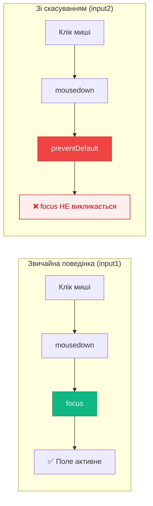
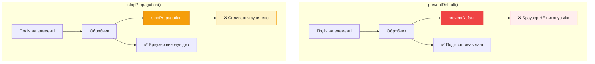

# Типові дії браузера та `preventDefault()`

## Коли браузер "думає за нас"

Уявіть: ви клікаєте на посилання — **браузер автоматично переходить за ним**. Натискаєте Enter у формі — вона **відправляється на сервер**. Клікаєте правою кнопкою — **з'являється контекстне меню**.

Ці дії відбуваються **автоматично**, без вашого коду. Браузер має **вбудовану логіку** для багатьох подій. Така поведінка називається **типовою дією браузера (browser default action)**.

::note
### 🤔 Чому це важливо?

Уявіть SPA (Single Page Application): клік на посилання **не повинен** перезавантажувати сторінку. Або форма, яка валідується **перед** відправкою на сервер. У таких випадках потрібно **скасувати** типову дію браузера і виконати власну логіку.
::

## Популярні типові дії браузера

Ось найпоширеніші автоматичні дії, які виконує браузер:

::card-group
::card
  ---
  title: "🔗 Клік на посиланні"
  icon: i-heroicons-link
  ---
  **Подія:** `click` на `<a href="...">`  
  **Типова дія:** Перехід на URL у атрібуті `href`

  ```html
  <a href="/about">Про нас</a>
  <!-- Клік → браузер переходить на /about -->
  ```
::

::card
  ---
  title: "📋 Відправка форми"
  icon: i-heroicons-paper-airplane
  ---
  **Подія:** `submit` на `<form>`  
  **Типова дія:** Відправка HTTP-запиту на сервер

  ```html
  <form method="POST" action="/api/login">
    <button type="submit">Увійти</button>
  </form>
  <!-- Клік → браузер відправляє POST-запит -->
  ```
::

::card
  ---
  title: "🖱️ Правий клік"
  icon: i-heroicons-cursor-arrow-rays
  ---
  **Подія:** `contextmenu`  
  **Типова дія:** Показ контекстного меню браузера

  ```html
  <div>Правий клік → контекстне меню</div>
  ```
::

::card
  ---
  title: "✏️ Виділення тексту"
  icon: i-heroicons-cursor-arrow-ripple
  ---
  **Подія:** `mousedown` + рух миші  
  **Типова дія:** Виділення тексту

  ```html
  <p>Натисніть і перетягніть → виділення</p>
  ```
::

::card
  ---
  title: "⌨️ Введення в input"
  icon: i-heroicons-pencil-square
  ---
  **Подія:** `keydown` у `<input>`  
  **Типова дія:** Додавання символу в поле

  ```html
  <input type="text">
  <!-- Натискання клавіші → символ з'являється -->
  ```
::

::card
  ---
  title: "☑️ Чекбокс"
  icon: i-heroicons-check-circle
  ---
  **Подія:** `click` на `<input type="checkbox">`  
  **Типова дія:** Зміна стану (вкл/викл)

  ```html
  <input type="checkbox">
  <!-- Клік → стан змінюється -->
  ```
::
::

### Повний список типових дій

| Подія | Елемент | Типова дія |
|:------|:--------|:-----------|
| `click` | `<a>` | Перехід на URL з `href` |
| `submit` | `<form>` | Відправка форми на сервер |
| `contextmenu` | Будь-який | Показ контекстного меню |
| `mousedown` | Текст | Початок виділення тексту |
| `focus` | `<input>` | Встановлення фокусу, курсор у полі |
| `keydown` | `<input>` | Введення символу |
| `wheel` | Будь-який | Прокрутка сторінки |
| `touchmove` | Сенсорний екран | Прокрутка на мобільних |
| `dragstart` | Будь-який | Початок перетягування |

## Скасування типової дії: `event.preventDefault()`

Щоб **запобігти** типовій дії браузера, використовуйте метод **`event.preventDefault()`**:

```javascript
element.addEventListener('click', function(event) {
  event.preventDefault(); // ❌ Скасовуємо типову дію
  // Тут ваш власний код
});
```

### Приклад 1: Посилання без переходу

**Задача:** Зробити посилання, яке **не переходить** на іншу сторінку, а виконує JavaScript-код.

```html
<a href="https://google.com" id="link">Не переходь на Google</a>

<script>
  const link = document.getElementById('link');
  
  link.addEventListener('click', function(event) {
    event.preventDefault(); // ❌ Скасовуємо перехід
    
    alert('Перехід скасовано! Залишаємося на сторінці.');
    console.log('Виконується JavaScript замість переходу');
  });
</script>
```

**Що відбувається:**
1. Користувач клікає на посилання
2. Браузер генерує подію `click`
3. Наш обробник викликає `preventDefault()`
4. ❌ Браузер **НЕ** переходить на URL
5. ✅ Виконується наш код (alert)

::mermaid
```mermaid
sequenceDiagram
    participant User as 👤 Користувач
    participant Link as 🔗 <a href>
    participant Handler as ⚙️ Обробник
    participant Browser as 🌐 Браузер
    
    User->>Link: Клік на посилання
    Link->>Handler: Генерує подію click
    Handler->>Handler: event.preventDefault()
    Handler->>Handler: alert('Скасовано!')
    
    Note over Browser: ❌ Типову дію скасовано!
    Note over Browser: Браузер НЕ переходить на URL
    
    style Handler fill:#10b981,stroke:#059669,color:#ffffff
    style Browser fill:#ef4444,stroke:#dc2626,color:#ffffff
```
::

### Приклад 2: Форма з власною валідацією

**Задача:** Перевірити форму **перед** відправкою на сервер.

```html
<!DOCTYPE html>
<html lang="uk">
<head>
  <meta charset="UTF-8">
  <title>Форма з валідацією</title>
  <style>
    .error {
      color: #ef4444;
      font-size: 14px;
      margin-top: 5px;
    }
    input.invalid {
      border: 2px solid #ef4444;
    }
    input.valid {
      border: 2px solid #10b981;
    }
  </style>
</head>
<body>
  <h1>Реєстрація</h1>
  
  <form id="registrationForm" action="/api/register" method="POST">
    <div>
      <label>Email:</label><br>
      <input type="email" name="email" id="email" required>
      <div class="error" id="emailError"></div>
    </div>
    
    <div style="margin-top: 10px;">
      <label>Пароль (мін. 8 символів):</label><br>
      <input type="password" name="password" id="password" required>
      <div class="error" id="passwordError"></div>
    </div>
    
    <button type="submit" style="margin-top: 15px;">Зареєструватися</button>
  </form>

  <script>
    const form = document.getElementById('registrationForm');
    const emailInput = document.getElementById('email');
    const passwordInput = document.getElementById('password');
    const emailError = document.getElementById('emailError');
    const passwordError = document.getElementById('passwordError');

    form.addEventListener('submit', function(event) {
      // Скидаємо попередні помилки
      emailError.textContent = '';
      passwordError.textContent = '';
      emailInput.classList.remove('invalid', 'valid');
      passwordInput.classList.remove('invalid', 'valid');
      
      let isValid = true;

      // Валідація email
      const emailValue = emailInput.value.trim();
      if (!emailValue.includes('@')) {
        emailError.textContent = '❌ Email має містити @';
        emailInput.classList.add('invalid');
        isValid = false;
      } else {
        emailInput.classList.add('valid');
      }

      // Валідація пароля
      const passwordValue = passwordInput.value;
      if (passwordValue.length < 8) {
        passwordError.textContent = '❌ Пароль має бути мінімум 8 символів';
        passwordInput.classList.add('invalid');
        isValid = false;
      } else {
        passwordInput.classList.add('valid');
      }

      // Якщо є помилки — скасовуємо відправку
      if (!isValid) {
        event.preventDefault(); // ❌ Скасовуємо відправку форми
        console.log('Форма НЕ відправлена через помилки валідації');
      } else {
        console.log('✅ Форма валідна, відправляємо на сервер');
        // Браузер відправить форму автоматично
      }
    });
  </script>
</body>
</html>
```

**Розбір коду:**

1. **Слухаємо подію `submit`** — спрацьовує при натисканні на кнопку або Enter
2. **Валідуємо поля** — перевіряємо email та пароль
3. **Якщо є помилки:**
   - Викликаємо `event.preventDefault()` — **скасовуємо відправку**
   - Показуємо повідомлення про помилки
4. **Якщо все OK:**
   - НЕ викликаємо `preventDefault()`
   - Браузер виконує типову дію — **відправляє форму**

### Приклад 3: Custom контекстне меню

**Задача:** Замінити стандартне контекстне меню браузера на власне.

```html
<!DOCTYPE html>
<html lang="uk">
<head>
  <meta charset="UTF-8">
  <title>Власне контекстне меню</title>
  <style>
    .custom-menu {
      display: none;
      position: absolute;
      background: white;
      border: 2px solid #3b82f6;
      border-radius: 8px;
      padding: 10px 0;
      box-shadow: 0 4px 12px rgba(0,0,0,0.2);
      z-index: 1000;
      min-width: 200px;
    }
    
    .custom-menu.active {
      display: block;
    }
    
    .menu-item {
      padding: 10px 20px;
      cursor: pointer;
      transition: background 0.2s;
    }
    
    .menu-item:hover {
      background: #dbeafe;
    }
    
    .target-area {
      width: 400px;
      height: 300px;
      border: 3px dashed #3b82f6;
      display: flex;
      align-items: center;
      justify-content: center;
      background: #f0f9ff;
      font-size: 18px;
      color: #1e40af;
    }
  </style>
</head>
<body>
  <h1>Клікніть правою кнопкою на область</h1>
  
  <div class="target-area" id="targetArea">
    ПРАВИЙ КЛІК СЮДИ
  </div>

  <div class="custom-menu" id="customMenu">
    <div class="menu-item" data-action="copy">📋 Копіювати</div>
    <div class="menu-item" data-action="paste">📄 Вставити</div>
    <div class="menu-item" data-action="delete">🗑️ Видалити</div>
    <hr>
    <div class="menu-item" data-action="info">ℹ️ Інформація</div>
  </div>

  <script>
    const targetArea = document.getElementById('targetArea');
    const customMenu = document.getElementById('customMenu');

    // Показуємо власне меню при правому кліку
    targetArea.addEventListener('contextmenu', function(event) {
      event.preventDefault(); // ❌ Скасовуємо стандартне меню браузера

      // Показуємо наше меню на позиції курсора
      customMenu.style.left = event.pageX + 'px';
      customMenu.style.top = event.pageY + 'px';
      customMenu.classList.add('active');
    });

    // Приховуємо меню при кліку в будь-якому місці
    document.addEventListener('click', function() {
      customMenu.classList.remove('active');
    });

    // Обробка кліків на пунктах меню
    customMenu.addEventListener('click', function(event) {
      const action = event.target.dataset.action;
      
      if (action) {
        alert(`Ви вибрали: ${action}`);
        customMenu.classList.remove('active');
      }
    });
  </script>
</body>
</html>
```

**Як це працює:**
1. При правому кліку на область викликається подія `contextmenu`
2. `event.preventDefault()` — **скасовуємо** стандартне меню
3. Показуємо **власне** меню на позиції курсора
4. Обробляємо кліки на пунктах меню через делегування

## Альтернативний спосіб: `return false`

Для обробників, призначених через **`on<event>`** (НЕ `addEventListener`), можна використовувати `return false`:

```html
<!-- HTML-атрибут -->
<a href="/page" onclick="alert('Клік!'); return false;">Посилання</a>

<!-- DOM-властивість -->
<script>
  element.onclick = function() {
    alert('Клік!');
    return false; // Еквівалент event.preventDefault()
  };
</script>
```

::warning
### ⚠️ Обмеження `return false`

**Працює ТІЛЬКИ для:**
- HTML-атрибутів (`onclick=""`)
- DOM-властивостей (`element.onclick = ...`)

**НЕ працює для:**
- `addEventListener()` — потрібен `event.preventDefault()`

```javascript
// ❌ НЕ ПРАЦЮЄ
element.addEventListener('click', function() {
  return false; // Ігнорується!
});

// ✅ ПРАЦЮЄ
element.addEventListener('click', function(event) {
  event.preventDefault();
});
```
::

### Порівняння методів

::tabs
:::tab{label="preventDefault()"}
```javascript
// ✅ Найкращий спосіб — завжди працює
element.addEventListener('click', function(event) {
  event.preventDefault();
  // Ваш код
});
```

**Переваги:**
- Працює для `addEventListener`
- Явний і зрозумілий
- Рекомендований підхід
:::

:::tab{label="return false"}
```javascript
// ⚠️ Працює тільки для on<event>
element.onclick = function() {
  // Ваш код
  return false;
};
```

**Переваги:**
- Коротший синтаксис
- Працює в HTML-атрибутах

**Недоліки:**
- НЕ працює з `addEventListener`
- Можна випадково забути `return`
:::

:::tab{label="HTML-атрибут"}
```html
<!-- ✅ Працює, але не рекомендується -->
<a href="#" onclick="handleClick(); return false;">
  Посилання
</a>

<script>
function handleClick() {
  alert('Клік!');
}
</script>
```

**Недоліки:**
- Змішування HTML та JavaScript
- Важко підтримувати
:::
::

## Ланцюжок подій: коли одна подія викликає іншу

Деякі події **викликають інші події**. Якщо скасувати першу — наступні не виконаються.

### Приклад: `mousedown` → `focus`

```html
<p>Спробуйте клікнути на обидва поля:</p>

<input type="text" value="Фокус працює" id="input1">
<input type="text" value="Фокус НЕ працює" id="input2">

<script>
  const input1 = document.getElementById('input1');
  const input2 = document.getElementById('input2');

  // Звичайний input — фокус працює
  input1.addEventListener('focus', function() {
    console.log('✅ Input 1 отримав фокус');
    this.style.background = '#dbeafe';
  });

  // Скасовуємо mousedown — фокус НЕ працює
  input2.addEventListener('mousedown', function(event) {
    event.preventDefault(); // ❌ Скасовуємо mousedown
    console.log('⚠️ mousedown скасовано на input 2');
  });

  input2.addEventListener('focus', function() {
    console.log('Input 2 отримав фокус'); // НЕ ВИКОНАЄТЬСЯ при кліку!
    this.style.background = '#fef3c7';
  });
</script>
```

**Що відбувається:**

1. **Звичайна поведінка (input1):**
   - Клік → `mousedown` → `focus` → поле активне ✅

2. **Зі скасуванням (input2):**
   - Клік → `mousedown` → `preventDefault()` → `focus` НЕ викликається ❌

**Примітка:** Фокус на `input2` все ще можна отримати через клавіатуру (Tab).

::mermaid

::

## Опція `passive`: оптимізація для мобільних

На мобільних пристроях деякі події (наприклад, `touchmove`) можуть викликати затримки, якщо браузер чекає на виклик `preventDefault()`.

### Проблема

```javascript
// Браузер НЕ ЗНАЄ, чи буде викликано preventDefault()
document.addEventListener('touchmove', function(event) {
  // Можливо тут event.preventDefault()?
  // Браузер ЧЕКАЄ виконання функції перед прокруткою
  console.log('Touch move');
});
```

**Наслідок:** Затримка прокрутки = **погана продуктивність** на мобільних.

### Рішення: `passive: true`

```javascript
document.addEventListener('touchmove', function(event) {
  // Браузер ЗНАЄ, що preventDefault() не буде
  // Починає прокрутку ОДРАЗУ
  console.log('Touch move');
}, { passive: true }); // ✅ Оптимізація!
```

**Що робить `passive: true`:**
- Повідомляє браузеру: "Я НЕ викличу `preventDefault()`"
- Браузер починає прокрутку **миттєво**
- Покращує плавність на 60 FPS

::note
### ℹ️ Важливо

Якщо ви спробуєте викликати `preventDefault()` у пасивному обробнику, браузер **проігнорує** виклик і покаже попередження в консолі:

```javascript
document.addEventListener('touchmove', function(event) {
  event.preventDefault(); // ⚠️ ІГНОРУЄТЬСЯ!
}, { passive: true });
```

**Консоль:** `Unable to preventDefault inside passive event listener`
::

### Коли використовувати `passive: true`

::tabs
:::tab{label="✅ Використовуйте"}
**Для обробників, які НЕ скасовують типову дію:**

```javascript
// Тільки логування — не потрібен preventDefault
document.addEventListener('touchmove', (e) => {
  console.log('Прокрутка', e.touches[0].pageY);
}, { passive: true });

// Аналітика прокрутки
window.addEventListener('scroll', () => {
  analytics.track('scroll');
}, { passive: true });
```
:::

:::tab{label="❌ НЕ використовуйте"}
**Коли потрібно скасовувати типову дію:**

```javascript
// Кастомна обробка свайпу
element.addEventListener('touchmove', (e) => {
  if (shouldPreventScroll(e)) {
    e.preventDefault(); // Потрібен!
  }
}, { passive: false }); // Явно вказуємо false
```
:::
::

## `event.defaultPrevented`: перевірка стану

Властивість `event.defaultPrevented` показує, чи було скасовано типову дію:

```javascript
element.addEventListener('click', function(event) {
  console.log(event.defaultPrevented); // false
  
  event.preventDefault();
  
  console.log(event.defaultPrevented); // true
});
```

### Практичне застосування: вкладені контекстні меню

**Проблема:** У нас є контекстне меню на кнопці та на документі. Як зробити, щоб показувалося лише найближче?

::tabs
:::tab{label="❌ Погано: stopPropagation"}
```javascript
// Проблема: блокує ВСІ батьківські обробники!
button.addEventListener('contextmenu', (e) => {
  e.preventDefault();
  e.stopPropagation(); // ❌ "Мертва зона" для аналітики
  showButtonMenu();
});

document.addEventListener('contextmenu', (e) => {
  e.preventDefault();
  showDocumentMenu();
  // Ніколи не виконається для кнопки!
});

// Аналітика НЕ працює для кнопки
document.addEventListener('contextmenu', () => {
  analytics.track('context-menu');
});
```
:::

:::tab{label="✅ Добре: defaultPrevented"}
```javascript
// Рішення: перевірка defaultPrevented
button.addEventListener('contextmenu', (e) => {
  e.preventDefault(); // Позначаємо як оброблену
  showButtonMenu();
});

document.addEventListener('contextmenu', (e) => {
  if (e.defaultPrevented) return; // Вже оброблено — виходимо
  
  e.preventDefault();
  showDocumentMenu();
});

// ✅ Аналітика працює для ВСІХ елементів!
document.addEventListener('contextmenu', () => {
  analytics.track('context-menu');
});
```
:::
::

**Переваги підходу:**
- ✅ Події спливають нормально
- ✅ Аналітика працює
- ✅ Немає "мертвих зон"
- ✅ Показується лише найближче меню

### Повний приклад: багаторівневе контекстне меню

```html
<!DOCTYPE html>
<html lang="uk">
<head>
  <meta charset="UTF-8">
  <title>Вкладені контекстні меню</title>
  <style>
    body { font-family: Arial, sans-serif; padding: 40px; }
    .container {
      padding: 30px;
      border: 3px solid #3b82f6;
      background: #dbeafe;
    }
    button {
      padding: 15px 30px;
      font-size: 16px;
      cursor: pointer;
      background: #3b82f6;
      color: white;
      border: none;
      border-radius: 5px;
    }
    .context-menu {
      position: absolute;
      background: white;
      border: 2px solid #333;
      border-radius: 5px;
      padding: 5px 0;
      box-shadow: 0 4px 12px rgba(0,0,0,0.3);
      z-index: 1000;
      min-width: 150px;
    }
    .context-menu div {
      padding: 8px 15px;
      cursor: pointer;
    }
    .context-menu div:hover {
      background: #f0f0f0;
    }
    .active { display: block !important; }
  </style>
</head>
<body>
  <h1>Вкладені контекстні меню</h1>
  <p>Правий клік на різних областях показує відповідне меню:</p>
  
  <div class="container" id="container">
    <p>Це контейнер (правий клік тут)</p>
    <button id="button">Правий клік на кнопці</button>
  </div>
  
  <p>Правий клік поза контейнером показує меню документа</p>

  <div class="context-menu" id="buttonMenu" style="display:none;">
    <div>📋 Копіювати кнопку</div>
    <div>🗑️ Видалити кнопку</div>
  </div>

  <div class="context-menu" id="containerMenu" style="display:none;">
    <div>📦 Властивості контейнера</div>
    <div>🎨 Змінити колір</div>
  </div>

  <div class="context-menu" id="documentMenu" style="display:none;">
    <div>📄 Властивості документа</div>
    <div>🔄 Перезавантажити</div>
  </div>

  <script>
    const button = document.getElementById('button');
    const container = document.getElementById('container');
    const buttonMenu = document.getElementById('buttonMenu');
    const containerMenu = document.getElementById('containerMenu');
    const documentMenu = document.getElementById('documentMenu');
    
    let activeMenu = null;

    function showMenu(menu, x, y) {
      hideAllMenus();
      menu.style.left = x + 'px';
      menu.style.top = y + 'px';
      menu.classList.add('active');
      activeMenu = menu;
    }

    function hideAllMenus() {
      buttonMenu.classList.remove('active');
      containerMenu.classList.remove('active');
      documentMenu.classList.remove('active');
    }

    // Меню кнопки (найвищий пріоритет)
    button.addEventListener('contextmenu', (e) => {
      e.preventDefault(); // Позначаємо як оброблену
      showMenu(buttonMenu, e.pageX, e.pageY);
      console.log('📋 Показано меню КНОПКИ');
    });

    // Меню контейнера
    container.addEventListener('contextmenu', (e) => {
      if (e.defaultPrevented) return; // Вже оброблено кнопкою
      
      e.preventDefault();
      showMenu(containerMenu, e.pageX, e.pageY);
      console.log('📦 Показано меню КОНТЕЙНЕРА');
    });

    // Меню документа (найнижчий пріоритет)
    document.addEventListener('contextmenu', (e) => {
      if (e.defaultPrevented) return; // Вже оброблено кнопкою/контейнером
      
      e.preventDefault();
      showMenu(documentMenu, e.pageX, e.pageY);
      console.log('📄 Показано меню ДОКУМЕНТА');
    });

    // Приховуємо меню при кліку
    document.addEventListener('click', hideAllMenus);

    // Аналітика (працює для ВСІХ контекстних меню!)
    document.addEventListener('contextmenu', () => {
      console.log('📊 [Аналітика] Відкрито контекстне меню');
    });
  </script>
</body>
</html>
```

**Результат:**
- Правий клік на кнопці → меню кнопки
- Правий клік на контейнері (не на кнопці) → меню контейнера
- Правий клік поза контейнером → меню документа
- Аналітика працює для ВСІХ випадків ✅

## Відмінність `preventDefault()` vs `stopPropagation()`

::warning
### ⚠️ Не плутайте!

Це **два різні** методи з **різними цілями**:

| Метод | Що робить | Коли використовувати |
|:------|:----------|:---------------------|
| `preventDefault()` | **Скасовує типову дію браузера** (перехід, відправку форми) | Коли треба замінити поведінку браузера своєю логікою |
| `stopPropagation()` | **Зупиняє спливання події** до батьків | Коли НЕ хочете, щоб батьки обробили подію |

**Вони можуть використовуватися разом:**

```javascript
element.addEventListener('click', (e) => {
  e.preventDefault();     // Скасовуємо типову дію
  e.stopPropagation();   // І зупиняємо спливання
});
```
::

### Візуальне порівняння

::mermaid

::

## Семантика HTML: не зловживайте!

::caution
### Чому важливо використовувати правильні теги

Технічно, ви можете зробити **будь-який** елемент кнопкою:

```html
<!-- ❌ ПОГАНА ПРАКТИКА -->
<div onclick="handleClick()">Я кнопка, але div</div>
<span style="cursor: pointer;">Я посилання, але span</span>
```

**Проблеми:**
- 🚫 **Доступність (a11y):** Програми читання екрану не розпізнають
- 🚫 **SEO:** Пошукові системи не індексують "кнопки" з `<div>`
- 🚫 **Клавіатурна навігація:** Tab, Enter, Space не працюють
- 🚫 **Браузерні функції:** "Відкрити у новій вкладці" не працює для <div>

**✅ ПРАВИЛЬНИЙ ПІДХІД:**

```html
<!-- Кнопка для дій на поточній сторінці -->
<button onclick="handleClick()">Кнопка</button>

<!-- Посилання для переходу на іншу сторінку -->
<a href="/about">Про нас</a>
```
::

### Коли використовувати preventDefault()?

::tip
### Legitim use cases

**✅ Використовуйте preventDefault() коли:**

1. **SPA (Single Page Application)** — переходи без перезавантаження
   ```javascript
   link.addEventListener('click', (e) => {
     e.preventDefault();
     router.navigate(e.target.href);
   });
   ```

2. **Кастомна валідація форм**
   ```javascript
   form.addEventListener('submit', (e) => {
     if (!validate()) e.preventDefault();
   });
   ```

3. **Власні контекстні меню**
   ```javascript
   element.addEventListener('contextmenu', (e) => {
     e.preventDefault();
     showCustomMenu(e.pageX, e.pageY);
   });
   ```

4. **Drag & Drop з кастомною логікою**
   ```javascript
   element.addEventListener('dragstart', (e) => {
     e.preventDefault();
     startCustomDrag(e);
   });
   ```

**❌ НЕ використовуйте коли:**
- Просто хочете змінити стилі — використайте CSS
- Можна вирішити через HTML (`<button disabled>`)
- Порушується доступність інтерфейсу
:::

## Підсумки

::steps
### 1. Типові дії — вбудована поведінка браузера
Клік на посилання → перехід, відправка форми, контекстне меню і т.д.

### 2. preventDefault() — скасування типової дії
```javascript
event.preventDefault(); // Браузер НЕ виконає свою дію
```

### 3. Два способи скасування
- `event.preventDefault()` — працює завжди ✅
- `return false` — тільки для `on<event>` ⚠️

### 4. Ланцюжок подій
Якщо скасувати першу подію — наступні не виконаються  
Приклад: `mousedown` → `focus`

### 5. Опція passive для оптимізації
```javascript
addEventListener('touchmove', handler, { passive: true });
// Повідомляє браузеру: "Я не викличу preventDefault"
```

### 6. defaultPrevented для перевірки
```javascript
if (event.defaultPrevented) return; // Вже оброблено
```

### 7. Не плутайте з stopPropagation()
- `preventDefault()` — скасовує дію **браузера**
- `stopPropagation()` — зупиняє **спливання події**

### 8. Зберігайте семантику HTML
Використовуйте `<button>` для кнопок, `<a>` для посилань
::

## Практичні завдання

::tip
### Завдання 1: Модальне вікно з посиланням

Створіть модальне вікно, яке відкривається при кліку на посилання (БЕЗ переходу на URL):

```html
<a href="#modal" id="openModal">Відкрити модальне вікно</a>
```

**Вимоги:**
- Клік на посилання НЕ змінює URL (використайте `preventDefault`)
- Показати модальне вікно (можна просто змінити `display`)
- Клік поза модальним вікном — закрити його

**Підказка:** `event.preventDefault()` + логіка показу/приховування
::

::tip
### Завдання 2: Запобігання подвійному submit

Створіть форму, яка:
- Після першого submit стає неактивною (disabled)
- Показує "Відправляємо..." замість тексту кнопки
- Якщо користувач клікає ще раз — нічого не відбувається

**Підказка:** Використайте змінну-прапорець `isSubmitting`
::

::tip
### Завдання 3: Кастомний Drag & Drop

Заблокуйте стандартне перетягування зображення та реалізуйте власне:
- При `dragstart` на зображенні — показати повідомлення
- Скасувати типове перетягування браузера
- Додати власну логіку (наприклад, зміна прозорості)

**Підказка:** `event.preventDefault()` на `dragstart`
::

## Додаткові ресурси

::card-group
::card
  ---
  title: "📚 MDN Web Docs"
  icon: i-heroicons-book-open
  ---
  [event.preventDefault()](https://developer.mozilla.org/en-US/docs/Web/API/Event/preventDefault) — повна документація методу

  [event.defaultPrevented](https://developer.mozilla.org/en-US/docs/Web/API/Event/defaultPrevented) — властивість перевірки стану
::

::card
  ---
  title: "🎓 Специфікація W3C"
  icon: i-heroicons-academic-cap
  ---
  [DOM Events](https://www.w3.org/TR/DOM-Level-3-Events/#event-flow-default-cancel) — офіційна специфікація про скасування типових дій
::

::card
  ---
  title: "🔗 Пов'язані статті"
  icon: i-heroicons-link
  ---
  [Попередня: Делегування подій](./3-Делегування-подій.md)

  [Наступна: Користувацькі події](./5-Запуск-користувацьких-подій.md)
::
::

---

**Наступна стаття**: [Запуск користувацьких подій](./5-Запуск-користувацьких-подій.md) — як створювати власні події