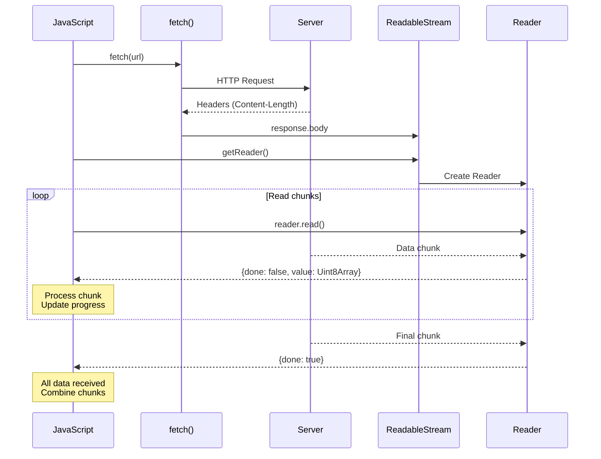

# Відстеження прогресу завантаження

## Вступ та Контекст

Уявіть, що користувач завантажує великий файл — відео, архів чи набір даних. Без індикатора прогресу створюється враження, що додаток "завіс". Користувач не знає: завантаження йде, чи щось зламалося? Скільки ще чекати?

**Прогрес-бар** — це не просто естетична деталь, це критично важливий елемент UX. Він інформує користувача, знижує тривожність очікування і дає контроль (можливість скасувати завантаження, якщо воно йде занадто довго).

Fetch API надає потужний, але часто недооцінений інструмент для цього — **`ReadableStream`**. Він дозволяє читати дані фрагмент за фрагментом, в міру їх надходження, що відкриває можливості для:

-   📊 Відстеження прогресу завантаження
-   🎬 Прогресивного рендерингу контенту
-   💾 Обробки даних "на льоту" без повного завантаження в пам'ять

::warning
**Важливе обмеження**

Fetch API **не підтримує** відстеження прогресу **відвантаження** (upload progress). Для цього все ще потрібен `XMLHttpRequest`. Цей розділ стосується лише **завантаження** (download) даних з сервера.

::

### Що ми навчимося робити?

-   Використовувати `response.body.getReader()` для доступу до потоку
-   Читати дані фрагментами через `ReadableStream`
-   Обчислювати прогрес завантаження у відсотках
-   Створювати візуальний прогрес-індикатор
-   Об'єднувати фрагменти даних у фінальний результат

## Фундаментальні Концепції

### Що таке ReadableStream?

**ReadableStream** — це об'єкт, що представляє потік даних, які читаються фрагмент за фрагментом. На відміну від методів `response.json()` чи `response.text()`, які чекають повного

завантаження, ReadableStream надає дані інкрементально.

```javascript
// Замість цього (чекає повного завантаження):
const data = await response.json()

// Можна отримати доступ до потоку:
const reader = response.body.getReader()
```

### Ключові особливості

::field-group

::field{name="response.body" type="ReadableStream"}
Властивість `Response`, яка повертає потік для читання тіла відповіді

::

::field{name="getReader()" type="Method"}
Створює об'єкт-читач для послідовного читання фрагментів даних

::

::field{name="reader.read()" type="Method"}
Повертає Promise з об'єктом `{done: boolean, value: Uint8Array}`

::

::field{name="done" type="boolean"}
`true`, коли потік завершено (всі дані прочитані)

::

::field{name="value" type="Uint8Array"}
Фрагмент бінарних даних (типізований масив байтів)

::

::

### Життєвий цикл читання потоку

::mermaid



::

## Архітектура та Механіка

### Процес читання потоку: покроковий алгоритм

::steps

### Крок 1: Отримання ReadableStream

Отримуємо reader для потоку `response.body`

```javascript
const response = await fetch(url)
const reader = response.body.getReader()
```

### Крок 2: Визначення загального розміру

Читаємо заголовок `Content-Length` (якщо доступний)

```javascript
const contentLength = +response.headers.get('Content-Length')
```

### Крок 3: Читання фрагментів у циклі

Читаємо дані фрагмент за фрагментом до завершення

```javascript
while (true) {
    const { done, value } = await reader.read()
    if (done) break

    // value - це Uint8Array з байтами
    chunks.push(value)
    receivedLength += value.length
}
```

### Крок 4: Об'єднання фрагментів

Створюємо єдиний масив з усіх фрагментів

```javascript
const allChunks = new Uint8Array(receivedLength)
let position = 0
for (let chunk of chunks) {
    allChunks.set(chunk, position)
    position += chunk.length
}
```

### Крок 5: Декодування результату

Перетворюємо байти у потрібний формат (текст, JSON, Blob)

```javascript
const result = new TextDecoder('utf-8').decode(allChunks)
const data = JSON.parse(result)
```

::

::note
**Content-Length може бути відсутнім**

Заголовок `Content-Length` може не надаватися сервером, особливо для:

-   CORS-запитів (якщо не дозволено явно)
-   Динамічно згенерованого контенту
-   Потокового передавання даних

У цьому випадку можна відстежувати лише абсолютний обсяг завантажених байтів, а не відсоток.

::

## Практична Реалізація

### Базовий приклад: читання з логуванням прогресу

Почнемо з простого прикладу, який виводить прогрес у консоль:

```javascript showLineNumbers
async function downloadWithProgress(url) {
    // Крок 1: Розпочинаємо завантаження
    const response = await fetch(url)

    if (!response.ok) {
        throw new Error(`HTTP помилка: ${response.status}`)
    }

    // Крок 2: Отримуємо reader
    const reader = response.body.getReader()

    // Крок 3: Отримуємо загальну довжину (якщо доступна)
    const contentLength = response.headers.get('Content-Length')
    const total = contentLength ? parseInt(contentLength, 10) : 0

    // Крок 4: Читаємо дані
    let receivedLength = 0
    const chunks = []

    while (true) {
        const { done, value } = await reader.read()

        if (done) {
            break
        }

        chunks.push(value)
        receivedLength += value.length

        // Виводимо прогрес
        if (total) {
            const progress = Math.round((receivedLength / total) * 100)
            console.log(`Завантажено: ${progress}% (${receivedLength} / ${total} байт)`)
        } else {
            console.log(`Завантажено: ${receivedLength} байт`)
        }
    }

    // Крок 5: Об'єднуємо фрагменти
    const allChunks = new Uint8Array(receivedLength)
    let position = 0
    for (let chunk of chunks) {
        allChunks.set(chunk, position)
        position += chunk.length
    }

    // Крок 6: Декодуємо результат
    const result = new TextDecoder('utf-8').decode(allChunks)

    return result
}

// Використання
try {
    const data = await downloadWithProgress('https://api.github.com/repos/microsoft/vscode/commits?per_page=100')
    console.log('✅ Завантаження завершено!')
    console.log('Розмір даних:', data.length, 'символів')
} catch (error) {
    console.error('❌ Помилка:', error)
}
```

**Розбір коду:**

-   **Рядок 10:** `response.body.getReader()` — отримуємо reader для потоку
-   **Рядок 14:** Конвертуємо `Content-Length` у число (може бути `null`)
-   **Рядок 21:** `reader.read()` — читаємо наступний фрагмент
-   **Рядок 32:** Обчислюємо прогрес у відсотках
-   **Рядок 42:** `allChunks.set(chunk, position)` — копіюємо фрагмент у результуючий масив

### Візуальний прогрес-бар

Створимо реальний UI з прогрес-баром:

```html
<!DOCTYPE html>
<html>
    <head>
        <title>Завантаження з прогресом</title>
        <style>
            .progress-container {
                width: 100%;
                max-width: 500px;
                margin: 20px auto;
                font-family: Arial, sans-serif;
            }

            .progress-bar {
                width: 100%;
                height: 30px;
                background: #f0f0f0;
                border-radius: 15px;
                overflow: hidden;
                position: relative;
            }

            .progress-fill {
                height: 100%;
                background: linear-gradient(90deg, #3b82f6, #2563eb);
                width: 0%;
                transition: width 0.3s ease;
                display: flex;
                align-items: center;
                justify-content: center;
                color: white;
                font-weight: bold;
            }

            .stats {
                margin-top: 10px;
                color: #666;
                font-size: 14px;
            }
        </style>
    </head>
    <body>
        <div class="progress-container">
            <h2>Завантаження даних</h2>
            <div class="progress-bar">
                <div class="progress-fill" id="progressFill">0%</div>
            </div>
            <div class="stats" id="stats">Очікування...</div>
        </div>

        <script>
            async function downloadWithUI(url) {
                const progressFill = document.getElementById('progressFill')
                const stats = document.getElementById('stats')

                const response = await fetch(url)

                if (!response.ok) {
                    throw new Error(`HTTP ${response.status}`)
                }

                const reader = response.body.getReader()
                const contentLength = response.headers.get('Content-Length')
                const total = contentLength ? parseInt(contentLength, 10) : 0

                let receivedLength = 0
                const chunks = []
                const startTime = Date.now()

                while (true) {
                    const { done, value } = await reader.read()

                    if (done) break

                    chunks.push(value)
                    receivedLength += value.length

                    // Оновлюємо UI
                    if (total) {
                        const progress = Math.round((receivedLength / total) * 100)
                        progressFill.style.width = progress + '%'
                        progressFill.textContent = progress + '%'

                        const elapsed = (Date.now() - startTime) / 1000
                        const speed = (receivedLength / 1024 / elapsed).toFixed(2)

                        stats.textContent = `${receivedLength} / ${total} байт • ${speed} KB/s`
                    } else {
                        const kb = (receivedLength / 1024).toFixed(2)
                        stats.textContent = `Завантажено: ${kb} KB`
                    }
                }

                // Об'єднуємо фрагменти
                const allChunks = new Uint8Array(receivedLength)
                let position = 0
                for (let chunk of chunks) {
                    allChunks.set(chunk, position)
                    position += chunk.length
                }

                const result = new TextDecoder('utf-8').decode(allChunks)

                stats.textContent = '✅ Завантаження завершено!'

                return result
            }

            // Автозапуск при завантаженні сторінки
            window.addEventListener('load', async () => {
                try {
                    const data = await downloadWithUI(
                        'https://api.github.com/repos/microsoft/typescript/commits?per_page=100',
                    )
                    console.log('Дані отримано:', JSON.parse(data).length, 'коммітів')
                } catch (error) {
                    document.getElementById('stats').textContent = '❌ Помилка: ' + error.message
                }
            })
        </script>
    </body>
</html>
```

**Ключові моменти:**

-   **Рядок 78:** Обчислюємо прогрес у відсотках
-   **Рядок 79-80:** Оновлюємо ширину та текст прогрес-бару
-   **Рядок 83:** Обчислюємо швидкість завантаження (KB/s)

### Робота з різними форматами

::tabs
::tabs-item{label="JSON"}

```javascript
async function downloadJSON(url) {
    const response = await fetch(url)
    const reader = response.body.getReader()

    let receivedLength = 0
    const chunks = []

    while (true) {
        const { done, value } = await reader.read()
        if (done) break

        chunks.push(value)
        receivedLength += value.length

        console.log(`Отримано: ${receivedLength} байт`)
    }

    // Об'єднання та декодування
    const allChunks = new Uint8Array(receivedLength)
    let position = 0
    for (let chunk of chunks) {
        allChunks.set(chunk, position)
        position += chunk.length
    }

    const text = new TextDecoder('utf-8').decode(allChunks)
    return JSON.parse(text)
}

// Використання
const commits = await downloadJSON('https://api.github.com/repos/facebook/react/commits')
console.log('Коммітів:', commits.length)
```

::

::tabs-item{label="Blob (Зображення)"}

```javascript
async function downloadImage(url, onProgress) {
    const response = await fetch(url)
    const reader = response.body.getReader()
    const contentLength = +response.headers.get('Content-Length')

    let receivedLength = 0
    const chunks = []

    while (true) {
        const { done, value } = await reader.read()
        if (done) break

        chunks.push(value)
        receivedLength += value.length

        // Callback для оновлення UI
        if (onProgress && contentLength) {
            onProgress(receivedLength, contentLength)
        }
    }

    // Створюємо Blob НАПРЯМУ з chunks (простіше!)
    const blob = new Blob(chunks)

    return blob
}

// Використання з відображенням
const img = document.createElement('img')
document.body.appendChild(img)

const blob = await downloadImage('https://picsum.photos/1920/1080', (received, total) => {
    const percent = Math.round((received / total) * 100)
    console.log(`Завантаження зображення: ${percent}%`)
})

img.src = URL.createObjectURL(blob)

// Очистити пам'ять після завантаження
img.onload = () => {
    URL.revokeObjectURL(img.src)
}
```

::

::tabs-item{label="Текстовий файл"}

```javascript
async function downloadText(url) {
    const response = await fetch(url)
    const reader = response.body.getReader()

    const chunks = []

    while (true) {
        const { done, value } = await reader.read()
        if (done) break

        chunks.push(value)
    }

    // Для тексту простіше:
    const blob = new Blob(chunks)
    const text = await blob.text()

    return text
}

// Завантаження README
const readme = await downloadText('https://raw.githubusercontent.com/nodejs/node/main/README.md')

console.log('README розмір:', readme.length, 'символів')
console.log('Перші 200 символів:', readme.slice(0, 200))
```

::

::

::tip
**Простіше створення Blob**

Замість об'єднання `Uint8Array` фрагментів вручну, для Blob можна просто:

```javascript
const blob = new Blob(chunks)
```

Конструктор Blob приймає масив `Uint8Array` і автоматично об'єднує їх!

::

## Практичні Сценарії

### Завантаження великого файлу з можливістю скасування

```html
<!DOCTYPE html>
<html>
    <head>
        <title>Завантаження файлу з можливістю скасування</title>
        <style>
            body {
                font-family: Arial, sans-serif;
                max-width: 600px;
                margin: 50px auto;
                padding: 20px;
            }

            .download-container {
                border: 2px solid #3b82f6;
                border-radius: 8px;
                padding: 20px;
                background: #f8fafc;
            }

            .controls {
                display: flex;
                gap: 10px;
                margin-bottom: 20px;
            }

            button {
                padding: 10px 20px;
                font-size: 16px;
                border: none;
                border-radius: 5px;
                cursor: pointer;
                transition: background 0.3s;
            }

            #downloadBtn {
                background: #3b82f6;
                color: white;
            }

            #downloadBtn:hover {
                background: #2563eb;
            }

            #cancelBtn {
                background: #ef4444;
                color: white;
            }

            #cancelBtn:hover {
                background: #dc2626;
            }

            #cancelBtn:disabled {
                background: #cbd5e1;
                cursor: not-allowed;
            }

            .progress-container {
                margin-top: 20px;
            }

            progress {
                width: 100%;
                height: 30px;
                border-radius: 5px;
            }

            .status {
                margin-top: 10px;
                color: #64748b;
                font-size: 14px;
            }
        </style>
    </head>
    <body>
        <div class="download-container">
            <h2>Менеджер завантажень</h2>

            <div class="controls">
                <button id="downloadBtn">📥 Завантажити відео</button>
                <button id="cancelBtn" disabled>❌ Скасувати</button>
            </div>

            <div class="progress-container">
                <progress id="progress" value="0" max="100"></progress>
                <div class="status" id="status">Готовий до завантаження</div>
            </div>
        </div>

        <script>
            class DownloadManager {
                constructor() {
                    this.controller = null
                    this.reader = null
                }

                async download(url, onProgress) {
                    // Створюємо AbortController для можливості скасування
                    this.controller = new AbortController()

                    try {
                        const response = await fetch(url, {
                            signal: this.controller.signal,
                        })

                        if (!response.ok) {
                            throw new Error(`HTTP ${response.status}`)
                        }

                        this.reader = response.body.getReader()
                        const contentLength = +response.headers.get('Content-Length') || 0

                        let receivedLength = 0
                        const chunks = []

                        while (true) {
                            const { done, value } = await this.reader.read()

                            if (done) break

                            chunks.push(value)
                            receivedLength += value.length

                            // Оновлюємо прогрес
                            if (onProgress) {
                                onProgress({
                                    received: receivedLength,
                                    total: contentLength,
                                    progress: contentLength ? (receivedLength / contentLength) * 100 : 0,
                                })
                            }
                        }

                        return new Blob(chunks)
                    } catch (error) {
                        if (error.name === 'AbortError') {
                            console.log('Завантаження скасовано')
                        } else {
                            console.error('Помилка завантаження:', error)
                        }
                        throw error
                    }
                }

                cancel() {
                    if (this.controller) {
                        this.controller.abort()
                    }
                    if (this.reader) {
                        this.reader.cancel()
                    }
                }
            }

            // Використання
            const manager = new DownloadManager()

            const downloadBtn = document.getElementById('downloadBtn')
            const cancelBtn = document.getElementById('cancelBtn')
            const progressBar = document.getElementById('progress')
            const statusDiv = document.getElementById('status')

            downloadBtn.addEventListener('click', async () => {
                downloadBtn.disabled = true
                cancelBtn.disabled = false
                progressBar.value = 0
                statusDiv.textContent = 'Завантаження розпочато...'

                try {
                    const startTime = Date.now()

                    const blob = await manager.download(
                        'http://commondatastorage.googleapis.com/gtv-videos-bucket/sample/BigBuckBunny.mp4',
                        ({ received, total, progress }) => {
                            progressBar.value = progress

                            const elapsed = (Date.now() - startTime) / 1000
                            const speed = (received / 1024 / elapsed).toFixed(2)
                            const receivedMB = (received / 1024 / 1024).toFixed(2)
                            const totalMB = (total / 1024 / 1024).toFixed(2)

                            statusDiv.textContent = `${progress.toFixed(
                                1,
                            )}% - ${receivedMB}/${totalMB} MB @ ${speed} KB/s`
                        },
                    )

                    console.log('✅ Завантажено:', blob.size, 'байт')
                    statusDiv.textContent = `✅ Завантаження завершено! Розмір: ${(blob.size / 1024 / 1024).toFixed(
                        2,
                    )} MB`

                    // Зберігаємо файл
                    const url = URL.createObjectURL(blob)
                    const a = document.createElement('a')
                    a.href = url
                    a.download = 'BigBuckBunny.mp4'
                    a.click()
                    URL.revokeObjectURL(url)
                } catch (error) {
                    if (error.name === 'AbortError') {
                        statusDiv.textContent = '⚠️ Завантаження скасовано'
                    } else {
                        statusDiv.textContent = '❌ Помилка: ' + error.message
                        console.error('Помилка:', error)
                    }
                } finally {
                    downloadBtn.disabled = false
                    cancelBtn.disabled = true
                }
            })

            cancelBtn.addEventListener('click', () => {
                manager.cancel()
                cancelBtn.disabled = true
            })
        </script>
    </body>
</html>
```

### Потокова обробка даних без повного завантаження

Для дуже великих файлів можна обробляти дані фрагмент за фрагментом, не зберігаючи все в пам'яті:

```javascript
async function processLargeFile(url, processChunk) {
    const response = await fetch(url)
    const reader = response.body.getReader()

    let receivedLength = 0

    try {
        while (true) {
            const { done, value } = await reader.read()

            if (done) break

            // Обробляємо кожен фрагмент окремо
            await processChunk(value)

            receivedLength += value.length
            console.log(`Оброблено: ${(receivedLength / 1024 / 1024).toFixed(2)} MB`)
        }
    } finally {
        reader.releaseLock()
    }

    return receivedLength
}

// Приклад: підрахунок рядків у текстовому файлі
let lineCount = 0
const decoder = new TextDecoder('utf-8')
let buffer = ''

const totalBytes = await processLargeFile('https://example.com/huge-log-file.txt', async (chunk) => {
    // Декодуємо фрагмент
    buffer += decoder.decode(chunk, { stream: true })

    // Рахуємо рядки
    const lines = buffer.split('\n')
    lineCount += lines.length - 1

    // Зберігаємо неповний рядок для наступної ітерації
    buffer = lines[lines.length - 1]
})

console.log(`Оброблено ${totalBytes} байт, знайдено ${lineCount} рядків`)
```

::caution
**Обмеження пам'яті**

Якщо розмір файлу невідомий (`Content-Length` відсутній), обов'язково встановіть ліміт на `receivedLength`, щоб унеможливити переповнення пам'яті:

```javascript
const MAX_SIZE = 50 * 1024 * 1024 // 50 MB

while (true) {
    const { done, value } = await reader.read()
    if (done) break

    receivedLength += value.length

    if (receivedLength > MAX_SIZE) {
        reader.cancel()
        throw new Error('Файл занадто великий')
    }

    chunks.push(value)
}
```

::

## Підсумки

ReadableStream API надає повний контроль над процесом завантаження даних:

::card-group
::card{title="Прогрес завантаження" icon="i-lucide-gauge"}

-   Читання даних фрагмент за фрагментом
-   Обчислення прогресу у відсотках
-   Створення візуальних індикаторів
-   Обчислення швидкості завантаження

::

::card{title="Основний патерн" icon="i-lucide-code-2"}

```javascript
const reader = response.body.getReader()
const contentLength = +response.headers.get('Content-Length')

let received = 0
const chunks = []

while (true) {
    const { done, value } = await reader.read()
    if (done) break

    chunks.push(value)
    received += value.length

    console.log(`${Math.round((received / contentLength) * 100)}%`)
}

const blob = new Blob(chunks)
```

::

::card{title="Об'єднання фрагментів" icon="i-lucide-database"}

**Для Blob (простіше):**

```javascript
const blob = new Blob(chunks)
```

**Для тексту:**

```javascript
const allChunks = new Uint8Array(received)
let pos = 0
for (let chunk of chunks) {
    allChunks.set(chunk, pos)
    pos += chunk.length
}
const text = new TextDecoder().decode(allChunks)
```

::

::card{title="Важливі обмеження" icon="i-lucide-alert-triangle"}

-   ❌ **Upload progress** не підтримується
-   ⚠️ `Content-Length` може бути відсутнім
-   💡 Потрібен AbortController для скасування
-   🔒 Після читання потік не можна "перечитати"

::

::

### Порівняння підходів

| Аспект               | ReadableStream        | response.json()     |
| :------------------- | :-------------------- | :------------------ |
| **Прогрес**          | ✅ Можна відстежувати | ❌ Ні               |
| **Пам'ять**          | 💚 Контрольована      | ⚠️ Весь файл в RAM  |
| **Швидкість старту** | ⚡ Миттєво            | ⏳ Чекає завершення |
| **Складність**       | 🔴 Висока             | 🟢 Проста           |
| **Скасування**       | ✅ Підтримує          | ❌ Не можна         |

**Коли використовувати ReadableStream:**

-   Великі файли (>1MB)
-   Потрібен прогрес-індикатор
-   Обмежена пам'ять
-   Потокова обробка даних

**Коли достатньо response.json():**

-   Малі запити (<100KB)
-   Швидкість не критична
-   Простота коду важливіша

У наступному розділі ми розглянемо `AbortController` — інструмент для переривання fetch-запитів, який ідеально поєднується з ReadableStream для створення повноцінних систем завантаження з можливістю скасування.

## Додаткові ресурси

-   [MDN: ReadableStream](https://developer.mozilla.org/en-US/docs/Web/API/ReadableStream) — повна документація
-   [Streams API Specification](https://streams.spec.whatwg.org/) — офіційна специфікація
-   [MDN: TextDecoder](https://developer.mozilla.org/en-US/docs/Web/API/TextDecoder) — декодування байтів у текст
-   [MDN: Uint8Array](https://developer.mozilla.org/en-US/docs/Web/JavaScript/Reference/Global_Objects/Uint8Array) — робота з бінарними даними
