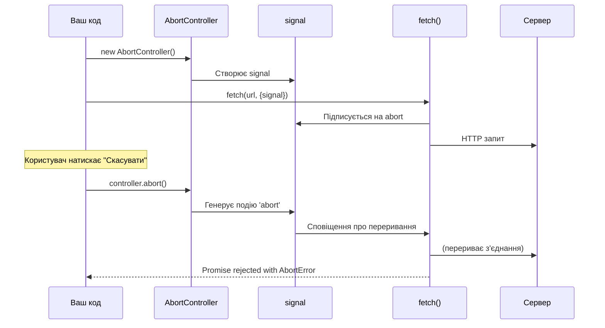

# Переривання fetch-запитів

## Вступ та Контекст

Уявіть: користувач почав завантажувати велике зображення, але передумав і перейшов на іншу сторінку. Або запустив пошук, але вже на третій літері зрозумів, що ввів щось не те. У цих сценаріях продовження запиту — це марна трата ресурсів: трафіку, пам'яті, процесорного часу.

**Проблема:** В JavaScript проміси не можна "скасувати" стандартним способом. Якщо `fetch()` повернув проміс, він виконається до кінця, навіть якщо результат вже не потрібен.

**Рішення:** `AbortController` — спеціальний вбудований об'єкт, який надає API для переривання не тільки fetch-запитів, але й будь-яких асинхронних операцій.

::tip
**Чому це важливо?**

-   💰 **Економія ресурсів** — заощадження трафіку та серверного навантаження
-   ⚡ **Швидкість** — негайна реакція на зміну UI
-   🎯 **UX** — користувач контролює процес (кнопка "Скасувати")
-   🔄 **Дебаунсинг** — скасування застарілих пошукових запитів

::

### Що ми навчимося робити?

-   Створювати `AbortController` для керування запитами
-   Переривати fetch-запити через `signal`
-   Реалізовувати таймаути для запитів
-   Скасовувати кілька запитів одночасно
-   Інтегрувати AbortController у власні async-функції

## Фундаментальні Концепції

### Що таке AbortController?

**AbortController** — це об'єкт, який створює сигнал (`signal`) для переривання операцій. Він складається з двох частин:

```javascript
const controller = new AbortController()
const signal = controller.signal
```

::field-group
::field{name="controller.signal" type="AbortSignal"}
Об'єкт-сигнал, який передається у функції для моніторингу стану переривання
::

::field{name="controller.abort()" type="Method"}
Метод, який перериває операцію, генеруючи подію `abort` на `signal`
::

::field{name="signal.aborted" type="boolean"}
Властивість, яка стає `true` після виклику `controller.abort()`
::

::field{name="signal.addEventListener('abort', handler)" type="Method"}
Слухач події, який спрацьовує при перериванні
::
::

### Як це працює: архітектура взаємодії

::mermaid



::

**Дві сторони процесу:**

1. **Виконавець** — той, хто виконує операцію (fetch, async функція). Підписується на `signal.addEventListener('abort')`
2. **Контролер** — той, хто скасовує. Викликає `controller.abort()` коли потрібно

## Практична Реалізація

### Базовий приклад: переривання запиту

Найпростіший приклад переривання fetch-запиту:

```javascript showLineNumbers
// Створюємо контролер
const controller = new AbortController()

// Передаємо signal у fetch
fetch('https://api.github.com/repos/microsoft/vscode/commits?per_page=100', {
    signal: controller.signal,
})
    .then((response) => response.json())
    .then((data) => console.log('Отримано коммітів:', data.length))
    .catch((error) => {
        if (error.name === 'AbortError') {
            console.log('✋ Запит скасовано')
        } else {
            console.error('❌ Помилка:', error)
        }
    })

// Скасовуємо запит (можна викликати в будь-який момент)
controller.abort()
```

**Розбір коду:**

-   **Рядок 2:** Створюємо екземпляр `AbortController`
-   **Рядок 5-6:** Передаємо `controller.signal` в опції fetch
-   **Рядок 11:** Перевіряємо, чи помилка — це `AbortError`
-   **Рядок 19:** Викликаємо `abort()` для переривання

### Автоматичне переривання через таймаут

Реалізація таймауту для fetch-запитів:

```javascript
function fetchWithTimeout(url, options = {}, timeout = 5000) {
    // Створюємо контролер
    const controller = new AbortController()

    // Встановлюємо таймер
    const timeoutId = setTimeout(() => {
        controller.abort()
    }, timeout)

    // Відправляємо запит
    return fetch(url, {
        ...options,
        signal: controller.signal,
    })
        .then((response) => {
            clearTimeout(timeoutId) // Очищаємо таймер при успіху
            return response
        })
        .catch((error) => {
            clearTimeout(timeoutId) // Очищаємо таймер при помилці

            if (error.name === 'AbortError') {
                throw new Error(`Запит перевищив час очікування (${timeout}ms)`)
            }
            throw error
        })
}

// Використання
async function loadData() {
    try {
        const response = await fetchWithTimeout(
            'https://api.github.com/repos/facebook/react/commits',
            {},
            3000, // 3 секунди максимум
        )
        const data = await response.json()
        console.log('Дані отримано:', data.length, 'коммітів')
    } catch (error) {
        console.error('Помилка:', error.message)
    }
}

loadData()
```

::note
**Чому важливо clearTimeout?**

Після завершення запиту (успішно чи ні) потрібно обов'язково очистити таймер через `clearTimeout()`, щоб уникнути витоку пам'яті.
::

### Інтерактивний приклад з UI

Створимо практичний приклад з можливістю скасування:

```html
<!DOCTYPE html>
<html>
    <head>
        <title>Скасування fetch-запиту</title>
        <style>
            body {
                font-family: Arial, sans-serif;
                max-width: 600px;
                margin: 50px auto;
                padding: 20px;
            }

            .container {
                border: 2px solid #3b82f6;
                border-radius: 8px;
                padding: 20px;
                background: #f8fafc;
            }

            button {
                padding: 10px 20px;
                font-size: 16px;
                border: none;
                border-radius: 5px;
                cursor: pointer;
                margin-right: 10px;
                transition: background 0.3s;
            }

            #fetchBtn {
                background: #3b82f6;
                color: white;
            }

            #fetchBtn:hover:not(:disabled) {
                background: #2563eb;
            }

            #abortBtn {
                background: #ef4444;
                color: white;
            }

            #abortBtn:hover:not(:disabled) {
                background: #dc2626;
            }

            button:disabled {
                background: #cbd5e1;
                cursor: not-allowed;
            }

            #status {
                margin-top: 20px;
                padding: 15px;
                border-radius: 5px;
                background: white;
                min-height: 50px;
            }

            .loading {
                color: #3b82f6;
            }

            .success {
                color: #10b981;
            }

            .error {
                color: #ef4444;
            }
        </style>
    </head>
    <body>
        <div class="container">
            <h2>Демонстрація AbortController</h2>

            <div>
                <button id="fetchBtn">🚀 Завантажити дані</button>
                <button id="abortBtn" disabled>❌ Скасувати</button>
            </div>

            <div id="status">Натисніть кнопку для завантаження даних</div>
        </div>

        <script>
            let controller = null

            const fetchBtn = document.getElementById('fetchBtn')
            const abortBtn = document.getElementById('abortBtn')
            const statusDiv = document.getElementById('status')

            fetchBtn.addEventListener('click', async () => {
                // Створюємо новий контролер
                controller = new AbortController()

                // Оновлюємо UI
                fetchBtn.disabled = true
                abortBtn.disabled = false
                statusDiv.className = 'loading'
                statusDiv.textContent = '⏳ Завантаження даних...'

                try {
                    const response = await fetch('https://api.github.com/repos/nodejs/node/commits?per_page=100', {
                        signal: controller.signal,
                    })

                    if (!response.ok) {
                        throw new Error(`HTTP ${response.status}`)
                    }

                    const data = await response.json()

                    // Успіх
                    statusDiv.className = 'success'
                    statusDiv.innerHTML = `
          ✅ <strong>Успішно завантажено!</strong><br>
          Отримано ${data.length} коммітів<br>
          Останній коммітер: ${data[0].commit.author.name}
        `
                } catch (error) {
                    // Обробка помилок
                    statusDiv.className = 'error'

                    if (error.name === 'AbortError') {
                        statusDiv.textContent = '⚠️ Запит скасовано користувачем'
                    } else {
                        statusDiv.textContent = '❌ Помилка: ' + error.message
                    }
                } finally {
                    // Відновлюємо UI
                    fetchBtn.disabled = false
                    abortBtn.disabled = true
                    controller = null
                }
            })

            abortBtn.addEventListener('click', () => {
                if (controller) {
                    controller.abort()
                }
            })
        </script>
    </body>
</html>
```

**Ключові особливості:**

-   Кнопка "Скасувати" активна лише під час запиту
-   Візуальний feedback для різних станів (завантаження, успіх, помилка)
-   Правильна обробка `AbortError`

## Розширені сценарії

### Скасування множинних запитів

Один `AbortController` може керувати кількома запитами одночасно:

```javascript
async function loadMultipleRepositories(repoNames) {
    const controller = new AbortController()

    // Встановлюємо глобальний таймаут
    const timeoutId = setTimeout(() => {
        controller.abort()
    }, 10000) // 10 секунд для всіх запитів

    try {
        // Створюємо масив промісів
        const promises = repoNames.map((repo) =>
            fetch(`https://api.github.com/repos/${repo}`, {
                signal: controller.signal,
            }).then((r) => r.json()),
        )

        // Чекаємо всі запити
        const results = await Promise.all(promises)

        clearTimeout(timeoutId)

        console.log('✅ Завантажено репозиторіїв:', results.length)
        results.forEach((repo) => {
            console.log(`- ${repo.full_name}: ⭐ ${repo.stargazers_count}`)
        })

        return results
    } catch (error) {
        clearTimeout(timeoutId)

        if (error.name === 'AbortError') {
            console.log('⚠️ Всі запити скасовано')
        } else {
            console.error('❌ Помилка:', error)
        }
        throw error
    }
}

// Використання
const repos = ['facebook/react', 'microsoft/vscode', 'nodejs/node']

loadMultipleRepositories(repos)
    .then(() => console.log('Готово!'))
    .catch((error) => console.error('Фатальна помилка:', error))

// Можна скасувати всі запити одночасно:
// controller.abort();
```

### Пошук з дебаунсингом (скасування попередніх запитів)

Класична задача: пошук з автодоповненням. Кожен новий символ скасовує попередній запит:

```html
<!DOCTYPE html>
<html>
    <head>
        <title>Пошук з дебаунсингом</title>
        <style>
            body {
                font-family: Arial, sans-serif;
                max-width: 600px;
                margin: 50px auto;
                padding: 20px;
            }

            input {
                width: 100%;
                padding: 12px;
                font-size: 16px;
                border: 2px solid #3b82f6;
                border-radius: 5px;
                box-sizing: border-box;
            }

            #results {
                margin-top: 20px;
            }

            .result-item {
                padding: 10px;
                border-bottom: 1px solid #e2e8f0;
                cursor: pointer;
            }

            .result-item:hover {
                background: #f1f5f9;
            }

            .loading {
                color: #64748b;
                font-style: italic;
            }
        </style>
    </head>
    <body>
        <h2>🔍 Пошук репозиторіїв GitHub</h2>
        <input type="text" id="searchInput" placeholder="Введіть назву (наприклад, 'react')..." />
        <div id="results"></div>

        <script>
            let currentController = null

            const searchInput = document.getElementById('searchInput')
            const resultsDiv = document.getElementById('results')

            searchInput.addEventListener('input', async (e) => {
                const query = e.target.value.trim()

                // Скасовуємо попередній запит
                if (currentController) {
                    currentController.abort()
                }

                // Якщо запит порожній, очищаємо результати
                if (!query) {
                    resultsDiv.innerHTML = ''
                    return
                }

                // Створюємо новий контролер
                currentController = new AbortController()

                // Показуємо індикатор завантаження
                resultsDiv.innerHTML = '<div class="loading">⏳ Пошук...</div>'

                try {
                    const response = await fetch(
                        `https://api.github.com/search/repositories?q=${encodeURIComponent(query)}&per_page=10`,
                        { signal: currentController.signal },
                    )

                    const data = await response.json()

                    // Відображаємо результати
                    if (data.items && data.items.length > 0) {
                        resultsDiv.innerHTML = data.items
                            .map(
                                (repo) => `
            <div class="result-item">
              <strong>${repo.full_name}</strong><br>
              <small>⭐ ${repo.stargazers_count} | 🍴 ${repo.forks_count}</small><br>
              <small>${repo.description || 'Без опису'}</small>
            </div>
          `,
                            )
                            .join('')
                    } else {
                        resultsDiv.innerHTML = '<div class="loading">Нічого не знайдено</div>'
                    }
                } catch (error) {
                    // Ігноруємо AbortError (це нормально при дебаунсингу)
                    if (error.name !== 'AbortError') {
                        resultsDiv.innerHTML = `<div style="color: red;">Помилка: ${error.message}</div>`
                    }
                }
            })
        </script>
    </body>
</html>
```

**Як це працює:**

1. Кожен новий символ скасовує попередній запит через `controller.abort()`
2. Створюється новий контролер для нового запиту
3. `AbortError` ігнорується — це очікувана поведінка при дебаунсингу

### Інтеграція з власними async-функціями

AbortController можна використовувати не тільки з fetch, але й з власними асинхронними операціями:

```javascript
async function longRunningTask(signal) {
    return new Promise((resolve, reject) => {
        // Перевіряємо, чи вже скасовано
        if (signal.aborted) {
            reject(new DOMException('Скасовано', 'AbortError'))
            return
        }

        // Підписуємося на подію abort
        signal.addEventListener('abort', () => {
            reject(new DOMException('Скасовано', 'AbortError'))
        })

        // Імітуємо довгу операцію
        let progress = 0
        const interval = setInterval(() => {
            progress += 10
            console.log(`Прогрес: ${progress}%`)

            if (progress >= 100) {
                clearInterval(interval)
                resolve('Завдання виконано!')
            }
        }, 500)

        // Очищаємо інтервал при перериванні
        signal.addEventListener('abort', () => {
            clearInterval(interval)
        })
    })
}

// Використання
async function runTask() {
    const controller = new AbortController()

    // Скасовуємо через 2 секунди
    setTimeout(() => {
        console.log('⚠️ Скасовуємо завдання...')
        controller.abort()
    }, 2000)

    try {
        const result = await longRunningTask(controller.signal)
        console.log('✅', result)
    } catch (error) {
        if (error.name === 'AbortError') {
            console.log('⚠️ Завдання скасовано')
        } else {
            console.error('❌ Помилка:', error)
        }
    }
}

runTask()
```

::caution
**Важливо перевіряти signal.aborted**

Завжди перевіряйте `signal.aborted` на початку функції та після await/async операцій, щоб уникнути виконання скасованого коду.

```javascript
async function myAsyncFn(signal) {
    if (signal.aborted) {
        throw new DOMException('Aborted', 'AbortError')
    }

    await someOperation()

    // Перевірка після async операції
    if (signal.aborted) {
        throw new DOMException('Aborted', 'AbortError')
    }

    // ...продовжуємо роботу
}
```

::

## Підсумки

AbortController — потужний інструмент для керування асинхронними операціями:

::card-group
::card{title="Базове використання" icon="i-lucide-power-off"}

```javascript
const controller = new AbortController()

fetch(url, { signal: controller.signal })
    .then(...)
    .catch((error) => {
        if (error.name === 'AbortError') {
            // Скасовано
        }
    })

// Скасувати
controller.abort()
```

::

::card{title="Таймаут" icon="i-lucide-timer"}

```javascript
const controller = new AbortController()

setTimeout(() => controller.abort(), 5000)

fetch(url, { signal: controller.signal })
```

::

::card{title="Множинні запити" icon="i-lucide-layers"}

```javascript
const controller = new AbortController()

const promises = urls.map((url) => fetch(url, { signal: controller.signal }))

await Promise.all(promises)

// Скасує ВСІ запити
controller.abort()
```

::

::card{title="Дебаунсинг пошуку" icon="i-lucide-search"}

```javascript
let controller = null

input.oninput = async () => {
    // Скасовуємо попередній
    controller?.abort()

    controller = new AbortController()

    await fetch(url, {
        signal: controller.signal,
    })
}
```

::
::

### Ключові концепції

| Концепція           | Опис                                             |
| :------------------ | :----------------------------------------------- |
| **AbortController** | Об'єкт, що керує скасуванням операцій            |
| **signal**          | Сигнал, що передається у функції для моніторингу |
| **abort()**         | Метод, що перериває операцію                     |
| **AbortError**      | Помилка, що генерується при перериванні          |
| **signal.aborted**  | Властивість для перевірки стану                  |

### Типові сценарії використання

✅ **Коли використовувати:**

-   Запити, які користувач може скасувати (кнопка "Стоп")
-   Таймаути для запитів
-   Пошук з автодоповненням (дебаунсинг)
-   Переключення між вкладками (скасування запитів попередньої вкладки)
-   Завантаження файлів з можливістю скасування

❌ **Коли не потрібно:**

-   Критичні запити, які повинні завершитися (оплата, збереження)
-   Короткі запити (<100ms)
-   Запити без user interaction

::warning
**Обробка AbortError обовʼязкова**

Завжди обробляйте `AbortError` окремо від інших помилок. Скасування — це нормальний сценарій, а не винятковий:

```javascript
try {
    await fetch(url, { signal })
} catch (error) {
    if (error.name === 'AbortError') {
        // Нормальна поведінка — логуємо або ігноруємо
        return
    }
    // Справжня помилка — обробляємо серйозно
    throw error
}
```

::

У наступному розділі ми розглянемо CORS (Cross-Origin Resource Sharing) — механізм безпеки браузера, який контролює запити між різними доменами.

## Додаткові ресурси

-   [MDN: AbortController](https://developer.mozilla.org/en-US/docs/Web/API/AbortController) — повна документація
-   [MDN: AbortSignal](https://developer.mozilla.org/en-US/docs/Web/API/AbortSignal) — деталі про signal
-   [DOM Standard: Aborting](https://dom.spec.whatwg.org/#aborting-ongoing-activities) — офіційна специфікація
-   [Can I Use: AbortController](https://caniuse.com/abortcontroller) — підтримка браузерами
