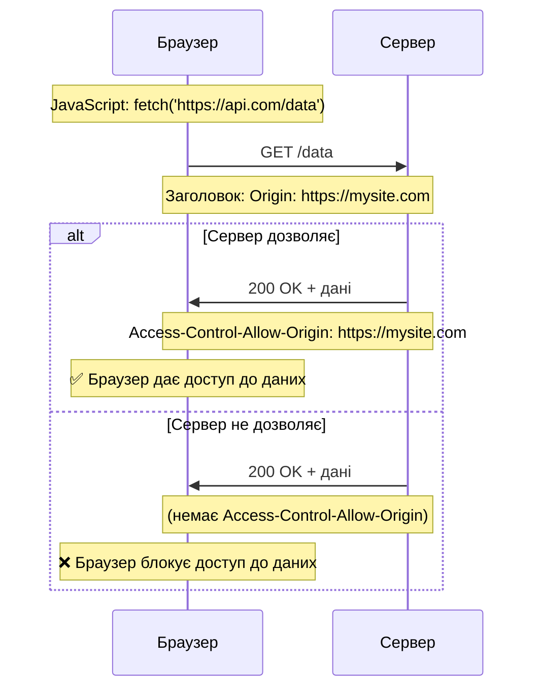

# CORS - Запити між різними джерелами

## Вступ та Контекст

Спробуйте виконати цей код у консолі браузера:

```javascript
fetch('https://example.com')
    .then((r) => r.text())
    .then(console.log)
```

Resultado: `❌ CORS policy: No 'Access-Control-Allow-Origin' header`

**Що сталося?** Браузер заблокував запит з міркувань безпеки. Ваш сайт (`localhost` чи інший домен) намагається отримати дані з `example.com` — це **cross-origin request** (запит між різними джерелами).

**CORS (Cross-Origin Resource Sharing)** — це механізм безпеки браузера, який контролює, які сайти можуть отримувати дані один від одного. Без нього зловмисний сайт міг би читати ваші приватні дані з Gmail, Facebook чи банківського акаунту.

::warning
**Критично важливо розуміти**

CORS — це не про захист вашого сервера від атак. Це про **захист користувачів** від зловмисних веб-сайтів, які намагаються викрасти їхні дані з інших сайтів через браузер.

::

### Що ми навчимося розуміти?

-   Концепцію "origin" (джерело) та Same-Origin Policy
-   Різницю між safe та unsafe запитами
-   Preflight requests (OPTIONS) та їх призначення
-   CORS headers та їх значення
-   Handling credentials (cookies) у cross-origin запитах
-   Налаштування сервера для CORS

## Фундаментальні Концепції

### Що таке Origin (Джерело)?

**Origin** — це комбінація трьох компонентів: **протокол + домен + порт**

```
https://example.com:443/page?id=1
└─┬─┘   └────┬─────┘ └┬┘
Протокол  Домен    Порт

Origin = https://example.com:443
```

::field-group
::field{name="Same Origin" type="Однакове джерело"}
`https://site.com/page1` та `https://site.com/page2` — **той самий** origin

::

::field{name="Different Origin" type="Різні джерела"}
`https://site.com` та `http://site.com` — **різні** (протокол)  
 `https://site.com` та `https://api.site.com` — **різні** (субдомен)  
 `https://site.com` та `https://site.com:8080` — **різні** (порт)

::

::

### Історія: чому існує CORS?

::steps

### Старі часи (до 2000-х)

Браузери жорстко блокували всі cross-origin запити. **Same-Origin Policy** — жоден скрипт не міг читати дані з іншого домену.

### Обхідні шляхи

Розробники винаходили хитрощі:

-   **Форми в iframe** — можна відправити, але не прочитати відповідь
-   **JSONP** — `<script src="other-domain.com/data?callback=myFunc">`

### Поява CORS (2014)

Браузери додали підтримку **контрольованих** cross-origin запитів через спеціальні HTTP headers. Сервер **явно дозволяє** доступ певним origin.

::

::tip
**CORS — це компроміс**

Браузер каже: "Я дозволю cross-origin запити, **але тільки якщо сервер явно підтвердить**, що довіряє вашому сайту."

::

## Типи Cross-Origin Запитів

### Safe (Безпечні) Requests

Запит вважається **безпечним**, якщо:

1. **Метод**: `GET`, `POST` або `HEAD`
2. **Headers**: лише:
    - `Accept`
    - `Accept-Language`
    - `Content-Language`
    - `Content-Type` зі значеннями:
        - `application/x-www-form-urlencoded`
        - `multipart/form-data`
        - `text/plain`

**Чому "безпечні"?** Такі запити **можна було робити завжди** через `<form>` або `<script>` теги, тому старі сервери вже готові їх обробляти.

### Unsafe (Небезпечні) Requests

Все інше:

-   Методи: `PUT`, `DELETE`, `PATCH`
-   Custom headers: `Authorization`, `X-API-Key`
-   `Content-Type: application/json`

**Чому "небезпечні"?** У старі часи браузер **не міг** такі запити відправити, тому сервер **не очікує** їх і може не мати захисту.

## Safe Requests: як це працює

### Механіка безпечного запиту

::mermaid



::

### Приклад: Safe Request

```javascript
// Запит на інший домен
fetch('https://api.github.com/users/octocat')
    .then((response) => response.json())
    .then((data) => console.log('User:', data.name))
    .catch((error) => console.error('CORS Error:', error))
```

**Що шлє браузер:**

```http
GET /users/octocat HTTP/1.1
Host: api.github.com
Origin: https://mysite.com
```

**Що має відповісти сервер:**

```http
HTTP/1.1 200 OK
Access-Control-Allow-Origin: *
Content-Type: application/json

{"login": "octocat", "name": "The Octocat"}
```

::note
**Браузер автоматично додає Origin**

Ви **не можете** вручну встановити `Origin` header — браузер робить це автоматично для всіх cross-origin запитів.

::

### CORS Headers для Safe Requests

| Header                        | Хто встановлює        | Значення                             |
| :---------------------------- | :-------------------- | :----------------------------------- |
| `Origin`                      | Браузер (автоматично) | Джерело запиту: `https://mysite.com` |
| `Access-Control-Allow-Origin` | Сервер                | `*` або конкретний origin            |

## Unsafe Requests: Preflight Mechanism

Для unsafe запитів браузер робить **два запити**:

1. **Preflight** (OPTIONS) — запитує дозвіл
2. **Actual Request** — якщо дозволено

### Preflight Request Flow

::mermaid

```mermaid
sequenceDiagram
    participant JS as JavaScript
    participant Browser as Браузер
    participant Server as Сервер

    Note over JS: fetch('https://api.com/user', {<br/>method: 'PUT',<br/>headers: {'X-API-Key': '123'}})

    rect rgb(255, 245, 230)
        Note over Browser,Server: 🔍 Preflight Request
        Browser->>Server: OPTIONS /user
        Note over Browser,Server: Origin: https://mysite.com<br/>Access-Control-Request-Method: PUT<br/>Access-Control-Request-Headers: X-API-Key

        alt Сервер дозволяє
            Server->>Browser: 200 OK
            Note over Browser,Server: Access-Control-Allow-Origin: https://mysite.com<br/>Access-Control-Allow-Methods: PUT<br/>Access-Control-Allow-Headers: X-API-Key<br/>Access-Control-Max-Age: 86400
        else Сервер не дозволяє
            Server->>Browser: 403 Forbidden
            Note over Browser: ❌ Блокуємо, фактичний запит не відправляємо
        end
    end

    rect rgb(230, 255, 245)
        Note over Browser,Server: ✅ Actual Request
        Browser->>Server: PUT /user + data
        Note over Browser,Server: X-API-Key: 123<br/>Origin: https://mysite.com

        Server->>Browser: 200 OK + response
        Note over Browser,Server: Access-Control-Allow-Origin: https://mysite.com

        Browser->>JS: Дані доступні
    end

    style Browser fill:#3b82f6,stroke:#1d4ed8,color:#ffffff
    style Server fill:#10b981,stroke:#059669,color:#ffffff
```

::

### Приклад: Unsafe Request з Preflight

```javascript
// Unsafe: метод PUT + custom header
fetch('https://api.example.com/users/123', {
    method: 'PUT',
    headers: {
        'Content-Type': 'application/json',
        'X-API-Key': 'secret-key-123',
    },
    body: JSON.stringify({ name: 'Updated Name' }),
})
```

**Крок 1: Preflight (автоматично):**

```http
OPTIONS /users/123 HTTP/1.1
Host: api.example.com
Origin: https://mysite.com
Access-Control-Request-Method: PUT
Access-Control-Request-Headers: Content-Type, X-API-Key
```

**Крок 2: Серверна відповідь на Preflight:**

```http
HTTP/1.1 200 OK
Access-Control-Allow-Origin: https://mysite.com
Access-Control-Allow-Methods: GET, POST, PUT, DELETE
Access-Control-Allow-Headers: Content-Type, X-API-Key
Access-Control-Max-Age: 86400
```

**Крок 3: Actual Request (якщо preflight успішний):**

```http
PUT /users/123 HTTP/1.1
Host: api.example.com
Origin: https://mysite.com
Content-Type: application/json
X-API-Key: secret-key-123

{"name": "Updated Name"}
```

**Крок 4: Actual Response:**

```http
HTTP/1.1 200 OK
Access-Control-Allow-Origin: https://mysite.com
Content-Type: application/json

{"id": 123, "name": "Updated Name"}
```

## Response Headers

### Читання заголовків відповіді

За замовчуванням JavaScript може читати лише **безпечні** response headers:

-   `Cache-Control`
-   `Content-Language`
-   `Content-Type`
-   `Expires`
-   `Last-Modified`
-   `Pragma`

Для доступу до інших headers сервер має встановити `Access-Control-Expose-Headers`:

```javascript
fetch('https://api.example.com/data').then((response) => {
    console.log(response.headers.get('Content-Type')) // ✅ Можна
    console.log(response.headers.get('X-Custom-Header')) // ❌ null (заблоковано)
})
```

**Рішення на сервері:**

```http
HTTP/1.1 200 OK
Access-Control-Allow-Origin: https://mysite.com
Access-Control-Expose-Headers: X-Custom-Header, X-Request-ID
X-Custom-Header: some-value
X-Request-ID: abc123
```

Тепер JavaScript може прочитати ці headers.

## Credentials (Cookies та Authentication)

### Проблема

За замовчуванням fetch **не відправляє cookies** у cross-origin запитах:

```javascript
// ❌ Cookies НЕ будуть відправлені
fetch('https://api.example.com/profile')
```

### Рішення: credentials: 'include'

```javascript
// ✅ Cookies будуть відправлені
fetch('https://api.example.com/profile', {
    credentials: 'include',
})
```

**Але сервер має явно дозволити це:**

```http
HTTP/1.1 200 OK
Access-Control-Allow-Origin: https://mysite.com
Access-Control-Allow-Credentials: true
```

::caution
**Заборонено використовувати `*` з credentials**

Якщо `credentials: 'include'`, сервер **не може** використати `Access-Control-Allow-Origin: *`. Треба вказати **точний** origin:

```http
✅ Access-Control-Allow-Origin: https://mysite.com
❌ Access-Control-Allow-Origin: *
```

Це захист проти атак.

::

### Приклад: Авторизований запит

```javascript
// Frontend на https://myapp.com
async function getUserProfile() {
    try {
        const response = await fetch('https://api.mybackend.com/profile', {
            method: 'GET',
            credentials: 'include', // Відправити cookies
            headers: {
                Accept: 'application/json',
            },
        })

        if (!response.ok) {
            throw new Error(`HTTP ${response.status}`)
        }

        const profile = await response.json()
        console.log('Profile:', profile)
    } catch (error) {
        console.error('Failed to load profile:', error)
    }
}
```

**Server response:**

```http
HTTP/1.1 200 OK
Access-Control-Allow-Origin: https://myapp.com
Access-Control-Allow-Credentials: true
Content-Type: application/json
Set-Cookie: session=abc123; SameSite=None; Secure

{"username": "john_doe", "email": "john@example.com"}
```

## Практичні Сценарії

### Налаштування Express.js сервера

Приклад backend на Node.js з правильними CORS headers:

```javascript
const express = require('express')
const app = express()

// Middleware для CORS
app.use((req, res, next) => {
    // Дозволяємо конкретний origin
    const allowedOrigins = ['https://myapp.com', 'https://staging.myapp.com', 'http://localhost:3000']

    const origin = req.headers.origin
    if (allowedOrigins.includes(origin)) {
        res.setHeader('Access-Control-Allow-Origin', origin)
    }

    // Дозволяємо credentials
    res.setHeader('Access-Control-Allow-Credentials', 'true')

    // Для preflight requests
    if (req.method === 'OPTIONS') {
        res.setHeader('Access-Control-Allow-Methods', 'GET, POST, PUT, DELETE, PATCH')
        res.setHeader('Access-Control-Allow-Headers', 'Content-Type, Authorization, X-API-Key')
        res.setHeader('Access-Control-Max-Age', '86400') // 24 години
        return res.status(200).end()
    }

    // Дозволяємо читання custom headers
    res.setHeader('Access-Control-Expose-Headers', 'X-Total-Count, X-Request-ID')

    next()
})

// API endpoint
app.get('/api/users', (req, res) => {
    res.json([
        { id: 1, name: 'Alice' },
        { id: 2, name: 'Bob' },
    ])
})

app.listen(3000, () => {
    console.log('Server running on http://localhost:3000')
})
```

### Використання cors package

Популярний npm package для спрощення:

```javascript
const express = require('express')
const cors = require('cors')
const app = express()

// Простий варіант: дозволити всім
app.use(cors())

// Або з налаштуваннями:
app.use(
    cors({
        origin: ['https://myapp.com', 'http://localhost:3000'],
        credentials: true,
        exposedHeaders: ['X-Total-Count'],
        maxAge: 86400,
    }),
)

app.get('/api/data', (req, res) => {
    res.json({ message: 'CORS працює!' })
})

app.listen(3000)
```

### Proxy для development

Для локальної розробки часто використовують proxy, щоб уникнути CORS:

**package.json (Create React App):**

```json
{
    "proxy": "http://localhost:3001"
}
```

Тепер запити до `/api/*` автоматично проксюються на `http://localhost:3001/api/*` без CORS проблем.

**Vite (vite.config.js):**

```javascript
export default {
    server: {
        proxy: {
            '/api': {
                target: 'http://localhost:3001',
                changeOrigin: true,
                rewrite: (path) => path.replace(/^\/api/, ''),
            },
        },
    },
}
```

## Підсумки

CORS — це механізм безпеки браузера для контролю cross-origin запитів:

::card-group
::card{title="Safe Requests" icon="i-lucide-shield-check"}

-   Методи: GET, POST, HEAD
-   Прості headers
-   Відправляються відразу
-   Потребують `Access-Control-Allow-Origin`

```http
Origin: https://mysite.com
→
Access-Control-Allow-Origin: *
```

::

::card{title="Unsafe Requests" icon="i-lucide-shield-alert"}

-   PUT, DELETE, PATCH
-   Custom headers
-   **Preflight** (OPTIONS) спочатку
-   Потребують додаткових headers

```http
OPTIONS + дозволи
→
Actual Request
```

::

::card{title="Credentials" icon="i-lucide-cookie"}

```javascript
fetch(url, {
    credentials: 'include',
})
```

Server:

```http
Access-Control-Allow-Credentials: true
Access-Control-Allow-Origin: https://exact-origin.com
```

❌ Не можна використовувати `*`

::

::card{title="Quick Setup" icon="i-lucide-code-2"}
**Express.js:**

```javascript
const cors = require('cors')
app.use(
    cors({
        origin: 'https://myapp.com',
        credentials: true,
    }),
)
```

**Headers manually:**

```javascript
res.setHeader('Access-Control-Allow-Origin', origin)
res.setHeader('Access-Control-Allow-Credentials', 'true')
```

::

::

### Головні CORS Headers

| Header                             | Напрямок         | Призначення                            |
| :--------------------------------- | :--------------- | :------------------------------------- |
| `Origin`                           | Request (auto)   | Джерело запиту                         |
| `Access-Control-Allow-Origin`      | Response         | Дозволені origins (`*` або точний)     |
| `Access-Control-Allow-Methods`     | Response         | Дозволені HTTP методи                  |
| `Access-Control-Allow-Headers`     | Response         | Дозволені request headers              |
| `Access-Control-Allow-Credentials` | Response         | Дозволити cookies (`true`/`false`)     |
| `Access-Control-Expose-Headers`    | Response         | Які response headers можна читати      |
| `Access-Control-Max-Age`           | Response         | Час кешування preflight (секунди)      |
| `Access-Control-Request-Method`    | Preflight (auto) | Який метод буде у фактичному запиті    |
| `Access-Control-Request-Headers`   | Preflight (auto) | Які headers будуть у фактичному запиті |

### Чеклист налаштування CORS

✅ **На сервері:**

1. Встановити `Access-Control-Allow-Origin` (конкретний origin або `*`)
2. Для credentials: `Access-Control-Allow-Credentials: true`
3. Для custom headers: `Access-Control-Expose-Headers: X-Custom-Header`
4. Для preflight: обробити `OPTIONS` з `Access-Control-Allow-*`
5. Встановити `Access-Control-Max-Age` для кешування preflight

✅ **На клієнті:**

1. Для cookies: додати `credentials: 'include'`
2. Обробляти CORS errors у `catch`
3. У development: використовувати proxy

::warning
**Типові помилки**

❌ **Помилка 1**: `Access-Control-Allow-Origin: *` з `credentials: true`  
✅ **Рішення**: Вказати точний origin

❌ **Помилка 2**: Забув обробити OPTIONS request  
✅ **Рішення**: Додати middleware для preflight

❌ **Помилка 3**: CORS headers тільки на 200 OK  
✅ **Рішення**: Додавати headers на ВСІ відповіді (навіть 4xx, 5xx)

❌ **Помилка 4**: Думаєте, що CORS захищає ваш сервер  
✅ **Розуміння**: CORS захищає користувачів від зловмисних сайтів

::

CORS може здаватися складним, але це критично важливий механізм безпеки веба. Розуміння того, як він працює, допоможе вам створювати безпечні та функціональні web-додатки.

## Додаткові ресурси

-   [MDN: CORS](https://developer.mozilla.org/en-US/docs/Web/HTTP/CORS) — повна документація
-   [Fetch Standard: CORS](https://fetch.spec.whatwg.org/#http-cors-protocol) — офіційна специфікація
-   [Express CORS middleware](https://expressjs.com/en/resources/middleware/cors.html) — для Node.js
-   [CORS](https://www.npmjs.com/package/cors) npm package — популярна бібліотека
