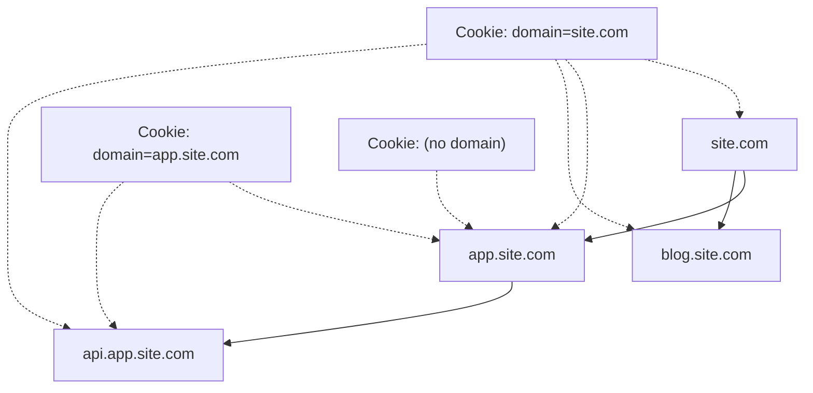
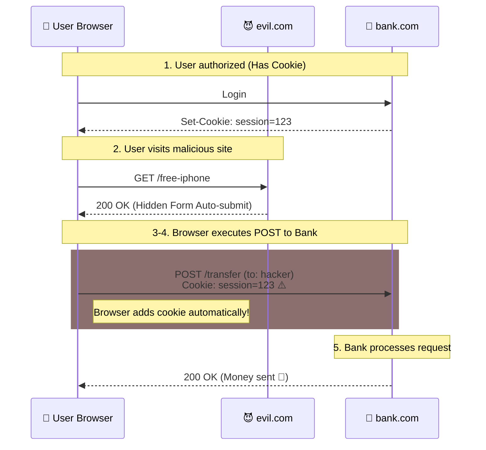

# Cookies: Повний гід по крихтам вебу

## Вступ: Що це і чому воно все ще тут?

Файли **Cookie** (куки, реп'яшки) — це, мабуть, найстаріша та найвідоміша технологія зберігання даних на клієнті. Вони з нами з 1994 року, коли Лу Монтуллі (Lou Montulli) в Netscape вигадав спосіб запам'ятати користувача між запитами.

До появи cookies веб був "безстанівим" (stateless). Сервер не мав пам'яті. Кожен запит був як перший поцілунок — сервер не пам'ятав, хто ви і що ви робили секунду тому. Cookies змінили все, додавши "пам'ять" (state) до HTTP.

### Чому це важливо знати у 2025?

Можливо, ви думаєте: _"У нас є LocalStorage, IndexedDB, навіщо мені ці старі cookies?"_

1.  **Аутентифікація:** Це все ще **єдиний** безпечний спосіб зберігання сесій (завдяки `HttpOnly`). LocalStorage вразливий до XSS.
2.  **Передача даних на сервер:** Cookies _автоматично_ летять із кожним запитом. Вам не треба додавати їх вручну в заголовки, як JWT токени.
3.  **Tracking & Analytics:** Весь рекламний бізнес інтернету побудований на них (хоча це змінюється).
4.  **Складність:** Cookies мають найскладнішу модель безпеки (`SameSite`, `Secure`, `Domain`, `Path`), яку критично важливо розуміти Fullstack розробнику.

> [!NOTE]
> Cookie — це просто рядок з даними (зазвичай `key=value`), який зберігається в браузері і _автоматично_ додається до заголовка `Cookie` при кожному запиті до відповідного домену.

---

## Анатомія Cookie

На низькому рівні, cookie — це частина HTTP протоколу ([RFC 6265](https://tools.ietf.org/html/rfc6265)).

### Як сервер встановлює Cookie?

Сервер надсилає заголовок `Set-Cookie` у відповіді:

```http
HTTP/1.1 200 OK
Content-Type: text/html
Set-Cookie: session_id=12345; Secure; HttpOnly; SameSite=Lax
Set-Cookie: user_pref=dark_mode; Max-Age=3600
```

### Як браузер відправляє Cookie?

При наступному запиті до цього ж домену, браузер збирає всі доступні cookies і відправляє їх в одному заголовку `Cookie` (розділені крапкою з комою):

```http
GET /profile HTTP/1.1
Host: example.com
Cookie: session_id=12345; user_pref=dark_mode
```

---

## Робота з JavaScript: document.cookie

У JavaScript доступ до cookies реалізований через "магічну" властивість `document.cookie`. Це не звичайний рядок об'єкта, а **аксесор** (get/set).

### Читання (Getter)

```javascript
const allCookies = document.cookie
console.log(allCookies)
// Виведе щось на зразок: "user=John; session_id=xyz; theme=dark"
```

**Проблеми при читанні:**

1.  Ми отримуємо **один довгий рядок**.
2.  Ми бачимо тільки пари `name=value`. Ми **не бачимо** атрибутів (`expires`, `path`, `domain`, `secure`).
3.  Ми не бачимо `HttpOnly` cookies (це фіча безпеки).

### Запис (Setter)

Запис працює контрінтуїтивно. Коли ви присвоюєте значення `document.cookie`, ви **не перезаписуєте** всі cookies, а **додаєте або оновлюєте** лише одну конкретну cookie.

```javascript
// Це НЕ видалить інші cookies! Це додасть нову.
document.cookie = 'user=John'

// Це оновить існуючу cookie 'user'
document.cookie = 'user=Jane'
```

### Кодування значень (Encoding)

Згідно зі специфікацією, ім'я та значення cookie можуть містити лише певний набір символів ASCII. Пробіли, коми, крапки з комою, кирилиця — заборонені (або можуть зламати парсинг).

Тому правило №1: **Завжди кодуйте імена та значення!**

```javascript
const name = 'my name'
const value = 'Ivan & Oksana'

// ❌ Небезпечно:
// document.cookie = name + "=" + value;

// ✅ Правильно:
document.cookie = encodeURIComponent(name) + '=' + encodeURIComponent(value)
// Результат: my%20name=Ivan%20%26%20Oksana
```

---

## Атрибути Cookie: Глибоке занурення

Атрибути — це налаштування, які вказують браузеру, як поводитися з cookie (коли видаляти, кому відправляти). Вони вказуються після крапки з комою.

### 1. Життєвий цикл: `Expires` та `Max-Age`

За замовчуванням (якщо атрибути не вказані), cookie є **сесійною** (`Session Cookie`). Вона живе, доки користувач не закриє браузер (саме браузер, а не вкладку!).

Щоб зробити cookie "вічною" (Persistent), треба вказати час життя.

#### `expires` (Old school)

Вказує конкретну дату в форматі GMT (UTC), коли cookie помре.

```javascript
// Живе до певної дати
document.cookie = 'user=John; expires=Tue, 19 Jan 2038 03:14:07 GMT'
```

_Мінус:_ Треба самому форматувати дату (`date.toUTCString()`).

#### `max-age` (Modern)

Вказує час життя в **секундах** від поточного моменту.

```javascript
// Живе 1 годину (3600 сек)
document.cookie = 'user=John; max-age=3600'

// Живе 1 рік
document.cookie = 'user=John; max-age=31536000'
```

#### Видалення cookie 🗑️

Не існує методу `deleteCookie()`. Щоб видалити cookie, треба встановити її знову з **минулою датою** або `max-age=0` (або -1).

```javascript
document.cookie = 'user=; max-age=0'
```

> [!IMPORTANT]
> При видаленні (як і при оновленні) ви повинні вказати **ті ж самі** `path` і `domain`, з якими cookie була створена! Інакше ви можете створити дублікат або нічого не видалити.

---

### 2. Область видимості: `Path` та `Domain`

Ці атрибути контролюють, на які URL браузер буде відправляти cookie.

#### `Path`

Вказує URL-шлях, для якого актуальна cookie.

-   `path=/` (стандарт): доступна на всьому сайті.
-   `path=/admin`: доступна на `/admin`, `/admin/users`, але **не** на `/` чи `/home`.

```javascript
// Видно тільки в адмінці
document.cookie = 'admin_token=123; path=/admin'
```

#### `Domain`

Найскладніший атрибут. Він контролює доступність між піддоменами.

**Правило:** Cookie, встановлена на домені, ніколи не доступна на іншому домені другого рівня (наприклад `site.com` не бачить cookies `google.com`).

Але як щодо `app.site.com` та `blog.site.com`?

1.  **Без `domain` (HostOnly):**
    Якщо ви пишете `document.cookie = "a=1"`, cookie прив'язується **тільки** до поточного хоста.

    -   Встановлено на `app.site.com`.
    -   Не видно на `site.com`.
    -   Не видно на `blog.site.com`.
    -   Не видно навіть на `www.app.site.com`.

2.  **З `domain=site.com`:**
    Якщо ви явно вказуєте домен, cookie стає доступною на цьому домені **і всіх піддоменах**.
    `document.cookie = "a=1; domain=site.com"`
    -   Видно на `site.com`
    -   Видно на `app.site.com`
    -   Видно на `dev.api.site.com`

::mermaid



::

---

### 3. Безпека: `Secure`

```javascript
document.cookie = 'user=John; Secure'
```

Атрибут `Secure` каже браузеру: _"Ніколи не відправляй цю cookie по незахищеному HTTP з'єднанню"_. Вона полетить на сервер тільки якщо протокол **HTTPS**.

Це захищає від атак типу Man-in-the-Middle, коли зловмисник перехоплює трафік у відкритому Wi-Fi.

> [!NOTE]
> На `localhost` браузери роблять виняток і дозволяють `Secure` cookies навіть по http, щоб розробникам було зручно.

---

### 4. Невидимка: `HttpOnly`

Цей атрибут **неможливо** встановити через JavaScript (`document.cookie`). Він встановлюється тільки сервером через заголовок `Set-Cookie`.

**Що він робить?**
Він забороняє JavaScript читати цю cookie. `document.cookie` її просто не побачить.

**Навіщо?**
Це головний захист від **XSS (Cross-Site Scripting)**. Якщо хакер знайде вразливість на вашому сайті і запустить свій JS код:
`alert(document.cookie)` — він **не отримає** ваші сесійні токени, якщо вони `HttpOnly`.

> [!TIP] > **Best Practice:** Усі cookies, що відповідають за аутентифікацію (JWT, session ID), **мусять** бути `HttpOnly`.

---

### 5. Головний щит: `SameSite`

Атрибут `SameSite` був введений для боротьби з **CSRF (Cross-Site Request Forgery)** та відстеженням. Він контролює, чи відправляється cookie, коли запит ініційовано з **іншого** сайту (cross-site).

Є три значення: `Strict`, `Lax`, `None`.

#### CSRF Атака (для контексту)

1. Користувач залогінений у банку (`bank.com`). Cookie сесії є в браузері.
2. Користувач заходить на `evil.com`.
3. На `evil.com` є прихована форма, яка відправляє POST запит на `bank.com/transfer` (переказати гроші).
4. Браузер бачить запит на `bank.com` і (за старими правилами) **автоматично додає cookie**.
5. Банк думає, що це легітимний запит від користувача. Гроші вкрадено.

::mermaid



::

#### `SameSite=Strict`

Cookie відправляється **тільки** для First-Party запитів (коли ви вже знаходитесь на `bank.com`).
Якщо ви перейшли за посиланням з Facebook на ваш банк, cookie **не відправиться**. Ви будете розлогінені.
Це супер безпечно, але незручно.

#### `SameSite=Lax` (Золотий стандарт 🛡️)

Це налаштування за замовчуванням у сучасних браузерах. Воно забезпечує найкращий баланс між безпекою та зручністю користувача.

**Логіка роботи:**
Cookie відправляється на сервер **тільки** якщо виконуються дві умови:

1.  Це **навігація верхнього рівня** (Top-Level Navigation). Тобто URL в адресному рядку браузера змінюється на ваш сайт.
2.  Використовується **безпечний HTTP метод** (зазвичай `GET`).

**Матриця поведінки:**

| Сценарій                                                      | Тип запиту          | Cookie відправляється? | Пояснення                                                                   |
| :------------------------------------------------------------ | :------------------ | :--------------------: | :-------------------------------------------------------------------------- |
| 🔗 **Клік по посиланню** (`<a href="...">`)                   | `GET` (Navigation)  |       ✅ **ТАК**       | Користувач свідомо переходить на сайт. Логін зберігається.                  |
| 🖼️ **Завантаження ресурсу** (``, `<iframe>`, `<script>`) | `GET` (Subresource) |       ❌ **НІ**        | Це фоновий запит з іншого сайту. Захищає від трекінгу та CSRF.              |
| 📝 **Відправка форми** (`<form method="POST">`)               | `POST`              |       ❌ **НІ**        | `POST` — метод, що змінює дані. Блокування захищає від класичних CSRF атак. |
| 📡 **Fetch / XHR**                                            | `GET`/`POST`        |       ❌ **НІ**        | Cross-site AJAX запити ніколи не передають Lax куки.                        |
| 🔄 **window.location.href**                                   | `GET` (Navigation)  |       ✅ **ТАК**       | Програмна навігація прирівнюється до кліку по посиланню.                    |

**Візуалізація захисту (Mermaid):**

```mermaid
flowchart TD
    User((Користувач))
    Evil[Сайт хакера\nattacker.com]
    Bank[Ваш сайт\nbank.com]

    User --> Evil

    subgraph Browser["Браузер (Cookie: SameSite=Lax)"]
        direction TB
        Link["1. Клік по посиланню\n<a href='bank.com'>"]
        Img["2. Прихований запит\n<img src='bank.com/pay'>"]
        Form["3. Авто-форма\n<form method='POST'>"]
    end

    Evil -.-> Link
    Evil -.-> Img
    Evil -.-> Form

    Link -->|GET Navigation| Allowed{✅ Дозволено}
    Img -->|Subresource| Blocked{❌ Блоковано}
    Form -->|POST Method| Blocked

    Allowed -->|Cookie Included| Bank
    Blocked -->|No Cookie| Bank

    style Allowed fill:#d4edda,stroke:#28a745,color:black
    style Blocked fill:#f8d7da,stroke:#dc3545,color:black
```



> [!NOTE]
> Завдяки `SameSite=Lax`, якщо ви залогінені в Facebook і перейдете на нього з іншого сайту по посиланню — ви залишитесь залогіненим. Але якщо інший сайт спробує лайкнути пост за вас через прихований запит — куки не передадуться, і Facebook відхилить дію.

#### `SameSite=None`

Поведінка "як раніше". Cookie відправляється завжди, навіть у запитах сторонніх ресурсів (рекламні трекери, YouTube embed і т.д.).
**Вимога:** Якщо `SameSite=None`, ви **зобов'язані** додати `Secure`. Без HTTPS така cookie буде відхилена браузером.

| Значення   | Перехід по посиланню  | AJAX/Fetch/Form POST | Iframe |
| :--------- | :-------------------: | :------------------: | :----: |
| **Strict** |          ❌           |          ❌          |   ❌   |
| **Lax**    | ✅ (Safe methods GET) |          ❌          |   ❌   |
| **None**   |          ✅           |          ✅          |   ✅   |

---

### 6. Майбутнє: `Partitioned` (CHIPS)

Google Chrome планує повністю заблокувати сторонні cookies (`SameSite=None`). Але як бути сервісам типу "чат підтримки", які вбудовуються в тисячі сайтів через `iframe` і потребують збереження стану?

Рішення — **CHIPS (Cookies Having Independent Partitioned State)**.
Атрибут `Partitioned` каже браузеру: _"Зберігай цю cookie окремо для кожного сайту, де вона використовується"_.

Cookie від `chat.com` на сайті `site-a.com` буде відрізнятися від cookie `chat.com` на `site-b.com`. Вони не зможуть "спілкуватися" між собою, але зможуть зберігати налаштування в межах одного сайту.

```http
Set-Cookie: user_color=blue; SameSite=None; Secure; Partitioned
```

---

## Безпека: XSS та CSRF

### XSS (Cross-Site Scripting)

Це коли зловмисник впроваджує свій JS код на вашу сторінку.

-   **Ризик:** Крадіжка сесій (Session Hijacking).
-   **Захист:**
    1. `HttpOnly` для сесійних cookies.
    2. Content Security Policy (CSP).
    3. Санітизація вводу.

### CSRF (Cross-Site Request Forgery)

Це коли зловмисник змушує браузер виконати дію від вашого імені.

-   **Ризик:** Несанкціоновані дії (зміна паролю, перекази).
-   **Захист:**
    1. `SameSite=Lax` (базовий захист).
    2. **CSRF Tokens:** Спеціальний токен в прихованому полі форми або заголовку, який сервер генерує для кожної сесії.

### Cookie Tossing

Атака, коли зловмисник контролює піддомен (наприклад `useless.site.com`), встановлює cookie з `domain=site.com`, і ця cookie "перебиває" легітимну cookie на `app.site.com`.

-   **Захист:** Використовувати префікси в назвах cookie.
    -   `__Host-`: вимагає `Secure`, `Path=/` і відсутність `Domain`.
    -   `__Secure-`: вимагає `Secure`.
        Приклад: `__Host-SessionID=123`. Браузер гарантує, що вона встановлена безпечно.

---

## Privacy: GDPR та Cookie Banners

В Європі (GDPR) та Каліфорнії (CCPA) ви не можете просто так ставити cookies.

### Категорії Cookie

1.  **Strictly Necessary (Технічні):** Логін, кошик товарів, безпека. Дозвіл **не потрібен**.
2.  **Preferences (Функціональні):** Мова, тема, регіон. Потрібен дозвіл.
3.  **Analytics (Статистичні):** Google Analytics. Потрібен **явний** дозвіл.
4.  **Marketing (Маркетингові):** Рекламні трекери. Потрібен **явний** дозвіл.

### Реалізація

Ви **не повинні** завантажувати скрипти аналітики (Google Analytics, Facebook Pixel), доки користувач не натисне "Accept". Багато сайтів порушують це, ставлячи cookies відразу, а банер показують "для галочки". Це незаконно в ЄС.

---

## Modern Helper Library: `CookieUtils`

Оскільки рідний API `document.cookie` жахливий, напишемо надійну бібліотеку для роботи з cookies. Це готовий до продакшену код.

```javascript
/**
 * Утиліти для роботи з Cookies.
 * Підтримує всі сучасні атрибути, правильне кодування та парсинг.
 */
const CookieUtils = {
    /**
     * Отримати cookie за ім'ям
     * @param {string} name
     * @returns {string|undefined} Значення або undefined
     */
    get(name) {
        if (typeof document === 'undefined') return undefined // SSR guard

        const matches = document.cookie.match(
            new RegExp('(?:^|; )' + name.replace(/([\.$?*|{}\(\)\[\]\\\/\+^])/g, '\\$1') + '=([^;]*)'),
        )

        return matches ? decodeURIComponent(matches[1]) : undefined
    },

    /**
     * Встановити cookie
     * @param {string} name
     * @param {string} value
     * @param {Object} options - { expires, path, domain, secure, samesite }
     */
    set(name, value, options = {}) {
        options = {
            path: '/', // за замовчуванням доступна на всьому сайті
            // ...інші дефолти
            ...options,
        }

        if (options.expires instanceof Date) {
            options.expires = options.expires.toUTCString()
        }

        let updatedCookie = encodeURIComponent(name) + '=' + encodeURIComponent(value)

        for (let optionKey in options) {
            updatedCookie += '; ' + optionKey
            let optionValue = options[optionKey]
            if (optionValue !== true) {
                updatedCookie += '=' + optionValue
            }
        }

        document.cookie = updatedCookie
    },

    /**
     * Видалити cookie
     * @param {string} name
     * @param {Object} options - Важливо передати ті ж path/domain, що при створенні!
     */
    delete(name, options = {}) {
        this.set(name, '', {
            ...options,
            'max-age': -1,
        })
    },

    /**
     * Перевірити чи є cookies увімкненими в браузері
     */
    isEnabled() {
        try {
            document.cookie = 'cookietest=1'
            const ret = document.cookie.indexOf('cookietest=') !== -1
            this.delete('cookietest')
            return ret
        } catch (e) {
            return false
        }
    },
}

// --- Приклади використання ---

// 1. Встановити сесійну cookie
CookieUtils.set('user', 'John')

// 2. Встановити cookie на 1 день з Secure
CookieUtils.set('token', 'xyz123', {
    'max-age': 86400,
    secure: true,
    samesite: 'Strict',
})

// 3. Отримати
console.log(CookieUtils.get('token')) // 'xyz123'

// 4. Видалити
CookieUtils.delete('user')
```

---

## Cookie vs Web Storage

Що краще використовувати?

| Характеристика          | Cookies                            | LocalStorage                   | SessionStorage         |
| :---------------------- | :--------------------------------- | :----------------------------- | :--------------------- |
| **Обсяг**               | 4 KB                               | 5-10 MB                        | 5-10 MB                |
| **Відправка на сервер** | **Автоматично** (з кожним запитом) | Ні (руками в JS)               | Ні                     |
| **Термін життя**        | Налаштовується (expires)           | Вічно (до очищення)            | До закриття вкладки    |
| **Доступність (вікна)** | Всі вкладки/вікна                  | Всі вкладки/вікна              | Тільки поточна вкладка |
| **Доступ JS**           | Так (крім HttpOnly)                | Так                            | Так                    |
| **Безпека (XSS)**       | Можна захистити (HttpOnly)         | Вразливе                       | Вразливе               |
| **Використання**        | Auth токени, серверні сесії        | Налаштування UI, кеш, чернетки | Дані форми, скрол      |

> [!WARNING]
> Ніколи не зберігайте JWT токени в LocalStorage, якщо ви хочете максимальної безпеки. XSS атака дозволить вкрасти токен з LocalStorage миттєво. HttpOnly Cookies — єдине місце, куди JS не може залізти.

---

## Підсумки та Best Practices

1.  **Мінімізуйте розмір:** Cookies літають з кожним запитом (навіть за картинками). Великі cookies уповільнюють сайт.
2.  **Завжди використовуйте `encodeURIComponent`** для імен і значень.
3.  **Безпека за замовчуванням:** Старайтесь завжди ставити `Secure` та `SameSite=Lax`.
4.  **Аутентифікація тільки в HttpOnly:** Не давайте JavaScript доступ до сесійних даних.
5.  **Враховуйте GDPR:** Не ставте аналітику без дозволу.
6.  **Використовуйте бібліотеки:** Не парсіть `document.cookie` регулярками вручну в кожному файлі. Використовуйте `js-cookie` або наш `CookieUtils`.

Тепер ви знаєте про cookies більше, ніж 90% розробників. Ви готові до світу без сторонніх cookies! 🍪

::card-group

::card{icon="lucide:shield-check"}
#title
HttpOnly

#description
Ваш найкращий друг для захисту від крадіжки сесій через XSS. JavaScript сліпий до цих cookies.
::

::card{icon="lucide:lock"}
#title
Secure

#description
Гарантує, що cookie ніколи не полетить по відкритому дроту. Обов'язково для будь-яких чутливих даних.
::

::card{icon="lucide:globe"}
#title
SameSite

#description
Ваш щит від CSRF атак. Контролює, коли cookie може "перетинати кордон" між сайтами. `Lax` - це новий стандарт.
::

::card{icon="lucide:hard-drive"}
#title
4KB Limit

#description
Пам'ятайте про ліміт розміру. Cookies — це не база даних. Для великих даних є IndexedDB.
::

::
