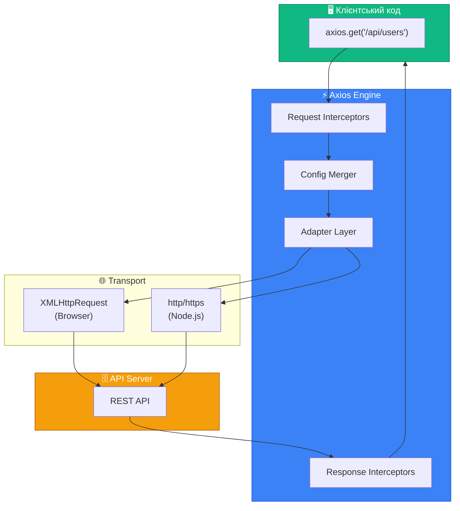
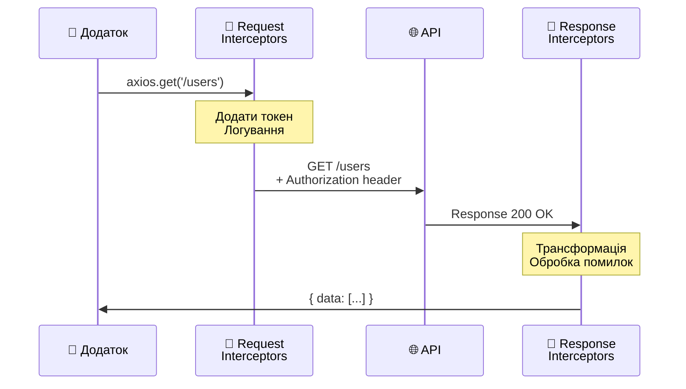
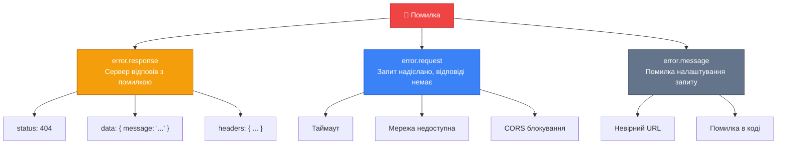

# Axios: Потужний HTTP-клієнт для JavaScript

Уявіть ситуацію: ви розробляєте сучасний веб-додаток, який має спілкуватися з десятками різних API — отримувати дані про продукти, авторизувати користувачів, завантажувати файли, обробляти помилки мережі. Ви могли б використовувати вбудований `Fetch API`, але швидко зрозуміли б, що для кожного запиту доводиться писати однотипний код: перевірка статусу, перетворення JSON, обробка таймаутів... Чи є спосіб працювати з HTTP-запитами елегантніше?

**Axios** — це саме те рішення, яке обрали мільйони розробників по всьому світу. Ця бібліотека перетворює роботу з HTTP на задоволення, надаючи потужний, гнучкий та інтуїтивно зрозумілий API.

::tip
Після вивчення цього матеріалу ви зможете впевнено використовувати Axios для будь-яких HTTP-операцій: від простих GET-запитів до складних сценаріїв з перехоплювачами, автоматичною авторизацією та скасуванням запитів.
::

## Передумови

Перед вивченням цього матеріалу рекомендуємо ознайомитись з:

- [Fetch API](./01-fetch-api.md) — розуміння базових концепцій HTTP-запитів
- [Робота з FormData](./02-formdata.md) — для розуміння завантаження файлів
- [Скасування запитів](./04-abort-requests.md) — концепція AbortController

---

## Що таке Axios?

**Axios** (грецькою "ἄξιος" — "вартий", "достойний") — це promise-based HTTP-клієнт для браузера та Node.js. Бібліотека була створена у 2014 році як відповідь на потребу в зручнішому способі виконання AJAX-запитів.

### Архітектура Axios

::mermaid



::

**Ключові компоненти:**

1. **Request Interceptors** — функції, що виконуються перед кожним запитом (наприклад, додавання токена авторизації)
2. **Config Merger** — об'єднує глобальні налаштування з параметрами конкретного запиту
3. **Adapter Layer** — абстракція, що дозволяє Axios працювати як у браузері (XMLHttpRequest), так і в Node.js (http/https модулі)
4. **Response Interceptors** — функції для обробки відповідей перед поверненням до клієнтського коду

---

## Axios vs Fetch API

Перш ніж обирати інструмент, важливо розуміти відмінності між вбудованим `Fetch API` та Axios:

| Критерій                            | Fetch API                       | Axios                                  |
| :---------------------------------- | :------------------------------ | :------------------------------------- |
| **Вбудований у браузер**            | ✅ Так                          | ❌ Потребує встановлення               |
| **Автоматичне перетворення JSON**   | ❌ Потрібен `.json()`           | ✅ Автоматично                         |
| **Відхилення промісу при помилках** | ❌ Тільки при мережевій помилці | ✅ При статусах 4xx/5xx                |
| **Скасування запитів**              | ✅ AbortController              | ✅ AbortController                     |
| **Перехоплювачі (Interceptors)**    | ❌ Немає                        | ✅ Вбудовані                           |
| **Трансформація даних**             | ❌ Вручну                       | ✅ transformRequest/Response           |
| **Таймаути**                        | ❌ Через AbortController        | ✅ Вбудована опція `timeout`           |
| **Прогрес завантаження**            | ❌ Складно                      | ✅ onUploadProgress/onDownloadProgress |
| **XSRF захист**                     | ❌ Вручну                       | ✅ Вбудований                          |
| **Підтримка Node.js**               | ❌ Потрібен polyfill            | ✅ Нативна                             |

::note
Fetch API є чудовим вибором для простих запитів, але Axios виграє при побудові складних додатків з багатьма API-взаємодіями.
::

### Порівняння коду: Fetch vs Axios

::code-group

```javascript [Fetch API]
// Fetch API: потрібно багато ручної роботи
async function getUser(id) {
    try {
        const response = await fetch(`https://api.escuelajs.co/api/v1/users/${id}`)

        // Fetch НЕ кидає помилку при 404, 500 тощо!
        if (!response.ok) {
            throw new Error(`HTTP error! status: ${response.status}`)
        }

        // Потрібно вручну парсити JSON
        const data = await response.json()
        return data
    } catch (error) {
        console.error('Помилка:', error)
        throw error
    }
}
```

```javascript [Axios]
// Axios: чистий та лаконічний код
async function getUser(id) {
    try {
        // Автоматичний парсинг JSON та помилки при 4xx/5xx
        const { data } = await axios.get(`https://api.escuelajs.co/api/v1/users/${id}`)
        return data
    } catch (error) {
        console.error('Помилка:', error.response?.data || error.message)
        throw error
    }
}
```

::

---

## Встановлення та налаштування

### Встановлення через NPM

```bash
npm install axios
```

### Імпорт у проєкт

::code-group

```javascript [ES Modules]
// Сучасний синтаксис (Vite, Webpack, ESM)
import axios from 'axios'
```

```javascript [CommonJS]
// Node.js (CommonJS)
const axios = require('axios')
```

```html [CDN (браузер)]
<!-- Підключення через CDN -->
<script src="https://cdn.jsdelivr.net/npm/axios/dist/axios.min.js"></script>
<script>
    // axios доступний глобально
    axios.get('/api/data').then((response) => console.log(response.data))
</script>
```

::

---

## Базові HTTP-методи

Axios надає зручні методи для всіх HTTP-операцій. У цьому розділі ми використовуватимемо **Platzi Fake Store API** — безкоштовний тестовий API для практики.

::note
**Platzi Fake Store API** (`https://api.escuelajs.co/api/v1/`) — це реалістичний e-commerce API з підтримкою CRUD операцій, JWT авторизації та пагінації. Ідеальний для навчання!
::

### GET — отримання даних

**GET-запити** використовуються для отримання даних з сервера. Це найпоширеніший тип запитів.

```javascript showLineNumbers
import axios from 'axios'

// Отримання списку продуктів
async function getProducts() {
    try {
        const response = await axios.get('https://api.escuelajs.co/api/v1/products')

        console.log('Статус:', response.status) // 200
        console.log('Заголовки:', response.headers) // об'єкт з заголовками
        console.log('Дані:', response.data) // масив продуктів

        return response.data
    } catch (error) {
        console.error('Помилка отримання продуктів:', error.message)
    }
}

// Отримання одного продукту за ID
async function getProductById(id) {
    try {
        const { data } = await axios.get(`https://api.escuelajs.co/api/v1/products/${id}`)
        console.log('Продукт:', data.title, '- $' + data.price)
        return data
    } catch (error) {
        if (error.response?.status === 404) {
            console.log('Продукт не знайдено')
        }
    }
}

// Виклик функцій
getProducts()
getProductById(4)
```

**Анатомія відповіді:**

Об'єкт `response` від Axios містить:

- `response.data` — тіло відповіді (автоматично парситься з JSON)
- `response.status` — HTTP статус-код (200, 404, 500 тощо)
- `response.statusText` — текстовий опис статусу ("OK", "Not Found")
- `response.headers` — заголовки відповіді
- `response.config` — конфігурація, що була використана для запиту
- `response.request` — об'єкт запиту (XMLHttpRequest у браузері)

### GET з параметрами запиту

Для передачі query-параметрів використовуйте опцію `params`:

```javascript showLineNumbers
import axios from 'axios'

// Пагінація: отримати 10 продуктів, починаючи з 20-го
async function getProductsWithPagination(offset = 0, limit = 10) {
    try {
        const { data } = await axios.get('https://api.escuelajs.co/api/v1/products', {
            params: {
                offset: offset, // скільки пропустити
                limit: limit, // скільки отримати
            },
        })
        // URL буде: /products?offset=0&limit=10

        console.log(`Отримано ${data.length} продуктів`)
        return data
    } catch (error) {
        console.error('Помилка:', error.message)
    }
}

// Фільтрація за ціною
async function getProductsByPriceRange(minPrice, maxPrice) {
    try {
        const { data } = await axios.get('https://api.escuelajs.co/api/v1/products', {
            params: {
                price_min: minPrice,
                price_max: maxPrice,
            },
        })
        // URL буде: /products?price_min=100&price_max=500

        console.log(`Знайдено ${data.length} продуктів у ціновому діапазоні`)
        return data
    } catch (error) {
        console.error('Помилка:', error.message)
    }
}

// Приклади виклику
getProductsWithPagination(0, 5)
getProductsByPriceRange(100, 500)
```

::tip
Axios автоматично кодує параметри та створює правильний URL. Вам не потрібно вручну конкатенувати рядки!
::

### POST — створення ресурсів

**POST-запити** використовуються для створення нових ресурсів на сервері.

```javascript showLineNumbers
import axios from 'axios'

// Створення нового продукту
async function createProduct(productData) {
    try {
        const { data } = await axios.post('https://api.escuelajs.co/api/v1/products', {
            title: productData.title,
            price: productData.price,
            description: productData.description,
            categoryId: productData.categoryId,
            images: productData.images,
        })

        console.log('Створено продукт з ID:', data.id)
        console.log('Slug:', data.slug)
        return data
    } catch (error) {
        if (error.response) {
            // Сервер відповів з помилкою
            console.error('Помилка валідації:', error.response.data)
        } else {
            console.error('Помилка мережі:', error.message)
        }
    }
}

// Приклад використання
createProduct({
    title: 'Новий смартфон',
    price: 999,
    description: 'Потужний смартфон з чудовою камерою',
    categoryId: 1,
    images: ['https://placehold.co/600x400'],
})
```

**Що відбувається під капотом:**

1. Axios автоматично серіалізує JavaScript-об'єкт у JSON
2. Встановлює заголовок `Content-Type: application/json`
3. Надсилає запит на сервер
4. Парсить JSON-відповідь назад у JavaScript-об'єкт

### PUT/PATCH — оновлення ресурсів

**PUT** — повна заміна ресурсу. **PATCH** — часткове оновлення.

```javascript showLineNumbers
import axios from 'axios'

// PUT: повне оновлення продукту
async function updateProduct(id, productData) {
    try {
        const { data } = await axios.put(`https://api.escuelajs.co/api/v1/products/${id}`, productData)

        console.log('Оновлено:', data.title)
        return data
    } catch (error) {
        console.error('Помилка оновлення:', error.response?.data || error.message)
    }
}

// PATCH: часткове оновлення (тільки ціна)
async function updateProductPrice(id, newPrice) {
    try {
        const { data } = await axios.patch(
            `https://api.escuelajs.co/api/v1/products/${id}`,
            { price: newPrice }, // тільки поле, яке потрібно змінити
        )

        console.log(`Ціну змінено на $${data.price}`)
        return data
    } catch (error) {
        console.error('Помилка:', error.message)
    }
}

// Приклади
updateProduct(1, {
    title: 'Оновлена назва',
    price: 150,
})

updateProductPrice(1, 199)
```

::note
Більшість API підтримують як PUT, так і PATCH. Platzi API обробляє обидва методи однаково — як часткове оновлення.
::

### DELETE — видалення ресурсів

```javascript showLineNumbers
import axios from 'axios'

// Видалення продукту
async function deleteProduct(id) {
    try {
        const { data } = await axios.delete(`https://api.escuelajs.co/api/v1/products/${id}`)

        // Platzi API повертає true при успішному видаленні
        if (data === true) {
            console.log(`Продукт ${id} успішно видалено`)
        }
        return data
    } catch (error) {
        if (error.response?.status === 404) {
            console.log('Продукт не знайдено')
        } else {
            console.error('Помилка видалення:', error.message)
        }
    }
}

deleteProduct(210)
```

---

## Конфігурація запитів

Axios надає гнучку систему конфігурації. Кожен запит може мати власний набір параметрів.

### Повна структура конфігурації

```javascript showLineNumbers
import axios from 'axios'

// Приклад запиту з повною конфігурацією
const config = {
    // Обов'язкові
    url: '/products',
    method: 'get', // 'get' | 'post' | 'put' | 'patch' | 'delete'

    // Базовий URL (додається до url)
    baseURL: 'https://api.escuelajs.co/api/v1',

    // Заголовки запиту
    headers: {
        'Content-Type': 'application/json',
        Authorization: 'Bearer your-token-here',
        'X-Custom-Header': 'custom-value',
    },

    // Query параметри (?key=value)
    params: {
        limit: 10,
        offset: 0,
    },

    // Тіло запиту (для POST, PUT, PATCH)
    data: {
        title: 'Новий продукт',
        price: 100,
    },

    // Таймаут у мілісекундах
    timeout: 5000,

    // Тип відповіді: 'json' | 'text' | 'blob' | 'arraybuffer' | 'document' | 'stream'
    responseType: 'json',

    // Функція валідації статусу
    validateStatus: function (status) {
        return status >= 200 && status < 300 // За замовчуванням
    },

    // Максимальна кількість редиректів (Node.js)
    maxRedirects: 5,

    // Прогрес завантаження
    onUploadProgress: function (progressEvent) {
        const percent = Math.round((progressEvent.loaded * 100) / progressEvent.total)
        console.log(`Завантажено: ${percent}%`)
    },

    // Прогрес отримання
    onDownloadProgress: function (progressEvent) {
        const percent = Math.round((progressEvent.loaded * 100) / progressEvent.total)
        console.log(`Отримано: ${percent}%`)
    },

    // Сигнал для скасування запиту
    signal: new AbortController().signal,
}

axios(config)
    .then((response) => console.log(response.data))
    .catch((error) => console.error(error))
```

### Найважливіші опції конфігурації

| Опція            | Тип         | Опис                                      |
| :--------------- | :---------- | :---------------------------------------- |
| `url`            | string      | URL ендпоінту                             |
| `method`         | string      | HTTP метод (get, post, put, delete...)    |
| `baseURL`        | string      | Базовий URL, що додається до `url`        |
| `headers`        | object      | HTTP заголовки                            |
| `params`         | object      | Query-параметри для URL                   |
| `data`           | any         | Тіло запиту                               |
| `timeout`        | number      | Таймаут у мілісекундах (0 = без таймауту) |
| `responseType`   | string      | Тип даних відповіді                       |
| `validateStatus` | function    | Функція для визначення успішності запиту  |
| `signal`         | AbortSignal | Сигнал для скасування запиту              |

---

## Інстанси Axios (Axios Instances)

У реальних проєктах часто потрібно працювати з кількома API або мати різні конфігурації для різних частин додатку. Для цього Axios дозволяє створювати **інстанси** — окремі екземпляри з власними налаштуваннями.

### Створення інстансу

```javascript showLineNumbers
import axios from 'axios'

// Створення інстансу для Platzi Store API
const storeApi = axios.create({
    baseURL: 'https://api.escuelajs.co/api/v1',
    timeout: 10000,
    headers: {
        'Content-Type': 'application/json',
    },
})

// Тепер можна використовувати без повного URL
async function getProducts() {
    // URL буде: https://api.escuelajs.co/api/v1/products
    const { data } = await storeApi.get('/products')
    return data
}

async function getCategories() {
    // URL буде: https://api.escuelajs.co/api/v1/categories
    const { data } = await storeApi.get('/categories')
    return data
}
```

### Практичний приклад: API-клієнт для проєкту

Ось як організувати API-клієнт у реальному проєкті:

::code-tree

```javascript [api/index.js]
import axios from 'axios'

// Базовий інстанс
export const apiClient = axios.create({
    baseURL: 'https://api.escuelajs.co/api/v1',
    timeout: 15000,
    headers: {
        'Content-Type': 'application/json',
    },
})

// Додаємо токен до кожного запиту
apiClient.interceptors.request.use((config) => {
    const token = localStorage.getItem('accessToken')
    if (token) {
        config.headers.Authorization = `Bearer ${token}`
    }
    return config
})
```

```javascript [api/products.js]
import { apiClient } from './index.js'

export const productsApi = {
    // GET /products
    getAll(params = {}) {
        return apiClient.get('/products', { params })
    },

    // GET /products/:id
    getById(id) {
        return apiClient.get(`/products/${id}`)
    },

    // POST /products
    create(productData) {
        return apiClient.post('/products', productData)
    },

    // PUT /products/:id
    update(id, productData) {
        return apiClient.put(`/products/${id}`, productData)
    },

    // DELETE /products/:id
    delete(id) {
        return apiClient.delete(`/products/${id}`)
    },

    // GET /products with filters
    search({ title, priceMin, priceMax, categoryId }) {
        return apiClient.get('/products', {
            params: {
                title,
                price_min: priceMin,
                price_max: priceMax,
                categoryId,
            },
        })
    },
}
```

```javascript [api/categories.js]
import { apiClient } from './index.js'

export const categoriesApi = {
    getAll() {
        return apiClient.get('/categories')
    },

    getById(id) {
        return apiClient.get(`/categories/${id}`)
    },

    getProducts(categoryId) {
        return apiClient.get(`/categories/${categoryId}/products`)
    },
}
```

```javascript [app.js]
// Використання в додатку
import { productsApi } from './api/products.js'
import { categoriesApi } from './api/categories.js'

async function loadDashboard() {
    try {
        // Паралельне завантаження
        const [productsRes, categoriesRes] = await Promise.all([
            productsApi.getAll({ limit: 10 }),
            categoriesApi.getAll(),
        ])

        console.log('Продукти:', productsRes.data)
        console.log('Категорії:', categoriesRes.data)
    } catch (error) {
        console.error('Помилка завантаження:', error.message)
    }
}

loadDashboard()
```

::

**Переваги такої структури:**

1. **Централізація** — всі налаштування API в одному місці
2. **Модульність** — кожен ресурс API в окремому файлі
3. **Легке тестування** — можна замокати API-клієнт
4. **DRY принцип** — не дублюємо baseURL та headers

### Порядок пріоритету конфігурації

Axios об'єднує конфігурації в такому порядку (останній перезаписує попередній):

1. **Бібліотечні defaults** (lib/defaults)
2. **Defaults інстансу** (`instance.defaults`)
3. **Конфігурація запиту** (`config` параметр методу)

```javascript showLineNumbers
import axios from 'axios'

// Глобальні defaults
axios.defaults.baseURL = 'https://api.example.com'
axios.defaults.timeout = 5000

// Defaults інстансу (перезаписують глобальні)
const api = axios.create({
    baseURL: 'https://api.escuelajs.co/api/v1', // перезапише глобальний
    timeout: 10000, // перезапише глобальний
})

// Конфігурація запиту (перезаписує defaults інстансу)
api.get('/products', {
    timeout: 30000, // для цього одного запиту таймаут буде 30 секунд
})
```

---

## Перехоплювачі (Interceptors)

**Перехоплювачі** — це функції, які автоматично виконуються для кожного запиту або відповіді. Це одна з найпотужніших можливостей Axios.

::mermaid



::

### Request Interceptors

Виконуються **перед** відправкою запиту на сервер.

```javascript showLineNumbers
import axios from 'axios'

const api = axios.create({
    baseURL: 'https://api.escuelajs.co/api/v1',
})

// Додаємо request interceptor
api.interceptors.request.use(
    // onFulfilled: виконується перед запитом
    function (config) {
        // 1. Додаємо токен авторизації
        const token = localStorage.getItem('accessToken')
        if (token) {
            config.headers.Authorization = `Bearer ${token}`
        }

        // 2. Логування запитів (для дебагу)
        console.log(`📤 ${config.method.toUpperCase()} ${config.url}`)

        // 3. Додаємо timestamp
        config.metadata = { startTime: new Date() }

        // ОБОВ'ЯЗКОВО повертаємо config!
        return config
    },
    // onRejected: виконується при помилці налаштування запиту
    function (error) {
        console.error('❌ Помилка налаштування запиту:', error)
        return Promise.reject(error)
    },
)
```

### Response Interceptors

Виконуються **після** отримання відповіді від сервера.

```javascript showLineNumbers
import axios from 'axios'

const api = axios.create({
    baseURL: 'https://api.escuelajs.co/api/v1',
})

// Додаємо response interceptor
api.interceptors.response.use(
    // onFulfilled: успішна відповідь (2xx)
    function (response) {
        // 1. Логування часу відповіді
        const duration = new Date() - response.config.metadata?.startTime
        console.log(`📥 ${response.status} ${response.config.url} (${duration}ms)`)

        // 2. Можна трансформувати дані
        // response.data = transformData(response.data);

        return response
    },
    // onRejected: помилка (4xx, 5xx, мережеві помилки)
    function (error) {
        // Отримуємо деталі помилки
        const status = error.response?.status
        const url = error.config?.url

        console.error(`❌ ${status || 'Network'} Error: ${url}`)

        // 3. Глобальна обробка типових помилок
        if (status === 401) {
            console.log('Сесія закінчилась, виконуємо logout...')
            localStorage.removeItem('accessToken')
            // window.location.href = '/login';
        }

        if (status === 403) {
            console.log('Недостатньо прав доступу')
        }

        if (status === 500) {
            console.log('Помилка сервера, спробуйте пізніше')
        }

        return Promise.reject(error)
    },
)
```

### Практичний приклад: Автоматичне оновлення токена

Одна з найпоширеніших задач — автоматичне оновлення JWT токена при отриманні 401 помилки:

```javascript showLineNumbers
import axios from 'axios'

const api = axios.create({
    baseURL: 'https://api.escuelajs.co/api/v1',
})

// Змінна для запобігання повторним оновленням
let isRefreshing = false
let failedQueue = []

const processQueue = (error, token = null) => {
    failedQueue.forEach((promise) => {
        if (error) {
            promise.reject(error)
        } else {
            promise.resolve(token)
        }
    })
    failedQueue = []
}

api.interceptors.response.use(
    (response) => response,
    async (error) => {
        const originalRequest = error.config

        // Якщо отримали 401 і це не запит на оновлення токена
        if (error.response?.status === 401 && !originalRequest._retry) {
            if (isRefreshing) {
                // Додаємо запит до черги
                return new Promise((resolve, reject) => {
                    failedQueue.push({ resolve, reject })
                }).then((token) => {
                    originalRequest.headers.Authorization = `Bearer ${token}`
                    return api(originalRequest)
                })
            }

            originalRequest._retry = true
            isRefreshing = true

            try {
                const refreshToken = localStorage.getItem('refreshToken')
                const { data } = await axios.post('https://api.escuelajs.co/api/v1/auth/refresh-token', {
                    refreshToken,
                })

                // Зберігаємо новий токен
                localStorage.setItem('accessToken', data.access_token)
                localStorage.setItem('refreshToken', data.refresh_token)

                // Оновлюємо заголовок
                api.defaults.headers.Authorization = `Bearer ${data.access_token}`
                originalRequest.headers.Authorization = `Bearer ${data.access_token}`

                processQueue(null, data.access_token)

                // Повторюємо оригінальний запит
                return api(originalRequest)
            } catch (refreshError) {
                processQueue(refreshError, null)
                // Logout користувача
                localStorage.removeItem('accessToken')
                localStorage.removeItem('refreshToken')
                return Promise.reject(refreshError)
            } finally {
                isRefreshing = false
            }
        }

        return Promise.reject(error)
    },
)
```

### Видалення перехоплювачів

Іноді потрібно видалити перехоплювач (наприклад, для тестування):

```javascript showLineNumbers
const api = axios.create()

// Зберігаємо ID перехоплювача
const interceptorId = api.interceptors.request.use((config) => {
    console.log('Це буде видалено')
    return config
})

// Видаляємо перехоплювач
api.interceptors.request.eject(interceptorId)
```

---

## Обробка помилок

Правильна обробка помилок — критичний аспект роботи з HTTP-запитами.

### Структура об'єкта помилки

::mermaid



::

### Повна обробка помилок

```javascript showLineNumbers
import axios from 'axios'

async function fetchData() {
    try {
        const { data } = await axios.get('https://api.escuelajs.co/api/v1/products/99999')
        return data
    } catch (error) {
        if (error.response) {
            // ✅ Сервер відповів з помилкою (4xx, 5xx)
            console.log('Статус помилки:', error.response.status)
            console.log('Дані помилки:', error.response.data)
            console.log('Заголовки:', error.response.headers)

            // Обробка конкретних статусів
            switch (error.response.status) {
                case 400:
                    console.log('Невірний запит:', error.response.data.message)
                    break
                case 401:
                    console.log('Необхідна авторизація')
                    break
                case 403:
                    console.log('Доступ заборонено')
                    break
                case 404:
                    console.log('Ресурс не знайдено')
                    break
                case 422:
                    console.log('Помилка валідації:', error.response.data.message)
                    break
                case 500:
                    console.log('Помилка сервера')
                    break
                default:
                    console.log('Невідома помилка')
            }
        } else if (error.request) {
            // ✅ Запит надіслано, але відповіді немає
            console.log('Мережева помилка - сервер не відповів')
            console.log('Request:', error.request)

            // Можливі причини:
            // - Немає інтернету
            // - Сервер недоступний
            // - Таймаут
            // - CORS блокування
        } else {
            // ✅ Помилка налаштування запиту
            console.log('Помилка конфігурації:', error.message)
        }

        // Додаткова інформація
        console.log('Конфігурація запиту:', error.config)

        throw error // Прокидаємо помилку далі
    }
}
```

### Створення власного класу помилки

```javascript showLineNumbers
// Кастомний клас для API помилок
class ApiError extends Error {
    constructor(message, status, data) {
        super(message)
        this.name = 'ApiError'
        this.status = status
        this.data = data
    }

    static fromAxiosError(error) {
        if (error.response) {
            return new ApiError(
                error.response.data?.message || error.message,
                error.response.status,
                error.response.data,
            )
        }
        if (error.request) {
            return new ApiError('Мережева помилка', 0, null)
        }
        return new ApiError(error.message, -1, null)
    }
}

// Використання в interceptor
api.interceptors.response.use(
    (response) => response,
    (error) => Promise.reject(ApiError.fromAxiosError(error)),
)

// Тепер можна обробляти так:
try {
    await api.get('/products')
} catch (error) {
    if (error instanceof ApiError) {
        console.log(`API Error [${error.status}]: ${error.message}`)
    }
}
```

---

## Скасування запитів (AbortController)

У сучасних додатках часто потрібно скасовувати незавершені запити — наприклад, при переході на іншу сторінку або при введенні нового пошукового запиту.

### Базове скасування

```javascript showLineNumbers
import axios from 'axios'

// Створюємо контролер
const controller = new AbortController()

// Передаємо signal в запит
axios
    .get('https://api.escuelajs.co/api/v1/products', {
        signal: controller.signal,
    })
    .then((response) => {
        console.log('Дані:', response.data)
    })
    .catch((error) => {
        if (axios.isCancel(error) || error.name === 'CanceledError') {
            console.log('Запит скасовано:', error.message)
        } else {
            console.error('Помилка:', error.message)
        }
    })

// Скасовуємо запит через 100мс
setTimeout(() => {
    controller.abort()
    console.log('Запит скасовано!')
}, 100)
```

### Практичний приклад: Пошук з debounce

```javascript showLineNumbers
import axios from 'axios'

// Зберігаємо поточний контролер
let searchController = null

async function searchProducts(query) {
    // Скасовуємо попередній запит, якщо він ще виконується
    if (searchController) {
        searchController.abort()
    }

    // Створюємо новий контролер
    searchController = new AbortController()

    try {
        const { data } = await axios.get('https://api.escuelajs.co/api/v1/products', {
            params: { title: query },
            signal: searchController.signal,
        })

        console.log(`Знайдено ${data.length} продуктів для "${query}"`)
        return data
    } catch (error) {
        if (axios.isCancel(error)) {
            console.log(`Пошук "${query}" скасовано — новий запит`)
            return null // Не обробляємо як помилку
        }
        throw error
    }
}

// Симуляція швидкого введення
searchProducts('iph') // Скасується
searchProducts('ipho') // Скасується
searchProducts('iphon') // Скасується
searchProducts('iphone') // Виконається
```

### Автоматичне скасування при таймауті

```javascript showLineNumbers
import axios from 'axios'

async function fetchWithTimeout(url, timeoutMs = 5000) {
    const controller = new AbortController()

    // Автоматичне скасування через timeout
    const timeoutId = setTimeout(() => {
        controller.abort()
    }, timeoutMs)

    try {
        const response = await axios.get(url, {
            signal: controller.signal,
        })
        clearTimeout(timeoutId)
        return response.data
    } catch (error) {
        clearTimeout(timeoutId)
        if (axios.isCancel(error)) {
            throw new Error(`Запит перевищив таймаут ${timeoutMs}мс`)
        }
        throw error
    }
}

// Використання
fetchWithTimeout('https://api.escuelajs.co/api/v1/products', 3000)
    .then((data) => console.log('Отримано:', data.length, 'продуктів'))
    .catch((error) => console.error(error.message))
```

::tip
Axios також має вбудовану опцію `timeout`, яка автоматично скасовує запит. Проте `AbortController` дає більше контролю та є стандартом Web API.
::

---

## Робота з FormData та файлами

### Базове завантаження файлу

```javascript showLineNumbers
import axios from 'axios'

// HTML: <input type="file" id="fileInput">

async function uploadFile() {
    const fileInput = document.getElementById('fileInput')
    const file = fileInput.files[0]

    if (!file) {
        console.error('Файл не обрано')
        return
    }

    const formData = new FormData()
    formData.append('file', file)

    try {
        const { data } = await axios.post('https://api.escuelajs.co/api/v1/files/upload', formData, {
            headers: {
                'Content-Type': 'multipart/form-data',
            },
            onUploadProgress: (progressEvent) => {
                const percent = Math.round((progressEvent.loaded * 100) / progressEvent.total)
                console.log(`Завантаження: ${percent}%`)
            },
        })

        console.log('Файл завантажено:', data.location)
        return data
    } catch (error) {
        console.error('Помилка завантаження:', error.response?.data || error.message)
    }
}
```

### Завантаження файлу з даними форми

```javascript showLineNumbers
import axios from 'axios'

async function createProductWithImage(productData, imageFile) {
    const formData = new FormData()

    // Спочатку завантажуємо зображення
    formData.append('file', imageFile)

    try {
        // 1. Завантажуємо зображення
        const uploadResponse = await axios.post('https://api.escuelajs.co/api/v1/files/upload', formData, {
            headers: { 'Content-Type': 'multipart/form-data' },
        })

        const imageUrl = uploadResponse.data.location

        // 2. Створюємо продукт з URL зображення
        const { data } = await axios.post('https://api.escuelajs.co/api/v1/products', {
            ...productData,
            images: [imageUrl],
        })

        console.log('Продукт створено:', data)
        return data
    } catch (error) {
        console.error('Помилка:', error.response?.data || error.message)
    }
}
```

---

## Паралельні запити

### Promise.all для незалежних запитів

```javascript showLineNumbers
import axios from 'axios'

async function loadDashboardData() {
    try {
        const [productsRes, categoriesRes, usersRes] = await Promise.all([
            axios.get('https://api.escuelajs.co/api/v1/products?limit=5'),
            axios.get('https://api.escuelajs.co/api/v1/categories'),
            axios.get('https://api.escuelajs.co/api/v1/users?limit=5'),
        ])

        return {
            products: productsRes.data,
            categories: categoriesRes.data,
            users: usersRes.data,
        }
    } catch (error) {
        // Якщо хоча б один запит впаде — всі падають
        console.error('Помилка завантаження:', error.message)
    }
}
```

### axios.all та axios.spread (альтернатива)

```javascript showLineNumbers
import axios from 'axios'

// axios.all = Promise.all
// axios.spread = деструктуризація результатів
axios
    .all([
        axios.get('https://api.escuelajs.co/api/v1/products?limit=5'),
        axios.get('https://api.escuelajs.co/api/v1/categories'),
    ])
    .then(
        axios.spread((productsRes, categoriesRes) => {
            console.log('Продукти:', productsRes.data)
            console.log('Категорії:', categoriesRes.data)
        }),
    )
```

### Promise.allSettled для толерантності до помилок

```javascript showLineNumbers
import axios from 'axios'

async function loadDataSafely() {
    const results = await Promise.allSettled([
        axios.get('https://api.escuelajs.co/api/v1/products?limit=5'),
        axios.get('https://api.escuelajs.co/api/v1/invalid-endpoint'), // Впаде з 404
        axios.get('https://api.escuelajs.co/api/v1/categories'),
    ])

    const data = {
        products: null,
        invalid: null,
        categories: null,
    }

    results.forEach((result, index) => {
        const keys = ['products', 'invalid', 'categories']
        if (result.status === 'fulfilled') {
            data[keys[index]] = result.value.data
        } else {
            console.warn(`Запит ${keys[index]} впав:`, result.reason.message)
        }
    })

    return data
}
```

---

## Повний CRUD-приклад

Об'єднаємо все вивчене у повний практичний приклад:

```javascript showLineNumbers
import axios from 'axios'

// ========================================
// 1. НАЛАШТУВАННЯ API КЛІЄНТА
// ========================================

const api = axios.create({
    baseURL: 'https://api.escuelajs.co/api/v1',
    timeout: 10000,
    headers: {
        'Content-Type': 'application/json',
    },
})

// Request interceptor: логування
api.interceptors.request.use((config) => {
    console.log(`📤 ${config.method.toUpperCase()} ${config.url}`)
    config.metadata = { startTime: Date.now() }
    return config
})

// Response interceptor: логування та обробка помилок
api.interceptors.response.use(
    (response) => {
        const duration = Date.now() - response.config.metadata.startTime
        console.log(`📥 ${response.status} (${duration}ms)`)
        return response
    },
    (error) => {
        const status = error.response?.status
        console.error(`❌ Error ${status}: ${error.message}`)
        return Promise.reject(error)
    },
)

// ========================================
// 2. CRUD ОПЕРАЦІЇ
// ========================================

// CREATE - створення продукту
async function createProduct(product) {
    try {
        const { data } = await api.post('/products', {
            title: product.title,
            price: product.price,
            description: product.description,
            categoryId: product.categoryId,
            images: product.images || ['https://placehold.co/600x400'],
        })
        console.log('✅ Створено:', data.id, data.title)
        return data
    } catch (error) {
        console.error('Помилка створення:', error.response?.data)
        throw error
    }
}

// READ - отримання продуктів
async function getProducts(options = {}) {
    const { limit = 10, offset = 0 } = options
    try {
        const { data } = await api.get('/products', {
            params: { limit, offset },
        })
        console.log(`✅ Отримано ${data.length} продуктів`)
        return data
    } catch (error) {
        console.error('Помилка отримання:', error.message)
        throw error
    }
}

// READ - отримання одного продукту
async function getProduct(id) {
    try {
        const { data } = await api.get(`/products/${id}`)
        console.log('✅ Продукт:', data.title)
        return data
    } catch (error) {
        if (error.response?.status === 404) {
            console.log('Продукт не знайдено')
            return null
        }
        throw error
    }
}

// UPDATE - оновлення продукту
async function updateProduct(id, updates) {
    try {
        const { data } = await api.put(`/products/${id}`, updates)
        console.log('✅ Оновлено:', data.title)
        return data
    } catch (error) {
        console.error('Помилка оновлення:', error.response?.data)
        throw error
    }
}

// DELETE - видалення продукту
async function deleteProduct(id) {
    try {
        const { data } = await api.delete(`/products/${id}`)
        console.log('✅ Видалено:', data)
        return data
    } catch (error) {
        console.error('Помилка видалення:', error.message)
        throw error
    }
}

// ========================================
// 3. ДЕМОНСТРАЦІЯ
// ========================================

async function demo() {
    console.log('\n🚀 Демонстрація CRUD операцій\n')

    // 1. Отримати список продуктів
    console.log('--- READ (список) ---')
    const products = await getProducts({ limit: 3 })

    // 2. Отримати один продукт
    console.log('\n--- READ (один) ---')
    const product = await getProduct(4)

    // 3. Створити новий продукт
    console.log('\n--- CREATE ---')
    const newProduct = await createProduct({
        title: 'Тестовий продукт',
        price: 999,
        description: 'Створено через Axios',
        categoryId: 1,
    })

    // 4. Оновити продукт
    console.log('\n--- UPDATE ---')
    if (newProduct) {
        await updateProduct(newProduct.id, {
            title: 'Оновлений продукт',
            price: 1299,
        })
    }

    // 5. Видалити продукт
    console.log('\n--- DELETE ---')
    if (newProduct) {
        await deleteProduct(newProduct.id)
    }

    console.log('\n✨ Демонстрація завершена!\n')
}

// Запуск
demo()
```

---

## Best Practices та Anti-patterns

### ✅ Рекомендації

::card-group
::card{title="Створюйте інстанси" icon="i-heroicons-rectangle-group"}
Не використовуйте глобальний `axios` напряму. Створюйте інстанси для кожного API для кращого контролю та чистоти коду.
::

::card{title="Централізуйте обробку помилок" icon="i-heroicons-shield-exclamation"}
Використовуйте interceptors для глобальної обробки 401, 500 та інших системних помилок в одному місці.
::

::card{title="Типізуйте відповіді" icon="i-heroicons-document-magnifying-glass"}
Навіть у JavaScript використовуйте JSDoc або `d.ts` файли для документування структур відповідей вашого API.
::

::card{title="Скасовуйте запити" icon="i-heroicons-stop-circle"}
Завжди використовуйте `AbortController` для скасування запитів при розмонтуванні компонентів або зміні сторінок.
::
::

### ❌ Анти-патерни

| Погано                | Добре                              |
| :-------------------- | :--------------------------------- |
| Ігнорувати помилки    | Завжди обробляти catch блок        |
| Хардкодити URL        | Використовувати baseURL та конфіги |
| Дублювати headers     | Налаштувати їх в інстансі          |
| Не скасовувати запити | Використовувати AbortController    |
| Логувати credentials  | Ховати чутливі дані                |

```javascript showLineNumbers
// ❌ Погано
axios.get('https://api.example.com/users').then((res) => console.log(res.data))
// Немає обробки помилок!

// ✅ Добре
api.get('/users')
    .then((res) => setUsers(res.data))
    .catch((error) => {
        setError(error.message)
        console.error('Помилка:', error)
    })
```

---

## Підсумок

::note
**Ключові концепції Axios:**

1. **Promise-based API** — зручна робота з async/await
2. **Автоматична серіалізація** — JSON туди і назад без зайвого коду
3. **Interceptors** — потужний механізм для авторизації, логування, обробки помилок
4. **Інстанси** — можливість налаштувати різні конфігурації для різних API
5. **Скасування** — AbortController для контролю життєвого циклу запитів
6. **Відстеження прогресу** — onUploadProgress/onDownloadProgress для UX

::

### Корисні посилання

- [Офіційна документація Axios](https://axios-http.com/docs/intro)
- [GitHub репозиторій](https://github.com/axios/axios)
- [Platzi Fake Store API](https://fakeapi.platzi.com/)
- [MDN: AbortController](https://developer.mozilla.org/en-US/docs/Web/API/AbortController)

---

## Перевірка знань

Закріпіть отримані знання, пройшовши короткий тест:

::tally-embed{id="YOUR_AXIOS_QUIZ_ID" title="Тест: Axios HTTP-клієнт"}
::

::note
**Примітка**: Якщо тест не відображається, перейдіть за [прямим посиланням](https://tally.so/r/YOUR_AXIOS_QUIZ_ID).
::
