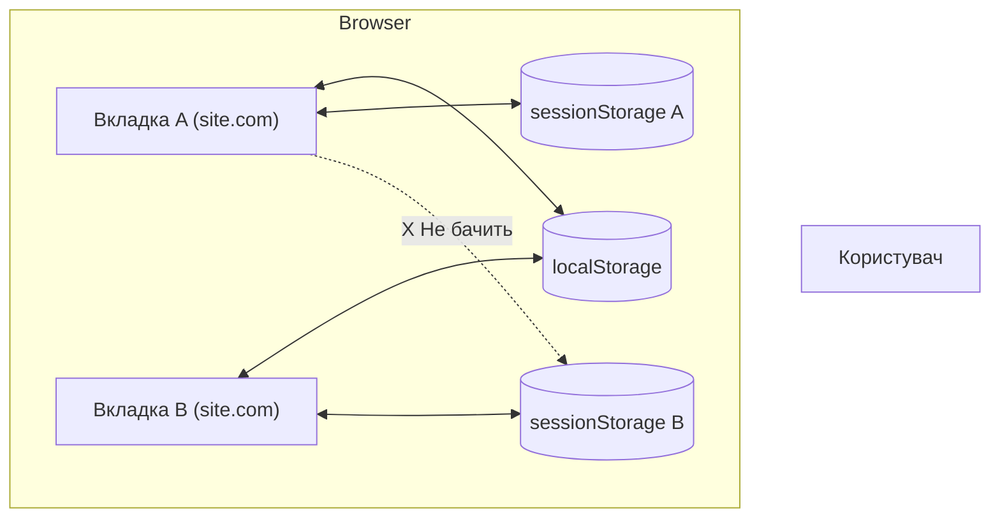

# Web Storage: LocalStorage та SessionStorage

## Вступ: Еволюція пам'яті браузера

Веб пройшов довгий шлях від простих документів до складних SPA (Single Page Applications), що функціонують як повноцінні десктопні програми. Разом з цим росла потреба зберігати дані на клієнті.

Раніше у нас були тільки **Cookies**. Вони маленькі (4KB), незручні та постійно літають на сервер, забиваючи канал. 
Розробники вигадували милиці з `userData` (IE), Flash cookies та іншими жахами.

З приходом HTML5 ми отримали **Web Storage API**, що складається з `localStorage` та `sessionStorage`. Це Key-Value сховища, які:
1.  **Великі:** Зазвичай 5MB - 10MB (в 1000 разів більше за cookies).
2.  **Тихі:** Дані живуть тільки в браузері і ніколи не відправляються на сервер автоматично.
3.  **Прості:** Зручний JS API.

У цьому монументальному розділі ми розберемо не тільки як *записати* дані, а й як *архітектурно правильно* будувати роботу зі сховищем в реальних React/Vue/Angular/Vanilla проєктах.

---

## 1. Фундаментальні відмінності

`localStorage` та `sessionStorage` мають абсолютно однаковий API (вони наслідуються від одного інтерфейсу `Storage`), але мають різну поведінку життєвого циклу.

### localStorage
*   **Життєвий цикл:** Вічний (Persistent). Дані живуть доти, доки ви (або користувач) явно їх не видалите, або браузер не очистить кеш через брак місця.
*   **Scope:** Прив'язаний до Origin (Protocol + Domain + Port). Всі вкладки і вікна одного браузера, відкриті на `https://site.com`, бачать одні й ті самі дані.
*   **Використання:** Налаштування користувача (тема, мова), довготривалий кеш (список міст), чернетки, "Auth Token" (з застереженнями).

### sessionStorage
*   **Життєвий цикл:** Сесійний. Дані живуть рівно стільки, скільки живе **вкладка**.
    *   Якщо оновити сторінку (F5) — дані **збережуться**.
    *   Якщо закрити вкладку і відкрити знову — дані **зникнуть**.
    *   Якщо відкрити ту саму сторінку в новій вкладці — там буде **пусто** (нова сесія).
*   **Scope:** Прив'язаний до Origin + **Tab**. Навіть якщо відкрити дві вкладки `site.com` поруч, вони **не бачитимуть** `sessionStorage` одна одної.
*   **Використання:** Одноразові дані (дані форми, фільтри пошуку поточної сесії, позиція скролу, історія "назад/вперед" для SPA).

::mermaid

::

---

## 2. Базовий API та Типізація

API оманливо простий. І саме ця простота часто веде до помилок.

```javascript
// Збереження (ключ і значення завжди приводяться до String!)
localStorage.setItem('user_id', '12345');
localStorage.setItem('is_admin', true); // зберігається як рядок "true"
localStorage.setItem('config', { color: 'red' }); // зберігається як "[object Object]" 😱

// Отримання
const id = localStorage.getItem('user_id'); // "12345"
const admin = localStorage.getItem('is_admin'); // "true" (це рядок, не булеве!)

// Видалення
localStorage.removeItem('user_id');

// Очищення всього (для цього домену)
localStorage.clear();

// Кількість записів
console.log(localStorage.length);

// Отримання ключа за індексом (рідко використовується)
const firstKey = localStorage.key(0);
```

### Пастка типізації #1: "[object Object]"

Найчастіша помилка новачків:

```javascript
const user = { name: "Ivan", age: 25 };
localStorage.setItem('user', user);

console.log(localStorage.getItem('user')); 
// Виведе: "[object Object]"
// Відновити дані неможливо! Втрачено назавжди.
```

✅ **Правильно (Серіалізація):**

```javascript
localStorage.setItem('user', JSON.stringify(user));

const raw = localStorage.getItem('user');
const savedUser = JSON.parse(raw); 
// { name: "Ivan", age: 25 }
```

---

## 3. Обробка помилок та QuotaExceededError

LocalStorage не бездонний. Стандарт каже про ліміт (зазвичай 5MB на домен), але це **синхронний блокуючий** API.

Якщо місце закінчиться, браузер кине виняток. Якщо ви не обгорнете `setItem` в `try/catch`, ваш додаток впаде ("White Screen of Death").

```javascript
/**
 * Безпечний запис даних
 */
function safeSetItem(key, value) {
  try {
    localStorage.setItem(key, value);
  } catch (e) {
    if (e.name === 'QuotaExceededError' || e.name === 'NS_ERROR_DOM_QUOTA_REACHED') {
      console.error('LocalStorage is full! Clearing old cache...', e);
      // Тут можна запустити логіку очищення старого кешу
      // clearOldCache();
      // Або повідомити користувача
    } else {
      console.error('LocalStorage is disabled probably (Private Mode)', e);
    }
  }
}
```

### Приватний режим (Incognito)

У деяких старих версіях Safari (iOS) в приватному режимі `localStorage` доступний для читання, але кидає помилку при спробі запису (`setItem`).
Завжди перевіряйте доступність сховища при старті аплікації.

---

## 4. Патерни та Реальні Кейси

Перейдемо до найцікавішого. Як професіонали використовують Storage.

### Pattern 1: Theme Switcher (Синхронізація теми)

Класична задача: перемикач Dark/Light теми, який запам'ятовує вибір, але поважає системні налаштування при першому візиті.

```javascript
const THEME_KEY = 'app_theme';

function applyTheme(theme) {
  if (theme === 'dark') {
    document.documentElement.classList.add('dark');
  } else {
    document.documentElement.classList.remove('dark');
  }
}

function initTheme() {
  // 1. Чи є збережена тема?
  const savedTheme = localStorage.getItem(THEME_KEY);
  
  if (savedTheme) {
    applyTheme(savedTheme);
    return;
  }

  // 2. Якщо ні, дивимось на системні налаштування
  const systemPrefersDark = window.matchMedia('(prefers-color-scheme: dark)').matches;
  applyTheme(systemPrefersDark ? 'dark' : 'light');
}

function toggleTheme() {
  const isDark = document.documentElement.classList.contains('dark');
  const newTheme = isDark ? 'light' : 'dark';
  
  applyTheme(newTheme);
  // 3. Зберігаємо вибір користувача
  localStorage.setItem(THEME_KEY, newTheme);
}

// Запуск при старті
initTheme();
```

### Pattern 2: Form Autosave (Чернетки)

Користувач пише довгий коментар, випадково закриває вкладку. Коли він повертається — текст має бути на місці.

```javascript
class FormSaver {
  constructor(formId) {
    this.form = document.getElementById(formId);
    this.storageKey = `autosave_${formId}`;
    
    if (!this.form) throw new Error('Form not found');
    
    this.init();
  }

  init() {
    // Відновлення
    this.restore();
    
    // Автозбереження при введенні
    this.form.addEventListener('input', () => {
        this.save();
    });

    // Очищення після успішної відправки
    this.form.addEventListener('submit', () => {
        this.clear();
    });
  }

  save() {
    const formData = new FormData(this.form);
    const data = Object.fromEntries(formData.entries());
    localStorage.setItem(this.storageKey, JSON.stringify(data));
    console.log('Draft saved'); //, data);
  }

  restore() {
    const raw = localStorage.getItem(this.storageKey);
    if (!raw) return;

    try {
      const data = JSON.parse(raw);
      Object.entries(data).forEach(([name, value]) => {
        const input = this.form.elements[name];
        if (input) input.value = value;
      });
      console.log('Draft restored');
    } catch (e) {
      console.error('Corrupted draft', e);
    }
  }

  clear() {
    localStorage.removeItem(this.storageKey);
  }
}

// Використання
// new FormSaver('comment-form');
```

### Pattern 3: API Caching with TTL (Time To Live)

LocalStorage живе вічно, але кеш даних API має "протухати". Створимо обгортку для `fetch` з кешуванням.

```javascript
/**
 * @param {string} url 
 * @param {number} ttlInSeconds 
 */
async function fetchWithCache(url, ttlInSeconds = 60) {
  const cacheKey = `cache_${url}`;
  
  // 1. Перевіряємо кеш
  const cachedRaw = localStorage.getItem(cacheKey);
  
  if (cachedRaw) {
    try {
      const cached = JSON.parse(cachedRaw);
      const now = Date.now();
      
      // Перевіряємо чи не протух кеш
      if (now < cached.expiry) {
        console.log(`⚡ Cache hit for ${url}`);
        return cached.data;
      } else {
        console.log(`🗑️ Cache expired for ${url}`);
        localStorage.removeItem(cacheKey);
      }
    } catch (e) {
      localStorage.removeItem(cacheKey);
    }
  }

  // 2. Робимо реальний запит
  console.log(`🌐 Fetching ${url}...`);
  const response = await fetch(url);
  const data = await response.json();

  // 3. Зберігаємо з TTL
  const cacheItem = {
    data: data,
    expiry: Date.now() + (ttlInSeconds * 1000)
  };
  
  try {
    localStorage.setItem(cacheKey, JSON.stringify(cacheItem));
  } catch (e) {
    // Якщо пам'ять закінчилась - просто не кешуємо, не ламаємо флоу
    console.warn('Cache storage full');
  }

  return data;
}

// Використання:
// const products = await fetchWithCache('/api/products', 300); // 5 хвилин
```

### Pattern 4: Shopping Cart (Offline First)

Кошик інтернет-магазину має зберігатися на клієнті, щоб працювати офлайн і миттєво відображатися при перезавантаженні.

Тут використовуємо "Model" підхід.

```javascript
class CartService {
  constructor() {
    this.key = 'shopping_cart';
    // Початковий стан
    this.items = this.load();
  }

  load() {
    const raw = localStorage.getItem(this.key);
    return raw ? JSON.parse(raw) : [];
  }

  save() {
    localStorage.setItem(this.key, JSON.stringify(this.items));
    // Викликаємо подію, щоб оновити UI (якщо ми в React/Vue - це зробить стор)
    window.dispatchEvent(new Event('cart-updated'));
  }

  add(product) {
    const existing = this.items.find(i => i.id === product.id);
    if (existing) {
      existing.quantity++;
    } else {
      this.items.push({ ...product, quantity: 1 });
    }
    this.save();
  }

  remove(productId) {
    this.items = this.items.filter(i => i.id !== productId);
    this.save();
  }
  
  clear() {
    this.items = [];
    this.save();
  }
  
  get total() {
    return this.items.reduce((sum, item) => sum + (item.price * item.quantity), 0);
  }
}
```

---

## 5. Синхронізація між вкладками: Подія `storage`

Це "кілер-фіча" LocalStorage. Якщо у вас відкрито 5 вкладок додатку, і в одній користувач вийшов з системи (Logout) або змінив тему — інші вкладки мають дізнатися про це миттєво.

Подія `storage` спрацьовує **тільки в інших вкладках**, а не в тій, де відбулася зміна.

```javascript
// Auth Listener
window.addEventListener('storage', (event) => {
  if (event.key === 'auth_token') {
    // Хтось змінив токен в іншій вкладці
    if (!event.newValue) {
      // Токен видалено - значить Logout
      console.log('Detected logout in another tab. Redirecting...');
      window.location.href = '/login';
    } else {
      // Токен з'явився/змінився - Login
      console.log('Detected login. Reloading data...');
      window.location.reload();
    }
  }
});
```

### Broadcast Channel Pattern
За допомогою `storage` події можна реалізувати шину повідомлень між вкладками без сервера (свого роду WebSockets між вікнами).

```javascript
function sendTabMessage(type, payload) {
  // Ми використовуємо випадкове число, щоб змушити подію спрацювати, 
  // навіть якщо повідомлення однакове
  const message = { type, payload, timestamp: Date.now() };
  localStorage.setItem('tab_message', JSON.stringify(message));
  // Одразу чистимо, щоб не засмічувати пам'ять, подія все одно пройде
  localStorage.removeItem('tab_message'); 
}

window.addEventListener('storage', (e) => {
  if (e.key === 'tab_message' && e.newValue) {
    const msg = JSON.parse(e.newValue);
    console.log(`Received message from another tab: ${msg.type}`, msg.payload);
    
    if (msg.type === 'REFRESH_DASHBOARD') {
        refreshData();
    }
  }
});
```
*(Примітка: Сучасні браузери мають `BroadcastChannel API`, який краще підходить для цього, але LocalStorage method — це надійна класика для підтримки старих браузерів).*

---

## 6. Wrapper Library: TypedStorage

Давайте напишемо "ідеальну" обгортку, яку можна використовувати в ентерпрайз (TypeScript) проектах. Вона вирішує проблеми типізації, помилок та дефолтних значень.

```typescript
// Це псевдокод для JS, але структура зрозуміла
class TypedStorage {
  constructor(provider = localStorage, prefix = 'app_') {
    this.provider = provider;
    this.prefix = prefix;
  }

  _k(key) {
    return `${this.prefix}${key}`;
  }

  /**
   * Отримати значення із зазначенням типу
   */
  get(key, defaultValue = null) {
    const raw = this.provider.getItem(this._k(key));
    
    if (raw === null) return defaultValue;

    try {
      return JSON.parse(raw);
    } catch (e) {
      console.warn(`Storage parse error for key "${key}". Returning default.`);
      return defaultValue;
    }
  }

  set(key, value) {
    try {
      const stringValue = JSON.stringify(value);
      this.provider.setItem(this._k(key), stringValue);
      return true;
    } catch (e) {
      console.error('Storage write error', e);
      return false;
    }
  }

  remove(key) {
    this.provider.removeItem(this._k(key));
  }
  
  clear() {
      // Очищаємо ТІЛЬКИ ключі з нашим префіксом, 
      // щоб не вбити дані інших модулів на тому ж домені
      Object.keys(this.provider).forEach(k => {
          if (k.startsWith(this.prefix)) {
              this.provider.removeItem(k);
          }
      });
  }
}

// Використання
const userStore = new TypedStorage(localStorage, 'user_');
const settingsStore = new TypedStorage(localStorage, 'settings_');

userStore.set('profile', { id: 1 }); // збереже як "user_profile"
settingsStore.set('theme', 'dark');  // збереже як "settings_theme"
```

---

## 7. Безпека: JWT в LocalStorage?

Це холіварне питання.
**Зберігати JWT (Access Token) в LocalStorage чи ні?**

### Аргументи "ЗА" LocalStorage:
*   Зручно: `Bearer ${token}` легко додавати до headers.
*   Працює з API на різних доменах (CORS) простіше, ніж Cookies.
*   Переживає перезавантаження.

### Аргументи "ПРОТИ" (XSS):
*   Якщо хакер знайде XSS (впровадить JS), він прочитає `localStorage.getItem('token')` і викраде акаунт.
*   `HttpOnly` Cookies не можна прочитати через JS.

**Вердикт:**
Для критичних додатків (банки, адмінки) — **використовуйте HttpOnly Cookies**.
Для звичайних додатків — **LocalStorage допустимий**, якщо ви маєте суворий CSP (Content Security Policy) і обережно санітизуєте HTML.

**Компроміс:**
Зберігайте `RefreshToken` в HttpOnly Cookie, а `AccessToken` (короткоживучий, 5 хв) в пам'яті (JS змінна). LocalStorage не використовуйте для токенів взагалі.

---

## 8. Продуктивність (Performance)

LocalStorage — це **синхронний** API. Це означає, що він блокує головний потік (Main Thread).
Якщо записати туди величезний JSON на 5МБ:

```javascript
// ❌ Це заморозить UI на декілька мілісекунд (або секунд на повільних телефонах)
localStorage.setItem('big_data', massiveJsonString);
```

### Правила продуктивності:
1.  **Не зберігайте великі Blob/Base64 картинки.** Це вбиває продуктивність парсингу при старті аплікації.
2.  **Використовуйте IndexedDB** для об'ємних даних (Lists, offline database). IndexedDB — асинхронний.
3.  **Кешуйте читання.** Не робіть `getItem` в циклі або методі `render`. Прочитайте один раз при старті, збережіть в state/variable, далі читайте змінну.

---

## 9. IndexedDB: Коли LocalStorage замало

Якщо вам потрібно:
*   Зберігати > 10MB.
*   Зберігати файли (Blobs).
*   Шукати по даних (індекси, запити).
*   Не блокувати UI.

Тоді вам потрібен **IndexedDB**. Це повноцінна NoSQL база даних в браузері.
Код IndexedDB складний, тому зазвичай використовують обгортки типу `idb` або `Dexie.js`.

**Порівняння:**

| Характеристика | LocalStorage | IndexedDB |
| :--- | :--- | :--- |
| **API** | Синхронний (простий) | Асинхронний (складний) |
| **Обсяг** | ~5-10 MB | Гігабайти (залежить від HDD) |
| **Типи даних** | Тільки String | Будь-які JS об'єкти, файли |
| **Пошук** | Немає (тільки по ключу) | Індекси, курсори, діапазони |
| **Складність** | ⭐ | ⭐⭐⭐⭐⭐ |

---

## 10. Підсумкова Таблиця Шпаргалка

Швидкий гід, що і коли використовувати:

| Задача | Рішення | Чому? |
| :--- | :--- | :--- |
| **Auth Token** | Cookies (HttpOnly) | Безпека XSS |
| **User Theme** | LocalStorage | Має жити вічно, не секретно |
| **Form Draft** | LocalStorage | Відновлення після закриття |
| **Shopping Cart** | LocalStorage | Офлайн доступ |
| **Sesssion Flags** | SessionStorage | "Показати модалку 1 раз за візит" |
| **Scroll Pos** | SessionStorage | Щоб повернутися на те ж місце |
| **Image Cache** | IndexedDB / Cache API | Великий розмір, бінарні дані |
| **Large List** | IndexedDB | Ефективний пошук і читання |

---

## Висновки

LocalStorage — це швейцарський ніж фронтендера. Він простий, доступний і вирішує 90% задач зі зберігання налаштувань.
SessionStorage — його молодший брат для короткочасних задач.

Пам'ятайте три головні правила:
1.  Серіалізуйте об'єкти (`JSON.stringify`).
2.  Ловіть помилки переповнення (`try/catch`).
3.  Не зберігайте секрети.

Тепер, коли ви знаєте про паттерни `Feature Flagging`, `Caching Strategy` та `Syncing`, ви можете будувати справді надійні клієнтські додатки.
