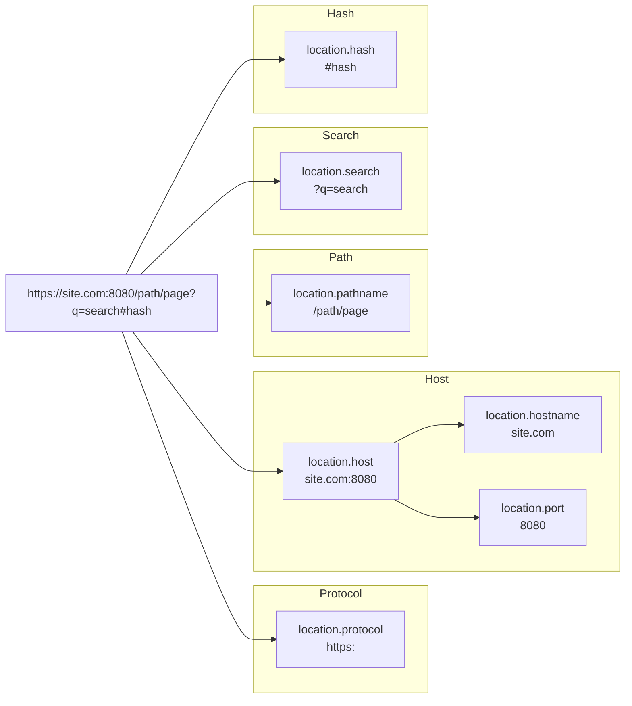

# Location Object - Керування адресою сторінки

## Вступ

У веб-розробці часто виникає потреба програмно керувати адресою сторінки: перенаправити користувача на сторінку входу, оновити контент без дій користувача або отримати параметри з URL для фільтрації товарів.

Для цього браузер надає глобальний об'єкт `window.location` (або просто `location`). Це спеціальний об'єкт, який містить повну інформацію про поточний URL документа та надає методи для навігації.

::tip
**Location vs URL**
Хоча об'єкт `location` та клас `URL` мають схожі властивості, вони служать різним цілям. `URL` використовується для парсингу та створення *будь-яких* посилань, тоді як `location` завжди прив'язаний до *поточної* сторінки та дозволяє керувати браузером.
::

### Що ми навчимося робити?

-   Отримувати окремі частини адреси (домен, шлях, хеш)
-   Перенаправляти користувача з збереженням історії та без
-   Перезавантажувати сторінку програмно
-   Безпечно маніпулювати адресою

## Структура Location

Об'єкт `location` автоматично розбирає поточну адресу на складові частини.

::mermaid



::

### Основні властивості

Всі властивості `location` (крім `origin`) доступні для запису. Зміна будь-якої з них призведе до негайного оновлення сторінки або навігації.

::field-group
::field{name="href" type="string"}
Містить весь URL як рядок. Присвоєння нового значення перенаправить користувача.
::

::field{name="protocol" type="string"}
Протокол з двокрапкою (наприклад, `http:`, `https:`).
::

::field{name="host" type="string"}
Хост: ім'я домену та порт (якщо він є).
::

::field{name="hostname" type="string"}
Лише ім'я домену, без порту.
::

::field{name="pathname" type="string"}
Шлях до ресурсу від кореня сайту (завжди починається з `/`).
::

::field{name="search" type="string"}
Рядок запиту параметрів, починаючи з знаку `?`.
::

::field{name="hash" type="string"}
Якір посиланная, починаючи з знаку `#`.
::

::field{name="origin" type="string"}
Тільки для читання. Містить `protocol + // + host`.
::
::

### Приклад читання властивостей

```javascript showLineNumbers
// Поточний URL: https://example.com/blog/article?id=42#comments

console.log(location.href)     // "https://example.com/blog/article?id=42#comments"
console.log(location.origin)   // "https://example.com"
console.log(location.pathname) // "/blog/article"
console.log(location.search)   // "?id=42"
console.log(location.hash)     // "#comments"
```

## Методи навігації

Крім прямаго запису у `location.href`, існують спеціальні методи для більш точного керування навігацією.

### 1. `location.assign(url)`

Цей метод завантажує новий документ за вказаною URL-адресою.

-   **Дія:** Перехід на нову сторінку.
-   **Історія:** Зберігає поточну сторінку в історії браузера. Користувач може натиснути кнопку "Назад", щоб повернутися.

```javascript
// Перехід на головну Google
location.assign('https://google.com')
```

::note
Присвоєння `location.href = 'url'` працює ідентично до `location.assign('url')`.
::

### 2. `location.replace(url)`

Замінює поточний документ новим.

-   **Дія:** Перехід на нову сторінку.
-   **Історія:** **НЕ** зберігає поточну сторінку в історії. Блокує можливість повернутися назад.

```javascript
// Користувач не зможе повернутися на попередню сторінку
location.replace('https://google.com')
```

**Коли використовувати?**
Ідеально підходить для редіректів після логіну, або коли сторінка, на якій зараз знаходиться користувач, більше не актуальна (наприклад, проміжна сторінка оплати).

### 3. `location.reload()`

Перезавантажує поточну сторінку.

-   **Стандартно:** `location.reload()` — перезавантажує, використовуючи кеш браузера (якщо він валідний).
-   **Примусово:** У старих браузерах передавали `true`, щоб ігнорувати кеш, але в сучасному стандарті цей аргумент ігнорується. Для "жорсткого" перезавантаження часто покладаються на заголовки сервера або мета-теги.

```javascript
// Перезавантажити сторінку
location.reload()
```

## Практичні сценарії

### Перенаправлення користувача

Найпоширеніша задача — редірект. Наприклад, якщо користувач не авторизований.

```javascript showLineNumbers
function checkAuth() {
    const isAuthorized = Boolean(localStorage.getItem('token'))

    if (!isAuthorized) {
        // Використовуємо replace, щоб користувач не міг повернутися
        // на захищену сторінку кнопкою "Назад"
        location.replace('/login')
    }
}
```

### Отримання параметрів URL

Хоча `location.search` повертає просто рядок, його зручно використовувати разом з `URLSearchParams`.

```javascript
// URL: https://shop.com/search?q=iphone&sort=price

const params = new URLSearchParams(location.search)

const query = params.get('q') // "iphone"
const sort = params.get('sort') // "price"

console.log(`Пошук: ${query}, Сортування: ${sort}`)
```

### Зміна частини URL без повного переходу

Можна змінювати окремі властивості, наприклад `hash`. Це часто використовується в SPA (Single Page Applications) або для навігації по сторінці, і **не викликає перезавантаження сторінки** (тільки подія `hashchange`).

```javascript
// URL: https://site.com/page
location.hash = 'footer'
// URL стане: https://site.com/page#footer
// Сторінка проскролиться до елемента з id="footer"
```

Але зміна `search` або `pathname` **призведе до перезавантаження**.

```javascript
// Це перезавантажить сторінку!
location.search = '?lang=ua'
```

::tip
Для зміни URL без перезавантаження в сучасних веб-застосунках використовуйте **History API** (`history.pushState`), а не `location`.
::

## Порівняння методів навігації

| Метод / Властивість | Зберігає в історії? | Опис |
| :--- | :---: | :--- |
| `location.href = '...'` | ✅ Так | Стандартний перехід, аналог кліку по посиланню |
| `location.assign('...')` | ✅ Так | Те саме, що і `href = ...`, але виглядає як явний виклик методу |
| `location.replace('...')` | ❌ Ні | Замінює поточний запис. Кнопка "Назад" не поверне сюди |
| `location.reload()` | - | Оновлює поточну сторінку |

## Безпека

Будьте обережні при роботі з даними з `location`, особливо якщо виводите їх на сторінку.

::warning
**XSS (Cross-Site Scripting)**
Ніколи не вставляйте значення з `location.search` або `location.hash` напряму в HTML через `innerHTML`, оскільки зловмисник може сформувати шкідливе посилання.

```javascript
// ❌ НЕБЕЗПЕЧНО!
// URL: site.com?name=<script>alert(1)</script>
document.body.innerHTML = `Привіт, ${new URLSearchParams(location.search).get('name')}`

// ✅ БЕЗПЕЧНО
document.body.textContent = `Привіт, ${new URLSearchParams(location.search).get('name')}`
```
::

## Підсумки

::card-group
::card{title="Браузерне оточення" icon="i-lucide-globe"}
`location` — це ваш місток для взаємодії з адресним рядком браузера. Він дозволяє читати поточний стан і змінювати його.
::

::card{title="Навігація" icon="i-lucide-arrow-right-circle"}
Використовуйте `assign()` для звичайних переходів і `replace()` для редіректів, де не потрібна історія (наприклад, після логіну).
::

::card{title="Властивості" icon="i-lucide-settings-2"}
`host`, `pathname`, `search` та інші властивості дозволяють легко читати структуру URL без ручного парсингу рядків.
::

::card{title="SPA & History" icon="i-lucide-history"}
Пам'ятайте, що зміна більшості властивостей `location` викликає перезавантаження. Для динамічних застосунків краще підходить History API.
::
::
