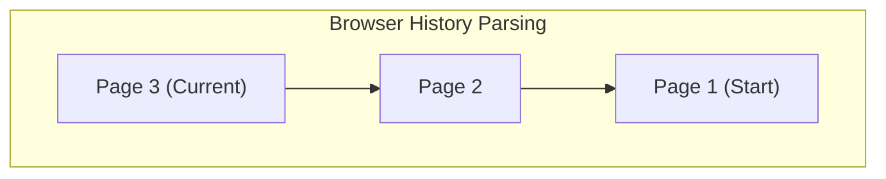

# History API - Повний посібник з керування історією

## Вступ

Історія браузера — це один із фундаментальних механізмів веб-навігації. Коли ви натискаєте кнопку "Назад" або "Вперед", браузер переміщується по списку відвіданих вами сторінок. Довгий час розробники не мали прямого доступу до цього механізму, окрім простих команд "назад" та "вперед".

З появою **History API** все змінилося. Цей інтерфейс, частина стандарту HTML5, надав розробникам повний контроль над адресною стрічкою та історією переходів. Це стало технологічним фундаментом для появи **SPA (Single Page Applications)** — веб-застосунків, які не перезавантажують сторінку при переході між розділами.

У цьому об'ємному посібнику ми розберемо кожну деталь History API: від базових методів до створення власного клієнтського роутера з нуля.

::tip
**Чому це важливо?**
Розуміння History API необхідне не тільки тим, хто пише свої фреймворки. Це ключ до вирішення складних проблем з навігацією, відновленням стану скролу, аналітикою переходів та UX в сучасних застосунках.
::

## 1. Об'єкт `window.history`

Глобальний об'єкт `window.history` надає доступ до сесії історії браузера для поточної вкладки.

Важливо розуміти, що з міркувань безпеки цей API не дозволяє:
-   Читати URL інших сторінок в історії (ви не знаєте, де був користувач до вашого сайту).
-   Очищати історію браузера.
-   Змінювати історію інших вкладок.

### Властивості

::field-group
::field{name="length" type="number"}
Повертає кількість записів у історії сесії для поточної вкладки. Включає поточну сторінку.
Наприклад, якщо ви відкрили нову вкладку -> зайшли на Google -> зайшли на ваш сайт, `length` буде дорівнювати 3.
::

::field{name="state" type="any"}
Повертає поточний стан (state object) на вершині стеку історії. Це дані, які ми можемо прив'язати до конкретного запису історії. Детальніше про це у розділі "Керування станом".
::

::field{name="scrollRestoration" type="string"}
Дозволяє налаштувати поведінку відновлення прокрутки при навігації.
-   `'auto'` (за замовчуванням): браузер автоматично відновлює позицію скролу.
-   `'manual'`: ви берете контроль на себе (корисно для складних SPA).
::
::

### Візуалізація стеку історії

Уявімо історію як стопку карток. Кожна нова сторінка кладеться зверху.

::mermaid



::

Коли ми натискаємо "Назад", ми знімаємо верхню картку, але не викидаємо її (адже є кнопка "Вперед").

## 2. Базова навігація

History API надає три методи для переміщення по історії. Вони працюють так само, як і кнопки браузера.

### `history.back()`

Повертає на одну сторінку назад. Еквівалент натискання кнопки браузера "Back".

```javascript
// Повернутися на попередню сторінку
history.back();
```

Якщо попередньої сторінки немає (користувач тільки відкрив вкладку), цей метод нічого не зробить і помилки не буде.

### `history.forward()`

Переходить на одну сторінку вперед. Еквівалент кнопки "Forward".

```javascript
// Перейти вперед (якщо можливо)
history.forward();
```

Працює тільки якщо користувач попередньо натискав "Назад".

### `history.go(delta)`

Універсальний метод для переміщення на задану кількість кроків.

-   `delta > 0`: вперед.
-   `delta < 0`: назад.
-   `delta = 0` (або без аргументу): перезавантаження поточної сторінки.

```javascript
// Назад на 2 сторінки
history.go(-2);

// Вперед на 1 сторінку (те саме, що forward)
history.go(1);

// Перезавантажити поточну сторінку
history.go(0);
history.go();
```

Дізнатися кількість сторінок в історії:

```javascript
const historyLength = history.length;
console.log(`В історії ${historyLength} записів`);
```

::note
Ці методи викликають повноцінний перехід, тобто сторінка **перезавантажується** (якщо це не SPA навігація, яку ми розглянемо далі).
::

## 3. Модифікація історії (SPA Magic)

Ось де починається справжня магія Single Page Applications. Методи `pushState` та `replaceState` дозволяють змінювати URL в адресному рядку **без перезавантаження сторінки**.

Це дозволяє створювати відчуття навігації по звичайному сайту, залишаючись в межах однієї HTML-сторінки.

### `history.pushState(state, unused, url)`

Додає новий запис в історію.

**Параметри:**

1.  **`state`**: Об'єкт JavaScript, пов'язаний з новим записом історії. Коли користувач пізніше повернеться на цей запис, ми отримаємо цей об'єкт назад.
2.  **`unused`**: Раніше це був заголовок (`title`) сторінки. Зараз більшість браузерів (Firefox, Chrome) ігнорують цей параметр. Безпечно передавати порожній рядок `""`.
3.  **`url`**: Нова URL-адреса. Вона **повинна** належати тому ж домену (origin).

**Приклад:**

Уявіть, що ви на `https://mysite.com/home`.

```javascript
const state = { page_id: 1, user: "admin" };
const url = "/settings";

history.pushState(state, "", url);
```

**Що відбудеться:**
1.  URL зміниться на `https://mysite.com/settings`.
2.  Сторінка **НЕ** перезавантажиться.
3.  Браузер додасть новий запис в історію.
4.  Кнопка "Назад" стане активною.
5.  `history.state` стане рівним переданому об'єкту `state`.

### `history.replaceState(state, unused, url)`

Працює аналогічно `pushState`, але **не додає** новий запис, а **замінює** поточний.

**Коли використовувати?**
-   Оновлення URL при фільтрації (щоб не засмічувати історію кожним кліком по фільтру).
-   Редіректи (наприклад, з `/login` на `/dashboard`).
-   Зміна стану поточної сторінки без зміни URL.

**Приклад:**

```javascript
// Ми на сторінці пошуку з query-параметрами
// URL: /search?q=old

const newState = { query: "new" };
const newUrl = "/search?q=new";

// Оновлюємо URL, щоб при натисканні "Назад" користувач не потрапив на проміжний стан пошуку
history.replaceState(newState, "", newUrl);
```

### Обмеження `state` об'єкта

Об'єкт `state`, який ви передаєте, зберігається на диску користувача (щоб відновити його після перезапуску браузера). Тому він має певні обмеження:

1.  **Серіалізація**: Об'єкт повинен бути серіалізованим за допомогою "Structured Clone Algorithm".
    -   ✅ Можна: об'єкти, масиви, дати, регулярні вирази, Map, Set.
    -   ❌ Не можна: DOM-елементи, функції, Error об'єкти, Symbol.
2.  **Розмір**: Браузери накладають ліміт на розмір об'єкта (зазвичай 640k - 2MB). Якщо передати занадто великий об'єкт, `pushState` викине помилку.

::warning
**Помилка серіалізації**
Спроба зберегти DOM-елемент викличе помилку:
`Uncaught DOMException: Failed to execute 'pushState' on 'History': HTMLDivElement object could not be cloned.`
::

## 4. Подія `popstate`

Зміна URL через `pushState` або `replaceState` **не викликає** ніяких подій сама по собі. Ваш код знає про зміну, бо він сам її ініціював.

Але як дізнатися, що користувач натиснув кнопку "Назад" або "Вперед" у браузері? Для цього існує подія `popstate` об'єкта `window`.

### Коли спрацьовує `popstate`?

-   ✅ Натискання кнопок навігації браузера (Back/Forward).
-   ✅ Виклик `history.back()`, `history.forward()`, `history.go()`.
-   ❌ Виклик `history.pushState()` або `history.replaceState()` (важливо!).

### Використання

```javascript
window.addEventListener('popstate', (event) => {
    console.log("Відбулася навігація по історії!");
    console.log("Новий URL:", document.location.href);
    console.log("State об'єкт:", event.state); // Стан, який ми передавали в pushState
    
    // Тут ми повинні оновити контент сторінки відповідно до URL
    renderPage(document.location.pathname);
});
```

### Властивість `event.state`

Подія отримує об'єкт `event`, у якого є властивість `state`. Вона містить копію об'єкта, який був переданий у `pushState` для цього запису історії.

Якщо для запису не було передано state (наприклад, це початкове завантаження сторінки або звичайний перехід за посиланням), `event.state` буде `null`.

## 5. Scroll Restoration (Відновлення прокрутки)

За замовчуванням сучасні браузери намагаються відновити позицію прокрутки сторінки при поверненні назад. Це зручно для звичайних сайтів, але може заважати в SPA, де контент завантажується динамічно.

Браузер може спробувати проскролити сторінку вниз, коли контент ще не завантажився, що призведе до "стрибків" або некоректної позиції.

Щоб взяти контроль у свої руки, використовуйте `history.scrollRestoration`.

```javascript
if ('scrollRestoration' in history) {
    // Вимикаємо авто-скрол
    history.scrollRestoration = 'manual';
}
```

Тепер при навігації браузер не буде скролити сторінку. Ви повинні робити це самі.

**Приклад ручного відновлення скролу:**

```javascript
// Зберігаємо позицію скролу перед переходом
window.addEventListener('scroll', () => {
    // Використовуємо debounce в реальному коді!
    const scrollPos = window.scrollY;
    
    // Оновлюємо state поточного запису, не змінюючи URL
    history.replaceState({ ...history.state, scroll: scrollPos }, "");
});

// Відновлюємо при поверненні
window.addEventListener('popstate', (event) => {
    if (event.state && event.state.scroll) {
        window.scrollTo(0, event.state.scroll);
    } else {
        window.scrollTo(0, 0); // Скрол вгору для нових сторінок
    }
});
```

## 6. Практикум: Створення власного Router

Давайте об'єднаємо всі знання і створимо міні-роутер для SPA. Це допоможе зрозуміти, як працюють React Router, Vue Router та інші бібліотеки під капотом.

### Крок 1: HTML Структура

```html
<!DOCTYPE html>
<html>
<head>
    <title>Vanilla JS Router</title>
</head>
<body>
    <nav>
        <!-- Використовуємо data-link, щоб позначити SPA посилання -->
        <a href="/" data-link>Головна</a>
        <a href="/about" data-link>Про нас</a>
        <a href="/contact" data-link>Контакти</a>
    </nav>

    <div id="app"></div>

    <script src="router.js"></script>
</body>
</html>
```

### Крок 2: Перехоплення кліків

Нам потрібно, щоб при кліку на посилання браузер не перезавантажував сторінку. Використовуємо делегування подій.

```javascript
// router.js

document.addEventListener("DOMContentLoaded", () => {
    document.body.addEventListener("click", e => {
        // Перевіряємо, чи клік був по нашому посиланню
        if (e.target.matches("[data-link]")) {
            e.preventDefault(); // Забороняємо стандартний перехід
            navigateTo(e.target.href);
        }
    });
    
    // Обробка першого завантаження
    router();
});
```

### Крок 3: Функція навігації

Ця функція оновлює URL і викликає рендер сторінки.

```javascript
const navigateTo = url => {
    history.pushState(null, null, url);
    router();
};
```

### Крок 4: Логіка роутера

Роутер повинен визначити, який контент показати на основі поточного URL.

```javascript
const router = async () => {
    // Наші маршрути
    const routes = [
        { path: "/", view: () => "<h1>Ласкаво просимо на Головну!</h1>" },
        { path: "/about", view: () => "<h1>Сторінка Про Нас</h1><p>Ми класна команда.</p>" },
        { path: "/contact", view: () => "<h1>Контакти</h1><form><input placeholder='Email'></form>" }
    ];

    // Шукаємо співпадіння
    const potentialMatches = routes.map(route => {
        return {
            route: route,
            isMatch: location.pathname === route.path
        };
    });

    let match = potentialMatches.find(potentialMatch => potentialMatch.isMatch);

    // 404 Fallback
    if (!match) {
        match = {
            route: routes[0],
            isMatch: true
        };
    }

    // Рендер контенту
    const viewContent = match.route.view();
    document.querySelector("#app").innerHTML = viewContent;
};
```

### Крок 5: Обробка кнопки "Назад"

Без цього кроку, якщо натиснути "Назад", URL зміниться, але контент залишиться старим.

```javascript
window.addEventListener("popstate", router);
```

### Повний код роутера

```javascript
// Повна реалізація в одному файлі
const router = () => {
    const routes = [
        { path: "/", view: "Home" },
        { path: "/about", view: "About" },
        { path: "/settings", view: "Settings" }
    ];

    const match = routes.find(r => r.path === location.pathname);
    
    document.querySelector("#app").innerHTML = match 
        ? `<h1>${match.view}</h1>` 
        : "<h1>404 Not Found</h1>";
};

const navigate = url => {
    history.pushState(null, null, url);
    router();
};

window.addEventListener("popstate", router);

document.addEventListener("DOMContentLoaded", () => {
    document.body.addEventListener("click", e => {
        if (e.target.matches("[data-link]")) {
            e.preventDefault();
            navigate(e.target.getAttribute("href"));
        }
    });

    router();
});
```

## 7. Відмінності HashRouter vs HistoryRouter

До HTML5 для SPA використовували "хеш-роутинг" (URL з `#`).

### Hash Router (`/#/about`)
-   **Як працює:** Використовує зміну `location.hash`.
-   **Подія:** `hashchange`.
-   **Плюси:** Працює на будь-якому сервері без налаштувань, підтримує IE8.
-   **Мінуси:** "Брудні" URL, проблеми з SEO (пошуковики часто ігнорують частину після `#`).

### History Router (`/about`)
-   **Як працює:** `pushState` / `popstate`.
-   **Плюси:** Чисті URL, виглядає як звичайний сайт, краще для SEO.
-   **Мінуси:** Потребує налаштування сервера (всі запити мають віддавати `index.html`), не підтримує дуже старі браузери.

::tip
У 2024+ році стандартом є **History Router**. Хеш-роутинг використовують лише у специфічних випадках (наприклад, статичний хостинг без можливості конфігурації rewrite rules).
::

## 8. Проблеми та підводні камені

При роботі з History API ви зіткнетеся з кількома класичними проблемами.

### Проблема 404 на сервері

Це найчастіша проблема новачків.

1.  Ви заходите на `mysite.com/`. Сервер віддає `index.html`.
2.  Ви переходите на `mysite.com/about` через `pushState`. Все працює.
3.  Ви оновлюєте сторінку `F5`.
4.  Браузер робить запит GET `/about` на сервер.
5.  Сервер не знає про файл `/about` (адже у вас фізично тільки `index.html`) і віддає **404 Not Found**.

**Рішення:**
Налаштувати сервер (Nginx, Apache, Node.js) так, щоб на будь-який невідомий запит він віддавав `index.html`. Тоді завантажиться JS, запуститься роутер, прочитає `location.pathname` і відрендерить потрібну сторінку.

**Приклад конфігурації Nginx:**

```nginx
location / {
    try_files $uri $uri/ /index.html;
}
```

### Accessibility (Доступність)

При звичайній навігації браузер автоматично фокусується на новій сторінці, і скрінрідери оголошують заголовок.
У SPA цього не відбувається. `pushState` прозорий для скрінрідерів.

**Що треба робити:**
1.  Після навігації програмно переміщувати фокус (наприклад, на заголовок `h1` або спеціальний wrapper).
2.  Оновлювати `document.title`.
3.  Використовувати `aria-live` регіони для оголошення завантаження контенту.

```javascript
const updateTitle = (newTitle) => {
    document.title = newTitle;
    document.querySelector('h1').focus(); // Керування фокусом
};
```

### Аналітика

Google Analytics та інші лічильники за замовчуванням відстежують лише *завантаження сторінки*. Вони не бачать переходів через `pushState`.

**Рішення:**
Вам потрібно вручну відправляти події перегляду сторінки при кожній навігації в роутері.

```javascript
// Приклад для Google Analytics 4
const navigate = (url) => {
    history.pushState(null, null, url);
    router();
    
    // Сповіщаємо аналітику
    gtag('config', 'GA_MEASUREMENT_ID', {
        page_path: url
    });
};
```

## 9. Безпека та обмеження

### Same-origin Policy (Політика одного джерела)

Ви можете передати в `pushState` будь-який URL, але він **зобов'язаний** мати той самий протокол, домен і порт, що й поточна сторінка.

```javascript
// Ми на https://google.com

// ❌ Помилка: інший домен
history.pushState({}, "", "https://facebook.com");
// Uncaught DOMException: SecurityError

// ✅ Дозволено: відносний шлях
history.pushState({}, "", "/search");

// ✅ Дозволено: той самий домен
history.pushState({}, "", "https://google.com/images");
```

Це зроблено для запобігання фішингу. Інакше зловмисник міг би написати скрипт, який змінює URL на `paypal.com`, залишаючись на підробленому сайті.

### Rate Limiting

Браузери обмежують частоту викликів `pushState`. Якщо ви викличете його 100 разів за секунду (наприклад, у циклі або при скролі), браузер може почати ігнорувати виклики або викинути помилку `SecurityError`.

Якщо потрібно оновлювати URL при скролі (наприклад, змінювати активний розділ), використовуйте **Debounce** або **Throttle**.

```javascript
// Погано: викликається на кожен піксель скролу
window.addEventListener('scroll', () => {
    history.replaceState({}, "", `#section-${currentSection}`);
});

// Добре: не частіше ніж раз на 100мс
window.addEventListener('scroll', throttle(() => {
    history.replaceState({}, "", `#section-${currentSection}`);
}, 100));
```

## 10. Поглиблений приклад: State Management

Використання `history.state` дозволяє створювати дуже плавний UX. Розглянемо приклад "нескінченної стрічки" новин (як у Twitter/X).

Задача:
1.  Користувач скролить стрічку.
2.  Клікає на новину.
3.  Натискає "Назад".
4.  Ми маємо повернути його на **те саме місце** і показати **ті самі завантажені новини**, щоб він не скролив заново.

Без `history.state` це склад но: доведеться зберігати все в `localStorage` або глобальній звонній.

З `history.state` це елегантно:

```javascript
// Під час завантаження новин оновлюємо state поточної сторінки
function appendNews(news) {
    renderNews(news);
    
    // Отримуємо поточний стан або створюємо новий
    const currentState = history.state || { articles: [], scrollY: 0 };
    
    // Додаємо нові статті до стану
    const newState = {
        ...currentState,
        articles: [...currentState.articles, ...news]
    };
    
    // Оновлюємо поточний запис історії БЕЗ переходу
    history.replaceState(newState, "");
}

// Зберігаємо скрол перед виходом
window.addEventListener('beforeunload', () => {
    const currentState = history.state || {};
    history.replaceState({ ...currentState, scrollY: window.scrollY }, "");
});

// При завантаженні сторінки (ініціалізація)
window.addEventListener('load', () => {
    if (history.state && history.state.articles) {
        // О! Ми повернулися назад. Відновлюємо контент із пам'яті (state)
        // Нам навіть не треба робити запит на сервер!
        renderNews(history.state.articles);
        
        // Відновлюємо скрол
        if (history.state.scrollY) {
            window.scrollTo(0, history.state.scrollY);
        }
    } else {
        // Це перший візит, вантажимо з сервера
        fetchNews();
    }
});
```

Цей паттерн значно покращує продуктивність і UX, оскільки відновлення сторінки відбувається миттєво.

## 11. Підсумкова таблиця методів

| Метод | Аргументи | Дія | Змінює URL? | Викликає перезавантаження? |
| :--- | :--- | :--- | :---: | :---: |
| `back()` | - | На крок назад | ✅ | ✅ (якщо не SPA) |
| `forward()` | - | На крок вперед | ✅ | ✅ (якщо не SPA) |
| `go(n)` | число | На n кроків | ✅ | ✅ (якщо не SPA) |
| `pushState()` | state, title, url | Новий запис в історії | ✅ | ❌ Ні |
| `replaceState()`| state, title, url | Заміна поточного запису | ✅ | ❌ Ні |

## Висновок

History API — це потужний інструмент, який перетворив веб з набору статичних документів на платформу для повноцінних застосунків.

-   Використовуйте `pushState` для навігації.
-   Використовуйте `replaceState` для оновлення параметрів без створення зайвих записів в історії.
-   Слухайте `popstate` для реакції на дії користувача.
-   Пам'ятайте про доступність та скрол.
-   Налаштуйте сервер для підтримки Deep Linking.

Опанувавши ці концепції, ви зможете писати SPA, які за зручністю не поступаються нативним додаткам.

---
**Корисні посилання:**
-   [MDN Web Docs: History API](https://developer.mozilla.org/en-US/docs/Web/API/History_API)
-   [WhatWG Living Standard](https://html.spec.whatwg.org/multipage/history.html)
