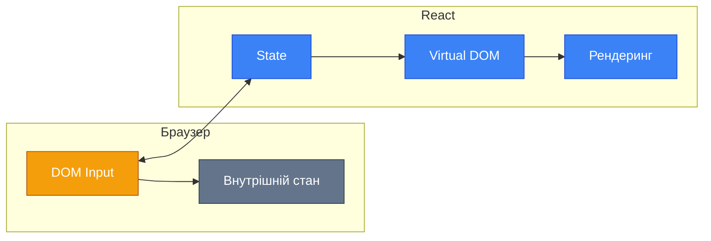
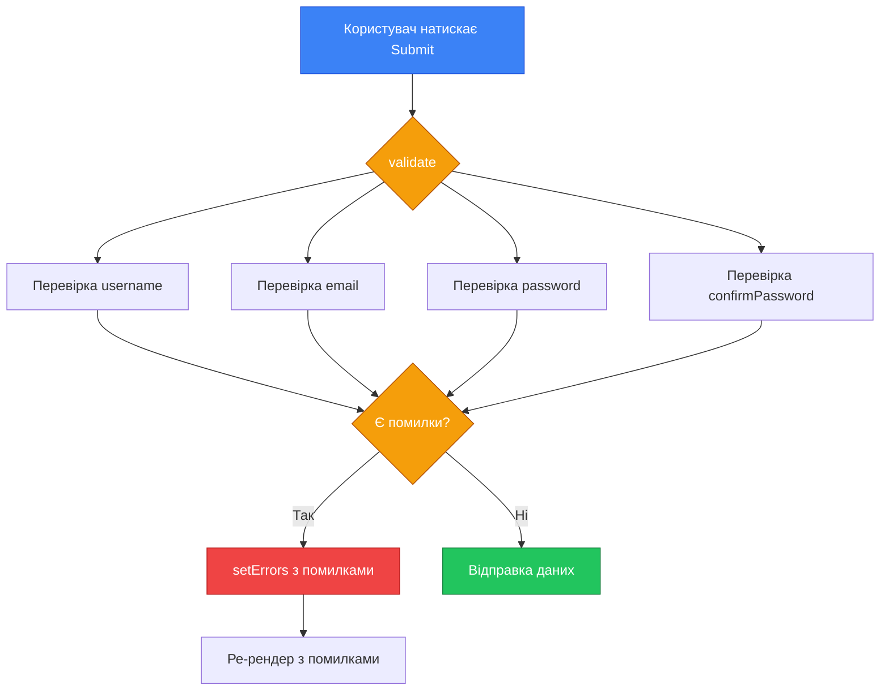
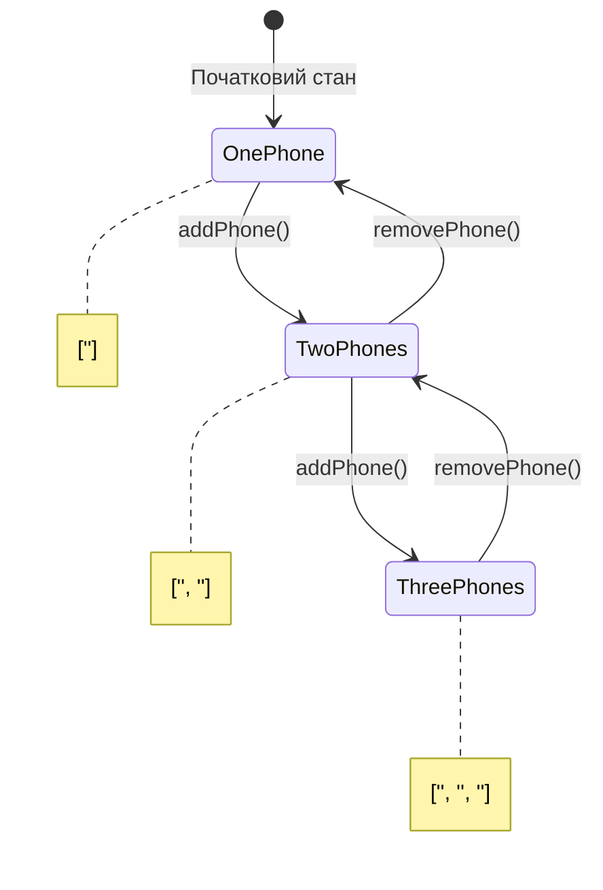
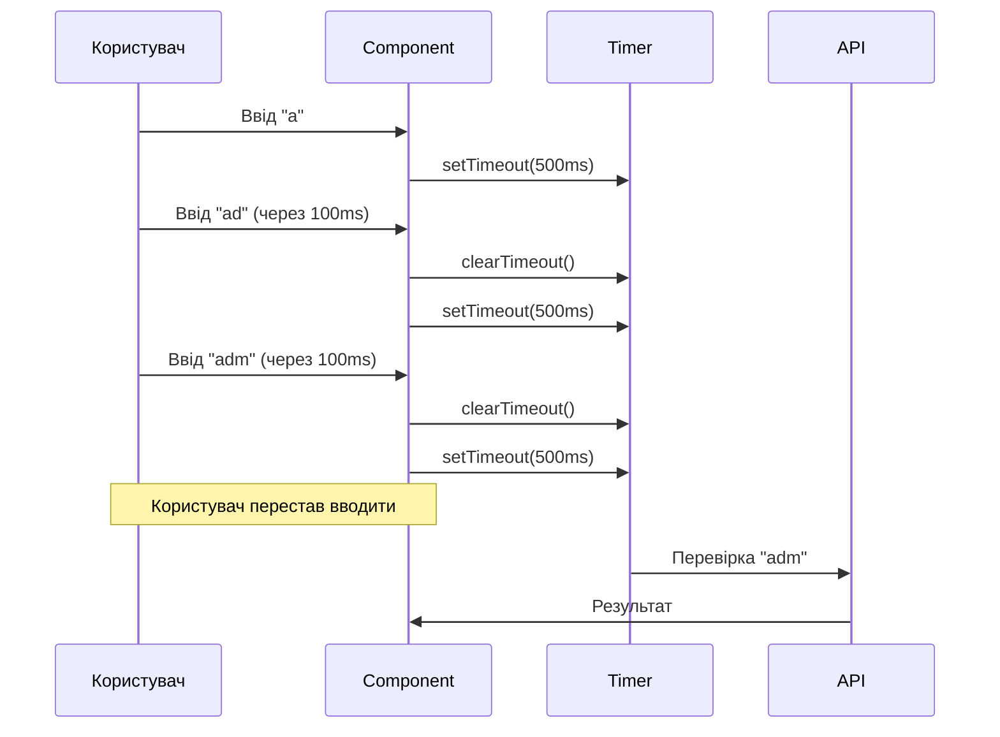

# Робота з Формами в React

::note
**Передумови**: Для ефективного засвоєння цього матеріалу вам необхідно знати основи React, зокрема функціональні компоненти та хук `useState`.
::

## Вступ: Чому Форми — це Особливий Виклик?

Уявіть, що ви розробляєте інтернет-магазин. Користувач хоче оформити замовлення: йому потрібно ввести ім'я, email, адресу доставки, номер картки. Кожне з цих полів потрібно:

- **Зберігати** десь у пам'яті
- **Валідувати** (чи коректний email? чи не порожнє ім'я?)
- **Реагувати** на зміни (показати помилку, підсвітити поле)
- **Відправити** на сервер при натисканні кнопки

У звичайному HTML форми мають власний внутрішній стан. Коли ви вводите текст у `<input>`, браузер сам зберігає це значення. Але React працює інакше — він хоче **контролювати все**. І тут виникає філософське питання: хто є "джерелом правди" (Single Source of Truth) — браузер чи React?

::mermaid



::

Ця діаграма ілюструє конфлікт: браузер має свій стан, React — свій. Наше завдання — синхронізувати їх.

## Два Підходи до Форм

### Controlled Components (Контрольовані Компоненти)

**Контрольований компонент** (Controlled Component) — це елемент форми, значення якого повністю контролюється станом React. Кожна зміна значення проходить через React.

```jsx showLineNumbers
import { useState } from 'react'

function ControlledInput() {
    // React є єдиним джерелом правди
    const [value, setValue] = useState('')

    const handleChange = (event) => {
        // Кожне натискання клавіші оновлює стан
        setValue(event.target.value)
    }

    return (
        <input
            type="text"
            value={value} // Значення завжди з React
            onChange={handleChange} // Зміни завжди через React
        />
    )
}
```

**Розбір коду:**

- **Рядок 5**: Створюємо стан `value` — це наше "джерело правди"
- **Рядок 7-10**: Handler отримує подію та витягує нове значення з `event.target.value`
- **Рядок 15**: Атрибут `value={value}` прив'язує інпут до стану React
- **Рядок 16**: Атрибут `onChange` перехоплює кожну зміну

::tip
**Важливо**: Без `onChange` поле стане "read-only" — ви не зможете нічого ввести, бо React завжди повертатиме старе значення.
::

### Uncontrolled Components (Неконтрольовані Компоненти)

**Неконтрольований компонент** (Uncontrolled Component) — це елемент, який зберігає свій стан у DOM. React "запитує" значення тільки коли потрібно (зазвичай при submit).

```jsx showLineNumbers
import { useRef } from 'react'

function UncontrolledInput() {
    // Ref дозволяє отримати доступ до DOM-елемента
    const inputRef = useRef(null)

    const handleSubmit = (event) => {
        event.preventDefault()
        // Отримуємо значення напряму з DOM
        console.log('Введене значення:', inputRef.current.value)
    }

    return (
        <form onSubmit={handleSubmit}>
            <input
                type="text"
                ref={inputRef} // Прив'язка до ref
                defaultValue="Початкове значення"
            />
            <button type="submit">Відправити</button>
        </form>
    )
}
```

**Розбір коду:**

- **Рядок 5**: `useRef` створює "посилання" на DOM-елемент
- **Рядок 10**: `inputRef.current` — це сам DOM-елемент `<input>`
- **Рядок 17**: `ref={inputRef}` прив'язує ref до конкретного елемента
- **Рядок 18**: `defaultValue` встановлює початкове значення (на відміну від `value`)

### Порівняння Підходів

| Критерій                     | Controlled               | Uncontrolled               |
| :--------------------------- | :----------------------- | :------------------------- |
| Джерело правди               | React State              | DOM                        |
| Валідація в реальному часі   | ✅ Легко                 | ❌ Складно                 |
| Продуктивність               | Ре-рендер на кожну зміну | Мінімальні ре-рендери      |
| Інтеграція з UI-бібліотеками | ✅ Стандарт              | ⚠️ Обмежена                |
| Складність коду              | Більше boilerplate       | Менше коду                 |
| Використання                 | 90% випадків             | Файлові інпути, інтеграція |

::warning
**Рекомендація**: У переважній більшості випадків використовуйте **Controlled Components**. Вони дають повний контроль і краще інтегруються з екосистемою React.
::

## Практична Реалізація: Форма Реєстрації

Давайте створимо повноцінну форму реєстрації з валідацією, використовуючи тільки `useState`.

### Крок 1: Базова Структура

```jsx showLineNumbers
import { useState } from 'react'

function RegistrationForm() {
    // Стан для кожного поля форми
    const [formData, setFormData] = useState({
        username: '',
        email: '',
        password: '',
        confirmPassword: '',
    })

    return (
        <form>
            <h2>Реєстрація</h2>
            {/* Поля будуть тут */}
        </form>
    )
}
```

**Чому один об'єкт замість окремих useState?**

Можна було б написати так:

```jsx
const [username, setUsername] = useState('')
const [email, setEmail] = useState('')
const [password, setPassword] = useState('')
// ... і так далі
```

Але це призводить до:

- Дублювання логіки оновлення
- Складності при додаванні нових полів
- Проблем при відправці всіх даних разом

### Крок 2: Універсальний Handler

```jsx showLineNumbers
function RegistrationForm() {
    const [formData, setFormData] = useState({
        username: '',
        email: '',
        password: '',
        confirmPassword: '',
    })

    // Один handler для всіх полів! // [!code highlight]
    const handleChange = (event) => {
        const { name, value } = event.target // [!code highlight]

        setFormData((prevData) => ({
            ...prevData, // Зберігаємо всі попередні поля
            [name]: value, // Оновлюємо тільки потрібне поле
        }))
    }

    return (
        <form>
            <input
                type="text"
                name="username" // name = ключ в об'єкті стану
                value={formData.username}
                onChange={handleChange}
                placeholder="Ім'я користувача"
            />
            <input type="email" name="email" value={formData.email} onChange={handleChange} placeholder="Email" />
            {/* Інші поля... */}
        </form>
    )
}
```

**Розбір "магії":**

- **Рядок 11**: Деструктуризація — витягуємо `name` та `value` з елемента
- **Рядок 13-16**: Spread-оператор `...prevData` копіює всі поля
- **Рядок 15**: `[name]: value` — динамічний ключ! Якщо `name="email"`, отримаємо `{ email: "..." }`

::note
**Computed Property Names**: Синтаксис `[name]: value` називається "обчислювані імена властивостей" (Computed Property Names). Це стандартний ES6, не специфіка React.
::

### Крок 3: Валідація

```jsx showLineNumbers
function RegistrationForm() {
    const [formData, setFormData] = useState({
        username: '',
        email: '',
        password: '',
        confirmPassword: '',
    })

    // Стан для помилок валідації // [!code highlight]
    const [errors, setErrors] = useState({}) // [!code highlight]

    const handleChange = (event) => {
        const { name, value } = event.target

        setFormData((prevData) => ({
            ...prevData,
            [name]: value,
        }))

        // Очищаємо помилку при зміні поля // [!code highlight]
        if (errors[name]) {
            // [!code highlight]
            setErrors((prev) => ({
                // [!code highlight]
                ...prev, // [!code highlight]
                [name]: '', // [!code highlight]
            })) // [!code highlight]
        } // [!code highlight]
    }

    // Функція валідації // [!code highlight]
    const validate = () => {
        // [!code highlight]
        const newErrors = {} // [!code highlight]

        // Валідація username
        if (!formData.username.trim()) {
            newErrors.username = "Ім'я користувача обов'язкове"
        } else if (formData.username.length < 3) {
            newErrors.username = 'Мінімум 3 символи'
        }

        // Валідація email
        const emailRegex = /^[^\s@]+@[^\s@]+\.[^\s@]+$/
        if (!formData.email.trim()) {
            newErrors.email = "Email обов'язковий"
        } else if (!emailRegex.test(formData.email)) {
            newErrors.email = 'Невалідний формат email'
        }

        // Валідація password
        if (!formData.password) {
            newErrors.password = "Пароль обов'язковий"
        } else if (formData.password.length < 8) {
            newErrors.password = 'Мінімум 8 символів'
        }

        // Валідація confirmPassword
        if (formData.password !== formData.confirmPassword) {
            newErrors.confirmPassword = 'Паролі не співпадають'
        }

        setErrors(newErrors)
        return Object.keys(newErrors).length === 0 // true якщо немає помилок
    }

    const handleSubmit = (event) => {
        event.preventDefault()

        if (validate()) {
            console.log('Форма валідна! Дані:', formData)
            // Тут буде відправка на сервер
        }
    }

    return (
        <form onSubmit={handleSubmit}>
            <div>
                <input
                    type="text"
                    name="username"
                    value={formData.username}
                    onChange={handleChange}
                    placeholder="Ім'я користувача"
                    className={errors.username ? 'error' : ''}
                />
                {errors.username && <span className="error-text">{errors.username}</span>}
            </div>

            <div>
                <input
                    type="email"
                    name="email"
                    value={formData.email}
                    onChange={handleChange}
                    placeholder="Email"
                    className={errors.email ? 'error' : ''}
                />
                {errors.email && <span className="error-text">{errors.email}</span>}
            </div>

            <div>
                <input
                    type="password"
                    name="password"
                    value={formData.password}
                    onChange={handleChange}
                    placeholder="Пароль"
                    className={errors.password ? 'error' : ''}
                />
                {errors.password && <span className="error-text">{errors.password}</span>}
            </div>

            <div>
                <input
                    type="password"
                    name="confirmPassword"
                    value={formData.confirmPassword}
                    onChange={handleChange}
                    placeholder="Підтвердіть пароль"
                    className={errors.confirmPassword ? 'error' : ''}
                />
                {errors.confirmPassword && <span className="error-text">{errors.confirmPassword}</span>}
            </div>

            <button type="submit">Зареєструватися</button>
        </form>
    )
}
```

**Архітектура валідації:**

::mermaid



::

## Робота з Різними Типами Інпутів

### Select (Випадаючий Список)

```jsx showLineNumbers
function SelectExample() {
    const [country, setCountry] = useState('ua')

    return (
        <select value={country} onChange={(e) => setCountry(e.target.value)}>
            <option value="ua">Україна</option>
            <option value="pl">Польща</option>
            <option value="de">Німеччина</option>
        </select>
    )
}
```

::note
У React `value` встановлюється на `<select>`, а не через атрибут `selected` на `<option>`.
::

### Checkbox (Прапорець)

```jsx showLineNumbers
function CheckboxExample() {
    const [isAgreed, setIsAgreed] = useState(false)

    return (
        <label>
            <input
                type="checkbox"
                checked={isAgreed} // checked замість value! // [!code highlight]
                onChange={(e) => setIsAgreed(e.target.checked)} // [!code highlight]
            />
            Я погоджуюсь з умовами
        </label>
    )
}
```

**Важливо**: Для checkbox використовуємо:

- `checked` замість `value`
- `e.target.checked` замість `e.target.value`

### Radio Buttons (Перемикачі)

```jsx showLineNumbers
function RadioExample() {
    const [gender, setGender] = useState('')

    return (
        <div>
            <label>
                <input
                    type="radio"
                    name="gender"
                    value="male"
                    checked={gender === 'male'} // Порівняння зі станом // [!code highlight]
                    onChange={(e) => setGender(e.target.value)}
                />
                Чоловік
            </label>
            <label>
                <input
                    type="radio"
                    name="gender"
                    value="female"
                    checked={gender === 'female'}
                    onChange={(e) => setGender(e.target.value)}
                />
                Жінка
            </label>
        </div>
    )
}
```

### Textarea (Текстова Область)

```jsx showLineNumbers
function TextareaExample() {
    const [bio, setBio] = useState('')

    return (
        <textarea
            value={bio} // value, не children! // [!code highlight]
            onChange={(e) => setBio(e.target.value)}
            placeholder="Розкажіть про себе..."
            rows={5}
        />
    )
}
```

::warning
У HTML `<textarea>` використовує children: `<textarea>текст</textarea>`. У React — використовуйте `value`.
::

### Множинний Select

```jsx showLineNumbers
function MultiSelectExample() {
    const [selectedSkills, setSelectedSkills] = useState([])

    const handleChange = (event) => {
        // Перетворюємо HTMLCollection в масив // [!code highlight]
        const options = Array.from(event.target.selectedOptions) // [!code highlight]
        const values = options.map((option) => option.value) // [!code highlight]
        setSelectedSkills(values)
    }

    return (
        <select multiple value={selectedSkills} onChange={handleChange}>
            <option value="react">React</option>
            <option value="vue">Vue</option>
            <option value="angular">Angular</option>
            <option value="svelte">Svelte</option>
        </select>
    )
}
```

## Групування Checkbox-ів

Часта задача — мати групу чекбоксів, де можна вибрати декілька опцій:

```jsx showLineNumbers
function HobbiesForm() {
    const [hobbies, setHobbies] = useState([])

    const handleCheckboxChange = (event) => {
        const { value, checked } = event.target

        if (checked) {
            // Додаємо до масиву // [!code highlight]
            setHobbies((prev) => [...prev, value]) // [!code highlight]
        } else {
            // Видаляємо з масиву // [!code highlight]
            setHobbies((prev) => prev.filter((hobby) => hobby !== value)) // [!code highlight]
        }
    }

    const allHobbies = ['Читання', 'Спорт', 'Музика', 'Подорожі', 'Кодинг']

    return (
        <div>
            <h3>Ваші хобі:</h3>
            {allHobbies.map((hobby) => (
                <label key={hobby}>
                    <input
                        type="checkbox"
                        value={hobby}
                        checked={hobbies.includes(hobby)}
                        onChange={handleCheckboxChange}
                    />
                    {hobby}
                </label>
            ))}
            <p>Вибрано: {hobbies.join(', ') || 'нічого'}</p>
        </div>
    )
}
```

## Динамічні Форми

Іноді потрібно додавати/видаляти поля динамічно. Наприклад, форма з кількома телефонами:

```jsx showLineNumbers
function DynamicPhoneForm() {
    const [phones, setPhones] = useState([''])

    const addPhone = () => {
        setPhones((prev) => [...prev, ''])
    }

    const removePhone = (index) => {
        setPhones((prev) => prev.filter((_, i) => i !== index))
    }

    const updatePhone = (index, value) => {
        setPhones((prev) => prev.map((phone, i) => (i === index ? value : phone)))
    }

    return (
        <div>
            <h3>Телефони:</h3>
            {phones.map((phone, index) => (
                <div key={index}>
                    <input
                        type="tel"
                        value={phone}
                        onChange={(e) => updatePhone(index, e.target.value)}
                        placeholder={`Телефон ${index + 1}`}
                    />
                    {phones.length > 1 && (
                        <button type="button" onClick={() => removePhone(index)}>
                            Видалити
                        </button>
                    )}
                </div>
            ))}
            <button type="button" onClick={addPhone}>
                Додати телефон
            </button>
        </div>
    )
}
```

::mermaid



::

## Валідація в Реальному Часі vs При Submit

### Валідація при Submit

Ми вже бачили цей підхід — перевіряємо все при натисканні кнопки. Це простіше, але користувач дізнається про помилки тільки після спроби відправити форму.

### Валідація в Реальному Часі

```jsx showLineNumbers
function RealTimeValidation() {
    const [email, setEmail] = useState('')
    const [error, setError] = useState('')
    const [touched, setTouched] = useState(false) // Чи поле вже було "торкнуте" // [!code highlight]

    const validateEmail = (value) => {
        if (!value.trim()) {
            return "Email обов'язковий"
        }
        if (!/^[^\s@]+@[^\s@]+\.[^\s@]+$/.test(value)) {
            return 'Невалідний формат'
        }
        return ''
    }

    const handleChange = (e) => {
        const value = e.target.value
        setEmail(value)

        // Валідуємо тільки якщо поле вже було "торкнуте" // [!code highlight]
        if (touched) {
            // [!code highlight]
            setError(validateEmail(value)) // [!code highlight]
        } // [!code highlight]
    }

    const handleBlur = () => {
        // [!code highlight]
        setTouched(true) // [!code highlight]
        setError(validateEmail(email)) // [!code highlight]
    } // [!code highlight]

    return (
        <div>
            <input
                type="email"
                value={email}
                onChange={handleChange}
                onBlur={handleBlur}
                placeholder="Email"
                className={error ? 'error' : ''}
            />
            {error && <span className="error-text">{error}</span>}
        </div>
    )
}
```

**Логіка "touched":**

1. Користувач бачить порожнє поле — помилки немає
2. Користувач клікає на поле, вводить щось, потім виходить (blur) — тепер поле "торкнуте"
3. Після цього помилка показується в реальному часі

## Debouncing для Оптимізації

При валідації в реальному часі кожне натискання клавіші викликає перевірку. Для складних валідацій (наприклад, перевірка унікальності email через API) це може бути проблемою.

**Debouncing** — це техніка, що затримує виконання функції до моменту, коли користувач перестане вводити.

```jsx showLineNumbers
import { useState, useEffect } from 'react'

function DebouncedValidation() {
    const [username, setUsername] = useState('')
    const [isChecking, setIsChecking] = useState(false)
    const [isAvailable, setIsAvailable] = useState(null)

    useEffect(() => {
        if (!username.trim()) {
            setIsAvailable(null)
            return
        }

        setIsChecking(true)

        // Створюємо таймер // [!code highlight]
        const timer = setTimeout(() => {
            // [!code highlight]
            // Симуляція API-запиту // [!code highlight]
            const available = !['admin', 'user', 'test'].includes(username.toLowerCase()) // [!code highlight]
            setIsAvailable(available) // [!code highlight]
            setIsChecking(false) // [!code highlight]
        }, 500) // Затримка 500мс // [!code highlight]

        // Очищення таймера при зміні username // [!code highlight]
        return () => clearTimeout(timer) // [!code highlight]
    }, [username])

    return (
        <div>
            <input
                type="text"
                value={username}
                onChange={(e) => setUsername(e.target.value)}
                placeholder="Ім'я користувача"
            />
            {isChecking && <span>Перевіряємо...</span>}
            {isAvailable === true && <span className="success">✓ Доступне</span>}
            {isAvailable === false && <span className="error">✗ Зайняте</span>}
        </div>
    )
}
```

**Як працює debouncing:**

::mermaid



::

## Передача Стану Форми між Компонентами

У реальних проєктах форми часто розбиваються на компоненти. Розглянемо паттерн "підняття стану" (Lifting State Up):

```jsx showLineNumbers
// Батьківський компонент володіє станом
function RegistrationPage() {
    const [formData, setFormData] = useState({
        personal: { firstName: '', lastName: '' },
        contact: { email: '', phone: '' },
    })

    const updatePersonal = (field, value) => {
        setFormData((prev) => ({
            ...prev,
            personal: { ...prev.personal, [field]: value },
        }))
    }

    const updateContact = (field, value) => {
        setFormData((prev) => ({
            ...prev,
            contact: { ...prev.contact, [field]: value },
        }))
    }

    return (
        <form>
            <PersonalInfoSection data={formData.personal} onChange={updatePersonal} />
            <ContactInfoSection data={formData.contact} onChange={updateContact} />
            <button type="submit">Зареєструватися</button>
        </form>
    )
}

// Дочірній компонент отримує дані та callback
function PersonalInfoSection({ data, onChange }) {
    return (
        <fieldset>
            <legend>Особиста інформація</legend>
            <input
                type="text"
                value={data.firstName}
                onChange={(e) => onChange('firstName', e.target.value)}
                placeholder="Ім'я"
            />
            <input
                type="text"
                value={data.lastName}
                onChange={(e) => onChange('lastName', e.target.value)}
                placeholder="Прізвище"
            />
        </fieldset>
    )
}

function ContactInfoSection({ data, onChange }) {
    return (
        <fieldset>
            <legend>Контактна інформація</legend>
            <input
                type="email"
                value={data.email}
                onChange={(e) => onChange('email', e.target.value)}
                placeholder="Email"
            />
            <input
                type="tel"
                value={data.phone}
                onChange={(e) => onChange('phone', e.target.value)}
                placeholder="Телефон"
            />
        </fieldset>
    )
}
```

## Створення Custom Hook для Форм

Коли логіка форм повторюється, варто винести її у власний хук:

```jsx showLineNumbers
// useForm.js — наш власний хук // [!code highlight]
import { useState } from 'react'

function useForm(initialValues, validate) {
    const [values, setValues] = useState(initialValues)
    const [errors, setErrors] = useState({})
    const [touched, setTouched] = useState({})

    const handleChange = (event) => {
        const { name, value, type, checked } = event.target
        const newValue = type === 'checkbox' ? checked : value

        setValues((prev) => ({
            ...prev,
            [name]: newValue,
        }))

        // Валідація при зміні, якщо поле вже touched
        if (touched[name] && validate) {
            const fieldError = validate({ ...values, [name]: newValue })[name]
            setErrors((prev) => ({
                ...prev,
                [name]: fieldError || '',
            }))
        }
    }

    const handleBlur = (event) => {
        const { name } = event.target
        setTouched((prev) => ({
            ...prev,
            [name]: true,
        }))

        // Валідація при blur
        if (validate) {
            const fieldError = validate(values)[name]
            setErrors((prev) => ({
                ...prev,
                [name]: fieldError || '',
            }))
        }
    }

    const handleSubmit = (onSubmit) => (event) => {
        event.preventDefault()

        // Позначаємо всі поля як touched
        const allTouched = Object.keys(values).reduce((acc, key) => {
            acc[key] = true
            return acc
        }, {})
        setTouched(allTouched)

        // Повна валідація
        if (validate) {
            const validationErrors = validate(values)
            setErrors(validationErrors)

            if (Object.keys(validationErrors).length === 0) {
                onSubmit(values)
            }
        } else {
            onSubmit(values)
        }
    }

    const reset = () => {
        setValues(initialValues)
        setErrors({})
        setTouched({})
    }

    return {
        values,
        errors,
        touched,
        handleChange,
        handleBlur,
        handleSubmit,
        reset,
        setValues,
    }
}

export default useForm
```

**Використання:**

```jsx showLineNumbers
import useForm from './useForm'

function LoginForm() {
    const validate = (values) => {
        const errors = {}
        if (!values.email) errors.email = "Email обов'язковий"
        if (!values.password) errors.password = "Пароль обов'язковий"
        return errors
    }

    const { values, errors, touched, handleChange, handleBlur, handleSubmit } = useForm(
        { email: '', password: '' },
        validate,
    )

    const onSubmit = (data) => {
        console.log('Login:', data)
    }

    return (
        <form onSubmit={handleSubmit(onSubmit)}>
            <input name="email" value={values.email} onChange={handleChange} onBlur={handleBlur} />
            {touched.email && errors.email && <span>{errors.email}</span>}

            <input
                name="password"
                type="password"
                value={values.password}
                onChange={handleChange}
                onBlur={handleBlur}
            />
            {touched.password && errors.password && <span>{errors.password}</span>}

            <button type="submit">Увійти</button>
        </form>
    )
}
```
