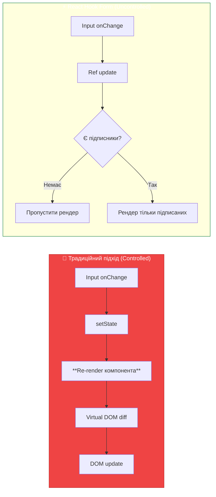
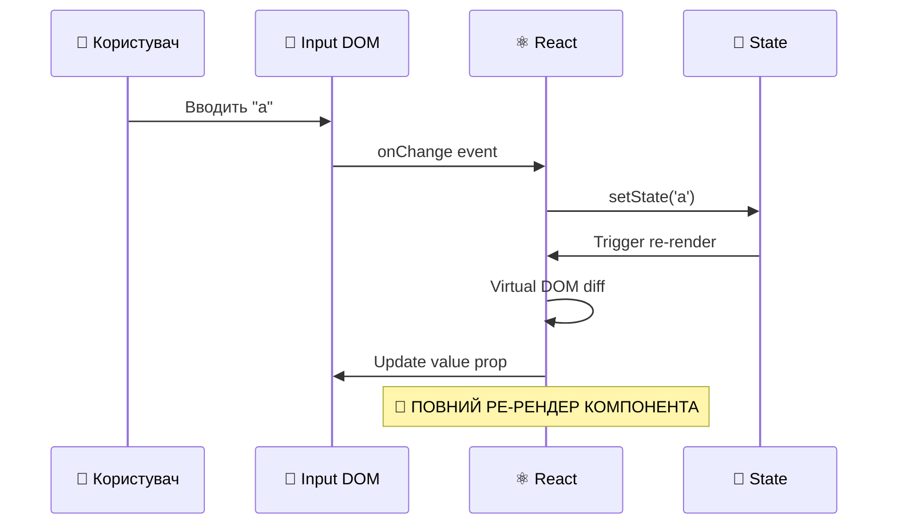
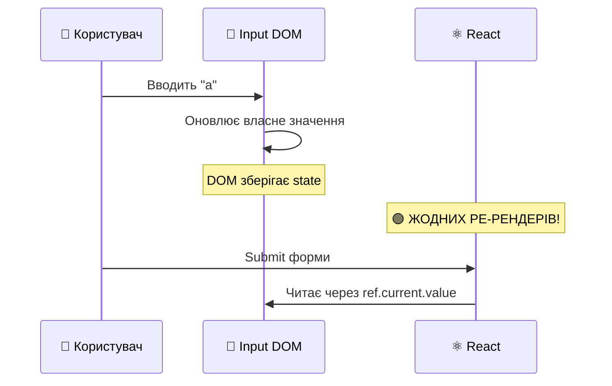
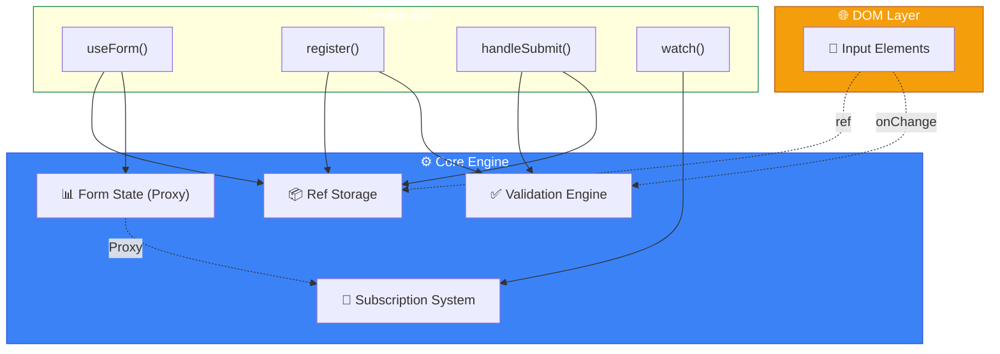
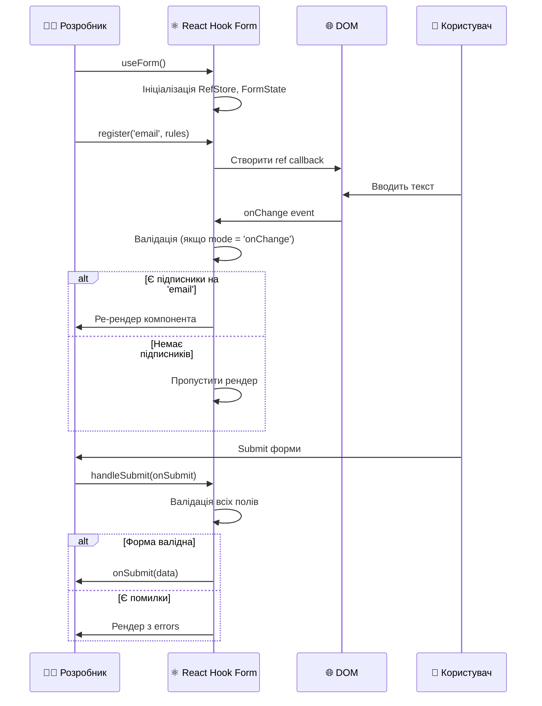

# React Hook Form: Глибоке Розуміння Архітектури та Оптимізації

::note
**Передумови**: Для повного засвоєння цього матеріалу необхідно розуміти:

- Основи React (функціональні компоненти, хуки `useState`, `useRef`, `useEffect`)
- [Базову роботу з формами в React](./01.react-forms.md)
- Концепції controlled та uncontrolled компонентів

::

---

## Вступ: Еволюція Роботи з Формами

Уявіть, що ви розробляєте складну форму реєстрації з 20+ полями: особисті дані, адреса, налаштування безпеки, преференції. При використанні традиційного підходу з `useState` кожне натискання клавіші викликає ре-рендер **всього компонента**. Для 20 полів та активного користувача це означає **сотні непотрібних рендерів** за хвилину.

**React Hook Form** вирішує цю фундаментальну проблему через інноваційний підхід, заснований на **uncontrolled inputs** та **розумному управлінні ref-ами**.

::mermaid



::

### Ключові переваги React Hook Form

::card-group
::card{title="Мінімальні ре-рендери" icon="i-heroicons-bolt"}
Використання uncontrolled inputs та ref-ів замість state зменшує кількість рендерів у **10-100 разів**.
::

::card{title="Малий розмір бандлу" icon="i-heroicons-arrow-down-circle"}
Лише **~12KB gzipped** — одна з найлегших бібліотек (Formik ~45KB, Redux Form ~26KB).
::

::card{title="Продуктивність" icon="i-heroicons-rocket-launch"}
Форми монтуються швидше за controlled аналоги завдяки меншій кількості обчислень під час рендеру.
::

::card{title="DX та інтеграція" icon="i-heroicons-puzzle-piece"}
Вбудована TypeScript підтримка, інтеграція з Yup/Zod/Joi, React DevTools, та UI-бібліотеками.
::
::

---

## Фундаментальна Теорія: Controlled vs Uncontrolled

Перед тим, як заглибитися в React Hook Form, критично важливо зрозуміти різницю між двома підходами до роботи з формами.

### Controlled Components (Керовані)

**Controlled component** — це інпут, чиє значення повністю контролюється React state:

```jsx showLineNumbers
import { useState } from 'react'

function ControlledForm() {
    const [email, setEmail] = useState('')

    // Кожне натискання клавіші:
    // 1. Викликає setEmail
    // 2. Оновлює state
    // 3. Ре-рендерить компонент
    // 4. React порівнює Virtual DOM
    // 5. Оновлює реальний DOM (якщо потрібно)

    return (
        <input
            value={email} // Джерело істини: React state
            onChange={(e) => setEmail(e.target.value)}
        />
    )
}
```

**Життєвий цикл зміни значення:**

::mermaid



::

**Переваги controlled:**

- ✅ Повний контроль над значенням (легко форматувати, обмежувати)
- ✅ Синхронне читання значення
- ✅ Легко валідувати в реальному часі

**Недоліки controlled:**

- ❌ Кожна зміна = ре-рендер
- ❌ Велике споживання пам'яті для великих форм
- ❌ Погана продуктивність при багатьох полях

### Uncontrolled Components (Некеровані)

**Uncontrolled component** — це інпут, чиє значення зберігається **в самому DOM**, а React отримує доступ через **ref**:

```jsx showLineNumbers
import { useRef } from 'react'

function UncontrolledForm() {
    const emailRef = useRef(null)

    const handleSubmit = (e) => {
        e.preventDefault()
        // Читаємо значення тільки при submit
        console.log(emailRef.current.value) // Прямий доступ до DOM
    }

    // НЕ ПОТРІБЕН useState!
    // НЕ ПОТРІБЕН onChange!
    // Жодних ре-рендерів при введенні!

    return (
        <form onSubmit={handleSubmit}>
            <input ref={emailRef} defaultValue="" />
            <button type="submit">Відправити</button>
        </form>
    )
}
```

**Життєвий цикл зміни значення:**

::mermaid



::

**Переваги uncontrolled:**

- ✅ Мінімальні ре-рендери
- ✅ Простіший код (менше boilerplate)
- ✅ Швидша продуктивність

**Недоліки uncontrolled:**

- ❌ Складніше керувати значенням програмно
- ❌ Потрібні додаткові зусилля для валідації в реальному часі
- ❌ Менш "React-way" підхід

### Порівняння Продуктивності

| Метрика                               | Controlled (useState) | Uncontrolled (ref) | React Hook Form |
| :------------------------------------ | :-------------------- | :----------------- | :-------------- |
| **Рендерів при введенні 10 символів** | 10                    | 0                  | 0               |
| **Рендерів при зміні 20 полів**       | 20                    | 0                  | 0-2\*           |
| **Час монтування форми (20 полів)**   | ~80ms                 | ~20ms              | ~25ms           |
| **Споживання пам'яті**                | Високе                | Низьке             | Низьке          |

_\*Залежить від використання `watch()` та інших підписників_

::tip
**Золоте правило**: Використовуйте **controlled**, коли потрібен миттєвий контроль (автокомпліт, маски вводу). Використовуйте **uncontrolled** для форм з багатьма полями, де важлива продуктивність.
::

---

## Архітектура React Hook Form: Під Капотом

React Hook Form — це не просто "wrapper для форм", а складна система з декількома ключовими компонентами.

### Архітектурна Діаграма

::mermaid



::

### 1. Ref Storage System

**React Hook Form зберігає посилання на всі інпути в Map-структурі**:

```javascript showLineNumbers
// Спрощена внутрішня структура
const fieldsRef = new Map([
    ['email', { ref: inputElement, options: { required: true } }],
    ['password', { ref: inputElement, options: { minLength: 8 } }],
])
```

Коли ви викликаєте `register('email')`, бібліотека:

1. **Створює ref callback** для отримання DOM елемента
2. **Зберігає налаштування валідації** для цього поля
3. **Підписується на DOM події** (onChange, onBlur)
4. **НЕ викликає ре-рендер** компонента

### 2. Proxy Pattern для formState

Одна з найрозумніших частин — **lazy evaluation formState через Proxy**:

```javascript showLineNumbers
// Спрощена імплементація
const formState = new Proxy(
    {},
    {
        get(target, prop) {
            // Підписуємося тільки на використані властивості!
            subscribe(prop)
            return calculateFormState(prop)
        },
    },
)

// Використання
function MyForm() {
    const { formState } = useForm()

    // Тільки 'isDirty' викликає підписку!
    console.log(formState.isDirty)

    // 'isValid' НЕ обчислюється, якщо не використовується
    // formState.isValid
}
```

::warning
**Важливо**: Якщо ви не читаєте `formState` в компоненті, **жодних обчислень не відбувається**. Це величезна оптимізація!
::

### 3. Event Delegation для Валідації

Замість додавання валідаторів до кожного інпуту, React Hook Form використовує **централізовану систему**:

```javascript showLineNumbers
// onChange будь-якого інпуту веде до:
function handleChange(event) {
    const fieldName = event.target.name
    const fieldConfig = fieldsRef.get(fieldName)

    if (shouldValidate(fieldConfig)) {
        validateField(fieldName, event.target.value)
    }

    // Оновлюємо тільки підписників на це поле
    notifySubscribers(fieldName)
}
```

### Повний Життєвий Цикл Форми

::mermaid



::

---

## Встановлення та Базове Використання

### Встановлення

```bash
npm install react-hook-form
```

TypeScript типи включені за замовчуванням — додаткове встановлення не потрібне.

### Порівняння: До і Після

Для початку, давайте подивимося на різницю між традиційним підходом та React Hook Form:

::code-group

```jsx [Без бібліотеки]
import { useState } from 'react'

function LoginForm() {
    const [email, setEmail] = useState('')
    const [password, setPassword] = useState('')
    const [errors, setErrors] = useState({})

    const validate = () => {
        const newErrors = {}
        if (!email) newErrors.email = "Email обов'язковий"
        if (!password) newErrors.password = "Пароль обов'язковий"
        if (password.length < 8) newErrors.password = 'Мінімум 8 символів'
        setErrors(newErrors)
        return Object.keys(newErrors).length === 0
    }

    const handleSubmit = (e) => {
        e.preventDefault()
        if (validate()) {
            console.log({ email, password })
        }
    }

    return (
        <form onSubmit={handleSubmit}>
            <input value={email} onChange={(e) => setEmail(e.target.value)} />
            {errors.email && <span>{errors.email}</span>}

            <input type="password" value={password} onChange={(e) => setPassword(e.target.value)} />
            {errors.password && <span>{errors.password}</span>}

            <button type="submit">Увійти</button>
        </form>
    )
}
```

```jsx [З React Hook Form]
import { useForm } from 'react-hook-form'

function LoginForm() {
    const {
        register,
        handleSubmit,
        formState: { errors },
    } = useForm()

    const onSubmit = (data) => console.log(data)

    return (
        <form onSubmit={handleSubmit(onSubmit)}>
            <input {...register('email', { required: "Email обов'язковий" })} />
            {errors.email && <span>{errors.email.message}</span>}

            <input
                type="password"
                {...register('password', {
                    required: "Пароль обов'язковий",
                    minLength: { value: 8, message: 'Мінімум 8 символів' },
                })}
            />
            {errors.password && <span>{errors.password.message}</span>}

            <button type="submit">Увійти</button>
        </form>
    )
}
```

::

**Ключові відмінності:**

1. ❌ **Немає** окремих `useState` для кожного поля
2. ❌ **Немає** ручних `onChange` handlers
3. ❌ **Немає** ручної валідації та `setErrors`
4. ✅ **Валідація декларативна** — прямо в `register`
5. ✅ **Код коротший** та читабельніший
6. ✅ **Автоматична оптимізація** ре-рендерів

### Перший Приклад з Поясненням

```jsx showLineNumbers
import { useForm } from 'react-hook-form'

function SimpleForm() {
    // 1. Ініціалізуємо форму
    const {
        register, // Функція для реєстрації полів
        handleSubmit, // Wrapper для submit handler
        formState: { errors }, // Об'єкт з помилками валідації
    } = useForm()

    // 2. Callback, що викликається при успішному submit
    const onSubmit = (data) => {
        console.log(data) // { email: '...', password: '...' }
    }

    return (
        <form onSubmit={handleSubmit(onSubmit)}>
            {/* 3. Реєструємо поле 'email' з правилами */}
            <input
                {...register('email', {
                    required: "Email обов'язковий",
                    pattern: {
                        value: /^[A-Z0-9._%+-]+@[A-Z0-9.-]+\.[A-Z]{2,}$/i,
                        message: 'Невалідний email',
                    },
                })}
            />
            {/* 4. Показуємо помилку, якщо є */}
            {errors.email && <span>{errors.email.message}</span>}

            <input
                type="password"
                {...register('password', {
                    required: "Пароль обов'язковий",
                    minLength: { value: 8, message: 'Мінімум 8 символів' },
                })}
            />
            {errors.password && <span>{errors.password.message}</span>}

            <button type="submit">Увійти</button>
        </form>
    )
}
```

**Що відбувається під капотом:**

::steps

### useForm() створює внутрішню структуру

Ініціалізується Map для refs та правил валідації:

```javascript
{
  refs: new Map(),
  formState: new Proxy(...),
  validators: new Map(),
}
```

### register('email') повертає props

```javascript
{
  name: 'email',
  ref: [Function],  // Callback для отримання DOM елемента
  onChange: [Function],  // Handler для валідації
  onBlur: [Function],  // Handler для onBlur валідації
}
```

### Spread оператор передає props

`{...register('email')}` розгортається у:

```jsx
<input name="email" ref={...} onChange={...} onBlur={...} />
```

### При зміні значення

- DOM оновлюється нативно (браузером)
- Ref зберігає посилання
- **Компонент НЕ ре-рендериться** (якщо немає підписників)

### При submit

`handleSubmit` зчитує всі значення через refs, валідує, і якщо валідно — виклик

ає `onSubmit(data)`

::
