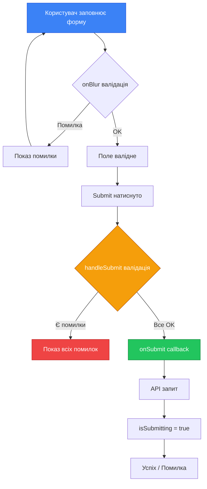

# React Hook Form: Професійна Робота з Формами

::note
**Передумови**: Для ефективного засвоєння цього матеріалу вам необхідно знати основи React, зокрема функціональні компоненти, хук `useState` та [основи роботи з формами](./01.react-forms.md).
::

## Вступ: Чому Потрібна Бібліотека?

У попередньому матеріалі ми навчилися створювати форми "вручну". Це чудово для розуміння, але в реальних проєктах виникають проблеми:

1. **Boilerplate**: Для кожного поля потрібен стан, handler, валідація, помилки
2. **Продуктивність**: Controlled компоненти ре-рендерять усю форму при кожному натисканні клавіші
3. **Складність**: Вкладені форми, масиви полів, динамічні валідації — це багато коду
4. **Помилки**: Легко забути про edge-кейси (touched, dirty, submitting...)

**React Hook Form** — це бібліотека, яка вирішує всі ці проблеми елегантно та ефективно.

::card-group
::card

---

## title: "🚀 Продуктивність"

Мінімальні ре-рендери через використання uncontrolled inputs та ref-ів
::
::card

---

## title: "📦 Легкість"

~12KB gzipped — одна з найлегших бібліотек для форм
::
::card

---

## title: "💡 Простота"

Мінімум boilerplate — форма на 10 полів займає 20 рядків
::
::card

---

## title: "🔧 Гнучкість"

Інтеграція з Yup, Zod, Joi та іншими схемами валідації
::
::

## Встановлення та Перші Кроки

### Встановлення

```bash
npm install react-hook-form
```

Для TypeScript типи вже включені — додаткове встановлення не потрібне.

### Базовий Приклад

Порівняймо звичайний підхід та React Hook Form:

::code-group

```jsx [Без бібліотеки]
import { useState } from 'react'

function LoginForm() {
    const [email, setEmail] = useState('')
    const [password, setPassword] = useState('')
    const [errors, setErrors] = useState({})

    const validate = () => {
        const newErrors = {}
        if (!email) newErrors.email = "Email обов'язковий"
        if (!password) newErrors.password = "Пароль обов'язковий"
        setErrors(newErrors)
        return Object.keys(newErrors).length === 0
    }

    const handleSubmit = (e) => {
        e.preventDefault()
        if (validate()) {
            console.log({ email, password })
        }
    }

    return (
        <form onSubmit={handleSubmit}>
            <input value={email} onChange={(e) => setEmail(e.target.value)} />
            {errors.email && <span>{errors.email}</span>}
            <input type="password" value={password} onChange={(e) => setPassword(e.target.value)} />
            {errors.password && <span>{errors.password}</span>}
            <button type="submit">Увійти</button>
        </form>
    )
}
```

```jsx [З React Hook Form]
import { useForm } from 'react-hook-form'

function LoginForm() {
    const {
        register,
        handleSubmit,
        formState: { errors },
    } = useForm()

    const onSubmit = (data) => console.log(data)

    return (
        <form onSubmit={handleSubmit(onSubmit)}>
            <input {...register('email', { required: "Email обов'язковий" })} />
            {errors.email && <span>{errors.email.message}</span>}
            <input type="password" {...register('password', { required: "Пароль обов'язковий" })} />
            {errors.password && <span>{errors.password.message}</span>}
            <button type="submit">Увійти</button>
        </form>
    )
}
```

::

**Різниця:**

- Немає `useState` для кожного поля
- Немає ручних `onChange` handlers
- Валідація декларативна — прямо в `register`
- Код коротший та читабельніший

## Анатомія useForm

Хук `useForm` — це серце бібліотеки. Розглянемо, що він повертає:

```jsx showLineNumbers
import { useForm } from 'react-hook-form'

function MyForm() {
    const {
        register, // Реєстрація полів
        handleSubmit, // Обробка submit
        formState, // Стан форми (errors, isDirty, isValid...)
        watch, // Спостереження за значеннями
        reset, // Скидання форми
        setValue, // Програмне встановлення значення
        getValues, // Отримання значень
        trigger, // Ручний запуск валідації
        control, // Для інтеграції з Controller
    } = useForm({
        defaultValues: {
            // Початкові значення
            email: '',
            password: '',
        },
        mode: 'onBlur', // Коли валідувати: 'onSubmit' | 'onBlur' | 'onChange' | 'all'
    })

    // ...
}
```

### register — Реєстрація Полів

Функція `register` повертає об'єкт з пропсами для інпуту:

```jsx showLineNumbers
const { register } = useForm();

// register('fieldName') повертає:
// {
//   name: 'fieldName',
//   ref: [Function],
//   onChange: [Function],
//   onBlur: [Function]
// }

// Тому використовуємо spread:
<input {...register('email')} />

// Еквівалентно:
<input
  name="email"
  ref={...}
  onChange={...}
  onBlur={...}
/>
```

### Правила Валідації

```jsx showLineNumbers
<input
    {...register('username', {
        required: "Поле обов'язкове", // Обов'язкове поле
        minLength: {
            value: 3,
            message: 'Мінімум 3 символи',
        },
        maxLength: {
            value: 20,
            message: 'Максимум 20 символів',
        },
        pattern: {
            value: /^[a-zA-Z0-9]+$/,
            message: 'Тільки латиниця та цифри',
        },
        validate: {
            // Кастомні валідатори
            notAdmin: (value) => value !== 'admin' || "Це ім'я зарезервоване",
            noSpaces: (value) => !value.includes(' ') || 'Пробіли заборонені',
        },
    })}
/>
```

**Доступні правила:**

| Правило     | Опис                         | Приклад                                         |
| :---------- | :--------------------------- | :---------------------------------------------- |
| `required`  | Обов'язкове поле             | `required: 'Повідомлення'` або `required: true` |
| `min`       | Мінімальне числове значення  | `min: { value: 18, message: '18+' }`            |
| `max`       | Максимальне числове значення | `max: 100`                                      |
| `minLength` | Мінімальна довжина           | `minLength: { value: 3, message: '...' }`       |
| `maxLength` | Максимальна довжина          | `maxLength: 10`                                 |
| `pattern`   | Регулярний вираз             | `pattern: { value: /regex/, message: '...' }`   |
| `validate`  | Кастомні функції             | `validate: (value) => value > 0 \|\| 'Помилка'` |

## formState — Стан Форми

```jsx showLineNumbers
const { formState } = useForm()

const {
    errors, // Об'єкт з помилками
    isDirty, // Чи змінювалися значення
    dirtyFields, // Які саме поля змінені
    touchedFields, // Які поля були "торкнуті"
    isSubmitting, // Чи форма відправляється
    isSubmitted, // Чи була спроба submit
    isValid, // Чи форма валідна
    submitCount, // Кількість спроб submit
} = formState
```

**Практичне використання:**

```jsx showLineNumbers
function AdvancedForm() {
    const {
        register,
        handleSubmit,
        formState: { errors, isSubmitting, isDirty, isValid },
    } = useForm({ mode: 'onChange' })

    return (
        <form onSubmit={handleSubmit(onSubmit)}>
            <input {...register('email', { required: true })} />

            <button
                type="submit"
                disabled={!isDirty || !isValid || isSubmitting} // Розумна кнопка! // [!code highlight]
            >
                {isSubmitting ? 'Відправляємо...' : 'Відправити'}
            </button>
        </form>
    )
}
```

## watch — Спостереження за Значеннями

Іноді потрібно реагувати на зміни значень (наприклад, умовні поля):

```jsx showLineNumbers
function ConditionalForm() {
    const { register, watch } = useForm()

    // Спостерігаємо за одним полем // [!code highlight]
    const hasNewsletter = watch('newsletter') // [!code highlight]

    // Або за кількома
    const [email, password] = watch(['email', 'password'])

    // Або за всіма
    const allValues = watch()

    return (
        <form>
            <label>
                <input type="checkbox" {...register('newsletter')} />
                Підписатися на розсилку
            </label>

            {hasNewsletter && ( // Умовне поле! // [!code highlight]
                <input {...register('frequency')} placeholder="Як часто?" />
            )}
        </form>
    )
}
```

::warning
**Увага**: `watch` викликає ре-рендер при кожній зміні спостережуваного поля. Використовуйте обережно або розгляньте `useWatch` для оптимізації.
::

## Повний Приклад: Форма Реєстрації

```jsx showLineNumbers
import { useForm } from 'react-hook-form'

function RegistrationForm() {
    const {
        register,
        handleSubmit,
        watch,
        formState: { errors, isSubmitting },
    } = useForm({
        defaultValues: {
            username: '',
            email: '',
            password: '',
            confirmPassword: '',
            age: '',
            terms: false,
        },
        mode: 'onBlur',
    })

    const password = watch('password') // Для порівняння паролів

    const onSubmit = async (data) => {
        // Симуляція API-запиту
        await new Promise((resolve) => setTimeout(resolve, 2000))
        console.log('Дані форми:', data)
        alert('Реєстрація успішна!')
    }

    return (
        <form onSubmit={handleSubmit(onSubmit)} className="registration-form">
            <h2>Реєстрація</h2>

            {/* Username */}
            <div className="field">
                <label>Ім'я користувача</label>
                <input
                    {...register('username', {
                        required: "Ім'я обов'язкове",
                        minLength: { value: 3, message: 'Мінімум 3 символи' },
                        maxLength: { value: 20, message: 'Максимум 20 символів' },
                        pattern: {
                            value: /^[a-zA-Z0-9_]+$/,
                            message: 'Тільки латиниця, цифри та _',
                        },
                    })}
                    className={errors.username ? 'error' : ''}
                />
                {errors.username && <span className="error-text">{errors.username.message}</span>}
            </div>

            {/* Email */}
            <div className="field">
                <label>Email</label>
                <input
                    type="email"
                    {...register('email', {
                        required: "Email обов'язковий",
                        pattern: {
                            value: /^[A-Z0-9._%+-]+@[A-Z0-9.-]+\.[A-Z]{2,}$/i,
                            message: 'Невалідний email',
                        },
                    })}
                    className={errors.email ? 'error' : ''}
                />
                {errors.email && <span className="error-text">{errors.email.message}</span>}
            </div>

            {/* Password */}
            <div className="field">
                <label>Пароль</label>
                <input
                    type="password"
                    {...register('password', {
                        required: "Пароль обов'язковий",
                        minLength: { value: 8, message: 'Мінімум 8 символів' },
                        validate: {
                            hasUppercase: (v) => /[A-Z]/.test(v) || 'Потрібна велика літера',
                            hasLowercase: (v) => /[a-z]/.test(v) || 'Потрібна мала літера',
                            hasNumber: (v) => /[0-9]/.test(v) || 'Потрібна цифра',
                        },
                    })}
                    className={errors.password ? 'error' : ''}
                />
                {errors.password && <span className="error-text">{errors.password.message}</span>}
            </div>

            {/* Confirm Password */}
            <div className="field">
                <label>Підтвердіть пароль</label>
                <input
                    type="password"
                    {...register('confirmPassword', {
                        required: 'Підтвердіть пароль',
                        validate: (value) => value === password || 'Паролі не співпадають', // [!code highlight]
                    })}
                    className={errors.confirmPassword ? 'error' : ''}
                />
                {errors.confirmPassword && <span className="error-text">{errors.confirmPassword.message}</span>}
            </div>

            {/* Age */}
            <div className="field">
                <label>Вік</label>
                <input
                    type="number"
                    {...register('age', {
                        required: 'Вкажіть вік',
                        min: { value: 18, message: 'Вам має бути 18+' },
                        max: { value: 120, message: 'Невалідний вік' },
                    })}
                    className={errors.age ? 'error' : ''}
                />
                {errors.age && <span className="error-text">{errors.age.message}</span>}
            </div>

            {/* Terms */}
            <div className="field checkbox">
                <label>
                    <input
                        type="checkbox"
                        {...register('terms', {
                            required: 'Прийміть умови використання',
                        })}
                    />
                    Я приймаю умови використання
                </label>
                {errors.terms && <span className="error-text">{errors.terms.message}</span>}
            </div>

            <button type="submit" disabled={isSubmitting}>
                {isSubmitting ? 'Реєстрація...' : 'Зареєструватися'}
            </button>
        </form>
    )
}

export default RegistrationForm
```

::mermaid



::

## Робота з Controller для Кастомних Компонентів

Що робити, якщо ви використовуєте UI-бібліотеку (Material UI, Ant Design, Chakra)? Їхні компоненти не мають нативного `ref`. Тут допоможе `Controller`:

```jsx showLineNumbers
import { useForm, Controller } from 'react-hook-form'
import Select from 'react-select' // Популярна бібліотека для select

function FormWithCustomSelect() {
    const { control, handleSubmit } = useForm()

    const options = [
        { value: 'ua', label: 'Україна' },
        { value: 'pl', label: 'Польща' },
        { value: 'de', label: 'Німеччина' },
    ]

    return (
        <form onSubmit={handleSubmit(console.log)}>
            <Controller
                name="country"
                control={control}
                rules={{ required: 'Виберіть країну' }}
                render={(
                    { field, fieldState: { error } }, // [!code highlight]
                ) => (
                    <>
                        <Select {...field} options={options} placeholder="Виберіть країну..." />
                        {error && <span className="error">{error.message}</span>}
                    </>
                )}
            />
            <button type="submit">Відправити</button>
        </form>
    )
}
```

**Як працює Controller:**

- `control` — зв'язок з useForm
- `name` — ім'я поля
- `rules` — правила валідації
- `render` — функція, що отримує `field` (value, onChange, onBlur, ref) та `fieldState`

## Масиви Полів з useFieldArray

Для динамічних списків (наприклад, кілька телефонів чи адрес):

```jsx showLineNumbers
import { useForm, useFieldArray } from 'react-hook-form'

function DynamicForm() {
    const {
        register,
        control,
        handleSubmit,
        formState: { errors },
    } = useForm({
        defaultValues: {
            phones: [{ number: '' }], // Початково один телефон
        },
    })

    const { fields, append, remove } = useFieldArray({
        // [!code highlight]
        control,
        name: 'phones',
    })

    return (
        <form onSubmit={handleSubmit(console.log)}>
            <h3>Телефони:</h3>

            {fields.map((field, index) => (
                <div key={field.id}>
                    {' '}
                    {/* Важливо: використовуємо field.id, не index! */}
                    <input
                        {...register(`phones.${index}.number`, {
                            required: "Номер обов'язковий",
                            pattern: {
                                value: /^\+?[\d\s-]+$/,
                                message: 'Невалідний номер',
                            },
                        })}
                        placeholder={`Телефон ${index + 1}`}
                    />
                    {fields.length > 1 && (
                        <button type="button" onClick={() => remove(index)}>
                            Видалити
                        </button>
                    )}
                    {errors.phones?.[index]?.number && (
                        <span className="error">{errors.phones[index].number.message}</span>
                    )}
                </div>
            ))}

            <button type="button" onClick={() => append({ number: '' })}>
                Додати телефон
            </button>

            <button type="submit">Зберегти</button>
        </form>
    )
}
```

**Методи useFieldArray:**

| Метод                  | Опис                           |
| :--------------------- | :----------------------------- |
| `fields`               | Масив полів з унікальними `id` |
| `append(obj)`          | Додати елемент в кінець        |
| `prepend(obj)`         | Додати елемент на початок      |
| `insert(index, obj)`   | Вставити за індексом           |
| `remove(index)`        | Видалити за індексом           |
| `swap(indexA, indexB)` | Поміняти місцями               |
| `move(from, to)`       | Перемістити                    |
| `update(index, obj)`   | Оновити елемент                |
| `replace(arr)`         | Замінити весь масив            |

## Інтеграція з Yup/Zod

Для складних форм краще винести схему валідації окремо. React Hook Form підтримує Yup, Zod, Joi та інші через `@hookform/resolvers`:

```bash
npm install @hookform/resolvers yup
# або
npm install @hookform/resolvers zod
```

::code-group

```jsx [З Yup]
import { useForm } from 'react-hook-form'
import { yupResolver } from '@hookform/resolvers/yup'
import * as yup from 'yup'

// Схема валідації окремо! // [!code highlight]
const schema = yup.object({
    username: yup.string().required("Ім'я обов'язкове").min(3, 'Мінімум 3 символи'),
    email: yup.string().required("Email обов'язковий").email('Невалідний email'),
    age: yup.number().required('Вкажіть вік').min(18, '18+').typeError('Має бути число'),
})

function YupForm() {
    const {
        register,
        handleSubmit,
        formState: { errors },
    } = useForm({
        resolver: yupResolver(schema), // Підключаємо resolver // [!code highlight]
    })

    return (
        <form onSubmit={handleSubmit(console.log)}>
            <input {...register('username')} />
            {errors.username && <span>{errors.username.message}</span>}

            <input {...register('email')} />
            {errors.email && <span>{errors.email.message}</span>}

            <input type="number" {...register('age')} />
            {errors.age && <span>{errors.age.message}</span>}

            <button type="submit">Відправити</button>
        </form>
    )
}
```

```jsx [З Zod]
import { useForm } from 'react-hook-form'
import { zodResolver } from '@hookform/resolvers/zod'
import { z } from 'zod'

// Схема валідації з Zod // [!code highlight]
const schema = z.object({
    username: z.string().min(1, "Ім'я обов'язкове").min(3, 'Мінімум 3 символи'),
    email: z.string().min(1, "Email обов'язковий").email('Невалідний email'),
    age: z.number({ invalid_type_error: 'Має бути число' }).min(18, '18+'),
})

function ZodForm() {
    const {
        register,
        handleSubmit,
        formState: { errors },
    } = useForm({
        resolver: zodResolver(schema), // Підключаємо resolver // [!code highlight]
    })

    return (
        <form onSubmit={handleSubmit(console.log)}>
            <input {...register('username')} />
            {errors.username && <span>{errors.username.message}</span>}

            <input {...register('email')} />
            {errors.email && <span>{errors.email.message}</span>}

            <input type="number" {...register('age', { valueAsNumber: true })} />
            {errors.age && <span>{errors.age.message}</span>}

            <button type="submit">Відправити</button>
        </form>
    )
}
```

::

## Оптимізація Продуктивності

### Проблема Ре-рендерів

При використанні `watch` весь компонент ре-рендериться при зміні спостережуваного поля. Для великих форм це може бути проблемою.

### Рішення 1: useWatch

```jsx showLineNumbers
import { useForm, useWatch } from 'react-hook-form'

// Виносимо спостереження в окремий компонент // [!code highlight]
function WatchedField({ control }) {
    const email = useWatch({ control, name: 'email' }) // [!code highlight]
    return <p>Ваш email: {email}</p>
}

function OptimizedForm() {
    const { register, control, handleSubmit } = useForm()

    return (
        <form onSubmit={handleSubmit(console.log)}>
            <input {...register('email')} />
            <input {...register('password')} />

            {/* Тільки цей компонент ре-рендериться при зміні email */}
            <WatchedField control={control} />

            <button type="submit">Відправити</button>
        </form>
    )
}
```

### Рішення 2: memo для полів

```jsx showLineNumbers
import { memo } from 'react'
import { useFormContext } from 'react-hook-form'

// Мемоізований компонент поля // [!code highlight]
const TextField = memo(function TextField({ name, rules, ...props }) {
    const {
        register,
        formState: { errors },
    } = useFormContext()

    return (
        <div>
            <input {...register(name, rules)} {...props} />
            {errors[name] && <span>{errors[name].message}</span>}
        </div>
    )
})

// FormProvider для контексту
import { useForm, FormProvider } from 'react-hook-form'

function OptimizedForm() {
    const methods = useForm()

    return (
        <FormProvider {...methods}>
            <form onSubmit={methods.handleSubmit(console.log)}>
                <TextField name="email" rules={{ required: true }} />
                <TextField name="password" type="password" rules={{ required: true }} />
                <button type="submit">Відправити</button>
            </form>
        </FormProvider>
    )
}
```

## Типізація з TypeScript

React Hook Form чудово працює з TypeScript:

```tsx showLineNumbers
import { useForm, SubmitHandler } from 'react-hook-form'

// Опис типу форми // [!code highlight]
interface RegistrationFormData {
    username: string
    email: string
    password: string
    age: number
    newsletter: boolean
}

function TypedForm() {
    const {
        register,
        handleSubmit,
        formState: { errors },
    } = useForm<RegistrationFormData>({
        // Передаємо тип! // [!code highlight]
        defaultValues: {
            username: '',
            email: '',
            password: '',
            age: 18,
            newsletter: false,
        },
    })

    const onSubmit: SubmitHandler<RegistrationFormData> = (data) => {
        // data має тип RegistrationFormData
        console.log(data.username) // TypeScript знає про це поле
        console.log(data.email)
    }

    return (
        <form onSubmit={handleSubmit(onSubmit)}>
            {/* register тепер підказує доступні поля */}
            <input {...register('username', { required: true })} />
            <input {...register('email', { required: true })} />
            <input type="password" {...register('password', { required: true })} />
            <input type="number" {...register('age', { valueAsNumber: true })} />
            <input type="checkbox" {...register('newsletter')} />

            <button type="submit">Зареєструватися</button>
        </form>
    )
}
```

## DevTools для Відлагодження

React Hook Form має офіційний DevTools для дебагу:

```bash
npm install -D @hookform/devtools
```

```jsx showLineNumbers
import { useForm } from 'react-hook-form'
import { DevTool } from '@hookform/devtools'

function FormWithDevTools() {
    const { register, control, handleSubmit } = useForm()

    return (
        <>
            <form onSubmit={handleSubmit(console.log)}>
                <input {...register('test')} />
                <button type="submit">Submit</button>
            </form>

            {/* DevTools показує стан форми в реальному часі */}
            <DevTool control={control} />
        </>
    )
}
```

DevTools показує:

- Всі зареєстровані поля
- Поточні значення
- Помилки валідації
- Стан touched/dirty
- Історію змін

## Порівняння з Іншими Бібліотеками

| Критерій   | React Hook Form     | Formik            | React Final Form  |
| :--------- | :------------------ | :---------------- | :---------------- |
| Розмір     | ~12KB               | ~45KB             | ~15KB             |
| Підхід     | Uncontrolled        | Controlled        | Subscription      |
| Ре-рендери | Мінімальні          | На кожну зміну    | Мінімальні        |
| TypeScript | Вбудований          | Окремі типи       | Окремі типи       |
| Валідація  | Вбудована + Yup/Zod | Yup               | Вбудована         |
| DevTools   | Офіційні            | Community         | Немає             |
| API        | Hooks               | Component + Hooks | Component + Hooks |

## Практичні Завдання

::collapsible{title="Завдання 1: Форма Зворотного Зв'язку"}
Створіть форму зворотного зв'язку з полями:

- Ім'я (обов'язкове, 2-50 символів)
- Email (обов'язковий, валідний формат)
- Тема (select з варіантами: Питання, Пропозиція, Скарга)
- Повідомлення (textarea, обов'язкове, 10-1000 символів)
- Рейтинг (radio buttons, 1-5)

Використовуйте React Hook Form та покажіть кількість введених символів для повідомлення.
::

::collapsible{title="Завдання 2: Багатокрокова Форма"}
Створіть форму замовлення з 3 кроками:

1. Особисті дані (ім'я, email, телефон)
2. Адреса доставки (місто, вулиця, будинок, квартира)
3. Оплата (номер картки, термін дії, CVV)

Реалізуйте навігацію між кроками та збереження даних при переході.
::

::collapsible{title="Завдання 3: Динамічна Форма Опитування"}
Створіть форму опитування, де адміністратор може:

- Додавати/видаляти питання
- Вибирати тип питання (текст, select, radio)
- Задавати варіанти відповідей для select/radio

Використовуйте `useFieldArray` для управління питаннями.
::

## Підсумок

**React Hook Form** — це потужний інструмент для роботи з формами в React, який:

::steps

### Зменшує Boilerplate

Замість десятків `useState` — один `useForm` з декларативною валідацією.

### Оптимізує Продуктивність

Використовує uncontrolled inputs та ref-и для мінімізації ре-рендерів.

### Інтегрується з Екосистемою

Працює з популярними UI-бібліотеками через `Controller` та схемами валідації через resolvers.

### Масштабується

Від простих форм до складних багатокрокових wizard-ів з динамічними полями.
::

::tip
**Рекомендація**: Починайте з простого `register` та `handleSubmit`. Додавайте `Controller`, `useFieldArray` та resolvers по мірі зростання складності.
::

## Корисні Посилання

- [Офіційна документація React Hook Form](https://react-hook-form.com/)
- [Приклади на CodeSandbox](https://react-hook-form.com/resources)
- [Yup](https://github.com/jquense/yup) — популярна бібліотека для валідації
- [Zod](https://zod.dev/) — TypeScript-first схема валідації
