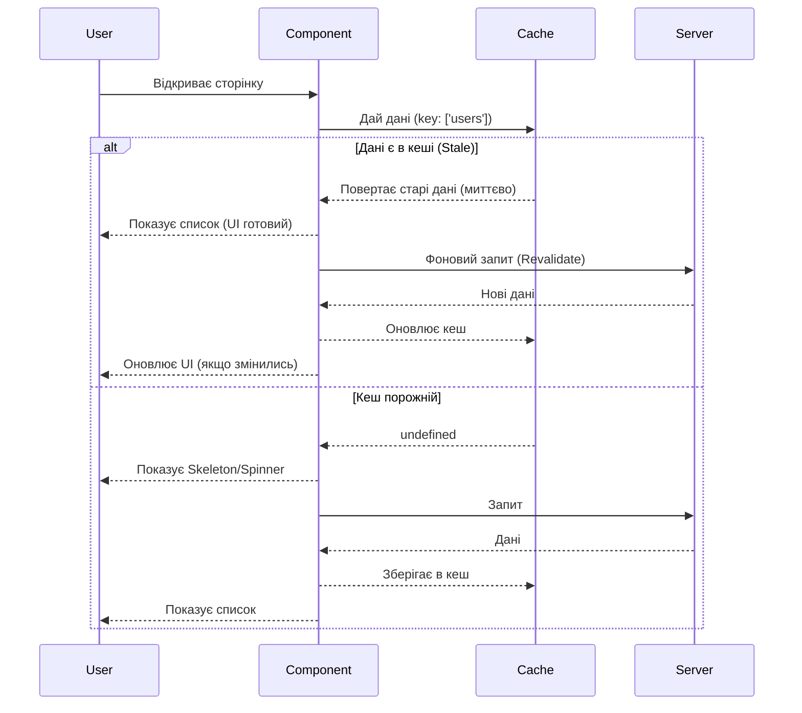

# Парадигма Server State: Чому useEffect недостатньо

Перш ніж ми напишемо хоч рядок коду з TanStack Query, нам потрібно змінити світогляд. Більшість React-розробників проходять через стадію, коли вони намагаються керувати _всім_ станом однаково. Це пастка.

У цій главі ми розберемо фундаментальну відмінність між **Client State** та **Server State**, і чому спроба керувати ними одними й тими ж інструментами призводить до болю, багів та спагетті-коду.

## Два Світи Даних

У сучасному фронтенді ми керуємо двома принципово різними типами даних.

### Client State (Локальний Стан)

Це стан, який **належить** браузеру/додатку. Він синхронний, миттєвий і повністю під нашим контролем.

- **Приклади**:
    - `isModalOpen` (чи відкрито модальне вікно)
    - `theme` (темна/світла тема)
    - `formValues` (що користувач ввів у інпут прямо зараз)
    - `activeTab` (яка вкладка обрана)
- **Властивості**:
    - Ми завжди знаємо останнє значення.
    - Змінюється лише тоді, коли ми це явно кажемо.
    - Не потребує асинхронності.
- **Інструменти**: `useState`, `useReducer`, Context API, Zustand, Redux (для UI).

### Server State (Віддалений Стан)

Це дані, які **належать** серверу. Ми лише позичаємо їх для відображення.

- **Приклади**:
    - Список товарів в інтернет-магазині.
    - Профіль користувача.
    - Коментарі під постом.
- **Властивості**:
    - **Асинхронний**: Потрібен час для отримання.
    - **Спільний**: Інші користувачі можуть змінити ці дані без нашого відома.
    - **Застаріває (Stale)**: Як тільки ви отримали дані, вони вже можуть бути неактуальними.
    - **Потенційно недоступний**: Сервер може впасти, інтернет зникнути.
- **Інструменти**: TanStack Query, SWR, Apollo Client (для GraphQL).

::note
**Ключовий інсайт**: Server State — це не просто дані, це **кеш**. Ви не володієте цими даними, ви лише зберігаєте їх останній відомий знімок (snapshot).
::

## Чому `useEffect` — це погано для даних?

Давайте розглянемо класичний приклад "наївного" фечингу даних, який пишуть 99% новачків (і навіть мідлів).

```jsx [NaiveFetch.jsx]
function ProductList() {
  const [products, setProducts] = useState([]);
  const [isLoading, setIsLoading] = useState(false);
  const [error, setError] = useState(null);

  useEffect(() => {
    const fetchData = async () => {
      setIsLoading(true);
      try {
        const res = await fetch('/api/products');
        const data = await res.json();
        setProducts(data);
      } catch (err) {
        setError(err);
      } finally {
        setIsLoading(false);
      }
    };

    fetchData();
  }, []);

  if (isLoading) return <div>Loading...</div>;
  if (error) return <div>Error!</div>;

  return (/* рендер списку */);
}
```

Виглядає нормально? На перший погляд так. Але давайте подивимось, чого тут **не вистачає** для production-ready додатку:

1.  **Race Conditions (Стан гонитви)**:
    Що якщо `id` зміниться, і ми запустимо новий запит, поки попередній ще йде? Може статися так, що попередній запит (старий) прийде _після_ нового, і ми перезапишемо актуальні дані старими. `useEffect` не має вбудованого механізму скасування (cancellation).

2.  **Відсутність Кешування**:
    Якщо користувач перейде на іншу сторінку і повернеться назад — ми знову покажемо спіннер і знову зробимо запит. Це поганий UX і зайве навантаження на сервер.

3.  **Немає Дедуплікації**:
    Якщо у вас є `Header`, який показує кількість товарів, і `ProductList`, який показує самі товари, і вони монтуються одночасно — ви відправите **два однакових запити** на `/api/products`.

4.  **Оновлення у фоні**:
    Якщо користувач відкрив вкладку і пішов пити каву на 20 хвилин, дані застаріють. Ваш `useEffect` ніколи про це не дізнається.

5.  **Обробка помилок**:
    Вам доводиться вручну керувати станом помилки. А що щодо повторних спроб (retries)? Якщо мережа блимнула, треба спробувати ще раз. Писати логіку retry в `useEffect` — це пекло.

## Пастка Global State Managers (Redux, Zustand)

Коли розробники розуміють, що `useEffect` у компонентах не масштабується, вони часто кидаються в іншу крайність: **"Давайте покладемо все в Redux!"**.

І починається ера **Thunks**, **Sagas** або **Epics**.

Типовий потік в Redux для отримання даних:

1.  Створити константу `FETCH_PRODUCTS_START`.
2.  Створити константу `FETCH_PRODUCTS_SUCCESS`.
3.  Створити константу `FETCH_PRODUCTS_ERROR`.
4.  Написати Action Creator.
5.  Написати Thunk (асинхронна функція).
6.  Оновити Reducer (обробити `isLoading`, `data`, `error`).
7.  Використати `useSelector` в компоненті.
8.  Використати `useEffect` для запуску Thunk.

**Результат**: Тонни boilerplate-коду.

Але найгірше те, що **Redux не знає, що це Server State**. Для нього це просто об'єкт. Він не знає, коли дані "протухли". Він не вміє робити refetch при фокусі вікна. Ви починаєте писати власні милиці (костилі) для перевірки `lastUpdated` timestamp...

::warning
**Redux/Zustand — для Client State**. Використовуйте їх для того, що має бути глобальним та синхронним (теми, налаштування UI, сесії). Не використовуйте їх як кеш для API, якщо у вас немає на це _дуже_ вагомих причин.
::

## Рішення: Stale-While-Revalidate

TanStack Query використовує стратегію кешування, популяризовану HTTP специфікацією (RFC 5861), яка називається **Stale-While-Revalidate**.

Суть проста:

1.  **Stale (Застарілий)**: Покажи користувачеві дані, які є в кеші (навіть якщо вони старі), _миттєво_.
2.  **While (Поки)**: У фоновому режимі (не блокуючи UI).
3.  **Revalidate (Перевірити)**: Зроби запит на сервер, щоб отримати свіжі дані.

Якщо дані змінилися — онови UI. Якщо ні — залиш як є.

**Ефект для користувача**: Додаток працює миттєво. Немає спіннерів при навігації "Назад/Вперед". Спіннери з'являються лише при _першому_ завантаженні.

::mermaid



::

## Чому TanStack Query?

TanStack Query (React Query) — це бібліотека, яка реалізує цю логіку "з коробки". Вона бере на себе:

- **Кешування**: Автоматичне зберігання та управління часом життя даних.
- **Дедуплікація**: Об'єднання однакових запитів в один.
- **Актуалізація**: Оновлення даних при фокусі вікна, відновленні мережі тощо.
- **Продуктивність**: Оптимізовані рендери та мемоізація.
- **Пагінація та Infinite Scroll**: Готові абстракції для складних UI патернів.

У наступному розділі ми встановимо бібліотеку та налаштуємо наше середовище для комфортної роботи.

[Далі: Встановлення та Налаштування](./02.installation-and-devtools.md)
