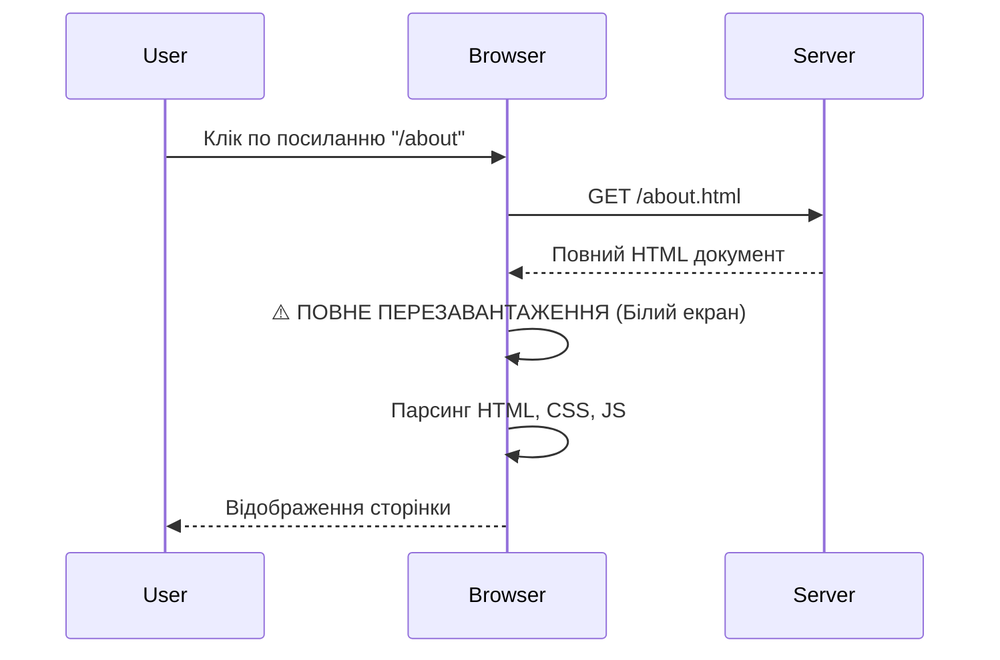
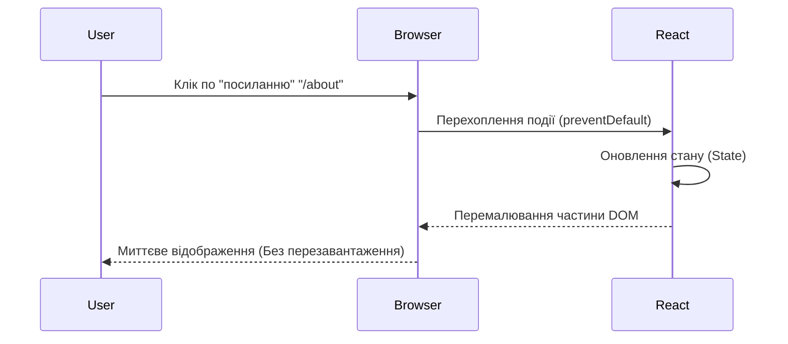

# React Router: Навігаційна система сучасного вебу

::cover


<!-- Search Query: React Router ecosystem abstract banner modern design blue and red gradient -->

::

Уявіть, що ви будуєте будинок. **React** — це цегла, бетон та інструменти для зведення стін (компонентів). Але будинок без коридорів, дверей та сходів — це просто набір ізольованих кімнат. Ви не можете потрапити з вітальні на кухню, не вийшовши з дому і не зайшовши з іншого входу.

**React Router** — це архітектурний план вашого будинку. Це коридори, двері, ліфти та вказівники, які з'єднують ваші кімнати-компоненти в єдиний, зручний для життя простір.

У цьому масштабному гайді ми пройдемо шлях від "Чому нам взагалі потрібен роутер?" до побудови складних навігаційних систем, які використовують Instagram або Notion.

## 1. Фундаментальна Проблема: MPA vs SPA

Щоб зрозуміти _цінність_ React Router, нам потрібно повернутися до того, як працював веб до його появи.

### Епоха MPA (Multi-Page Application)

Традиційний веб (наприклад, старі сайти на PHP або статичні HTML-файли) працює за моделлю **MPA**.

::mermaid



::

**Проблеми цього підходу:**

1.  **Втрата стану**: Кожного разу, коли ви переходите на нову сторінку, браузер "забуває" все. Якщо ви заповнювали форму або відкрили модальне вікно — все зникне.
2.  **Повільність**: Браузер змушений щоразу завантажувати _весь_ контент, навіть якщо змінилася лише центральна частина, а шапка і підвал залишилися тими ж.
3.  **UX "Моргання"**: Користувач бачить білий екран між переходами.

### Революція SPA (Single-Page Application)

React популяризував підхід **SPA**. Ідея проста: ми завантажуємо сайт _один раз_.

::mermaid



::

Але тут виникає нова проблема. Якщо ми просто змінюємо компоненти через `useState` (наприклад, `activeTab`), браузер **не змінює URL**.

**Наслідки "навігації через State":**

- ❌ **Неможливо поділитися посиланням**: Якщо ви скинете другу сторінку `my-app.com` другу, він відкриє головну, бо URL не змінився.
- ❌ **Кнопка "Назад" не працює**: Браузер не знає, що ви кудись переходили. Натискання "Назад" викине користувача з сайту взагалі.
- ❌ **SEO-катастрофа**: Пошукові роботи не можуть індексувати контент, який не прив'язаний до URL.

### Рішення: Клієнтський Роутинг

Саме тут на сцену виходить **React Router**. Він емулює навігацію браузера, але робить це без перезавантаження сторінки.

1.  **Синхронізація UI з URL**: Коли змінюється URL, React Router показує відповідні компоненти.
2.  **Управління Історією**: Він взаємодіє з `Browser History API`, щоб кнопки "Назад" і "Вперед" працювали коректно.
3.  **Керування даними**: У сучасних версіях (v6.4+) він також бере на себе завантаження даних для сторінок.

---

## 2. Еволюція React Router

Важливо розуміти контекст, оскільки в інтернеті ви знайдете багато застарілих туторіалів.

| Версія | Епоха | Ключова філософія | Статус |
| :--- | :--- | :--- | :--- |
| **v4 / v5** | 2017-2021 | **Компоненти-як-Роути**. Все є компонентом (`<Route>`). Динамічне визначення маршрутів під час рендеру. | 🛑 Legacy |
| **v6.0-v6.3** | 2021-2022 | **Хуки та Конфігурація**. Введення `<Routes>`, вкладені маршрути через `<Outlet>`, спрощення API. | ⚠️ Перехідна |
| **v6.4+** | 2022-2024 | **Data Router**. Введення `loader`, `action`, `RouterProvider`. Роутер керує даними. | 🟡 Стабільна |
| **v7** | 2024+ | **Уніфікація**. Об'єднання Remix та React Router. Підтримка SSR, покращена типізація, нові хуки. | ✅ **Сучасний Стандарт** |

::note
У цьому курсі ми фокусуємось на **v7**, використовуючи `createBrowserRouter`. Цей API є еволюцією v6.4 і є стандартом для нових SPA проектів. Якщо ви шукаєте інформацію про старий компонентний підхід, дивіться розділ [Legacy Routing](./07.legacy-routing.md).
::

---

## 3. Головна ментальна модель: URL як Джерело Істини

Це найважливіший концептуальний зсув для початківця.

В React ми звикли, що стан (`useState`, `useReducer`, `Redux`) керує відображенням.
**В React Router джерелом істини стає URL.**

> Якщо чогось немає в URL, користувач не може це зберегти, поділитися цим або повернутися до цього.

**Приклад еволюції мислення:**

**Рівень 1 (Новачок - State):**
Ми зберігаємо ID відкритого товару в змінній стану.
```tsx
const [selectedProductId, setSelectedProductId] = useState(null);
// Якщо оновити сторінку, selectedProductId скинеться в null. Стан втрачено.
```

**Рівень 2 (Профі - URL):**
Ми "зберігаємо" ID товару в URL (`/product/123`).
```tsx
// URL: /product/123
const params = useParams(); // { id: '123' }
// При оновленні сторінки React Router знову прочитає '123' з URL. Стан збережено.
```

::tip
**Золоте правило**: Завжди запитуйте себе — "Чи повинен користувач мати можливість потрапити на цей саме екран за прямим посиланням?". Якщо так — цей стан має бути в URL.
::

## Що далі?

У наступних розділах ми побудуємо повноцінний додаток, розбираючи кожен аспект:

1.  **[Основи та Налаштування](./01.setup-and-basic-routing.md)**: Відмовимось від старого `<BrowserRouter>` на користь сучасного `createBrowserRouter` (v7).
2.  **[Динамічна Навігація](./02.navigation-and-links.md)**: Чому тег `<a>` — це ворог, і як правильно лінкувати сторінки.
3.  **[Вкладені Маршрути (Nested Routes)](./03.nested-routes-and-layouts.md)**: "Кілер-фіча" React Router, яка дозволяє будувати складні UI.
4.  **[Динамічні Маршрути](./04.dynamic-routing.md)**: Робота з параметрами URL.
5.  **[Data APIs: Loaders & Actions](./05.data-loading.md)**: Як забути про `useEffect` для завантаження даних.
6.  **[Просунуті Патерни](./06.advanced-patterns.md)**: Захищені маршрути та оптимізація.

Готові перетворити набір компонентів на справжній додаток? Переходьмо до налаштування.
