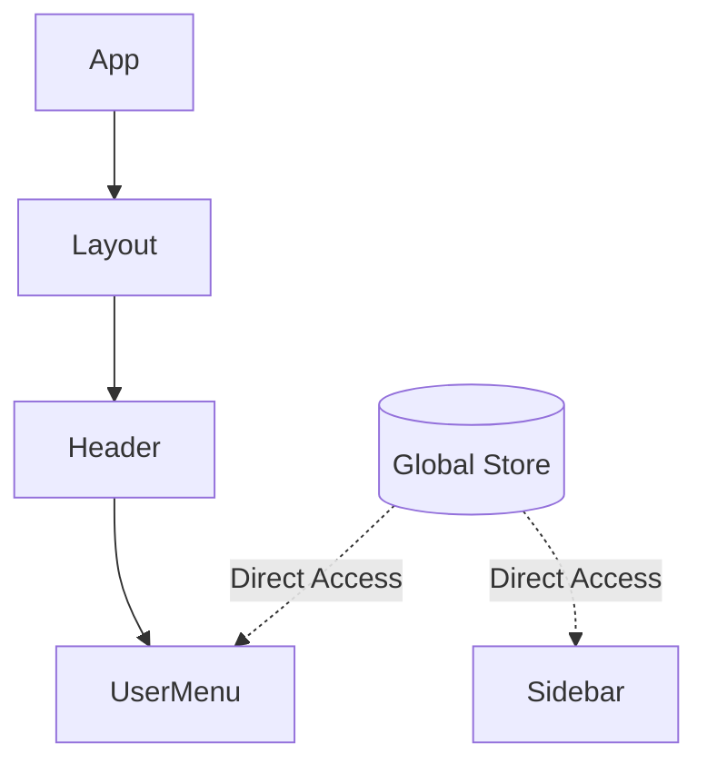

# Вступ до State Management

Перш ніж пірнати в код Redux, давайте зупинимося і відповімо на головне питання: **"Яку проблему ми взагалі намагаємося вирішити?"**.

Багато розробників додають Redux у проєкт просто тому, що "так прийнято" або "це є в вимогах вакансії". Це призводить до надмірно складної архітектури там, де вона не потрібна.

У цьому розділі ми розберемося, що таке стан, яким він буває, і коли `useState` перестає справлятися.

## Що таке "Стан" (State)?

У контексті React, **State (Стан)** — це будь-які дані, які змінюються у часі та впливають на те, що користувач бачить на екрані.

Це не тільки дані з бази даних. Стан — це все:

- Текст, який ви вводите в поле пошуку.
- Інформація про те, чи відкрито модальне вікно.
- Список завантажених повідомлень.
- Помилка, яка виникла при валідації форми.
- Навіть позиція скролу сторінки.

### Типологія Стану

Щоб ефективно керувати даними, важливо розрізняти їх типи. Не все має лежати в Redux!

| Тип стану        | Опис                                                             | Приклад                                                                     | Де зберігати?               |
| :--------------- | :--------------------------------------------------------------- | :-------------------------------------------------------------------------- | :-------------------------- |
| **Local State**  | Дані, що стосуються одного компонента або його найближчих дітей. | Значення input, стан відкриття dropdown.                                    | `useState`, `useReducer`    |
| **Global State** | Дані, потрібні багатьом компонентам у різних частинах дерева.    | Профіль користувача, тема (світла/темна), мова інтерфейсу.                  | Context API, Redux, Zustand |
| **Server State** | Кешовані дані, отримані з API.                                   | Список товарів, деталі замовлення.                                          | React Query, SWR, RTK Query |
| **URL State**    | Дані, що зберігаються в адресному рядку.                         | ID активного товару (`/product/123`), параметри фільтрації (`?sort=price`). | React Router                |

::alert{type="warning"}
**Антипатерн**: Зберігати _все_ в глобальному стейті. Якщо стан відкриття модального вікна потрібен лише одній кнопці та самому вікну — це Local State.

::

## Проблема: Prop Drilling

Уявіть, що у вас є типовий React-додаток. У вас є кореневий компонент `App`, в ньому є `Layout`, в ньому `Header`, в `Header` є `UserMenu`, а в `UserMenu` — `Avatar`.

Вам потрібно передати об'єкт `user` з `App` в `Avatar`.

Без глобального стейт-менеджера це виглядає так:

::code-tree

```tsx [App.js]
function App() {
    const [user, setUser] = useState({ name: 'Ivan', avatar: 'img.jpg' })
    // Ми передаємо user в Layout, хоча Layout він не потрібен!
    return <Layout user={user} />
}
```

```tsx [Layout.js]
function Layout({ user }) {
    // Layout просто передає далі...
    return (
        <div>
            <Sidebar />
            <Header user={user} />
            <Main />
        </div>
    )
}
```

```tsx [Header.js]
function Header({ user }) {
    // Header теж просто передає далі...
    return (
        <header>
            <Logo />
            <UserMenu user={user} />
        </header>
    )
}
```

```tsx [UserMenu.js]
function UserMenu({ user }) {
    // Нарешті використовуємо!
    return (
        <div className="user-menu">
            <span>{user.name}</span>
            <Avatar url={user.avatar} />
        </div>
    )
}
```

::

Це явище називається **Prop Drilling** ("свердління пропсів").

### Чому це погано?

1.  **Зайвий код**: Проміжні компоненти (`Layout`, `Header`) забруднені пропсами, які їм не потрібні.
2.  **Складність рефакторингу**: Якщо ви захочете перейменувати `user` на `currentUser`, вам доведеться правити 4 файли замість одного.
3.  **Зв'язність компонентів**: `Header` не може існувати без `user`, хоча логічно він йому не потрібен.
4.  **Re-renders**: Зміна `user` може викликати ре-рендер усіх проміжних компонентів (хоча React намагається це оптимізувати, це все одно потенційна проблема).

## Рішення: Global State Manager

Глобальний менеджер стану (наприклад, Redux) працює як "хмара" для вашого додатку. Ви кладете дані в цю хмару, і будь-який компонент може "підключитися" до неї і отримати те, що йому потрібно, напряму.

::mermaid



::

### Основні переваги Redux

Крім вирішення проблеми Prop Drilling, Redux дає нам ще дещо важливе:

1.  **Single Source of Truth (Єдине джерело правди)**:
    Весь стан додатку знаходиться в одному місці (об'єкті). Це полегшує розуміння того, що відбувається в програмі.

2.  **Передбачуваність (Predictability)**:
    У Redux не можна просто змінити стан (наприклад, `user.name = 'Max'`). Ви повинні "попросити" систему зробити зміни через спеціальну подію (**Action**). Це гарантує, що зміни відбуваються контрольовано.

3.  **Потужні інструменти розробника (DevTools)**:
    Це "кілер-фіча" Redux. Ви можете:
    - Бачити історію всіх дій.
    - Бачити, як змінювався стан після кожної дії (Diff).
    - **Time Travel Debugging**: "Відмотати" час назад і подивитися, як виглядав додаток 5 хвилин тому.

4.  **Легкість тестування**:
    Оскільки логіка зміни стану (Reducers) — це чисті функції, їх дуже легко тестувати (unit tests), навіть без запуску React.

---

Тепер, коли ми розуміємо _навіщо_ нам це потрібно, давайте розберемося з теоретичним фундаментом, на якому побудований Redux — архітектурою Flux та концепціями функціонального програмування.

👉 [Далі: Філософія Redux та Архітектура Flux](./02.redux-philosophy.md)
