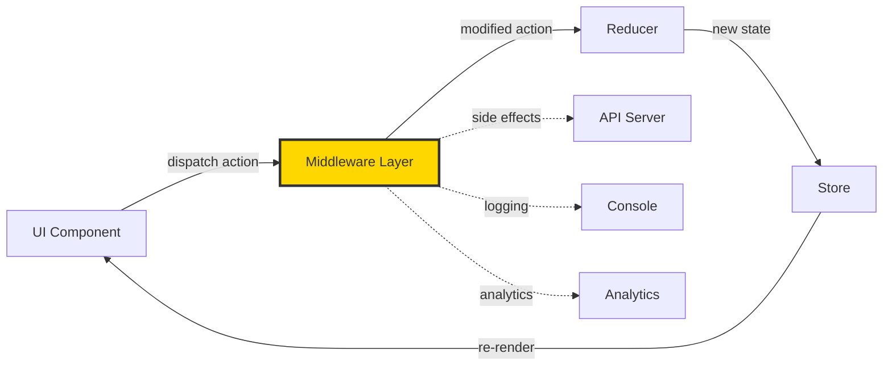
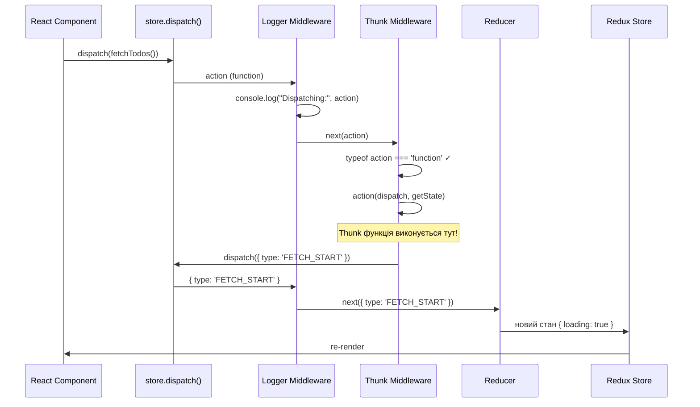
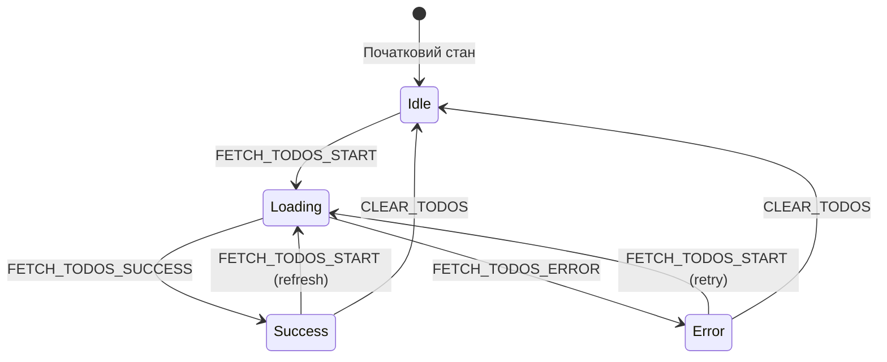
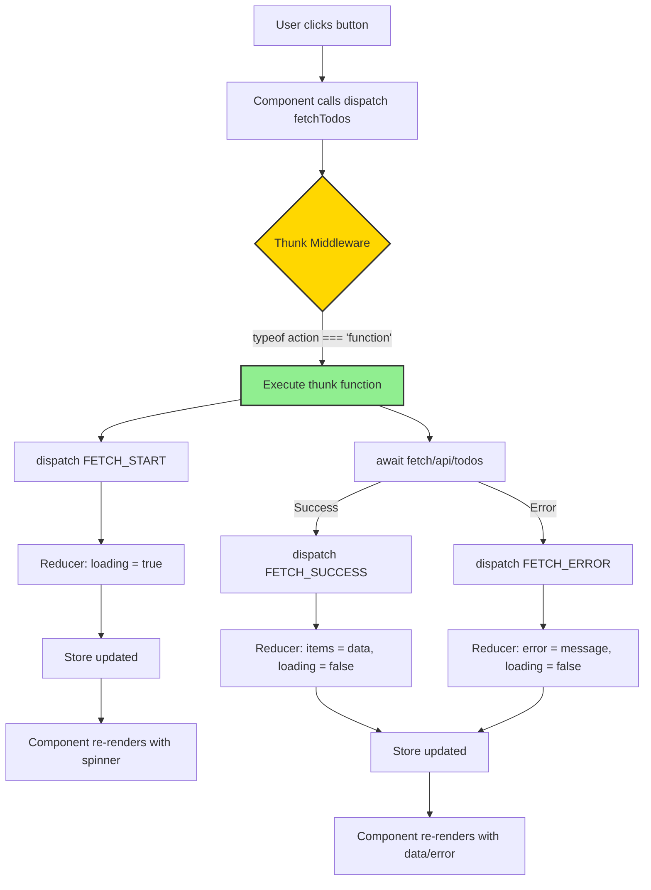

# Middleware та Асинхронність (Redux Thunk)

## Вступ: Від Синхронності до Реального Світу

Уявіть, що ви створюєте інтернет-магазин. Користувач натискає кнопку "Додати в кошик" — і товар миттєво з'являється в списку. Це **синхронна** операція: натиснули → змінився стан → оновився UI. Але що, якщо користувач натискає "Купити зараз"?

Тепер вам потрібно:

1. Показати індикатор завантаження (spinner)
2. Відправити дані на сервер
3. Почекати відповідь (це може зайняти секунди!)
4. Обробити успіх або помилку
5. Оновити UI відповідно до результату

Це вже **асинхронна** операція. І ось тут класичний Redux натикається на стіну: **actions та reducers не вміють чекати**.

Досі наші actions були синхронними об'єктами: `{ type: 'ADD_TODO', payload: 'Buy milk' }`. Але як описати процес, розтягнутий у часі? Тут на сцену виходить **Middleware**.

::note
**Що ви дізнаєтесь у цьому розділі:**

- Чому редюсери не можуть виконувати асинхронні операції
- Що таке middleware і як воно працює "під капотом"
- Як Redux Thunk дозволяє диспатчити функції замість об'єктів
- Просунуті патерни для обробки помилок, відміни запитів та retry logic
- Як налагоджувати та тестувати асинхронний код
  ::

### Prerequisites (Що потрібно знати)

Перед вивченням цього розділу переконайтеся, що розумієте:

- [Basics Redux: Actions, Reducers, Store](./01.basics.md)
- [Pure Functions](./02.pure-functions.md) — критично важливо!
- JavaScript Promises та async/await
- Концепцію побічних ефектів (side effects)

### Історична еволюція

На зорі Redux (2015 рік) розробники швидко зіткнулися з проблемою: **як робити AJAX-запити?** Перші спроби виглядали так:

```javascript
// ❌ АНТИПАТЕРН: Fetch у компоненті, потім dispatch
function TodoList() {
    const dispatch = useDispatch()

    useEffect(() => {
        fetch('/api/todos')
            .then((res) => res.json())
            .then((data) => dispatch({ type: 'TODOS_LOADED', payload: data }))
    }, [])
}
```

**Проблеми цього підходу:**

- Логіка розмазана між компонентами
- Неможливо переглянути в Redux DevTools
- Важко тестувати
- Порушує принцип єдиної відповідальності

Тоді з'явилася ідея: **а що, якщо винести цю логіку в саме Redux?** Так народилася концепція middleware.

## Фундаментальні Концепції

### Чому Редюсери Мають Бути Чистими Функціями?

Згадаємо **золоте правило Redux**:

::warning
**Редюсери повинні бути чистими функціями**

- **Вхід:** Поточний стан + action
- **Вихід:** Новий стан (обов'язково новий об'єкт!)
- **Заборонено:** Мутації, запити, випадкові числа, `Date.now()`, тощо
  ::

Чому це так важливо?

```javascript
// ❌ ПОГАНО: Редюсер з побічним ефектом
function userReducer(state, action) {
  if (action.type === 'FETCH_USER') {
    // Це НЕ ПРАЦЮВАТИМЕ!
    fetch('/api/user')
      .then(res => res.json())
      .then(data => ??? ); // Як тут оновити стан?

    return state; // Повернули старий стан, але fetch ще летить!
  }
}
```

**Проблеми:**

1. **Редюсер має повернути стан миттєво**, але `fetch` — це Promise, яка резолвиться пізніше
2. **Редюсер не має доступу до `dispatch`**, тому не може сам відправити новий action з даними
3. **Time-travel debugging** (перемотка часу в DevTools) ламається, бо побічні ефекти виконаються знову

### Що Таке Side Effects (Побічні Ефекти)?

**Side Effect** — це будь-яка операція, яка виходить за межі функції та взаємодіє із зовнішнім світом.

::code-group

```javascript [✅ Чиста функція (Pure)]
function add(a, b) {
    return a + b // Завжди однаковий результат для одних аргументів
}
```

```javascript [❌ Побічні ефекти (Impure)]
let counter = 0

function addAndLog(a, b) {
    counter++ // Мутація зовнішньої змінної
    console.log('Adding...') // Логування (I/O)
    fetch('/api/log', { body: a + b }) // Мережевий запит
    return a + b + Math.random() // Випадковість
}
```

::

**Приклади побічних ефектів у веб-додатках:**

- HTTP-запити (fetch, axios)
- Запис у localStorage
- Зміна DOM напряму
- Таймери (setTimeout, setInterval)
- WebSocket з'єднання
- Логування в консоль

### Middleware: Офіційне Місце для Side Effects

Redux вирішує цю проблему елегантно: **винести побічні ефекти за межі редюсерів**, але залишити їх усередині екосистеми Redux.

::mermaid



::

**Middleware** — це прошарок між `dispatch(action)` та моментом, коли action досягає редюсера. Тут можна:

- Логувати actions (Redux Logger)
- Обробляти crashes (Error Reporter)
- Робити асинхронні запити (Redux Thunk)
- Трансформувати actions перед відправкою до редюсера

### Аналогія: Middleware як Охоронець

Уявіть Redux Store як охороняєму будівлю:

- **UI** — відвідувач, який хоче потрапити всередину
- **Action** — пропуск відвідувача
- **Middleware** — охоронець на вході
- **Reducer** — кабінет, куди пускають тільки після перевірки
- **State** — секретні документи всередині кабінету

Охоронець (middleware) може:

- Записати в журнал, хто прийшов (logging)
- Перевірити пропуск на дійсність
- Викликати начальство, якщо щось підозріле (crash reporting)
- Попросити відвідувача зачекати, поки принесуть додаткові документи (async calls)
- Навіть **відправити когось іншого замість нього** (трансформація actions)

## Архітектура та Механіка Middleware

### Потік Даних з Middleware

Розберемо детально, що відбувається при `dispatch(action)` у Redux зі встановленим middleware:

::mermaid



::

**Ключові моменти:**

1. Middleware викликаються **по черзі** (в порядку, як їх передали в `applyMiddleware`)
2. Кожен middleware може **зупинити ланцюжок**, не викликаючи `next(action)`
3. Кожен middleware може **викликати `dispatch` повторно**, створюючи нові actions

### Under the Hood: Як Працює applyMiddleware

`applyMiddleware` — це **store enhancer** (покращувач стору). Він обгортає оригінальний `dispatch` у ланцюжок функцій.

Спрощена реалізація:

```javascript
// Так виглядає applyMiddleware всередині (спрощено)
function applyMiddleware(...middlewares) {
    return (createStore) => (reducer, preloadedState) => {
        const store = createStore(reducer, preloadedState)
        let dispatch = store.dispatch

        // Даємо кожному middleware доступ до getState та dispatch
        const middlewareAPI = {
            getState: store.getState,
            dispatch: (action) => dispatch(action), // Важливо: closure!
        }

        // Перетворюємо кожен middleware з формату:
        // storeAPI => next => action => result
        // У формат: next => action => result
        const chain = middlewares.map((middleware) => middleware(middlewareAPI))

        // Складаємо їх справа наліво: MW1(MW2(MW3(originalDispatch)))
        dispatch = compose(...chain)(store.dispatch)

        return { ...store, dispatch }
    }
}
```

**Що тут відбувається:**

1. **Створюється оригінальний store** зі звичайним `dispatch`
2. **Кожен middleware отримує API** з `getState` та `dispatch`
3. **Middleware складаються в ланцюжок** за допомогою `compose`
4. **`dispatch` замінюється** на обгорнуту версію

### Currying Pattern: Три Рівні Функцій

Сигнатура middleware виглядає страшно для новачків:

```javascript
const middleware = (storeAPI) => (next) => (action) => {
    // ...
}
```

**Чому ТРИ рівні функцій?** Розберемо покроково:

::steps

### Рівень 1: storeAPI => ...

**Мета:** Отримати доступ до `getState` та `dispatch`

```javascript
const loggerMiddleware = (storeAPI) => {
    // Тут є доступ до storeAPI.getState() та storeAPI.dispatch()
    // Цей рівень викликається ОДИН РАЗ при ініціалізації store

    return (next) => {
        // ...
    }
}
```

### Рівень 2: next => ...

**Мета:** Отримати посилання на наступний middleware (або редюсер)

```javascript
const loggerMiddleware = (storeAPI) => (next) => {
    // next — це або наступний middleware, або оригінальний dispatch
    // Цей рівень викликається при setup middleware chain

    return (action) => {
        // ...
    }
}
```

### Рівень 3: action => ...

**Мета:** Обробити конкретний action

```javascript
const loggerMiddleware = (storeAPI) => (next) => (action) => {
    // Це викликається КОЖНОГО РАЗУ при dispatch(action)
    console.log('Dispatching:', action)
    const result = next(action) // Передаємо далі
    console.log('Next state:', storeAPI.getState())
    return result
}
```

::

**Повна картина:**

```javascript
// Використання currying для гнучкості
const createLoggerMiddleware = (options) => (storeAPI) => (next) => (action) => {
    if (options.enabled) {
        console.log('[Logger]', action.type)
    }
    return next(action)
}

// Тепер можна налаштовувати middleware
const logger = createLoggerMiddleware({ enabled: true })
const store = createStore(reducer, applyMiddleware(logger))
```

### Реалізація Redux Thunk Під Капотом

Redux Thunk — це всього **10 рядків коду**! Ось повна реалізація:

```javascript
// Офіційна реалізація redux-thunk (спрощено)
function createThunkMiddleware(extraArgument) {
    return ({ dispatch, getState }) =>
        (next) =>
        (action) => {
            // Якщо action — це функція, викликаємо її
            if (typeof action === 'function') {
                return action(dispatch, getState, extraArgument)
            }

            // Інакше просто передаємо далі
            return next(action)
        }
}

const thunk = createThunkMiddleware()
export default thunk
```

**Розбір по рядках:**

1. **`typeof action === 'function'`**: Перевіряємо, чи action — це функція (тобто thunk)
2. **`action(dispatch, getState, extraArgument)`**: Якщо так — викликаємо її, передаючи:
    - `dispatch` — щоб thunk міг диспатчити інші actions
    - `getState` — щоб thunk міг читати поточний стан
    - `extraArgument` — додатковий аргумент (наприклад, API client)
3. **`return next(action)`**: Якщо це звичайний об'єкт — пропускаємо далі

**Ось і вся магія!** Thunk middleware просто розпізнає функції та виконує їх, даючи їм доступ до `dispatch`.

## Redux Thunk: Функції Замість Об'єктів

### Що Таке Thunk?

**Thunk** (від англ. "думка про щось") — це функція, яка повертає іншу функцію.

```javascript
// Звичайна функція
function getValue() {
    return 42
}

// Thunk функція
function getValueLater() {
    return function () {
        // Повертаємо функцію!
        return 42
    }
}

const thunk = getValueLater() // Отримали функцію
const value = thunk() // Тепер викликали і отримали 42
```

**Навіщо це потрібно?** Відкладання обчислень! Функція, загорнута в іншу функцію, може виконатися пізніше.

### Action Creator vs Thunk Action Creator

::code-group

```javascript [Звичайний Action Creator]
// Повертає простий об'єкт
function addTodo(text) {
    return {
        type: 'ADD_TODO',
        payload: text,
    }
}

// Використання
dispatch(addTodo('Buy milk'))
// Відразу потрапить до редюсера
```

```javascript [Thunk Action Creator]
// Повертає ФУНКЦІЮ!
function fetchTodos() {
    return async (dispatch, getState) => {
        // Тут може бути будь-яка асинхронна логіка
        const response = await fetch('/api/todos')
        const data = await response.json()
        dispatch({ type: 'TODOS_LOADED', payload: data })
    }
}

// Використання (ТОЧНО ТАК САМО!)
dispatch(fetchTodos())
// Thunk middleware перехопить та виконає функцію
```

::

**Ключова різниця:**

- **Action creator** повертає `{ type, payload }` → відразу до reducer
- **Thunk action creator** повертає `(dispatch, getState) => { ... }` → виконується middleware

## Практична Реалізація

### Крок 1: Встановлення

::steps

### Встановіть redux-thunk

```bash
npm install redux-thunk
```

Або з yarn:

```bash
yarn add redux-thunk
```

### Імпортуйте та підключіть до store

```javascript
import { createStore, applyMiddleware } from 'redux'
import thunk from 'redux-thunk'
import rootReducer from './reducers'

const store = createStore(
    rootReducer,
    applyMiddleware(thunk), // Додаємо middleware
)

export default store
```

**Пояснення рядків:**

- **`applyMiddleware(thunk)`**: Створює store enhancer, що обгортає dispatch
- Тепер `dispatch` може приймати як об'єкти, так і функції!

::

### Крок 2: Написання Thunk Actions

#### Базовий приклад

```javascript
// actions/todoActions.js

// 1. Визначаємо прості action creators
const fetchTodosStart = () => ({ type: 'FETCH_TODOS_START' })
const fetchTodosSuccess = (todos) => ({
    type: 'FETCH_TODOS_SUCCESS',
    payload: todos,
})
const fetchTodosError = (error) => ({
    type: 'FETCH_TODOS_ERROR',
    payload: error,
})

// 2. Визначаємо thunk action creator
export const fetchTodos = () => {
    // Повертаємо функцію (thunk)!
    return async (dispatch, getState) => {
        // dispatch — функція для відправки actions
        // getState — функція для читання поточного стану

        // Крок 1: Повідомляємо, що почали завантаження
        dispatch(fetchTodosStart())

        try {
            // Крок 2: Робимо асинхронний запит
            const response = await fetch('https://jsonplaceholder.typicode.com/todos')

            if (!response.ok) {
                throw new Error(`HTTP error! status: ${response.status}`)
            }

            const data = await response.json()

            // Крок 3: Успіх! Відправляємо дані
            dispatch(fetchTodosSuccess(data))
        } catch (error) {
            // Крок 4: Помилка! Відправляємо error
            dispatch(fetchTodosError(error.message))
        }
    }
}
```

**Пояснення ключових моментів:**

1. **Три окремі action creators** (`Start`, `Success`, `Error`) — стандартний патерн для async операцій
2. **`async (dispatch, getState) => { ... }`** — це thunk функція. Redux Thunk автоматично передасть їй ці аргументи
3. **`dispatch(fetchTodosStart())`** — ми можемо диспатчити інші actions всередині thunk
4. **`await fetch(...)`** — можна використовувати async/await, бо це звичайна JS функція!

#### Використання getState для умовної логіки

```javascript
// Приклад: Завантажуємо todos тільки якщо їх ще немає
export const fetchTodosIfNeeded = () => {
    return (dispatch, getState) => {
        const state = getState()

        // Перевіряємо, чи вже завантажені
        if (state.todos.items.length > 0) {
            console.log('Todos вже є, не завантажуємо')
            return Promise.resolve() // Повертаємо resolved Promise
        }

        // Якщо немає — завантажуємо
        return dispatch(fetchTodos())
    }
}
```

::tip
**Best Practice:** Thunk може повертати Promise! Це дозволяє чекати завершення в компоненті:

```javascript
dispatch(fetchTodos()).then(() => {
    console.log('Todos завантажені!')
})
```

::

### Крок 3: Обробка в Reducer

```javascript
// reducers/todosReducer.js

const initialState = {
    items: [],
    loading: false,
    error: null,
}

function todosReducer(state = initialState, action) {
    switch (action.type) {
        case 'FETCH_TODOS_START':
            return {
                ...state,
                loading: true,
                error: null, // Скидаємо попередню помилку
            }

        case 'FETCH_TODOS_SUCCESS':
            return {
                ...state,
                loading: false,
                items: action.payload,
                error: null,
            }

        case 'FETCH_TODOS_ERROR':
            return {
                ...state,
                loading: false,
                error: action.payload,
            }

        default:
            return state
    }
}

export default todosReducer
```

**Пояснення Loading States State Machine:**

::mermaid



::

### Крок 4: Використання в React компоненті

```jsx
// components/TodoList.jsx

import { useEffect } from 'react'
import { useDispatch, useSelector } from 'react-redux'
import { fetchTodos } from '../actions/todoActions'

function TodoList() {
    const dispatch = useDispatch()

    // Підписуємося на стан
    const { items, loading, error } = useSelector((state) => state.todos)

    useEffect(() => {
        // Диспатчимо thunk так само, як звичайний action!
        dispatch(fetchTodos())
    }, [dispatch])

    if (loading) {
        return <div className="spinner">Loading...</div>
    }

    if (error) {
        return <div className="error">Error: {error}</div>
    }

    return (
        <ul>
            {items.map((todo) => (
                <li key={todo.id}>{todo.title}</li>
            ))}
        </ul>
    )
}

export default TodoList
```

**Зверніть увагу:** Компонент **не знає**, що `fetchTodos()` — це thunk! Для нього це просто action.

## Обробка Помилок та Error Handling

### Антипатерн: .then().catch()

::warning
**Типова помилка:** Ланцюжок `.then().catch()` може спіймати помилки не з мережевого запиту!

```javascript
// ❌ ПОГАНО
export const fetchTodos = () => {
    return (dispatch) => {
        dispatch(fetchStart())

        fetch('/api/todos')
            .then((res) => res.json())
            .then((data) => {
                dispatch(fetchSuccess(data)) // А якщо тут вилетить помилка?
                processData(data) // Наприклад, тут!
            })
            .catch((error) => {
                // Сюди потраплять помилки І з fetch, І з processData!
                dispatch(fetchError(error.message))
            })
    }
}
```

**Проблема:** `.catch()` спіймає помилки з `processData`, хоча це не помилка мережі!
::

### Правильний підхід: Другий аргумент .then()

```javascript
// ✅ ПРАВИЛЬНО
export const fetchTodos = () => {
    return (dispatch) => {
        dispatch(fetchStart())

        fetch('/api/todos')
            .then(
                // Success handler
                (response) => {
                    if (!response.ok) {
                        throw new Error(`HTTP ${response.status}`)
                    }
                    return response.json()
                },
                // Error handler (тільки мережеві помилки!)
                (networkError) => {
                    dispatch(fetchError(networkError.message))
                },
            )
            .then((data) => {
                if (data) {
                    // data буде undefined у випадку помилки
                    dispatch(fetchSuccess(data))
                    processData(data) // Помилка тут НЕ спіймається як fetch error
                }
            })
    }
}
```

### Try-Catch з async/await (Рекомендовано)

```javascript
// ✅ НАЙКРАЩЕ: Явна обробка помилок
export const fetchTodos = () => {
    return async (dispatch) => {
        dispatch(fetchStart())

        try {
            const response = await fetch('/api/todos')

            // Перевіряємо HTTP статус
            if (!response.ok) {
                throw new Error(`Server error: ${response.status}`)
            }

            const data = await response.json()

            // Валідація даних перед dispatch
            if (!Array.isArray(data)) {
                throw new Error('Invalid data format')
            }

            dispatch(fetchSuccess(data))

            // Побічні ефекти ПІСЛЯ успішного dispatch
            processData(data)
        } catch (error) {
            // Тут спіймаємо:
            // 1. Мережеві помилки (no internet, timeout)
            // 2. HTTP помилки (404, 500)
            // 3. JSON parsing помилки
            // 4. Помилки валідації
            dispatch(fetchError(error.message))

            // Опціонально: логування в Sentry
            console.error('Fetch todos failed:', error)
        }
    }
}
```

## Просунуті Патерни

### 1. Умовне Диспатчування (Conditional Dispatching)

Не завантажувати дані, якщо вони вже є:

```javascript
export const fetchUserIfNeeded = (userId) => {
    return (dispatch, getState) => {
        const { users } = getState()

        // Перевіряємо cache
        const existingUser = users.byId[userId]
        if (existingUser && !existingUser.isStale) {
            console.log('User вже є в кеші')
            return Promise.resolve(existingUser)
        }

        // Завантажуємо тільки якщо потрібно
        return dispatch(fetchUser(userId))
    }
}
```

### 2. Ланцюжки Thunks (Chaining)

Виконати кілька запитів послідовно:

```javascript
export const fetchUserWithPosts = (userId) => {
    return async (dispatch) => {
        // 1. Завантажуємо користувача
        await dispatch(fetchUser(userId))

        // 2. Потім його пости
        await dispatch(fetchUserPosts(userId))

        // 3. І коментарі до постів
        await dispatch(fetchPostComments(userId))
    }
}
```

Паралельне завантаження:

```javascript
export const fetchDashboardData = () => {
    return async (dispatch) => {
        dispatch({ type: 'DASHBOARD_LOAD_START' })

        try {
            // Завантажуємо все паралельно
            await Promise.all([dispatch(fetchUser()), dispatch(fetchPosts()), dispatch(fetchNotifications())])

            dispatch({ type: 'DASHBOARD_LOAD_SUCCESS' })
        } catch (error) {
            dispatch({ type: 'DASHBOARD_LOAD_ERROR', payload: error.message })
        }
    }
}
```

### 3. Відміна Запитів (Cancellation)

Використання AbortController:

```javascript
// Зберігаємо AbortController у зовнішній змінній
let abortController = null

export const fetchTodos = () => {
    return async (dispatch) => {
        // Скасовуємо попередній запит, якщо він ще йде
        if (abortController) {
            abortController.abort()
        }

        // Створюємо новий controller
        abortController = new AbortController()
        const { signal } = abortController

        dispatch(fetchStart())

        try {
            const response = await fetch('/api/todos', { signal })
            const data = await response.json()
            dispatch(fetchSuccess(data))
        } catch (error) {
            if (error.name === 'AbortError') {
                console.log('Fetch cancelled')
                // Не диспатчимо помилку для cancelled запитів
            } else {
                dispatch(fetchError(error.message))
            }
        }
    }
}
```

### 4. Retry Logic (Повторні Спроби)

```javascript
function delay(ms) {
    return new Promise((resolve) => setTimeout(resolve, ms))
}

export const fetchTodosWithRetry = (maxRetries = 3) => {
    return async (dispatch) => {
        dispatch(fetchStart())

        for (let attempt = 1; attempt <= maxRetries; attempt++) {
            try {
                const response = await fetch('/api/todos')
                const data = await response.json()
                dispatch(fetchSuccess(data))
                return // Успіх! Виходимо
            } catch (error) {
                if (attempt === maxRetries) {
                    // Останя спроба провалилась
                    dispatch(fetchError(`Failed after ${maxRetries} attempts`))
                } else {
                    // Чекаємо перед наступною спробою (exponential backoff)
                    console.log(`Attempt ${attempt} failed, retrying...`)
                    await delay(1000 * Math.pow(2, attempt)) // 2s, 4s, 8s...
                }
            }
        }
    }
}
```

### 5. Optimistic Updates

Оновлюємо UI _до_ відповіді сервера:

```javascript
export const toggleTodo = (todoId) => {
    return async (dispatch, getState) => {
        const todo = getState().todos.byId[todoId]

        // 1. Миттєво оновлюємо UI (optimistic)
        dispatch({
            type: 'TODO_TOGGLED_OPTIMISTIC',
            payload: { id: todoId, completed: !todo.completed },
        })

        try {
            // 2. Відправляємо на сервер
            const response = await fetch(`/api/todos/${todoId}`, {
                method: 'PATCH',
                body: JSON.stringify({ completed: !todo.completed }),
            })

            const updatedTodo = await response.json()

            // 3. Підтверджуємо оновлення даними з сервера
            dispatch({
                type: 'TODO_TOGGLED_SUCCESS',
                payload: updatedTodo,
            })
        } catch (error) {
            // 4. Якщо помилка — відкочуємо зміни (rollback)
            dispatch({
                type: 'TODO_TOGGLED_ROLLBACK',
                payload: { id: todoId, completed: todo.completed },
            })

            dispatch(showError('Failed to update todo'))
        }
    }
}
```

### 6. extraArgument: Dependency Injection

Передати API client у thunks:

```javascript
// store.js
import thunk from 'redux-thunk'
import api from './api' // Ваш API client

const store = createStore(rootReducer, applyMiddleware(thunk.withExtraArgument(api)))
```

```javascript
// actions/todoActions.js
export const fetchTodos = () => {
    // Третій аргумент — це extraArgument!
    return async (dispatch, getState, api) => {
        dispatch(fetchStart())

        try {
            const data = await api.todos.getAll() // Використовуємо api
            dispatch(fetchSuccess(data))
        } catch (error) {
            dispatch(fetchError(error.message))
        }
    }
}
```

::tip
**Переваги extraArgument:**

- Легше тестувати (можна передати mock api)
- Централізована конфігурація API (headers, базовий URL)
- Можна передати кілька сервісів: `thunk.withExtraArgument({ api, analytics, logger })`
  ::

## Типологія Middleware

### Популярні типи middleware

::code-group

```javascript [Logger Middleware]
const logger = (store) => (next) => (action) => {
    console.group(action.type)
    console.log('Dispatching:', action)
    const result = next(action)
    console.log('Next state:', store.getState())
    console.groupEnd()
    return result
}
```

```javascript [Crash Reporter]
const crashReporter = (store) => (next) => (action) => {
    try {
        return next(action)
    } catch (err) {
        console.error('Caught an exception!', err)

        // Відправити в Sentry
        Sentry.captureException(err, {
            extra: {
                action,
                state: store.getState(),
            },
        })

        throw err // Re-throw, щоб не приховати
    }
}
```

```javascript [Analytics Middleware]
const analytics = (store) => (next) => (action) => {
    // Відправляємо події в Google Analytics
    if (action.type.startsWith('USER_')) {
        window.gtag('event', action.type, {
            ...action.payload,
        })
    }

    return next(action)
}
```

::

### Порівняння Async Middleware

| Feature                   | Redux Thunk          | Redux Saga                    | Redux Observable                      |
| ------------------------- | -------------------- | ----------------------------- | ------------------------------------- |
| **Складність навчання**   | ⭐ Низька            | ⭐⭐⭐ Висока                 | ⭐⭐⭐⭐ Дуже висока                  |
| **Розмір бандлу**         | ~500 bytes           | ~10 KB                        | ~50 KB (+ RxJS)                       |
| **Cancellation**          | ❌ Вручну            | ✅ Вбудована                  | ✅ Вбудована                          |
| **Тестування**            | Легко (pure функції) | Складніше (генератори)        | Складніше (observables)               |
| **Best for**              | 90% випадків         | Складні async flows           | Reactive patterns, WebSockets         |
| **Debouncing/Throttling** | ❌ Вручну            | ✅ `debounce()`, `throttle()` | ✅ `debounceTime()`, `throttleTime()` |

::note
**Рекомендація:** Починайте з Redux Thunk. Переходьте на Saga/Observable тільки якщо дійсно потрібні їх можливості.
::

## Debugging та Troubleshooting

### Типові помилки

::accordion

#### "Actions must be plain objects. Use custom middleware for async actions."

**Причина:** Ви забули підключити redux-thunk middleware!

```javascript
// ❌ ПОГАНО: Немає middleware
const store = createStore(rootReducer)

// ✅ ДОБРЕ
const store = createStore(rootReducer, applyMiddleware(thunk))
```

#### "Cannot read property 'dispatch' of undefined"

**Причина:** Неправильна сигнатура thunk. Забули `return`:

```javascript
// ❌ ПОГАНО
export const fetchTodos = () => {
    ;async (dispatch) => {
        // Забули return!
        // ...
    }
}

// ✅ ДОБРЕ
export const fetchTodos = () => {
    return async (dispatch) => {
        // ...
    }
}
```

#### "A non-serializable value was detected in an action"

**Причина:** Намагаєтесь передати функцію, Promise або клас в action payload:

```javascript
// ❌ ПОГАНО
dispatch({
    type: 'SET_CALLBACK',
    payload: () => console.log('hi'), // Функції не serializable!
})

// ✅ ДОБРЕ: Зберігайте тільки дані
dispatch({
    type: 'SET_CONFIG',
    payload: { callbackName: 'onSuccess' },
})
```

::

### Redux DevTools Integration

```javascript
import { createStore, applyMiddleware, compose } from 'redux'
import thunk from 'redux-thunk'

const composeEnhancers = (typeof window !== 'undefined' && window.__REDUX_DEVTOOLS_EXTENSION_COMPOSE__) || compose

const store = createStore(rootReducer, composeEnhancers(applyMiddleware(thunk)))
```

**Що дає DevTools:**

- Перегляд всіх dispatched actions (включно з thunk функціями)
- Time-travel debugging
- Diff між станами
- Export/Import стану

### Debugging Techniques

1. **console.log всередині thunk:**

```javascript
export const fetchTodos = () => {
    return async (dispatch, getState) => {
        console.log('🚀 Starting fetch, current state:', getState())

        dispatch(fetchStart())
        console.log('📡 Fetch started, loading:', getState().todos.loading)

        const data = await fetch('/api/todos').then((r) => r.json())
        console.log('✅ Data received:', data)

        dispatch(fetchSuccess(data))
        console.log('💾 Data saved to store:', getState().todos.items)
    }
}
```

2. **Breakpoints у DevTools:**
    - Поставте breakpoint на `dispatch(fetchStart())`
    - Інспектуйте `getState()` у консолі

3. **Redux Logger Middleware:**

```bash
npm install redux-logger
```

```javascript
import logger from 'redux-logger'

const store = createStore(
    rootReducer,
    applyMiddleware(thunk, logger), // logger останнім!
)
```

## Підсумок: Класичний Redux

### Візуальне резюме повного потоку

::mermaid



::

### Best Practices

::tip

#### Golden Rules для Redux Thunk

1. **Завжди диспатчіть 3 actions** для async операцій: START, SUCCESS, ERROR
2. **Повертайте Promise** з thunk, щоб можна було чекати завершення
3. **Використовуйте async/await** замість `.then()` для читабельності
4. **Валідуйте дані** перед dispatch у store
5. **Обробляйте помилки** у try-catch, не покладайтеся на глобальні обробники
6. **Використовуйте getState()** для умовної логіки (перевірка cache)
7. **Не мутуйте стан** безпосередньо в thunk — тільки через dispatch
   ::

### Що ми дізналися

- ✅ Чому редюсери мають бути чистими функціями
- ✅ Що таке middleware і як воно працює під капотом
- ✅ Як Redux Thunk дозволяє диспатчити функції
- ✅ Патерн з 3 actions для async операцій (START/SUCCESS/ERROR)
- ✅ Правильна обробка помилок з async/await
- ✅ Просунуті патерни: retry, cancellation, optimistic updates
- ✅ Dependency injection з extraArgument
- ✅ Debugging з Redux DevTools

### Проблема: Занадто багато коду (Boilerplate)

Щоб зробити **одну** асинхронну операцію, нам довелося:

1. ✍️ Створити 3 константи action types (`FETCH_START`, `FETCH_SUCCESS`, `FETCH_ERROR`)
2. ✍️ Створити 3 action creators
3. ✍️ Написати thunk функцію
4. ✍️ Обробити 3 cases у `switch` редюсера
5. ✍️ Вручну керувати `loading` та `error` states

**Для 10 API endpoints = ~500 рядків коду! 😱**

Саме це дратувало розробників роками. Redux був **потужним, але занадто багатослівним**.

::warning
**Історичний контекст:**  
У 2019 році команда Redux провела опитування і виявила, що **#1 скарга** — це boilerplate. Тоді вони створили **Redux Toolkit**, який скорочує цей код **в 4-5 разів**.
::

У наступному розділі ми побачимо, як Redux Toolkit вирішує ці проблеми з допомогою `createAsyncThunk` та `createSlice`.

---

👉 **[Далі: Чому ми переходимо на Redux Toolkit?](../03.transition-to-rtk/01.problems-with-classic.md)**

💡 **[Опціонально: Практичні завдання з Thunk](./07.practice-exercises.md)**
