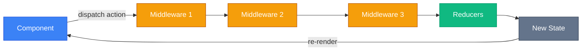

# Налаштування Store з configureStore

Redux Toolkit змінює підхід до створення store, автоматизуючи найкращі практики та усуваючи багато boilerplate коду. Давайте розберемося, як це працює і чому це важливо.

## Проблема класичного підходу

До появи Redux Toolkit налаштування store вимагало значних зусиль:

```javascript
// Класичний Redux - багато ручної роботи
import { createStore, applyMiddleware, compose } from 'redux'
import thunk from 'redux-thunk'
import rootReducer from './reducers'

const composeEnhancers = (typeof window !== 'undefined' && window.__REDUX_DEVTOOLS_EXTENSION_COMPOSE__) || compose

const store = createStore(rootReducer, composeEnhancers(applyMiddleware(thunk)))
```

### Що не так з цим кодом?

::card-group
::card{title="❌ Багато boilerplate" icon="i-lucide-code"}

- Імпорт декількох функцій
- Ручне налаштування DevTools
- Ручне підключення middleware

::

::card{title="❌ Відсутність захисту" icon="i-lucide-shield-alert"}

- Немає перевірок на мутацію state
- Немає перевірок на non-serializable дані
- Легко допустити помилку

::

::card{title="❌ Складність для новачків" icon="i-lucide-user-x"}

- Незрозуміло, що таке `compose` та `enhancers`
- Потрібно знати про DevTools extension API
- Бар'єр входу занадто високий

::
::

## Рішення: configureStore

Redux Toolkit надає функцію `configureStore`, яка інкапсулює всі найкращі практики:

```javascript
import { configureStore } from '@reduxjs/toolkit'

const store = configureStore({
    reducer: {
        // Ваші reducers
    },
})
```

Одна функція замінює весь boilerplate і додає captures потужні можливості автоматично.

---

## Встановлення

::steps

### Крок 1: Встановлення пакетів

Redux Toolkit вже включає в себе Redux core, тому окремо `redux` встановлювати не потрібно.

::code-group

```bash [npm]
npm install @reduxjs/toolkit react-redux
```

```bash [yarn]
yarn add @reduxjs/toolkit react-redux
```

```bash [pnpm]
pnpm add @reduxjs/toolkit react-redux
```

::

::note
**Примітка**: Пакет `react-redux` потрібен для зв'язки Redux store з React компонентами через hooks та Provider.
::

### Крок 2: Створення store файлу

Створіть файл `src/store.js` (або `src/app/store.js` для більших проєктів).

::

---

## Повний API configureStore

Функція `configureStore` приймає об'єкт конфігурації з наступними параметрами:

| Параметр         | Тип             | Обов'язковий | Опис                                               |
| ---------------- | --------------- | ------------ | -------------------------------------------------- |
| `reducer`        | Object/Function | ✅           | Root reducer або об'єкт з slice reducers           |
| `middleware`     | Function        | ❌           | Функція для налаштування middleware                |
| `devTools`       | Boolean/Object  | ❌           | Увімкнути DevTools (за замовчуванням `true` у dev) |
| `preloadedState` | Object          | ❌           | Початковий state (для SSR, hydration)              |
| `enhancers`      | Array/Function  | ❌           | Додаткові store enhancers                          |

::tip
**Порада**: У 90% випадків вам потрібен лише параметр `reducer`. Решта параметрів для advanced use cases.
::

---

## Базова конфігурація

### Простий приклад

```javascript [src/store.js]
import { configureStore } from '@reduxjs/toolkit'
import counterReducer from './features/counter/counterSlice'
import userReducer from './features/user/userSlice'

export const store = configureStore({
    reducer: {
        counter: counterReducer,
        user: userReducer,
    },
})
```

### Структура state

З такою конфігурацією ваш глобальний state матиме структуру:

```javascript
{
  counter: { /* state з counterSlice */ },
  user: { /* state з userSlice */ }
}
```

::note
Ключі в об'єкті `reducer` стають ключами в глобальному state. Вибирайте їх обдумано!
::

---

## Middleware Pipeline

### Що таке Middleware?

Middleware (проміжне програмне забезпечення) — це функції, які перехоплюють кожен dispatched action перед тим, як він досягне reducer.

::mermaid



::

### Middleware за замовчуванням

`configureStore` автоматично додає наступні middleware:

1. **Redux Thunk** — для асинхронних actions
2. **Immutability Check** (dev only) — виявляє мутації state
3. **Serializability Check** (dev only) — виявляє non-serializable значення

::warning
**Важливо**: Immutability та Serializability перевірки **автоматично вимикаються** в production (`NODE_ENV === 'production'`) для збереження performance.
::

### Додавання кастомного middleware

Використовуйте callback `getDefaultMiddleware()`:

```javascript [src/store.js]
import { configureStore } from '@reduxjs/toolkit'
import logger from 'redux-logger'
import counterReducer from './features/counter/counterSlice'

export const store = configureStore({
    reducer: {
        counter: counterReducer,
    },
    middleware: (getDefaultMiddleware) => getDefaultMiddleware().concat(logger),
})
```

### Налаштування вбудованих middleware

Можна налаштувати поведінку вбудованих middleware:

```javascript
middleware: (getDefaultMiddleware) =>
  getDefaultMiddleware({
    // Вимкнути immutability check для specific шляхів
    immutableCheck: {
      ignoredPaths: ['items.data'],
    },
    // Вимкнути serializability check для певних actions
    serializableCheck: {
      ignoredActions: ['your/action/type'],
      ignoredPaths: ['items.date'],
    },
    // Повністю вимкнути thunk (якщо не використовуєте)
    thunk: false,
  }),
```

::tip
**Use case**: Вимикайте перевірки для великих списків (10000+ items), щоб уникнути lag при розробці.
::

### Кастомний logger middleware

Приклад створення простого logger middleware:

```javascript
const loggerMiddleware = (store) => (next) => (action) => {
    console.group(action.type)
    console.log('Dispatching:', action)
    console.log('Previous State:', store.getState())

    const result = next(action)

    console.log('Next State:', store.getState())
    console.groupEnd()

    return result
}

export const store = configureStore({
    reducer: {
        counter: counterReducer,
    },
    middleware: (getDefaultMiddleware) => getDefaultMiddleware().concat(loggerMiddleware),
})
```

---

## DevTools інтеграція

### Автоматичне підключення

Redux DevTools працюють "з коробки" без налаштувань:

```javascript
// DevTools автоматично підключені!
export const store = configureStore({
    reducer: {
        counter: counterReducer,
    },
})
```

### Налаштування DevTools

Для advanced функцій передайте об'єкт конфігурації:

```javascript
export const store = configureStore({
    reducer: {
        counter: counterReducer,
    },
    devTools: {
        // Кількість actions в історії
        maxAge: 50,

        // Trace для actions (показує stack trace)
        trace: true,

        // Приховати певні екшени
        actionsBlacklist: ['SOME_NOISY_ACTION'],

        // Sanitize state (приховати чутливі дані)
        stateSanitizer: (state) => ({
            ...state,
            user: state.user ? { ...state.user, password: '***HIDDEN***' } : null,
        }),
    },
})
```

### Вимкнення DevTools у production

::tabs
::tabs-item{label="Автоматично (рекомендовано)"}

```javascript
// DevTools автоматично вимкнені в production
export const store = configureStore({
    reducer: {
        counter: counterReducer,
    },
    // devTools: true — за замовчуванням у dev, false у prod
})
```

::

::tabs-item{label="Вручну"}

```javascript
export const store = configureStore({
    reducer: {
        counter: counterReducer,
    },
    devTools: process.env.NODE_ENV !== 'production',
})
```

::
::

---

## Організація множинних Reducers

### Feature-based структура (рекомендовано)

```
src/
├── store.js
├── features/
│   ├── auth/
│   │   ├── authSlice.js
│   │   └── AuthForm.jsx
│   ├── todos/
│   │   ├── todosSlice.js
│   │   └── TodoList.jsx
│   └── posts/
│       ├── postsSlice.js
│       └── PostsList.jsx
```

```javascript [src/store.js]
import { configureStore } from '@reduxjs/toolkit'
import authReducer from './features/auth/authSlice'
import todosReducer from './features/todos/todosSlice'
import postsReducer from './features/posts/postsSlice'

export const store = configureStore({
    reducer: {
        auth: authReducer,
        todos: todosReducer,
        posts: postsReducer,
    },
})
```

::tip
**Переваги**: Кожна feature є самодостатнім модулем. Легко видалити, перенести або протестувати окремо.
::

### Code Splitting для Reducers

Для великих застосунків можна lazy load slices:

```javascript [src/store.js]
import { configureStore } from '@reduxjs/toolkit'
import authReducer from './features/auth/authSlice'

export const store = configureStore({
    reducer: {
        auth: authReducer,
        // Інші reducers додадуться динамічно
    },
})

// Функція для додавання reducers динамічно
export function injectReducer(key, reducer) {
    store.replaceReducer({
        ...store.getState(),
        [key]: reducer,
    })
}
```

Використання:

```javascript
// У компоненті, який lazy loads
import { lazy, Suspense } from 'react'
import { injectReducer } from './store'

const AdminPanel = lazy(async () => {
    const module = await import('./features/admin/adminSlice')
    injectReducer('admin', module.default)
    return import('./features/admin/AdminPanel')
})
```

---

## Preloaded State (SSR та Hydration)

Для Server-Side Rendering передайте початковий state:

```javascript [server.js]
import { configureStore } from '@reduxjs/toolkit'
import rootReducer from './rootReducer'

// На сервері отримуємо дані
const preloadedState = {
    user: await fetchUser(),
    posts: await fetchPost(),
}

const store = configureStore({
    reducer: rootReducer,
    preloadedState, // Ін'єкція даних з сервера
})

// Серіалізуємо для клієнта
const html = `
  <script>
    window.__PRELOADED_STATE__ = ${JSON.stringify(preloadedState)}
  </script>
`
```

На клієнті:

```javascript [client.js]
const preloadedState = window.__PRELOADED_STATE__
delete window.__PRELOADED_STATE__

const store = configureStore({
    reducer: rootReducer,
    preloadedState,
})
```

---

## TypeScript Інтеграція

### Типізація RootState та Dispatch

```typescript [src/store.ts]
import { configureStore } from '@reduxjs/toolkit'
import counterReducer from './features/counter/counterSlice'

export const store = configureStore({
    reducer: {
        counter: counterReducer,
    },
})

// Експортуємо типи для використання в додатку
export type RootState = ReturnType<typeof store.getState>
export type AppDispatch = typeof store.dispatch
```

### Typed Hooks

Створіть типізовані версії хуків:

```typescript [src/hooks/redux.ts]
import { TypedUseSelectorHook, useDispatch, useSelector } from 'react-redux'
import type { RootState, AppDispatch } from '../store'

// Використовуйте ці хуки замість звичайних useDispatch та useSelector
export const useAppDispatch = () => useDispatch<AppDispatch>()
export const useAppSelector: TypedUseSelectorHook<RootState> = useSelector
```

Використання в компонентах:

```typescript
import { useAppSelector, useAppDispatch } from '../hooks/redux'

function Counter() {
    // Автоматичний type inference!
    const count = useAppSelector((state) => state.counter.value)
    const dispatch = useAppDispatch()

    // ...
}
```

::tip
**Best Practice**: Завжди використовуйте типізовані хуки для автокомпліту та type safety.
::

---

## Production Оптимізації

### Вимкнення Development перевірок

У production build RTK автоматично вимикає:

- Immutability check middleware
- Serializability check middleware
- Redux DevTools

Це відбувається через `process.env.NODE_ENV`:

```javascript
// Webpack/Vite автоматично замінять process.env.NODE_ENV на 'production'
// і dead code elimination видалить development код
```

### Ручне налаштування для production

```javascript
export const store = configureStore({
    reducer: {
        counter: counterReducer,
    },
    middleware: (getDefaultMiddleware) =>
        getDefaultMiddleware({
            // У production вимикаємо перевірки
            immutableCheck: process.env.NODE_ENV !== 'production',
            serializableCheck: process.env.NODE_ENV !== 'production',
        }),
    devTools: process.env.NODE_ENV !== 'production',
})
```

::warning
**Увага**: Не вимикайте перевірки у development! Вони допомагають виявити проблеми на ранніх етапах.
::

---

## Підключення до React

Оберніть додаток у `<Provider>`:

```jsx [src/index.jsx]
import React from 'react'
import ReactDOM from 'react-dom/client'
import { Provider } from 'react-redux'
import { store } from './store'
import App from './App'

const root = ReactDOM.createRoot(document.getElementById('root'))

root.render(
    <React.StrictMode>
        <Provider store={store}>
            <App />
        </Provider>
    </React.StrictMode>,
)
```

::note
`<Provider>` робить store доступним для всіх вкладених компонентів через React Context.
::

---

## Порівняння: createStore vs configureStore

| Аспект                     | createStore (класичний)   | configureStore (RTK) |
| -------------------------- | ------------------------- | -------------------- |
| **Boilerplate**            | Високий (10-15 рядків)    | Низький (3-5 рядків) |
| **DevTools**               | Ручне налаштування        | Автоматично          |
| **Thunk middleware**       | Ручне додавання           | Included             |
| **Immutability check**     | Немає                     | Автоматично (dev)    |
| **Serializability check**  | Немає                     | Автоматично (dev)    |
| **TypeScript support**     | Потребує додаткового коду | Відмінний з коробки  |
| **Production оптимізації** | Ручні                     | Автоматичні          |
| **Рекомендація**           | ❌ Застарів               | ✅ Стандарт          |

---

## Troubleshooting

::accordion
::accordion-item{label="Помилка: Actions must be plain objects" icon="i-lucide-alert-circle"}

**Проблема**: Ви намагаєтеся dispatch асинхронну функцію, але thunk middleware не підключено.

```javascript
// ❌ Помилка
dispatch(async () => {
    const data = await fetch('/api')
})
```

**Рішення**: `configureStore` автоматично включає thunk. Перевірте, чи ви не вимкнули його:

```javascript
middleware: (getDefaultMiddleware) =>
  getDefaultMiddleware({
    thunk: true, // Має бути true (за замовчуванням)
  }),
```

::

::accordion-item{label="Immutability Error в консолі" icon="i-lucide-alert-triangle"}

**Проблема**: Ви мутуєте state поза createSlice:

```javascript
// ❌ Мутація в componentі
const handleClick = () => {
    state.counter.value++ // ЗАБОРОНЕНО!
}
```

**Рішення**: Завжди dispatch actions:

```javascript
// ✅ Правильно
const handleClick = () => {
    dispatch(increment())
}
```

::

::accordion-item{label="Serializability Error: Date, Promise, Function" icon="i-lucide-ban"}

**Проблема**: Ви поклали в state non-serializable значення:

```javascript
// ❌ Проблемний код
const initialState = {
    lastUpdated: new Date(), // Date object
    fetchPromise: fetch('/api'), // Promise
    callback: () => {}, // Function
}
```

**Рішення**: Використовуйте тільки plain objects, arrays, primitives:

```javascript
// ✅ Правильно
const initialState = {
    lastUpdated: new Date().toISOString(), // String
    isFetching: false, // Boolean
}
```

Або ігноруйте певні шляхи (якщо це дійсно потрібно):

```javascript
middleware: (getDefaultMiddleware) =>
  getDefaultMiddleware({
    serializableCheck: {
      ignoredPaths: ['form.dateField'],
    },
  }),
```

::

::accordion-item{label="DevTools не відображаються" icon="i-lucide-bug"}

**Причини**:

1. Розширення не встановлено ([Install Redux DevTools](https://github.com/reduxjs/redux-devtools))
2. Ви вручну вимкнули: `devTools: false`
3. Production build (автоматично вимкнено)

**Рішення**: Встановіть розширення та перевірте конфігурацію.
::
::

---

## Висновок

`configureStore` — це потужна абстракція, яка:

✅ Усуває boilerplate код  
✅ Автоматично налаштовує best practices  
✅ Захищає від типових помилок  
✅ Оптимізує performance у production  
✅ Ідеально працює з TypeScript

::tip
**Золоте правило**: Ніколи не використовуйте `createStore` у нових проєктах. `configureStore` — єдиний правильний вибір.
::

---

## Наступні кроки

Тепер, коли store налаштовано, давайте створимо логіку (reducers та actions) за допомогою найпотужнішого інструменту RTK.

👉 [Далі: createSlice та магія Immer](./02.create-slice.md)
