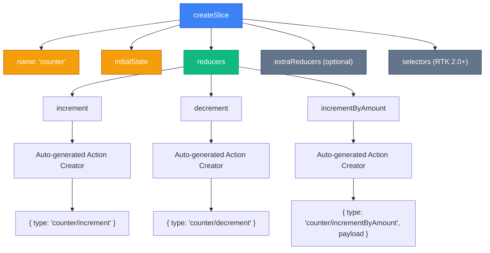
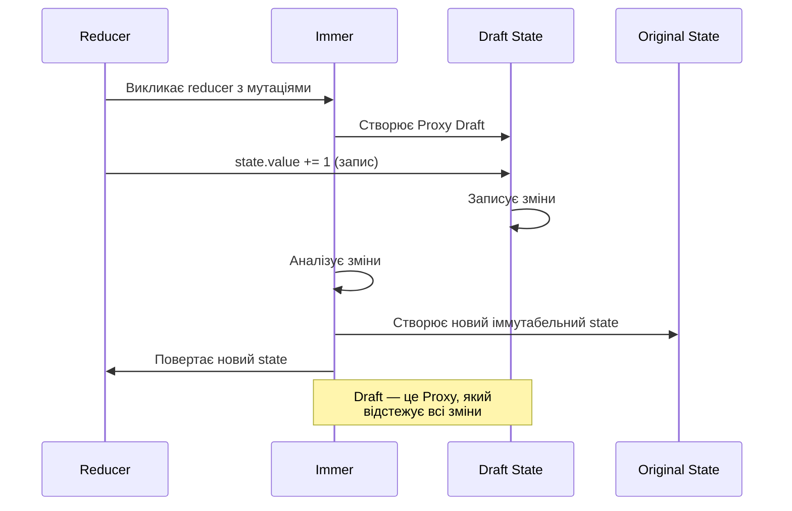

# createSlice: Революція в Redux

Пам'ятаєте, як ми створювали окремі файли для constants, actions та reducers? Цей час минув. `createSlice` — це функція, яка об'єднує всю логіку feature в одному місці і робить це елегантно.

## Проблема класичного Redux

Давайте згадаємо, скільки коду потрібно було писати раніше:

::tabs
::tabs-item{label="Constants"}

```javascript [constants/actionTypes.js]
export const INCREMENT = 'counter/INCREMENT'
export const DECREMENT = 'counter/DECREMENT'
export const INCREMENT_BY_AMOUNT = 'counter/INCREMENT_BY_AMOUNT'
```

::

::tabs-item{label="Actions"}

```javascript [actions/counterActions.js]
import { INCREMENT, DECREMENT, INCREMENT_BY_AMOUNT } from '../constants/actionTypes'

export const increment = () => ({ type: INCREMENT })
export const decrement = () => ({ type: DECREMENT })
export const incrementByAmount = (amount) => ({
    type: INCREMENT_BY_AMOUNT,
    payload: amount,
})
```

::

::tabs-item{label="Reducer"}

```javascript [reducers/counterReducer.js]
import { INCREMENT, DECREMENT, INCREMENT_BY_AMOUNT } from '../constants/actionTypes'

const initialState = { value: 0 }

export default function counterReducer(state = initialState, action) {
    switch (action.type) {
        case INCREMENT:
            return { ...state, value: state.value + 1 }
        case DECREMENT:
            return { ...state, value: state.value - 1 }
        case INCREMENT_BY_AMOUNT:
            return { ...state, value: state.value + action.payload }
        default:
            return state
    }
}
```

::
::

**Проблеми**: 3 файли, багато boilerplate, ручне управління іммутабельністю (`{ ...state }`), легко зробити помилку.

## Рішення: createSlice

Той самий функціонал в одному файлі:

```javascript [features/counter/counterSlice.js]
import { createSlice } from '@reduxjs/toolkit'

const counterSlice = createSlice({
    name: 'counter',
    initialState: { value: 0 },
    reducers: {
        increment: (state) => {
            state.value += 1 // Мутація! Але це безпечно завдяки Immer
        },
        decrement: (state) => {
            state.value -= 1
        },
        incrementByAmount: (state, action) => {
            state.value += action.payload
        },
    },
})

export const { increment, decrement, incrementByAmount } = counterSlice.actions
export default counterSlice.reducer
```

**Переваги**: 1 файл, мутабельний синтаксис (простіше читати), автоматична генерація actions.

---

## Анатомія Slice

::mermaid



::

---

## Повний API createSlice

### Параметри конфігурації

| Параметр        | Тип             | Обов'язковий | Опис                                                           |
| --------------- | --------------- | ------------ | -------------------------------------------------------------- |
| `name`          | String          | ✅           | Префікс для action types (`'counter'` → `'counter/increment'`) |
| `initialState`  | Any             | ✅           | Початковий стан slice                                          |
| `reducers`      | Object          | ❌           | Об'єкт із синхронними reducer функціями                        |
| `extraReducers` | Function/Object | ❌           | Обробка actions з інших slices або thunks                      |
| `selectors`     | Object          | ❌           | (RTK 2.0+) Автоматична генерація селекторів                    |

::tip
**Порада**: `name` має бути унікальним в додатку. Використовуйте назву feature (наприклад, `'auth'`, `'todos'`, `'posts'`).
::

### Що генерується автоматично?

Після виклику `createSlice` ви отримуєте:

```javascript
const slice = createSlice({
    /* config */
})

// Доступні поля:
slice.name // 'counter'
slice.reducer // Функція-reducer для store
slice.actions // { increment, decrement, ... }
slice.caseReducers // Внутрішні reducers (для advanced use cases)
slice.getSelectors // (RTK 2.0+) Фабрика селекторів
```

---

## Reducers: Patterns та Приклади

### 1. Простий reducer без payload

```javascript
reducers: {
  reset: (state) => {
    state.value = 0; // Просто встановлюємо значення
  },

  toggleDarkMode: (state) => {
    state.isDarkMode = !state.isDarkMode; // Інверсія boolean
  },
}
```

Використання:

```javascript
dispatch(reset()) // { type: 'counter/reset' }
dispatch(toggleDarkMode()) // { type: 'settings/toggleDarkMode' }
```

### 2. Reducer з payload

```javascript
reducers: {
  setUser: (state, action) => {
    state.user = action.payload; // payload — це передане значення
  },

  addTodo: (state, action) => {
    state.todos.push(action.payload); // Immer дозволяє push
  },
}
```

Використання:

```javascript
dispatch(setUser({ id: 1, name: 'John' }))
// action: { type: 'auth/setUser', payload: { id: 1, name: 'John' } }

dispatch(addTodo({ id: Date.now(), text: 'Learn Redux' }))
// action: { type: 'todos/addTodo', payload: { ... } }
```

### 3. Payload Prepare (кастомізація action)

Іноді потрібно обробити аргументи перед створенням action:

```javascript
reducers: {
  addTodo: {
    reducer: (state, action) => {
      state.todos.push(action.payload);
    },
    prepare: (text) => {
      // Викликається при dispatch(addTodo('text'))
      return {
        payload: {
          id: Date.now(),
          text,
          completed: false,
          createdAt: new Date().toISOString(),
        },
      };
    },
  },
}
```

Використання:

```javascript
dispatch(addTodo('Learn Redux'))
// action: {
//   type: 'todos/addTodo',
//   payload: { id: 1675000000, text: 'Learn Redux', completed: false, ... }
// }
```

::tip
**Use case**: Генерація ID, timestamps, валідація даних перед dispatch.
::

### 4. Робота з масивами

```javascript
const todosSlice = createSlice({
    name: 'todos',
    initialState: { items: [] },
    reducers: {
        // Додавання
        addTodo: (state, action) => {
            state.items.push(action.payload) // Immer дозволяє push
        },

        // Видалення за ID
        removeTodo: (state, action) => {
            state.items = state.items.filter((todo) => todo.id !== action.payload)
        },

        // Оновлення елемента
        toggleTodo: (state, action) => {
            const todo = state.items.find((t) => t.id === action.payload)
            if (todo) {
                todo.completed = !todo.completed // Пряма мутація елемента
            }
        },

        // Заміна всього масиву
        setTodos: (state, action) => {
            state.items = action.payload
        },

        // Сортування
        sortTodos: (state) => {
            state.items.sort((a, b) => a.text.localeCompare(b.text))
        },
    },
})
```

### 5. Вкладені об'єкти (Nested state)

```javascript
const userSlice = createSlice({
    name: 'user',
    initialState: {
        profile: {
            name: '',
            email: '',
            settings: {
                notifications: true,
                theme: 'light',
            },
        },
        isLoading: false,
    },
    reducers: {
        updateProfile: (state, action) => {
            // Immer дозволяє глибоку мутацію
            state.profile.name = action.payload.name
            state.profile.email = action.payload.email
        },

        toggleNotifications: (state) => {
            state.profile.settings.notifications = !state.profile.settings.notifications
        },

        setTheme: (state, action) => {
            state.profile.settings.theme = action.payload
        },
    },
})
```

### 6. Conditional logic в reducer

```javascript
reducers: {
  incrementIfOdd: (state) => {
    if (state.value % 2 !== 0) {
      state.value += 1;
    }
  },

  incrementWithLimit: (state) => {
    if (state.value < 100) {
      state.value += 1;
    }
  },

  addItem: (state, action) => {
    // Перевірка на дублікати
    const exists = state.items.some(item => item.id === action.payload.id);
    if (!exists) {
      state.items.push(action.payload);
    }
  },
}
```

### 7. Множинні оновлення за один action

```javascript
reducers: {
  login: (state, action) => {
    state.user = action.payload.user;
    state.token = action.payload.token;
    state.isAuthenticated = true;
    state.error = null;
  },

  logout: (state) => {
    state.user = null;
    state.token = null;
    state.isAuthenticated = false;
  },
}
```

### 8. Повернення нового стану (альтернатива мутації)

```javascript
reducers: {
  // Мутація (рекомендовано)
  increment: (state) => {
    state.value += 1;
  },

  // Повернення нового об'єкта (класичний Redux стиль)
  reset: () => {
    return { value: 0 }; // Повний reset
  },

  // ❌ НЕ РОБІТЬ ТАК (мутація + return)
  wrongWay: (state) => {
    state.value += 1;
    return state; // ПОМИЛКА!
  },
}
```

::warning
**Правило Immer**: Або мутуйте state, або поверніть новий state. **Ніколи разом**!
::

---

## Immer: Як це працює?

### Концепція Draft State

::mermaid



::

### Що робить Immer під капотом?

1. **Створює Proxy** навколо вашого state
2. **Записує всі зміни** які ви робите
3. **Генерує новий state** з вашими змінами
4. **Зберігає структурний sharing** (незмінені частини залишаються тими самими об'єктами)

```javascript
// Що ви пишете:
state.user.profile.name = 'John'

// Що Immer робить під капотом (концептуально):
return {
    ...state,
    user: {
        ...state.user,
        profile: {
            ...state.user.profile,
            name: 'John',
        },
    },
}
```

### Переваги Immer

::card-group
::card{title="🎯 Простіший код" icon="i-lucide-code"}
Мутабельний синтаксис набагато легше читати і писати
::

::card{title="🛡️ Іммутабельність" icon="i-lucide-shield"}
Під капотом все залишається іммутабельним
::

::card{title="⚡ Performance" icon="i-lucide-zap"}
Structural sharing оптимізує пам'ять
::

::card{title="🐛 Менше помилок" icon="i-lucide-bug-off"}
Не треба думати про spread operators
::
::

### Обмеження Immer

::warning
**Що НЕ можна робити:**

1. **Присвоювання state =** чогось

    ```javascript
    // ❌ Не працює
    reducers: {
      bad: (state) => {
        state = { newState }; // Не змінить state!
      },
    }

    // ✅ Правильно
    reducers: {
      good: (state) => {
        Object.assign(state, { newState }); // Або
        return { newState }; // Поверніть новий
      },
    }
    ```

2. **Асинхронний код** всередині reducers

    ```javascript
    // ❌ Заборонено
    reducers: {
      bad: async (state) => {
        const data = await fetch('/api'); // NO!
      },
    }
    ```

3. **Side effects** (console.log, dispatch, тощо)
    ```javascript
    // ❌ Погано
    reducers: {
      bad: (state) => {
        console.log('Updating...'); // Технічно працює, але анти-паттерн
        state.value += 1;
      },
    }
    ```

::

---

## extraReducers: Обробка зовнішніх actions

`extraReducers` використовується для:

- Обробки actions з інших slices
- Обробки async thunks (`createAsyncThunk`)
- Обробки actions, які не створені в цьому slice

### Builder Callback Pattern (рекомендовано)

```javascript
import { createSlice } from '@reduxjs/toolkit'
import { fetchUserById } from './userThunks'
import { logout } from './authSlice'

const userSlice = createSlice({
    name: 'user',
    initialState: {
        data: null,
        loading: 'idle',
        error: null,
    },
    reducers: {
        setUser: (state, action) => {
            state.data = action.payload
        },
    },
    extraReducers: (builder) => {
        builder
            // Обробка async thunk
            .addCase(fetchUserById.pending, (state) => {
                state.loading = 'pending'
                state.error = null
            })
            .addCase(fetchUserById.fulfilled, (state, action) => {
                state.loading = 'succeeded'
                state.data = action.payload
            })
            .addCase(fetchUserById.rejected, (state, action) => {
                state.loading = 'failed'
                state.error = action.error.message
            })
            // Обробка action з іншого slice
            .addCase(logout, (state) => {
                state.data = null
                state.loading = 'idle'
            })
    },
})
```

### Map Object Pattern (застарілий, але працює)

```javascript
extraReducers: {
  [fetchUserById.pending]: (state) => {
    state.loading = 'pending';
  },
  [fetchUserById.fulfilled]: (state, action) => {
    state.data = action.payload;
  },
  [logout.type]: (state) => {
    state.data = null;
  },
}
```

::tip
**Рекомендація**: Завжди використовуйте builder pattern. Він має кращу TypeScript підтримку та autocomplete.
::

### Matcher для групової обробки

```javascript
extraReducers: (builder) => {
    builder
        // Обробити всі pending actions
        .addMatcher(
            (action) => action.type.endsWith('/pending'),
            (state) => {
                state.loading = true
            },
        )
        // Обробити всі fulfilled
        .addMatcher(
            (action) => action.type.endsWith('/fulfilled'),
            (state) => {
                state.loading = false
            },
        )
        // Default case (на кінці)
        .addDefaultCase((state, action) => {
            // Логування невідомих actions для debugging
        })
}
```

---

## Auto-generated Actions

### Структура згенерованого action

```javascript
const slice = createSlice({
    name: 'counter',
    initialState: { value: 0 },
    reducers: {
        increment: (state) => {
            state.value += 1
        },
        incrementByAmount: (state, action) => {
            state.value += action.payload
        },
    },
})

// Згенеровані action creators:
slice.actions.increment()
// → { type: 'counter/increment' }

slice.actions.incrementByAmount(5)
// → { type: 'counter/incrementByAmount', payload: 5 }

// Action type strings доступні:
slice.actions.increment.type // 'counter/increment'
```

### Action Creator з prepare

Для складнішої логіки:

```javascript
reducers: {
  createPost: {
    reducer: (state, action) => {
      state.posts.push(action.payload);
    },
    prepare: (title, content, userId) => {
      return {
        payload: {
          id: nanoid(), // Генерація ID
          title,
          content,
          userId,
          createdAt: new Date().toISOString(),
          reactions: { thumbsUp: 0, hooray: 0 },
        },
      };
    },
  },
}

// Використання:
dispatch(createPost('My Title', 'Content here', currentUserId));
```

::note
`prepare` викликається **до** відправки action в store. Це ідеальне місце для логіки генерації ID, timestamps, або валідації.
::

---

## Selectors в Slice (RTK 2.0+)

Нова фіча RTK 2.0 дозволяє визначати селектори прямо в slice:

```javascript
const todosSlice = createSlice({
    name: 'todos',
    initialState: { items: [], filter: 'all' },
    reducers: {
        /* ... */
    },
    selectors: {
        selectAllTodos: (state) => state.items,
        selectFilter: (state) => state.filter,
        selectCompletedTodos: (state) => state.items.filter((todo) => todo.completed),
    },
})

// Експорт селекторів
export const { selectAllTodos, selectFilter, selectCompletedTodos } = todosSlice.selectors
```

Використання в компоненті:

```javascript
import { useSelector } from 'react-redux'
import { selectAllTodos } from './todosSlice'

function TodoList() {
    const todos = useSelector((state) => selectAllTodos(state.todos))
    // ...
}
```

::tip
Селектори в slice автоматично приймають slice state (не root state), що робить їх reusable!
::

---

## Patterns & Best Practices

### 1. Naming Conventions

```javascript
// ✅ Добра назва slice
createSlice({ name: 'todos' })    // Множина для колекцій
createSlice({ name: 'auth' })     // Іменник для одиниці
createSlice({ name: 'ui' })       // Коротко та ясно

// ✅ Добрі назви reducers
reducers: {
  addTodo,          // Дієслово + іменник
  removeTodo,
  toggleCompleted,  // Дієслово + прикметник
  setFilter,        // set + назва поля
  reset,            // Коротке дієслово
}

// ❌ Погані назви
reducers: {
  todo,             // Незрозуміло, що робить
  update,           // Надто загально
  handleSubmit,     // "handle" — це UI logic
}
```

### 2. State Shape Design

```javascript
// ✅ Добра структура
const initialState = {
    items: [], // Дані
    loading: 'idle', // UI state
    error: null, // Помилки
    filters: {
        // Логічне групування
        status: 'all',
        category: null,
    },
    pagination: {
        page: 1,
        pageSize: 20,
    },
}

// ❌ Погана структура
const initialState = {
    todos: [],
    isTodosLoading: false, // Префікси не потрібні (це вже todos slice)
    todosError: null,
    allStatus: 'all', // Незрозуміле ім'я
}
```

### 3. One Slice Per Feature

```text
features/
├── todos/
│   ├── todosSlice.js       ← Вся логіка тут
│   ├── TodoList.jsx
│   └── TodoItem.jsx
├── auth/
│   ├── authSlice.js
│   └── LoginForm.jsx
```

Кожен slice незалежний і self-contained.

### 4. Composing Slices

Не дублюйте логіку між slices:

```javascript
// ✅ Shared reducer logic
function createLoadingSlice(name, fetchFn) {
    return createSlice({
        name,
        initialState: { data: null, loading: 'idle', error: null },
        reducers: {},
        extraReducers: (builder) => {
            builder
                .addCase(fetchFn.pending, (state) => {
                    state.loading = 'pending'
                })
                .addCase(fetchFn.fulfilled, (state, action) => {
                    state.loading = 'succeeded'
                    state.data = action.payload
                })
                .addCase(fetchFn.rejected, (state, action) => {
                    state.loading = 'failed'
                    state.error = action.error.message
                })
        },
    })
}

// Використання
const usersSlice = createLoadingSlice('users', fetchUsers)
const postsSlice = createLoadingSlice('posts', fetchPosts)
```

---

## Anti-patterns

::warning

### 1. Занадто великий slice

```javascript
// ❌ Один slice для всього
const appSlice = createSlice({
    name: 'app',
    initialState: {
        user: {},
        todos: [],
        posts: [],
        comments: [],
        // ... ще 10 features
    },
    reducers: {
        // 50+ reducers тут
    },
})
```

**Рішення**: Розбийте на окремі slices (userSlice, todosSlice, postsSlice).

### 2. Логіка в компонентах

```javascript
// ❌ Розрахунки в компоненті
function CartTotal() {
    const items = useSelector((state) => state.cart.items)
    const total = items.reduce((sum, item) => sum + item.price * item.quantity, 0)
    // ...
}
```

**Рішення**: Винесіть в селектор або додайте в state:

```javascript
// ✅ Селектор
const selectCartTotal = createSelector(
  state => state.cart.items,
  items => items.reduce((sum, item) => sum + item.price * item.quantity, 0)
);

// Або ✅ Computed state
reducers: {
  addItem: (state, action) => {
    state.items.push(action.payload);
    state.total = state.items.reduce(...); // Оновлюємо total
  },
}
```

### 3. Мутація поза Immer

```javascript
// ❌ У компоненті
const handleClick = () => {
    const state = store.getState()
    state.counter.value++ // НІКОЛИ ТАК НЕ РОБІТЬ!
}

// ✅ Правильно
const handleClick = () => {
    dispatch(increment())
}
```

::

---

## Real-World Examples

::accordion

::accordion-item{label="1. Auth Slice (складний state)" icon="i-lucide-lock"}

```javascript [features/auth/authSlice.js]
import { createSlice } from '@reduxjs/toolkit'

const authSlice = createSlice({
    name: 'auth',
    initialState: {
        user: null,
        token: null,
        refreshToken: null,
        isAuthenticated: false,
        loading: 'idle',
        error: null,
    },
    reducers: {
        setCredentials: (state, action) => {
            const { user, token, refreshToken } = action.payload
            state.user = user
            state.token = token
            state.refreshToken = refreshToken
            state.isAuthenticated = true
        },

        logout: (state) => {
            state.user = null
            state.token = null
            state.refreshToken = null
            state.isAuthenticated = false
        },

        updateUser: (state, action) => {
            if (state.user) {
                Object.assign(state.user, action.payload)
            }
        },
    },
})

export const { setCredentials, logout, updateUser } = authSlice.actions
export default authSlice.reducer
```

::

::accordion-item{label="2. Shopping Cart Slice (array operations)" icon="i-lucide-shopping-cart"}

```javascript [features/cart/cartSlice.js]
import { createSlice } from '@reduxjs/toolkit'

const cartSlice = createSlice({
    name: 'cart',
    initialState: {
        items: [],
        total: 0,
    },
    reducers: {
        addItem: (state, action) => {
            const existingItem = state.items.find((item) => item.id === action.payload.id)

            if (existingItem) {
                existingItem.quantity += 1
            } else {
                state.items.push({ ...action.payload, quantity: 1 })
            }

            state.total = state.items.reduce((sum, item) => sum + item.price * item.quantity, 0)
        },

        removeItem: (state, action) => {
            state.items = state.items.filter((item) => item.id !== action.payload)
            state.total = state.items.reduce((sum, item) => sum + item.price * item.quantity, 0)
        },

        updateQuantity: (state, action) => {
            const { id, quantity } = action.payload
            const item = state.items.find((item) => item.id === id)
            if (item) {
                item.quantity = quantity
                state.total = state.items.reduce((sum, item) => sum + item.price * item.quantity, 0)
            }
        },

        clearCart: (state) => {
            state.items = []
            state.total = 0
        },
    },
})

export const { addItem, removeItem, updateQuantity, clearCart } = cartSlice.actions
export default cartSlice.reducer
```

::

::accordion-item{label="3. Filters Slice (множинні фільтри)" icon="i-lucide-filter"}

```javascript [features/filters/filtersSlice.js]
import { createSlice } from '@reduxjs/toolkit'

const filtersSlice = createSlice({
    name: 'filters',
    initialState: {
        status: 'all', // 'all' | 'active' | 'completed'
        search: '',
        sortBy: 'createdAt', // 'createdAt' | 'name' | 'priority'
        sortOrder: 'desc', // 'asc' | 'desc'
        category: null,
    },
    reducers: {
        setStatus: (state, action) => {
            state.status = action.payload
        },

        setSearch: (state, action) => {
            state.search = action.payload
        },

        setSorting: (state, action) => {
            const { sortBy, sortOrder } = action.payload
            state.sortBy = sortBy
            state.sortOrder = sortOrder
        },

        setCategory: (state, action) => {
            state.category = action.payload
        },

        resetFilters: () => {
            // Повертаємо initial state
            return {
                status: 'all',
                search: '',
                sortBy: 'createdAt',
                sortOrder: 'desc',
                category: null,
            }
        },
    },
})

export const { setStatus, setSearch, setSorting, setCategory, resetFilters } = filtersSlice.actions
export default filtersSlice.reducer
```

::

::accordion-item{label="4. Pagination Slice" icon="i-lucide-list"}

```javascript [features/pagination/paginationSlice.js]
import { createSlice } from '@reduxjs/toolkit'

const paginationSlice = createSlice({
    name: 'pagination',
    initialState: {
        currentPage: 1,
        pageSize: 20,
        totalPages: 0,
        totalItems: 0,
    },
    reducers: {
        setPage: (state, action) => {
            state.currentPage = action.payload
        },

        nextPage: (state) => {
            if (state.currentPage < state.totalPages) {
                state.currentPage += 1
            }
        },

        previousPage: (state) => {
            if (state.currentPage > 1) {
                state.currentPage -= 1
            }
        },

        setPageSize: (state, action) => {
            state.pageSize = action.payload
            state.currentPage = 1 // Reset to first page
        },

        setTotalItems: (state, action) => {
            state.totalItems = action.payload
            state.totalPages = Math.ceil(action.payload / state.pageSize)
        },
    },
})

export const { setPage, nextPage, previousPage, setPageSize, setTotalItems } = paginationSlice.actions
export default paginationSlice.reducer
```

::

::

---

## Migration Guide: Класичний Redux → createSlice

::tabs
::tabs-item{label="До (Класичний)"}

```javascript
// constants/actionTypes.js
export const ADD_TODO = 'todos/ADD_TODO'
export const TOGGLE_TODO = 'todos/TOGGLE_TODO'

// actions/todoActions.js
export const addTodo = (text) => ({
    type: ADD_TODO,
    payload: { id: Date.now(), text, completed: false },
})

export const toggleTodo = (id) => ({
    type: TOGGLE_TODO,
    payload: id,
})

// reducers/todoReducer.js
const initialState = { items: [] }

export default function todosReducer(state = initialState, action) {
    switch (action.type) {
        case ADD_TODO:
            return {
                ...state,
                items: [...state.items, action.payload],
            }
        case TOGGLE_TODO:
            return {
                ...state,
                items: state.items.map((todo) =>
                    todo.id === action.payload ? { ...todo, completed: !todo.completed } : todo,
                ),
            }
        default:
            return state
    }
}
```

::

::tabs-item{label="Після (createSlice)"}

```javascript
// features/todos/todosSlice.js
import { createSlice } from '@reduxjs/toolkit'

const todosSlice = createSlice({
    name: 'todos',
    initialState: { items: [] },
    reducers: {
        addTodo: {
            reducer: (state, action) => {
                state.items.push(action.payload)
            },
            prepare: (text) => ({
                payload: {
                    id: Date.now(),
                    text,
                    completed: false,
                },
            }),
        },

        toggleTodo: (state, action) => {
            const todo = state.items.find((t) => t.id === action.payload)
            if (todo) {
                todo.completed = !todo.completed
            }
        },
    },
})

export const { addTodo, toggleTodo } = todosSlice.actions
export default todosSlice.reducer
```

::
::

**Результат**: 3 файли → 1 файл, ~40 рядків → ~25 рядків, набагато читабельніше!

---

## TypeScript Інтеграція

### Базова типізація

```typescript [features/counter/counterSlice.ts]
import { createSlice, PayloadAction } from '@reduxjs/toolkit'

interface CounterState {
    value: number
    step: number
}

const initialState: CounterState = {
    value: 0,
    step: 1,
}

const counterSlice = createSlice({
    name: 'counter',
    initialState,
    reducers: {
        increment: (state) => {
            state.value += state.step
        },

        decrement: (state) => {
            state.value -= state.step
        },

        incrementByAmount: (state, action: PayloadAction<number>) => {
            state.value += action.payload
        },

        setStep: (state, action: PayloadAction<number>) => {
            state.step = action.payload
        },
    },
})

export const { increment, decrement, incrementByAmount, setStep } = counterSlice.actions
export default counterSlice.reducer
```

### Типізація з prepare

```typescript
reducers: {
  addTodo: {
    reducer: (state, action: PayloadAction<Todo>) => {
      state.items.push(action.payload);
    },
    prepare: (text: string) => {
      return {
        payload: {
          id: nanoid(),
          text,
          completed: false,
        } as Todo,
      };
    },
  },
}
```

### Generic Slice

```typescript
interface Entity {
    id: string | number
}

function createGenericSlice<T extends Entity>(name: string) {
    return createSlice({
        name,
        initialState: [] as T[],
        reducers: {
            add: (state, action: PayloadAction<T>) => {
                state.push(action.payload)
            },
            remove: (state, action: PayloadAction<string | number>) => {
                return state.filter((item) => item.id !== action.payload)
            },
        },
    })
}

// Використання
interface Todo extends Entity {
    text: string
    completed: boolean
}

const todosSlice = createGenericSlice<Todo>('todos')
```

---

## Висновок

`createSlice` — це найпотужніший інструмент Redux Toolkit, який:

✅ Усуває необхідність в константах та action creators  
✅ Дозволяє писати мутабельний код безпечно (Immer)  
✅ Автоматично генерує все необхідне  
✅ Ідеально працює з TypeScript  
✅ Спрощує організацію коду

::tip
**Золоте правило**: Один slice = одна логічна feature вашого додатку. Не створюйте гігантські slices і не розбивайте на занадто маленькі.
::

---

## Наступні кроки

Тепер ми вміємо створювати синхронну логіку. А як щодо асинхронних операцій (API запити, таймери)?

👉 [Далі: Асинхронність з createAsyncThunk](./03.async-thunks.md)
