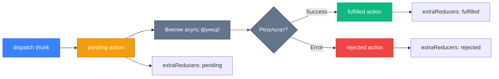
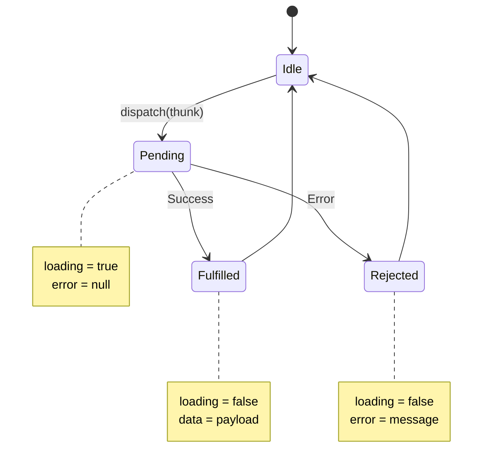

# Асинхронність з createAsyncThunk

Тепер, коли ми вміємо працювати з синхронною логікою через `createSlice`, час навчитися працювати з асинхронними операціями — API запитами, таймерами, завантаженням файлів. Redux Toolkit надає `createAsyncThunk` для цього.

## Проблема: Асинхронність у Redux

Reducers мають бути **pure functions** — вони не можуть містити:

- API запити (fetch, axios)
- Асинхронний код (async/await, Promise)
- Side effects (console.log, timers)

```javascript
// ❌ ЦЕ НЕ ПРАЦЮЄ
reducers: {
  fetchUser: async (state) => {
    const data = await fetch('/api/user'); // async в reducer - ПОМИЛКА!
    state.user = data;
  },
}
```

**Рішення**: Асинхронну логу треба винести **ЗА МЕЖІ** reducers. У класичному Redux це робили через thunks вручну.

---

## Thunk Pattern: Концепція

**Thunk** — це функція, яка повертає іншу функцію (яка має доступ до `dispatch` та `getState`).

```javascript
// Класичний thunk (вручну)
function fetchUser(userId) {
    return async function (dispatch, getState) {
        dispatch({ type: 'users/fetchStart' })
        try {
            const response = await fetch(`/api/users/${userId}`)
            const data = await response.json()
            dispatch({ type: 'users/fetchSuccess', payload: data })
        } catch (error) {
            dispatch({ type: 'users/fetchError', payload: error.message })
        }
    }
}
```

**Проблема**: Потрібно вручну створювати 3 action types та їх обробляти.

---

## createAsyncThunk: Автоматизація

`createAsyncThunk` автоматично генерує ці 3 action types:

::mermaid



::

---

## Створення Async Thunk

### Базовий приклад

```javascript [features/users/userThunks.js]
import { createAsyncThunk } from '@reduxjs/toolkit'

export const fetchUserById = createAsyncThunk(
    'users/fetchById', // Action type prefix
    async (userId) => {
        const response = await fetch(`https://api.example.com/users/${userId}`)
        const data = await response.json()
        return data // Це стане action.payload у fulfilled
    },
)
```

### Що генерується автоматично?

```javascript
fetchUserById.pending // 'users/fetchById/pending'
fetchUserById.fulfilled // 'users/fetchById/fulfilled'
fetchUserById.rejected // 'users/fetchById/rejected'
```

---

## Lifecycle Actions

::mermaid



::

### Action структура

```javascript
// pending
{
  type: 'users/fetchById/pending',
  meta: { arg: 123, requestId: 'xyzabc' }
}

// fulfilled
{
  type: 'users/fetchById/fulfilled',
  payload: { id: 123, name: 'John' },
  meta: { arg: 123, requestId: 'xyzabc' }
}

// rejected
{
  type: 'users/fetchById/rejected',
  error: { message: 'Network error' },
  meta: { arg: 123, requestId: 'xyzabc' }
}
```

---

## ThunkAPI Object

Другий параметр payload creator отримує `thunkAPI` об'єкт:

```javascript
export const fetchUserById = createAsyncThunk('users/fetchById', async (userId, thunkAPI) => {
    // Доступ до:
    thunkAPI.dispatch // Функція dispatch
    thunkAPI.getState() // Поточний state
    thunkAPI.extra // Кастомні дані (налаштовується в store)
    thunkAPI.requestId // Унікальний ID запиту
    thunkAPI.signal // AbortSignal для скасування
    thunkAPI.rejectWithValue // Кастомний reject payload
    thunkAPI.fulfillWithValue // Кастомний fulfill payload
})
```

### Приклад використання

```javascript
export const fetchUserById = createAsyncThunk(
  'users/fetchById',
  async (userId, {get State, rejectWithValue }) => {
    // Conditional fetching
    const state = getState();
    if (state.users.cache[userId]) {
      return state.users.cache[userId]; // Повернути з кешу
    }

    try {
      const response = await fetch(`/api/users/${userId}`);
      if (!response.ok) {
        // Кастомна помилка
        return rejectWithValue({ status: response.status, message: 'Not found' });
      }
      return await response.json();
    } catch (error) {
      return rejectWithValue(error.message);
    }
  }
);
```

---

## Обробка в Slice

```javascript [features/users/usersSlice.js]
import { createSlice } from '@reduxjs/toolkit'
import { fetchUserById } from './userThunks'

const usersSlice = createSlice({
    name: 'users',
    initialState: {
        entities: {},
        loading: 'idle', // 'idle' | 'pending' | 'succeeded' | 'failed'
        error: null,
    },
    reducers: {},
    extraReducers: (builder) => {
        builder
            .addCase(fetchUserById.pending, (state) => {
                state.loading = 'pending'
                state.error = null
            })
            .addCase(fetchUserById.fulfilled, (state, action) => {
                state.loading = 'succeeded'
                state.entities[action.payload.id] = action.payload
            })
            .addCase(fetchUserById.rejected, (state, action) => {
                state.loading = 'failed'
                state.error = action.payload || action.error.message
            })
    },
})

export default usersSlice.reducer
```

---

## Patterns використання

### 1. Simple GET request

```javascript
export const fetchPosts = createAsyncThunk('posts/fetch', async () => {
    const response = await fetch('/api/posts')
    return response.json()
})
```

### 2. POST з payload

```javascript
export const createPost = createAsyncThunk('posts/create', async (newPost) => {
    const response = await fetch('/api/posts', {
        method: 'POST',
        headers: { 'Content-Type': 'application/json' },
        body: JSON.stringify(newPost),
    })
    return response.json()
})

// Використання
dispatch(createPost({ title: 'Hello', content: 'World' }))
```

### 3. Conditional Fetching (skip if cached)

```javascript
export const fetchPosts = createAsyncThunk(
    'posts/fetch',
    async (_, { getState }) => {
        const state = getState()
        // Пропустити, якщо дані вже є і свіжі
        if (state.posts.items.length > 0 && state.posts.lastFetch > Date.now() - 60000) {
            return state.posts.items // Повернути з кешу
        }
        const response = await fetch('/api/posts')
        return response.json()
    },
    {
        condition: (_, { getState }) => {
            const state = getState()
            // Заборонити виклик, якщо вже loading
            return state.posts.loading !== 'pending'
        },
    },
)
```

### 4. Sequential Thunks (один за одним)

```javascript
export const loginAndFetchProfile = createAsyncThunk('auth/loginAndFetch', async (credentials, { dispatch }) => {
    // 1. Login
    const loginResult = await dispatch(login(credentials)).unwrap()

    // 2. Fetch profile (після успішного login)
    const profile = await dispatch(fetchUserProfile()).unwrap()

    return { ...loginResult, profile }
})
```

::note
`.unwrap()` повертає payload або кидає помилку. Корисно для chaining.
::

### 5. Parallel Requests (Promise.all)

```javascript
export const fetchDashboardData = createAsyncThunk('dashboard/fetchAll', async () => {
    const [users, posts, stats] = await Promise.all([
        fetch('/api/users').then((r) => r.json()),
        fetch('/api/posts').then((r) => r.json()),
        fetch('/api/stats').then((r) => r.json()),
    ])

    return { users, posts, stats }
})
```

### 6. Cancellation з AbortController

```javascript
export const fetchPosts = createAsyncThunk('posts/fetch', async (_, { signal }) => {
    const response = await fetch('/api/posts', {
        signal, // Передаємо signal для скасування
    })
    return response.json()
})

// Скасування
const promise = dispatch(fetchPosts())
promise.abort() // Скасувати запит
```

### 7. Retry Logic

```javascript
export const fetchWithRetry = createAsyncThunk('data/fetchWithRetry', async (url, { rejectWithValue }) => {
    let attempts = 0
    const maxAttempts = 3

    while (attempts < maxAttempts) {
        try {
            const response = await fetch(url)
            if (response.ok) {
                return await response.json()
            }
            attempts++
            if (attempts < maxAttempts) {
                await new Promise((resolve) => setTimeout(resolve, 1000 * attempts))
            }
        } catch (error) {
            attempts++
        }
    }

    return rejectWithValue('Failed after 3 attempts')
})
```

### 8. Optimistic Updates

```javascript
export const toggleTodo = createAsyncThunk('todos/toggle', async (todoId, { getState, rejectWithValue }) => {
    try {
        const response = await fetch(`/api/todos/${todoId}/toggle`, {
            method: 'PATCH',
        })
        return response.json()
    } catch (error) {
        return rejectWithValue(todoId) // Повернути ID для rollback
    }
})

// У slice:
extraReducers: (builder) => {
    builder
        .addCase(toggleTodo.pending, (state, action) => {
            // Optimistic: оновити UI відразу
            const todo = state.items.find((t) => t.id === action.meta.arg)
            if (todo) {
                todo.completed = !todo.completed
            }
        })
        .addCase(toggleTodo.rejected, (state, action) => {
            // Rollback при помилці
            const todo = state.items.find((t) => t.id === action.payload)
            if (todo) {
                todo.completed = !todo.completed // Повернути назад
            }
        })
}
```

---

## Error Handling

### Базова обробка

```javascript
extraReducers: (builder) => {
    builder.addCase(fetchUser.rejected, (state, action) => {
        state.error = action.error.message // Стандартна помилка
    })
}
```

### Custom Error з rejectWithValue

```javascript
export const fetchUser = createAsyncThunk('users/fetch', async (userId, { rejectWithValue }) => {
    try {
        const response = await fetch(`/api/users/${userId}`)

        if (!response.ok) {
            const error = await response.json()
            return rejectWithValue(error) // Кастомний payload помилки
        }

        return await response.json()
    } catch (error) {
        return rejectWithValue({ message: error.message })
    }
})

// Обробка
extraReducers: (builder) => {
    builder.addCase(fetchUser.rejected, (state, action) => {
        // action.payload === наш кастомний об'єкт помилки
        state.error = action.payload.message
    })
}
```

### Typed Errors (TypeScript)

```typescript
interface ValidationError {
    field: string
    message: string
}

export const submitForm = createAsyncThunk<
    FormData, // Return type
    FormInput, // Arg type
    { rejectValue: ValidationError[] } // Reject type
>('form/submit', async (formData, { rejectWithValue }) => {
    const response = await fetch('/api/form', {
        method: 'POST',
        body: JSON.stringify(formData),
    })

    if (!response.ok) {
        const errors: ValidationError[] = await response.json()
        return rejectWithValue(errors)
    }

    return response.json()
})
```

---

## Loading State Patterns

### 1. Simple Boolean

```javascript
initialState: {
  data: null,
  isLoading: false,
}

extraReducers: (builder) => {
  builder
    .addCase(fetchData.pending, (state) => { state.isLoading = true })
    .addCase(fetchData.fulfilled, (state, action) => {
      state.isLoading = false;
      state.data = action.payload;
    })
    .addCase(fetchData.rejected, (state) => { state.isLoading = false });
}
```

### 2. Enum Status (рекомендовано)

```javascript
initialState: {
  data: null,
  status: 'idle', // 'idle' | 'pending' | 'succeeded' | 'failed'
}

// Використання в компоненті
if (status === 'pending') return <Spinner />;
if (status === 'failed') return <Error />;
if (status === 'succeeded') return <Data />;
```

### 3. Per-item Loading

```javascript
initialState: {
  items: {},
  loadingIds: [], // [1, 5, 7] - IDs що завантажуються
}

extraReducers: (builder) => {
  builder
    .addCase(fetchItem.pending, (state, action) => {
      state.loadingIds.push(action.meta.arg); // arg = itemId
    })
    .addCase(fetchItem.fulfilled, (state, action) => {
      state.items[action.payload.id] = action.payload;
      state.loadingIds = state.loadingIds.filter(id => id !== action.payload.id);
    });
}
```

---

## Real-World Examples

::accordion

::accordion-item{label="Authentication Flow" icon="i-lucide-lock"}

```javascript
export const login = createAsyncThunk('auth/login', async (credentials, { rejectWithValue }) => {
    try {
        const response = await fetch('/api/auth/login', {
            method: 'POST',
            headers: { 'Content-Type': 'application/json' },
            body: JSON.stringify(credentials),
        })

        if (!response.ok) {
            const error = await response.json()
            return rejectWithValue(error)
        }

        const data = await response.json()
        localStorage.setItem('token', data.token)
        return data
    } catch (error) {
        return rejectWithValue({ message: 'Network error' })
    }
})

// Slice
const authSlice = createSlice({
    name: 'auth',
    initialState: {
        user: null,
        token: null,
        status: 'idle',
        error: null,
    },
    reducers: {
        logout: (state) => {
            state.user = null
            state.token = null
            localStorage.removeItem('token')
        },
    },
    extraReducers: (builder) => {
        builder
            .addCase(login.pending, (state) => {
                state.status = 'pending'
                state.error = null
            })
            .addCase(login.fulfilled, (state, action) => {
                state.status = 'succeeded'
                state.user = action.payload.user
                state.token = action.payload.token
            })
            .addCase(login.rejected, (state, action) => {
                state.status = 'failed'
                state.error = action.payload.message
            })
    },
})
```

::

::accordion-item{label="Infinite Scroll Pagination" icon="i-lucide-list"}

```javascript
export const fetchPostsPage = createAsyncThunk(
    'posts/fetchPage',
    async (page, { getState }) => {
        const response = await fetch(`/api/posts?page=${page}&limit=20`)
        const data = await response.json()
        return data
    },
    {
        condition: (page, { getState }) => {
            const { posts } = getState()
            // Не завантажувати, якщо вже loading або немає більше сторінок
            return posts.status !== 'pending' && posts.hasMore
        },
    },
)

const postsSlice = createSlice({
    name: 'posts',
    initialState: {
        items: [],
        page: 1,
        hasMore: true,
        status: 'idle',
    },
    reducers: {},
    extraReducers: (builder) => {
        builder
            .addCase(fetchPostsPage.pending, (state) => {
                state.status = 'pending'
            })
            .addCase(fetchPostsPage.fulfilled, (state, action) => {
                state.status = 'succeeded'
                state.items.push(...action.payload.posts)
                state.page += 1
                state.hasMore = action.payload.hasMore
            })
    },
})
```

::

::accordion-item{label="File Upload з Progress" icon="i-lucide-upload"}

```javascript
export const uploadFile = createAsyncThunk('files/upload', async (file, { rejectWithValue, dispatch }) => {
    const formData = new FormData()
    formData.append('file', file)

    try {
        const response = await fetch('/api/upload', {
            method: 'POST',
            body: formData,
        })

        if (!response.ok) {
            return rejectWithValue('Upload failed')
        }

        return response.json()
    } catch (error) {
        return rejectWithValue(error.message)
    }
})

// З прогресом (потребує axios)
import axios from 'axios'

export const uploadFileWithProgress = createAsyncThunk(
    'files/uploadWithProgress',
    async (file, { rejectWithValue, dispatch }) => {
        const formData = new FormData()
        formData.append('file', file)

        try {
            const response = await axios.post('/api/upload', formData, {
                onUploadProgress: (progressEvent) => {
                    const percent = Math.round((progressEvent.loaded * 100) / progressEvent.total)
                    dispatch(setUploadProgress(percent))
                },
            })

            return response.data
        } catch (error) {
            return rejectWithValue(error.message)
        }
    },
)
```

::

::accordion-item{label="Search з Debouncing" icon="i-lucide-search"}

```javascript
// Debounce helper
function debounce(fn, delay) {
    let timeoutId
    return (...args) => {
        clearTimeout(timeoutId)
        return new Promise((resolve) => {
            timeoutId = setTimeout(() => resolve(fn(...args)), delay)
        })
    }
}

export const searchProducts = createAsyncThunk(
    'products/search',
    async (query, { signal }) => {
        // Debounce на рівні thunk
        await new Promise((resolve) => setTimeout(resolve, 300))

        const response = await fetch(`/api/products/search?q=${query}`, { signal })
        return response.json()
    },
    {
        condition: (query, { getState }) => {
            // Не шукати порожній запит
            return query.trim().length > 0
        },
    },
)

// Альтернатива: debounce в компоненті
import { useMemo } from 'react'

function SearchComponent() {
    const dispatch = useDispatch()

    const debouncedSearch = useMemo(() => debounce((query) => dispatch(searchProducts(query)), 300), [dispatch])

    return <input onChange={(e) => debouncedSearch(e.target.value)} />
}
```

::

::

---

## Testing Async Thunks

```javascript
import { configureStore } from '@reduxjs/toolkit'
import usersReducer from './usersSlice'
import { fetchUserById } from './userThunks'

test('fetchUserById успішний', async () => {
    const store = configureStore({ reducer: { users: usersReducer } })

    // Mock fetch
    global.fetch = jest.fn(() =>
        Promise.resolve({
            ok: true,
            json: () => Promise.resolve({ id: 1, name: 'John' }),
        }),
    )

    await store.dispatch(fetchUserById(1))

    const state = store.getState()
    expect(state.users.loading).toBe('succeeded')
    expect(state.users.entities[1]).toEqual({ id: 1, name: 'John' })
})
```

---

## Порівняння: createAsyncThunk vs RTK Query

| Критерій                 | createAsyncThunk                        | RTK Query                      |
| ------------------------ | --------------------------------------- | ------------------------------ |
| **Use case**             | Складна async логіка, не просто CRUD    | CRUD operations, data fetching |
| **Boilerplate**          | Середній                                | Мінімальний                    |
| **Caching**              | Ручний                                  | Автоматичний                   |
| **Deduplication**        | Ручний                                  | Автоматичний                   |
| **Polling**              | Ручний                                  | Вбудований                     |
| **Коли використовувати** | Custom workflows, sequential operations | RESTful/GraphQL APIs           |

::tip
**Рекомендація**: Для простих CRUD операцій використовуйте RTK Query. Для складних workflows — createAsyncThunk.
::

---

## Висновок

`createAsyncThunk` автоматизує:

✅ Генерацію 3 action types (pending/fulfilled/rejected)  
✅ Відправку actions у правильному порядку  
✅ Error handling  
✅ Cancellation support  
✅ TypeScript підтримку

::warning
**Пам'ятайте**: Async thunks — для складної логіки. Для простого data fetching розгляньте RTK Query.
::

---

## Наступні кроки

Тепер ми вміємо працювати з асинхронністю. Але як ефективно зберігати великі набори даних?

👉 [Далі: Нормалізація даних з createEntityAdapter](./04.entity-adapter.md)
