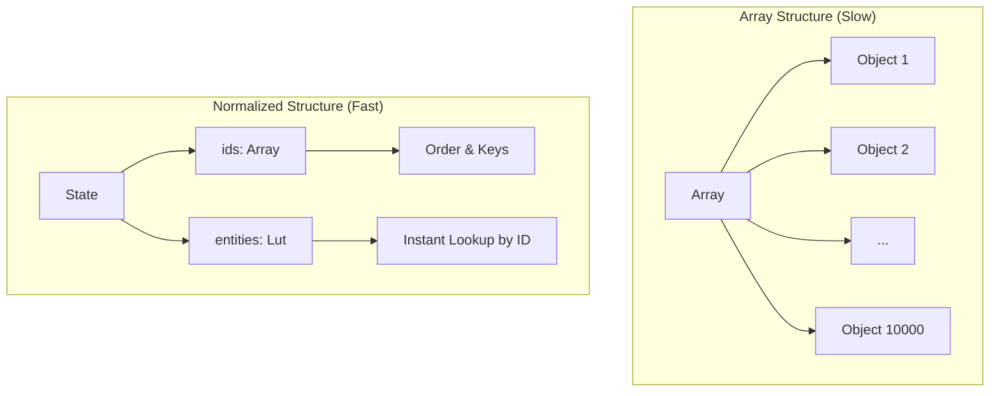

# 04. Entity Adapter: Керування нормалізованим станом

## Вступ: Проблема великих списків

Уявіть, що ви розробляєте панель адміністратора для великого інтернет-магазину. У вас є список з 10,000 товарів, і вам потрібно:

1.  Знайти конкретний товар за ID, щоб відредагувати його ціну.
2.  Оновити статус наявності для групи товарів.
3.  Видалити зняті з виробництва позиції.

Якщо ви зберігаєте ці дані як звичайний масив об'єктів (standard array of objects), ви стикаєтеся з проблемою продуктивності.

### Чому масиви повільні?

Уявіть масив:

```javascript
const products = [
    { id: 1, name: 'IPhone 13', price: 999 },
    { id: 2, name: 'Samsung S21', price: 899 },
    // ... і ще 9,998 товарів
]
```

Щоб знайти товар з `id: 5678`:

```javascript
// ❌ Повільно: O(N)
const product = products.find((p) => p.id === 5678)
```

JavaScript змушений перебирати елементи один за одним, поки не знайде потрібний. Якщо елемент в кінці списку — це 10,000 операцій. При частому оновленні інтерфейсу це призведе до помітних "гальм".

### Рішення: Нормалізація даних

Бази даних вирішують цю проблему через **індексацію**. Ми можемо зробити те саме в Redux, перетворивши масив на структуру, схожу на базу даних. Це називається **нормалізацією**.

Замість масиву ми використовуємо об'єкт, де ключами є ID, а значеннями — самі дані.

```javascript
const normalizedState = {
    ids: [1, 2, ...], // Зберігає порядок
    entities: {
        1: { id: 1, name: "IPhone 13", ... },
        2: { id: 2, name: "Samsung S21", ... },
        // ...
    }
}
```

Тепер пошук миттєвий:

```javascript
// ✅ Миттєво: O(1)
const product = normalizedState.entities[5678]
```

::mermaid



::

---

## Що таке `createEntityAdapter`?

Писати код для нормалізації вручну (створювати об'єкти, слідкувати за `ids`, оновлювати їх при видаленні) — це рутинна і помилконебезпечна робота.

**`createEntityAdapter`** — це утиліта в Redux Toolkit, яка автоматизує цей процес. Вона надає:

1.  **Стандартизовану структуру стейту** (`ids` + `entities`).
2.  **Готові редюсери** для CRUD операцій (додавання, оновлення, видалення).
3.  **Селектори** для швидкого отримання даних.

---

## Реалізація: Крок за кроком

Створимо слайс для управління користувачами, використовуючи `createEntityAdapter`.

### Крок 1: Створення адаптера

```javascript
import { createSlice, createEntityAdapter } from '@reduxjs/toolkit'

// 1. Створюємо адаптер
// Він знає, як маніпулювати нашими даними
const usersAdapter = createEntityAdapter({
    // Опціонально: вказуємо, яке поле є ID (за замовчуванням 'id')
    selectId: (user) => user.userId,
    // Опціонально: вказуємо правило сортування (наприклад, за іменем)
    sortComparer: (a, b) => a.name.localeCompare(b.name),
})
```

### Крок 2: Початковий стан

Адаптер генерує правильну структуру стейту через метод `getInitialState`.

```javascript
// 2. Отримуємо початковий стан
// Результат: { ids: [], entities: {} }
const initialState = usersAdapter.getInitialState({
    // Можна додати додаткові поля
    loading: 'idle',
    error: null,
})
```

::info
Метод `getInitialState` повертає об'єкт `{ ids: [], entities: {} }`, об'єднуючи його з тим об'єктом, який ви передали як аргумент.
::

### Крок 3: Слайс та Редюсери

Використовуємо "магічні" методи адаптера (`addOne`, `removeOne`, `setAll` тощо) безпосередньо в `reducers`.

```javascript
const usersSlice = createSlice({
    name: 'users',
    initialState,
    reducers: {
        // Додати одного юзера
        userAdded: usersAdapter.addOne,

        // Оновити дані юзера
        userUpdated: usersAdapter.updateOne,

        // Завантажити список (замінює все)
        usersReceived: (state, action) => {
            // Можна комбінувати логіку
            state.loading = 'succeeded'
            usersAdapter.setAll(state, action.payload)
        },

        // Видалити юзера
        userRemoved: usersAdapter.removeOne,
    },
})
```

### Крок 4: Експорт Селекторів

Адаптер також створює готові селектори для отримання даних з цього нормалізованого стейту.

```javascript
// getSelectors очікує селектор, який повертає локальний стейт слайсу
export const usersSelectors = usersAdapter.getSelectors((state) => state.users)

// usersSelectors містить:
// - selectAll: повертає масив всіх сутностей
// - selectById: повертає сутність за ID
// - selectIds: повертає масив ID
// - selectTotal: повертає кількість сутностей
// - selectEntities: повертає об'єкт entities
```

---

## Детальний огляд методів (CRUD)

Адаптер надає набір методів (функцій-редюсерів) для всіх типових операцій. Вони автоматично мутують стейт (через Immer), оновлюючи і `ids`, і `entities`.

### Методи додавання (Create/Add)

| Метод     | Опис                                                                | Приклад використання                     |
| :-------- | :------------------------------------------------------------------ | :--------------------------------------- |
| `addOne`  | Додає одну сутність. Якщо ID вже існує, нічого не робить (ігнорує). | Додавання нового коментаря в реал-таймі. |
| `addMany` | Додає масив сутностей. Ігнорує дублікати ID.                        | Дозавантаження ("Load More") списку.     |
| `setAll`  | Замінює **всі** поточні сутності новими.                            | Повне оновлення списку з сервера.        |
| `setOne`  | Додає сутність або **замінює** існуючу, якщо ID збігається.         | Примусове оновлення конкретного об'єкта. |
| `setMany` | Те саме, що `setOne`, але для масиву.                               | Масове оновлення/заміна.                 |

### Методи оновлення (Update)

| Метод        | Опис                                                                        | Приклад використання                                          |
| :----------- | :-------------------------------------------------------------------------- | :------------------------------------------------------------ |
| `updateOne`  | Оновлює поля існуючої сутності. Приймає об'єкт `{ id, changes }`.           | Зміна імені користувача або статусу "лайк".                   |
| `updateMany` | Оновлює масив сутностей.                                                    | Позначити декілька листів як "прочитані".                     |
| `upsertOne`  | Якщо сутність існує — оновлює її (`updateOne`), якщо ні — додає (`addOne`). | Синхронізація даних, коли ми не знаємо, чи є об'єкт локально. |
| `upsertMany` | Те саме для масиву.                                                         | Масова синхронізація.                                         |

### Методи видалення (Delete)

| Метод        | Опис                                    | Приклад використання               |
| :----------- | :-------------------------------------- | :--------------------------------- |
| `removeOne`  | Видаляє сутність за ID.                 | Видалити пост.                     |
| `removeMany` | Видаляє сутності за масивом ID.         | Видалити вибрані повідомлення.     |
| `removeAll`  | Очищає стейт (`ids: [], entities: {}`). | "Вийти з системи", очистити кошик. |

---

## Практичний приклад: Кошик покупок

Давайте реалізуємо логіку корзини покупок, де:

1.  Товари додаються.
2.  Якщо товар вже є, збільшується його кількість (кількість — це частина стану).
3.  Можна видаляти товари.

```javascript
// features/cart/cartSlice.js
import { createSlice, createEntityAdapter } from '@reduxjs/toolkit'

// Адаптер для товарів у кошику
// ID товару буде ключем
const cartAdapter = createEntityAdapter({
    selectId: (item) => item.productId,
})

const cartSlice = createSlice({
    name: 'cart',
    initialState: cartAdapter.getInitialState(),
    reducers: {
        addToCart: (state, action) => {
            const product = action.payload
            // Перевіряємо, чи є вже такий товар
            // Доступ до entities прямий і швидкий
            const existingItem = state.entities[product.productId]

            if (existingItem) {
                // Якщо є, оновлюємо кількість
                // Використовуємо updateOne для часткового оновлення
                cartAdapter.updateOne(state, {
                    id: product.productId,
                    changes: { quantity: existingItem.quantity + 1 },
                })
            } else {
                // Якщо немає, додаємо новий з кількістю 1
                cartAdapter.addOne(state, { ...product, quantity: 1 })
            }
        },
        removeFromCart: cartAdapter.removeOne,
        updateQuantity: (state, action) => {
            const { id, quantity } = action.payload
            cartAdapter.updateOne(state, { id, changes: { quantity } })
        },
        clearCart: cartAdapter.removeAll,
    },
})

export const { addToCart, removeFromCart, updateQuantity, clearCart } = cartSlice.actions

// Селектор для суми (приклад кастомного селектора поверх адаптера)
export const { selectAll: selectCartItems } = cartAdapter.getSelectors((state) => state.cart)

// Загальна вартість
export const selectCartTotal = (state) => {
    const items = selectCartItems(state)
    return items.reduce((total, item) => total + item.price * item.quantity, 0)
}

export default cartSlice.reducer
```

---

## Важливі нюанси

### 1. Сортування (`sortComparer`)

Якщо ви передали функцію `sortComparer` в `createEntityAdapter`, масив `ids` завжди буде підтримуватися у відсортованому стані. Це дуже зручно для списків, які мають бути в певному порядку (наприклад, повідомлення чату хронологічно).

```javascript
const messagesAdapter = createEntityAdapter({
    // Нові повідомлення в кінці
    sortComparer: (a, b) => a.timestamp - b.timestamp,
})
```

Однак, пам'ятайте: сортування відбувається при _кожній_ зміні (insert/update). Для дуже великих списків і частих оновлень це може вплинути на продуктивність.

### 2. TypeScript

`createEntityAdapter` чудово працює з TypeScript. Вам потрібно лише вказати тип сутності.

```typescript
interface User {
    id: number
    name: string
}

// Адаптер автоматично виведе типи для методів (addOne приймає User і т.д.)
const usersAdapter = createEntityAdapter<User>()
```

### 3. Доступ до `entities` vs `selectAll`

- Використовуйте `selectById` (або прямий доступ до `entities` в логіці), коли вам потрібен _конкретний_ елемент. Це O(1).
- Використовуйте `selectAll`, коли вам потрібно відрендерити список. Це поверне масив об'єктів у порядку `ids`.

## Підсумок

`createEntityAdapter` — це "швейцарський ніж" для роботи з колекціями даних у Redux. Він:

1.  **Нормалізує дані**, роблячи доступ до них миттєвим (O(1)).
2.  **Зменшує boilerplate**, генеруючи редюсери та селектори.
3.  **Стандартизує код**, роблячи його зрозумілішим для команди.

Я рекомендую використовувати його **завжди**, коли у вас є масив об'єктів з ID, особливо якщо цей масив може бути змінюваним або великим.

::tally-embed{id="YOUR_FORM_ID" title="Перевірка знань: Entity Adapter"}
::
