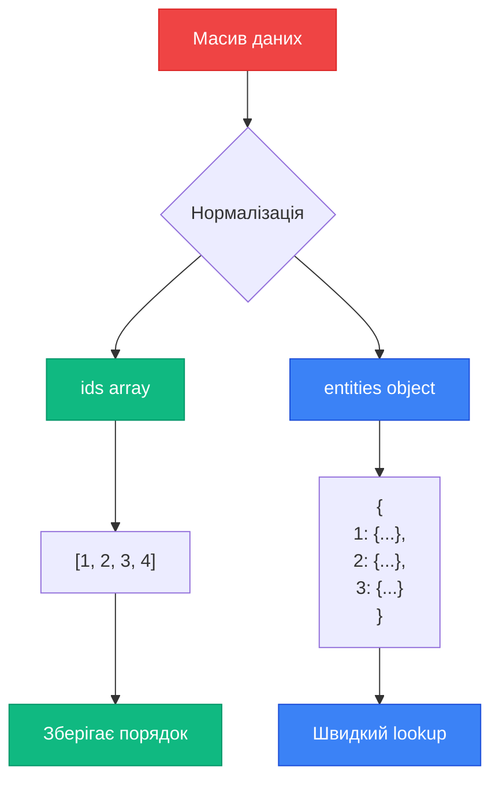

# Нормалізація даних з createEntityAdapter

Коли у вашому додатку є колекції однотипних об'єктів (users, posts, todos), їх зберігання у вигляді масиву створює проблеми з performance. `createEntityAdapter` вирішує це через нормалізацію.

## Проблема: Масиви неефективні

```javascript
// ❌ Масив: пошук O(n)
const state = {
    users: [
        { id: 1, name: 'Alice' },
        { id: 2, name: 'Bob' },
        { id: 3, name: 'Charlie' },
        // ... 1000+ users
    ],
}

// Пошук користувача
const user = state.users.find((u) => u.id === 2) // O(n) - повільно!

// Оновлення
const updated = state.users.map((u) => (u.id === 2 ? { ...u, name: 'Robert' } : u)) // O(n) - перебирає всі елементи!
```

**Проблеми:**

- Пошук за ID: O(n) складність
- Оновлення: потрібно знайти елемент (O(n))
- Видалення: потрібно знайти індекс (O(n))
- Перевірка існування: O(n)

---

## Рішення: Нормалізована структура

```javascript
// ✅ Нормалізовані дані: пошук O(1)
const state = {
    users: {
        ids: [1, 2, 3], // Порядок елементів
        entities: {
            // Lookup table
            1: { id: 1, name: 'Alice' },
            2: { id: 2, name: 'Bob' },
            3: { id: 3, name: 'Charlie' },
        },
    },
}

// Пошук користувача - O(1)
const user = state.users.entities[2] // Миттєво!

// Оновлення - O(1)
state.users.entities[2] = { ...state.users.entities[2], name: 'Robert' }
```

::tip
**Performance boost**: Для 1000 елементів різниця між O(n) та O(1) — це 1000x швидше!
::

---

## Концепція нормалізації

::mermaid



::

**Переваги:**

- ✅ Швидкий доступ за ID (O(1))
- ✅ Простіше оновлювати конкретний елемент
- ✅ Легко перевірити існування
- ✅ Зберігається порядок через `ids`

---

## createEntityAdapter API

### Створення адаптера

```javascript
import { createEntityAdapter } from '@reduxjs/toolkit'

// Базове використання
const usersAdapter = createEntityAdapter()

// З кастомним ID
const usersAdapter = createEntityAdapter({
    selectId: (user) => user.userId, // За замовчуванням шукає 'id'
})

// З сортуванням
const usersAdapter = createEntityAdapter({
    sortComparer: (a, b) => a.name.localeCompare(b.name),
})
```

### Структура state

```javascript
// Початковий state
const initialState = usersAdapter.getInitialState({
  loading: 'idle',
  error: null,
  // ids та entities додаються автоматично
});

// Результат:
{
  ids: [],
  entities: {},
  loading: 'idle',
  error: null,
}
```

---

## CRUD методи адаптера

`createEntityAdapter` надає методи для всіх операцій:

| Метод        | Опис                     | Приклад                                   |
| ------------ | ------------------------ | ----------------------------------------- |
| `addOne`     | Додати один елемент      | `adapter.addOne(state, user)`             |
| `addMany`    | Додати масив елементів   | `adapter.addMany(state, users)`           |
| `setOne`     | Встановити/оновити один  | `adapter.setOne(state, user)`             |
| `setMany`    | Встановити/оновити масив | `adapter.setMany(state, users)`           |
| `setAll`     | Замінити всі дані        | `adapter.setAll(state, users)`            |
| `updateOne`  | Оновити один (partial)   | `adapter.updateOne(state, {id, changes})` |
| `updateMany` | Оновити багато           | `adapter.updateMany(state, updates)`      |
| `upsertOne`  | Додати або оновити       | `adapter.upsertOne(state, user)`          |
| `upsertMany` | Додати/оновити багато    | `adapter.upsertMany(state, users)`        |
| `removeOne`  | Видалити за ID           | `adapter.removeOne(state, userId)`        |
| `removeMany` | Видалити масив ID        | `adapter.removeMany(state, [1, 2, 3])`    |
| `removeAll`  | Видалити все             | `adapter.removeAll(state)`                |

---

## Patterns використання

### 1. Базовий приклад

```javascript [features/users/usersSlice.js]
import { createSlice, createEntityAdapter } from '@reduxjs/toolkit'

const usersAdapter = createEntityAdapter()

const usersSlice = createSlice({
    name: 'users',
    initialState: usersAdapter.getInitialState(),
    reducers: {
        userAdded: usersAdapter.addOne,
        usersReceived: usersAdapter.setAll,
        userUpdated: usersAdapter.updateOne,
        userRemoved: usersAdapter.removeOne,
    },
})

export const { userAdded, usersReceived, userUpdated, userRemoved } = usersSlice.actions
export default usersSlice.reducer
```

Використання:

```javascript
// Додати користувача
dispatch(userAdded({ id: 1, name: 'Alice' }))

// Завантажити користувачів
dispatch(
    usersReceived([
        { id: 1, name: 'Alice' },
        { id: 2, name: 'Bob' },
    ]),
)

// Оновити
dispatch(userUpdated({ id: 1, changes: { name: 'Alicia' } }))

// Видалити
dispatch(userRemoved(1))
```

### 2. З додатковим state

```javascript
const usersAdapter = createEntityAdapter()

const usersSlice = createSlice({
    name: 'users',
    initialState: usersAdapter.getInitialState({
        loading: 'idle',
        error: null,
        selectedUserId: null,
    }),
    reducers: {
        userAdded: usersAdapter.addOne,
        userSelected: (state, action) => {
            state.selectedUserId = action.payload
        },
    },
})
```

### 3. З async thunks

```javascript
import { createAsyncThunk, createSlice, createEntityAdapter } from '@reduxjs/toolkit'

const usersAdapter = createEntityAdapter()

export const fetchUsers = createAsyncThunk('users/fetchAll', async () => {
    const response = await fetch('/api/users')
    return response.json()
})

export const deleteUser = createAsyncThunk('users/delete', async (userId) => {
    await fetch(`/api/users/${userId}`, { method: 'DELETE' })
    return userId
})

const usersSlice = createSlice({
    name: 'users',
    initialState: usersAdapter.getInitialState({
        loading: 'idle',
        error: null,
    }),
    reducers: {},
    extraReducers: (builder) => {
        builder
            // Fetch
            .addCase(fetchUsers.pending, (state) => {
                state.loading = 'pending'
            })
            .addCase(fetchUsers.fulfilled, (state, action) => {
                state.loading = 'succeeded'
                usersAdapter.setAll(state, action.payload)
            })
            .addCase(fetchUsers.rejected, (state, action) => {
                state.loading = 'failed'
                state.error = action.error.message
            })
            // Delete
            .addCase(deleteUser.fulfilled, (state, action) => {
                usersAdapter.removeOne(state, action.payload)
            })
    },
})

export default usersSlice.reducer
```

### 4. Кастомний selectId

```javascript
// Якщо ваші об'єкти мають інше поле замість 'id'
const booksAdapter = createEntityAdapter({
    selectId: (book) => book.isbn, // Унікальний ключ
})

// Або якщо ID вкладений
const productsAdapter = createEntityAdapter({
    selectId: (product) => product.data.productId,
})
```

### 5. Сортування

```javascript
// За іменем (алфавітно)
const usersAdapter = createEntityAdapter({
    sortComparer: (a, b) => a.name.localeCompare(b.name),
})

// За датою створення (новіші спочатку)
const postsAdapter = createEntityAdapter({
    sortComparer: (a, b) => b.createdAt - a.createdAt,
})

// Складне сортування
const tasksAdapter = createEntityAdapter({
    sortComparer: (a, b) => {
        // Спочатку за пріоритетом
        if (a.priority !== b.priority) {
            return b.priority - a.priority
        }
        // Потім за датою
        return new Date(b.createdAt) - new Date(a.createdAt)
    },
})
```

::warning
**Важливо**: Сортування виконується **при кожній зміні** ids. Для великих колекцій це може впливати на performance.
::

---

## Auto-generated Selectors

Адаптер автоматично генерує селектори:

```javascript
const usersAdapter = createEntityAdapter()

// Генеруємо селектори
const usersSelectors = usersAdapter.getSelectors(
    (state) => state.users, // Шлях до slice в store
)

// Доступні селектори:
usersSelectors.selectIds // (state) => state.users.ids
usersSelectors.selectEntities // (state) => state.users.entities
usersSelectors.selectAll // (state) => масив всіх users
usersSelectors.selectTotal // (state) => кількість users
usersSelectors.selectById // (state, id) => конкретний user
```

### Використання в компонентах

```javascript
import { useSelector } from 'react-redux'
import { usersSelectors } from './usersSlice'

function UsersList() {
    const users = useSelector(usersSelectors.selectAll)
    const totalUsers = useSelector(usersSelectors.selectTotal)

    return (
        <div>
            <h2>Total: {totalUsers}</h2>
            {users.map((user) => (
                <div key={user.id}>{user.name}</div>
            ))}
        </div>
    )
}

function UserProfile({ userId }) {
    const user = useSelector((state) => usersSelectors.selectById(state, userId))

    if (!user) return <div>User not found</div>

    return <div>{user.name}</div>
}
```

### Експорт селекторів

```javascript [features/users/usersSlice.js]
const usersAdapter = createEntityAdapter()

const usersSlice = createSlice({
    // ...
})

// Експортуємо селектори для використання в компонентах
export const usersSelectors = usersAdapter.getSelectors((state) => state.users)

export default usersSlice.reducer
```

---

## Операції оновлення

### updateOne — часткове оновлення

```javascript
reducers: {
  userNameUpdated: (state, action) => {
    usersAdapter.updateOne(state, {
      id: action.payload.id,
      changes: { name: action.payload.name },
    });
  },
}

// Використання
dispatch(userNameUpdated({ id: 1, name: 'New Name' }));
```

### updateMany — множинне оновлення

```javascript
reducers: {
  usersArchived: (state, action) => {
    const updates = action.payload.map(id => ({
      id,
      changes: { archived: true },
    }));
    usersAdapter.updateMany(state, updates);
  },
}

// Використання
dispatch(usersArchived([1, 2, 3]));
```

### upsertOne — додати або оновити

```javascript
reducers: {
  userUpserted: (state, action) => {
    // Якщо існує — оновить, якщо ні — додасть
    usersAdapter.upsertOne(state, action.payload);
  },
}

// Корисно для синхронізації з сервером
dispatch(userUpserted({ id: 1, name: 'Alice', email: 'new@email.com' }));
```

---

## Real-World Examples

::accordion

::accordion-item{label="Shopping Cart з Entity Adapter" icon="i-lucide-shopping-cart"}

```javascript [features/cart/cartSlice.js]
import { createSlice, createEntityAdapter } from '@reduxjs/toolkit'

const cartAdapter = createEntityAdapter({
    selectId: (item) => item.productId,
})

const cartSlice = createSlice({
    name: 'cart',
    initialState: cartAdapter.getInitialState({
        total: 0,
    }),
    reducers: {
        itemAdded: (state, action) => {
            const { productId, name, price } = action.payload
            const existingItem = state.entities[productId]

            if (existingItem) {
                // Збільшити кількість
                cartAdapter.updateOne(state, {
                    id: productId,
                    changes: { quantity: existingItem.quantity + 1 },
                })
            } else {
                // Додати новий
                cartAdapter.addOne(state, {
                    productId,
                    name,
                    price,
                    quantity: 1,
                })
            }

            // Оновити total
            state.total = state.ids.reduce((sum, id) => sum + state.entities[id].price * state.entities[id].quantity, 0)
        },

        itemRemoved: (state, action) => {
            cartAdapter.removeOne(state, action.payload)
            state.total = state.ids.reduce((sum, id) => sum + state.entities[id].price * state.entities[id].quantity, 0)
        },

        quantityUpdated: (state, action) => {
            const { productId, quantity } = action.payload
            if (quantity <= 0) {
                cartAdapter.removeOne(state, productId)
            } else {
                cartAdapter.updateOne(state, {
                    id: productId,
                    changes: { quantity },
                })
            }
            state.total = state.ids.reduce((sum, id) => sum + state.entities[id].price * state.entities[id].quantity, 0)
        },

        cartCleared: (state) => {
            cartAdapter.removeAll(state)
            state.total = 0
        },
    },
})

export const { itemAdded, itemRemoved, quantityUpdated, cartCleared } = cartSlice.actions

export const cartSelectors = cartAdapter.getSelectors((state) => state.cart)

export default cartSlice.reducer
```

::

::accordion-item{label="Posts з коментарями (Nested Normalization)" icon="i-lucide-message-square"}

```javascript
// Окремі адаптери для posts та comments
const postsAdapter = createEntityAdapter({
    sortComparer: (a, b) => b.createdAt - a.createdAt,
})

const commentsAdapter = createEntityAdapter({
    sortComparer: (a, b) => a.createdAt - b.createdAt,
})

const postsSlice = createSlice({
    name: 'posts',
    initialState: postsAdapter.getInitialState({
        comments: commentsAdapter.getInitialState(),
    }),
    reducers: {
        postAdded: postsAdapter.addOne,

        commentAdded: (state, action) => {
            commentsAdapter.addOne(state.comments, action.payload)
        },

        postWithCommentsReceived: (state, action) => {
            const { post, comments } = action.payload
            postsAdapter.addOne(state, post)
            commentsAdapter.addMany(state.comments, comments)
        },
    },
})

// Селектори
export const postsSelectors = postsAdapter.getSelectors((state) => state.posts)
export const commentsSelectors = commentsAdapter.getSelectors((state) => state.posts.comments)
```

::

::accordion-item{label="Inbox з фільтрами та пошуком" icon="i-lucide-inbox"}

```javascript
const messagesAdapter = createEntityAdapter({
    sortComparer: (a, b) => b.timestamp - a.timestamp,
})

const messagesSlice = createSlice({
    name: 'messages',
    initialState: messagesAdapter.getInitialState({
        filter: 'all', // 'all' | 'read' | 'unread'
        searchQuery: '',
    }),
    reducers: {
        messagesReceived: messagesAdapter.setAll,

        messageRead: (state, action) => {
            messagesAdapter.updateOne(state, {
                id: action.payload,
                changes: { read: true },
            })
        },

        allMessagesRead: (state) => {
            const updates = state.ids.map((id) => ({
                id,
                changes: { read: true },
            }))
            messagesAdapter.updateMany(state, updates)
        },

        filterChanged: (state, action) => {
            state.filter = action.payload
        },

        searchQueryChanged: (state, action) => {
            state.searchQuery = action.payload
        },
    },
})

// Memoized селектор з фільтром
import { createSelector } from '@reduxjs/toolkit'

const selectMessagesState = (state) => state.messages

export const selectFilteredMessages = createSelector(
    [
        messagesAdapter.getSelectors(selectMessagesState).selectAll,
        (state) => state.messages.filter,
        (state) => state.messages.searchQuery,
    ],
    (messages, filter, searchQuery) => {
        let filtered = messages

        // Фільтр за статусом
        if (filter === 'read') {
            filtered = filtered.filter((m) => m.read)
        } else if (filter === 'unread') {
            filtered = filtered.filter((m) => !m.read)
        }

        // Пошук
        if (searchQuery) {
            filtered = filtered.filter(
                (m) =>
                    m.subject.toLowerCase().includes(searchQuery.toLowerCase()) ||
                    m.body.toLowerCase().includes(searchQuery.toLowerCase()),
            )
        }

        return filtered
    },
)
```

::

::accordion-item{label="Collaborative Todo List (Optimistic Updates)" icon="i-lucide-check-square"}

```javascript
import { createAsyncThunk, createSlice, createEntityAdapter } from '@reduxjs/toolkit'

const todosAdapter = createEntityAdapter()

export const toggleTodo = createAsyncThunk('todos/toggle', async (todoId, { rejectWithValue }) => {
    try {
        const response = await fetch(`/api/todos/${todoId}/toggle`, {
            method: 'PATCH',
        })
        return response.json()
    } catch (error) {
        return rejectWithValue(todoId)
    }
})

const todosSlice = createSlice({
    name: 'todos',
    initialState: todosAdapter.getInitialState(),
    reducers: {
        todosReceived: todosAdapter.setAll,
    },
    extraReducers: (builder) => {
        builder
            // Optimistic update
            .addCase(toggleTodo.pending, (state, action) => {
                const todoId = action.meta.arg
                const todo = state.entities[todoId]
                if (todo) {
                    todosAdapter.updateOne(state, {
                        id: todoId,
                        changes: { completed: !todo.completed },
                    })
                }
            })
            // Rollback при помилці
            .addCase(toggleTodo.rejected, (state, action) => {
                const todoId = action.payload
                const todo = state.entities[todoId]
                if (todo) {
                    todosAdapter.updateOne(state, {
                        id: todoId,
                        changes: { completed: !todo.completed }, // Повернути назад
                    })
                }
            })
    },
})

export default todosSlice.reducer
```

::

::

---

## Migration: Array → Entity Adapter

::tabs
::tabs-item{label="До (масив)"}

```javascript
const todosSlice = createSlice({
    name: 'todos',
    initialState: {
        items: [],
    },
    reducers: {
        todoAdded: (state, action) => {
            state.items.push(action.payload)
        },

        todoToggled: (state, action) => {
            const todo = state.items.find((t) => t.id === action.payload)
            if (todo) {
                todo.completed = !todo.completed
            }
        },

        todoDeleted: (state, action) => {
            state.items = state.items.filter((t) => t.id !== action.payload)
        },
    },
})

// Селектор
const selectAllTodos = (state) => state.todos.items
const selectTodoById = (state, todoId) => state.todos.items.find((t) => t.id === todoId)
```

::

::tabs-item{label="Після (entity adapter)"}

```javascript
const todosAdapter = createEntityAdapter()

const todosSlice = createSlice({
    name: 'todos',
    initialState: todosAdapter.getInitialState(),
    reducers: {
        todoAdded: todosAdapter.addOne,

        todoToggled: (state, action) => {
            const todo = state.entities[action.payload]
            if (todo) {
                todo.completed = !todo.completed
            }
        },

        todoDeleted: todosAdapter.removeOne,
    },
})

// Селектори (автоматичні!)
export const todosSelectors = todosAdapter.getSelectors((state) => state.todos)
// todosSelectors.selectAll, todosSelectors.selectById - готові!
```

::
::

**Результат**: Менше коду, кращий performance, готові селектори!

---

## TypeScript Інтеграція

```typescript [features/users/usersSlice.ts]
import { createSlice, createEntityAdapter, EntityState } from '@reduxjs/toolkit'

interface User {
    id: number
    name: string
    email: string
}

const usersAdapter = createEntityAdapter<User>()

interface UsersState extends EntityState<User> {
    loading: 'idle' | 'pending' | 'succeeded' | 'failed'
    error: string | null
}

const initialState: UsersState = usersAdapter.getInitialState({
    loading: 'idle',
    error: null,
})

const usersSlice = createSlice({
    name: 'users',
    initialState,
    reducers: {
        userAdded: usersAdapter.addOne,
        userUpdated: usersAdapter.updateOne,
    },
})

export const usersSelectors = usersAdapter.getSelectors<RootState>((state) => state.users)

export default usersSlice.reducer
```

---

## Performance Tips

::card-group
::card{title="✅ Використовуйте для колекцій" icon="i-lucide-zap"}
Якщо у вас більше 10 елементів з ID — використовуйте adapter
::

::card{title="⚠️ Сортування може бути повільним" icon="i-lucide-clock"}
Для 1000+ елементів сортування при кожній зміні — дороге
::

::card{title="✅ Селектори memoized" icon="i-lucide-cpu"}
`selectAll` автоматично memoized для оптимізації
::

::card{title="⚡ Normalization = O(1)" icon="i-lucide-gauge"}
Lookup, update, delete — все константна складність
::
::

---

## Коли НЕ використовувати

::warning
**Entity Adapter не потрібен якщо:**

- Мало елементів (< 10)
- Елементи не мають унікального ID
- Не потрібен швидкий lookup за ID
- Дані вже нормалізовані іншим способом
  ::

---

## Висновок

`createEntityAdapter` — це:

✅ Автоматична нормалізація даних  
✅ O(1) складність для CRUD операцій  
✅ Готові CRUD методи  
✅ Auto-generated селектори  
✅ Опціональне сортування  
✅ Відмінна TypeScript підтримка

::tip
**Золоте правило**: Якщо у вас є колекція об'єктів з ID і вам потрібен швидкий доступ — використовуйте Entity Adapter.
::

---

## Наступні кроки

Тепер ми освоїли всі базові інструменти Redux Toolkit. Час перейти до advanced тем!

👉 [Далі: Мемоізація селекторів з Reselect](../05.advanced/01.selectors-reselect.md)
