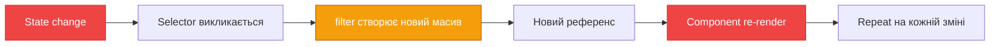
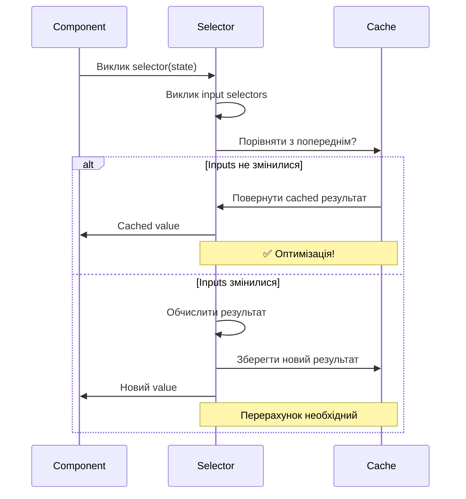

# Мемоізація селекторів з Reselect

Селектори (selectors) — це функції, які витягують дані зі state. Але є проблема: при кожному ре-рендері компонент викликає селектор знову, навіть якщо дані не змінилися. Це призводить до зайвих обчислень і ре-рендерів. **Reselect** та **createSelector** вирішують цю проблему через мемоізацію.

## Проблема: Зайві обчислення

```javascript
// ❌ Проблемний селектор
const selectCompletedTodos = (state) => {
    console.log('Calculating completed todos...')
    return state.todos.filter((todo) => todo.completed)
}

function TodoStats() {
    const completed = useSelector(selectCompletedTodos)
    const count = useSelector((state) => state.todos.length)

    return (
        <div>
            Completed: {completed.length} / {count}
        </div>
    )
}
```

**Що не так?**

- При зміні **будь-якого** state (не тільки todos) селектор пересчитується
- `.filter()` створює **новий масив** кожного разу
- React бачить новий референс → компонент ре-рендериться
- Для великих списків це **дуже повільно**

::mermaid



::

---

## Рішення: createSelector (Memoization)

```javascript
import { createSelector } from '@reduxjs/toolkit'

// ✅ Memoized селектор
const selectCompletedTodos = createSelector(
    [(state) => state.todos], // Input selector
    (todos) => {
        console.log('Calculating completed todos...')
        return todos.filter((todo) => todo.completed)
    },
)
```

**Як працює:**

1. Викликає input selector: `state => state.todos`
2. Порівнює результат з попереднім викликом
3. **Якщо однаковий** → повертає закешований результат
4. **Якщо змінився** → обчислює знову та кешує

::tip
**Результат**: `console.log` виконається тільки при зміні `state.todos`, а не при кожному ре-рендері!
::

---

## createSelector API

### Базовий синтаксис

```javascript
const selector = createSelector(
  [inputSelector1, inputSelector2, ...], // Input selectors (масив)
  (result1, result2, ...) => {           // Result function
    // Обчислення на основі результатів input selectors
    return computedValue;
  }
);
```

### Простий приклад

```javascript
// Input selector
const selectTodos = (state) => state.todos

// Memoized selector
const selectCompletedTodos = createSelector([selectTodos], (todos) => todos.filter((todo) => todo.completed))

// Використання
const completedTodos = useSelector(selectCompletedTodos)
```

---

## Patterns використання

### 1. Один input selector

```javascript
const selectTodos = (state) => state.todos

const selectTodoCount = createSelector([selectTodos], (todos) => todos.length)

const selectCompletedCount = createSelector([selectTodos], (todos) => todos.filter((t) => t.completed).length)
```

### 2. Множинні input selectors

```javascript
const selectTodos = (state) => state.todos
const selectFilter = (state) => state.filter
const selectSearchQuery = (state) => state.searchQuery

const selectFilteredTodos = createSelector(
    [selectTodos, selectFilter, selectSearchQuery],
    (todos, filter, searchQuery) => {
        let result = todos

        // Фільтр
        if (filter === 'completed') {
            result = result.filter((t) => t.completed)
        } else if (filter === 'active') {
            result = result.filter((t) => !t.completed)
        }

        // Пошук
        if (searchQuery) {
            result = result.filter((t) => t.text.toLowerCase().includes(searchQuery.toLowerCase()))
        }

        return result
    },
)
```

### 3. Композиція селекторів (Chaining)

```javascript
// Базові селектори
const selectTodos = (state) => state.todos

// Використовує selectTodos
const selectCompletedTodos = createSelector([selectTodos], (todos) => todos.filter((t) => t.completed))

// Використовує selectCompletedTodos
const selectCompletedTodoIds = createSelector([selectCompletedTodos], (completed) => completed.map((t) => t.id))

// Статистика на основі попередніх селекторів
const selectTodoStats = createSelector([selectTodos, selectCompletedTodos], (allTodos, completedTodos) => ({
    total: allTodos.length,
    completed: completedTodos.length,
    active: allTodos.length - completedTodos.length,
    percentComplete: (completedTodos.length / allTodos.length) * 100,
}))
```

### 4. Селектори з параметрами

```javascript
// ❌ Не працює з параметрами напряму
const selectTodoById = createSelector(
    [(state) => state.todos],
    (todos, todoId) => todos.find((t) => t.id === todoId), // todoId звідки?
)

// ✅ Правильний спосіб: factory function
const makeSelectTodoById = () =>
    createSelector(
        [
            (state) => state.todos,
            (state, todoId) => todoId, // Другий input приймає параметр
        ],
        (todos, todoId) => todos.find((t) => t.id === todoId),
    )

// Використання
function TodoItem({ todoId }) {
    const selectTodoById = useMemo(makeSelectTodoById, [])
    const todo = useSelector((state) => selectTodoById(state, todoId))

    return <div>{todo.text}</div>
}
```

::warning
**Важливо**: Кожен екземпляр компонента повинен мати **свій власний** селектор для правильної мемоізації!
::

### 5. Denormalization (з Entity Adapter)

```javascript
import { createSelector } from '@reduxjs/toolkit'

// Селектори з entity adapter
const selectAllPosts = (state) => state.posts.ids.map((id) => state.posts.entities[id])
const selectAllUsers = (state) => state.users.ids.map((id) => state.users.entities[id])

// Denormalize posts з авторами
const selectPostsWithAuthors = createSelector([selectAllPosts, selectAllUsers], (posts, users) => {
    const usersById = users.reduce((acc, user) => {
        acc[user.id] = user
        return acc
    }, {})

    return posts.map((post) => ({
        ...post,
        author: usersById[post.authorId],
    }))
})
```

### 6. Агрегація та групування

```javascript
const selectOrders = (state) => state.orders

const selectOrdersByStatus = createSelector([selectOrders], (orders) => {
    return orders.reduce((acc, order) => {
        const status = order.status
        if (!acc[status]) {
            acc[status] = []
        }
        acc[status].push(order)
        return acc
    }, {})
})

const selectOrderStatistics = createSelector([selectOrders], (orders) => {
    return orders.reduce(
        (stats, order) => {
            stats.totalRevenue += order.total
            stats.orderCount++
            stats.averageOrderValue = stats.totalRevenue / stats.orderCount

            if (order.status === 'completed') {
                stats.completedOrders++
            }

            return stats
        },
        {
            totalRevenue: 0,
            orderCount: 0,
            averageOrderValue: 0,
            completedOrders: 0,
        },
    )
})
```

---

## Як працює мемоізація?

::mermaid



::

### Порівняння референсів

```javascript
// Input selector result
const todos1 = state.todos // [{ id: 1 }, { id: 2 }]
const todos2 = state.todos // Той самий масив!

// Reselect порівнює:
todos1 === todos2 // true → використати cache
```

::note
Reselect використовує **strict equality** (`===`) для порівняння. Тому важливо, щоб Redux не створював нові об'єкти без потреби.
::

---

## Real-World Examples

::accordion

::accordion-item{label="E-commerce: Cart Total" icon="i-lucide-shopping-cart"}

```javascript
const selectCartItems = (state) => state.cart.items

const selectCartTotal = createSelector([selectCartItems], (items) => {
    console.log('Calculating cart total...')
    return items.reduce((total, item) => {
        return total + item.price * item.quantity
    }, 0)
})

const selectCartQuantity = createSelector([selectCartItems], (items) =>
    items.reduce((sum, item) => sum + item.quantity, 0),
)

const selectCartSummary = createSelector(
    [selectCartTotal, selectCartQuantity, selectCartItems],
    (total, quantity, items) => ({
        total,
        quantity,
        itemCount: items.length,
        averagePrice: total / quantity,
    }),
)

// Компонент
function CartSummary() {
    const summary = useSelector(selectCartSummary)

    return (
        <div>
            <div>Items: {summary.itemCount}</div>
            <div>Total quantity: {summary.quantity}</div>
            <div>Total: ${summary.total.toFixed(2)}</div>
            <div>Avg price: ${summary.averagePrice.toFixed(2)}</div>
        </div>
    )
}
```

::

::accordion-item{label="Dashboard: Analytics" icon="i-lucide-bar-chart"}

```javascript
const selectTransactions = (state) => state.transactions
const selectDateRange = (state) => state.filters.dateRange

const selectFilteredTransactions = createSelector([selectTransactions, selectDateRange], (transactions, dateRange) => {
    if (!dateRange.start || !dateRange.end) {
        return transactions
    }

    return transactions.filter((t) => {
        const date = new Date(t.date)
        return date >= dateRange.start && date <= dateRange.end
    })
})

const selectTransactionStats = createSelector([selectFilteredTransactions], (transactions) => {
    const stats = {
        total: 0,
        count: transactions.length,
        byCategory: {},
        byMonth: {},
    }

    transactions.forEach((t) => {
        stats.total += t.amount

        // By category
        if (!stats.byCategory[t.category]) {
            stats.byCategory[t.category] = { total: 0, count: 0 }
        }
        stats.byCategory[t.category].total += t.amount
        stats.byCategory[t.category].count++

        // By month
        const month = new Date(t.date).toISOString().slice(0, 7)
        if (!stats.byMonth[month]) {
            stats.byMonth[month] = 0
        }
        stats.byMonth[month] += t.amount
    })

    return stats
})
```

::

::accordion-item{label="Social Feed: Sort & Filter" icon="i-lucide-users"}

```javascript
const selectPosts = (state) => state.posts.items
const selectCurrentUser = (state) => state.auth.user
const selectSortBy = (state) => state.ui.sortBy
const selectShowOnlyFollowing = (state) => state.ui.showOnlyFollowing

const selectSortedAndFilteredPosts = createSelector(
    [selectPosts, selectCurrentUser, selectSortBy, selectShowOnlyFollowing],
    (posts, currentUser, sortBy, showOnlyFollowing) => {
        let result = [...posts]

        // Filter
        if (showOnlyFollowing && currentUser) {
            result = result.filter((post) => currentUser.following.includes(post.authorId))
        }

        // Sort
        switch (sortBy) {
            case 'recent':
                result.sort((a, b) => new Date(b.createdAt) - new Date(a.createdAt))
                break
            case 'popular':
                result.sort((a, b) => b.likes - a.likes)
                break
            case 'commented':
                result.sort((a, b) => b.comments.length - a.comments.length)
                break
        }

        return result
    },
)
```

::

::accordion-item{label="Permissions System" icon="i-lucide-shield"}

```javascript
const selectCurrentUser = (state) => state.auth.user
const selectAllPermissions = (state) => state.permissions

const selectUserPermissions = createSelector([selectCurrentUser, selectAllPermissions], (user, allPermissions) => {
    if (!user) return []

    const rolePermissions = user.roles.flatMap((role) => allPermissions[role] || [])

    return [...new Set([...rolePermissions, ...user.customPermissions])]
})

const makeSelectCanPerformAction = () =>
    createSelector([selectUserPermissions, (state, action) => action], (permissions, action) =>
        permissions.includes(action),
    )

// Використання
function DeleteButton({ itemId }) {
    const selectCanDelete = useMemo(makeSelectCanPerformAction, [])
    const canDelete = useSelector((state) => selectCanDelete(state, 'posts.delete'))

    if (!canDelete) return null

    return <button onClick={() => deletePost(itemId)}>Delete</button>
}
```

::

::

---

## Проблеми та рішення

### Проблема 1: Селектор з параметрами не кешується

```javascript
// ❌ Кожен виклик створює новий селектор
function TodoItem({ todoId }) {
    const todo = useSelector((state) =>
        createSelector([(s) => s.todos], (todos) => todos.find((t) => t.id === todoId))(state),
    )
}
```

**Рішення**: Factory pattern

```javascript
// ✅ Створити селектор один раз
function TodoItem({ todoId }) {
    const selectTodoById = useMemo(
        () =>
            createSelector([(state) => state.todos, (state, id) => id], (todos, id) => todos.find((t) => t.id === id)),
        [],
    )

    const todo = useSelector((state) => selectTodoById(state, todoId))
}
```

### Проблема 2: Селектор у списку компонентів

```javascript
// ❌ Всі компоненти використовують один селектор
const selectUserById = createSelector([(state) => state.users, (state, userId) => userId], (users, userId) =>
    users.find((u) => u.id === userId),
)

function UserList({ userIds }) {
    return userIds.map((id) => <UserItem key={id} userId={id} />)
}

function UserItem({ userId }) {
    const user = useSelector((state) => selectUserById(state, userId))
    // Проблема: всі компоненти ділять один cache!
}
```

**Рішення**: Кожен компонент має свій селектор

```javascript
// ✅ Factory для створення нових селекторів
const makeSelectUserById = () =>
    createSelector([(state) => state.users, (state, userId) => userId], (users, userId) =>
        users.find((u) => u.id === userId),
    )

function UserItem({ userId }) {
    const selectUserById = useMemo(makeSelectUserById, [])
    const user = useSelector((state) => selectUserById(state, userId))
}
```

### Проблема 3: Глибокі порівняння об'єктів

```javascript
// Input повертає новий об'єкт кожного разу
const selectFilters = (state) => ({
    status: state.filters.status,
    category: state.filters.category,
}) // Новий об'єкт! {} !== {}

const selectFilteredItems = createSelector([selectFilters], (filters) => {
    /* ... */
}) // Завжди перераховується!
```

**Рішення**: Не створюйте об'єкти в input selectors

```javascript
// ✅ Окремі input selectors
const selectStatus = (state) => state.filters.status
const selectCategory = (state) => state.filters.category

const selectFilteredItems = createSelector([selectStatus, selectCategory], (status, category) => {
    /* ... */
})
```

---

## Performance Tips

::card-group
::card{title="✅ Використовуйте для складних обчислень" icon="i-lucide-zap"}
Фільтрація, сортування, агрегація — ідеальні use cases
::

::card{title="⚠️ Не зловживайте" icon="i-lucide-alert-triangle"}
Для простих виборів (state.user.name) createSelector надмірний
::

::card{title="✅ Композиція селекторів" icon="i-lucide-layers"}
Базові селектори + memoized poверх них
::

::card{title="⚡ Denormalization" icon="i-lucide-link"}
З'єднуйте normalized дані ефективно
::
::

---

## Порівняння: з та без мемоізації

| Критерій                | Без createSelector               | З createSelector                   |
| ----------------------- | -------------------------------- | ---------------------------------- |
| **Обчислення**          | При кожному виклику              | Тільки при зміні inputs            |
| **Референс результату** | Завжди новий                     | Той самий якщо inputs не змінилися |
| **Re-renders**          | Частіші                          | Рідше                              |
| **Performance**         | Повільніше для складних операцій | Швидше                             |
| **Код**                 | Простіше                         | Трохи складніше                    |

---

## Альтернативи (RTK 2.0+)

Redux Toolkit 2.0 додає вбудовані селектори в slices:

```javascript
const todosSlice = createSlice({
    name: 'todos',
    initialState: { items: [] },
    reducers: {
        /* ... */
    },
    selectors: {
        selectAll: (state) => state.items,
        selectCompleted: createSelector([(state) => state.items], (items) => items.filter((t) => t.completed)),
    },
})

export const { selectAll, selectCompleted } = todosSlice.selectors
```

::tip
**RTK 2.0+**: Створюйте memoized селектори прямо в slice для кращої організації!
::

---

## Висновок

`createSelector` забезпечує:

✅ Мемоізацію складних обчислень  
✅ Зменшення непотрібних ре-рендерів  
✅ Композицію селекторів  
✅ Performance optimization  
✅ Denormalization даних

::tip
**Золоте правило**: Використовуйте `createSelector` для будь-яких складних обчислень або трансформацій даних зі state.
::

---

## Наступні кроки

Тепер, коли ви знаєте, як оптимізувати читання зі state, давайте подивимося на найпотужніший інструмент для data fetching!

👉 [Далі: RTK Query - революція в data fetching](./02.rtk-query-intro.md)
