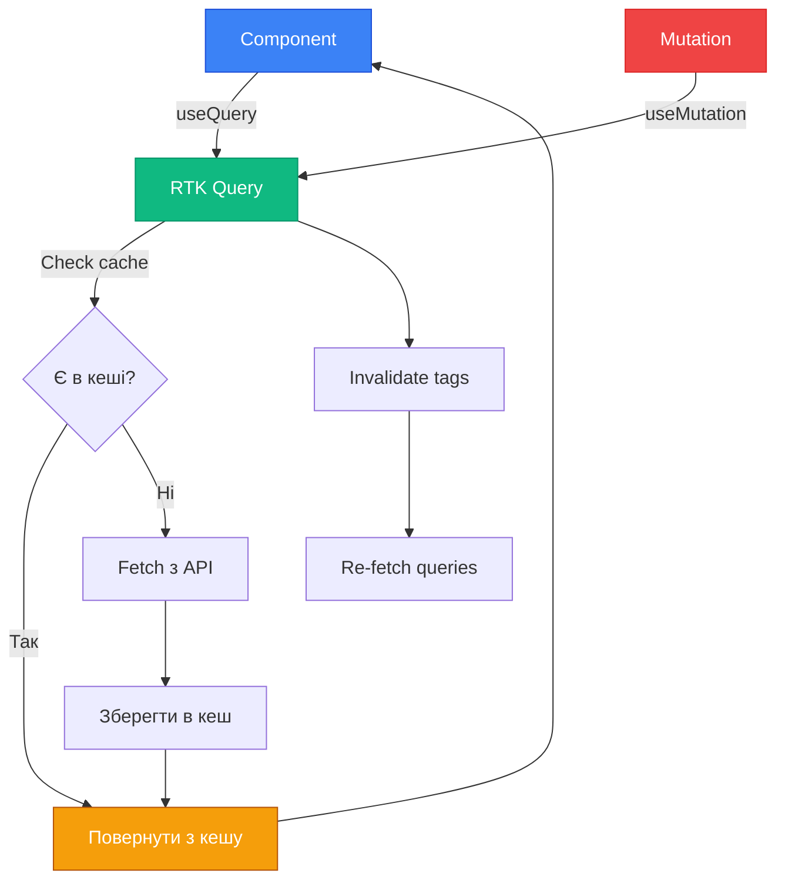

# RTK Query: Революція в Data Fetching

RTK Query — це надбудова над Redux Toolkit, яка **повністю автоматизує data fetching**: кешування, invalidation, re-fetching, optimistic updates, polling. Це як React Query, але інтегрований з Redux.

## Проблема: Manual Data Fetching

Раніше для кожного API endpoint потрібно було:

```javascript
// ❌ Багато ручної роботи
const usersSlice = createSlice({
    name: 'users',
    initialState: { data: [], loading: false, error: null },
    reducers: {},
    extraReducers: (builder) => {
        builder
            .addCase(fetchUsers.pending, (state) => {
                state.loading = true
            })
            .addCase(fetchUsers.fulfilled, (state, action) => {
                state.loading = false
                state.data = action.payload
            })
            .addCase(fetchUsers.rejected, (state, action) => {
                state.loading = false
                state.error = action.error.message
            })
    },
})

export const fetchUsers = createAsyncThunk('users/fetch', async () => {
    const response = await fetch('/api/users')
    return response.json()
})
```

**Проблеми:**

- Код дублюється для кожного endpoint
- Немає кешування
- Немає автоматичного re-fetching
- Потрібно вручну керувати loading states
- Складно синхронізувати дані

---

## Рішення: RTK Query

```javascript
// ✅ RTK Query — все автоматично!
import { createApi, fetchBaseQuery } from '@reduxjs/toolkit/query/react'

export const api = createApi({
    reducerPath: 'api',
    baseQuery: fetchBaseQuery({ baseUrl: '/api' }),
    endpoints: (builder) => ({
        getUsers: builder.query({
            query: () => 'users',
        }),
    }),
})

export const { useGetUsersQuery } = api

// В компоненті
function UsersList() {
    const { data, isLoading, error } = useGetUsersQuery()

    if (isLoading) return <div>Loading...</div>
    if (error) return <div>Error: {error.message}</div>

    return (
        <ul>
            {data.map((user) => (
                <li key={user.id}>{user.name}</li>
            ))}
        </ul>
    )
}
```

**Переваги:**

- ✅ Автоматичне кешування
- ✅ Auto-generated hooks
- ✅ Loading/error states
- ✅ Re-fetching при необхідності
- ✅ Invalidation після mutations
- ✅ Optimistic updates
- ✅ Polling та streaming

::mermaid



::

---

## Налаштування

### 1. Створення API Slice

```javascript [src/services/api.js]
import { createApi, fetchBaseQuery } from '@reduxjs/toolkit/query/react'

export const api = createApi({
    reducerPath: 'api',
    baseQuery: fetchBaseQuery({
        baseUrl: 'https://api.example.com',
        prepareHeaders: (headers, { getState }) => {
            const token = getState().auth.token
            if (token) {
                headers.set('authorization', `Bearer ${token}`)
            }
            return headers
        },
    }),
    tagTypes: ['User', 'Post'], // Для cache invalidation
    endpoints: (builder) => ({
        // Endpoints тут
    }),
})
```

### 2. Підключення до Store

```javascript [src/store.js]
import { configureStore } from '@reduxjs/toolkit'
import { api } from './services/api'

export const store = configureStore({
    reducer: {
        [api.reducerPath]: api.reducer,
        // інші reducers
    },
    middleware: (getDefaultMiddleware) => getDefaultMiddleware().concat(api.middleware),
})
```

---

## Query Endpoints (GET запити)

### Базовий Query

```javascript
endpoints: (builder) => ({
    getUsers: builder.query({
        query: () => 'users',
    }),

    getUserById: builder.query({
        query: (id) => `users/${id}`,
    }),

    searchUsers: builder.query({
        query: (searchTerm) => ({
            url: 'users/search',
            params: { q: searchTerm },
        }),
    }),
})

// Auto-generated hooks:
export const { useGetUsersQuery, useGetUserByIdQuery, useSearchUsersQuery } = api
```

### Query з параметрами

```javascript
getUserPosts: builder.query({
    query: ({ userId, limit = 10, offset = 0 }) => ({
        url: `users/${userId}/posts`,
        params: { limit, offset },
    }),
})

// Використання
const { data } = useGetUserPostsQuery({ userId: 1, limit: 20 })
```

### Transform Response

```javascript
getUsers: builder.query({
    query: () => 'users',
    transformResponse: (response) => {
        // Обробити дані перед кешуванням
        return response.data.map((user) => ({
            ...user,
            fullName: `${user.firstName} ${user.lastName}`,
        }))
    },
})
```

---

## Mutation Endpoints (POST, PUT, DELETE)

```javascript
endpoints: (builder) => ({
    createUser: builder.mutation({
        query: (newUser) => ({
            url: 'users',
            method: 'POST',
            body: newUser,
        }),
    }),

    updateUser: builder.mutation({
        query: ({ id, ...patch }) => ({
            url: `users/${id}`,
            method: 'PATCH',
            body: patch,
        }),
    }),

    deleteUser: builder.mutation({
        query: (id) => ({
            url: `users/${id}`,
            method: 'DELETE',
        }),
    }),
})

export const { useCreateUserMutation, useUpdateUserMutation, useDeleteUserMutation } = api
```

### Використання Mutations

```javascript
function CreateUserForm() {
    const [createUser, { isLoading, error }] = useCreateUserMutation()

    const handleSubmit = async (formData) => {
        try {
            const result = await createUser(formData).unwrap()
            console.log('Created:', result)
        } catch (err) {
            console.error('Failed:', err)
        }
    }

    return <form onSubmit={handleSubmit}>...</form>
}
```

---

## Cache Invalidation з Tags

Tags дозволяють автоматично оновлювати queries після mutations:

```javascript
tagTypes: ['User', 'Post'],

endpoints: (builder) => ({
  getUsers: builder.query({
    query: () => 'users',
    providesTags: ['User'], // Цей query use tag 'User'
  }),

  getUserById: builder.query({
    query: (id) => `users/${id}`,
    providesTags: (result, error, id) => [{ type: 'User', id }],
  }),

  createUser: builder.mutation({
    query: (newUser) => ({
      url: 'users',
      method: 'POST',
      body: newUser,
    }),
    invalidatesTags: ['User'], // Invalidate всі User queries
  }),

  updateUser: builder.mutation({
    query: ({ id, ...patch }) => ({
      url: `users/${id}`,
      method: 'PATCH',
      body: patch,
    }),
    invalidatesTags: (result, error, { id }) => [{ type: 'User', id }],
  }),
})
```

::tip
**Як працює**: Після `createUser` RTK Query автоматично re-fetch `getUsers` query!
::

---

## Patterns використання

### 1. Skip query (conditional fetching)

```javascript
function UserProfile({ userId }) {
  const { data } = use GetUserByIdQuery(userId, {
    skip: !userId, // Не робити fetch якщо немає ID
  });

  return data ? <div>{data.name}</div> : null;
}
```

### 2. Polling (автоматичне оновлення)

```javascript
function LiveDashboard() {
    const { data } = useGetStatsQuery(undefined, {
        pollingInterval: 5000, // Re-fetch кожні 5 секунд
    })

    return <div>Active users: {data?.activeUsers}</div>
}
```

### 3. Optimistic Updates

```javascript
updatePost: builder.mutation({
    query: ({ id, ...patch }) => ({
        url: `posts/${id}`,
        method: 'PATCH',
        body: patch,
    }),
    async onQueryStarted({ id, ...patch }, { dispatch, queryFulfilled }) {
        // Оптимістичне оновлення
        const patchResult = dispatch(
            api.util.updateQueryData('getPosts', undefined, (draft) => {
                const post = draft.find((p) => p.id === id)
                if (post) {
                    Object.assign(post, patch)
                }
            }),
        )

        try {
            await queryFulfilled
        } catch {
            patchResult.undo() // Rollback при помилці
        }
    },
})
```

### 4. Prefetching

```javascript
function PostsList() {
    const { data: posts } = useGetPostsQuery()
    const dispatch = useDispatch()

    const handleMouseEnter = (postId) => {
        // Prefetch деталі посту
        dispatch(api.util.prefetch('getPostById', postId, { force: false }))
    }

    return posts.map((post) => (
        <div key={post.id} onMouseEnter={() => handleMouseEnter(post.id)}>
            {post.title}
        </div>
    ))
}
```

### 5. Manual Cache Updates

```javascript
function Component() {
    const dispatch = useDispatch()

    const handleAction = () => {
        // Ручне оновлення кешу
        dispatch(
            api.util.updateQueryData('getUsers', undefined, (draft) => {
                draft.push({ id: 999, name: 'New User' })
            }),
        )
    }
}
```

---

## Real-World Example: Full CRUD

```javascript [src/services/postsApi.js]
import { createApi, fetchBaseQuery } from '@reduxjs/toolkit/query/react'

export const postsApi = createApi({
    reducerPath: 'postsApi',
    baseQuery: fetchBaseQuery({ baseUrl: '/api' }),
    tagTypes: ['Post'],
    endpoints: (builder) => ({
        // LIST
        getPosts: builder.query({
            query: ({ page = 1, limit = 10 }) => ({
                url: 'posts',
                params: { page, limit },
            }),
            providesTags: (result) =>
                result
                    ? [...result.map(({ id }) => ({ type: 'Post', id })), { type: 'Post', id: 'LIST' }]
                    : [{ type: 'Post', id: 'LIST' }],
        }),

        // GET
        getPost: builder.query({
            query: (id) => `posts/${id}`,
            providesTags: (result, error, id) => [{ type: 'Post', id }],
        }),

        // CREATE
        createPost: builder.mutation({
            query: (newPost) => ({
                url: 'posts',
                method: 'POST',
                body: newPost,
            }),
            invalidatesTags: [{ type: 'Post', id: 'LIST' }],
        }),

        // UPDATE
        updatePost: builder.mutation({
            query: ({ id, ...patch }) => ({
                url: `posts/${id}`,
                method: 'PATCH',
                body: patch,
            }),
            invalidatesTags: (result, error, { id }) => [{ type: 'Post', id }],
        }),

        // DELETE
        deletePost: builder.mutation({
            query: (id) => ({
                url: `posts/${id}`,
                method: 'DELETE',
            }),
            invalidatesTags: (result, error, id) => [{ type: 'Post', id }],
        }),
    }),
})

export const {
    useGetPostsQuery,
    useGetPostQuery,
    useCreatePostMutation,
    useUpdatePostMutation,
    useDeletePostMutation,
} = postsApi
```

---

## TypeScript Support

```typescript
interface Post {
    id: number
    title: string
    content: string
    authorId: number
}

interface PostsResponse {
    data: Post[]
    total: number
}

export const api = createApi({
    baseQuery: fetchBaseQuery({ baseUrl: '/api' }),
    endpoints: (builder) => ({
        getPosts: builder.query<PostsResponse, { page: number }>({
            query: ({ page }) => `posts?page=${page}`,
        }),

        getPost: builder.query<Post, number>({
            query: (id) => `posts/${id}`,
        }),

        createPost: builder.mutation<Post, Partial<Post>>({
            query: (newPost) => ({
                url: 'posts',
                method: 'POST',
                body: newPost,
            }),
        }),
    }),
})
```

---

## Порівняння: createAsyncThunk vs RTK Query

| Критерій               | createAsyncThunk     | RTK Query               |
| ---------------------- | -------------------- | ----------------------- |
| **Use case**           | Складна async логіка | CRUD API operations     |
| **Boilerplate**        | Середній             | Мінімальний             |
| **Caching**            | Ручний               | Автоматичний            |
| **Deduplication**      | Ручний               | Автоматичний            |
| **Re-fetching**        | Ручний               | Автоматичний            |
| **Optimistic updates** | Можливо, складно     | Вбудовано               |
| **Polling**            | Ручний               | Опція `pollingInterval` |
| **Invalidation**       | Ручний               | Через tags              |
| **TypeScript**         | Добрий               | Відмінний               |

::tip
**Рекомендація**: Використовуйте RTK Query для REST/GraphQL APIs. createAsyncThunk — для складної логіки.
::

---

## Висновок

RTK Query — це:

✅ Повна автоматизація data fetching  
✅ Автоматичне кешування та invalidation  
✅ Optimistic updates з rollback  
✅ Polling, prefetching, streaming  
✅ Мінімум boilerplate коду  
✅ Відмінна TypeScript підтримка

::warning
**Зверніть увагу**: RTK Query найкращий для RESTful/GraphQL APIs. Для складних workflows або non-standard API використовуйте createAsyncThunk.
::

---

## Наступні кроки

Тепер, коли ви знаєте всі інструменти Redux Toolkit, давайте поговоримо про архітектуру та best practices!

👉 [Далі: Архітектура та Best Practices](./03.architecture-best-practices.md)
