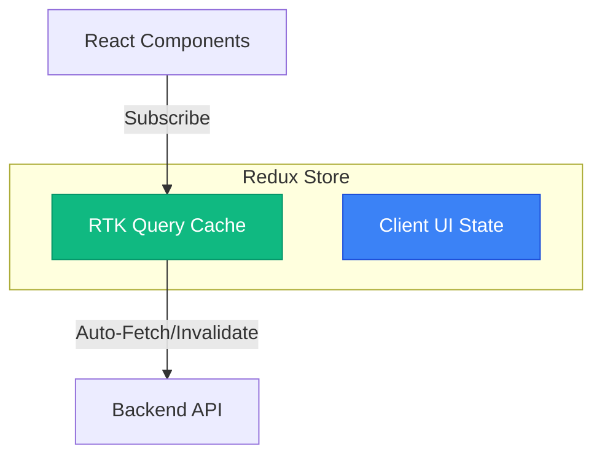

# RTK Query: Архітектура Серверного Кешу

**RTK Query** — це не просто "fetcher" даних. Це повноцінний **Server State Manager**, який інтегрований у Redux Toolkit. Він перевертає уявлення про те, як ми працюємо з даними на клієнті, зміщуючи фокус з "ручного управління loading/error/data" на "декларативне описування залежностей".

Цей гайд — глибоке занурення в RTK Query. Ми не будемо зупинятися на банальному "як зробити GET запит". Ми розберемо життєвий цикл кешу, стратегії інвалідації при мутаціях, оптимістичні оновлення зі складними rollback-сценаріями, інтеграцію з WebSockets, Server-Side Rendering (SSR) та складну автентифікацію.

---

## Частина 1: Філософія – Server State vs Client State

У традиційному Redux (до 2020 року) ми змішували все в одну купу.

**Client State**: Теми (світла/темна), форми (isModalOpen), фільтри. Це дані, якими володіє **клієнт**. Вони синхронні і надійні.

**Server State**: Список юзерів, деталі товару. Це дані, якими володіє **сервер**. Клієнт має лише _кеш_ (snapshot) цих даних на певний момент часу. Цей кеш:

1.  Асинхронний.
2.  Може застаріти будь-якої миті.
3.  Потребує оновлення, дедуплікації та синхронізації.

Коли ми намагаємося керувати Server State методами Client State (ручні редюсери, `isFetching` прапорці), ми отримуємо "спагетті-код", баги з race conditions та застарілі дані.

**RTK Query вирішує ці проблеми, беручи на себе управління Server State.**

::mermaid



::

---

## Частина 2: `createApi` – Серце Системи

`createApi` — це фабрика, яка генерує "слайс" для API. Але на відміну від `createSlice`, вона генерує не тільки редюсер, а й middleware та хуки.

```javascript
import { createApi, fetchBaseQuery } from '@reduxjs/toolkit/query/react'

export const api = createApi({
    reducerPath: 'api', // Унікальний ключ в Redux state
    baseQuery: fetchBaseQuery({ baseUrl: '/api' }),
    endpoints: (builder) => ({
        // ... endpoints
    }),
})
```

### Що відбувається під капотом?

Коли ви викликаєте `createApi`:

1.  Створюється **стандартний Redux Slice**, який зберігає кеш.
2.  Створюється **Middleware**, який перехоплює дії (actions) типу `api/executeQuery/pending`, керує мережевими запитами та Promises.
3.  Генеруються **React Hooks**, які (увага!) не просто викликають запит, а **підписуються** на оновлення стору.

### `fetchBaseQuery` – Це не просто fetch

Це легка обгортка над `fetch`, яка:

- Автоматично обробляє заголовки.
- Парсить JSON.
- Викидає помилки для 4xx/5xx статусів (на відміну від нативного `fetch`).

Ви можете написати свій власний `baseQuery` (наприклад, використовуючи Axios або GraphQL client).

```javascript
/* Custom Base Query з Axios */
const axiosBaseQuery =
    ({ baseUrl } = { baseUrl: '' }) =>
    async ({ url, method, data, params }) => {
        try {
            const result = await axios({ url: baseUrl + url, method, data, params })
            return { data: result.data }
        } catch (axiosError) {
            let err = axiosError
            return {
                error: {
                    status: err.response?.status,
                    data: err.response?.data || err.message,
                },
            }
        }
    }
```

---

## Частина 3: Анатомія Query Endpoint

Query — це операція читання (READ).

```javascript
getPost: builder.query({
    query: (id) => `post/${id}`,
    // Опції...
})
```

### Життєвий цикл запиту (Cache Lifecycle)

Це найважливіша частина. Як RTK Query розуміє, коли робити запит, а коли брати з кешу?

1.  **Component Mount**: Компонент викликає `useGetPostQuery(1)`.
2.  **Serialize Args**: Аргумент `1` серіалізується. Кеш-ключ стає `getPost(1)`.
3.  **Check Cache**: Чи є в сторі дані для `getPost(1)`?
    - Ні -> Dispatch `pending`, fetch data, save to store, dispatch `fulfilled`.
    - Так -> Повернути дані з кешу.
4.  **Subscription**: Компонент "підписується" на ключ `getPost(1)`. Лічильник підписників (reference count) стає 1.
5.  **Component Unmount**: Компонент зникає. Лічильник підписників стає 0.
6.  **Cleanup Timer**: Запускається таймер `keepUnusedDataFor` (за замовчуванням 60 сек).
7.  **Expiry**: Якщо за 60 сек ніхто знову не підписався на `getPost(1)`, дані видаляються з пам'яті.

### Conditional Fetching (`skip`)

Іноді нам не потрібно робити запит одразу.

```javascript
const { data } = useGetPostQuery(id, { skip: !id })
```

Якщо `skip: true`:

- Запит не відправляється.
- Статус стає `uninitialized`.
- Хук повертає `isUninitialized: true`.

### Polling (Авто-оновлення)

Для даних, які змінюються часто (наприклад, курси валют), можна увімкнути поллінг.

```javascript
const { data } = useGetRatesQuery(undefined, {
    pollingInterval: 3000, // Кожні 3 секунди
})
```

RTK Query розумний:

- Він зупиняє поллінг, коли вкладка втрачає фокус (переходить в фон).
- Відновлює, коли фокус повертається.
- Це можна налаштувати через `skipPollingIfUnfocused: false`.

### Validation з `transformResponse`

Часто сервер повертає дані, які нам не подобаються. Або ми хочемо валідувати схему (наприклад, з Zod).

```javascript
import { z } from 'zod';

const UserSchema = z.object({
  id: z.number(),
  name: z.string(),
});

getUsers: builder.query({
  query: () => 'users',
  transformResponse: (response) => {
    // Валідація! Якщо не пройде, випаде помилка
    const parsed = z.array(UserSchema).parse(response);

    // Трансформація: додаємо computed fields
    return parsed.map(user => ({
        ...user,
        displayName: user.name.toUpperCase()
    }));
  },
}),
```

---

## Частина 4: Анатомія Mutation Endpoint

Mutation — це операція зміни (CREATE, UPDATE, DELETE).

```javascript
updatePost: builder.mutation({
    query: ({ id, ...patch }) => ({
        url: `post/${id}`,
        method: 'PATCH',
        body: patch,
    }),
})
```

### Відмінності від Query

1.  **Немає кешування результатів**: Мутації зазвичай не кешуються так, як запити.
2.  **Trigger Function**: Хук повертає масив `[trigger, result]`. Ви самі викликаєте `trigger()`, коли користувач натискає кнопку.
3.  **Lifecycle**: Кожен виклик `trigger` створює новий запис (але можна налаштувати `fixedCacheKey` для шарінгу статусу між компонентами).

```javascript
const [updatePost, { isLoading }] = useUpdatePostMutation()

const handleSave = async () => {
    try {
        await updatePost({ id: 1, title: 'New' }).unwrap()
        // unwrap() дозволяє ловити помилки через try/catch
    } catch (err) {
        console.error(err)
    }
}
```

---

## Частина 5: Cache Invalidation (Теги)

Це магія, яка пов'язує Queries і Mutations. Як сказати списку постів оновитися, коли ми додали новий пост?

У "старому" світі ми б робили це вручну. У RTK Query ми використовуємо **Tags**.

### Система Тегів

1.  **Оголошення**: `tagTypes: ['Post', 'User']` в `createApi`.
2.  **Надання (Provides)**: Query каже: "Я надаю дані, пов'язані з тегом 'Post'".
3.  **Інвалідація (Invalidates)**: Mutation каже: "Я змінила дані, пов'язані з тегом 'Post'. Всі, хто залежить від цього тегу — оновіться!".

### Простий приклад

```javascript
getPosts: builder.query({
  query: () => 'posts',
  providesTags: ['Post'],
}),
addPost: builder.mutation({
  query: (body) => ({ url: 'posts', method: 'POST', body }),
  invalidatesTags: ['Post'],
})
```

1.  `getPosts` завантажив дані і позначив їх тегом `Post`.
2.  `addPost` виконався успішно. Middleware бачить `invalidatesTags: ['Post']`.
3.  Він шукає в кеші всі queries, які `providesTags: ['Post']`.
4.  Він знаходить `getPosts`.
5.  Він примусово робить re-fetch для `getPosts`.
6.  UI оновлюється автоматично.

### Advanced Tagging: Granular Invalidation

Що робити, якщо ми оновили _один_ пост? Навіщо перечитувати _весь_ список? Або навпаки, якщо ми оновили пост #5, чи треба оновлювати список?

Потрібна гранулярність. Теги можуть бути об'єктами: `{ type: 'Post', id: 5 }`.

**Сценарій 1: Список та Деталі**

```javascript
getPosts: builder.query({
  query: () => 'posts',
  // Повертає масив тегів:
  // [ { type: 'Post', id: 1 }, { type: 'Post', id: 2 }, ..., { type: 'Post', id: 'LIST' } ]
  providesTags: (result) =>
    result
      ? [
          ...result.map(({ id }) => ({ type: 'Post', id })),
          { type: 'Post', id: 'LIST' },
        ]
      : [{ type: 'Post', id: 'LIST' }],
}),

getPost: builder.query({
  query: (id) => `posts/${id}`,
  providesTags: (result, error, id) => [{ type: 'Post', id }],
}),
```

**Сценарій 2: Мутації**

```javascript
// Оновлення одного поста
updatePost: builder.mutation({
  query: ({ id, ...patch }) => ...,
  // Інвалідує ТІЛЬКИ цей пост. Список НЕ буде перечитано (якщо він не 'provides' цей конкретний ID)
  // АЛЕ, оскільки наш список (вище) 'provides' всі ID, то і список оновиться.
  // Це правильна поведінка, бо title міг змінитися і в списку.
  invalidatesTags: (result, error, { id }) => [{ type: 'Post', id }],
}),

// Додавання нового поста
addPost: builder.mutation({
  query: (body) => ...,
  // Інвалідує "LIST". Це змусить getPosts перечитатися повністю.
  invalidatesTags: [{ type: 'Post', id: 'LIST' }],
}),
```

---

## Частина 6: Optimistic Updates (Оптимістичні Оновлення)

Інвалідація тегів — це круто, але це "Pessimistic Update".

1.  Клік "Like".
2.  Spinner... (чекаємо відповіді сервера).
3.  Успіх. Re-fetch даних.
4.  UI оновлюється (Лайк з'явився).

**Optimistic Update**:

1.  Клік "Like".
2.  UI оновлюється МИТТЄВО.
3.  Фоновий запит на сервер.
4.  Якщо помилка — відкатуємо зміни (Rollback).

В RTK Query це реалізується через `onQueryStarted`.

### Реалізація Optimistic "Like"

```javascript
likePost: builder.mutation({
  query: (id) => ({
    url: `posts/${id}/like`,
    method: 'POST',
  }),
  // lifecycle hook mutations
  async onQueryStarted(id, { dispatch, queryFulfilled }) {
    // 1. Оптимістично оновлюємо кеш `getPost(id)`
    const patchResult = dispatch(
      api.util.updateQueryData('getPost', id, (draft) => {
        // draft — це Immer draft. Можемо мутувати!
        draft.likes += 1;
        draft.likedByUser = true;
      })
    )

    // 2. Також оновлюємо `getPosts` (список), якщо треба
    const listPatchResult = dispatch(
        api.util.updateQueryData('getPosts', undefined, (draft) => {
             const post = draft.find(p => p.id === id);
             if (post) {
                 post.likes += 1;
                 post.likedByUser = true;
             }
        })
    );

    try {
      // 3. Чекаємо реальної відповіді сервера
      await queryFulfilled
    } catch {
      // 4. ПОМИЛКА! Відкатуємо зміни
      patchResult.undo();
      listPatchResult.undo();

      // Можна показати тост
      toast.error("Не вдалося лайкнути. перевірте інтернет.");
    }
  },
}),
```

Це UX рівня Facebook/Twitter. Користувач не відчуває затримки мережі.

---

## Частина 7: Streaming Updates (WebSockets)

Що як сервер присилає дані сам? (WebSockets, Server-Sent Events).
RTK Query може інтегрувати пуш-повідомлення прямо в кеш.

Використовуємо `onCacheEntryAdded`.

### Чат (WebSocket інтеграція)

```javascript
getMessages: builder.query({
  query: (channelId) => `channels/${channelId}/messages`,

  async onCacheEntryAdded(
    channelId,
    { updateCachedData, cacheDataLoaded, cacheEntryRemoved }
  ) {
    // 1. Створюємо сокет
    const ws = new WebSocket('ws://localhost:8080');

    try {
      // 2. Чекаємо поки початкові дані завантажаться
      await cacheDataLoaded;

      // 3. Слухаємо події
      const listener = (event) => {
        const data = JSON.parse(event.data);
        if (data.channelId !== channelId) return;

        // 4. Оновлюємо кеш "на льоту"
        updateCachedData((draft) => {
          draft.push(data.message);
        });
      };

      ws.addEventListener('message', listener);
    } catch {
      // no-op handle errors
    }

    // 5. Cleanup при unmount (коли кеш видаляється)
    await cacheEntryRemoved;
    ws.close();
  },
}),
```

Це дозволяє вам мати **Real-time оновлення** без написання окремих редюсерів для сокетів! Весь стейт чату живе в одному endpoint.

---

## Частина 8: Code Splitting (injectEndpoints)

Для великих додатків не варто пхати всі 100+ endpoints в один файл `api.js`. Це роздуває бандл.
RTK Query дозволяє розбивати API на частини (code splitting) і завантажувати їх ліниво.

```javascript
/* src/api/baseApi.js */
// Порожній API об'єкт
export const baseApi = createApi({
  baseQuery: fetchBaseQuery({ baseUrl: '/' }),
  endpoints: () => ({}), // Порожньо!
});

/* src/features/users/usersApi.js */
import { baseApi } from '../../api/baseApi';

// Розширюємо baseApi
export const usersApi = baseApi.injectEndpoints({
  endpoints: (builder) => ({
    getUsers: builder.query({ ... }),
    updateUser: builder.mutation({ ... }),
  }),
  overrideExisting: false,
});

export const { useGetUsersQuery } = usersApi;
```

Ви можете імпортувати `usersApi` тільки там, де воно треба. Це ідеально для Lazy Loading маршрутів.

---

## Частина 9: Authentication & Re-auth

Це найскладніша частина для новачків. Як автоматично оновити токен, коли він протух?

В axios ми використовуємо interceptors. В RTK Query ми пишемо **wrapper around baseQuery**.

```javascript
import { fetchBaseQuery } from '@reduxjs/toolkit/query'
import { tokenReceived, loggedOut } from './authSlice'

const baseQuery = fetchBaseQuery({
    baseUrl: '/api',
    prepareHeaders: (headers, { getState }) => {
        const token = getState().auth.token
        if (token) {
            headers.set('authorization', `Bearer ${token}`)
        }
        return headers
    },
})

const baseQueryWithReauth = async (args, api, extraOptions) => {
    // 1. Спробуємо виконати запит
    let result = await baseQuery(args, api, extraOptions)

    // 2. Якщо 401 Unauthorized
    if (result.error && result.error.status === 401) {
        // 3. Спробуємо оновити токен
        const refreshResult = await baseQuery('/refresh', api, extraOptions)

        if (refreshResult.data) {
            // 4. Збережемо новий токен
            api.dispatch(tokenReceived(refreshResult.data))

            // 5. Повторимо початковий запит
            result = await baseQuery(args, api, extraOptions)
        } else {
            // 6. Якщо refresh не вдався - logout
            api.dispatch(loggedOut())
        }
    }

    return result
}

export const api = createApi({
    baseQuery: baseQueryWithReauth, // Використовуємо наш wrapper
    endpoints: () => ({}),
})
```

Цей код працює глобально для всіх endpoint-ів!

---

## Частина 10: Error Handling Patterns

Як глобально обробляти помилки (наприклад, 500 error)?
Для цього використовуємо middleware.

```javascript
import { isRejectedWithValue } from '@reduxjs/toolkit';

export const rtkQueryErrorLogger = (api) => (next) => (action) => {
  // RTK Query dispatch-ить спец. екшени при помилках
  if (isRejectedWithValue(action)) {
    console.warn('Ми зловили помилку RTK Query!');

    if (action.payload.status === 500) {
        toast.error('Сервер впав. Спробуйте пізніше.');
    }
  }

  return next(action);
};

// В store.js
middleware: (gDM) => gDM().concat(api.middleware, rtkQueryErrorLogger),
```

---

## Частина 11: TypeScript Advanced Typing

Типізація результатів — це просто. А як щодо типізації помилок?

```typescript
const api = createApi({
    baseQuery: fetchBaseQuery({ baseUrl: '/' }),
    endpoints: (builder) => ({
        getData: builder.query<
            ResultType, // Успішна відповідь
            ArgType // Аргумент (id etc)
        >({
            query: (arg) => `data/${arg}`,
        }),
    }),
})
```

Якщо ваш сервер повертає специфічні помилки `{ message: string, code: number }`, ви можете типізувати їх на рівні `baseQuery`.

```typescript
const baseQuery = fetchBaseQuery({ baseUrl: '/' })

const customBaseQuery: BaseQueryFn<
    string | FetchArgs, // args
    unknown, // result
    { message: string; code: number } // FetchBaseQueryError | CustomError
> = async (args, api, extraOptions) => {
    let result = await baseQuery(args, api, extraOptions)
    return result
}
```

---

## Частина 12: Testing (Тестування)

RTK Query — це просто функції та хуки. Ми можемо тестувати їх по-різному.

### 1. Unit Testing Reducers

Ми можемо тестувати редюсери, але це нудно.

### 2. Integration Testing with MSW (Mock Service Worker)

Це "золотий стандарт". Ми перехоплюємо мережеві запити.

```javascript
/* setupTests.js */
import { setupServer } from 'msw/node'
import { rest } from 'msw'

export const handlers = [
    rest.get('/api/user', (req, res, ctx) => {
        return res(ctx.json({ name: 'John Doe' }))
    }),
]

export const server = setupServer(...handlers)

/* User.test.js */
import { renderHook, waitFor } from '@testing-library/react'
import { Provider } from 'react-redux'
import { useGetUserQuery } from './api'
import { store } from './store' // реальний стор з API

function Wrapper({ children }) {
    return <Provider store={store}>{children}</Provider>
}

test('returns user data', async () => {
    const { result } = renderHook(() => useGetUserQuery(), { wrapper: Wrapper })

    // Спочатку loading
    expect(result.current.isLoading).toBe(true)

    // Чекаємо успіху
    await waitFor(() => expect(result.current.isSuccess).toBe(true))

    expect(result.current.data).toEqual({ name: 'John Doe' })
})
```

Ми не мокаємо RTK Query! Ми мокаємо мережу. Це дає нам 100% впевненість, що наш код працює.

---

## Частина 13: Server Side Rendering (SSR) & Rehydration

Якщо ви використовуєте Next.js (pages router) або SSR, вам потрібно передати стан з сервера на клієнт.

RTK Query має спеціальний action `hydrate`.

### Next.js Integration (Pages Router)

```javascript
import { createWrapper } from 'next-redux-wrapper'
import { api } from './api'

// Спеціальний reducer для гідрації
const rootReducer = (state, action) => {
    if (action.type === HYDRATE) {
        return { ...state, ...action.payload }
    }
    return combinedReducer(state, action)
}

export const wrapper = createWrapper(makeStore)

// В getServerSideProps
export const getServerSideProps = wrapper.getServerSideProps((store) => async (context) => {
    // 1. Dispatch запит
    store.dispatch(api.endpoints.getPosts.initiate())

    // 2. Чекаємо завершення ВСІХ запитів
    await Promise.all(store.dispatch(api.util.getRunningQueriesThunk()))

    return { props: {} }
})
```

### `extractRehydrationInfo`

У нових версіях RTK Query (v1.7+) це ще простіше.

```javascript
export const api = createApi({
    baseQuery: fetchBaseQuery({ baseUrl: '/' }),
    extractRehydrationInfo(action, { reducerPath }) {
        if (action.type === HYDRATE) {
            return action.payload[reducerPath]
        }
    },
    endpoints: () => ({}),
})
```

---

## Частина 14: Кейс-стаді: Infinite Scroll (Нескінченна прокрутка)

Реалізація нескінченної прокрутки з RTK Query.

Є два підходи:

1.  Окремі сторінки (Page 1, Page 2).
2.  Об'єднання (Merge) сторінок в один список.

Для Infinite Scroll підходить **Merge**.

```javascript
/* api.js */
getInfinitePosts: builder.query({
  query: (page) => `posts?page=${page}`,
  // Ця функція дозволяє мержити нові дані з існуючим кешем!
  serializeQueryArgs: ({ endpointName }) => {
    return endpointName; // Ігноруємо аргумент 'page' в ключі кешу
  },
  merge: (currentCache, newItems) => {
    currentCache.push(...newItems);
  },
  // Змушуємо refetch, коли змінюється сторінка (навіть якщо ключ той самий)
  forceRefetch({ currentArg, previousArg }) {
    return currentArg !== previousArg;
  },
}),
```

**В компоненті:**

```javascript
function Feed() {
    const [page, setPage] = useState(1)
    const { data: posts, isFetching } = useGetInfinitePostsQuery(page)

    return (
        <div>
            {posts.map((post) => (
                <Post key={post.id} data={post} />
            ))}
            <button onClick={() => setPage(page + 1)} disabled={isFetching}>
                Load More
            </button>
        </div>
    )
}
```

Тут ми використовуємо `serializeQueryArgs`, щоб сказати RTK Query: "Всі сторінки належать до одного запису в кеші". А `merge` — "Додавай нові дані в кінець масиву".

---

## Частина 15: Migration Guide (Thunks -> RTK Query)

У вас є старий код на `createAsyncThunk`. Як мігрувати?

1.  **Не переписуйте все одразу!** RTK Query і Thunks можуть жити разом в одному сторі.
2.  Створіть `api` слайс.
3.  Почніть з простих GET запитів. Видаліть відповідні thunks і extraReducers.
4.  Складні POST запити з оптимістичними оновленнями залиште на потім.

**Приклад міграції:**

_Before (Thunk):_

```javascript
// thunks.js
export const fetchUser = createAsyncThunk('user/fetch', async (id) => {
    const res = await fetch(`/users/${id}`)
    return res.json()
})

// slice.js
extraReducers: (builder) => {
    builder.addCase(fetchUser.fulfilled, (state, action) => {
        state.user = action.payload
    })
}
```

_After (RTK Query):_

```javascript
// api.js
getUser: builder.query({
    query: (id) => `users/${id}`,
})

// component.js
const { data: user } = useGetUserQuery(id)
```

Ми видалили:

- Thunk
- Slice reducers
- Loading state logic
- Error state logic

---

## Частина 16: FAQ

### П: Чи можна використовувати RTK Query без React?

**В: Так!** RTK Query — це фреймворк-агностик бібліотека. Хуки (`useQuery`) — це лише обгортка. Ви можете використовувати `api.endpoints.getUsers.initiate()` в будь-якому JS коді (наприклад, Vue, Svelte, Angular або Node.js).

### П: Як зробити запит, який залежить від результату іншого запиту?

**В: Chain Queries.** Використовуйте `skip`.

```javascript
const { data: user } = useGetUserQuery(id)
const { data: posts } = useGetPostsQuery(user?.id, {
    skip: !user, // Чекаємо поки user завантажиться
})
```

### П: Чи варто використовувати RTK Query для форм (login)?

**В: Так.** Login — це мутація (`login` mutation). Вона повертає токен, який ви зберігаєте в authSlice.

### П: Як очистити кеш?

**В: `api.util.resetApiState()`** — очищає весь кеш. Корисно при логауті.

---

## Частина 17: Benchmarking

RTK Query надзвичайно ефективний завдяки підходу до підписок. Він не робить diffing глибоких об'єктів стейту, як це робить `useSelector`.

Він перевіряє лише посилання.

| Feature                  | RTK Query            | React Query | SWO  | Apollo       |
| :----------------------- | :------------------- | :---------- | :--- | :----------- |
| **Backend**              | Any                  | Any         | Any  | GraphQL      |
| **Size (gzip)**          | ~2kb (on top of RTK) | ~13kb       | ~4kb | ~30kb        |
| **Dependant Queries**    | ✅                   | ✅          | ✅   | ✅           |
| **Normalized Cache**     | ❌ (Document Cache)  | ❌          | ❌   | ✅           |
| **Auto-Generated Hooks** | ✅                   | ❌          | ❌   | ✅ (CodeGen) |

**Чому Document Cache це добре?**
Normalized Cache (як в Apollo) дуже складний для підтримки. Document Cache (кешування відповідей) — простий і передбачуваний. RTK Query використовує теги для симуляції Normalized поведінки (інвалідації), що дає найкраще з обох світів.

---

---

## Частина 18: Debugging with Redux DevTools

Redux DevTools — це ваші очі. Якщо щось не працює, дивіться сюди.

### Ключові Actions

RTK Query dispatch-ить специфічні actions, за якими треба стежити:

1.  `api/executeQuery/pending`: Початок запиту.
2.  `api/executeQuery/fulfilled`: Успіх. Payload містить дані.
3.  `api/executeQuery/rejected`: Помилка.
4.  `api/subscriptions/internal_subscribe`: Компонент змонтувався і підписався.
5.  `api/subscriptions/internal_unsubscribe`: Компонент розмонтувався.

### Типові проблеми в DevTools

- **Запит не відправляється**:
    - Перевірте, чи є `internal_subscribe`. Якщо ні — ви не викликали хук або передали `skip: true`.
    - Перевірте `args`. Якщо вони `undefined` (а не мали бути), RTK Query може пропустити запит.
- **Запит зациклився (Infinite Loop)**:
    - Ви бачите сотні `pending` -> `fulfilled` за секунду.
    - Причина: ви передаєте новий об'єкт в аргументи на кожному рендері: `useGetPostsQuery({ page: 1 })`. `{ page: 1 } !== { page: 1 }`.
    - Рішення: `useMemo` або стабільні примітиви.

---

## Частина 19: Anti-Patterns & Common Pitfalls

Як **НЕ треба** робити.

### 1. `useEffect` для синхронізації

❌ **Погано**:

```javascript
const { data } = useGetPostsQuery()
const [localPosts, setLocalPosts] = useState([])

useEffect(() => {
    if (data) setLocalPosts(data)
}, [data])
```

✅ **Добре**:
Використовуйте `data` напряму! Якщо треба трансформувати — `transformResponse` або `selectFromResult`.

### 2. Ігнорування `isLoading`

❌ **Погано**:

```javascript
const { data } = useGetPostsQuery();
return <div>{data.map(...)}</div>; // Crash! data is undefined initially
```

✅ **Добре**:
Завжди перевіряйте `isLoading` або використовуйте `data?.map`.

### 3. Передчасна оптимізація кешу

Не намагайтеся вручну керувати кешем (`updateQueryData`), якщо вам це не критично. Інвалідація тегів — простіша і надійніша. Робіть Optimistic Updates тільки там, де UX цього вимагає (лайки, повідомлення).

---

## Частина 20: Advanced Pattern: `transformErrorResponse`

Що як бекенд повертає 200 OK, але в тілі `{ status: 'error', message: 'Validation failed' }`?
RTK Query подумає, що все добре. Нам треба це виправити.

```javascript
fetchBaseQuery({
    baseUrl: '/api',
    // Перехоплюємо відповідь
    responseHandler: async (response) => {
        const text = await response.text()
        const json = text.length ? JSON.parse(text) : {}

        if (json.status === 'error') {
            // Викидаємо помилку, щоб RTK Query перевів запит в rejected
            throw { status: 500, data: json }
        }

        return json
    },
})
```

Або, якщо вам треба просто нормалізувати помилки:

```javascript
endpoints: (builder) => ({
    getUsers: builder.query({
        query: () => 'users',
        // Трансформуємо помилку в зручний формат
        transformErrorResponse: (response, meta, arg) => {
            return {
                message: response.data?.message || 'Unknown Error',
                code: response.status
            };
        },
    }),
}),
```

---

## Частина 21: Architecture: Where to put Logic?

Часте питання: "Де писати бізнес-логіку? В компоненті, в thunk чи в `transformResponse`?"

### 1. `transformResponse`

Ідеально для **форматування** даних.

- Date String -> Date Object
- Array -> Map (для швидкого пошуку)
- Sorting / Filtering

### 2. `onQueryStarted`

Для **Side Effects**, які стосуються API.

- Toast notifications
- Analytics logging
- Global error handling navigation (redirect to login)

### 3. Components

Для **View Logic**.

- Відображення спінера
- Форматування дати для UI (Intl.DateTimeFormat)

### 4. Custom Hooks

Якщо логіка використовується в декількох місцях.

```javascript
export const useActiveUsers = () => {
    const { data } = useGetUsersQuery()
    // Селектор-логіка
    return useMemo(() => data?.filter((u) => u.isActive) ?? [], [data])
}
```

---

---

## Частина 22: Prefetching for Instant UX

Найшвидший запит — це той, який вже зроблений.
`usePrefetch` дозволяє завантажити дані **до** того, як користувач перейде на сторінку.

### Pattern: onMouseEnter

```javascript
import { usePrefetch } from './api'

function UserList({ users }) {
    const prefetchUser = usePrefetch('getUser')

    return (
        <div>
            {users.map((user) => (
                <Link key={user.id} to={`/users/${user.id}`} onMouseEnter={() => prefetchUser(user.id)}>
                    {user.name}
                </Link>
            ))}
        </div>
    )
}
```

### Pattern: Automatic Prefetching (Waterfalls)

Якщо у вас є вкладені запити, ви можете почати завантаження другого рівня ще на сервері або на початку першого.

```javascript
/* Prefecthing in Route component */
function UserPage({ id }) {
    useGetUserQuery(id); // Завантажуємо User
    usePrefetch('getUserPosts')(id); // Паралельно починаємо вантажити пости!

    return ...
}
```

Використовуйте `prefetch` обережно, щоб не перевантажити мережу.

---

## Висновок

RTK Query — це інструмент "швейцарський ніж" для роботи з даними.

- Він усуває необхідність писати тисячі рядків boilerplate коду для data fetching.
- Він вчить нас думати про дані як про **кеш**, а не як про локальну змінну.
- Він надає просунуті інструменти (Optimistic Updates, Websockets) з коробки.

Перехід на RTK Query часто зменшує розмір кодової бази Redux-додатку на 50-70%.

::card-group
::card{title="Quiz: RTK Query" icon="i-lucide-award"}
Перевірте, як добре ви зрозуміли концепцію Тегів та Інвалідації.
::
::card{title="Наступний крок: Архітектура" icon="i-lucide-layout" link="./03.architecture-best-practices.md"}
Як організувати великий Redux додаток: Folder Structure, FSD, Ducks.
::
::
