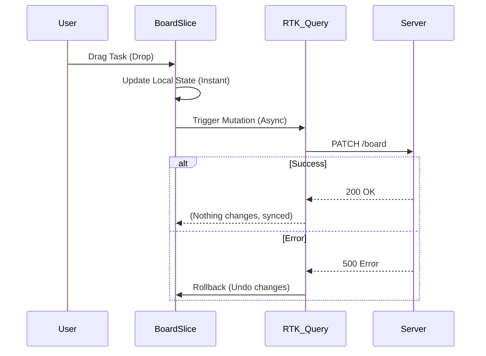

# Проєкт: Kanban Board (Trello Clone)

Щоб закріпити знання Redux Toolkit та RTK Query, ми створимо повноцінний додаток — клон Trello.
Це не просто "Todo list". Це складний додаток зі складною логікою переміщення карток, оптимістичними оновленнями та синхронізацією з сервером.

## Технічний стек

Ми будемо використовувати сучасний набір інструментів:

- **React 18**: UI бібліотека.
- **Redux Toolkit**: Управління клієнтським станом (drag & drop, UI state).
- **RTK Query**: Управління серверним станом (caching, synchronization).
- **React Beautiful DnD**: Бібліотека для Drag-and-Drop.
- **Tailwind CSS**: Стилізація.
- **Mock Service Worker (MSW)** або **MirageJS**: Для емуляції бекенду.

## Функціональні вимоги

1.  **Колонки**: Створення, видалення, перейменування, зміна порядку.
2.  **Завдання (Tasks)**: Створення, редагування, видалення.
3.  **Drag & Drop**:
    - Переміщення завдань всередині колонки.
    - Переміщення завдань між колонками.
    - Переміщення самих колонок.
4.  **Асинхронність**: Всі зміни мають зберігатися на сервері.
5.  **Optimistic Updates**: Інтерфейс має оновлюватися миттєво, не чекаючи відповіді сервера.

## Проєктування Структури Даних

Це найважливіший етап. Якщо ми неправильно спроєктуємо структуру даних, нам буде дуже важко писати редюсери для Drag & Drop.

### API Response Shape

Наш бекенд повертає дані в такому форматі:

```json
{
    "columns": [
        {
            "id": "column-1",
            "title": "To Do",
            "taskIds": ["task-1", "task-2"] // Порядок завдань важливий!
        },
        {
            "id": "column-2",
            "title": "In Progress",
            "taskIds": []
        }
    ],
    "tasks": [
        { "id": "task-1", "content": "Налаштувати Redux" },
        { "id": "task-2", "content": "Створити слайси" }
    ],
    "columnOrder": ["column-1", "column-2"] // Порядок колонок
}
```

### Redux State Shape (Normalized)

Ми будемо використовувати **нормалізовану структуру** для максимальної продуктивності.
Завдання не будуть жити всередині колонок. Вони будуть жити окремо.

```typescript
interface RootState {
    // Кеш RTK Query для серверних даних
    api: ApiState

    // Локальний UI стан (наприклад, яка модалка відкрита)
    ui: UiState

    // Дані дошки (ми дублюємо їх тут для миттєвого Drag&Drop)
    board: {
        tasks: {
            ids: string[]
            entities: Record<string, Task>
        }
        columns: {
            ids: string[]
            entities: Record<string, Column>
        }
        columnOrder: string[]
    }
}
```

::alert{type="info"}
**Чому ми дублюємо дані в `board` slice, якщо вони вже є в кеші RTK Query?**
Drag & Drop вимагає _миттєвих_ синхронних оновлень локального стану. Кеш RTK Query призначений для синхронізації з сервером, і маніпулювати ним вручну для складних dnd-операцій може бути незручно.
Ми використаємо гібридний підхід:

1.  RTK Query завантажує дані.
2.  Ми копіюємо їх в локальний slice `board`.
3.  Всі dnd-операції відбуваються в `board` (миттєво).
4.  У фоні ми відправляємо мутації через RTK Query для синхронізації з сервером.
    ::

## Схема взаємодії

::mermaid



::

Це архітектура професійного рівня. Вона забезпечує ідеальну чутливість інтерфейсу (60 FPS) і надійність даних.

👉 [Далі: Налаштування середовища та типізація](./02.setup-and-types.md)
